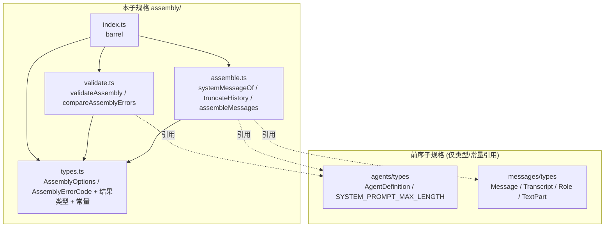

# 设计文档：智能体对话装配 (agent-conversation-assembly)

## Overview

「智能体对话装配」(agent-conversation-assembly) 是女娲 Nuwa「多智能体工作流编排引擎」的**第八个子规格**，把 `AgentDefinition`（系统提示）与 `Transcript`（对话历史）装配为发送给语言模型的有效消息序列。实现位于 `app/web/src/lib/assembly/`。本层为**纯库**：无 I/O、无 React、无网络、无可变全局状态、不调用模型、对相同输入恒返回相同输出。

### 设计目标

1. **纯数据 + 纯函数**（R1）。
2. **确定装配**：系统消息置首 + 历史，按 Max_Messages 最近优先截断（R4、R5）。
3. **结果类型表达错误**：`validateAssembly` 返回 `{ valid, errors }`，错误为带稳定 `AssemblyErrorCode` 的 `AssemblyError`（R6）。
4. **错误码跨层互斥**：`AssemblyErrorCode` 全部 `ASSEMBLY_` 前缀，与前七层枚举两两不相交（R7）。
5. **复用前序层**：以类型引用 `AgentDefinition`（含 `id`/`systemPrompt`）、`Message`/`Transcript`/`Role`/`TextPart`，以值引用 `SYSTEM_PROMPT_MAX_LENGTH`（agents 层常量）。不重定义。

### 与前序子规格的关系

`systemMessageOf` 产出 agent-message-protocol 的 `Message`（role `system`，单个 `TextPart`）。`validateAssembly` 复用 agents 层 `SYSTEM_PROMPT_MAX_LENGTH` 作为系统提示长度上界。错误码互斥性质静态引用前七层枚举。

## Architecture

### 模块依赖关系



依赖**无环**：`types` 叶子；`assemble`/`validate` 依赖 types；`index` 再导出。

### 设计决策与理由

- **决策 1：系统消息 Id 确定派生。** `systemMessageOf(agent)` 的 Message_Id = `SYSTEM_MESSAGE_ID_PREFIX + agent.id`，使派生确定且可追溯（R2.3）。
- **决策 2：截断为「保留后缀」。** `truncateHistory(messages, max)` 返回 `messages.slice(Math.max(0, messages.length - max))`，恒为原列表后缀，长度 `min(len, max)`（R5）。
- **决策 3：装配先拼后截。** `assembleMessages` 先构造 `[system, ...transcript.messages]`，无 Max_Messages 则直接返回；有 Max_Messages 则保留系统消息并对历史截断至 `max - 1` 条（当 `max>=1`），使总长度 = `min(1+historyLen, max)`；当 `max===1` 仅返回 `[system]`（R4、R8.4）。
- **决策 4：稳定排序比较器。** `compareAssemblyErrors` 先按 `AssemblyErrorCode` 声明序、再按 `field` 字典序（R6.5）。

## Components and Interfaces

### `assembly/types.ts`

```typescript
/** 装配选项（R3.1）。 */
export interface AssemblyOptions {
  readonly maxMessages?: number; // Max_Messages：整数 ≥ 1；缺省表示不截断（R3.2、R3.3）
}

/** 错误码（R7.1）：全部 ASSEMBLY_ 前缀，与前七层枚举不相交（R7.2–R7.8）。 */
export enum AssemblyErrorCode {
  ASSEMBLY_SYSTEM_PROMPT_TOO_LONG = 'ASSEMBLY_SYSTEM_PROMPT_TOO_LONG', // R6.2
  ASSEMBLY_MAX_MESSAGES_INVALID = 'ASSEMBLY_MAX_MESSAGES_INVALID',     // R6.3
}

/** 错误定位信息（R7.9）。 */
export interface AssemblyErrorLocation {
  readonly field?: string;
}

/** 单条错误值（R7.9）。 */
export interface AssemblyError {
  readonly code: AssemblyErrorCode;
  readonly message: string;
  readonly location: AssemblyErrorLocation;
}

/** 校验结果（R6.1）。valid 为真 ⇔ errors 为空。 */
export interface AssemblyValidationResult {
  readonly valid: boolean;
  readonly errors: readonly AssemblyError[];
}

/** 派生 System_Message 的 Message_Id 前缀（R2.3）。 */
export const SYSTEM_MESSAGE_ID_PREFIX = 'system:';
```

### `assembly/assemble.ts`

```typescript
import type { AgentDefinition } from '../agents/types';
import type { Message, Transcript } from '../messages/types';
import type { AssemblyOptions } from './types';

/** 从智能体派生系统消息（R2）：role 'system'、单个 text 片段 = systemPrompt、id = 前缀+agentId。 */
export function systemMessageOf(agent: AgentDefinition): Message;

/** 最近优先截断（R5）：返回 messages 末尾 maxMessages 条（原后缀），长度 min(len, max)。 */
export function truncateHistory(messages: readonly Message[], maxMessages: number): readonly Message[];

/** 装配有效消息序列（R4、R8）：system 置首 + 历史（按 Max_Messages 截断）。 */
export function assembleMessages(
  agent: AgentDefinition,
  transcript: Transcript,
  options?: AssemblyOptions,
): readonly Message[];
```

### `assembly/validate.ts`

```typescript
import type { AgentDefinition } from '../agents/types';
import type { AssemblyOptions, AssemblyValidationResult, AssemblyError } from './types';

/** 装配校验（R6）：systemPrompt 长度上界、maxMessages 合法性；完整报告、稳定排序、确定。 */
export function validateAssembly(agent: AgentDefinition, options?: AssemblyOptions): AssemblyValidationResult;

/** 稳定排序比较器：先按 AssemblyErrorCode 声明序，再按 field 字典序。 */
export function compareAssemblyErrors(a: AssemblyError, b: AssemblyError): number;
```

### `assembly/index.ts`

barrel 模块，统一再导出全部公共 API 与类型。

## Data Models

### Assembled_Message_List 结构不变量

| 不变量 | 说明 | 需求 |
|---|---|---|
| 非空 | 长度 ≥ 1 | R8.1 |
| 首元素 | Role 为 `system` | R8.1 |
| 历史 | 除首元素外均来自 transcript | R8.2 |
| 后缀 | 历史部分为 transcript 消息序列的后缀 | R8.3 |
| max=1 | 仅含 System_Message | R8.4 |
| 长度 | 提供 max 时 ≤ max；否则 = 1 + historyLen | R4.5 |

## 关键算法

### 算法 1：`systemMessageOf`（R2）

```
systemMessageOf(agent):
  return {
    id: SYSTEM_MESSAGE_ID_PREFIX + agent.id,
    role: 'system',
    parts: [ { kind: 'text', text: agent.systemPrompt } ],
  }
```

### 算法 2：`truncateHistory`（R5）

```
truncateHistory(messages, maxMessages):
  if messages.length <= maxMessages: return [...messages]      // 不截断（R5.2）
  return messages.slice(messages.length - maxMessages)         // 保留末尾 maxMessages 条（R5.3）
```

- 长度 = `min(len, max)`（R5.4）；结果恒为原列表后缀（R5.5）。

### 算法 3：`assembleMessages`（R4、R8）

```
assembleMessages(agent, transcript, options):
  system = systemMessageOf(agent)
  history = transcript.messages
  if options?.maxMessages is undefined:
      return [system, ...history]                              // 不截断（R4.3）
  max = options.maxMessages
  if max <= 1: return [system]                                 // 上限为 1 仅系统消息（R8.4）
  keptHistory = truncateHistory(history, max - 1)              // 历史截断到 max-1
  return [system, ...keptHistory]                              // 总长 = min(1+historyLen, max)（R4.4、R4.5）
```

- 注：当 `max >= 1+historyLen` 时不发生截断（R4.3）。当 `1+historyLen > max` 时，结果长度恰为 `max`，历史为最近的 `max-1` 条（R4.4）。

### 算法 4：`validateAssembly`（R6，完整报告、稳定排序）

```
validateAssembly(agent, options):
  errors = []
  if [...agent.systemPrompt].length > SYSTEM_PROMPT_MAX_LENGTH
        -> push(ASSEMBLY_SYSTEM_PROMPT_TOO_LONG, field='systemPrompt')     // R6.2
  if options?.maxMessages is defined and !(Number.isInteger(max) && max >= 1)
        -> push(ASSEMBLY_MAX_MESSAGES_INVALID, field='maxMessages')        // R6.3
  errors.sort(compareAssemblyErrors)
  return { valid: errors.length === 0, errors }
```

## Correctness Properties

*性质 (property) 是应在系统所有合法执行中恒成立的特征或行为。* 下列性质均为全称量化的可属性测试陈述。数据模型形态由编译保证不出性质。

### Property 1: 系统消息形状与确定性
*对任意* `AgentDefinition` `a`，`systemMessageOf(a)` 的 role 为 `system`、parts 恰含一个 text 片段且其 text 等于 `a.systemPrompt`、id 等于 `SYSTEM_MESSAGE_ID_PREFIX + a.id`；两次调用返回相等结果。
**Validates: Requirements 2.1, 2.2, 2.3, 2.4**

### Property 2: truncateHistory 长度与后缀
*对任意* 消息列表 `ms` 与整数 `max ≥ 1`，`truncateHistory(ms, max)` 的长度等于 `min(ms.length, max)`，且其结果逐元素等于 `ms` 的对应后缀（即 `ms.slice(ms.length - 结果.length)`）。
**Validates: Requirements 5.1, 5.3, 5.4, 5.5**

### Property 3: truncateHistory 不截断分支
*对任意* 消息列表 `ms` 与整数 `max ≥ ms.length`，`truncateHistory(ms, max)` 逐元素等于 `ms`（不截断）。
**Validates: Requirements 5.2**

### Property 4: 装配首元素为系统消息
*对任意* `a`、`transcript` `t` 与 `options`，`assembleMessages(a, t, options)` 非空，其首元素经引用相等于 `systemMessageOf(a)` 的语义（role `system`、text 等于 systemPrompt、id 等于前缀+agentId）。
**Validates: Requirements 4.2, 8.1**

### Property 5: 无上限装配等于系统消息后接全部历史
*对任意* `a` 与 `t`，`assembleMessages(a, t, undefined)`（或 options 不含 maxMessages）逐元素等于 `[systemMessageOf(a), ...t.messages]`，长度等于 `1 + t.messages.length`。
**Validates: Requirements 4.3, 4.5**

### Property 6: 超限装配长度恰为上限且历史为最近后缀
*对任意* `a`、`t` 与整数 `max`，满足 `2 ≤ max < 1 + t.messages.length`，`assembleMessages(a, t, { maxMessages: max })` 长度恰为 `max`，其首元素为系统消息，其余 `max-1` 条逐元素等于 `t.messages` 的末尾 `max-1` 条（最近后缀）。
**Validates: Requirements 4.4, 8.3**

### Property 7: 上限为 1 仅系统消息
*对任意* `a` 与 `t`，`assembleMessages(a, t, { maxMessages: 1 })` 恰为单元素列表 `[systemMessageOf(a)]`。
**Validates: Requirements 8.4**

### Property 8: 装配长度上界
*对任意* `a`、`t` 与含 `maxMessages = max`（`max ≥ 1`）的 options，`assembleMessages(a, t, options)` 的长度不超过 `max`；当不含 maxMessages 时长度等于 `1 + t.messages.length`。
**Validates: Requirements 4.5**

### Property 9: 装配历史均来自 transcript 且为后缀
*对任意* `a`、`t` 与 `options`，`assembleMessages(a, t, options)` 除首元素外的每条消息均为 `t.messages` 中的消息，且该尾部子序列逐元素等于 `t.messages` 的一个后缀。
**Validates: Requirements 8.2, 8.3**

### Property 10: 装配确定性与不可变性
*对任意* `a`、`t` 与 `options`，两次 `assembleMessages` 返回逐元素相同的列表；调用不改变 `a`、`t`、`options`（以调用前后序列化比较）。
**Validates: Requirements 1.3, 1.4, 4.6**

### Property 11: 校验逐类违规检测
*对任意* `a` 与 `options`：当 `a.systemPrompt` 长度超过 `SYSTEM_PROMPT_MAX_LENGTH` 时，`validateAssembly` 含 `ASSEMBLY_SYSTEM_PROMPT_TOO_LONG`(field=`systemPrompt`)；当 `options.maxMessages` 为非 `≥1` 整数（如 0、-1、1.5）时，含 `ASSEMBLY_MAX_MESSAGES_INVALID`(field=`maxMessages`)。
**Validates: Requirements 6.2, 6.3**

### Property 12: 校验结果 valid 当且仅当无错误且错误良构
*对任意* `a` 与 `options`，`validateAssembly(a, options).valid` 为真当且仅当 `errors` 为空；每条 AssemblyError 的 message 为非空字符串、location 为对象；两次调用相等。
**Validates: Requirements 6.1, 6.4, 6.5, 6.6, 7.9**

### Property 13: 合法输入校验通过
*对任意* `a` 其 systemPrompt 长度不超过上界、与 `options` 不含 maxMessages 或其 maxMessages 为 `≥1` 整数，`validateAssembly(a, options).valid` 为真。
**Validates: Requirements 6.4**

### Property 14: 错误码跨层互斥
*对任意* `AssemblyErrorCode` 取值 `c`，`c` 不出现于 `ErrorCode`、`ConfigErrorCode`、`ExecutorErrorCode`、`AgentErrorCode`、`ToolErrorCode`、`ResolutionErrorCode`、`MessageErrorCode` 任一取值集合（八层错误码两两不相交）。
**Validates: Requirements 7.2, 7.3, 7.4, 7.5, 7.6, 7.7, 7.8**

## Error Handling

本层不抛异常，全部错误以值表达。

- **校验错误**：`validateAssembly` 一次性收集全部违规（systemPrompt 超长、maxMessages 非法），按 `compareAssemblyErrors`（先按码声明序、再按 field）稳定排序；`valid` 与 `errors` 空互为充要。
- **错误码隔离**：`AssemblyErrorCode` 全部 `ASSEMBLY_` 前缀，与前七层枚举两两不相交。
- **装配的全函数性**：`assembleMessages`/`truncateHistory`/`systemMessageOf` 不校验、不抛异常；对任意输入（含 maxMessages 越界）均返回确定结果——`truncateHistory` 对 `max <= 0` 返回空列表（`slice` 行为），`assembleMessages` 对 `max <= 1` 返回 `[system]`，与校验分离（校验由 `validateAssembly` 负责）。

## Testing Strategy

本层为纯函数库，含大量普适性质（系统消息形状、截断后缀、装配长度/后缀不变量、校验分划），**高度适合属性测试 (PBT)**。

### 测试框架与运行

- 框架 `vitest`，属性库 `fast-check ^3`。单次运行 `npm run test`（`vitest --run`），在 `app/web` 目录。
- 每条属性测试 `numRuns` 至少 100。
- 文件布局：实现于 `app/web/src/lib/assembly/`；属性测试 `prop-01.test.ts`…`prop-14.test.ts`；示例测试 `example-*.test.ts`；生成器集中于 `arbitraries.ts`。
- 每文件首行注释：`// Feature: agent-conversation-assembly, Property N: <性质标题>`。

### 自定义 Arbitraries（`arbitraries.ts`）

- 复用 agents 层 `arbitraryValidAgentDefinition`（合法 agent，systemPrompt 短）与一个超长 systemPrompt 变体；复用 messages 层 `arbitraryValidMessage` 构造消息列表/Transcript。
- `arbitraryAgent`：合法 agent；`arbitraryLongPromptAgent`：systemPrompt 超过 SYSTEM_PROMPT_MAX_LENGTH。
- `arbitraryTranscriptOf(messages)` 或直接复用 messages 层 `arbitraryTranscript`。
- `arbitraryAssemblyOptions`：含 maxMessages（合法 ≥1 或越界 0/-1/1.5）或不含。
- `arbitraryMaxMessages`：`fc.integer({min:1,max:20})`。

### 单元 / 示例测试（`example-*.test.ts`）

- `example-system-message.test.ts`：具体 agent 的系统消息形状与 id。
- `example-truncate.test.ts`：具体列表的截断（不截断/截断保留最近/max=1）。
- `example-error-codes.test.ts`：`AssemblyErrorCode` 含 R7.1 列出的全部 2 个成员。
- `example-error-codes-disjoint.test.ts`：八层枚举取值两两不相交（Property 14 落地）。

### 验证清单（与需求映射）

| 需求簇 | 覆盖测试 |
|---|---|
| R2 系统消息 | Property 1 |
| R5 截断 | Property 2, 3 |
| R4 装配 | Property 4, 5, 6, 8, 10 |
| R8 结构不变量 | Property 4, 6, 7, 9 |
| R6 校验 | Property 11, 12, 13 |
| R7 错误码 | Property 14 + example-error-codes* |
