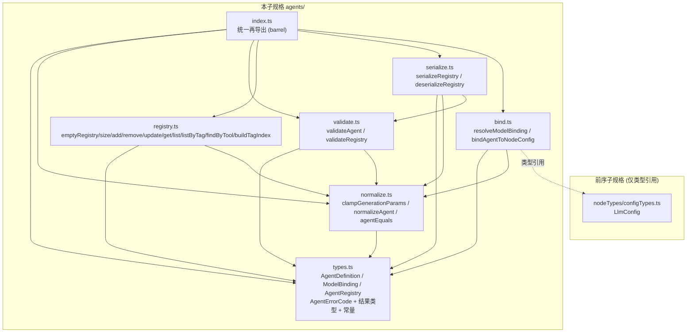
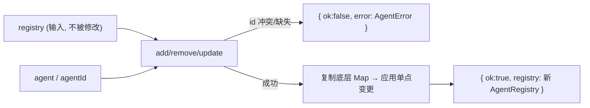
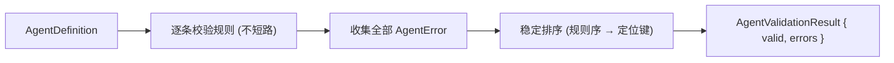
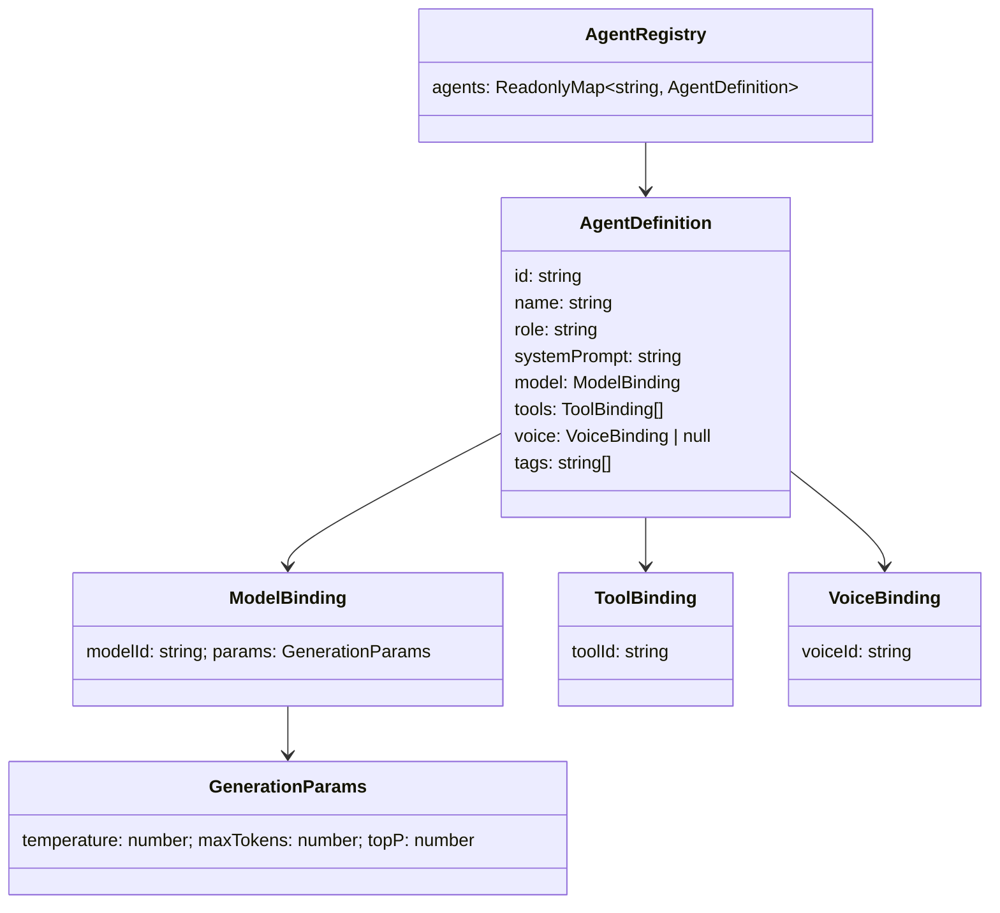

# 设计文档：智能体定义注册表 (agent-definition-registry)

## Overview

「智能体定义注册表」(agent-definition-registry) 是女娲 Nuwa「多智能体工作流编排引擎」的**第四个子规格**，构建于已实现的三个前序子规格之上：

- **工作流图模型** (workflow-graph-model, 位于 `app/web/src/lib/workflow/`)：提供 `WorkflowGraph`、`WorkflowNode`、`Port`、`PortType`、`NodeType`、`Endpoint` 等纯数据模型，以及基础层 `ErrorCode` 枚举与规范 JSON 序列化器 (`serialize`/`deserialize`/`canonicalize`)。
- **工作流节点类型** (workflow-node-types, 位于 `app/web/src/lib/workflow/nodeTypes/`)：定义六种 `NodeType` 的 `TypedNodeConfig`，其中 `LlmConfig` 含 `kind:'llm'`、`modelId`、`systemPrompt`、`temperature`、`maxTokens` 字段，以及配置层 `ConfigErrorCode` 枚举。
- **工作流执行引擎** (workflow-execution-engine, 位于 `app/web/src/lib/workflow/engine/`)：定义纯的、确定的 reducer 风格执行状态机，以及执行层 `ExecutorErrorCode` 枚举。

本子规格的职责是定义一个**纯库**，用于声明与管理「智能体定义」(`AgentDefinition`)——即工作流中 `llm` 节点与 `tool` 节点所引用的、可复用的 AI 智能体规格。实现位于 `app/web/src/lib/agents/`。

### 设计目标

1. **纯数据 + 纯函数**：本层不含任何 I/O、不依赖 React、不发起网络访问、无可变全局状态、无时间或随机依赖；所有对外暴露的函数对相同输入恒返回相同输出（R1.1、R1.3）。
2. **不可变集合**：`AgentRegistry` 是以 `Agent_Id` 为键的不可变映射；一切写操作 (`addAgent`/`removeAgent`/`updateAgent`) 都返回**新的注册表**而绝不就地修改输入（R1.4、R5.4）。
3. **结果类型表达错误**：写操作与反序列化返回可辨识联合结果 (`RegistryResult` / `RegistryDeserializeResult`)，不抛异常；一切错误建模为带稳定 `AgentErrorCode` 的 `AgentError` 值（R6–R8、R15.6）。
4. **错误码跨层互斥**：`AgentErrorCode` 全部以 `AGENT_` 前缀命名，其取值集合与前序三层的 `ErrorCode`、`ConfigErrorCode`、`ExecutorErrorCode` 取值集合两两不相交，便于跨层聚合区分（R12）。
5. **规范化与唯一表示**：`normalizeAgent` 把智能体定义收敛到唯一的 `Canonical_Agent` 形式（标签/工具绑定排序、数值参数收敛），幂等且对语义等价唯一，使序列化输出唯一、注册表可稳定比较（R13–R15）。
6. **复用而不重定义**：仅以散文与类型引用引用前序层 `LlmConfig` 的字段形态；`bindAgentToNodeConfig` 产出 `LlmConfig` 形态字段，但本层不执行任何工作流逻辑（R1.2、R16）。

### 与前序子规格的关系

| 层 | 模块 | 职责 | 错误码 |
|---|---|---|---|
| 基础层 (workflow-graph-model) | `workflow/*` | 图结构、端口类型、拓扑校验、规范 JSON | `ErrorCode` |
| 配置层 (workflow-node-types) | `workflow/nodeTypes/*` | 每类型配置 schema、配置校验、`LlmConfig` | `ConfigErrorCode` |
| 执行层 (workflow-execution-engine) | `workflow/engine/*` | 纯确定执行状态机 | `ExecutorErrorCode` |
| **本层 (agent-definition-registry)** | **`agents/*`** | **智能体定义/注册表、校验/规范化/序列化/绑定/查询** | **`AgentErrorCode`** |

四层错误码两两不相交（R12.2–R12.4）。本层 `bindAgentToNodeConfig` 产出的字段与配置层 `LlmConfig` 的 `modelId`/`systemPrompt`/`temperature`/`maxTokens` 形态一致，可被上层装配进 `llm` 节点配置（R16.3、R16.5）。

## Architecture

### 模块依赖关系



依赖**无环**：`types` 为底层叶子；`normalize` 居其上；`validate`/`registry`/`serialize`/`bind` 居中（均依赖 `types` 与 `normalize`，`serialize` 另用 `validate` 做结构校验复用）；`index` 仅做再导出。

### 写操作数据流（不可变写）



### 校验数据流（完整报告、稳定排序）



### 设计决策与理由

- **决策 1：底层用 `ReadonlyMap` 表达注册表。** `AgentRegistry` 包装一个 `ReadonlyMap<string, AgentDefinition>`。写操作通过 `new Map(old)` 复制后单点变更再封装为新注册表，从根上保证输入不变（R1.4、R5.4）。查询函数从该映射读取，`getAgent` 返回 `AgentDefinition | undefined` 而非抛异常（R9.1）。
- **决策 2：结果类型而非异常。** 写操作返回 `RegistryResult`，反序列化返回 `RegistryDeserializeResult`，均为可辨识联合 `{ ok:true; ... } | { ok:false; error }`，与前序层 `MutationResult`/`DeserializeResult` 风格一致，保证全函数性。
- **决策 3：判等基于语义内容。** `AgentDefinition` 的相等不基于引用，而由 `agentEquals`（结构逐字段比较，工具绑定/标签按序）与 `agentSemanticEquals`（先 `normalizeAgent` 再 `agentEquals`，忽略标签/工具顺序与数值收敛差异）两层提供（R2.5、R13.4）。
- **决策 4：规范化分两步且先收敛后排序。** `normalizeAgent` 内部先 `clampGenerationParams` 收敛数值，再排序去重标签与工具绑定，使规范形式同时满足"数值在区间内"与"集合表示唯一"。由此 `validateAgent(normalizeAgent(a))` 必不含数值越界错误（R14.5）。
- **决策 5：序列化复用基础层的"先规范化、固定字段序、`JSON.stringify`"范式。** `serializeRegistry` 先把每个智能体 `normalizeAgent`、条目按 `Agent_Id` 排序，再构造固定字段顺序的朴素对象并 `JSON.stringify`，使语义等价注册表产出逐字符相同字符串（R15.5）。`deserializeRegistry` 做严格结构校验，任何不符返回 `AGENT_MALFORMED_JSON` 而非部分构造（R15.6）。
- **决策 6：错误码字符串前缀隔离 + 静态不相交断言。** `AgentErrorCode` 用 TypeScript `enum`，全部值以 `AGENT_` 前缀命名；由一个示例测试静态导入四层枚举并断言取值集合两两不相交（R12.2–R12.4）。

## Components and Interfaces

下列签名为各模块对外导出的**精确 TypeScript 契约**。所有相等/排序均按确定规则（UTF-16 码元字典序）。

### `agents/types.ts`

```typescript
// —— 生成参数与模型绑定 ——

/** 生成参数组（R3.2）。temperature/topP 为数值，maxTokens 为整数。 */
export interface GenerationParams {
  readonly temperature: number; // Temperature ∈ [0, 2]（R3.3）
  readonly maxTokens: number;   // Max_Tokens：整数 ≥ 1（R3.5）
  readonly topP: number;        // Top_P ∈ [0, 1]（R3.4）
}

/** 模型绑定（R3.1）：一个 Model_Id 引用 + 一组生成参数。 */
export interface ModelBinding {
  readonly modelId: string;             // Model_Id：非空字符串
  readonly params: GenerationParams;
}

/** 工具绑定（R4.1）：携带一个非空 Tool_Id。 */
export interface ToolBinding {
  readonly toolId: string;
}

/** 语音绑定（R4.3）：携带一个非空 Voice_Id。 */
export interface VoiceBinding {
  readonly voiceId: string;
}

// —— 智能体定义 ——

/**
 * 智能体定义（R2.1）：不可变、带类型的可复用 AI 智能体规格。
 * 判等基于全部字段的语义内容，而非引用标识（R2.5）。
 */
export interface AgentDefinition {
  readonly id: string;                          // Agent_Id：非空，注册表内唯一
  readonly name: string;                        // Agent_Name：非空字符串
  readonly role: string;                        // Agent_Role：可为空字符串
  readonly systemPrompt: string;                // System_Prompt：长度 ≤ SYSTEM_PROMPT_MAX_LENGTH
  readonly model: ModelBinding;                 // 模型绑定
  readonly tools: readonly ToolBinding[];       // Tool_Binding_List：有序，Tool_Id 不重复
  readonly voice: VoiceBinding | null;          // 可空语音绑定（R4.3）
  readonly tags: readonly string[];             // Tag_Set：不重复、每个非空
}

// —— 注册表 ——

/** 以 Agent_Id 为键的不可变智能体集合（R5.1）。 */
export interface AgentRegistry {
  readonly agents: ReadonlyMap<string, AgentDefinition>;
}

// —— 错误码（R12.1）：全部 AGENT_ 前缀，取值与前序三层枚举不相交（R12.2–R12.4）——

export enum AgentErrorCode {
  AGENT_DUPLICATE_ID = 'AGENT_DUPLICATE_ID',                       // R6.3 / R11.3
  AGENT_NOT_FOUND = 'AGENT_NOT_FOUND',                             // R7.3 / R8.3
  AGENT_EMPTY_ID = 'AGENT_EMPTY_ID',                               // R10.2
  AGENT_EMPTY_NAME = 'AGENT_EMPTY_NAME',                           // R10.3
  AGENT_TEMPERATURE_OUT_OF_RANGE = 'AGENT_TEMPERATURE_OUT_OF_RANGE', // R10.4
  AGENT_MAX_TOKENS_INVALID = 'AGENT_MAX_TOKENS_INVALID',           // R10.5
  AGENT_TOP_P_OUT_OF_RANGE = 'AGENT_TOP_P_OUT_OF_RANGE',           // R10.6
  AGENT_DUPLICATE_TOOL_BINDING = 'AGENT_DUPLICATE_TOOL_BINDING',   // R10.7
  AGENT_SYSTEM_PROMPT_TOO_LONG = 'AGENT_SYSTEM_PROMPT_TOO_LONG',   // R10.8
  AGENT_MALFORMED_JSON = 'AGENT_MALFORMED_JSON',                   // R15.6
}

/** 错误定位信息（R12.5）。各字段按需填充。 */
export interface AgentErrorLocation {
  readonly agentId?: string; // 涉及的 Agent_Id
  readonly field?: string;   // 涉及的字段名（如 id/name/temperature/maxTokens/topP/systemPrompt）
  readonly toolId?: string;  // 涉及的重复 Tool_Id
}

/** 单条错误值（R12.5）。 */
export interface AgentError {
  readonly code: AgentErrorCode;
  readonly message: string;            // 人类可读描述
  readonly location: AgentErrorLocation;
}

// —— 结果类型 ——

/** 写操作结果（R6.1 / R7.1 / R8.1）。 */
export type RegistryResult =
  | { readonly ok: true; readonly registry: AgentRegistry }
  | { readonly ok: false; readonly error: AgentError };

/** 单个智能体校验结果（R10.1）。valid 为真 ⇔ errors 为空。 */
export interface AgentValidationResult {
  readonly valid: boolean;
  readonly errors: readonly AgentError[];
}

/** 注册表校验结果（R11.1）。valid 为真 ⇔ errors 为空。 */
export interface RegistryValidationResult {
  readonly valid: boolean;
  readonly errors: readonly AgentError[];
}

/** 反序列化结果（R15.2 / R15.6）。 */
export type RegistryDeserializeResult =
  | { readonly ok: true; readonly registry: AgentRegistry }
  | { readonly ok: false; readonly error: AgentError };

/** 模型绑定解析结果（R16.1）。 */
export interface ModelBindingResolution {
  readonly modelId: string;
  readonly params: GenerationParams;
}

/** Tag_Index：Tag -> 持有该 Tag 的 Agent_Id 集合（R17.1）。 */
export type TagIndex = ReadonlyMap<string, ReadonlySet<string>>;

// —— 常量 ——

/** System_Prompt 允许的最大字符长度（固定正整数上界）。 */
export const SYSTEM_PROMPT_MAX_LENGTH = 8000;

/** Generation_Params 合法区间常量。 */
export const TEMPERATURE_MIN = 0;
export const TEMPERATURE_MAX = 2;
export const TOP_P_MIN = 0;
export const TOP_P_MAX = 1;
export const MAX_TOKENS_MIN = 1;
```

### `agents/normalize.ts`

```typescript
import type { AgentDefinition, GenerationParams } from './types';

/**
 * 生成参数区间收敛（R14.1）。
 *   temperature -> min(2, max(0, t))
 *   topP        -> min(1, max(0, p))
 *   maxTokens   -> max(1, floor(m))（NaN/非有限值收敛到 1）
 * 幂等（R14.2）；区间内取值不变（R14.3）；结果恒落在合法区间（R14.4）。
 */
export function clampGenerationParams(params: GenerationParams): GenerationParams;

/**
 * 规范化智能体定义为 Canonical_Agent 形式（R13.1）：
 *   1. model.params 经 clampGenerationParams 收敛；
 *   2. tags 去重并按字典序升序排序；
 *   3. tools 按 toolId 字典序升序排序、并对重复 toolId 去重（保留首现）。
 *   id/name/role/systemPrompt/model.modelId/voice 的语义内容保持不变（R13.6）。
 * 幂等（R13.3）、语义等价唯一（R13.4）、规范形式为不动点（R13.5）。
 */
export function normalizeAgent(agent: AgentDefinition): AgentDefinition;

/** 结构逐字段相等（tools/tags 按当前顺序逐元素比较）。 */
export function agentEquals(a: AgentDefinition, b: AgentDefinition): boolean;

/** 语义相等：normalizeAgent(a) 与 normalizeAgent(b) 经 agentEquals 相等（R2.5、R13.4）。 */
export function agentSemanticEquals(a: AgentDefinition, b: AgentDefinition): boolean;
```

### `agents/validate.ts`

```typescript
import type {
  AgentDefinition,
  AgentValidationResult,
  AgentRegistry,
  RegistryValidationResult,
  AgentError,
} from './types';

/**
 * 单个智能体校验（R10.1）。一次报告全部违规、不短路（R10.10），
 * 错误以确定稳定顺序排列（R10.10），对相同输入恒返回相同结果（R10.11）。
 * 规则 → 错误码见"关键算法 2"。
 */
export function validateAgent(agent: AgentDefinition): AgentValidationResult;

/**
 * 注册表校验（R11.1）。对每个 AgentDefinition 施加 validateAgent 全部规则并汇集
 * 错误（R11.2）；并核对全局 Agent_Id 唯一性，重复 id 产出 AGENT_DUPLICATE_ID（R11.3）。
 * 错误稳定排序、确定（R11.5）。
 *
 * 注：以 ReadonlyMap 表达的 AgentRegistry 的键天然唯一；R11.3 的重复检测面向
 * "条目值的 id 字段与其键不一致或多条目映射同一 id"的反序列化/手工构造场景，
 * 通过比对每个条目值的 .id 与其键、以及值 id 的多重性来检测。
 */
export function validateRegistry(registry: AgentRegistry): RegistryValidationResult;

/** 稳定排序比较器：先按 AgentErrorCode 声明序，再按 (agentId, field, toolId) 字典序。 */
export function compareAgentErrors(a: AgentError, b: AgentError): number;
```

### `agents/registry.ts`

```typescript
import type {
  AgentDefinition,
  AgentRegistry,
  RegistryResult,
  TagIndex,
} from './types';

/** 空注册表（R5.2）。 */
export function emptyRegistry(): AgentRegistry;

/** 注册表中智能体数量（R5.5）。 */
export function size(registry: AgentRegistry): number;

/**
 * 添加智能体（R6.1）。id 不存在则成功，新注册表恰多一条目（R6.2、R6.5）；
 * id 已存在则失败 AGENT_DUPLICATE_ID 且原注册表不变（R6.3、R6.4）。
 */
export function addAgent(registry: AgentRegistry, agent: AgentDefinition): RegistryResult;

/**
 * 移除智能体（R7.1）。agentId 存在则成功、新注册表恰少一条目（R7.2、R7.5）；
 * 不存在则失败 AGENT_NOT_FOUND（R7.3）。
 */
export function removeAgent(registry: AgentRegistry, agentId: string): RegistryResult;

/**
 * 更新智能体（R8.1）。agent.id 存在则替换该条目、其余不变（R8.2），
 * 键集合与 size 不变（R8.4），id 不变（R8.5）；不存在则失败 AGENT_NOT_FOUND（R8.3）。
 */
export function updateAgent(registry: AgentRegistry, agent: AgentDefinition): RegistryResult;

/** 按 id 查询（R9.1）。存在返回该定义，否则返回 undefined（不抛异常）。 */
export function getAgent(registry: AgentRegistry, agentId: string): AgentDefinition | undefined;

/** 列举全部，按 Listing_Order（Agent_Id 字典序升序）（R9.2）。 */
export function listAgents(registry: AgentRegistry): readonly AgentDefinition[];

/** 列举 Tag_Set 含 tag 的全部，按 Listing_Order（R9.3、R17.5）。 */
export function listByTag(registry: AgentRegistry, tag: string): readonly AgentDefinition[];

/** 列举 Tool_Binding_List 含 toolId 的全部，按 Listing_Order（R9.4、R17.4）。 */
export function findByTool(registry: AgentRegistry, toolId: string): readonly AgentDefinition[];

/** 构建标签索引（R17.1）：Tag -> Agent_Id 集合，确定（R17.3）。 */
export function buildTagIndex(registry: AgentRegistry): TagIndex;
```

### `agents/serialize.ts`

```typescript
import type { AgentRegistry, RegistryDeserializeResult } from './types';

/**
 * 序列化为 Registry_Json 字符串（R15.1）。先把每个智能体 normalizeAgent、
 * 条目按 Agent_Id 排序，再以固定字段顺序构造朴素对象并 JSON.stringify。
 * 语义等价注册表产出逐字符相同字符串（R15.5）。
 */
export function serializeRegistry(registry: AgentRegistry): string;

/**
 * 从 Registry_Json 还原（R15.2）。严格结构校验，保留每个智能体全部组成部分（R15.7）；
 * 任何不符结构者返回 AGENT_MALFORMED_JSON 失败结果，绝不部分构造（R15.6）。
 */
export function deserializeRegistry(json: string): RegistryDeserializeResult;
```

### `agents/bind.ts`

```typescript
import type { AgentDefinition, ModelBindingResolution } from './types';
import type { LlmConfig } from '../workflow/nodeTypes/configTypes'; // 仅类型引用，不重定义

/** 解析模型绑定（R16.1）：忠实返回 agent 的 Model_Id 与 Generation_Params（R16.2）。 */
export function resolveModelBinding(agent: AgentDefinition): ModelBindingResolution;

/**
 * 把智能体推导出的 modelId/systemPrompt/temperature/maxTokens 填入 LlmConfig 形态
 * 的相应字段（R16.3、R16.5），纯数据变换、不执行、不修改输入 nodeConfig（R16.4）。
 * 确定（R16.6）；对已通过 validateAgent 的 agent，结果数值满足 LlmConfig 约束（R16.7）。
 */
export function bindAgentToNodeConfig(agent: AgentDefinition, nodeConfig: LlmConfig): LlmConfig;
```

### `agents/index.ts`

barrel 模块，统一再导出全部公共 API 与类型（`AgentDefinition`、`AgentRegistry`、`AgentErrorCode`、`emptyRegistry`、`addAgent`、`removeAgent`、`updateAgent`、`getAgent`、`listAgents`、`listByTag`、`findByTool`、`buildTagIndex`、`validateAgent`、`validateRegistry`、`clampGenerationParams`、`normalizeAgent`、`agentEquals`、`agentSemanticEquals`、`serializeRegistry`、`deserializeRegistry`、`resolveModelBinding`、`bindAgentToNodeConfig`、`SYSTEM_PROMPT_MAX_LENGTH` 等），供编排引擎上层与测试导入。

## Data Models

### AgentDefinition 结构



### 字段约束总表

| 字段 | 类型 | 约束 | 校验错误码 |
|---|---|---|---|
| `id` | string | 非空；注册表内唯一 | `AGENT_EMPTY_ID` / `AGENT_DUPLICATE_ID` |
| `name` | string | 非空 | `AGENT_EMPTY_NAME` |
| `role` | string | 可为空字符串 | —（无约束） |
| `systemPrompt` | string | 字符长度 ≤ `SYSTEM_PROMPT_MAX_LENGTH` | `AGENT_SYSTEM_PROMPT_TOO_LONG` |
| `model.modelId` | string | 非空（结构约束） | —（散文约束，可由扩展校验补充） |
| `model.params.temperature` | number | ∈ [0, 2] | `AGENT_TEMPERATURE_OUT_OF_RANGE` |
| `model.params.maxTokens` | number | 整数 ≥ 1 | `AGENT_MAX_TOKENS_INVALID` |
| `model.params.topP` | number | ∈ [0, 1] | `AGENT_TOP_P_OUT_OF_RANGE` |
| `tools` | ToolBinding[] | Tool_Id 不重复；可空 | `AGENT_DUPLICATE_TOOL_BINDING` |
| `voice` | VoiceBinding \| null | 可空；非空时 voiceId 非空 | —（结构约束） |
| `tags` | string[] | 不重复、每个非空；可空 | —（规范化去重；空串由生成器约束） |

### 数值字段合法区间与收敛（R3、R14）

| 字段 | 区间 | 端点收敛 |
|---|---|---|
| `temperature` | 闭区间 [0, 2] | `< 0 → 0`；`> 2 → 2` |
| `topP` | 闭区间 [0, 1] | `< 0 → 0`；`> 1 → 1` |
| `maxTokens` | 整数 ≥ 1 | `max(1, floor(m))`；NaN/非有限 → 1 |

### Canonical_Agent / Canonical_Registry

- **Canonical_Agent**（R13）：`tags` 已去重并按字典序排序；`tools` 已按 `toolId` 字典序排序并去重；`model.params` 已 `clampGenerationParams`；其余字段语义不变。
- **Canonical_Registry**（R15）：全部条目为 Canonical_Agent，且条目按 `Agent_Id` 字典序排列；其 `Registry_Json` 字段顺序与条目顺序确定，使语义相等注册表序列化输出逐字符相同。

### Registry_Json 结构（固定字段顺序）

```jsonc
{
  "version": 1,
  "agents": [
    {
      "id": "...",
      "name": "...",
      "role": "...",
      "systemPrompt": "...",
      "model": {
        "modelId": "...",
        "params": { "temperature": 0.7, "maxTokens": 1024, "topP": 1 }
      },
      "tools": [ { "toolId": "..." } ],
      "voice": { "voiceId": "..." },   // 或 null
      "tags": [ "..." ]
    }
    // ...条目按 id 升序
  ]
}
```

### 结果与错误类型

- `RegistryResult = { ok:true; registry } | { ok:false; error: AgentError }`。
- `AgentValidationResult = { valid; errors }`，`valid ⇔ errors.length === 0`。
- `RegistryValidationResult` 同形。
- `AgentError = { code: AgentErrorCode; message: string; location: AgentErrorLocation }`。
- `ModelBindingResolution = { modelId; params: GenerationParams }`。

## 关键算法

### 算法 1：Listing_Order —— 确定列表顺序（R9.2、R9.5、R9.6、R17）

```
listAgents(registry):
  arr = [...registry.agents.values()]
  return arr.sort((a, b) => cmp(a.id, b.id))   // UTF-16 码元字典序升序
```

- `listByTag(registry, tag)`：在 `listAgents` 结果上过滤 `a.tags.includes(tag)`（R9.3、R17.5）。
- `findByTool(registry, toolId)`：在 `listAgents` 结果上过滤 `a.tools.some(t => t.toolId === toolId)`（R9.4、R17.4）。
- 由于底层 `Map` 的键唯一且 `cmp` 为全序，`listAgents` 长度等于 `size` 且元素 `id` 两两不同（R9.6）；过滤保序，故全部列举均确定且按 Listing_Order（R9.5）。

### 算法 2：`validateAgent` —— 完整报告、稳定排序（R10）

```
validateAgent(agent):
  errors = []
  if agent.id === ''                              -> push(AGENT_EMPTY_ID, field=id)            // R10.2
  if agent.name === ''                            -> push(AGENT_EMPTY_NAME, field=name)        // R10.3
  t = agent.model.params.temperature
  if !(t >= 0 && t <= 2)                          -> push(AGENT_TEMPERATURE_OUT_OF_RANGE, field=temperature) // R10.4
  m = agent.model.params.maxTokens
  if !(Number.isInteger(m) && m >= 1)             -> push(AGENT_MAX_TOKENS_INVALID, field=maxTokens)         // R10.5
  p = agent.model.params.topP
  if !(p >= 0 && p <= 1)                          -> push(AGENT_TOP_P_OUT_OF_RANGE, field=topP)              // R10.6
  for 每个在 tools 中重复出现的 toolId（第二次及以后）
                                                  -> push(AGENT_DUPLICATE_TOOL_BINDING, toolId)              // R10.7
  if [...agent.systemPrompt].length > SYSTEM_PROMPT_MAX_LENGTH
                                                  -> push(AGENT_SYSTEM_PROMPT_TOO_LONG, field=systemPrompt)   // R10.8
  errors.sort(compareAgentErrors)                 // 稳定顺序（R10.10）
  return { valid: errors.length === 0, errors }   // R10.9
```

- **完整报告**：每条规则独立判定并 `push`，不在首错处停止（R10.10）。
- **稳定排序**：`compareAgentErrors` 先按 `AgentErrorCode` 在枚举中的声明序，再按 `(agentId, field, toolId)` 字典序，使输出顺序不依赖判定顺序、对相同输入恒定（R10.10、R10.11）。
- **确定性**：所有判定为纯比较，无随机/时间依赖（R10.11）。
- 注：`NaN` 比较 (`NaN >= 0` 为假) 使 `NaN` 温度/topP 被判越界，符合"不在区间内"语义。

### 算法 3：`validateRegistry` —— 逐项 + 全局唯一（R11）

```
validateRegistry(registry):
  errors = []
  // 逐项校验（R11.2）
  for a in listAgents(registry):
      errors += validateAgent(a).errors
  // 全局 id 唯一性（R11.3）：检测值 .id 的多重性（针对手工构造/反序列化值与键不一致的情形）
  counts = 统计 [...registry.agents.values()].map(a => a.id) 的出现次数
  for id where counts[id] >= 2:
      errors.push(AGENT_DUPLICATE_ID, agentId=id)
  errors.sort(compareAgentErrors)                 // R11.5
  return { valid: errors.length === 0, errors }   // R11.4
```

- **注册表合法 ⇒ 逐项合法（R11.6）**：`valid` 为真意味着无任何 `validateAgent` 错误被汇集，故 `listAgents` 每个元素单独 `validateAgent` 亦 `valid`。

### 算法 4：`addAgent` / `removeAgent` / `updateAgent` —— 不可变写（R6–R8）

```
addAgent(registry, agent):
  if registry.agents.has(agent.id):
      return { ok:false, error: AGENT_DUPLICATE_ID(agentId=agent.id) }   // R6.3
  next = new Map(registry.agents); next.set(agent.id, agent)
  return { ok:true, registry: { agents: next } }                        // R6.2/R6.5；原 registry 不变（R6.4）

removeAgent(registry, agentId):
  if !registry.agents.has(agentId):
      return { ok:false, error: AGENT_NOT_FOUND(agentId) }              // R7.3
  next = new Map(registry.agents); next.delete(agentId)
  return { ok:true, registry: { agents: next } }                        // R7.2/R7.5

updateAgent(registry, agent):
  if !registry.agents.has(agent.id):
      return { ok:false, error: AGENT_NOT_FOUND(agentId=agent.id) }     // R8.3
  next = new Map(registry.agents); next.set(agent.id, agent)            // 替换，键不变
  return { ok:true, registry: { agents: next } }                        // R8.2/R8.4/R8.5
```

- 三者均**复制底层 Map** 后单点变更，输入 `registry` 与输入 `agent` 不被修改（R1.4、R5.4）。
- **添加/移除往返（R7.4）**：若 `a.id ∉ r`，则 `addAgent(r, a)` 成功且新表恰多 `a`；随后 `removeAgent(·, a.id)` 删去该条目，得到与 `r` 语义相等的注册表（键集合与各条目值均还原）。

### 算法 5：`clampGenerationParams` —— 幂等区间收敛（R14）

```
clampGenerationParams(p):
  temperature' = min(2, max(0, p.temperature))
  topP'        = min(1, max(0, p.topP))
  maxTokens'   = Number.isFinite(p.maxTokens) ? max(1, floor(p.maxTokens)) : 1
  return { temperature: temperature', maxTokens: maxTokens', topP: topP' }
```

- **幂等（R14.2）**：收敛结果已落在区间内且为整数，再次收敛恒等。
- **区间内不变（R14.3）**：若三者本就合法（且 `maxTokens` 为整数），`min/max/floor` 均为恒等。
- **收敛后恒落区间（R14.4）**：`temperature ∈ [0,2]`、`topP ∈ [0,1]`、`maxTokens` 为 `≥1` 整数。

### 算法 6：`normalizeAgent` —— 规范化（R13）

```
normalizeAgent(agent):
  params'  = clampGenerationParams(agent.model.params)              // 先收敛数值
  tags'    = unique(agent.tags).sort(cmp)                           // 去重 + 字典序
  tools'   = uniqueByToolId(agent.tools).sort((x,y)=>cmp(x.toolId,y.toolId))  // 去重(保留首现) + 按 toolId 排序
  return {
    ...agent,                                                       // id/name/role/systemPrompt/voice 语义不变（R13.6）
    model: { modelId: agent.model.modelId, params: params' },
    tags: tags',
    tools: tools',
  }
```

- **幂等 / 不动点（R13.3、R13.5）**：已排序去重的集合再排序去重不变；已收敛参数再收敛不变；故规范形式经 `normalizeAgent` 恒等。
- **语义等价唯一（R13.4）**：仅标签/工具顺序不同或数值收敛后相等的两定义，规范化后 `tags`/`tools` 序列与 `params` 逐字段相等，其余字段本就相等，故 `agentEquals` 成立。
- **数值越界消解（R14.5）**：规范化已 clamp，故 `validateAgent(normalizeAgent(a))` 不含 `AGENT_TEMPERATURE_OUT_OF_RANGE`/`AGENT_TOP_P_OUT_OF_RANGE`/`AGENT_MAX_TOKENS_INVALID`。

### 算法 7：规范 JSON 序列化与反序列化（R15）

```
serializeRegistry(registry):
  entries = listAgents(registry).map(normalizeAgent)               // 规范化 + 按 id 排序
  plain = { version: 1, agents: entries.map(agentToPlain) }        // 固定字段顺序
  return JSON.stringify(plain)

agentToPlain(a):  // 固定键序：id,name,role,systemPrompt,model(modelId,params(temperature,maxTokens,topP)),tools,voice,tags
  return {
    id, name, role, systemPrompt,
    model: { modelId, params: { temperature, maxTokens, topP } },
    tools: a.tools.map(t => ({ toolId: t.toolId })),
    voice: a.voice ? { voiceId: a.voice.voiceId } : null,
    tags: [...a.tags],
  }

deserializeRegistry(json):
  try parsed = JSON.parse(json)  catch -> { ok:false, error: AGENT_MALFORMED_JSON(message,position?) }   // R15.6
  结构校验 parsed：必须为对象、agents 为数组、每条目字段类型/形态正确、voice 为对象或 null、
                   tools/tags 为数组、数值字段为 number ...
  任一不符 -> { ok:false, error: AGENT_MALFORMED_JSON(message) }（绝不部分构造，R15.6）
  否则 m = new Map()；for each 条目 a: m.set(a.id, restore(a))
  return { ok:true, registry: { agents: m } }                       // 保留全部组成部分（R15.7）
```

- **往返恒等（R15.3）**：`deserializeRegistry(serializeRegistry(r))` 还原出的注册表，与对 `r` 每个智能体施加 `normalizeAgent` 后的注册表语义相等。
- **字符串往返恒等（R15.4）**：`serializeRegistry(deserializeRegistry(j).registry)` 对由 `serializeRegistry` 产出的 `j` 逐字符等于 `j`（因 `j` 已是规范字符串、再序列化为不动点）。
- **规范输出唯一（R15.5）**：语义等价注册表规范化后逐字段相等，固定字段序的 `JSON.stringify` 产出逐字符相同字符串。

### 算法 8：`resolveModelBinding` / `bindAgentToNodeConfig` —— 引用解析与节点绑定（R16）

```
resolveModelBinding(agent):
  return { modelId: agent.model.modelId, params: agent.model.params }   // 忠实于源（R16.2）

bindAgentToNodeConfig(agent, nodeConfig):
  return {
    ...nodeConfig,                       // 不修改输入 nodeConfig（R16.4，纯展开复制）
    kind: 'llm',
    modelId: agent.model.modelId,        // R16.5
    systemPrompt: agent.systemPrompt,    // R16.5
    temperature: agent.model.params.temperature,  // R16.5
    maxTokens: agent.model.params.maxTokens,       // R16.5
  }
```

- **确定（R16.6）**：纯字段拷贝，无随机/时间依赖。
- **数值约束（R16.7）**：若 `agent` 已通过 `validateAgent`，则 `temperature ∈ [0,2]`、`maxTokens` 为 `≥1` 整数，故结果满足 `LlmConfig` 数值约束。实现可在绑定前对 `agent` 施加 `normalizeAgent`，使该性质对任意 `agent` 都成立（设计采用"输入须先通过校验"的前置条件版本以匹配 R16.7 措辞）。

## Correctness Properties

*性质 (property) 是应在系统所有合法执行中恒成立的特征或行为——一个关于系统应当做什么的形式化陈述。性质是人类可读规格与机器可验证正确性保证之间的桥梁。*

下列性质均为**全称量化**（"对任意…"）的可属性测试陈述，每条标注其验证的需求条款。除特别说明外，所有性质均针对本层纯函数，输入以自定义 arbitraries 生成（见测试策略）。已据 prework 做去冗余处理：数据模型形态（R2/R3/R4/R5.1）由编译保证，不出性质；`size`/不可变性并入添加性质；`valid⇔errors 空`统一表达；规范形式不动点并入幂等；反序列化保留组成部分并入往返；各项确定性并入对应功能性质。

### Property 1: 添加成功——size 加一且原注册表不变

*对任意* `AgentRegistry` `r` 与 `Agent_Id` 不在 `r` 中的 `AgentDefinition` `a`，`addAgent(r, a)` 返回成功结果，其新注册表满足 `size === size(r) + 1` 且 `getAgent(新表, a.id)` 等于 `a`；同时输入 `r` 在调用后 `size` 与全部条目保持不变（不可变写）。

**Validates: Requirements 6.2, 6.5, 5.5, 1.4**

### Property 2: 添加重复 id 失败

*对任意* 非空 `AgentRegistry` `r` 与一个 `Agent_Id` 取自 `r` 已有键的 `AgentDefinition` `a`，`addAgent(r, a)` 返回失败结果，其 `AgentError` 的 `code` 为 `AGENT_DUPLICATE_ID` 且定位该 `Agent_Id`，且 `r` 保持不变。

**Validates: Requirements 6.3, 6.4**

### Property 3: 移除不存在的智能体失败

*对任意* `AgentRegistry` `r` 与不存在于 `r` 的 `Agent_Id` `id`，`removeAgent(r, id)` 返回失败结果，其 `AgentError` 的 `code` 为 `AGENT_NOT_FOUND` 且定位该 `Agent_Id`。

**Validates: Requirements 7.3**

### Property 4: 添加/移除往返恒等

*对任意* `AgentRegistry` `r` 与 `Agent_Id` 不在 `r` 中的 `AgentDefinition` `a`，先 `addAgent(r, a)` 成功得到 `r'`，再 `removeAgent(r', a.id)` 成功，且其结果注册表与 `r` 语义相等（键集合相同且对应 `AgentDefinition` 逐个 `agentEquals`）。

**Validates: Requirements 7.4, 7.5**

### Property 5: 更新保持 id 与键集合

*对任意* 非空 `AgentRegistry` `r`、取自 `r` 的 `Agent_Id` `id` 与任意 `AgentDefinition` 内容 `body`，令 `a = { ...body, id }`，`updateAgent(r, a)` 返回成功结果，其新注册表在 `id` 处的定义等于 `a`、其余条目不变，且键集合与 `size` 与 `r` 相同、被更新定义的 `id` 不变。

**Validates: Requirements 8.2, 8.4, 8.5**

### Property 6: 更新不存在的智能体失败

*对任意* `AgentRegistry` `r` 与 `Agent_Id` 不在 `r` 中的 `AgentDefinition` `a`，`updateAgent(r, a)` 返回失败结果，其 `AgentError` 的 `code` 为 `AGENT_NOT_FOUND` 且定位该 `Agent_Id`。

**Validates: Requirements 8.3**

### Property 7: getAgent 命中与未命中

*对任意* `AgentRegistry` `r`：对 `r` 中每个键 `id`，`getAgent(r, id)` 返回的 `AgentDefinition` 的 `id` 字段等于 `id`；对任意不在 `r` 中的 `id`，`getAgent(r, id)` 返回 `undefined`（不抛异常）。

**Validates: Requirements 9.1**

### Property 8: 列举顺序、长度与确定性

*对任意* `AgentRegistry` `r`，`listAgents(r)` 的 `Agent_Id` 序列按字典序非降排列、长度等于 `size(r)`、其 `Agent_Id` 两两不同，且对同一 `r` 两次调用返回逐元素相同的列表。

**Validates: Requirements 9.2, 9.5, 9.6**

### Property 9: validateAgent 逐类违规检测

*对任意* 合法的 `AgentDefinition` `a`，单点注入下列任一违规后，`validateAgent` 必产出对应 `AgentErrorCode` 且定位正确：空 `id` ⇒ `AGENT_EMPTY_ID`(field=`id`)；空 `name` ⇒ `AGENT_EMPTY_NAME`(field=`name`)；`temperature ∉ [0,2]` ⇒ `AGENT_TEMPERATURE_OUT_OF_RANGE`(field=`temperature`)；`maxTokens` 非 `≥1` 整数 ⇒ `AGENT_MAX_TOKENS_INVALID`(field=`maxTokens`)；`topP ∉ [0,1]` ⇒ `AGENT_TOP_P_OUT_OF_RANGE`(field=`topP`)；含重复 `Tool_Id` ⇒ `AGENT_DUPLICATE_TOOL_BINDING`(toolId)；`System_Prompt` 长度超过 `SYSTEM_PROMPT_MAX_LENGTH` ⇒ `AGENT_SYSTEM_PROMPT_TOO_LONG`(field=`systemPrompt`)。

**Validates: Requirements 10.2, 10.3, 10.4, 10.5, 10.6, 10.7, 10.8**

### Property 10: validateAgent 完整报告、确定与稳定排序

*对任意* 在合法 `AgentDefinition` 上注入了 *k≥2* 处相互独立违规的 `AgentDefinition` `a`，`validateAgent(a)` 的错误集合包含每一处注入违规对应的 `AgentErrorCode`（不在首错处停止）；两次调用返回相等结果；且对 `a` 在 `tools`/`tags` 书写顺序上的任意置换，错误序列在 `compareAgentErrors` 排序键下一致。

**Validates: Requirements 10.10, 10.11**

### Property 11: 校验结果 valid 当且仅当无错误且错误良构

*对任意* `AgentDefinition` `a`，`validateAgent(a).valid` 为真**当且仅当** `errors` 为空；且 `errors` 中每条 `AgentError` 的 `message` 为非空字符串，与某 `id`/字段/`Tool_Id` 相关时其 `location` 记录该标识。同样地，*对任意* `AgentRegistry` `r`，`validateRegistry(r).valid` 为真当且仅当其 `errors` 为空。

**Validates: Requirements 10.9, 11.4, 12.5**

### Property 12: validateRegistry 重复 id 检测

*对任意* 由两个或更多 `AgentDefinition` 值持有相同 `Agent_Id` 而构造的 `AgentRegistry`（条目值的 `.id` 出现重复），`validateRegistry` 的错误集合包含一条 `code` 为 `AGENT_DUPLICATE_ID` 且定位该重复 `Agent_Id` 的 `AgentError`。

**Validates: Requirements 11.3**

### Property 13: 注册表合法蕴含逐项合法

*对任意* 使 `validateRegistry(r).valid` 为真的 `AgentRegistry` `r`，`listAgents(r)` 返回的每个 `AgentDefinition` 单独施加 `validateAgent` 时亦 `valid` 为真。

**Validates: Requirements 11.6, 11.2**

### Property 14: clampGenerationParams 幂等、区间内不变与收敛后落区间

*对任意* `Generation_Params` `p`（含越界取值），`clampGenerationParams(clampGenerationParams(p))` 等于 `clampGenerationParams(p)`（幂等），且其结果满足 `temperature ∈ [0,2]`、`topP ∈ [0,1]`、`maxTokens` 为 `≥1` 整数（收敛后落区间）；进一步，*对任意* 全部数值字段已在合法区间内的 `p`，`clampGenerationParams(p)` 等于 `p`（区间内不变）。

**Validates: Requirements 14.2, 14.3, 14.4**

### Property 15: normalizeAgent 幂等与不动点

*对任意* `AgentDefinition` `a`，`normalizeAgent(normalizeAgent(a))` 与 `normalizeAgent(a)` `agentEquals` 相等；且当 `a` 已为 `Canonical_Agent` 形式时 `normalizeAgent(a)` 与 `a` `agentEquals` 相等。

**Validates: Requirements 13.3, 13.5**

### Property 16: normalizeAgent 语义等价唯一且保持关键字段

*对任意* `AgentDefinition` `a` 与其仅在 `tags`/`tools` 顺序或数值收敛差异上不同的重排版本 `a'`，`normalizeAgent(a)` 与 `normalizeAgent(a')` `agentEquals` 相等；且 `normalizeAgent(a)` 的 `id`、`name`、`role`、`systemPrompt`、`model.modelId` 与 `voice` 与 `a` 相应字段语义相等。

**Validates: Requirements 13.4, 13.6**

### Property 17: 规范化消解数值越界

*对任意* `AgentDefinition` `a`，`validateAgent(normalizeAgent(a))` 的错误集合不含 `AGENT_TEMPERATURE_OUT_OF_RANGE`、`AGENT_TOP_P_OUT_OF_RANGE` 或 `AGENT_MAX_TOKENS_INVALID`。

**Validates: Requirements 14.5**

### Property 18: 序列化往返恒等

*对任意* `AgentRegistry` `r`，`deserializeRegistry(serializeRegistry(r))` 返回成功结果，其注册表与"对 `r` 每个 `AgentDefinition` 施加 `normalizeAgent` 后的注册表"语义相等（键集合相同且对应定义逐个 `agentEquals`，全部组成部分保留）。

**Validates: Requirements 15.3, 15.7**

### Property 19: 规范字符串往返与规范输出唯一

*对任意* `AgentRegistry` `r`，令 `j = serializeRegistry(r)`，则 `deserializeRegistry(j)` 成功且 `serializeRegistry(其注册表)` 逐字符等于 `j`（字符串不动点）；且对 `r` 的任意语义等价变体 `r'`（条目经 `normalizeAgent` 后相等），`serializeRegistry(r')` 逐字符等于 `j`（规范输出唯一）。

**Validates: Requirements 15.4, 15.5**

### Property 20: 反序列化拒斥畸形输入

*对任意* 不符合 `Registry_Json` 结构的字符串 `s`（随机字符串、被破坏的合法序列化串、缺字段/错类型的对象），`deserializeRegistry(s)` 返回失败结果，其 `AgentError` 的 `code` 为 `AGENT_MALFORMED_JSON`，且调用不抛异常、不部分构造注册表。

**Validates: Requirements 15.6**

### Property 21: 模型绑定解析与节点绑定

*对任意* `AgentDefinition` `a` 与任意 `LlmConfig` 形态的 `nodeConfig`：`resolveModelBinding(a)` 的 `modelId` 与 `params` 分别等于 `a.model.modelId` 与 `a.model.params`（忠实于源）；`bindAgentToNodeConfig(a, nodeConfig)` 的 `modelId`、`systemPrompt`、`temperature`、`maxTokens` 分别等于 `a` 的对应值，输入 `nodeConfig` 不被修改，且两次调用返回相等结果（确定性）。

**Validates: Requirements 16.2, 16.4, 16.5, 16.6**

### Property 22: 绑定结果满足 Llm_Config 数值约束

*对任意* 已通过 `validateAgent`（`valid` 为真）的 `AgentDefinition` `a` 与任意 `nodeConfig`，`bindAgentToNodeConfig(a, nodeConfig)` 产出的 `temperature` 落在 `[0,2]`、`maxTokens` 为 `≥1` 整数。

**Validates: Requirements 16.7**

### Property 23: 标签索引与按工具/按标签查找的一致与精确

*对任意* `AgentRegistry` `r`：对任意 `Tag` `t`，`buildTagIndex(r)` 中 `t` 对应的 `Agent_Id` 集合恰等于 `listByTag(r, t)` 所返回定义的 `Agent_Id` 集合（索引与列举一致）；`listByTag(r, t)` 返回的每个定义的 `Tag_Set` 均含 `t` 且 `r` 中其余定义均不含（按标签精确）；对任意 `Tool_Id` `toolId`，`findByTool(r, toolId)` 返回的每个定义的 `Tool_Binding_List` 均含 `toolId` 且 `r` 中其余定义均不含（按工具精确）。

**Validates: Requirements 17.2, 17.4, 17.5**

### Property 24: 错误码跨层互斥

*对任意* `AgentErrorCode` 取值 `c`，`c` 既不出现于基础层 `ErrorCode` 取值集合，也不出现于配置层 `ConfigErrorCode` 取值集合，也不出现于执行层 `ExecutorErrorCode` 取值集合（四层错误码取值集合两两不相交）。

**Validates: Requirements 12.2, 12.3, 12.4**

## Error Handling

本层不抛业务异常，全部错误以值表达；唯一的内部异常（反序列化结构校验的哨兵）在 `deserializeRegistry` 内部被捕获并转为 `AGENT_MALFORMED_JSON` 失败结果，绝不逃逸。

- **写操作失败**：`addAgent`（id 冲突）→ `AGENT_DUPLICATE_ID`；`removeAgent`/`updateAgent`（id 缺失）→ `AGENT_NOT_FOUND`。失败时返回 `{ ok:false, error }`，输入注册表绝不改变。
- **校验错误**：`validateAgent`/`validateRegistry` 一次性收集**全部**被违反规则的 `AgentError`，按 `compareAgentErrors`（先按 `AgentErrorCode` 声明序、再按 `(agentId, field, toolId)` 字典序）稳定排序；`valid` 字段与 `errors` 为空互为充要。
- **定位信息**：每条 `AgentError` 的 `location` 按相关性填充 `agentId`/`field`/`toolId`，`message` 为非空人类可读描述（R12.5）。
- **反序列化错误**：`JSON.parse` 失败或结构校验失败 → `AGENT_MALFORMED_JSON`，`message` 说明失败原因（解析失败时尽量携带 `position`），不部分构造注册表（R15.6）。
- **数值异常输入**：`NaN`/非有限数在校验中按"不在区间内/非整数"处理而产出相应错误；在 `clampGenerationParams` 中被收敛到合法端点或下限（`maxTokens` 非有限 → 1）。
- **错误码隔离**：`AgentErrorCode` 全部 `AGENT_` 前缀，取值与前序三层枚举两两不相交，便于上层跨层聚合错误时按前缀/取值精确归因。

## Testing Strategy

本层是纯函数库，含大量普适性质（不可变写、往返、幂等、规范唯一、解析忠实、查询分划），**高度适合属性测试 (PBT)**。采用单元测试与属性测试并行的双重策略。

### 测试框架与运行

- 框架：`vitest`（已在 `app/web/package.json`），属性库：`fast-check ^3`（已安装）。
- 运行方式：单次运行 `npm run test`（等价 `vitest --run`），不使用 watch 模式。
- 每条属性测试 `numRuns` 至少 100。
- 文件布局（与前序子规格一致）：实现位于 `app/web/src/lib/agents/`；属性测试为 `app/web/src/lib/agents/prop-01.test.ts` … `prop-24.test.ts`（每条性质一文件、一 PBT）；示例/边界测试为 `app/web/src/lib/agents/example-*.test.ts`；自定义生成器集中于 `app/web/src/lib/agents/arbitraries.ts`。

### 属性测试约定

- 每文件实现设计文档中的**单一**对应性质，并在文件首行注释标注：
  `// Feature: agent-definition-registry, Property N: <性质标题>`
- 断言中复用本层 `agentEquals`/`agentSemanticEquals` 作为语义相等判据，避免引用相等误判。
- 使用 `fast-check` 而非自行实现属性测试；失败时由 `fast-check` 自动缩小 (shrink) 反例。

性质 → 测试文件映射：Property 1–24 ↦ `prop-01.test.ts` … `prop-24.test.ts`。

### 自定义 Arbitraries（`arbitraries.ts`）

- `arbitraryGenerationParams`：生成 `GenerationParams`，**含合法与越界两类**——`temperature`/`topP` 取值跨越 `[-1, 3]` 与 `[-0.5, 1.5]` 等含越界区段，`maxTokens` 含 `0`、负数、非整数与 `NaN`，用于 clamp/normalize/校验性质。
- `arbitraryValidGenerationParams`：仅生成合法区间内、`maxTokens` 为 `≥1` 整数的参数，用于 Property 14 的"区间内不变"分支与 Property 22 的合法前置。
- `arbitraryToolBinding` / `arbitraryVoiceBinding`：生成非空 `toolId` / `voiceId`。
- `arbitraryAgentDefinition`：生成 `AgentDefinition`，`tags`/`tools` 可含重复与乱序，`systemPrompt` 长度跨越上界两侧（含超长用例），`voice` 含 `null`，用于校验/规范化/序列化性质。
- `arbitraryValidAgentDefinition`：生成必然通过 `validateAgent` 的合法智能体（非空 id/name、合法参数、唯一工具、合法长度提示），作为"单点注入违规"性质与绑定数值约束性质的基底。
- `arbitraryReorderedAgent`：给定一个 `AgentDefinition`，产出其**语义等价的重排版本**（打乱 `tags`/`tools` 顺序、复制并轻微扰动数值至收敛后相等），用于 normalize 唯一性（Property 16）与规范输出唯一（Property 19）。
- `arbitraryRegistry`：由一组 `id` 唯一的 `arbitraryAgentDefinition` 构造 `AgentRegistry`（经 `addAgent` 累积或直接构造 Map），用于注册表级性质。
- `arbitraryDuplicateIdRegistryValues`：构造含两条 `.id` 相同的值集合（绕过键唯一以模拟手工/反序列化不一致），用于 Property 12。
- `arbitraryMalformedRegistryJson`：生成畸形 JSON——随机非 JSON 字符串、合法 JSON 但缺字段/错类型、被破坏的合法序列化串，用于 Property 20。

### 单元 / 示例测试（`example-*.test.ts`）

属性测试覆盖普适性质，单元测试聚焦具体示例、边界与枚举断言，避免冗余：

- `example-empty-registry.test.ts`：`size(emptyRegistry()) === 0`、`listAgents(emptyRegistry())` 为空、`getAgent` 返回 `undefined`（R5.2、R9.1 具体例）。
- `example-error-codes.test.ts`：断言 `AgentErrorCode` 枚举包含 R12.1 列出的全部十个成员（具体枚举断言）。
- `example-error-codes-disjoint.test.ts`：静态导入四层枚举值，断言 `AgentErrorCode` 与其它三层取值集合两两不相交（Property 24 的可执行落地，亦作示例确证）。
- `example-deserialize-malformed.test.ts`：若干典型畸形串（空串、`"{"`、`'{"agents":1}'`、缺 `model` 的条目）→ `AGENT_MALFORMED_JSON`（R15.6 代表性例）。
- `example-bind-llm-config.test.ts`：一个具体 agent + `LlmConfig` 经 `bindAgentToNodeConfig` 后四字段正确、原 `nodeConfig` 不变（R16.5、R16.4 代表性例）。

### PBT 不适用部分

- 数据模型类型声明（R2/R3/R4/R5.1）、纯库组织约束（R1.1/R1.2）由 TypeScript 编译与 ESLint 保证，不写属性测试。
- `emptyRegistry`、枚举成员等"一次性/具体"事实用示例测试断言，不写属性测试。

### 验证清单（与需求映射）

| 需求簇 | 覆盖测试 |
|---|---|
| R6 添加 | Property 1, 2 |
| R7 移除/往返 | Property 3, 4 |
| R8 更新 | Property 5, 6 |
| R9 查询/列举 | Property 7, 8 |
| R10 单体校验 | Property 9, 10, 11 |
| R11 注册表校验 | Property 11, 12, 13 |
| R12 错误码 | Property 24 + `example-error-codes*` |
| R13 规范化 | Property 15, 16 |
| R14 参数收敛 | Property 14, 17 |
| R15 序列化 | Property 18, 19, 20 |
| R16 解析/绑定 | Property 21, 22 |
| R17 查询派生 | Property 23 |
