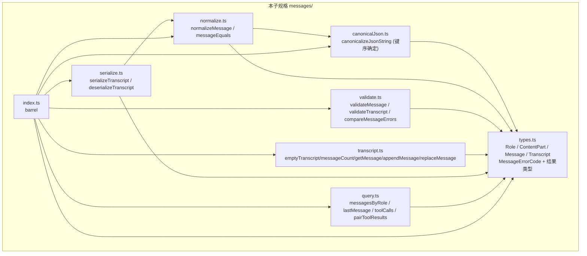

# 设计文档：智能体消息协议 (agent-message-protocol)

## Overview

「智能体消息协议」(agent-message-protocol) 是女娲 Nuwa「多智能体工作流编排引擎」的**第七个子规格**，定义多智能体协作中交换的不可变、带类型消息序列。实现位于 `app/web/src/lib/messages/`。本层为**纯库**：无 I/O、无 React、无网络、无可变全局状态、不调用模型/工具、对相同输入恒返回相同输出。

### 设计目标

1. **纯数据 + 纯函数**（R1）。
2. **不可变序列**：`Transcript` 写操作返回新记录，绝不就地修改输入（R1.4、R4.4）。
3. **结果类型表达错误**：写操作返回 `TranscriptResult`，反序列化返回 `TranscriptDeserializeResult`；错误为带稳定 `MessageErrorCode` 的 `MessageError`（R5、R6、R11.6）。
4. **错误码跨层互斥**：`MessageErrorCode` 全部 `MESSAGE_` 前缀，与前六层枚举两两不相交（R9）。
5. **规范化与唯一表示**：`normalizeMessage` 把内部 JSON（Arguments_Json/Result_Json）规范化为键序确定的字符串，使语义等价消息唯一（R10）。

### 与前序子规格的关系

本层独立于具体业务类型，仅在错误码互斥性质（R9）中**静态引用**前六层枚举（`ErrorCode`、`ConfigErrorCode`、`ExecutorErrorCode`、`AgentErrorCode`、`ToolErrorCode`、`ResolutionErrorCode`）。`MessageErrorCode` 全部 `MESSAGE_` 前缀，与之两两不相交。

## Architecture

### 模块依赖关系



依赖**无环**：`types` 叶子；`canonicalJson` 仅依赖 types；`normalize` 依赖 canonical；其余依赖 types（serialize 另依赖 normalize）；`index` 再导出。

### 设计决策与理由

- **决策 1：Transcript 以有序数组表达。** `Transcript` 包装 `readonly Message[]`。写操作复制数组后单点变更（push / map 替换），保证输入不变（R4.4）。查询线性扫描，`getMessage` 返回 `Message | undefined`（R4.5）。
- **决策 2：内部 JSON 规范化。** Arguments_Json/Result_Json 是任意 JSON 文本；`normalizeMessage` 用 `canonicalizeJsonString`（解析后按键递归排序再 `JSON.stringify`）使语义等价 JSON 收敛到唯一串（R10.2、R10.4）。无法解析的 JSON 文本按原样保留（规范化对其为恒等），避免破坏全函数性。
- **决策 3：工具调用配对基于出现顺序。** `validateTranscript` 线性遍历，维护「已见 Tool_Call 的 Call_Id 集合」；遇 Tool_Result 时其 Call_Id 必须已在集合中，否则 `MESSAGE_UNPAIRED_TOOL_RESULT`（R8.4）；Tool_Call 的 Call_Id 多重性 ≥2 → `MESSAGE_DUPLICATE_CALL_ID`（R8.5）。
- **决策 4：结果类型而非异常。** 写操作与反序列化返回可辨识联合；`deserializeTranscript` 严格结构校验，不符返回 `MESSAGE_MALFORMED_JSON`，不部分构造（R11.6）。
- **决策 5：稳定排序比较器。** `compareMessageErrors` 先按 `MessageErrorCode` 声明序，再按 `(messageId, callId, field, partIndex)` 排序，保证完整报告下输出确定（R7.7、R8.7）。

## Components and Interfaces

### `messages/types.ts`

```typescript
/** 消息发出方角色（R2.1）。 */
export type Role = 'system' | 'user' | 'assistant' | 'tool';

/** 文本片段（R2.3）。 */
export interface TextPart { readonly kind: 'text'; readonly text: string; }

/** 工具调用片段（R2.4）。 */
export interface ToolCallPart {
  readonly kind: 'tool_call';
  readonly callId: string;        // Call_Id：非空
  readonly toolName: string;      // Tool_Name：非空
  readonly argumentsJson: string; // Arguments_Json：字符串化 JSON
}

/** 工具结果片段（R2.5）。 */
export interface ToolResultPart {
  readonly kind: 'tool_result';
  readonly callId: string;        // Call_Id：非空，匹配更早的 ToolCallPart
  readonly resultJson: string;    // Result_Json：字符串化 JSON
}

/** 内容片段可辨识联合（R2.2）。 */
export type ContentPart = TextPart | ToolCallPart | ToolResultPart;

/** 一条不可变消息（R3.1）。判等基于语义内容（R3.3）。 */
export interface Message {
  readonly id: string;                     // Message_Id：非空、Transcript 内唯一
  readonly role: Role;
  readonly parts: readonly ContentPart[];  // Part_List：非空
}

/** 不可变有序消息序列（R4.1）。 */
export interface Transcript {
  readonly messages: readonly Message[];
}

/** 错误码（R9.1）：全部 MESSAGE_ 前缀，与前六层枚举不相交（R9.2–R9.7）。 */
export enum MessageErrorCode {
  MESSAGE_DUPLICATE_ID = 'MESSAGE_DUPLICATE_ID',                   // R5.3 / R8.3
  MESSAGE_NOT_FOUND = 'MESSAGE_NOT_FOUND',                         // R6.3
  MESSAGE_EMPTY_ID = 'MESSAGE_EMPTY_ID',                           // R7.2
  MESSAGE_EMPTY_PARTS = 'MESSAGE_EMPTY_PARTS',                     // R7.3
  MESSAGE_EMPTY_CALL_ID = 'MESSAGE_EMPTY_CALL_ID',                 // R7.4
  MESSAGE_EMPTY_TOOL_NAME = 'MESSAGE_EMPTY_TOOL_NAME',             // R7.5
  MESSAGE_UNPAIRED_TOOL_RESULT = 'MESSAGE_UNPAIRED_TOOL_RESULT',   // R8.4
  MESSAGE_DUPLICATE_CALL_ID = 'MESSAGE_DUPLICATE_CALL_ID',         // R8.5
  MESSAGE_MALFORMED_JSON = 'MESSAGE_MALFORMED_JSON',               // R11.6
}

/** 错误定位信息（R9.8）。 */
export interface MessageErrorLocation {
  readonly messageId?: string;
  readonly callId?: string;
  readonly field?: string;
  readonly partIndex?: number;
}

/** 单条错误值（R9.8）。 */
export interface MessageError {
  readonly code: MessageErrorCode;
  readonly message: string;
  readonly location: MessageErrorLocation;
}

// —— 结果类型 ——

export type TranscriptResult =
  | { readonly ok: true; readonly transcript: Transcript }
  | { readonly ok: false; readonly error: MessageError };

export type TranscriptDeserializeResult =
  | { readonly ok: true; readonly transcript: Transcript }
  | { readonly ok: false; readonly error: MessageError };

export interface MessageValidationResult {
  readonly valid: boolean;
  readonly errors: readonly MessageError[];
}

export interface TranscriptValidationResult {
  readonly valid: boolean;
  readonly errors: readonly MessageError[];
}

/** toolCalls 结果项：一个 ToolCallPart 连同其所属 Message_Id（R12.3）。 */
export interface LocatedToolCall {
  readonly messageId: string;
  readonly part: ToolCallPart;
}

/** pairToolResults 结果项（R12.4）。 */
export interface ToolResultPairing {
  readonly result: ToolResultPart;
  readonly resultMessageId: string;
  readonly call: ToolCallPart | null;   // null 表示未配对
  readonly callMessageId: string | null;
}
```

### `messages/canonicalJson.ts`

```typescript
/**
 * 把一个 JSON 文本规范化为键序确定的等价 JSON 字符串：解析后对所有对象键递归
 * 升序排序再 JSON.stringify。若输入不是合法 JSON，则原样返回（恒等），保证全函数。
 * 幂等：canonicalizeJsonString(canonicalizeJsonString(s)) === canonicalizeJsonString(s)。
 */
export function canonicalizeJsonString(jsonText: string): string;
```

### `messages/normalize.ts`

```typescript
import type { Message } from './types';

/** 规范化为 Canonical_Message（R10.1）：对 argumentsJson/resultJson 施加 canonicalizeJsonString，保持片段顺序与其余字段。 */
export function normalizeMessage(message: Message): Message;

/** 结构逐字段相等（parts 按当前顺序逐元素，按 kind 比较各分支字段）。 */
export function messageEquals(a: Message, b: Message): boolean;

/** 语义相等：normalizeMessage(a) 与 normalizeMessage(b) 经 messageEquals 相等（R3.3、R10.4）。 */
export function messageSemanticEquals(a: Message, b: Message): boolean;
```

### `messages/validate.ts`

```typescript
import type { Message, MessageValidationResult, Transcript, TranscriptValidationResult, MessageError } from './types';

export function validateMessage(message: Message): MessageValidationResult;        // R7
export function validateTranscript(transcript: Transcript): TranscriptValidationResult; // R8
export function compareMessageErrors(a: MessageError, b: MessageError): number;     // 稳定排序
```

### `messages/transcript.ts`

```typescript
import type { Message, Transcript, TranscriptResult } from './types';

export function emptyTranscript(): Transcript;                                 // R4.2
export function messageCount(transcript: Transcript): number;                  // R4.3
export function getMessage(transcript: Transcript, messageId: string): Message | undefined; // R4.5
export function appendMessage(transcript: Transcript, message: Message): TranscriptResult;  // R5
export function replaceMessage(transcript: Transcript, message: Message): TranscriptResult; // R6
```

### `messages/serialize.ts`

```typescript
import type { Transcript, TranscriptDeserializeResult } from './types';

export function serializeTranscript(transcript: Transcript): string;                 // R11.1, R11.5
export function deserializeTranscript(json: string): TranscriptDeserializeResult;    // R11.2, R11.6, R11.7
```

### `messages/query.ts`

```typescript
import type { Transcript, Role, Message, LocatedToolCall, ToolResultPairing } from './types';

export function messagesByRole(transcript: Transcript, role: Role): readonly Message[]; // R12.1
export function lastMessage(transcript: Transcript): Message | undefined;               // R12.2
export function toolCalls(transcript: Transcript): readonly LocatedToolCall[];          // R12.3
export function pairToolResults(transcript: Transcript): readonly ToolResultPairing[];  // R12.4
```

### `messages/index.ts`

barrel 模块，统一再导出全部公共 API 与类型。

## Data Models

### Transcript_Json 结构（固定字段顺序）

```jsonc
{
  "version": 1,
  "messages": [
    {
      "id": "...",
      "role": "assistant",
      "parts": [
        { "kind": "text", "text": "..." },
        { "kind": "tool_call", "callId": "...", "toolName": "...", "argumentsJson": "{...}" },
        { "kind": "tool_result", "callId": "...", "resultJson": "{...}" }
      ]
    }
    // 消息顺序保持不变
  ]
}
```

每个片段以 `kind` 判别，按固定键序输出；`argumentsJson`/`resultJson` 为已 `canonicalizeJsonString` 的字符串。

### 字段约束总表

| 字段 | 约束 | 校验错误码 |
|---|---|---|
| `message.id` | 非空；Transcript 内唯一 | `MESSAGE_EMPTY_ID` / `MESSAGE_DUPLICATE_ID` |
| `message.parts` | 非空 | `MESSAGE_EMPTY_PARTS` |
| `toolCall/toolResult.callId` | 非空 | `MESSAGE_EMPTY_CALL_ID` |
| `toolCall.toolName` | 非空 | `MESSAGE_EMPTY_TOOL_NAME` |
| `toolResult.callId` | 须匹配更早 toolCall | `MESSAGE_UNPAIRED_TOOL_RESULT` |
| `toolCall.callId` | Transcript 内不重复 | `MESSAGE_DUPLICATE_CALL_ID` |

## 关键算法

### 算法 1：`canonicalizeJsonString`（R10.2）

```
canonicalizeJsonString(s):
  try parsed = JSON.parse(s) catch -> return s        // 非法 JSON 原样返回（恒等）
  return JSON.stringify(sortKeysDeep(parsed))

sortKeysDeep(v):
  if Array.isArray(v): return v.map(sortKeysDeep)
  if v 是非 null 对象: return Object.keys(v).sort() 逐键构造 { k: sortKeysDeep(v[k]) }
  return v                                             // 基本类型原样
```

- 幂等：已排序键的 JSON 再处理不变。

### 算法 2：`normalizeMessage`（R10）

```
normalizeMessage(m):
  parts' = m.parts.map(p =>
    p.kind === 'tool_call'   ? { ...p, argumentsJson: canonicalizeJsonString(p.argumentsJson) } :
    p.kind === 'tool_result' ? { ...p, resultJson: canonicalizeJsonString(p.resultJson) } : p)
  return { ...m, parts: parts' }
```

- 幂等/不动点（R10.3、R10.5）；保持 id/role/长度/标签/callId/toolName/text（R10.6）。

### 算法 3：`validateMessage`（R7，完整报告、稳定排序）

```
validateMessage(m):
  errors = []
  if m.id === '' -> push(MESSAGE_EMPTY_ID, field=id)
  if m.parts.length === 0 -> push(MESSAGE_EMPTY_PARTS, field=parts)
  for i, p in m.parts:
    if (p.kind==='tool_call' || p.kind==='tool_result') && p.callId==='' -> push(MESSAGE_EMPTY_CALL_ID, partIndex=i)
    if p.kind==='tool_call' && p.toolName==='' -> push(MESSAGE_EMPTY_TOOL_NAME, partIndex=i)
  errors.sort(compareMessageErrors)
  return { valid: errors.length===0, errors }
```

### 算法 4：`validateTranscript`（R8）

```
validateTranscript(t):
  errors = []
  for m in t.messages: errors += validateMessage(m).errors          // R8.2
  // 重复 Message_Id（R8.3）
  统计 messages.map(m=>m.id) 多重性；≥2 的每个 id -> push(MESSAGE_DUPLICATE_ID, messageId=id)
  // 工具调用配对（R8.4、R8.5）：按消息序、片段序线性遍历
  seenCallIds = new Set(); callIdCounts = new Map()
  for m in t.messages:
    for p in m.parts:
      if p.kind==='tool_call':
        callIdCounts[p.callId]++
        seenCallIds.add(p.callId)
      else if p.kind==='tool_result':
        if !seenCallIds.has(p.callId) -> push(MESSAGE_UNPAIRED_TOOL_RESULT, callId=p.callId)
  for callId where callIdCounts[callId] >= 2 -> push(MESSAGE_DUPLICATE_CALL_ID, callId)
  errors.sort(compareMessageErrors)
  return { valid: errors.length===0, errors }
```

- 注：配对要求 result 之前已出现同 callId 的 call（更早），故在遍历到 result 时检查 `seenCallIds`（仅含此前出现者）。

### 算法 5：`appendMessage` / `replaceMessage`（R5、R6）

```
appendMessage(t, m):
  if t.messages.some(x => x.id === m.id) -> { ok:false, error: MESSAGE_DUPLICATE_ID(messageId=m.id) }
  return { ok:true, transcript: { messages: [...t.messages, m] } }     // 末尾追加，原序不变

replaceMessage(t, m):
  idx = t.messages.findIndex(x => x.id === m.id)
  if idx < 0 -> { ok:false, error: MESSAGE_NOT_FOUND(messageId=m.id) }
  next = [...t.messages]; next[idx] = m
  return { ok:true, transcript: { messages: next } }                   // 同位置替换，数量与顺序不变
```

### 算法 6：序列化与反序列化（R11）

```
serializeTranscript(t):
  plain = { version:1, messages: t.messages.map(m => normalizeMessage(m) 后按固定键序投影) }
  return JSON.stringify(plain)

deserializeTranscript(json):
  try parsed = JSON.parse(json) catch -> { ok:false, error: MESSAGE_MALFORMED_JSON }
  严格结构校验（对象、version===1、messages 数组、每条 id/role/parts 合法、role ∈ 四值、
                 每片段 kind ∈ 三值且对应字段类型正确）
  任一不符 -> { ok:false, error: MESSAGE_MALFORMED_JSON }（不部分构造）
  否则构造 Transcript 返回成功（保留顺序与全部组成部分）
```

### 算法 7：查询（R12）

```
messagesByRole(t, role): t.messages.filter(m => m.role === role)         // 保序
lastMessage(t): t.messages.length>0 ? t.messages[last] : undefined
toolCalls(t): 按消息序、片段序收集 { messageId, part } where part.kind==='tool_call'
pairToolResults(t):
  callIndex = Map<callId, { call, callMessageId }>（按出现序，首个同 callId 的 call）
  先一遍收集所有 tool_call 入 callIndex（保留首现）
  对每个 tool_result（按序）产出 { result, resultMessageId, call?:callIndex.get(callId) ?? null, callMessageId?:... }
```

## Correctness Properties

*性质 (property) 是应在系统所有合法执行中恒成立的特征或行为。* 下列性质均为全称量化的可属性测试陈述。数据模型形态由编译保证不出性质。

### Property 1: 追加成功——数量加一、末尾、原记录不变
*对任意* `Transcript` `t` 与 Message_Id 不在 `t` 中的 `Message` `m`，`appendMessage(t, m)` 成功，新记录 `messageCount === messageCount(t)+1`、最后一条为 `m`、其余顺序不变；输入 `t` 调用后不变。
**Validates: Requirements 5.2, 5.5, 1.4, 4.4**

### Property 2: 追加重复 id 失败
*对任意* 非空 `t` 与 Message_Id 取自 `t` 已有 id 的 `m`，`appendMessage(t, m)` 失败，code 为 `MESSAGE_DUPLICATE_ID` 且定位该 id，`t` 不变。
**Validates: Requirements 5.3, 5.4**

### Property 3: 替换保持序列结构
*对任意* 非空 `t`、取自 `t` 的 id 与任意内容，令 `m={...body, id}`，`replaceMessage(t, m)` 成功，该位置等于 `m`、其余不变、数量与 id 顺序与 `t` 相同。
**Validates: Requirements 6.2, 6.4**

### Property 4: 替换不存在失败
*对任意* `t` 与 id 不在 `t` 中的 `m`，`replaceMessage(t, m)` 失败，code 为 `MESSAGE_NOT_FOUND` 且定位该 id。
**Validates: Requirements 6.3**

### Property 5: getMessage 命中与未命中
*对任意* `t`，对每个出现的 id，`getMessage(t, id)` 的 id 等于 id；对不在 `t` 的 id 返回 undefined（不抛异常）。
**Validates: Requirements 4.5**

### Property 6: validateMessage 逐类违规检测
*对任意* 合法 `Message`，单点注入：空 id ⇒ `MESSAGE_EMPTY_ID`(field=id)；空 parts ⇒ `MESSAGE_EMPTY_PARTS`(field=parts)；含空 callId 的 tool_call/tool_result ⇒ `MESSAGE_EMPTY_CALL_ID`(partIndex)；含空 toolName 的 tool_call ⇒ `MESSAGE_EMPTY_TOOL_NAME`(partIndex)。
**Validates: Requirements 7.2, 7.3, 7.4, 7.5**

### Property 7: validateMessage 完整报告、确定与稳定排序
*对任意* 注入 *k≥2* 处独立违规的 `Message`，`validateMessage` 报告每处对应码（不短路），两次调用相等，错误按 compareMessageErrors 稳定排序。
**Validates: Requirements 7.7, 7.8**

### Property 8: 校验结果 valid 当且仅当无错误且错误良构
*对任意* `Message` `m`，`validateMessage(m).valid` ⇔ errors 空，每条 message 非空、location 为对象；*对任意* `Transcript` `t`，`validateTranscript(t).valid` ⇔ errors 空。
**Validates: Requirements 7.6, 8.6, 9.8**

### Property 9: validateTranscript 重复 Message_Id 检测
*对任意* 含两条或更多相同 Message_Id 的 `Transcript`，`validateTranscript` 含一条 `MESSAGE_DUPLICATE_ID`（定位该 id）。
**Validates: Requirements 8.3**

### Property 10: validateTranscript 未配对工具结果检测
*对任意* 含一个 Tool_Result_Part 而其 Call_Id 不等于任何更早 Tool_Call_Part 的 Call_Id 的 `Transcript`，`validateTranscript` 含一条 `MESSAGE_UNPAIRED_TOOL_RESULT`（定位该 Call_Id）。
**Validates: Requirements 8.4**

### Property 11: validateTranscript 重复 Call_Id 检测
*对任意* 含两个或更多相同 Call_Id 的 Tool_Call_Part 的 `Transcript`，`validateTranscript` 含一条 `MESSAGE_DUPLICATE_CALL_ID`（定位该 Call_Id）。
**Validates: Requirements 8.5**

### Property 12: 良构 Transcript 校验通过
*对任意* 由唯一 Message_Id、非空 parts、每个 tool_result 之前都有同 Call_Id 的 tool_call、Call_Id 不重复构成的 `Transcript`，`validateTranscript(t).valid` 为真。
**Validates: Requirements 8.2, 8.6**

### Property 13: normalizeMessage 幂等与不动点
*对任意* `Message` `m`，`normalizeMessage(normalizeMessage(m))` 与 `normalizeMessage(m)` `messageEquals`；已规范形式经 `normalizeMessage` 不变。
**Validates: Requirements 10.3, 10.5**

### Property 14: normalizeMessage 语义等价唯一且保持关键字段
*对任意* `Message` `m` 与其仅在内部 JSON 键序/空白上不同的变体 `m'`，`normalizeMessage(m)` 与 `normalizeMessage(m')` `messageEquals`；且 `normalizeMessage(m)` 保持 id/role/parts 长度/各片段标签/callId/toolName/text。
**Validates: Requirements 10.4, 10.6**

### Property 15: 序列化往返恒等
*对任意* `Transcript` `t`，`deserializeTranscript(serializeTranscript(t))` 成功，其记录与「对 `t` 每条 `normalizeMessage` 后的记录」语义相等（消息顺序与全部组成部分保留）。
**Validates: Requirements 11.3, 11.7**

### Property 16: 规范字符串往返与规范输出唯一
*对任意* `Transcript` `t`，令 `j=serializeTranscript(t)`，`deserializeTranscript(j)` 成功且 `serializeTranscript(其记录)` 逐字符等于 `j`；且对 `t` 的语义等价变体 `t'`，`serializeTranscript(t')` 逐字符等于 `j`。
**Validates: Requirements 11.4, 11.5**

### Property 17: 反序列化拒斥畸形输入
*对任意* 不符合 `Transcript_Json` 结构的字符串 `s`，`deserializeTranscript(s)` 失败，code 为 `MESSAGE_MALFORMED_JSON`，不抛异常、不部分构造。
**Validates: Requirements 11.6**

### Property 18: 查询确定且精确
*对任意* `Transcript` `t`：`messagesByRole(t, role)` 每条 role 等于 role 且其余消息不等于 role，并保持相对顺序；`lastMessage(t)` 在非空时等于末条、空时为 undefined；`toolCalls(t)` 恰为全部 tool_call 片段（连同 messageId）且保持出现顺序；上述查询两次调用结果相同。
**Validates: Requirements 12.1, 12.2, 12.3, 12.5, 12.6**

### Property 19: 工具结果配对正确
*对任意* `Transcript` `t`，`pairToolResults(t)` 对每个 Tool_Result_Part 给出配对：当存在更早（首现）同 Call_Id 的 Tool_Call_Part 时 `call` 非空且其 Call_Id 等于该结果的 Call_Id，否则 `call` 为 null（未配对）；结果项数等于 `t` 中 Tool_Result_Part 的数量。
**Validates: Requirements 12.4**

### Property 20: 错误码跨层互斥
*对任意* `MessageErrorCode` 取值 `c`，`c` 不出现于 `ErrorCode`、`ConfigErrorCode`、`ExecutorErrorCode`、`AgentErrorCode`、`ToolErrorCode`、`ResolutionErrorCode` 任一取值集合（七层错误码两两不相交）。
**Validates: Requirements 9.2, 9.3, 9.4, 9.5, 9.6, 9.7**

## Error Handling

本层不抛业务异常，全部错误以值表达；反序列化结构校验的内部哨兵在 `deserializeTranscript` 内被捕获并转为 `MESSAGE_MALFORMED_JSON`，绝不逃逸。

- **写操作失败**：`appendMessage`（id 冲突）→ `MESSAGE_DUPLICATE_ID`；`replaceMessage`（id 缺失）→ `MESSAGE_NOT_FOUND`。失败时输入不变。
- **校验错误**：`validateMessage`/`validateTranscript` 一次性收集全部违规，按 `compareMessageErrors`（先按码声明序、再按 `(messageId, callId, field, partIndex)`）稳定排序；`valid` 与 `errors` 空互为充要。
- **反序列化错误**：解析失败或结构不符 → `MESSAGE_MALFORMED_JSON`，不部分构造。
- **错误码隔离**：`MessageErrorCode` 全部 `MESSAGE_` 前缀，与前六层枚举两两不相交。

## Testing Strategy

本层为纯函数库，含大量普适性质（不可变写、往返、幂等、规范唯一、校验分划、配对、查询分划），**高度适合属性测试 (PBT)**。

### 测试框架与运行

- 框架 `vitest`，属性库 `fast-check ^3`。单次运行 `npm run test`（`vitest --run`），在 `app/web` 目录。
- 每条属性测试 `numRuns` 至少 100。
- 文件布局：实现于 `app/web/src/lib/messages/`；属性测试 `prop-01.test.ts`…`prop-20.test.ts`；示例测试 `example-*.test.ts`；生成器集中于 `arbitraries.ts`。
- 每文件首行注释：`// Feature: agent-message-protocol, Property N: <性质标题>`。

### 自定义 Arbitraries（`arbitraries.ts`）

- `arbitraryRole`：四个角色之一。
- `arbitraryJsonText`：合法 JSON 文本（用 `fc.json()` 或 `fc.jsonValue().map(JSON.stringify)`），含对象（用于键序规范化）。
- `arbitraryContentPart`：text / tool_call / tool_result 三类，callId/toolName 可空或非空。
- `arbitraryMessage`：合法或越界（id 可空、parts 可空、片段可含空 callId/toolName）。
- `arbitraryValidMessage`：必然通过 validateMessage（非空 id、非空 parts、tool_call/tool_result 的 callId 非空、tool_call 的 toolName 非空）。
- `arbitraryReorderedJsonMessage`：给定 message，产出其 JSON 键序打乱的语义等价变体（用于规范唯一性）。
- `arbitraryTranscript`：由 id 唯一的合法消息构造，工具调用/结果按序配对（用于良构性质）。
- `arbitraryDuplicateIdTranscript` / `arbitraryUnpairedResultTranscript` / `arbitraryDuplicateCallIdTranscript`：分别构造触发对应错误的记录。
- `arbitraryMalformedTranscriptJson`：畸形 JSON。

### 单元 / 示例测试（`example-*.test.ts`）

- `example-empty-transcript.test.ts`：空记录查询。
- `example-error-codes.test.ts`：`MessageErrorCode` 含 R9.1 列出的全部 9 个成员。
- `example-error-codes-disjoint.test.ts`：七层枚举取值两两不相交（Property 20 落地）。
- `example-tool-pairing.test.ts`：具体记录的工具调用/结果配对与未配对代表性例。
- `example-deserialize-malformed.test.ts`：典型畸形串 → `MESSAGE_MALFORMED_JSON`。

### 验证清单（与需求映射）

| 需求簇 | 覆盖测试 |
|---|---|
| R5 追加 | Property 1, 2 |
| R6 替换 | Property 3, 4 |
| R4 查询/getMessage | Property 5, 18 |
| R7 单条校验 | Property 6, 7, 8 |
| R8 记录校验 | Property 8, 9, 10, 11, 12 |
| R9 错误码 | Property 20 + example-error-codes* |
| R10 规范化 | Property 13, 14 |
| R11 序列化 | Property 15, 16, 17 |
| R12 查询派生 | Property 18, 19 |
