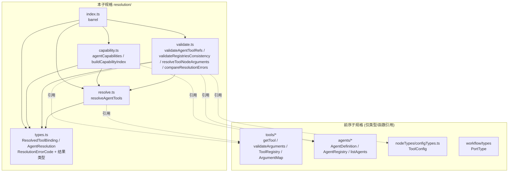

# 设计文档：智能体工具解析 (agent-tool-resolution)

## Overview

「智能体工具解析」(agent-tool-resolution) 是女娲 Nuwa「多智能体工作流编排引擎」的**第六个子规格**，构建于五个前序子规格之上（workflow-graph-model、workflow-node-types、workflow-execution-engine、agent-definition-registry、agent-tool-system）。

本子规格定义一个**纯库**，把「智能体的工具绑定」(`ToolBinding`) 与「工作流 `tool` 节点的实参绑定」(`ToolConfig.argumentBindings`) **解析**到具体 `ToolDefinition` 并**交叉校验**一致性。实现位于 `app/web/src/lib/resolution/`。

### 设计目标

1. **纯数据 + 纯函数**：无 I/O、无 React、无网络、无可变全局状态、无时间或随机依赖、不执行工具/工作流；对相同输入恒返回相同输出（R1.1、R1.3、R1.5）。
2. **全函数解析**：`resolveAgentTools` 把绑定划分为「已解析」与「未解析」两部分，绝不抛异常（R3.1）。
3. **结果类型表达错误**：校验函数返回 `{ valid, errors }`，错误为带稳定 `ResolutionErrorCode` 的 `ResolutionError` 值（R4、R5、R6）。
4. **错误码跨层互斥**：`ResolutionErrorCode` 全部以 `RESOLUTION_` 前缀命名，取值与前序五层枚举两两不相交（R7）。
5. **复用前序层**：以类型/函数引用 `getTool`、`validateArguments`、`listAgents`、`listTools` 等；不重定义前序类型（R1.2）。

### 与前序子规格的关系

| 层 | 模块 | 错误码 |
|---|---|---|
| 基础层 | `workflow/*` | `ErrorCode` |
| 配置层 | `workflow/nodeTypes/*` | `ConfigErrorCode` |
| 执行层 | `workflow/engine/*` | `ExecutorErrorCode` |
| 智能体层 | `agents/*` | `AgentErrorCode` |
| 工具层 | `tools/*` | `ToolErrorCode` |
| **本层** | **`resolution/*`** | **`ResolutionErrorCode`** |

六层错误码两两不相交（R7.2–R7.6）。`resolveToolNodeArguments` 委托工具层 `validateArguments`，并将其产出的 `ToolError`（任意 `TOOL_*` 码）统一包装为 `RESOLUTION_ARGUMENT_INVALID`（保留 `paramName` 定位），从而不向上层泄漏 `TOOL_` 码、维持本层错误码闭合（R6.4）。

## Architecture

### 模块依赖关系



依赖**无环**：`types` 为叶子；`resolve` 居其上；`validate`/`capability` 依赖 `resolve` 与 `types`；`index` 仅再导出。

### 设计决策与理由

- **决策 1：解析为全函数划分。** `resolveAgentTools` 遍历 `agent.tools`，按 `getTool` 命中与否划分为已解析/未解析两个列表，对绑定中的重复 `Tool_Id` 去重（每个 Tool_Id 至多出现一次），并各自排序，保证确定与稳定（R3、R9.2）。
- **决策 2：校验复用解析。** `validateAgentToolRefs` 直接以 `resolveAgentTools` 的 `unresolved` 列表产出 `RESOLUTION_TOOL_NOT_FOUND`，从而 `valid ⇔ unresolved 为空`（R4.5）。
- **决策 3：实参校验包装工具层错误。** `resolveToolNodeArguments` 先按 `toolConfig.toolName` 查 `getTool`；缺失 → `RESOLUTION_TOOL_NOT_FOUND` 且短路（R6.2）；否则先检测 `argName` 重复（R6.6），再把 `argumentBindings` 投影为 `Argument_Map`（`argName→portType`）委托 `validateArguments`，把每条 `ToolError` 包装为 `RESOLUTION_ARGUMENT_INVALID`（保留 `paramName`）（R6.3、R6.4）。
- **决策 4：能力为已解析工具标签之并。** `agentCapabilities` 取 `resolveAgentTools(agent).resolved` 中每个工具 `tags` 的并集去重排序；`buildCapabilityIndex` 在 `listAgents` 上聚合（R8）。
- **决策 5：稳定排序比较器。** `compareResolutionErrors` 先按 `ResolutionErrorCode` 声明序，再按 `(agentId, toolId, toolName, paramName, field)` 字典序，保证完整报告下输出顺序确定（R4.4、R5.4、R6.7）。

## Components and Interfaces

### `resolution/types.ts`

```typescript
import type { ToolDefinition } from '../tools/types';

/** 一个 Tool_Id 与其解析得到的 ToolDefinition 配对（R2.1）。 */
export interface ResolvedToolBinding {
  readonly toolId: string;
  readonly tool: ToolDefinition;
}

/** 对一个智能体解析的结果（R2.2）。 */
export interface AgentResolution {
  readonly agentId: string;
  readonly resolved: readonly ResolvedToolBinding[];   // 按 toolId 升序、去重
  readonly unresolved: readonly string[];              // 悬空 Tool_Id，按字典序、去重
}

/** 错误码（R7.1）：全部 RESOLUTION_ 前缀，取值与前序五层枚举不相交（R7.2–R7.6）。 */
export enum ResolutionErrorCode {
  RESOLUTION_TOOL_NOT_FOUND = 'RESOLUTION_TOOL_NOT_FOUND',       // R4.2 / R6.2
  RESOLUTION_AGENT_NOT_FOUND = 'RESOLUTION_AGENT_NOT_FOUND',     // 预留：按 id 解析智能体缺失
  RESOLUTION_ARGUMENT_INVALID = 'RESOLUTION_ARGUMENT_INVALID',   // R6.4
  RESOLUTION_DUPLICATE_ARGUMENT = 'RESOLUTION_DUPLICATE_ARGUMENT', // R6.6
}

/** 错误定位信息（R7.7）。 */
export interface ResolutionErrorLocation {
  readonly agentId?: string;
  readonly toolId?: string;
  readonly toolName?: string;
  readonly paramName?: string;
  readonly field?: string;
}

/** 单条错误值（R7.7）。 */
export interface ResolutionError {
  readonly code: ResolutionErrorCode;
  readonly message: string;
  readonly location: ResolutionErrorLocation;
}

/** 校验结果（R4.1 / R5.1 / R6.1）。valid 为真 ⇔ errors 为空。 */
export interface ResolutionValidationResult {
  readonly valid: boolean;
  readonly errors: readonly ResolutionError[];
}

/** Capability_Index：Capability(Tag) -> 持有该能力的 Agent_Id 集合（R8.3）。 */
export type CapabilityIndex = ReadonlyMap<string, ReadonlySet<string>>;
```

### `resolution/resolve.ts`

```typescript
import type { AgentDefinition } from '../agents/types';
import type { ToolRegistry } from '../tools/types';
import type { AgentResolution } from './types';

/**
 * 解析一个智能体的工具绑定（R3.1）。遍历 agent.tools，按 getTool 命中划分为
 * resolved / unresolved；对绑定中重复 Tool_Id 去重；resolved 按 toolId 升序、
 * unresolved 按字典序排序。全函数、不抛异常、确定、不修改输入。
 */
export function resolveAgentTools(
  agent: AgentDefinition,
  toolRegistry: ToolRegistry,
): AgentResolution;
```

### `resolution/validate.ts`

```typescript
import type { AgentDefinition, AgentRegistry } from '../agents/types';
import type { ToolRegistry } from '../tools/types';
import type { ToolConfig } from '../workflow/nodeTypes/configTypes';
import type { ResolutionValidationResult, ResolutionError } from './types';

/** 悬空引用校验（R4）。valid ⇔ resolveAgentTools(agent).unresolved 为空。 */
export function validateAgentToolRefs(
  agent: AgentDefinition,
  toolRegistry: ToolRegistry,
): ResolutionValidationResult;

/** 注册表一致性校验（R5）。聚合 agentRegistry 每个智能体的悬空引用，稳定排序。 */
export function validateRegistriesConsistency(
  agentRegistry: AgentRegistry,
  toolRegistry: ToolRegistry,
): ResolutionValidationResult;

/**
 * 工作流工具节点实参解析校验（R6）。Tool_Name 缺失 → RESOLUTION_TOOL_NOT_FOUND 且短路；
 * argName 重复 → RESOLUTION_DUPLICATE_ARGUMENT；否则投影 Argument_Map 委托 validateArguments，
 * 把每条 ToolError 包装为 RESOLUTION_ARGUMENT_INVALID（保留 paramName）。
 */
export function resolveToolNodeArguments(
  toolConfig: ToolConfig,
  toolRegistry: ToolRegistry,
): ResolutionValidationResult;

/** 稳定排序比较器：先按 ResolutionErrorCode 声明序，再按 (agentId, toolId, toolName, paramName, field) 字典序。 */
export function compareResolutionErrors(a: ResolutionError, b: ResolutionError): number;
```

### `resolution/capability.ts`

```typescript
import type { AgentDefinition, AgentRegistry } from '../agents/types';
import type { ToolRegistry } from '../tools/types';
import type { CapabilityIndex } from './types';

/** 智能体能力集合（R8.1）：已解析工具的 Tag_Set 之并，去重、按字典序排序。 */
export function agentCapabilities(
  agent: AgentDefinition,
  toolRegistry: ToolRegistry,
): readonly string[];

/** 能力索引（R8.3）：Capability -> 持有该能力的 Agent_Id 集合。 */
export function buildCapabilityIndex(
  agentRegistry: AgentRegistry,
  toolRegistry: ToolRegistry,
): CapabilityIndex;
```

### `resolution/index.ts`

barrel 模块，统一再导出全部公共 API 与类型。

## Data Models

### Registry_Json 不适用

本层不引入序列化（无 Registry_Json），仅做解析与校验派生，故无往返性质。

### 错误定位字段

| 函数 | 错误码 | location 填充 |
|---|---|---|
| `validateAgentToolRefs` | `RESOLUTION_TOOL_NOT_FOUND` | `agentId`, `toolId` |
| `validateRegistriesConsistency` | `RESOLUTION_TOOL_NOT_FOUND` | `agentId`, `toolId` |
| `resolveToolNodeArguments` | `RESOLUTION_TOOL_NOT_FOUND` | `toolName` |
| `resolveToolNodeArguments` | `RESOLUTION_DUPLICATE_ARGUMENT` | `paramName`(=argName) |
| `resolveToolNodeArguments` | `RESOLUTION_ARGUMENT_INVALID` | `paramName`(来自 ToolError 的 paramName) |

## 关键算法

### 算法 1：`resolveAgentTools`（R3、R9.2）

```
resolveAgentTools(agent, toolRegistry):
  seen = new Set()
  resolvedMap = new Map()   // toolId -> ToolDefinition
  unresolvedSet = new Set()
  for b in agent.tools:
    if seen.has(b.toolId): continue        // 去重：每个 Tool_Id 至多处理一次
    seen.add(b.toolId)
    def = getTool(toolRegistry, b.toolId)
    if def !== undefined: resolvedMap.set(b.toolId, def)
    else: unresolvedSet.add(b.toolId)
  resolved   = [...resolvedMap].sort(byKey).map(([toolId, tool]) => ({ toolId, tool }))
  unresolved = [...unresolvedSet].sort(cmp)
  return { agentId: agent.id, resolved, unresolved }
```

- 划分完备（R3.3）：每个去重后的 Tool_Id 恰落入 resolved 或 unresolved 之一，二者之并等于绑定 Tool_Id 集合。
- 忠实（R3.4）：resolved 的 tool 即 `getTool` 所返回。

### 算法 2：`validateAgentToolRefs`（R4）

```
validateAgentToolRefs(agent, toolRegistry):
  { unresolved } = resolveAgentTools(agent, toolRegistry)
  errors = unresolved.map(toolId => ({
    code: RESOLUTION_TOOL_NOT_FOUND, message, location: { agentId: agent.id, toolId }
  }))
  errors.sort(compareResolutionErrors)
  return { valid: errors.length === 0, errors }
```

### 算法 3：`validateRegistriesConsistency`（R5）

```
validateRegistriesConsistency(agentRegistry, toolRegistry):
  errors = []
  for agent in listAgents(agentRegistry):     // 按 Agent_Id 升序
    errors += validateAgentToolRefs(agent, toolRegistry).errors
  errors.sort(compareResolutionErrors)
  return { valid: errors.length === 0, errors }
```

### 算法 4：`resolveToolNodeArguments`（R6）

```
resolveToolNodeArguments(toolConfig, toolRegistry):
  tool = getTool(toolRegistry, toolConfig.toolName)
  if tool === undefined:
    return { valid:false, errors:[{ code: RESOLUTION_TOOL_NOT_FOUND, message, location:{ toolName: toolConfig.toolName } }] }
  errors = []
  // argName 重复检测（R6.6）
  counts = 统计 toolConfig.argumentBindings.map(b => b.argName) 多重性
  for name where counts[name] >= 2: errors.push(RESOLUTION_DUPLICATE_ARGUMENT, paramName=name)
  // 投影 Argument_Map（去重后以首现为准）并委托 validateArguments（R6.3、R6.4）
  argMap = new Map()
  for b in toolConfig.argumentBindings: if !argMap.has(b.argName): argMap.set(b.argName, b.portType)
  for te in validateArguments(tool, argMap).errors:
    errors.push({ code: RESOLUTION_ARGUMENT_INVALID, message: te.message, location: { paramName: te.location.paramName, toolName: toolConfig.toolName } })
  errors.sort(compareResolutionErrors)
  return { valid: errors.length === 0, errors }
```

### 算法 5：`agentCapabilities` / `buildCapabilityIndex`（R8）

```
agentCapabilities(agent, toolRegistry):
  caps = new Set()
  for rb in resolveAgentTools(agent, toolRegistry).resolved:
    for tag in rb.tool.tags: caps.add(tag)
  return [...caps].sort(cmp)

buildCapabilityIndex(agentRegistry, toolRegistry):
  index = new Map<string, Set<string>>()
  for agent in listAgents(agentRegistry):
    for cap in agentCapabilities(agent, toolRegistry):
      index.get(cap)?.add(agent.id) ?? index.set(cap, new Set([agent.id]))
  return index
```

## Correctness Properties

*性质 (property) 是应在系统所有合法执行中恒成立的特征或行为。* 下列性质均为全称量化的可属性测试陈述，每条标注其验证的需求条款。数据模型形态由编译保证不出性质。

### Property 1: 解析划分完备且不相交
*对任意* `AgentDefinition` `a` 与 `ToolRegistry` `r`，`resolveAgentTools(a, r)` 的 resolved 的 toolId 集合与 unresolved 集合不相交，且二者之并等于 `a.tools` 中出现的 Tool_Id 集合（去重后）。
**Validates: Requirements 3.2, 3.3**

### Property 2: 解析忠实于注册表
*对任意* `a` 与 `r`，`resolveAgentTools(a, r)` 中每个 ResolvedToolBinding `rb` 满足 `rb.tool` 经 `toolEquals` 等于 `getTool(r, rb.toolId)`；且每个 unresolved 的 toolId 满足 `getTool(r, toolId) === undefined`。
**Validates: Requirements 3.4**

### Property 3: 解析稳定排序与去重
*对任意* `a` 与 `r`，`resolveAgentTools(a, r)` 的 resolved 的 toolId 序列严格升序（去重且非降），unresolved 序列严格升序；agentId 等于 `a.id`。
**Validates: Requirements 3.5, 9.2**

### Property 4: 解析确定性与不可变性
*对任意* `a` 与 `r`，两次 `resolveAgentTools(a, r)` 返回深相等结果；且调用不改变 `a` 与 `r`（以调用前后序列化比较）。
**Validates: Requirements 1.3, 1.4, 9.1, 9.3**

### Property 5: 悬空引用校验对应 unresolved
*对任意* `a` 与 `r`，`validateAgentToolRefs(a, r)` 的错误恰为：对每个 `resolveAgentTools(a, r).unresolved` 中的 toolId 各一条 `RESOLUTION_TOOL_NOT_FOUND`（定位 agentId 与该 toolId）；且 `valid` 为真当且仅当 unresolved 为空。
**Validates: Requirements 4.2, 4.3, 4.5**

### Property 6: 悬空引用校验完整报告与确定性
*对任意* `a` 与 `r`，`validateAgentToolRefs` 报告全部悬空引用（数量等于 unresolved 长度），两次调用深相等，错误按 compareResolutionErrors 稳定排序。
**Validates: Requirements 4.4**

### Property 7: 注册表一致性聚合
*对任意* `AgentRegistry` `ar` 与 `ToolRegistry` `r`，`validateRegistriesConsistency(ar, r)` 的错误集合等于「对 `listAgents(ar)` 每个 agent 施加 `validateAgentToolRefs` 所得错误的并」（按稳定序）；且 `valid` 为真当且仅当每个 agent 均无悬空引用。
**Validates: Requirements 5.2, 5.3, 5.4**

### Property 8: 工具节点——工具缺失短路
*对任意* `ToolConfig` `c` 与 `ToolRegistry` `r`，IF `getTool(r, c.toolName) === undefined`，THEN `resolveToolNodeArguments(c, r)` 返回 `valid` 为假、错误集合恰含一条 `RESOLUTION_TOOL_NOT_FOUND`（定位 toolName）。
**Validates: Requirements 6.2**

### Property 9: 工具节点——重复 argName 检测
*对任意* `ToolConfig` `c`（其 toolName 存在于 `r`）含重复 argName，`resolveToolNodeArguments(c, r)` 的错误集合含一条 `RESOLUTION_DUPLICATE_ARGUMENT`（定位该 argName）。
**Validates: Requirements 6.6**

### Property 10: 工具节点——实参校验镜像 validateArguments
*对任意* 其 toolName 存在于 `r` 且 argName 互不相同的 `ToolConfig` `c`，令 `t = getTool(r, c.toolName)`、`m` 为由其 argumentBindings 投影的 Argument_Map，则 `resolveToolNodeArguments(c, r).valid` 等于 `validateArguments(t, m).valid`，且其 `RESOLUTION_ARGUMENT_INVALID` 错误所定位的 paramName 集合等于 `validateArguments(t, m)` 错误的 paramName 集合。
**Validates: Requirements 6.3, 6.4, 6.5**

### Property 11: 工具节点校验完整报告、确定与稳定排序
*对任意* 其 toolName 存在于 `r` 的 `ToolConfig` `c`，`resolveToolNodeArguments(c, r)` 两次调用深相等，错误按 compareResolutionErrors 稳定排序。
**Validates: Requirements 6.7**

### Property 12: 能力派生忠实且完备
*对任意* `a` 与 `r`，`agentCapabilities(a, r)` 的每个 Capability 均出现于某个已解析工具的 Tag_Set；且每个已解析工具的每个 Tag 均出现于 `agentCapabilities(a, r)`（并集忠实且完备），结果去重且按字典序升序。
**Validates: Requirements 8.1, 8.2**

### Property 13: 能力索引与逐项派生一致
*对任意* `AgentRegistry` `ar` 与 `ToolRegistry` `r`，对任意 Capability `c`，`buildCapabilityIndex(ar, r)` 中 `c` 对应的 Agent_Id 集合恰等于「`agentCapabilities(agent, r)` 含 `c` 的全部 agent 的 Agent_Id 集合」。
**Validates: Requirements 8.4**

### Property 14: 能力索引确定性与不变性
*对任意* `ar` 与 `r`，两次 `buildCapabilityIndex(ar, r)` 返回相等索引；调用不改变 `ar` 与 `r`。
**Validates: Requirements 8.5, 1.4**

### Property 15: 空绑定的平凡解析
*对任意* `Tool_Binding_List` 为空的 `a` 与任意 `r`，`resolveAgentTools(a, r)` 的 resolved 与 unresolved 均为空，`validateAgentToolRefs(a, r).valid` 为真，`agentCapabilities(a, r)` 为空。
**Validates: Requirements 9.4**

### Property 16: 校验结果 valid 当且仅当无错误且错误良构
*对任意* 上述三个校验函数的合法输入，结果 `valid` 为真当且仅当 `errors` 为空，且每条 ResolutionError 的 `message` 为非空字符串、`location` 为对象。
**Validates: Requirements 4.1, 5.1, 6.1, 7.7**

### Property 17: 错误码跨层互斥
*对任意* `ResolutionErrorCode` 取值 `c`，`c` 不出现于 `ErrorCode`、`ConfigErrorCode`、`ExecutorErrorCode`、`AgentErrorCode`、`ToolErrorCode` 任一取值集合（六层错误码两两不相交）。
**Validates: Requirements 7.2, 7.3, 7.4, 7.5, 7.6**

## Error Handling

本层不抛业务异常，全部错误以值表达。

- **悬空引用**：`validateAgentToolRefs`/`validateRegistriesConsistency` 对每个未解析 Tool_Id 产出 `RESOLUTION_TOOL_NOT_FOUND`（定位 agentId、toolId）。
- **工具节点**：`resolveToolNodeArguments` —— toolName 缺失 → `RESOLUTION_TOOL_NOT_FOUND`（定位 toolName）且短路；argName 重复 → `RESOLUTION_DUPLICATE_ARGUMENT`；实参不合参数模式 → `RESOLUTION_ARGUMENT_INVALID`（包装工具层 ToolError，保留 paramName）。
- **稳定排序**：`compareResolutionErrors` 先按 `ResolutionErrorCode` 声明序、再按 `(agentId, toolId, toolName, paramName, field)` 字典序，最后 message 兜底；`valid` 与 `errors` 为空互为充要。
- **错误码隔离**：`ResolutionErrorCode` 全部 `RESOLUTION_` 前缀，取值与前序五层枚举两两不相交；委托 `validateArguments` 产出的 `TOOL_*` 码不外泄，统一包装为 `RESOLUTION_ARGUMENT_INVALID`。

## Testing Strategy

本层为纯函数库，含大量普适性质（解析划分、忠实、确定、稳定排序、校验对应、聚合、能力一致），**高度适合属性测试 (PBT)**。

### 测试框架与运行

- 框架 `vitest`，属性库 `fast-check ^3`（均已安装）。单次运行 `npm run test`（`vitest --run`），在 `app/web` 目录。
- 每条属性测试 `numRuns` 至少 100。
- 文件布局：实现位于 `app/web/src/lib/resolution/`；属性测试为 `prop-01.test.ts`…`prop-17.test.ts`；示例测试为 `example-*.test.ts`；生成器集中于 `arbitraries.ts`。
- 每文件首行注释：`// Feature: agent-tool-resolution, Property N: <性质标题>`。

### 自定义 Arbitraries（`arbitraries.ts`）

- 复用工具层 `tools/arbitraries` 的 `arbitraryValidToolDefinition`、`arbitraryRegistry`（作为 ToolRegistry 来源）与图层 `arbitraryPortType`。
- `arbitraryAgentWithToolIds(toolIds)`：构造一个合法 AgentDefinition，其 Tool_Binding_List 由给定 toolId 列表（可含存在与不存在者、可含重复）构成。
- `arbitraryToolRegistryAndAgent`：先生成一个 ToolRegistry，再生成一个 agent，其绑定 toolId 部分取自注册表已有 id、部分取自随机串（制造悬空）。
- `arbitraryAgentRegistry`：复用 agents 层 `arbitraryRegistry`（作为 AgentRegistry 来源）。
- `arbitraryToolConfig(tool?)`：构造 ToolConfig，其 toolName 与 argumentBindings 可对齐或不对齐某工具的参数模式（制造缺失/未知/类型不匹配/重复 argName）。
- `arbitraryMalformed*`：不适用（本层无反序列化）。

### 单元 / 示例测试（`example-*.test.ts`）

- `example-empty-agent.test.ts`：空绑定智能体的平凡解析。
- `example-error-codes.test.ts`：`ResolutionErrorCode` 含 R7.1 列出的全部 4 个成员。
- `example-error-codes-disjoint.test.ts`：六层枚举取值两两不相交（Property 17 落地）。
- `example-tool-node-arguments.test.ts`：具体工具 + ToolConfig 的工具缺失/重复 argName/类型不匹配/通过四种代表性例。

### 验证清单（与需求映射）

| 需求簇 | 覆盖测试 |
|---|---|
| R3 解析 | Property 1, 2, 3, 4 |
| R4 悬空校验 | Property 5, 6, 16 |
| R5 一致性 | Property 7 |
| R6 工具节点实参 | Property 8, 9, 10, 11 |
| R7 错误码 | Property 17 + example-error-codes* |
| R8 能力 | Property 12, 13, 14 |
| R9 确定/不变/空 | Property 3, 4, 15 |
