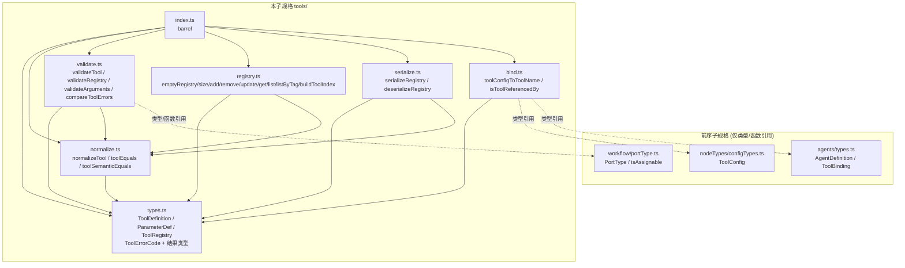

# 设计文档：智能体工具系统 (agent-tool-system)

## Overview

「智能体工具系统」(agent-tool-system) 是女娲 Nuwa「多智能体工作流编排引擎」的**第五个子规格**，构建于已实现的四个前序子规格之上：

- **工作流图模型** (workflow-graph-model, `app/web/src/lib/workflow/`)：提供 `PortType`、类型构造子、`isAssignable`、规范 JSON 序列化与基础层 `ErrorCode`。
- **工作流节点类型** (workflow-node-types, `app/web/src/lib/workflow/nodeTypes/`)：定义 `ToolConfig`（含 `toolName`、`argumentBindings`）与 `ConfigErrorCode`。
- **工作流执行引擎** (workflow-execution-engine, `app/web/src/lib/workflow/engine/`)：定义 `ExecutorErrorCode`。
- **智能体定义注册表** (agent-definition-registry, `app/web/src/lib/agents/`)：定义 `AgentDefinition`、`ToolBinding`（含 `toolId`）与 `AgentErrorCode`。

本子规格定义一个**纯库**，用于声明与管理「工具定义」(`ToolDefinition`)——即智能体可调用、工作流 `tool` 节点可引用的、带类型参数模式的工具规格。实现位于 `app/web/src/lib/tools/`。

### 设计目标

1. **纯数据 + 纯函数**：无 I/O、无 React、无网络、无可变全局状态、无时间或随机依赖、不真正执行任何工具；所有对外函数对相同输入恒返回相同输出（R1.1、R1.3、R1.5）。
2. **不可变集合**：`ToolRegistry` 是以 `Tool_Id` 为键的不可变映射；写操作 (`addTool`/`removeTool`/`updateTool`) 都返回**新注册表**而绝不就地修改输入（R1.4、R4.4）。
3. **结果类型表达错误**：写操作与反序列化返回可辨识联合结果，不抛异常；错误建模为带稳定 `ToolErrorCode` 的 `ToolError` 值（R5–R7、R13.6）。
4. **错误码跨层互斥**：`ToolErrorCode` 全部以 `TOOL_` 前缀命名，其取值集合与前序四层枚举取值集合两两不相交（R11）。
5. **规范化与唯一表示**：`normalizeTool` 把工具定义收敛到唯一的 `Canonical_Tool` 形式（标签/参数排序去重），幂等且对语义等价唯一（R12）。
6. **复用而不重定义**：仅以类型引用前序层 `PortType`、`isAssignable`、`ToolConfig`、`AgentDefinition`、`ToolBinding`；桥接函数为纯数据读取（R1.2、R15）。

### 与前序子规格的关系

| 层 | 模块 | 错误码 |
|---|---|---|
| 基础层 | `workflow/*` | `ErrorCode` |
| 配置层 | `workflow/nodeTypes/*` | `ConfigErrorCode` |
| 执行层 | `workflow/engine/*` | `ExecutorErrorCode` |
| 智能体层 | `agents/*` | `AgentErrorCode` |
| **本层** | **`tools/*`** | **`ToolErrorCode`** |

五层错误码两两不相交（R11.2–R11.5）。`validateArguments` 复用前序层 `isAssignable` 做类型兼容判定（R14.4）；`toolConfigToToolName` 读取前序层 `ToolConfig.toolName`（R15.1）。

## Architecture

### 模块依赖关系



依赖**无环**：`types` 为底层叶子；`normalize` 居其上；`validate`/`registry`/`serialize`/`bind` 居中（均依赖 `types`，多数依赖 `normalize`）；`index` 仅做再导出。

### 设计决策与理由

- **决策 1：底层用 `ReadonlyMap` 表达注册表。** `ToolRegistry` 包装 `ReadonlyMap<string, ToolDefinition>`。写操作通过 `new Map(old)` 复制后单点变更，保证输入不变（R1.4、R4.4）。`getTool` 返回 `ToolDefinition | undefined` 而非抛异常（R8.1）。
- **决策 2：结果类型而非异常。** 写操作返回 `ToolRegistryResult`，反序列化返回 `RegistryDeserializeResult`，校验返回 `*ValidationResult`，均为可辨识联合或 `{valid, errors}`，与前序层风格一致。
- **决策 3：判等基于语义内容。** `toolEquals`（结构逐字段，参数/标签按序）与 `toolSemanticEquals`（先 `normalizeTool` 再 `toolEquals`，忽略参数/标签顺序）两层（R2.5、R12.4）。
- **决策 4：规范化先去重后排序。** `normalizeTool` 标签去重排序、参数按 `Param_Name` 去重（保留首现）排序，其余字段语义不变（R12.2、R12.6）。
- **决策 5：序列化复用"先规范化、固定字段序、`JSON.stringify`"范式。** 语义等价注册表产出逐字符相同字符串（R13.5）；`deserializeRegistry` 严格结构校验，不符返回 `TOOL_MALFORMED_JSON`（R13.6）。
- **决策 6：参数校验复用 `isAssignable`。** `validateArguments` 用前序层 `isAssignable(argType, paramType)` 判定实参类型可赋值给形参类型（R14.4），完整报告全部违规、稳定排序（R14.6）。
- **决策 7：错误码 `TOOL_` 前缀隔离 + 静态不相交断言。** 由示例/属性测试静态导入五层枚举断言取值集合两两不相交（R11.2–R11.5）。

## Components and Interfaces

下列签名为各模块对外导出的**精确 TypeScript 契约**。所有相等/排序均按确定规则（UTF-16 码元字典序）。

### `tools/types.ts`

```typescript
import type { PortType } from '../workflow/portType';

/** 参数定义（R3.1）。 */
export interface ParameterDef {
  readonly name: string;      // Param_Name：非空、在一个 schema 内唯一
  readonly type: PortType;    // Param_Type：引用前序层 PortType
  readonly required: boolean; // Required 标志
}

/** 参数模式（R2.3）：有序的 ParameterDef 列表，Param_Name 不重复。 */
export type ParameterSchema = readonly ParameterDef[];

/** 工具定义（R2.1）：不可变、带类型的可复用工具规格。判等基于语义内容（R2.5）。 */
export interface ToolDefinition {
  readonly id: string;                  // Tool_Id：非空、注册表内唯一
  readonly name: string;                // Tool_Name：非空
  readonly description: string;         // Tool_Description：可为空串
  readonly parameters: ParameterSchema; // Parameter_Schema
  readonly resultType: PortType;        // Result_Type
  readonly tags: readonly string[];     // Tag_Set：不重复、每个非空
}

/** 以 Tool_Id 为键的不可变工具集合（R4.1）。 */
export interface ToolRegistry {
  readonly tools: ReadonlyMap<string, ToolDefinition>;
}

/** Argument_Map（R14.1）：Param_Name -> 实参 PortType。 */
export type ArgumentMap = ReadonlyMap<string, PortType>;

// —— 错误码（R11.1）：全部 TOOL_ 前缀，取值与前序四层枚举不相交（R11.2–R11.5）——

export enum ToolErrorCode {
  TOOL_DUPLICATE_ID = 'TOOL_DUPLICATE_ID',                       // R5.3 / R10.3
  TOOL_NOT_FOUND = 'TOOL_NOT_FOUND',                             // R6.3 / R7.3
  TOOL_EMPTY_ID = 'TOOL_EMPTY_ID',                               // R9.2
  TOOL_EMPTY_NAME = 'TOOL_EMPTY_NAME',                           // R9.3
  TOOL_EMPTY_PARAM_NAME = 'TOOL_EMPTY_PARAM_NAME',               // R9.4
  TOOL_DUPLICATE_PARAM = 'TOOL_DUPLICATE_PARAM',                 // R9.5
  TOOL_EMPTY_TAG = 'TOOL_EMPTY_TAG',                             // R9.6
  TOOL_MISSING_REQUIRED_ARGUMENT = 'TOOL_MISSING_REQUIRED_ARGUMENT', // R14.2
  TOOL_UNKNOWN_ARGUMENT = 'TOOL_UNKNOWN_ARGUMENT',              // R14.3
  TOOL_ARGUMENT_TYPE_MISMATCH = 'TOOL_ARGUMENT_TYPE_MISMATCH',  // R14.4
  TOOL_MALFORMED_JSON = 'TOOL_MALFORMED_JSON',                  // R13.6
}

/** 错误定位信息（R11.6）。 */
export interface ToolErrorLocation {
  readonly toolId?: string;     // 涉及的 Tool_Id
  readonly field?: string;      // 涉及的字段名（id/name）
  readonly paramName?: string;  // 涉及的 Param_Name
  readonly tag?: string;        // 涉及的 Tag
}

/** 单条错误值（R11.6）。 */
export interface ToolError {
  readonly code: ToolErrorCode;
  readonly message: string;
  readonly location: ToolErrorLocation;
}

// —— 结果类型 ——

export type ToolRegistryResult =
  | { readonly ok: true; readonly registry: ToolRegistry }
  | { readonly ok: false; readonly error: ToolError };

export type RegistryDeserializeResult =
  | { readonly ok: true; readonly registry: ToolRegistry }
  | { readonly ok: false; readonly error: ToolError };

export interface ToolValidationResult {
  readonly valid: boolean;
  readonly errors: readonly ToolError[];
}

export interface RegistryValidationResult {
  readonly valid: boolean;
  readonly errors: readonly ToolError[];
}

export interface ArgumentValidationResult {
  readonly valid: boolean;
  readonly errors: readonly ToolError[];
}

/** Tool_Index：Tag -> 持有该 Tag 的 Tool_Id 集合（R16.1）。 */
export type ToolIndex = ReadonlyMap<string, ReadonlySet<string>>;
```

### `tools/normalize.ts`

```typescript
import type { ToolDefinition } from './types';

/**
 * 规范化工具定义为 Canonical_Tool 形式（R12.1）：
 *   1. tags 去重并按字典序升序排序；
 *   2. parameters 按 name 字典序排序、对重复 name 去重（保留首现）。
 *   id/name/description/resultType 与每个 ParameterDef 的 type/required 语义不变（R12.6）。
 * 幂等（R12.3）、语义等价唯一（R12.4）、规范形式为不动点（R12.5）。
 */
export function normalizeTool(tool: ToolDefinition): ToolDefinition;

/** 结构逐字段相等（parameters/tags 按当前顺序逐元素比较）。 */
export function toolEquals(a: ToolDefinition, b: ToolDefinition): boolean;

/** 语义相等：normalizeTool(a) 与 normalizeTool(b) 经 toolEquals 相等（R2.5、R12.4）。 */
export function toolSemanticEquals(a: ToolDefinition, b: ToolDefinition): boolean;
```

`PortType` 的相等比较：复用前序层 `../workflow/portType` 导出的 `portTypeEquals`，`toolEquals` 比较 `resultType` 与 `param.type` 时直接调用之。实现细节见关键算法 1。

### `tools/validate.ts`

```typescript
import type {
  ToolDefinition, ToolValidationResult, ToolRegistry,
  RegistryValidationResult, ArgumentMap, ArgumentValidationResult, ToolError,
} from './types';

/** 单个工具校验（R9.1）。完整报告、不短路、稳定排序、确定（R9.8、R9.9）。 */
export function validateTool(tool: ToolDefinition): ToolValidationResult;

/** 注册表校验（R10.1）。逐项 + 全局 id 唯一（R10.2、R10.3），稳定排序（R10.5）。 */
export function validateRegistry(registry: ToolRegistry): RegistryValidationResult;

/**
 * 参数绑定校验（R14.1）。缺必需参数 → TOOL_MISSING_REQUIRED_ARGUMENT（R14.2）；
 * 未知参数 → TOOL_UNKNOWN_ARGUMENT（R14.3）；类型不可赋值 → TOOL_ARGUMENT_TYPE_MISMATCH（R14.4）。
 * 完整报告、稳定排序、确定（R14.6）；非必需缺失不报错（R14.7）。
 */
export function validateArguments(tool: ToolDefinition, argumentMap: ArgumentMap): ArgumentValidationResult;

/** 稳定排序比较器：先按 ToolErrorCode 声明序，再按 (toolId, field, paramName, tag) 字典序。 */
export function compareToolErrors(a: ToolError, b: ToolError): number;
```

### `tools/registry.ts`

```typescript
import type { ToolDefinition, ToolRegistry, ToolRegistryResult, ToolIndex } from './types';

export function emptyRegistry(): ToolRegistry;                                    // R4.2
export function size(registry: ToolRegistry): number;                            // R4.5
export function addTool(registry: ToolRegistry, tool: ToolDefinition): ToolRegistryResult;  // R5
export function removeTool(registry: ToolRegistry, toolId: string): ToolRegistryResult;     // R6
export function updateTool(registry: ToolRegistry, tool: ToolDefinition): ToolRegistryResult; // R7
export function getTool(registry: ToolRegistry, toolId: string): ToolDefinition | undefined; // R8.1
export function listTools(registry: ToolRegistry): readonly ToolDefinition[];    // R8.2（Listing_Order）
export function listByTag(registry: ToolRegistry, tag: string): readonly ToolDefinition[]; // R8.3
export function buildToolIndex(registry: ToolRegistry): ToolIndex;               // R16.1
```

### `tools/serialize.ts`

```typescript
import type { ToolRegistry, RegistryDeserializeResult } from './types';

export function serializeRegistry(registry: ToolRegistry): string;               // R13.1, R13.5
export function deserializeRegistry(json: string): RegistryDeserializeResult;    // R13.2, R13.6, R13.7
```

### `tools/bind.ts`

```typescript
import type { ToolDefinition } from './types';
import type { ToolConfig } from '../workflow/nodeTypes/configTypes';  // 仅类型引用
import type { AgentDefinition } from '../agents/types';               // 仅类型引用

/** 返回 toolConfig.toolName，作为查询 ToolRegistry 的键依据（R15.1）。 */
export function toolConfigToToolName(toolConfig: ToolConfig): string;

/** agent 的 Tool_Binding_List 是否含 toolId === tool.id 的绑定（R15.2）。 */
export function isToolReferencedBy(tool: ToolDefinition, agent: AgentDefinition): boolean;
```

### `tools/index.ts`

barrel 模块，统一再导出全部公共 API 与类型。

## Data Models

### 字段约束总表

| 字段 | 类型 | 约束 | 校验错误码 |
|---|---|---|---|
| `id` | string | 非空；注册表内唯一 | `TOOL_EMPTY_ID` / `TOOL_DUPLICATE_ID` |
| `name` | string | 非空 | `TOOL_EMPTY_NAME` |
| `description` | string | 可为空串 | —（无约束） |
| `parameters[].name` | string | 非空；schema 内唯一 | `TOOL_EMPTY_PARAM_NAME` / `TOOL_DUPLICATE_PARAM` |
| `parameters[].type` | PortType | 结构约束 | —（编译保证） |
| `parameters[].required` | boolean | 结构约束 | —（编译保证） |
| `resultType` | PortType | 结构约束 | —（编译保证） |
| `tags` | string[] | 不重复、每个非空 | `TOOL_EMPTY_TAG`（规范化去重顺序） |

### Registry_Json 结构（固定字段顺序）

```jsonc
{
  "version": 1,
  "tools": [
    {
      "id": "...", "name": "...", "description": "...",
      "parameters": [ { "name": "...", "type": "string", "required": true } ],
      "resultType": "json",
      "tags": [ "..." ]
    }
    // 条目按 id 升序
  ]
}
```

`type` 与 `resultType` 字段以前序层 `formatPortType(portType)` 的**规范字符串**编码（如 `"string"`、`"json"`、`"list<number>"`、`"optional<message>"`）。反序列化时用前序层 `parsePortType(s)`：返回 `null`（畸形）即触发 `TOOL_MALFORMED_JSON`，绝不部分构造。前序层保证 `portTypeEquals(parsePortType(formatPortType(t)), t)`，故 PortType 字段往返恒等。

## 关键算法

### 算法 1：`normalizeTool` 与 PortType 相等

```
portTypeEquals(a, b):
  return 前序层 portTypeEquals(a, b)   // 直接复用 ../workflow/portType 的结构化相等

normalizeTool(tool):
  tags'   = unique(tool.tags).sort(cmp)
  params' = uniqueByName(tool.parameters).sort((x,y)=>cmp(x.name, y.name))  // 去重保留首现
  return { ...tool, tags: tags', parameters: params' }    // id/name/description/resultType 不变（R12.6）
```

- 幂等/不动点（R12.3、R12.5）：已排序去重的集合再处理不变。
- 语义等价唯一（R12.4）：仅顺序不同的两定义规范化后 `parameters`/`tags` 序列逐元素相等。

### 算法 2：`validateTool` —— 完整报告、稳定排序（R9）

```
validateTool(tool):
  errors = []
  if tool.id === ''   -> push(TOOL_EMPTY_ID, field=id)               // R9.2
  if tool.name === '' -> push(TOOL_EMPTY_NAME, field=name)           // R9.3
  for p in tool.parameters:
    if p.name === ''  -> push(TOOL_EMPTY_PARAM_NAME, paramName='')   // R9.4
  for name 在 parameters 中重复出现者:
                      -> push(TOOL_DUPLICATE_PARAM, paramName=name)  // R9.5
  for tag in tool.tags:
    if tag === ''     -> push(TOOL_EMPTY_TAG, tag='')                // R9.6
  errors.sort(compareToolErrors)
  return { valid: errors.length===0, errors }                       // R9.7
```

### 算法 3：`validateRegistry`（R10）

```
validateRegistry(registry):
  errors = []
  for t in listTools(registry): errors += validateTool(t).errors    // R10.2
  counts = 统计 [...values()].map(t=>t.id) 多重性
  for id where counts[id] >= 2: push(TOOL_DUPLICATE_ID, toolId=id)   // R10.3
  errors.sort(compareToolErrors)
  return { valid: errors.length===0, errors }
```

### 算法 4：`addTool` / `removeTool` / `updateTool` —— 不可变写（R5–R7）

```
addTool(registry, tool):
  if registry.tools.has(tool.id): return { ok:false, error: TOOL_DUPLICATE_ID(toolId=tool.id) }  // R5.3
  next = new Map(registry.tools); next.set(tool.id, tool)
  return { ok:true, registry: { tools: next } }                     // R5.2/R5.5；原表不变（R5.4）

removeTool(registry, toolId):
  if !registry.tools.has(toolId): return { ok:false, error: TOOL_NOT_FOUND(toolId) }  // R6.3
  next = new Map(registry.tools); next.delete(toolId)
  return { ok:true, registry: { tools: next } }                     // R6.2/R6.5

updateTool(registry, tool):
  if !registry.tools.has(tool.id): return { ok:false, error: TOOL_NOT_FOUND(toolId=tool.id) }  // R7.3
  next = new Map(registry.tools); next.set(tool.id, tool)
  return { ok:true, registry: { tools: next } }                     // R7.2/R7.4/R7.5
```

- 添加/移除往返（R6.4）：`t.id ∉ r` 时 `addTool` 后 `removeTool` 还原与 `r` 语义相等的注册表。

### 算法 5：`validateArguments`（R14）

```
validateArguments(tool, argumentMap):
  errors = []
  // 缺必需参数（R14.2）
  for p in tool.parameters where p.required:
    if !argumentMap.has(p.name): push(TOOL_MISSING_REQUIRED_ARGUMENT, paramName=p.name)
  // 未知参数（R14.3）
  paramNames = new Set(tool.parameters.map(p=>p.name))
  for name in argumentMap.keys():
    if !paramNames.has(name): push(TOOL_UNKNOWN_ARGUMENT, paramName=name)
  // 类型不可赋值（R14.4）：对同名实参，要求 isAssignable(argType, paramType)
  for p in tool.parameters:
    argType = argumentMap.get(p.name)
    if argType !== undefined && !isAssignable(argType, p.type):
      push(TOOL_ARGUMENT_TYPE_MISMATCH, paramName=p.name)
  errors.sort(compareToolErrors)
  return { valid: errors.length===0, errors }                       // R14.5/R14.6；非必需缺失不报错（R14.7）
```

### 算法 6：规范 JSON 序列化与反序列化（R13）

```
serializeRegistry(registry):
  entries = listTools(registry).map(normalizeTool)                  // 规范化 + 按 id 排序
  plain = { version: 1, tools: entries.map(toolToPlain) }           // 固定字段顺序
  return JSON.stringify(plain)

deserializeRegistry(json):
  try parsed = JSON.parse(json) catch -> { ok:false, error: TOOL_MALFORMED_JSON }   // R13.6
  严格结构校验（对象、tools 数组、每条目字段类型/形态、parameters/tags 数组、
                 PortType 形态、required 为 boolean...）
  任一不符 -> { ok:false, error: TOOL_MALFORMED_JSON }（绝不部分构造）              // R13.6
  否则构造 Map 并 set(t.id, restore(t))；return { ok:true, registry }              // R13.7
```

- 往返恒等（R13.3）、字符串不动点（R13.4）、规范输出唯一（R13.5）同前序层范式。

### 算法 7：桥接（R15）

```
toolConfigToToolName(toolConfig): return toolConfig.toolName        // R15.1
isToolReferencedBy(tool, agent): return agent.tools.some(b => b.toolId === tool.id)  // R15.2
```

- 纯数据读取/判定，确定、不修改输入（R15.3、R15.4）。

## Correctness Properties

*性质 (property) 是应在系统所有合法执行中恒成立的特征或行为。* 下列性质均为全称量化的可属性测试陈述，每条标注其验证的需求条款。数据模型形态由编译保证不出性质；不可变性并入写性质；valid⇔errors 空统一表达；规范不动点并入幂等。

### Property 1: 添加成功——size 加一且原注册表不变
*对任意* `ToolRegistry` `r` 与 `Tool_Id` 不在 `r` 中的 `ToolDefinition` `t`，`addTool(r, t)` 成功，新表 `size === size(r)+1` 且 `getTool(新表, t.id)` 等于 `t`；输入 `r` 调用后 `size` 与全部条目不变。
**Validates: Requirements 5.2, 5.5, 4.5, 1.4**

### Property 2: 添加重复 id 失败
*对任意* 非空 `ToolRegistry` `r` 与 `Tool_Id` 取自 `r` 已有键的 `ToolDefinition` `t`，`addTool(r, t)` 失败，`code` 为 `TOOL_DUPLICATE_ID` 且定位该 id，`r` 不变。
**Validates: Requirements 5.3, 5.4**

### Property 3: 移除不存在的工具失败
*对任意* `ToolRegistry` `r` 与不存在于 `r` 的 `Tool_Id` `id`，`removeTool(r, id)` 失败，`code` 为 `TOOL_NOT_FOUND` 且定位该 id。
**Validates: Requirements 6.3**

### Property 4: 添加/移除往返恒等
*对任意* `ToolRegistry` `r` 与 `Tool_Id` 不在 `r` 中的 `ToolDefinition` `t`，`addTool` 后 `removeTool(·, t.id)` 成功且结果与 `r` 语义相等（键集合相同、对应定义 `toolEquals`）。
**Validates: Requirements 6.4, 6.5**

### Property 5: 更新保持 id 与键集合
*对任意* 非空 `ToolRegistry` `r`、取自 `r` 的 `Tool_Id` `id` 与任意内容 `body`，令 `t={...body, id}`，`updateTool(r, t)` 成功，`id` 处定义等于 `t`、其余不变，键集合与 `size` 不变，`id` 不变。
**Validates: Requirements 7.2, 7.4, 7.5**

### Property 6: 更新不存在的工具失败
*对任意* `ToolRegistry` `r` 与 `Tool_Id` 不在 `r` 中的 `ToolDefinition` `t`，`updateTool(r, t)` 失败，`code` 为 `TOOL_NOT_FOUND` 且定位该 id。
**Validates: Requirements 7.3**

### Property 7: getTool 命中与未命中
*对任意* `ToolRegistry` `r`：对每个键 `id`，`getTool(r, id)` 的 `id` 字段等于 `id`；对不在 `r` 的 `id` 返回 `undefined`（不抛异常）。
**Validates: Requirements 8.1**

### Property 8: 列举顺序、长度与确定性
*对任意* `ToolRegistry` `r`，`listTools(r)` 的 `Tool_Id` 序列字典序非降、长度等于 `size(r)`、`Tool_Id` 两两不同，两次调用逐元素相同。
**Validates: Requirements 8.2, 8.4, 8.5**

### Property 9: validateTool 逐类违规检测
*对任意* 合法 `ToolDefinition` `t`，单点注入下列任一违规后 `validateTool` 必产出对应 `ToolErrorCode` 且定位正确：空 `id`⇒`TOOL_EMPTY_ID`；空 `name`⇒`TOOL_EMPTY_NAME`；空 `Param_Name`⇒`TOOL_EMPTY_PARAM_NAME`；重复 `Param_Name`⇒`TOOL_DUPLICATE_PARAM`；空 `Tag`⇒`TOOL_EMPTY_TAG`。
**Validates: Requirements 9.2, 9.3, 9.4, 9.5, 9.6**

### Property 10: validateTool 完整报告、确定与稳定排序
*对任意* 注入 *k≥2* 处独立违规的 `ToolDefinition`，`validateTool` 报告每处对应码（不短路）；两次调用相等；对 `parameters`/`tags` 书写顺序置换，错误序列在排序键下一致。
**Validates: Requirements 9.8, 9.9**

### Property 11: 校验结果 valid 当且仅当无错误且错误良构
*对任意* `ToolDefinition` `t`，`validateTool(t).valid` ⇔ `errors` 空，且每条 `message` 非空、`location` 为对象；*对任意* `ToolRegistry` `r`，`validateRegistry(r).valid` ⇔ `errors` 空。
**Validates: Requirements 9.7, 10.4, 11.6**

### Property 12: validateRegistry 重复 id 检测
*对任意* 由两个或更多 `ToolDefinition` 值持有相同 `Tool_Id` 构造的 `ToolRegistry`，`validateRegistry` 含一条 `TOOL_DUPLICATE_ID` 且定位该 id。
**Validates: Requirements 10.3**

### Property 13: 注册表合法蕴含逐项合法
*对任意* 使 `validateRegistry(r).valid` 为真的 `r`，`listTools(r)` 每个定义单独 `validateTool` 亦 `valid`。
**Validates: Requirements 10.2, 10.6**

### Property 14: normalizeTool 幂等与不动点
*对任意* `ToolDefinition` `t`，`normalizeTool(normalizeTool(t))` 与 `normalizeTool(t)` `toolEquals`；已规范形式经 `normalizeTool` 不变。
**Validates: Requirements 12.3, 12.5**

### Property 15: normalizeTool 语义等价唯一且保持关键字段
*对任意* `ToolDefinition` `t` 与其仅在 `tags`/`parameters` 顺序上不同的重排版本 `t'`，`normalizeTool(t)` 与 `normalizeTool(t')` `toolEquals`；且 `normalizeTool(t)` 的 `id`/`name`/`description`/`resultType` 与 `t` 相应字段语义相等。
**Validates: Requirements 12.4, 12.6**

### Property 16: 序列化往返恒等
*对任意* `ToolRegistry` `r`，`deserializeRegistry(serializeRegistry(r))` 成功，其注册表与"对 `r` 每个定义施加 `normalizeTool` 后的注册表"语义相等（键集合相同、逐个 `toolEquals`，全部组成部分保留）。
**Validates: Requirements 13.3, 13.7**

### Property 17: 规范字符串往返与规范输出唯一
*对任意* `ToolRegistry` `r`，令 `j=serializeRegistry(r)`，`deserializeRegistry(j)` 成功且 `serializeRegistry(其注册表)` 逐字符等于 `j`；且对 `r` 的语义等价变体 `r'`，`serializeRegistry(r')` 逐字符等于 `j`。
**Validates: Requirements 13.4, 13.5**

### Property 18: 反序列化拒斥畸形输入
*对任意* 不符合 `Registry_Json` 结构的字符串 `s`，`deserializeRegistry(s)` 失败，`code` 为 `TOOL_MALFORMED_JSON`，不抛异常、不部分构造。
**Validates: Requirements 13.6**

### Property 19: validateArguments 缺必需/未知/类型不匹配检测
*对任意* `ToolDefinition` `t`：缺失某必需参数 ⇒ `TOOL_MISSING_REQUIRED_ARGUMENT` 定位该 `Param_Name`；含未知参数名 ⇒ `TOOL_UNKNOWN_ARGUMENT` 定位该名；同名实参类型不可赋值 ⇒ `TOOL_ARGUMENT_TYPE_MISMATCH` 定位该名。
**Validates: Requirements 14.2, 14.3, 14.4**

### Property 20: validateArguments 合法齐备时通过且非必需缺失不报错
*对任意* `ToolDefinition` `t` 与一个仅含其全部必需参数、且实参类型等于形参类型、且不含未知参数的 `Argument_Map`，`validateArguments` 返回 `valid` 为真、`errors` 空；缺失非必需参数不产出任何错误。
**Validates: Requirements 14.5, 14.7**

### Property 21: validateArguments 完整报告与确定性
*对任意* 同时含缺必需 + 未知 + 类型不匹配三类违规的输入，`validateArguments` 的错误集合含三类对应码（不短路）；两次调用相等。
**Validates: Requirements 14.6**

### Property 22: 桥接确定且不变
*对任意* `ToolConfig` `c`，`toolConfigToToolName(c)` 等于 `c.toolName`；*对任意* `ToolDefinition` `t` 与 `AgentDefinition` `a`，`isToolReferencedBy(t, a)` 为真当且仅当 `a.tools` 含 `toolId === t.id` 的绑定；两函数对相同输入返回相同结果，且不修改输入。
**Validates: Requirements 15.1, 15.2, 15.3, 15.4**

### Property 23: 标签索引与按标签查找的一致与精确
*对任意* `ToolRegistry` `r`：对任意 `Tag` `t`，`buildToolIndex(r)` 中 `t` 对应的 `Tool_Id` 集合恰等于 `listByTag(r, t)` 的 `Tool_Id` 集合；`listByTag(r, t)` 每个定义的 `Tag_Set` 均含 `t` 且其余定义均不含。
**Validates: Requirements 16.2, 16.3, 16.4**

### Property 24: 错误码跨层互斥
*对任意* `ToolErrorCode` 取值 `c`，`c` 不出现于基础层 `ErrorCode`、配置层 `ConfigErrorCode`、执行层 `ExecutorErrorCode`、智能体层 `AgentErrorCode` 取值集合（五层错误码两两不相交）。
**Validates: Requirements 11.2, 11.3, 11.4, 11.5**

## Error Handling

本层不抛业务异常，全部错误以值表达；反序列化结构校验的内部哨兵在 `deserializeRegistry` 内被捕获并转为 `TOOL_MALFORMED_JSON`，绝不逃逸。

- **写操作失败**：`addTool`（id 冲突）→ `TOOL_DUPLICATE_ID`；`removeTool`/`updateTool`（id 缺失）→ `TOOL_NOT_FOUND`。失败时输入注册表不变。
- **校验错误**：`validateTool`/`validateRegistry`/`validateArguments` 一次性收集全部违规，按 `compareToolErrors`（先按 `ToolErrorCode` 声明序、再按 `(toolId, field, paramName, tag)` 字典序）稳定排序；`valid` 与 `errors` 为空互为充要。
- **反序列化错误**：`JSON.parse` 失败或结构校验失败 → `TOOL_MALFORMED_JSON`，不部分构造（R13.6）。
- **错误码隔离**：`ToolErrorCode` 全部 `TOOL_` 前缀，取值与前序四层枚举两两不相交，便于跨层聚合归因。

## Testing Strategy

本层是纯函数库，含大量普适性质（不可变写、往返、幂等、规范唯一、参数校验分划、查询分划），**高度适合属性测试 (PBT)**。

### 测试框架与运行

- 框架 `vitest`，属性库 `fast-check ^3`（均已安装）。单次运行 `npm run test`（`vitest --run`），在 `app/web` 目录。
- 每条属性测试 `numRuns` 至少 100。
- 文件布局：实现位于 `app/web/src/lib/tools/`；属性测试为 `prop-01.test.ts`…`prop-24.test.ts`（每条性质一文件、一 PBT）；示例测试为 `example-*.test.ts`；自定义生成器集中于 `arbitraries.ts`。
- 每文件首行注释：`// Feature: agent-tool-system, Property N: <性质标题>`。

### 自定义 Arbitraries（`arbitraries.ts`）

- `arbitraryPortType`：复用/构造前序层 `PortType` 值（string/number/boolean/json 等基本类型，必要时含复合）。
- `arbitraryParameterDef` / `arbitraryParameterSchema`：生成参数定义与模式（可含重复 name 与乱序，用于校验/规范化）。
- `arbitraryToolDefinition`：生成工具定义，`tags`/`parameters` 可含重复与乱序、空串，用于校验/规范化/序列化。
- `arbitraryValidToolDefinition`：必然通过 `validateTool` 的合法工具（非空 id/name、参数 name 非空唯一、tag 非空）。
- `arbitraryReorderedTool`：给定工具的语义等价重排版本（打乱 tags/parameters 顺序）。
- `arbitraryRegistry`：由 id 唯一的合法工具构造注册表。
- `arbitraryDuplicateIdRegistryValues`：含两条 .id 相同值的注册表（不同占位键）。
- `arbitraryArgumentMap(tool)`：基于一个工具生成实参映射（含齐备/缺失/未知/类型匹配与不匹配多种情形）。
- `arbitraryMalformedRegistryJson`：畸形 JSON。

### 单元 / 示例测试（`example-*.test.ts`）

- `example-empty-registry.test.ts`：空注册表查询。
- `example-error-codes.test.ts`：`ToolErrorCode` 含全部 11 个成员。
- `example-error-codes-disjoint.test.ts`：五层枚举取值两两不相交（Property 24 落地）。
- `example-validate-arguments.test.ts`：具体工具 + 实参映射的缺必需/未知/类型不匹配/通过四种代表性例。
- `example-deserialize-malformed.test.ts`：典型畸形串 → `TOOL_MALFORMED_JSON`。

### 验证清单（与需求映射）

| 需求簇 | 覆盖测试 |
|---|---|
| R5 添加 | Property 1, 2 |
| R6 移除/往返 | Property 3, 4 |
| R7 更新 | Property 5, 6 |
| R8 查询/列举 | Property 7, 8 |
| R9 单体校验 | Property 9, 10, 11 |
| R10 注册表校验 | Property 11, 12, 13 |
| R11 错误码 | Property 24 + example-error-codes* |
| R12 规范化 | Property 14, 15 |
| R13 序列化 | Property 16, 17, 18 |
| R14 参数校验 | Property 19, 20, 21 |
| R15 桥接 | Property 22 |
| R16 查询派生 | Property 23 |
