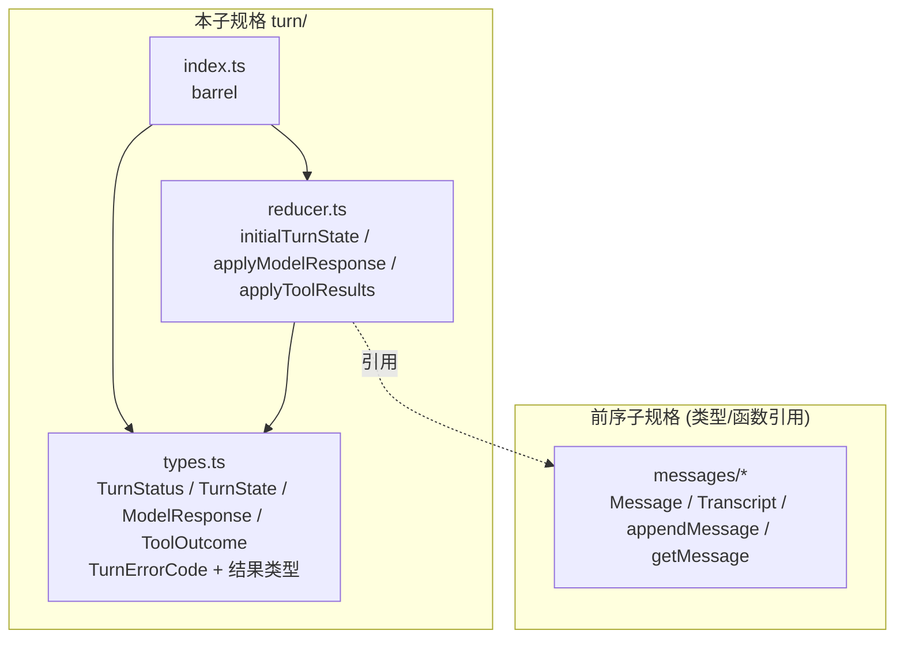
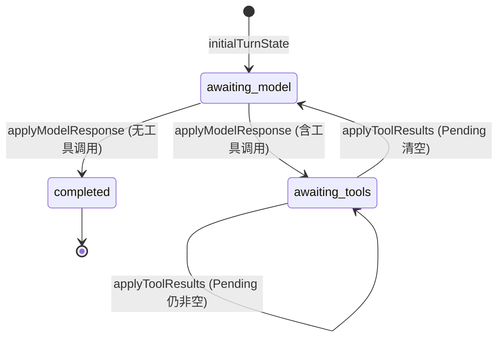

# 设计文档：智能体回合 Reducer (agent-turn-reducer)

## Overview

「智能体回合 Reducer」(agent-turn-reducer) 是女娲 Nuwa「多智能体工作流编排引擎」的**第九个子规格**，定义推进单段对话的纯、确定 reducer 状态机。模型输出与工具结果以**纯数据注入**（本层不调用 LLM/工具）。实现位于 `app/web/src/lib/turn/`。本层为**纯库**：无 I/O、无 React、无网络、无可变全局状态、对相同输入恒返回相同输出。

### 设计目标

1. **纯数据 + 纯函数**（R1）。
2. **不可变状态转换**：转换返回新 `Turn_State`，绝不就地修改输入（R1.4）。
3. **结果类型表达错误**：`applyModelResponse`/`applyToolResults` 返回 `TurnResult`，错误为带稳定 `TurnErrorCode` 的 `TurnError`（R4、R5）。
4. **错误码跨层互斥**：`TurnErrorCode` 全部 `TURN_` 前缀，与前八层枚举两两不相交（R6）。
5. **复用消息层**：用 messages 层 `appendMessage` 追加助手/工具消息、用 `getMessage` 检测 Message_Id 冲突；产出的 Transcript 在 `validateTranscript` 下保持良构（R7.5）。

### 与前序子规格的关系

`applyModelResponse` 产出 messages 层 `Message`（role `assistant`，文本片段 + tool_call 片段），`applyToolResults` 产出 `Message`（role `tool`，tool_result 片段）。两者均经 messages 层 `appendMessage` 追加（复用其不可变追加与重复 id 检测）。错误码互斥性质静态引用前八层枚举。

## Architecture

### 模块依赖关系



依赖**无环**：`types` 叶子；`reducer` 依赖 types 与 messages 层函数；`index` 再导出。

### 设计决策与理由

- **决策 1：助手消息 id 取自 Model_Response。** `applyModelResponse` 以 `response.messageId` 作为追加消息的 id，并通过 `getMessage` 先行检测冲突，冲突即 `TURN_DUPLICATE_MESSAGE_ID`（R4.3）。
- **决策 2：工具结果消息 id 由长度派生。** `applyToolResults` 追加的 `tool` 消息 id = `TOOL_RESULT_MESSAGE_ID_PREFIX + transcript.messages.length`；因 Transcript 每次追加长度递增，故同一推进链内派生 id 互不相同，且带固定前缀，不与常规消息 id 冲突，保证不引入重复 Message_Id（R7.5）。
- **决策 3：Pending_Call_Ids 去重保序。** `applyModelResponse` 写入 Pending 时按 Tool_Call_List 顺序去重；`applyToolResults` 从 Pending 移除 `outcomes` 出现的 Call_Id，保留剩余相对顺序（R4.4、R5.7）。
- **决策 4：状态与待决一致。** 任意成功转换后，`awaiting_tools ⇔ Pending 非空`；`completed` 仅由"无工具调用的模型输出"产生且为终态（R7.3、R7.4）。
- **决策 5：复用 appendMessage 的不可变性。** 追加经 messages 层 `appendMessage`（复制底层数组），天然不就地修改输入 Transcript；本层亦不修改输入 state（构造新 `{ transcript, status, pendingCallIds }`）。

## Components and Interfaces

### `turn/types.ts`

```typescript
import type { Transcript } from '../messages/types';

/** 回合状态机状态（R2.2）。 */
export type TurnStatus = 'awaiting_model' | 'awaiting_tools' | 'completed';

/** 回合状态（R2.1）。 */
export interface TurnState {
  readonly transcript: Transcript;
  readonly status: TurnStatus;
  readonly pendingCallIds: readonly string[]; // 去重、保序
}

/** Model_Response 中的单个工具调用（R2.3）。 */
export interface ResponseToolCall {
  readonly callId: string;
  readonly toolName: string;
  readonly argumentsJson: string;
}

/** 模型一步输出（R2.3）。 */
export interface ModelResponse {
  readonly messageId: string;
  readonly assistantText?: string;        // 可选助手文本
  readonly toolCalls: readonly ResponseToolCall[];
}

/** 工具结果（R2.4）。 */
export interface ToolOutcome {
  readonly callId: string;
  readonly resultJson: string;
}

/** 错误码（R6.1）：全部 TURN_ 前缀，与前八层枚举不相交（R6.2–R6.9）。 */
export enum TurnErrorCode {
  TURN_INVALID_STATE = 'TURN_INVALID_STATE',                 // R4.2 / R5.2
  TURN_DUPLICATE_MESSAGE_ID = 'TURN_DUPLICATE_MESSAGE_ID',   // R4.3
  TURN_UNKNOWN_CALL_ID = 'TURN_UNKNOWN_CALL_ID',             // R5.3
}

/** 错误定位信息（R6.10）。 */
export interface TurnErrorLocation {
  readonly callId?: string;
  readonly messageId?: string;
  readonly status?: TurnStatus;
}

/** 单条错误值（R6.10）。 */
export interface TurnError {
  readonly code: TurnErrorCode;
  readonly message: string;
  readonly location: TurnErrorLocation;
}

/** 转换结果（R4.1 / R5.1）。 */
export type TurnResult =
  | { readonly ok: true; readonly state: TurnState }
  | { readonly ok: false; readonly error: TurnError };

/** 工具结果消息的 Message_Id 前缀（决策 2）。 */
export const TOOL_RESULT_MESSAGE_ID_PREFIX = 'turn:tool-result:';
```

### `turn/reducer.ts`

```typescript
import type { Transcript } from '../messages/types';
import type { TurnState, ModelResponse, ToolOutcome, TurnResult } from './types';

/** 从 Transcript 构造初始 Turn_State（R3）：status awaiting_model、pending 空。 */
export function initialTurnState(transcript: Transcript): TurnState;

/** 施加模型输出（R4）。仅 awaiting_model 合法；追加 assistant 消息；据工具调用转移状态。 */
export function applyModelResponse(state: TurnState, response: ModelResponse): TurnResult;

/** 施加工具结果（R5）。仅 awaiting_tools 合法；追加 tool 消息；结算 Pending。 */
export function applyToolResults(state: TurnState, outcomes: readonly ToolOutcome[]): TurnResult;
```

### `turn/index.ts`

barrel 模块，统一再导出全部公共 API 与类型。

## Data Models

### 状态机转移图



### 错误条件总表

| 函数 | 条件 | 错误码 | location |
|---|---|---|---|
| `applyModelResponse` | status ≠ awaiting_model | `TURN_INVALID_STATE` | status |
| `applyModelResponse` | messageId 已在 Transcript | `TURN_DUPLICATE_MESSAGE_ID` | messageId |
| `applyToolResults` | status ≠ awaiting_tools | `TURN_INVALID_STATE` | status |
| `applyToolResults` | outcome.callId ∉ Pending | `TURN_UNKNOWN_CALL_ID` | callId |

## 关键算法

### 算法 1：`initialTurnState`（R3）

```
initialTurnState(transcript):
  return { transcript, status: 'awaiting_model', pendingCallIds: [] }
```

### 算法 2：`applyModelResponse`（R4）

```
applyModelResponse(state, response):
  if state.status !== 'awaiting_model':
      return { ok:false, error: TURN_INVALID_STATE(status=state.status) }            // R4.2
  if getMessage(state.transcript, response.messageId) !== undefined:
      return { ok:false, error: TURN_DUPLICATE_MESSAGE_ID(messageId=response.messageId) } // R4.3
  parts = []
  if response.assistantText !== undefined: parts.push({ kind:'text', text: response.assistantText })
  for c in response.toolCalls: parts.push({ kind:'tool_call', callId:c.callId, toolName:c.toolName, argumentsJson:c.argumentsJson })
  if parts.length === 0: parts = [{ kind:'text', text:'' }]    // 保证 Part_List 非空（消息层良构）
  msg = { id: response.messageId, role:'assistant', parts }
  appended = appendMessage(state.transcript, msg)              // 复用消息层不可变追加
  if !appended.ok: return { ok:false, error: TURN_DUPLICATE_MESSAGE_ID(messageId=response.messageId) }  // 双保险
  pending = uniqueInOrder(response.toolCalls.map(c => c.callId))
  status = pending.length > 0 ? 'awaiting_tools' : 'completed'                        // R4.4 / R4.5
  return { ok:true, state: { transcript: appended.transcript, status, pendingCallIds: pending } }
```

- 新 Transcript 恰多一条消息，输入 state 不变（R4.6）。

### 算法 3：`applyToolResults`（R5）

```
applyToolResults(state, outcomes):
  if state.status !== 'awaiting_tools':
      return { ok:false, error: TURN_INVALID_STATE(status=state.status) }            // R5.2
  pendingSet = new Set(state.pendingCallIds)
  for o in outcomes:
      if !pendingSet.has(o.callId):
          return { ok:false, error: TURN_UNKNOWN_CALL_ID(callId=o.callId) }          // R5.3
  parts = outcomes.map(o => ({ kind:'tool_result', callId:o.callId, resultJson:o.resultJson }))
  if parts.length === 0: parts = ... // outcomes 为空时仍合法：见下
  msgId = TOOL_RESULT_MESSAGE_ID_PREFIX + state.transcript.messages.length
  // outcomes 为空时不追加消息、不改变 pending（平凡成功）；否则追加 tool 消息
  resolved = new Set(outcomes.map(o => o.callId))
  nextPending = state.pendingCallIds.filter(id => !resolved.has(id))
  nextTranscript = outcomes.length > 0 ? appendMessage(state.transcript, { id: msgId, role:'tool', parts }).transcript : state.transcript
  status = nextPending.length === 0 ? 'awaiting_model' : 'awaiting_tools'             // R5.5 / R5.6
  return { ok:true, state: { transcript: nextTranscript, status, pendingCallIds: nextPending } }
```

- `nextPending` 为输入 Pending 去除 `outcomes` 中 Call_Id 后的子序列，保序（R5.7）；输入 state 不变。
- 注：`outcomes` 为空是合法的平凡成功（不追加消息、Pending 不变、状态仍 awaiting_tools）。

## Correctness Properties

*性质 (property) 是应在系统所有合法执行中恒成立的特征或行为。* 下列性质均为全称量化的可属性测试陈述。数据模型形态由编译保证不出性质。

### Property 1: 初始状态形状与确定性
*对任意* `Transcript` `t`，`initialTurnState(t)` 的 transcript 等于 `t`、status 为 `awaiting_model`、pendingCallIds 为空；两次调用相等。
**Validates: Requirements 3.2, 3.3**

### Property 2: 非 awaiting_model 时施加模型输出失败
*对任意* status 不为 `awaiting_model` 的 `TurnState` `s` 与任意 `ModelResponse`，`applyModelResponse(s, ·)` 失败，code 为 `TURN_INVALID_STATE` 且 location.status 等于 `s.status`。
**Validates: Requirements 4.2, 7.3**

### Property 3: 重复 Message_Id 施加模型输出失败
*对任意* awaiting_model 的 `s` 与一个 messageId 已在 `s.transcript` 中的 `ModelResponse`，`applyModelResponse` 失败，code 为 `TURN_DUPLICATE_MESSAGE_ID` 且定位该 messageId。
**Validates: Requirements 4.3**

### Property 4: 含工具调用的模型输出转移到 awaiting_tools
*对任意* awaiting_model 的 `s` 与 messageId 不在 `s.transcript`、Tool_Call_List 非空的 `ModelResponse` `r`，`applyModelResponse(s, r)` 成功，新 status 为 `awaiting_tools`，pendingCallIds 等于 `r.toolCalls` 的 Call_Id 去重保序，新 transcript 较输入多一条 role `assistant` 的消息。
**Validates: Requirements 4.4, 4.6**

### Property 5: 无工具调用的模型输出转移到 completed
*对任意* awaiting_model 的 `s` 与 messageId 不在 `s.transcript`、Tool_Call_List 为空的 `ModelResponse` `r`，`applyModelResponse(s, r)` 成功，新 status 为 `completed`、pendingCallIds 为空，新 transcript 较输入多一条 role `assistant` 的消息。
**Validates: Requirements 4.5, 4.6**

### Property 6: 施加模型输出不可变性与确定性
*对任意* `s` 与 `r`，`applyModelResponse` 两次调用返回相等结果；调用不改变 `s` 与 `r`（以序列化比较）。
**Validates: Requirements 1.3, 1.4, 4.7**

### Property 7: 非 awaiting_tools 时施加工具结果失败
*对任意* status 不为 `awaiting_tools` 的 `s` 与任意 `outcomes`，`applyToolResults(s, ·)` 失败，code 为 `TURN_INVALID_STATE` 且 location.status 等于 `s.status`。
**Validates: Requirements 5.2, 7.3**

### Property 8: 未知 Call_Id 工具结果失败
*对任意* awaiting_tools 的 `s` 与含一个 callId 不在 `s.pendingCallIds` 的 outcome 的 `outcomes`，`applyToolResults` 失败，code 为 `TURN_UNKNOWN_CALL_ID` 且定位该 callId。
**Validates: Requirements 5.3**

### Property 9: 全部待决结算后转移到 awaiting_model
*对任意* awaiting_tools 的 `s`（pending 非空）与恰覆盖其全部 Pending_Call_Ids 的 `outcomes`，`applyToolResults(s, outcomes)` 成功，新 status 为 `awaiting_model`、pendingCallIds 为空，新 transcript 较输入多一条 role `tool` 的消息。
**Validates: Requirements 5.4, 5.5**

### Property 10: 部分结算保持 awaiting_tools
*对任意* awaiting_tools 的 `s`（pending 长度 ≥ 2）与仅覆盖其 Pending 真子集（非空）的 `outcomes`，`applyToolResults(s, outcomes)` 成功，新 status 仍为 `awaiting_tools`，新 pendingCallIds 等于原 Pending 去除已结算 Call_Id 后的保序子序列（非空）。
**Validates: Requirements 5.6, 5.7**

### Property 11: 工具结果施加不可变性与确定性
*对任意* `s` 与 `outcomes`，`applyToolResults` 两次调用返回相等结果；调用不改变 `s` 与 `outcomes`。
**Validates: Requirements 1.3, 1.4, 5.8**

### Property 12: Transcript 单调增长（前缀保持）
*对任意* 成功的 `applyModelResponse` 或 `applyToolResults`（追加分支），新状态的 transcript.messages 以输入 transcript.messages 为前缀（逐元素相等的前缀），且长度恰多 1。
**Validates: Requirements 4.6, 5.4, 7.1**

### Property 13: 状态与待决集合一致
*对任意* 成功转换所得的新 `TurnState`，其 status 为 `awaiting_tools` 当且仅当 pendingCallIds 非空；且 pendingCallIds 不含重复。
**Validates: Requirements 7.2, 7.4**

### Property 14: completed 为终态
*对任意* status 为 `completed` 的 `s`，`applyModelResponse(s, ·)` 与 `applyToolResults(s, ·)` 均失败（返回 `TURN_INVALID_STATE`）。
**Validates: Requirements 7.3**

### Property 15: 推进保持 Transcript 良构
*对任意* 从 `initialTurnState(t0)`（`t0` 经 `validateTranscript` 良构）出发、经一串成功转换推进所得的 `TurnState`，其 transcript 经前序层 `validateTranscript` 仍 `valid`（本层只追加合法且 id 不重复的消息）。
**Validates: Requirements 7.5**

### Property 16: 错误码跨层互斥
*对任意* `TurnErrorCode` 取值 `c`，`c` 不出现于前八层任一错误码取值集合（九层错误码两两不相交）。
**Validates: Requirements 6.2, 6.3, 6.4, 6.5, 6.6, 6.7, 6.8, 6.9**

## Error Handling

本层不抛异常，全部错误以值表达。

- **状态错误**：在错误 Turn_Status 下施加转换 → `TURN_INVALID_STATE`（定位当前 status）。
- **重复消息 id**：模型输出的 messageId 已在 Transcript → `TURN_DUPLICATE_MESSAGE_ID`。
- **未知 Call_Id**：工具结果的 callId 不在 Pending → `TURN_UNKNOWN_CALL_ID`。
- **错误码隔离**：`TurnErrorCode` 全部 `TURN_` 前缀，与前八层枚举两两不相交。
- **良构保持**：助手消息 id 取自（已检测唯一的）response.messageId，工具结果消息 id 由长度派生且带固定前缀，故不引入重复 Message_Id，工具结果的 callId 必为更早 assistant 消息中 tool_call 的 callId，故 `validateTranscript` 保持 valid。

## Testing Strategy

本层为纯 reducer，含大量状态机普适性质（状态转移、单调增长、待决一致、终态、确定、不可变），**高度适合属性测试 (PBT)**。

### 测试框架与运行

- 框架 `vitest`，属性库 `fast-check ^3`。单次运行 `npm run test`（`vitest --run`），在 `app/web` 目录。
- 每条属性测试 `numRuns` 至少 100。
- 文件布局：实现于 `app/web/src/lib/turn/`；属性测试 `prop-01.test.ts`…`prop-16.test.ts`；示例测试 `example-*.test.ts`；生成器集中于 `arbitraries.ts`。
- 每文件首行注释：`// Feature: agent-turn-reducer, Property N: <性质标题>`。

### 自定义 Arbitraries（`arbitraries.ts`）

- 复用 messages 层 `arbitraryTranscript`（且其消息 id 不以 `turn:tool-result:` 前缀，故与派生 id 不冲突）。
- `arbitraryModelResponse`：messageId 非空（用确定 fresh id 相对某 transcript）、可选 assistantText、toolCalls（callId/toolName 非空、argumentsJson 为 JSON 文本，0 到若干个）。
- `arbitraryTurnStateAwaitingModel`：`initialTurnState(transcript)`。
- `arbitraryTurnStateAwaitingTools`：先 initial 再施加一个含工具调用的模型输出得到，pending 非空。
- `arbitraryToolOutcomesCovering(pending, subset?)`：为给定 pending 构造覆盖全部或真子集的 outcomes。
- `arbitraryCompletedState`：施加无工具调用模型输出得到。

### 单元 / 示例测试（`example-*.test.ts`）

- `example-happy-path.test.ts`：initial → applyModelResponse(含 1 工具调用) → awaiting_tools → applyToolResults(覆盖) → awaiting_model → applyModelResponse(无工具) → completed 的完整一轮。
- `example-error-codes.test.ts`：`TurnErrorCode` 含 R6.1 列出的全部 3 个成员。
- `example-error-codes-disjoint.test.ts`：九层枚举取值两两不相交（Property 16 落地）。
- `example-invalid-transitions.test.ts`：completed 态施加任一转换失败、awaiting_model 施加工具结果失败、未知 callId 失败的代表性例。

### 验证清单（与需求映射）

| 需求簇 | 覆盖测试 |
|---|---|
| R3 初始 | Property 1 |
| R4 模型输出 | Property 2, 3, 4, 5, 6 |
| R5 工具结果 | Property 7, 8, 9, 10, 11 |
| R6 错误码 | Property 16 + example-error-codes* |
| R7 结构不变量 | Property 12, 13, 14, 15 |
