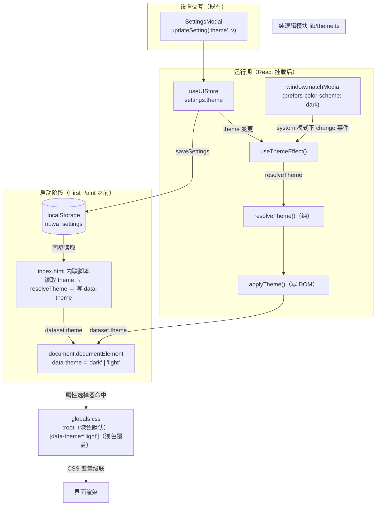
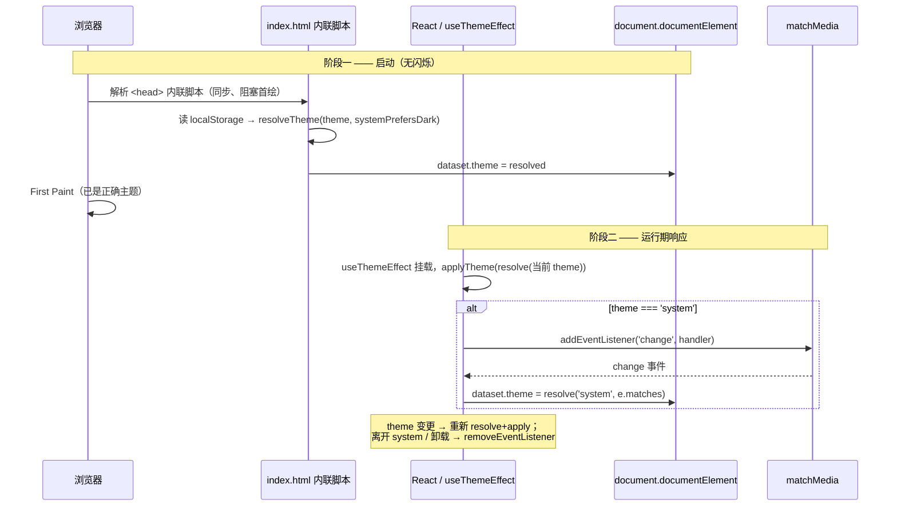

# 设计文档（Design Document）

## Overview

本特性「外观主题应用引擎（appearance-theme-mode）」补齐设置面板中"外观"选项（深色 / 浅色 / 跟随系统）的实际生效能力。当前 `settings.theme` 仅被持久化到 localStorage（键 `nuwa_settings`），却从未应用到界面，因此选择"浅色"或"跟随系统"时界面始终是深色。

设计目标（纯前端增量，不动后端、不新增存储）：

1. 抽出一个**无副作用的纯函数** `resolveTheme(themeSetting, systemPrefersDark)`，把主题设置解析为具体的 `'dark' | 'light'`，并对非法值回退到 `'dark'`，使核心逻辑可被独立、确定性地测试。
2. 把解析结果写入 `document.documentElement` 上的 `data-theme` 属性，由 CSS 变量根据该属性在深 / 浅之间切换。
3. **启动即应用、无错误主题闪烁（no-flash）**：在 `index.html` 中放置一段首屏前内联脚本，在 React 挂载、首帧绘制之前就读取持久化设置并写好 `data-theme`。
4. 一个 React 副作用（`useThemeEffect` hook）在运行期响应 `settings.theme` 变更，并在 `'system'` 模式下订阅 `prefers-color-scheme` 媒体查询的变化，离开 `'system'` 或卸载时清理监听。
5. 在 `globals.css` 中补全一套完整的浅色变量覆盖（`[data-theme="light"]`），深色保持为 `:root` 默认值（行为与引入前完全一致）。

设计的核心约束是**关注点分离**：把"解析"（纯函数、可属性测试）与"写 DOM"（薄的副作用函数）严格分开，从而让绝大部分正确性逻辑落在可被 property-based testing 覆盖的纯函数上。

### 关键设计决策

| 决策 | 选择 | 理由 |
|------|------|------|
| 主题标识载体 | `document.documentElement` 上的 `data-theme` 属性 | `<html>` 是 CSS 变量级联的根，属性选择器 `[data-theme="light"]` 可直接覆盖 `:root` 中的变量；`dataset.theme` 读写简单且可测。 |
| no-flash 主策略 | `index.html` 内联脚本（首屏前同步执行） | 唯一能在 **First Paint 之前**确定写入 `data-theme` 的方式。React 副作用（`useEffect`）在挂载后才运行，无法避免首帧闪烁。 |
| 运行期响应 | React `useThemeEffect` hook | 内联脚本只跑一次；设置变更与系统偏好实时跟随需要 React 侧的订阅与清理。 |
| 解析逻辑位置 | 独立纯函数模块 `lib/theme.ts` | 纯函数无副作用、确定性，便于 property-based testing；DOM 写入隔离在 `applyTheme` 薄函数中。 |
| 深色变量 | 保持 `:root` 默认 + 镜像到 `[data-theme="dark"]` | 保证默认（无属性）与显式 `dark` 取值完全一致，满足"不回归既有深色视觉"。 |

## Architecture

### 组件与数据流



### 两阶段主题应用时序



### 分层与职责

- **纯逻辑层（`lib/theme.ts`）**：`resolveTheme`（解析，纯）与 `applyTheme`（写 `data-theme`，薄副作用）。`resolveTheme` 不读全局状态、不写 DOM。
- **启动层（`index.html` 内联脚本）**：在首帧前同步读取持久化设置并写好 `data-theme`，内含与 `resolveTheme` 等价的最小回退逻辑（内联脚本不能 import 模块，需自带这段精简逻辑）。
- **运行期响应层（`hooks/useThemeEffect.ts`）**：订阅 store 的 `settings.theme`，调用 `applyTheme`;在 `'system'` 模式下订阅 `matchMedia` 变化并负责清理。
- **样式层（`globals.css`）**：`:root` 维持深色默认，`[data-theme="light"]` 提供完整浅色覆盖，`[data-theme="dark"]` 镜像深色以保证显式值一致。

## Components and Interfaces

### 1. `lib/theme.ts`（新增，纯逻辑 + 薄 DOM 写入）

```typescript
/** 主题设置取值（来自 Settings_Store）。 */
export type ThemeSetting = 'dark' | 'light' | 'system';

/** 已解析主题：实际应用到界面的具体主题。 */
export type ResolvedTheme = 'dark' | 'light';

/**
 * 将主题设置解析为具体主题。无副作用纯函数。
 *
 * - 'dark'  → 'dark'（与 systemPrefersDark 无关）
 * - 'light' → 'light'（与 systemPrefersDark 无关）
 * - 'system' → systemPrefersDark ? 'dark' : 'light'
 * - 其他任何非法值 → 'dark'（回退）
 *
 * 不读取全局状态，不修改 DOM 或 Settings_Store。
 */
export function resolveTheme(
  themeSetting: ThemeSetting | string | null | undefined,
  systemPrefersDark: boolean,
): ResolvedTheme;

/**
 * 把已解析主题写入 Document_Root 的 data-theme 属性。
 * 这是唯一接触 DOM 的函数（薄副作用），便于隔离与测试。
 * 幂等：以相同 resolved 重复调用结果不变。
 */
export function applyTheme(resolved: ResolvedTheme): void;

/**
 * 读取当前系统是否偏好深色。matchMedia 不可用时回退 false。
 * 供运行期 hook 与（逻辑等价地）内联脚本使用。
 */
export function getSystemPrefersDark(): boolean;
```

`resolveTheme` 参考实现要点：用一个白名单 `switch` 处理 `'dark' | 'light' | 'system'`，`default` 分支返回 `'dark'`，从而天然覆盖 `null`/`undefined`/任意字符串等非法输入（Req 1.5）。

`applyTheme` 实现：`document.documentElement.dataset.theme = resolved;`（等价于 `setAttribute('data-theme', resolved)`）。

### 2. `index.html` 内联引导脚本（新增，no-flash 核心）

放在 `<head>` 内、`<body>` 之前的同步 `<script>`（非 `type="module"`，确保阻塞首绘前执行）：

```html
<script>
  (function () {
    try {
      var DEFAULT = 'dark';
      var raw = localStorage.getItem('nuwa_settings');
      var theme = DEFAULT;
      if (raw) {
        var parsed = JSON.parse(raw);
        if (parsed && typeof parsed.theme === 'string') theme = parsed.theme;
      }
      var prefersDark = true;
      try {
        prefersDark = window.matchMedia('(prefers-color-scheme: dark)').matches;
      } catch (e) { prefersDark = true; }
      var resolved;
      if (theme === 'light') resolved = 'light';
      else if (theme === 'system') resolved = prefersDark ? 'dark' : 'light';
      else resolved = 'dark'; // 'dark' 与任何非法值都回退到 dark
      document.documentElement.dataset.theme = resolved;
    } catch (e) {
      document.documentElement.dataset.theme = 'dark'; // 读取/解析异常 → 默认深色（Req 2.5）
    }
  })();
</script>
```

该脚本的解析分支与 `resolveTheme` 语义严格等价（含非法值回退、`system` 取 `prefersDark`）。它无法 import 模块，因此内联自带这段最小逻辑;`resolveTheme` 仍是被属性测试覆盖的"真理来源"，内联脚本作为其等价镜像（在测试策略中以共享用例校验等价性）。

### 3. `hooks/useThemeEffect.ts`（新增，运行期响应）

```typescript
/**
 * 运行期主题副作用：
 * 1. 订阅 useUIStore 的 settings.theme；任一变更时 applyTheme(resolveTheme(theme, prefersDark))。
 * 2. 当 theme === 'system' 时，订阅 matchMedia('(prefers-color-scheme: dark)') 的 'change'，
 *    系统偏好变化时重新解析并应用。
 * 3. 当 theme 变为非 'system'（'dark'/'light'）或组件卸载时，移除上述监听（清理）。
 *
 * 在 App 顶层调用一次即可。
 */
export function useThemeEffect(): void;
```

实现要点：

- 用 `const theme = useUIStore((s) => s.settings.theme)` 订阅，`useEffect` 依赖 `[theme]`。
- effect 体内：先 `applyTheme(resolveTheme(theme, getSystemPrefersDark()))`。
- 若 `theme === 'system'`：`const mql = window.matchMedia('(prefers-color-scheme: dark)')`，注册 `change` handler `(e) => applyTheme(resolveTheme('system', e.matches))`，并在 cleanup 中 `removeEventListener`。`theme !== 'system'` 时不注册监听（满足 Req 4.4/4.5：锁定主题忽略系统变化）。
- `matchMedia` 不可用（如 jsdom 未注入）时，`getSystemPrefersDark()` 返回 `false`，且跳过监听注册（防御性 `if (typeof window.matchMedia === 'function')`）。
- 兼容旧浏览器：优先 `addEventListener('change', …)`，回退 `addListener`（设计上以 `addEventListener` 为主，现代目标环境已足够）。

### 4. `App.tsx`（修改）

在 `App` 函数体顶部调用 `useThemeEffect()`。这样运行期响应随应用生命周期挂载/卸载。不改变现有任何其他逻辑。

### 5. `SettingsModal.tsx`（不改）

已有 `updateSetting('theme', value)`，触发 store 更新 → `useThemeEffect` 的依赖变化 → 重新应用。无需修改。

### 6. `globals.css`（修改）

新增浅色覆盖块，保持深色为默认（详见 Data Models 的变量表）。

## Data Models

### 主题状态模型

```typescript
type ThemeSetting = 'dark' | 'light' | 'system';   // 持久化值，默认 'dark'
type ResolvedTheme = 'dark' | 'light';             // 应用值
// data-theme 属性值 ∈ ResolvedTheme
```

持久化复用既有结构，**不新增任何存储**：

```typescript
interface AppSettings {
  backendUrl: string;
  modelsDir: string;
  theme: 'dark' | 'light' | 'system'; // 本特性消费此字段
  autoPlay: boolean;
  language: string;
}
// localStorage 键：'nuwa_settings'
// 读写：loadSettings() / saveSettings()（既有，已含 try/catch 容错）
```

### CSS 变量映射表（深色现状 → 浅色新增）

`[data-theme="light"]` 必须为每个面向颜色的变量提供浅色取值（Req 5.1/5.2）。`--text-primary` 在 `--bg` 上对比度需 ≥ 4.5:1（Req 5.3）。

| 变量 | 深色（`:root` 现状，保持不变） | 浅色（`[data-theme="light"]` 新增） |
|------|------|------|
| `--bg` | `#080C14` | `#F7FAFB` |
| `--bg-elevated` | `#0c1220` | `#FFFFFF` |
| `--surface` | `rgba(255,255,255,0.015)` | `rgba(8,18,28,0.025)` |
| `--surface-hover` | `rgba(255,255,255,0.035)` | `rgba(8,18,28,0.05)` |
| `--surface-active` | `rgba(255,255,255,0.05)` | `rgba(8,18,28,0.07)` |
| `--border` | `rgba(255,255,255,0.04)` | `rgba(8,18,28,0.10)` |
| `--border-active` | `rgba(255,255,255,0.10)` | `rgba(8,18,28,0.18)` |
| `--primary` | `#48CAE4` | `#0096C7` |
| `--primary-dim` | `#0096C7` | `#0077A3` |
| `--primary-glow` | `rgba(72,202,228,0.35)` | `rgba(0,150,199,0.22)` |
| `--primary-glow-strong` | `rgba(72,202,228,0.55)` | `rgba(0,150,199,0.35)` |
| `--warm` | `#90E0EF` | `#3DA9C7` |
| `--text-primary` | `#E0F7FA` | `#0B2A33`（在 `#F7FAFB` 上对比度 ≈ 14:1，远超 4.5:1） |
| `--text-secondary` | `#6A9EAD` | `#3C5A66` |
| `--text-muted` | `#3A5A6A` | `#6A828C` |
| `--ambient` | `rgba(72,202,228,0.04)` | `rgba(0,150,199,0.05)` |
| `--danger` | `#FF6B6B` | `#D64545` |

字体类变量（`--font-*`）非颜色，深浅共用，无需覆盖。

环境光与噪点（`body::before` / `body::after`）使用 `--ambient` 与低透明度叠加；浅色下 `--ambient` 给出柔和的浅青光晕，噪点透明度（0.02 内嵌 + 0.35 整体）在浅底上仍显克制、可接受。必要时可在 `[data-theme="light"] body::after { opacity: 0.25; }` 进一步降低，但不属于硬性需求。

`globals.css` 结构调整：

```css
:root { /* 深色默认，保持现有取值不变 */ }
:root[data-theme="dark"] { /* 镜像深色，确保显式 dark 与默认一致（Req 4.4/7.3） */ }
:root[data-theme="light"] { /* 完整浅色覆盖 */ }
```

> 说明：浅色块仅覆盖颜色变量;深色保留为 `:root` 默认值意味着在内联脚本尚未运行的极端兜底情况下，界面默认仍为深色（与引入前一致）。

## Correctness Properties

*属性（property）是一个应在系统所有合法执行下都成立的特征或行为——本质上是关于系统应当做什么的形式化陈述。属性在人类可读的规格说明与机器可验证的正确性保证之间架起桥梁。*

本特性的核心逻辑 `resolveTheme` 是一个纯函数，输入空间（主题设置 × 系统偏好，含非法值）较大且行为随输入有意义地变化，非常适合 property-based testing;持久化往返也适合用属性覆盖。以下属性均映射到具体验收标准。

### Property 1: resolveTheme 的确定性与全覆盖（含非法值回退）

*For any* 任意 `themeSetting`（包括 `'dark'`/`'light'`/`'system'` 以及任意非法字符串、`null`、`undefined`）与任意布尔 `systemPrefersDark`，`resolveTheme` 都返回 `'dark'` 或 `'light'` 之一（全函数、无异常），且对相同输入恒返回相同输出（确定性）;其中非 `'light'`、非 `'system'` 的输入一律解析为 `'dark'`。

**Validates: Requirements 1.1, 1.2, 1.5, 1.6**

### Property 2: system 模式等价于系统偏好

*For any* 布尔 `systemPrefersDark`，`resolveTheme('system', systemPrefersDark)` 等于 `systemPrefersDark ? 'dark' : 'light'`。

**Validates: Requirements 1.3, 1.4, 3.3, 4.2, 4.3**

### Property 3: 非 system 锁定忽略系统偏好

*For any* `themeSetting ∈ {'dark', 'light'}` 与任意布尔 `systemPrefersDark`，`resolveTheme(themeSetting, systemPrefersDark)` 的结果与 `systemPrefersDark` 无关，恒等于该锁定主题本身（`'dark'→'dark'`，`'light'→'light'`）。

**Validates: Requirements 1.1, 1.2, 4.4**

### Property 4: 主题应用幂等性

*For any* `themeSetting` 与系统偏好，先 `applyTheme(resolveTheme(...))` 一次，再以相同已解析主题 `applyTheme` 一次，`document.documentElement` 的 `data-theme` 最终值与只应用一次相同;且该属性值恒等于 `resolveTheme` 的返回值（应用即解析结果）。

**Validates: Requirements 2.2, 3.1, 3.2, 5.1, 5.4**

### Property 5: 主题设置持久化往返一致

*For any* `themeSetting ∈ {'dark', 'light', 'system'}`，经 `updateSetting('theme', v)`（`saveSettings`）保存后，再 `loadSettings()` 读取得到的 `theme` 与保存值相等;且该往返不改变 `backendUrl`、`modelsDir`、`autoPlay`、`language` 任一既有字段的值。

**Validates: Requirements 6.1, 6.2, 6.3, 7.1, 7.2**

### Property 6: 启动解析等价于运行期解析（内联脚本与 resolveTheme 一致）

*For any* 持久化的 `theme` 取值（含缺失 / 非法）与任意系统偏好，`index.html` 内联脚本的解析分支产出的主题，与 `resolveTheme(theme, systemPrefersDark)`（缺失时以默认 `'dark'`）的结果一致。

**Validates: Requirements 2.1, 2.4, 2.5**

## Error Handling

| 场景 | 处理策略 | 关联需求 |
|------|----------|----------|
| `localStorage` 中无 `nuwa_settings` | 内联脚本与 `loadSettings` 均回退默认 `theme='dark'` 并据此应用 | Req 2.4 |
| `nuwa_settings` 内容损坏 / `JSON.parse` 抛错 | 内联脚本 `try/catch` 兜底写 `data-theme='dark'`;`loadSettings` 已有 `try/catch` 返回 `defaultSettings` | Req 2.5 |
| `theme` 字段为非法值（非三枚举） | `resolveTheme` `default` 分支回退 `'dark'`;内联脚本同语义回退 | Req 1.5 |
| `window.matchMedia` 不可用（旧环境 / jsdom 未注入） | `getSystemPrefersDark()` 返回 `false`（解析为浅色 only 当 theme==='system'）;内联脚本 `try/catch` 回退 `prefersDark=true`;hook 跳过监听注册，不抛错 | 防御性，支撑 Req 4.x |
| `matchMedia` 存在但无 `addEventListener` | 优先 `addEventListener`，回退 `addListener`/`removeListener` | 兼容性 |
| `applyTheme` 在无 `document` 环境被调用 | 仅在浏览器 / jsdom 运行;非浏览器环境不调用（内联脚本与 hook 都只在浏览器上下文执行） | 防御性 |

错误处理原则：任何读取 / 监听异常都**降级为默认深色或安全无操作**，绝不阻断应用启动或渲染。

## Testing Strategy

采用单元测试 + 属性测试的双重策略，工具为 **Vitest + fast-check**（均已在 `devDependencies` 中：`fast-check@^3.23.2`、`vitest@^3.2.6`，环境 jsdom）。

### 属性测试（Property-Based，fast-check）

- 每个属性测试运行 **≥ 100 次迭代**（fast-check 默认 100，必要时 `{ numRuns: 100 }` 显式指定）。
- 每个测试以注释标注其对应设计属性，格式：
  `// Feature: appearance-theme-mode, Property {N}: {属性标题}`
- 目标文件 `src/lib/theme.test.ts`：
  - **Property 1**：`fc.oneof` 生成合法枚举 + `fc.string()` + 常量 `null`/`undefined` 作为 `themeSetting`，`fc.boolean()` 作为 `systemPrefersDark`，断言返回值 ∈ `{'dark','light'}` 且同输入多次调用结果一致;非 `light`/`system` 输入断言为 `'dark'`。
  - **Property 2 / 3**：分别针对 `'system'` 与 `{'dark','light'}`，断言与系统偏好的等价 / 无关关系。
  - **Property 4**：用 jsdom 的 `document.documentElement`，对任意输入解析后连续 `applyTheme` 两次，断言 `dataset.theme` 等于解析结果且二次应用不改变值。
  - **Property 6**：把内联脚本的解析分支抽为一个测试内的等价函数（或从共享 helper 引入），对任意 `theme`/偏好断言其与 `resolveTheme` 输出一致。
- 目标文件 `src/store/uiStore.test.ts`（或 `theme.persistence.test.ts`）：
  - **Property 5**：`fc.constantFrom('dark','light','system')` 生成 `theme`，调用 `updateSetting('theme', v)` 后 `loadSettings()` 断言往返相等，且其余四个既有字段不变。

### 单元测试（Vitest，示例 / 边界）

- `resolveTheme` 的四个确定性示例（`'dark'`、`'light'`、`'system'`+true、`'system'`+false）与非法值（`''`、`'DARK'`、`'auto'`、`undefined`）回退 `'dark'`。
- `useThemeEffect`（`@testing-library/react` 的 `renderHook`）：
  - 初次挂载即写入正确 `data-theme`。
  - `theme` 从 `'dark'` → `'light'` 变更后 `data-theme` 同步更新（Req 3.x，不刷新页面）。
  - `theme==='system'` 时触发 `matchMedia` 的 `change`，`data-theme` 跟随更新（Req 4.2/4.3）。
  - `theme` 从 `'system'` 切到 `'dark'` 后，再触发 `change` 不再改变 `data-theme`，并验证 `removeEventListener` 被调用（Req 4.4/4.5）。
- 边界 / 错误：损坏 JSON、缺失键、`matchMedia` 缺失时不抛错且回退默认深色。

### 测试环境注意事项（matchMedia mock）

`src/test/setup.ts` 目前 mock 了 `MediaRecorder`、`getUserMedia`、`HTMLMediaElement`、`clipboard`，但**未** mock `window.matchMedia`（jsdom 不实现）。需新增一个可控的 `installMockMatchMedia({ prefersDark })` helper，返回一个可手动触发 `change` 的 mql stub（带 `matches`、`addEventListener`/`removeEventListener`、`dispatch` 辅助），供 `useThemeEffect` 与内联脚本等价性测试驱动系统偏好变化。`resolveTheme` 自身的纯函数测试不依赖 matchMedia（系统偏好作为布尔参数直接传入）。

### CSS / 视觉验证（非 PBT）

浅色变量覆盖属于样式声明，不适合属性测试。验证方式：

- 断言 `[data-theme="light"]` 下关键变量（如 `--bg`、`--text-primary`）已被覆盖（可通过设置 `data-theme` 后读取 `getComputedStyle(document.documentElement).getPropertyValue('--bg')` 做轻量检查，受 jsdom 对 CSS 变量计算支持程度限制，必要时降级为对 CSS 源文本的存在性断言）。
- `--text-primary` 在 `--bg` 上的 4.5:1 对比度通过设计期计算确认（`#0B2A33` on `#F7FAFB` ≈ 14:1），并在实现完成后人工目视确认浅色下文本与环境光、噪点观感可接受（Req 5.3）。

### 不在范围

- 不涉及后端、不修改后端契约（Req 7.4）。
- 既有设置项（`backendUrl`/`modelsDir`/`autoPlay`/`language`）的既有行为由 Property 5 的"其余字段不变"断言守护（Req 7.1/7.2）。
