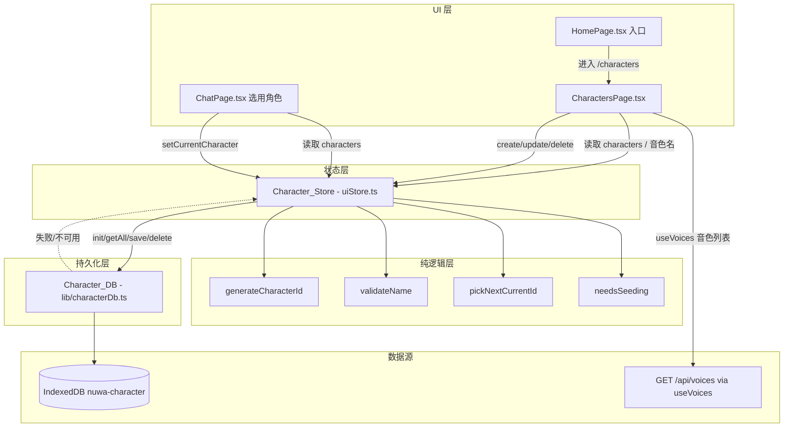
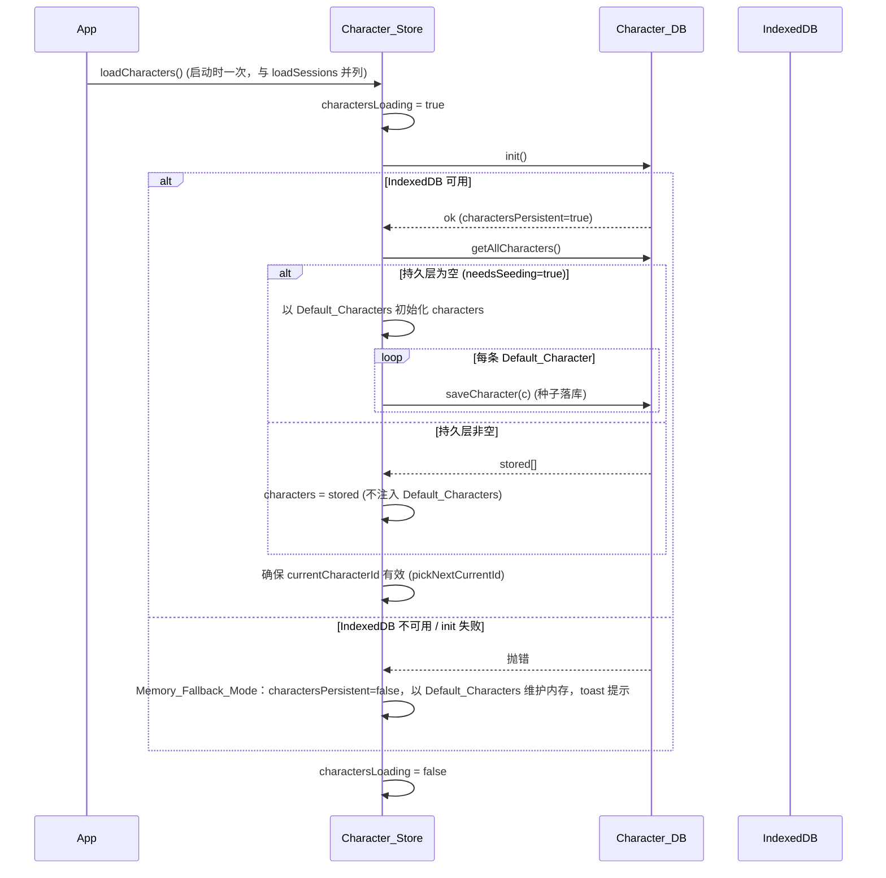
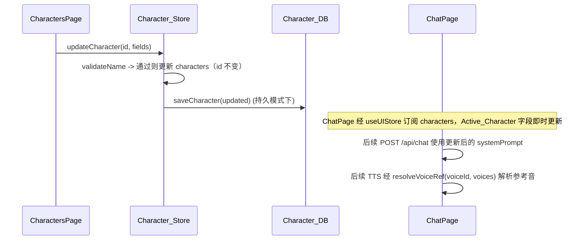

# Design Document

## Overview

「角色/人设管理」(character-persona-management) 在已交付的「会话历史持久化」「流式对话输出」「语音交互闭环」「音色库管理」之上，为女娲 Nuwa 前端补齐角色（Character）的端到端管理能力。当前 `app/web/src/store/uiStore.ts` 把角色写死为 3 条 `defaultCharacters`（`assistant` / `socrates` / `counselor`），既无管理界面，也不持久化，其绑定的 `voiceId` 与真实音色库（`GET /api/voices`）可能对不上号。

本特性是**纯前端增量增强**，完全复用 chat-session-persistence 已建立的模式：

1. **持久层**：新建 `app/web/src/lib/characterDb.ts`，完全参照 `lib/chatDb.ts` 的 `createCharacterDb(factory?)` 工厂 + IndexedDB + 失败 reject 降级模式。
2. **状态层**：改造 `store/uiStore.ts`，把写死的 `defaultCharacters` 改为从 Character_DB 加载，新增 `loadCharacters` / `createCharacter` / `updateCharacter` / `deleteCharacter` actions 与 `charactersLoading` / `charactersPersistent` 状态，并以纯函数保证「至少保留一个角色」与「`currentCharacterId` 始终有效」两个不变量。
3. **纯逻辑层**：新建 `app/web/src/lib/character.ts`，抽取可测试纯函数（生成唯一 id、name trim 校验、删除后重选 `currentCharacterId`、种子初始化判定），以便写属性测试。
4. **UI 层**：新建 `app/web/src/components/CharactersPage.tsx`（路由 `/characters`），从 `useVoices` 读取真实音色绑定、提供 Gradient_Presets 渐变选择、删除二次确认；首页加入入口。
5. **集成**：ChatPage 角色选择从持久化 `characters` 读取；`App.tsx` 启动时调用 `loadCharacters()`（与 `loadSessions()` 并列）。

交付后角色列表写入 IndexedDB，刷新或重启可恢复；首次使用以 Default_Characters 种子落库且不重复注入；Character_DB 不可用或读写失败时降级为 Memory_Fallback_Mode 并提示用户。本特性不改后端，不修改任何既有 API 契约，且保证会话持久化、流式输出、语音闭环、音色库管理不回归。

### 设计目标与非目标

- **目标**：角色本地持久化与启动恢复、种子初始化幂等、角色管理 CRUD 界面、不变量保护（至少一个角色 / `currentCharacterId` 有效）、真实音色绑定、首页入口与对话页选用、错误降级、无回归。
- **非目标**：角色跨设备 / 云端同步、角色导入导出、角色头像图片上传（仅渐变预设）、后端角色持久化、修改音色库管理本身的能力。

### 关键设计决策

| 决策 | 选择 | 理由 |
| --- | --- | --- |
| 持久化介质 | IndexedDB（独立数据库 `nuwa-character`） | 与 Chat_DB 同构、容量大、异步；与会话库隔离避免相互影响 |
| 数据层封装 | 独立模块 `lib/characterDb.ts`，工厂注入 `IDBFactory` | 完全对齐 `chatDb.ts`，便于用 `fake-indexeddb` 或注入做单元/属性测试 |
| 种子初始化判定 | 抽出纯函数 `needsSeeding(stored)`：仅当持久层为空才以 Default_Characters 落库 | Req 2 要求幂等：非空时不重复注入，可独立属性测试 |
| 唯一 id 生成 | 抽出纯函数 `generateCharacterId(existing)`，与既有集合去重 | Req 4.2 要求集内唯一；纯函数可属性测试唯一性 |
| name 校验 | 抽出纯函数 `validateName(raw)`：trim 后非空且 ≤ Name_Max_Length | Req 4.6 / 5.3 trim 语义可独立属性测试，UI 与 store 共用 |
| 删除后重选当前角色 | 抽出纯函数 `pickNextCurrentId(chars, removedId, currentId)` | Req 6.5 / 6.7 当前角色有效性，删除分支多，纯函数集中处理且可属性测试 |
| 「至少一个角色」 | 在 `deleteCharacter` action 内：仅剩一条时拒绝删除（UI 提示），不调 DB | Req 6.4 / 6.6 不变量在状态层强制 |
| 音色来源 | 复用 `useVoices()`（`GET /api/voices`），不新增 API | Req 7.1 与音色库管理共享数据源，无后端改动 |
| 降级策略 | Character_DB 提供 `charactersPersistent` 标志；失败时内存模式仍可用 | Req 9 要求存储不可用时不阻断角色功能 |

## Architecture

### 分层结构



### 启动初始化时序



### 角色编辑即时生效数据流



## Components and Interfaces

### 1. Character_DB（`app/web/src/lib/characterDb.ts`，新增）

封装 IndexedDB 的角色异步数据层，结构与 `lib/chatDb.ts` 一致：工厂函数允许注入 `IDBFactory`（测试时传 `fake-indexeddb`），构造时不抛错，失败延迟到 `init()` reject。

```typescript
import type { Character } from '@/store/uiStore';

/** Character_DB public interface. All methods are async and reject on failure. */
export interface CharacterDb {
  /** Open/upgrade the database and create the object store. */
  init(): Promise<void>;
  /** Read all characters (unordered; caller preserves/derives ordering). */
  getAllCharacters(): Promise<Character[]>;
  /** Insert or update a character (put, idempotent by id). */
  saveCharacter(character: Character): Promise<void>;
  /** Delete a single character by id. */
  deleteCharacter(characterId: string): Promise<void>;
}

/**
 * Create a Character_DB instance.
 * @param factory optional injected IDBFactory (e.g. fake-indexeddb in tests);
 *                defaults to globalThis.indexedDB. Does not throw at construction.
 */
export function createCharacterDb(factory?: IDBFactory): CharacterDb;
```

**IndexedDB 结构**：

- 数据库名 `nuwa-character`，版本 `1`。
- object store `characters`，`keyPath: 'id'`（无额外索引；角色量级小，全量读取后由状态层处理）。

**实现要点**：与 `chatDb.ts` 共用 `requestToPromise` / `txDone` 辅助；`getFactory()` 返回 `factory ?? globalThis.indexedDB`，缺失则 `init()` reject；`saveCharacter` / `deleteCharacter` 使用 `readwrite` 事务并以 `txDone(tx)` 等待完成。

### 2. 纯函数（`app/web/src/lib/character.ts`，新增）

集中可独立测试的角色纯逻辑，不依赖 DOM / store / IndexedDB。

```typescript
import type { Character } from '@/store/uiStore';

/** Character `name` 允许的最大字符数。 */
export const NAME_MAX_LENGTH = 20;

/** name 校验结果。 */
export interface NameValidation {
  ok: boolean;       // trim 后非空为 true
  value: string;     // trim 后的值（ok 时用作落库值）
}

/**
 * 校验并规范化角色 name：
 * - 去除首尾空白；
 * - trim 后为空 -> { ok: false, value: '' }；
 * - 否则 -> { ok: true, value: trimmed }。
 * 注：长度上限由输入控件 maxLength 在 UI 层强制（Req 4.7），此处只判空。
 */
export function validateName(raw: string): NameValidation;

/**
 * 生成在 existing 角色集合内唯一的新 id。
 * 基于时间戳 + 随机后缀，若意外与现有 id 冲突则重试，保证返回值不在 existing 中。
 */
export function generateCharacterId(existing: Character[]): string;

/**
 * 判断是否需要种子初始化：当且仅当持久层读取到的角色集合为空时返回 true。
 */
export function needsSeeding(stored: Character[]): boolean;

/**
 * 删除某角色后计算应当指向的 currentCharacterId。
 * @param chars     删除前的完整角色集合
 * @param removedId 被删除角色 id
 * @param currentId 删除前的 currentCharacterId
 * @returns 删除后仍存在的某个角色 id：
 *   - 若 currentId 不是被删者且仍存在 -> 保持 currentId；
 *   - 若被删者正是 currentId -> 返回剩余集合中的第一个角色 id；
 *   - 剩余集合为空 -> 返回 null（由调用方结合「至少保留一个」不变量阻止该情形）。
 */
export function pickNextCurrentId(
  chars: Character[],
  removedId: string,
  currentId: string
): string | null;
```

### 3. Character_Store 改造（`app/web/src/store/uiStore.ts`）

**移除**：把 `characters: defaultCharacters` 的写死初值改为 `characters: []`、`currentCharacterId` 初值保留 `'assistant'`（加载完成后由 `pickNextCurrentId` 校正为有效值）。保留导出的 `defaultCharacters` 作为 Default_Characters 种子常量。

**新增状态**：

```typescript
interface UIState {
  // ... 既有字段
  characters: Character[];           // 初始 []
  currentCharacterId: string;        // 加载后保证指向存在的角色
  charactersLoading: boolean;        // 启动加载态，初始 true
  charactersPersistent: boolean;     // false 表示处于 Memory_Fallback_Mode（角色侧）
}
```

**新增 / 改造 action**（均与 Character_DB 协作；写失败保留内存状态并提示）：

```typescript
// 启动时调用：init -> 空则种子落库 / 非空则恢复 -> 校正 currentCharacterId；失败进入降级模式
loadCharacters: () => Promise<void>;
// 新建角色：validateName 通过才创建，分配唯一 id，记录全部字段并持久化
createCharacter: (input: CharacterInput) => Promise<void>;
// 编辑角色：validateName 通过才更新（id 不变）并持久化
updateCharacter: (id: string, input: CharacterInput) => Promise<void>;
// 删除角色：仅剩一条则拒绝（不调 DB）；否则移除、必要时重选 currentCharacterId、删除持久记录
deleteCharacter: (id: string) => Promise<void>;
// 既有：设置当前角色
setCurrentCharacter: (id: string) => void;
```

其中 `CharacterInput` 为可编辑字段集合：

```typescript
interface CharacterInput {
  name: string;
  systemPrompt: string;
  description: string;
  avatar: string;   // 选中的 Gradient_Preset
  voiceId: string;  // 允许为空字符串（Req 7.4）
}
```

**不变量强制**：

- 「至少保留一个角色」：`deleteCharacter` 在 `characters.length <= 1` 时直接返回并由 UI 提示「至少需保留一个角色」（Req 6.4 / 6.6），不调用 DB 删除。
- 「`currentCharacterId` 始终有效」：`loadCharacters` 末尾与 `deleteCharacter` 删除当前角色时，调用 `pickNextCurrentId` 将其校正为剩余集合中存在的 id（Req 6.5 / 6.7）。

**降级行为**：`init()` reject 时 `charactersPersistent=false`，以 Default_Characters 在内存中维护并 toast 「角色无法保存」（Req 9.1 / 9.2）；`getAllCharacters` reject 按以 Default_Characters 在内存继续（Req 9.3）；`saveCharacter` / `deleteCharacter` reject 时保留内存状态并 toast 「保存失败」（Req 9.4）。所有写操作遵循「先更新内存、后持久化」。

### 4. CharactersPage（`app/web/src/components/CharactersPage.tsx`，新增）

角色管理界面，路由 `/characters`。复用 VoiceStudioPage 的删除二次确认与 useVoices 加载/错误处理模式。

- **列表**：渲染 `characters` 每条的 `name`、`description`、`avatar`（渐变小圆）（Req 3.1）；对每条 `voiceId` 经 `voices` 查名展示绑定音色名（命中显示 `name`，未命中显示「默认音色」占位）（Req 3.2 / 7.3）。
- **音色加载态/错误**：`useVoices()` 的 `isLoading` 显示「音色加载中…」（Req 3.3）；`isError` 显示「音色加载失败」提示但仍渲染角色其余信息（Req 3.4）。
- **新建 / 编辑表单**：输入 `name`（`<input maxLength={NAME_MAX_LENGTH}>` 强制上限，Req 4.7）、`systemPrompt`（textarea）、`description`；从 Gradient_Presets 网格选 `avatar`；从 `voices` 下拉选 `voiceId`（含「不绑定」空值项，Req 7.4）（Req 4.1）。
- **提交校验**：提交前用 `validateName`，不通过时显示「请填写名称」且不创建/更新（Req 4.6 / 5.3）；通过则调用 `createCharacter` / `updateCharacter`，列表即时反映（Req 4.5 / 5.4）。
- **删除二次确认**：删除按钮触发内联确认（确认/取消）；确认且非唯一角色时调 `deleteCharacter`（Req 6.1 / 6.2）；取消则不删除（Req 6.3）；唯一角色时按钮禁用或提示「至少需保留一个角色」（Req 6.4）。
- **Gradient_Presets**：组件内置一组预设渐变常量（复用现有 `defaultCharacters` 的 avatar 风格，如青蓝 / 粉 / 绿 / 紫 / 金等 6–8 个）。

### 5. App / HomePage / ChatPage 集成

- **`App.tsx`**：新增 `AppPage` 联合类型成员 `'characters'`；`pathToPage` 增加 `'/characters': 'characters'`；URL 同步 `targetPath` 增加 `currentPage === 'characters' ? '/characters'`；`renderPage` switch 增加 `case 'characters': return <CharactersPage />`；启动 `useEffect` 增加 `void loadCharacters()`（与既有 `loadSessions()` 并列）。
- **`HomePage.tsx`**：`features` 数组新增一项 `{ id: 'characters', title: '角色管理', desc: '创建与管理 AI 人设', icon: Users, ... }`，点击 `setPage('characters')`（Req 8.1 / 8.2）。
- **`ChatPage.tsx`**：角色选择已从 `useUIStore(s => s.characters)` 读取（现状即如此），本特性使其数据来自持久化列表而非写死常量（Req 8.3 / 8.4）；现有侧栏写死的 `currentVoice` 名称映射改为经 `voices` 查 `currentCharacter.voiceId` 得名，避免对不上号（呼应 Req 7）。

### 6. 依赖

无新增生产依赖；测试复用 chat-session-persistence 已引入的 `fake-indexeddb` 与 `fast-check`。

## Data Models

### Character（运行时与持久化结构，复用既有类型）

```typescript
interface Character {
  id: string;          // 集合内唯一，由 generateCharacterId 生成（种子角色沿用既有 id）
  name: string;        // trim 后非空，≤ NAME_MAX_LENGTH(20)
  avatar: string;      // 非空 CSS 线性渐变字符串（Gradient_Preset 之一）
  systemPrompt: string;// 人设提示词，注入 POST /api/chat 的 system
  voiceId: string;     // 绑定 Reference_Voice 的 id；允许空字符串（回退后端默认参考音）
  description: string; // 简短描述
}
```

> 字段与现有 `uiStore.ts` 的 `Character` 完全一致，本特性不改变其形状，仅改变其来源（持久层）与生命周期管理。

### Default_Characters（种子常量）

沿用现有 `defaultCharacters`（`assistant` / `socrates` / `counselor`），仅在持久层为空（`needsSeeding === true`）时落库一次。

### IndexedDB Schema

| Store | keyPath | 索引 | 说明 |
| --- | --- | --- | --- |
| `characters` | `id` | 无 | 全量读取；空集合触发种子初始化 |

数据库 `nuwa-character` 与会话库 `nuwa-chat` 相互独立，互不影响（Req 9.5 无回归）。

## Correctness Properties

*属性（property）是在系统所有有效执行中都应成立的特征或行为——是对"软件应当做什么"的形式化陈述。属性是人类可读规格与机器可验证正确性保证之间的桥梁。*

本特性的纯逻辑层（`validateName` / `generateCharacterId` / `needsSeeding` / `pickNextCurrentId`）、Character_DB 的持久化往返、Character_Store 的状态不变式适合属性测试；而 IndexedDB schema、UI 渲染与交互、音色加载态、无回归约束不适合 PBT，在「测试策略」中以 schema/示例/组件测试覆盖。下列属性均经 prework 反思去重。

### Property 1: 角色持久化往返

*For any* 角色集合：将每条角色依次 `saveCharacter` 后，`getAllCharacters` 返回的集合按 `id` 比较与输入等价（`id`、`name`、`avatar`、`systemPrompt`、`voiceId`、`description` 六个字段逐一相等、不丢不增）；对同一 `id` 再次 `saveCharacter`（编辑后）后读取得到的是最新值。

**Validates: Requirements 1.2, 1.3, 1.4, 4.4, 5.2**

### Property 2: 种子初始化幂等

*For any* 持久层初始内容：当持久层为空时，`loadCharacters` 后 `characters` 恰等于 Default_Characters 且这些默认角色已全部写入持久层；当持久层非空时，`loadCharacters` 后 `characters` 恰等于持久层内容且不混入任何 Default_Characters；连续两次 `loadCharacters` 的结果集合相等（不重复追加）。

**Validates: Requirements 2.1, 2.2, 2.3, 2.4**

### Property 3: 种子判定函数

*For any* 角色集合 `stored`：`needsSeeding(stored)` 当且仅当 `stored` 为空时返回 `true`。

**Validates: Requirements 2.1**

### Property 4: 名称 trim 校验语义

*For any* 字符串 `raw`：`validateName(raw)` 在 `raw.trim()` 非空时返回 `{ ok: true, value: raw.trim() }`，否则返回 `{ ok: false }`；据此，对任意纯空白名称，`createCharacter` 不增加角色、`updateCharacter` 不改变目标角色。

**Validates: Requirements 4.6, 5.3**

### Property 5: 新建角色分配集内唯一 id

*For any* 角色集合 `existing`：`generateCharacterId(existing)` 返回的 id 不等于 `existing` 中任何角色的 `id`；据此 `createCharacter` 后新角色的 `id` 在 `characters` 内唯一。

**Validates: Requirements 4.2**

### Property 6: 新建/编辑字段保真且隔离

*For any* 角色集合、任一目标角色 `id` 与任意合法 `CharacterInput`：`createCharacter` 后新角色的 `name`/`systemPrompt`/`description`/`avatar`/`voiceId` 等于输入（`name` 为 trim 后值）；`updateCharacter(id, input)` 后该角色上述字段等于输入且其 `id` 保持不变，而集合中其余角色保持不变。

**Validates: Requirements 4.3, 5.1**

### Property 7: 删除语义与至少保留一个

*For any* 角色集合与任一角色 `id`：当集合含 ≥ 2 条时，`deleteCharacter(id)` 后 `characters` 不再包含该角色、长度减一、其余角色保持不变，且其持久化记录被删除；当集合恰含 1 条时，`deleteCharacter` 不移除任何角色（`characters` 不变）且不调用 Character_DB 删除。

**Validates: Requirements 6.2, 6.4, 6.6**

### Property 8: 删除后当前角色重选

*For any* 角色集合（≥ 2 条）、当前角色 `currentId` 与被删角色 `removedId`：`pickNextCurrentId(chars, removedId, currentId)` 返回的 id 一定存在于删除后剩余集合中；当 `removedId !== currentId` 时返回值等于 `currentId`，当 `removedId === currentId` 时返回剩余集合中的某条角色 id。

**Validates: Requirements 6.5**

### Property 9: 角色状态不变式（基于模型）

*For any* 由 `createCharacter` / `updateCharacter` / `deleteCharacter` / `setCurrentCharacter` 组成的任意操作序列：执行完毕后 `characters` 至少包含一条角色，且 `currentCharacterId` 一定指向 `characters` 中确实存在的某个角色的 `id`。

**Validates: Requirements 6.6, 6.7**

## Error Handling

| 场景 | 触发条件 | 处理 | 关联需求 |
| --- | --- | --- | --- |
| IndexedDB 不可用 / `init` 失败 | `globalThis.indexedDB` 缺失或 `open` reject | 进入 Memory_Fallback_Mode：`charactersPersistent=false`，以 Default_Characters 在内存维护 `characters`，toast 提示「角色无法保存」 | 9.1, 9.2 |
| 读取失败 | `getAllCharacters` reject | 以 Default_Characters 在内存继续运行，记录告警 | 9.3 |
| 写入失败 | `saveCharacter` / `deleteCharacter` reject | 保留内存中的 `characters` 状态（UI 不回退），toast 提示「保存失败」 | 9.4 |
| 空名称创建/编辑 | `validateName` 返回 `ok:false` | UI 提示「请填写名称」，不创建 / 不更新（Property 4） | 4.6, 5.3 |
| 删除唯一角色 | `characters.length <= 1` | 拒绝删除并提示「至少需保留一个角色」，不调用 Character_DB（Property 7） | 6.4, 6.6 |
| 删除当前角色 | 被删者为 Active_Character | 由 `pickNextCurrentId` 将 `currentCharacterId` 重设为剩余存在角色（Property 8） | 6.5, 6.7 |
| 音色库加载失败 | `useVoices` 返回 error | 展示「音色加载失败」提示，仍渲染角色其余信息 | 3.4 |
| 绑定音色未命中 | `voiceId` 在 Voice_Library 无对应项 | `resolveVoiceRef` 回退空字符串，后端用默认参考音 | 7.3 |

所有 Character_DB 异步操作以 `try/catch` 包裹于 store action 内；写操作遵循「先更新内存、后持久化」，持久化失败不回滚内存，保证角色功能连续可用与 UI 不闪退。

## Testing Strategy

### 框架与工具

- 测试运行器：**Vitest 3**（已装，`npm test` 即 `vitest --run`），环境 jsdom。
- 属性测试库：**fast-check 3**（已装，**不自行实现** PBT），复用 chat-session-persistence 的属性测试风格（`fc.assert(fc.property(...), { numRuns: 100 })`）。
- 组件测试：**@testing-library/react** + 既有 `src/test/setup.ts`。
- IndexedDB 测试：复用 chat-session-persistence 已引入的 **`fake-indexeddb`**，通过 `createCharacterDb(fakeIndexedDB)` 注入，每个用例独立数据库名或在 `afterEach` 清理。
- 测试注入点：参照 `setChatDbForTesting`，新增 `setCharacterDbForTesting(db)` 以注入 fake / stub Character_DB。

### 双重测试策略

- **属性测试（PBT）**：覆盖纯逻辑与数据层不变式（Property 1–9）。
  - 每个属性用**单个** property-based 测试实现，**最少 100 次迭代**（`{ numRuns: 100 }`）。
  - 每个属性测试以注释标注其设计属性，格式：`// Feature: character-persona-management, Property {number}: {property_text}`。
  - 生成器要点：角色生成器产出随机 `name`（含纯空白 / 多字节 / 超长以覆盖边界）、随机 `avatar`（取自 Gradient_Presets）、随机 `voiceId`（含空字符串）、随机 `systemPrompt`/`description`；不变式属性（Property 9）用 `fc.commands` 或随机操作序列做基于模型的测试，并以纯内存参考模型对照。
- **单元 / 示例测试**：覆盖接口存在性（Req 1.5）、IndexedDB schema（Req 1.1，验证 init 后 `characters` store 存在）、各错误降级分支（Req 9.1–9.4）、`resolveVoiceRef` 未命中回退（Req 7.3，复用既有测试）。
- **组件测试（CharactersPage / HomePage / ChatPage）**：
  - 列表渲染 name/description/avatar 与绑定音色名（Req 3.1, 3.2）、音色加载态与错误态（Req 3.3, 3.4）。
  - 表单控件存在与 `name` maxLength（Req 4.1, 4.7）、创建后列表展示（Req 4.5）、编辑后展示更新（Req 5.4）、编辑当前角色即时生效（Req 5.5）。
  - 删除二次确认（确认 / 取消）与唯一角色禁删提示（Req 6.1, 6.3, 6.4）。
  - 音色下拉来源与空值允许（Req 7.1, 7.2, 7.4）。
  - 首页入口与导航（Req 8.1, 8.2）、ChatPage 渲染与选用角色（Req 8.3, 8.4）。
  - 降级提示（Req 9.2）。
- **无回归 / 构建验证**：保留并通过既有 `ChatPage.test.tsx`、`VoiceStudioPage.test.tsx`、会话与语音相关测试；以 `npm run build`（`tsc && vite build`）确保类型与构建通过；`/api/chat`、`/api/voices`、`/api/models`、`/api/downloads` 契约不变（Req 9.5–9.8）。

### 测试到属性映射（PBT 部分）

| 属性 | 被测对象 | 测试文件（建议） |
| --- | --- | --- |
| Property 1 | `saveCharacter` / `getAllCharacters` | `lib/characterDb.test.ts` |
| Property 2 | `loadCharacters` 种子幂等 | `store/uiStore.character.test.ts` |
| Property 3 | `needsSeeding` | `lib/character.test.ts` |
| Property 4 | `validateName` + create/update 空名 | `lib/character.test.ts` + `store/uiStore.character.test.ts` |
| Property 5 | `generateCharacterId` | `lib/character.test.ts` |
| Property 6 | `createCharacter` / `updateCharacter` | `store/uiStore.character.test.ts` |
| Property 7 | `deleteCharacter` | `store/uiStore.character.test.ts` + `lib/characterDb.test.ts` |
| Property 8 | `pickNextCurrentId` | `lib/character.test.ts` |
| Property 9 | 操作序列不变式 | `store/uiStore.characterInvariant.test.ts` |

### 受影响文件清单

**新增**
- `app/web/src/lib/characterDb.ts` — Character_DB IndexedDB 数据层（对齐 `chatDb.ts`）
- `app/web/src/lib/character.ts` — `validateName` / `generateCharacterId` / `needsSeeding` / `pickNextCurrentId` / `NAME_MAX_LENGTH`
- `app/web/src/components/CharactersPage.tsx` — 角色管理界面
- `app/web/src/lib/characterDb.test.ts`、`lib/character.test.ts`
- `app/web/src/store/uiStore.character.test.ts`、`store/uiStore.characterInvariant.test.ts`
- `app/web/src/components/CharactersPage.test.tsx`

**修改**
- `app/web/src/store/uiStore.ts` — `characters` 初值改 `[]`，新增 `charactersLoading` / `charactersPersistent` 与 `loadCharacters` / `createCharacter` / `updateCharacter` / `deleteCharacter` actions、`setCharacterDbForTesting`
- `app/web/src/App.tsx` — `AppPage` 增加 `'characters'`、路由 switch / URL 同步、启动调用 `loadCharacters()`
- `app/web/src/components/HomePage.tsx` — 新增角色管理入口卡片
- `app/web/src/components/ChatPage.tsx` — 当前音色名经 `voices` 查 `voiceId` 解析（去写死映射）
- 相关既有测试按数据来源变化做最小适配

**不改动**
- 后端全部代码、`GET /api/voices` 及其他既有 API 契约（Req 9.8）
