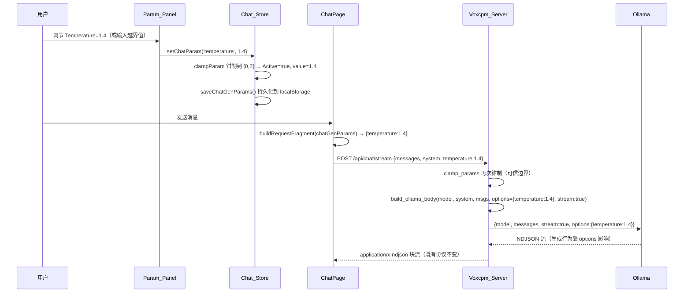
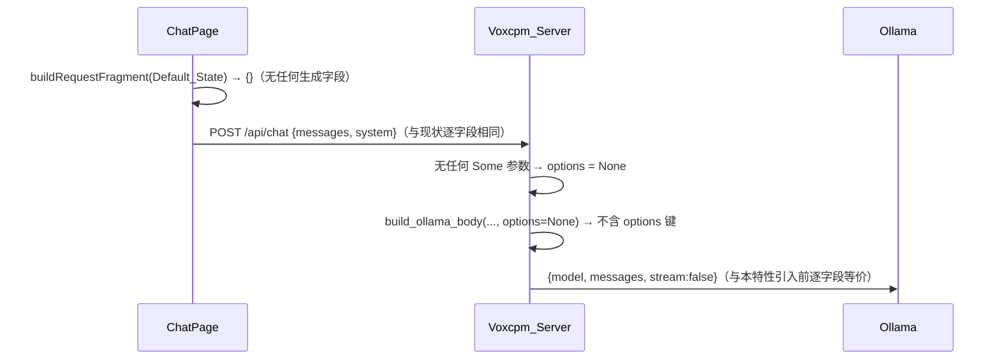

# Design Document

## Overview

「对话生成参数调节」(chat-generation-parameters) 为女娲 Nuwa 对话应用引入一组可调节的模型生成参数（Temperature、Top_P、Num_Predict、Top_K、Repeat_Penalty）。整体由两部分组成：

- **前端 Nuwa_Web**：在 Chat_Store（`uiStore.ts`，Zustand + localStorage）中新增 Generation_Params 状态（每个参数含 Active/Inactive 设置态与数值），经 localStorage 持久化与恢复；新增**纯函数层** `lib/generationParams.ts` 承载 Param_Validator（范围校验/钳制）与「Active 参数 → 请求体片段」的构造；`ChatPage` 在发起对话（流式 `/api/chat/stream` 与降级 `/api/chat` 两条路径）时把该请求体片段合并进请求体；新增 Param_Panel UI 控件（滑块/输入 + 恢复默认）。
- **后端 Voxcpm_Server**：复用并以**可选字段**扩展 `ChatRequest`（新增 `temperature`/`top_p`/`num_predict`/`top_k`/`repeat_penalty`，均为 `Option<…>`）；复用既有 `resolve_model`；把当前内联构造 Ollama 请求体的逻辑抽取为纯函数 `build_ollama_body`，使其根据「请求中实际提供的参数」组装 `options`（无任何参数时不含 `options` 字段）；`chat`（非流式）与 `chat_stream`（流式）两个 handler 共用同一套「参数接收 → Server_Param_Validator 钳制 → 组装 options」逻辑。

本特性为**纯增量增强**，严格遵循以下不破坏约束：

- 不改变 Chat_Endpoint / Stream_Endpoint 的请求/响应契约：所有新增生成参数字段均为可选。
- **缺省无回归（核心约束）**：当请求未携带任何生成参数（Default_State）时，`build_ollama_body` 产出的 Ollama 请求体与本特性引入前**逐字段等价**（仅 `model`、`messages`、`stream`，不含 `options`）。
- 不改变 Model_Selection 回退顺序（复用 `resolve_model`）。
- 不回归 chat-session-persistence、streaming-chat-output、voice-interaction-loop 等既有特性。

### 关键设计决策

1. **前后端各自钳制，取值范围共享同一规格（Param_Validator ≡ Server_Param_Validator）。**
   - 前端钳制用于即时反馈与「下发已合法值」；后端钳制作为可信边界（防止绕过前端的非法请求伤害 Ollama）。两侧采用**完全相同的范围规格**（见 Data Models 的 Param_Spec 表），故对任意原始输入产出相等的钳制结果（Property 4）。这是一个可属性化的等价关系，是无回归与一致性的关键。

2. **抽取 `build_ollama_body` 为纯函数，让「缺省无回归」可被机器验证。**
   - 现状中 Ollama 请求体在 `chat` handler 内联构造。本特性将其抽取为 `build_ollama_body(model, system, messages, options)`，其中 `options` 为 `Option<serde_json::Value>`（或 `Option<Map>`）。当 `options` 为 `None` 时，产出的 JSON **不含 `options` 键**，与现状逐字段一致（Property 5）。`chat_stream` 复用同一函数（区别仅 `stream` 取值），保证两接口一致（Req 5.5）。

3. **「实际提供的参数」而非「全集」驱动 options 组装。**
   - 前端只下发 Active_Param；后端只把「请求中出现（`Some`）的字段」放入 `options`。因此 `options` 的键集合**恰好等于**请求提供的参数集合，不注入未提供项（Req 5.4），Default_State 下 `options` 整体省略（Req 6.1）。

4. **前端用独立类型 `ChatGenParams`，不复用既有合成模式的 `GenerationParams`。**
   - `uiStore` 已有一个用于 TTS 合成模式的 `GenerationParams`（`speed/pitch/temperature/topK/emotion`）与 `params/setParam`。二者语义不同（合成 vs 对话采样），强行复用会造成键冲突与持久化纠缠。本特性引入独立的 `ChatGenParams` 状态与 `setChatParam`/`restoreChatParamDefaults`，并用独立的 localStorage 键 `nuwa_chat_gen_params`，与既有合成参数互不影响（Req 7 无回归）。

5. **持久化沿用 settings 的 localStorage 模式，而非 IndexedDB。**
   - 会话/消息走 IndexedDB（Chat_DB），但 settings 走 localStorage（`loadSettings`/`saveSettings`）。Generation_Params 是少量、结构简单、需同步读取的偏好数据，与 settings 同质，故采用同样的 `loadChatGenParams`/`saveChatGenParams` 模式（localStorage），实现简单的持久化 round-trip（Req 1.3/1.4/1.6）。

## Architecture

```mermaid
flowchart LR
    subgraph Nuwa_Web["Nuwa_Web (React 19)"]
        PP[Param_Panel<br/>滑块/输入 + 恢复默认]
        ST["uiStore<br/>chatGenParams + setChatParam<br/>+ restoreChatParamDefaults"]
        GP["lib/generationParams.ts (纯函数)<br/>clampParam / Param_Validator<br/>buildRequestFragment"]
        LS[(localStorage<br/>nuwa_chat_gen_params)]
        CP[ChatPage.tsx<br/>runAssistantStream]
        PP -->|setChatParam/restore| ST
        ST <-->|load/save round-trip| LS
        ST -->|经 clampParam 校验| GP
        CP -->|读 chatGenParams + buildRequestFragment| GP
    end

    subgraph Voxcpm_Server["Voxcpm_Server (Axum 0.8)"]
        H1["POST /api/chat (chat)"]
        H2["POST /api/chat/stream (chat_stream)"]
        RM[resolve_model 纯函数 - 复用]
        SV["clamp_params (Server_Param_Validator) 纯函数"]
        BB["build_ollama_body 纯函数<br/>按提供的参数组装 options"]
        H1 --> RM & SV --> BB
        H2 --> RM & SV --> BB
    end

    Ollama["Ollama /api/chat<br/>options 透传"]

    CP -->|"POST /api/chat/stream {…, temperature?, …}"| H2
    CP -. "降级" .->|"POST /api/chat {…, temperature?, …}"| H1
    H1 -->|"{model, messages, stream:false, options?}"| Ollama
    H2 -->|"{model, messages, stream:true, options?}"| Ollama
```

### 请求/数据流（含 Active 参数）



### 缺省路径（Default_State，无回归）



### 模块划分

- 后端改动：`handlers/chat.rs` —— 扩展 `ChatRequest`（可选字段）；新增纯函数 `clamp_params`、`build_ollama_body`；`chat` 改为调用二者；新增/扩展 `#[cfg(test)]` 属性测试。`chat_stream.rs` 复用 `clamp_params` / `build_ollama_body`（仅 `stream:true`）。
- 前端新增：`app/web/src/lib/generationParams.ts` —— `clampParam`/`Param_Validator`、`buildRequestFragment`、`DEFAULT_CHAT_GEN_PARAMS`、`PARAM_SPECS`、localStorage 读写 helper。
- 前端新增：`app/web/src/lib/generationParams.test.ts` —— fast-check 属性测试。
- 前端新增：`app/web/src/components/ParamPanel.tsx` —— Param_Panel UI（滑块/输入 + 恢复默认）。
- 前端改动：`app/web/src/store/uiStore.ts` —— 新增 `chatGenParams` 状态、`setChatParam`、`restoreChatParamDefaults`、`load/saveChatGenParams`。
- 前端改动：`app/web/src/components/ChatPage.tsx` —— `runAssistantStream` 在两条请求路径合并 `buildRequestFragment(...)`；挂载 Param_Panel。

## Components and Interfaces

### 后端：扩展 ChatRequest（可选字段）

```rust
// handlers/chat.rs —— 在既有 ChatRequest 上以可选字段扩展（不破坏契约）。
#[derive(Debug, Deserialize)]
pub struct ChatRequest {
    pub(crate) messages: Vec<ChatMessage>,
    #[serde(default = "default_model")]
    pub(crate) model: String,
    #[serde(default)]
    pub(crate) system: Option<String>,
    // —— 新增：生成参数，均为可选；缺省（None）即不下发对应 option。
    #[serde(default)]
    pub(crate) temperature: Option<f64>,
    #[serde(default)]
    pub(crate) top_p: Option<f64>,
    #[serde(default)]
    pub(crate) num_predict: Option<i64>,
    #[serde(default)]
    pub(crate) top_k: Option<i64>,
    #[serde(default)]
    pub(crate) repeat_penalty: Option<f64>,
}
```

### 后端：Server_Param_Validator（`clamp_params` 纯函数）

```rust
/// 经钳制后的生成参数集合：每个字段保持「提供与否」(Option) 语义，
/// 但若为 Some，则其值已被钳制到合法范围（与前端 Param_Validator 等价）。
#[derive(Debug, Clone, PartialEq)]
pub struct ClampedParams {
    pub temperature: Option<f64>,
    pub top_p: Option<f64>,
    pub num_predict: Option<i64>,
    pub top_k: Option<i64>,
    pub repeat_penalty: Option<f64>,
}

/// 对请求中提供（Some）的每个参数应用与 Param_Validator 等价的范围钳制：
/// - temperature ∈ [0.0, 2.0]；top_p ∈ [0.0, 1.0]；repeat_penalty ∈ [0.0, 2.0]
/// - top_k：取整后 ∈ [0, 100]
/// - num_predict：-1 原样保留（Unlimited_Length）；其余取整后 ∈ [1, 8192]
/// None 字段保持 None（不被注入）。对已合法值幂等。
pub fn clamp_params(req: &ChatRequest) -> ClampedParams;

/// 把 ClampedParams 转为 Ollama options 对象；当所有字段均为 None 时返回 None
/// （从而 build_ollama_body 不写入 options 键）。键名固定使用 Ollama 约定：
/// temperature / top_p / num_predict / top_k / repeat_penalty。
pub fn params_to_options(p: &ClampedParams) -> Option<serde_json::Map<String, serde_json::Value>>;
```

### 后端：`build_ollama_body` 纯函数（抽取自现状内联逻辑）

```rust
/// 构造发往 Ollama /api/chat 的请求体。纯函数，便于属性测试。
/// - system 为 Some 时，messages 首条置入 {role:"system", content:system}（与现状一致）。
/// - options 为 None 时，产出的 JSON **不含 `options` 键**（缺省无回归，Req 6.1/6.2）。
/// - options 为 Some(map) 时，置入 `options` 字段，且其键恰为调用方提供的参数集合。
pub fn build_ollama_body(
    model: &str,
    system: Option<&str>,
    messages: &[ChatMessage],
    stream: bool,
    options: Option<serde_json::Map<String, serde_json::Value>>,
) -> serde_json::Value;
```

`chat` / `chat_stream` 的统一调用形态：

```rust
// 两个 handler 共用同一序列（仅 stream 取值不同）：
let model = resolve_model(config.current_llm_model, config.current_model_id.clone(), &req.model);
let clamped = clamp_params(&req);
let options = params_to_options(&clamped);
let ollama_req = build_ollama_body(&model, req.system.as_deref(), &req.messages, /*stream*/ false, options);
```

> 现状 `chat` 中的内联 `serde_json::json!({...})` 将被替换为对 `build_ollama_body` 的调用，**行为在 Default_State 下逐字段不变**（由 Property 5 守护）。`chat_stream.rs` 同样改为复用，消除两处重复并保证一致（Req 5.5）。

### 前端：纯函数层 `lib/generationParams.ts`

```typescript
/** 单个对话生成参数的标识符。 */
export type ChatParamKey = 'temperature' | 'topP' | 'numPredict' | 'topK' | 'repeatPenalty';

/** 单个参数的设置态 + 数值。Inactive 时不随请求下发。 */
export interface ChatParamState {
  active: boolean;
  value: number;
}

/** Generation_Params 全集（前端状态形态）。 */
export type ChatGenParams = Record<ChatParamKey, ChatParamState>;

/** 参数规格：取值范围、是否取整、Ollama 选项键名、特殊值。 */
export interface ParamSpec {
  min: number;
  max: number;
  integer: boolean;
  /** num_predict 专用：允许的「逃逸值」-1（Unlimited_Length），不参与范围钳制。 */
  allowUnlimited?: boolean;
  /** 下发给后端 / Ollama 的键名（snake_case）。 */
  ollamaKey: 'temperature' | 'top_p' | 'num_predict' | 'top_k' | 'repeat_penalty';
  /** Inactive 默认数值（仅用于控件初值，不随请求下发）。 */
  default: number;
}

/** 各参数规格（与后端 clamp_params 范围严格一致）。 */
export const PARAM_SPECS: Record<ChatParamKey, ParamSpec>;

/** Default_State：所有参数 Inactive，value 取规格 default。 */
export const DEFAULT_CHAT_GEN_PARAMS: ChatGenParams;

/**
 * Param_Validator：把单个参数的原始输入钳制到其规格范围。
 * - integer 规格：先取整（Math.round）再 clamp。
 * - allowUnlimited 且输入为 -1：原样返回 -1。
 * - 对已合法值幂等：clampParam(key, clampParam(key, v)) === clampParam(key, v)。
 */
export function clampParam(key: ChatParamKey, raw: number): number;

/**
 * 「Active 参数 → 请求体片段」构造：返回仅含 Active 参数的对象，
 * 键为对应 Ollama 选项键名，值为经 clampParam 钳制后的数值。
 * Default_State（无 Active）返回 {}（空对象，不含任何生成字段）。
 */
export function buildRequestFragment(params: ChatGenParams): Partial<Record<ParamSpec['ollamaKey'], number>>;

/** 从 localStorage 恢复；不存在/损坏则返回 DEFAULT_CHAT_GEN_PARAMS（含逐参数兜底合并）。 */
export function loadChatGenParams(): ChatGenParams;

/** 持久化到 localStorage（键 nuwa_chat_gen_params）。失败静默忽略（与 saveSettings 一致）。 */
export function saveChatGenParams(params: ChatGenParams): void;
```

### 前端：Chat_Store 扩展（`uiStore.ts`）

```typescript
// UIState 新增（与既有合成模式 params/setParam 并存、互不影响）：
chatGenParams: ChatGenParams;                 // 初值 loadChatGenParams()
/** 设置某参数为 Active 并记录经 clampParam 钳制后的数值；随后持久化。 */
setChatParam: (key: ChatParamKey, rawValue: number) => void;
/** 将某参数重置为 Inactive（采用模型内建默认、不随请求下发）；随后持久化。 */
clearChatParam: (key: ChatParamKey) => void;
/** Restore_Defaults：所有参数重置为 Default_State 并持久化。 */
restoreChatParamDefaults: () => void;
```

实现要点：

```typescript
setChatParam: (key, rawValue) => {
  const value = clampParam(key, rawValue);               // Req 2.x 钳制
  const next = { ...get().chatGenParams, [key]: { active: true, value } };  // Req 1.2 置 Active
  saveChatGenParams(next);                               // Req 1.3 持久化
  set({ chatGenParams: next });
},
restoreChatParamDefaults: () => {
  const next = DEFAULT_CHAT_GEN_PARAMS;                  // Req 3.2 重置
  saveChatGenParams(next);                               // Req 3.3 持久化
  set({ chatGenParams: next });
},
```

### 前端：`ChatPage` 请求体合并

`runAssistantStream` 在两条路径合并请求片段（其余逻辑不变）：

```typescript
const fragment = buildRequestFragment(useUIStore.getState().chatGenParams); // {} 即 Default_State

// 流式：
body: JSON.stringify({ messages: payloadMessages, system, ...fragment }),
// 降级：
{ messages: payloadMessages, system, ...fragment },
```

> 因 `fragment` 在 Default_State 为 `{}`，展开后请求体与现状逐字段相同（Req 4.3/6.3）；`messages`/`system` 始终保留（Req 4.5）。

### 前端：Param_Panel 组件（`ParamPanel.tsx`）

为 Generation_Params 每个成员提供一个控件行（Req 1.1）：

- 一个启用开关（Active/Inactive）+ 滑块（范围取自 `PARAM_SPECS`）+ 数值输入框；数值变更走 `setChatParam`（即时钳制并持久化）；关闭开关走 `clearChatParam`。
- Num_Predict 额外提供「不限制」选项（写入 `-1`，Unlimited_Length）。
- 面板底部提供「恢复默认」按钮 → `restoreChatParamDefaults`（Req 3.1）。
- 控件展示的数值始终来自 store 的 `chatGenParams[key]`，因此输入越界值经 `setChatParam` 钳制后回显的是合法值（用户可见的范围反馈）。

## Data Models

### Param_Spec（取值范围规格，前后端共享语义）

| 参数 | 前端键 (`ChatParamKey`) | Ollama 键 | 范围 | 取整 | 特殊值 |
| ---- | ---- | ---- | ---- | ---- | ---- |
| Temperature | `temperature` | `temperature` | `[0.0, 2.0]` | 否 | — |
| Top_P | `topP` | `top_p` | `[0.0, 1.0]` | 否 | — |
| Num_Predict | `numPredict` | `num_predict` | `[1, 8192]` | 是 | `-1` = Unlimited_Length（原样保留） |
| Top_K | `topK` | `top_k` | `[0, 100]` | 是 | — |
| Repeat_Penalty | `repeatPenalty` | `repeat_penalty` | `[0.0, 2.0]` | 否 | — |

> 后端 `clamp_params` 必须使用**完全相同**的范围与取整/特殊值规则，二者等价性由 Property 4 守护。

### ChatGenParams（前端持久化形态，localStorage 键 `nuwa_chat_gen_params`）

```jsonc
{
  "temperature":   { "active": true,  "value": 1.4 },
  "topP":          { "active": false, "value": 0.9 },
  "numPredict":    { "active": false, "value": 512 },
  "topK":          { "active": false, "value": 40 },
  "repeatPenalty": { "active": false, "value": 1.1 }
}
```

- `active=false`（Inactive）的参数不进入请求片段；`loadChatGenParams` 对缺失键逐参数与 `DEFAULT_CHAT_GEN_PARAMS` 合并兜底（Req 1.5）。

### 请求体扩展（Chat_Endpoint / Stream_Endpoint，新增字段均可选）

```jsonc
// Default_State（与现状逐字段相同）：
{ "messages": [/*…*/], "system": "…" }

// 含 Active 参数（仅出现已设置项）：
{ "messages": [/*…*/], "system": "…", "temperature": 1.4, "top_k": 40 }
```

### Ollama 上行请求体（由 `build_ollama_body` 产出）

```jsonc
// Default_State：不含 options（逐字段等价于本特性引入前）
{ "model": "gemma4:e4b", "messages": [/*…*/], "stream": false }

// 含参数：options 键集合恰为请求提供的参数集合
{ "model": "gemma4:e4b", "messages": [/*…*/], "stream": true,
  "options": { "temperature": 1.4, "top_k": 40 } }
```

### 不变的既有契约

- Chat_Endpoint 响应 `{ role, content, model, done }`、错误 `{ error }`；Stream_Endpoint 的 `application/x-ndjson` 块协议（`delta`/`done`/`error`）——本特性均不修改。
- `resolve_model` 回退顺序、`ChatMessage` 结构、Session_Persistence 的 `appendMessage` 路径——均不改动。

## Correctness Properties

*属性（property）是在系统所有合法执行中都应成立的特征或行为——一种关于「系统应当做什么」的形式化陈述。属性是人类可读规格与机器可验证正确性保证之间的桥梁。*

本特性的核心可属性化逻辑集中在**纯函数层**：参数钳制（前端 `clampParam` / 后端 `clamp_params`）、持久化 round-trip、「Active 参数 → 请求片段」构造（`buildRequestFragment`）、Ollama 请求体组装（`build_ollama_body`）。以下属性均以「对任意输入」陈述，以属性测试实现（前端 fast-check、后端 proptest，每条 ≥100 次随机迭代）；UI 控件存在性、反序列化契约与既有特性回归则以示例/集成测试覆盖（见 Testing Strategy）。

经 Property Reflection，将 2.1–2.7 合并为「钳制正确性」、1.2–1.6 合并为「持久化 round-trip」、4.1–4.5/6.3 合并为「请求片段保真」、5.3/5.4/5.5/6.1/6.2 合并为「Ollama 请求体组装」，并新增「前后端钳制等价」。共 5 条，彼此独立。

### Property 1: Param_Validator 钳制正确性与幂等

*对任意* 参数 key（Temperature、Top_P、Num_Predict、Top_K、Repeat_Penalty 之一）与*任意*原始数值输入，`clampParam(key, raw)` 的结果满足该参数 Param_Spec：落在其闭区间范围内；整型参数（Top_K、Num_Predict）为整数；当 key 为 Num_Predict 且输入为 `-1` 时结果恒为 `-1`（Unlimited_Length），其余 Num_Predict 输入落在 `[1, 8192]`。且对已钳制值幂等：`clampParam(key, clampParam(key, raw)) === clampParam(key, raw)`。

**Validates: Requirements 2.1, 2.2, 2.3, 2.4, 2.5, 2.6, 2.7**

### Property 2: Generation_Params 持久化 round-trip

*对任意* 合法 ChatGenParams 状态（每个成员含 active 与经钳制的 value），先 `saveChatGenParams` 再 `loadChatGenParams` 应得到与原状态相等的对象（含每个成员的设置态与数值）；特别地，当 localStorage 不含已持久化值或内容损坏时，`loadChatGenParams` 返回 `DEFAULT_CHAT_GEN_PARAMS`（所有成员 Inactive）。

**Validates: Requirements 1.2, 1.3, 1.4, 1.5, 1.6**

### Property 3: 请求片段保真（Active 子集、键名、钳制值、缺省为空、既有字段不变）

*对任意* ChatGenParams 状态，`buildRequestFragment(params)` 产出的对象满足：其键集合恰好等于状态中 Active 成员对应的 Ollama 选项键名集合（`temperature`/`top_p`/`num_predict`/`top_k`/`repeat_penalty`），不含任何 Inactive 成员；每个键的值等于对该成员 value 应用 `clampParam` 后的结果；当状态为 Default_State（全 Inactive）时片段为 `{}`；该片段绝不包含 `messages` 或 `system` 键，故展开合并进请求体后既有字段保持不变。

**Validates: Requirements 4.1, 4.2, 4.3, 4.4, 4.5, 6.3**

### Property 4: 前后端钳制等价（Param_Validator ≡ Server_Param_Validator）

*对任意* 原始数值输入与*任意*参数 key，前端 `clampParam(key, raw)` 与后端 `clamp_params` 对同一字段产出的钳制结果相等（在数值类型对应下逐参数相等，含整型取整与 Num_Predict 的 `-1` 逃逸语义）。

**Validates: Requirements 5.2**

### Property 5: Ollama 请求体组装（options 精确性与缺省逐字段等价）

*对任意* 由提供（`Some`）/未提供（`None`）参数构成的组合，`build_ollama_body(model, system, messages, stream, params_to_options(clamp_params(req)))` 满足：当且仅当存在至少一个提供的参数时请求体含 `options` 键，且 `options` 的键集合恰好等于请求中提供的参数集合（不注入未提供项、其值为钳制后取值）；当没有任何提供的参数时请求体**不含** `options` 键，且与「仅含 `model`、`messages`（system 前置规则不变）、`stream`」的请求体逐字段等价。该函数被 `chat` 与 `chat_stream` 复用，故两端点对相同输入产出相同请求体（仅 `stream` 取值不同）。

**Validates: Requirements 5.3, 5.4, 5.5, 6.1, 6.2**

> 说明：Req 1.1/3.1（控件与恢复入口存在）、Req 5.1（可选字段反序列化）以示例/组件测试覆盖；Req 7.1–7.6 为既有特性回归，由复用既有测试套件保障；Req 7.3（Model_Selection 不变）复用既有 `resolve_model` 属性测试，不在此重复。

## Error Handling

| 场景 | 处理 | 需求 |
| ---- | ---- | ---- |
| 用户输入越界/非法数值（如 Temperature=9、Top_K=3.7） | `clampParam` 钳制到合法范围（Top_K 取整）；控件回显合法值，不阻断 | 2.1–2.7 |
| Num_Predict 输入 `-1` | 作为 Unlimited_Length 原样保留，不参与 `[1,8192]` 钳制 | 2.5 |
| localStorage 读取失败/JSON 损坏/缺键 | `loadChatGenParams` try/catch 兜底返回 `DEFAULT_CHAT_GEN_PARAMS`，并对缺失键逐参数与默认合并（与既有 `loadSettings` 容错一致） | 1.5 |
| localStorage 写入失败（隐私模式/配额） | `saveChatGenParams` try/catch 静默忽略（与 `saveSettings` 一致），不抛错、不阻断对话 | 1.3 |
| 后端收到越界/绕过前端的非法参数 | `clamp_params` 作为可信边界再次钳制；非数值字段反序列化为 `None`（`#[serde(default)]`），即视为未提供 | 5.2 |
| 后端收到部分参数 | `params_to_options` 仅纳入 `Some` 字段；全 `None` 时返回 `None` → 不写 `options` | 5.4, 6.1 |
| 请求完全不含生成字段（老客户端/降级） | 反序列化为全 `None`；行为与本特性引入前逐字段等价 | 6.2 |

要点：

- **钳制不报错、只收敛**：任何数值输入都被映射到合法范围，避免向 Ollama 下发非法 `options` 导致推理报错。
- **缺省即透明**：未提供参数在序列化（前端 `buildRequestFragment` 不产键）与反序列化（后端 `None`）两侧都表现为「不存在」，从而 `options` 整体省略。
- 本特性不改变 Stream_Endpoint 的流内错误协议与 ChatPage 的降级链路；生成参数仅作为请求体的可选附加字段，错误路径复用 streaming-chat-output 既有处理。

## Testing Strategy

采用**单元/示例测试 + 属性测试**双轨：示例/组件/集成测试覆盖 UI 控件、反序列化契约与既有特性回归；属性测试覆盖纯逻辑的普适正确性（每条属性最少 100 次随机迭代）。

### 属性测试（PBT）

PBT 适用：本特性核心为纯函数（钳制、序列化片段、请求体组装、持久化 round-trip），具备明确输入/输出与普适不变式，适合属性测试。

- **前端（Vitest + fast-check，`app/web`）** —— `lib/generationParams.test.ts`：
  - Property 1：`clampParam` 钳制范围/取整/`-1` 逃逸/幂等。
  - Property 2：`saveChatGenParams`→`loadChatGenParams` round-trip（mock localStorage；含空/损坏分支返回默认）。
  - Property 3：`buildRequestFragment` 键集合 == Active 子集、ollama 键名、钳制值、Default→`{}`、不含 messages/system。
  - Property 4（前端侧）：对共享测试向量，`clampParam` 结果与后端规格一致（见跨语言等价说明）。
- **后端（cargo + proptest，`backend/server`）** —— `handlers/chat.rs` 的 `#[cfg(test)] mod tests`（沿用既有 `ProptestConfig::with_cases(>=100)` 写法）：
  - Property 1（后端侧）：`clamp_params` 各字段范围/取整/`-1` 保留/幂等。
  - Property 4（后端侧）：`clamp_params` 对共享测试向量产出与前端等价的结果。
  - Property 5：`build_ollama_body` —— options 键集合 == 提供参数集合；全 `None` → 无 `options` 键且与「仅 model/messages/stream」逐字段相等；system 前置规则不变；`stream` 取值正确。

**跨语言等价（Property 4）实现方式**：在前后端各维护一份相同的「共享测试向量」（一组 `(参数, 原始输入, 期望钳制值)` 三元组，覆盖下界/上界/越界/小数/`-1` 等），前端 fast-check 与后端 proptest 各自断言「自侧钳制结果 == 期望值」，从而间接保证两侧相等；同时各侧的 Property 1 用随机输入保证范围正确性。

属性测试标签格式（注释）：`// Feature: chat-generation-parameters, Property {number}: {property_text}`。

### 示例 / 组件 / 集成测试

- **前端 Vitest + Testing Library**：
  - Param_Panel：渲染 5 个参数控件（1.1）；存在「恢复默认」入口且触发 `restoreChatParamDefaults`（3.1/3.2/3.3）；输入越界值经控件回显为钳制值。
  - Chat_Store：`setChatParam` 置 Active + 记录钳制值并持久化（1.2/1.3）；`restoreChatParamDefaults` 重置并持久化（3.2/3.3）。
  - ChatPage：mock `fetch`/`apiClient`，断言 Default_State 下请求体不含生成字段且与现状一致（4.3/6.3）；含 Active 参数时两条路径（流式 + 降级）请求体均包含 ollama 键 + 钳制值且保留 `messages`/`system`（4.1/4.2/4.4/4.5）。
- **后端 cargo**：
  - 反序列化契约：含/不含生成字段、含部分字段、含非法类型的 JSON 均能反序列化（非法类型落为 `None`）（5.1）。
  - 端点一致性示例：对相同输入，`chat` 与 `chat_stream` 经 `build_ollama_body` 产出相同 `options`（5.5）。
  - 缺省无回归示例：无参数请求产出的 Ollama 请求体等于现状快照（6.1/6.2）。
- **无回归**：复用既有测试套件保持全绿 —— `/api/chat` 与 `/api/chat/stream` 契约/集成（7.1/7.2）、`resolve_model` 属性（7.3）、Session_Persistence（7.4）、Streaming_Output 渲染/停止/降级（7.5）、Voice_Loop ASR/TTS（7.6）。

### 构建与验证命令

- 前端：`npm run test`（vitest --run）、`npm run build`（tsc + vite build）、`npm run lint`。
- 后端：`cargo test`、`cargo build`。
- 长时进程（`vite`/`vitest --watch`）请勿在自动化中启动；测试统一用 `--run`/`cargo test` 单次执行。

### 受影响文件清单

新增：

- `app/web/src/lib/generationParams.ts` —— `PARAM_SPECS`/`DEFAULT_CHAT_GEN_PARAMS`/`clampParam`/`buildRequestFragment`/`load|saveChatGenParams`。
- `app/web/src/lib/generationParams.test.ts` —— 前端属性测试（Property 1/2/3/4-前端侧）+ 共享测试向量。
- `app/web/src/components/ParamPanel.tsx` —— Param_Panel UI（控件 + 恢复默认）。
- `app/web/src/components/ParamPanel.test.tsx` —— Param_Panel 组件测试（如不并入既有文件）。

修改：

- `backend/server/src/handlers/chat.rs` —— `ChatRequest` 扩展可选字段；新增 `ClampedParams`/`clamp_params`/`params_to_options`/`build_ollama_body` 纯函数；`chat` 改为调用三者；新增属性测试（Property 1/4-后端侧/5）。
- `backend/server/src/handlers/chat_stream.rs` —— 复用 `clamp_params`/`params_to_options`/`build_ollama_body`（`stream:true`），消除内联请求体构造。
- `app/web/src/store/uiStore.ts` —— 新增 `chatGenParams` 状态、`setChatParam`/`clearChatParam`/`restoreChatParamDefaults`；初值 `loadChatGenParams()`。
- `app/web/src/components/ChatPage.tsx` —— `runAssistantStream` 两条请求路径合并 `buildRequestFragment(...)`；挂载 Param_Panel。

不改动（契约/行为保持）：`POST /api/chat` 与 `chat` 响应结构、Stream_Endpoint 块协议、`resolve_model` 回退顺序、`uiStore` 的 `appendMessage`/会话逻辑与既有合成模式 `params/setParam`、`useApi`、`client.ts`。
