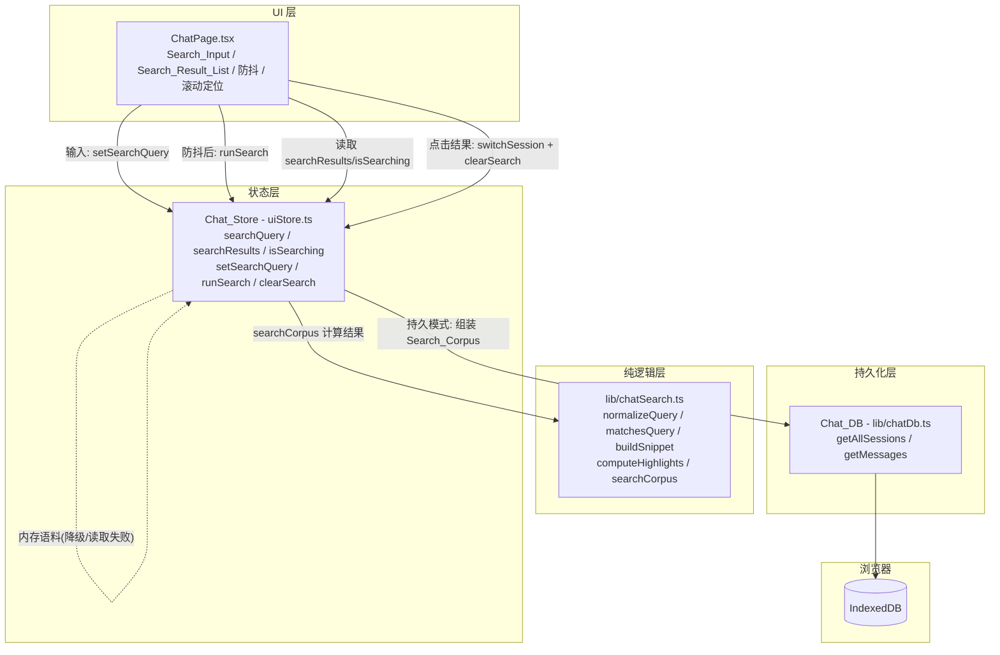
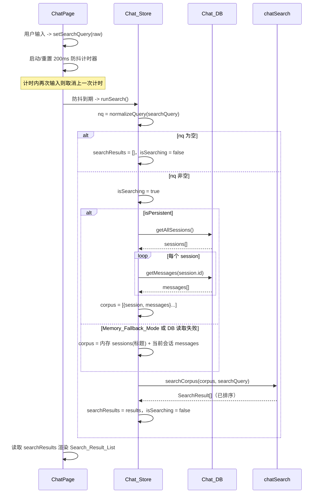
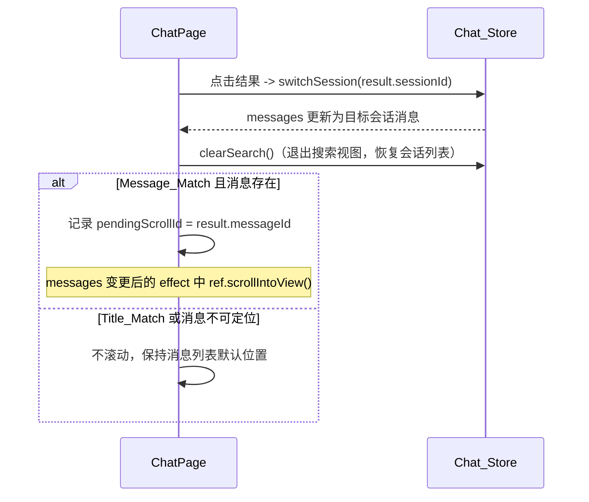

# Design Document

## Overview

「聊天记录全局搜索」(chat-history-search) 在已交付的「会话历史持久化」之上，为女娲对话页（Chat_Page）新增一个**纯前端**的跨会话关键词检索能力。用户在会话侧边栏的搜索框（Search_Input）输入查询词后，系统在**全部**已持久化会话的标题与全部消息内容中做大小写不敏感的子串匹配，并以带匹配片段（Match_Snippet）与高亮（Highlight）的结果列表（Search_Result_List）呈现；点击结果可切换到对应会话并定位到匹配消息。

本特性复用既有基础设施，不引入新的后端调用，也不改 `POST /api/chat` 等契约：

- **纯逻辑层** `lib/chatSearch.ts`（新增）：查询规范化、匹配判定、片段提取、高亮区间计算与结果排序，全部为无副作用纯函数，码点（codepoint）感知以保证多字节安全，便于以 fast-check 做属性测试。
- **状态层** Chat_Store（`store/uiStore.ts` 扩展）：新增搜索状态（`searchQuery` / `searchResults` / `isSearching`）与 action（设置查询、组装语料并运行检索），复用既有 `switchSession` 做导航。
- **UI 层** Chat_Page（`components/ChatPage.tsx` 扩展）：Search_Input、防抖（Debounce_Interval=200ms）查询更新、按会话分组标注的结果列表、空状态、点击导航并滚动定位。

检索的语料（Search_Corpus）在持久模式下经 Chat_DB（`getAllSessions` + `getMessages`）跨会话组装；在 Memory_Fallback_Mode 或 DB 读取失败时退回内存中可用的会话与消息。检索为**只读**操作，不修改任何 Chat_Session 或 Chat_Message，且保证既有对话、会话生命周期、语音输入（ASR）与 TTS 朗读不回归。

### 设计目标与非目标

- **目标**：侧边栏搜索入口、查询规范化（trim + 大小写不敏感 + 空查询空结果）、全局匹配（标题 + 消息内容、每条消息至多一条结果）、确定性排序、片段截断与高亮区间计算、结果展示与空状态、点击导航与消息定位、防抖输入、只读与无回归。
- **非目标**：模糊 / 正则 / 分词检索、跨设备同步、检索结果分页、检索历史记录、后端检索。这些不在本特性范围内。

### 关键设计决策

| 决策 | 选择 | 理由 |
| --- | --- | --- |
| 检索核心位置 | 抽出纯函数模块 `lib/chatSearch.ts`，与 store / DOM / IndexedDB 解耦 | 可独立用 fast-check 做属性测试，覆盖规范化、匹配、片段、高亮、排序 |
| 字符处理单位 | 一律以 **Unicode 码点**（`Array.from(text)`）为单位做截断与区间计算 | 避免破坏 emoji / 代理对等多字节字符，使 `Highlight_Range` 的 `{start,length}` 语义稳定 |
| 大小写不敏感策略 | 按码点逐个 `toLowerCase` 折叠后比较，保持码点索引对齐 | 子串匹配与高亮区间需以同一索引基准，逐码点折叠避免整串 `toLowerCase` 造成的长度漂移 |
| 语料来源抽象 | Search_Corpus 定义为 `{ session, messages }[]`，由 store 组装后传入纯函数 | 纯函数不感知数据来自 IndexedDB 还是内存，二者共用同一检索实现 |
| 排序确定性 | 先按 `session.updatedAt` 降序（字符串比较即时间序），再依赖 JS 稳定排序保留语料内相对次序 | 需求要求"由新到旧 + 同会话内 Title 先于 Message 且消息按追加顺序"，稳定排序保证相等 `updatedAt` 时结果可复现 |
| 防抖位置 | 放在 Chat_Page（UI 层）以 `setTimeout` 实现，store 只负责"立即运行一次检索" | 防抖是输入体验关注点，属 UI 职责；store 的 `runSearch` 保持可被直接调用与测试 |
| 搜索视图开关 | 由 `normalizeQuery(searchQuery) !== ''` 派生，而非依赖异步结果 | 清空输入即时隐藏结果列表、恢复会话列表（Req 1.4），无需等待检索完成 |
| 检索只读 | 纯函数不接收可变引用以外的写能力；store 组装语料仅做读取 | 满足 Req 9.1 检索只读，不改任何会话 / 消息 |

## Architecture

### 分层结构



### 一次检索的数据流



### 点击结果导航与定位时序



## Components and Interfaces

### 1. Chat_Search 纯逻辑模块（`app/web/src/lib/chatSearch.ts`，新增）

封装全部检索核心逻辑，无副作用、不依赖 DOM / store / IndexedDB，码点感知。

```typescript
import type { ChatSession, ChatMessage } from '@/store/uiStore';

/** Match_Snippet 的最大码点数。 */
export const SNIPPET_MAX_LENGTH = 100;

/** 一条结果所属会话的匹配类型。 */
export type MatchType = 'title' | 'message';

/**
 * Match_Snippet 内一处与 Normalized_Query 大小写不敏感相等的子串区间，
 * 基于码点（非 UTF-16 码元）：start 为起始码点下标，length 为码点数。
 */
export interface HighlightRange {
  start: number;
  length: number;
}

/** Search_Corpus 的一个条目：一个会话及其按追加顺序排列的消息。 */
export interface SearchCorpusEntry {
  session: ChatSession;
  messages: ChatMessage[];
}

/** 一次检索使用的语料。 */
export type SearchCorpus = SearchCorpusEntry[];

/** 一条检索结果。 */
export interface SearchResult {
  /** 所属会话 id。 */
  sessionId: string;
  /** 所属会话标题（快照，便于直接渲染）。 */
  sessionTitle: string;
  /** 所属会话 updatedAt（ISO，UI 用 formatRelativeTime 格式化）。 */
  updatedAt: string;
  /** 匹配类型。 */
  matchType: MatchType;
  /** 当 matchType==='message' 时为匹配消息 id；'title' 时为 undefined。 */
  messageId?: string;
  /** 围绕首个匹配位置、截断到 SNIPPET_MAX_LENGTH 的展示片段。 */
  snippet: string;
  /** snippet 内的高亮区间（升序、互不重叠）。 */
  highlights: HighlightRange[];
}

/** 去除 Search_Query 首尾空白，得到 Normalized_Query。 */
export function normalizeQuery(query: string): string;

/**
 * 大小写不敏感子串判定：normalizedQuery 是否为 text 的子串。
 * normalizedQuery 为空时约定返回 false（空查询不匹配任何文本）。
 * 以逐码点折叠大小写后比较，保证多字节安全。
 */
export function matchesQuery(text: string, normalizedQuery: string): boolean;

/**
 * 生成围绕 text 中首个匹配位置的 Match_Snippet：
 * - 以码点为单位；
 * - text 码点数 <= maxLength 时返回整段 text；
 * - 超过 maxLength 时取一个长度为 maxLength 的码点窗口，且当
 *   normalizedQuery 码点数 <= maxLength 时窗口必定完整包含首个匹配子串；
 * - normalizedQuery 不是 text 子串时返回 text 截断到 maxLength 的前缀。
 */
export function buildSnippet(
  text: string,
  normalizedQuery: string,
  maxLength?: number,
): string;

/**
 * 计算 snippet 内所有与 normalizedQuery 大小写不敏感相等的子串区间。
 * 从左到右扫描，匹配后跳过整个匹配长度，得到：
 * - 升序（start 递增）；
 * - 互不重叠；
 * - 每个区间均落在 [0, snippet 码点数] 边界内；
 * - 每个区间对应文本与 normalizedQuery 大小写不敏感相等。
 * normalizedQuery 为空时返回 []。
 */
export function computeHighlights(
  snippet: string,
  normalizedQuery: string,
): HighlightRange[];

/**
 * 顶层检索：对 corpus 计算有序的 SearchResult[]。
 * - nq = normalizeQuery(query)；nq 为空返回 []；
 * - 在每个会话标题与每条消息内容中做大小写不敏感子串匹配；
 * - 标题命中产生一条 Title_Match；每条命中消息至多一条 Message_Match；
 * - 结果按所属会话 updatedAt 降序；同会话内 Title_Match 在前、
 *   Message_Match 按消息追加顺序在后（依赖稳定排序保留相等 updatedAt 的语料次序）。
 */
export function searchCorpus(corpus: SearchCorpus, query: string): SearchResult[];
```

**码点处理约定**：所有按字符的操作先 `const cps = Array.from(text)` 拆为码点数组，再做下标 / 切片 / 比较；大小写折叠定义为 `fold(cps) = cps.map(c => c.toLowerCase())`（逐码点），匹配判定与高亮均以折叠后的码点序列在相同下标基准上比较。生成器在属性测试中避免会改变码点数的特殊大小写字符（如 'İ'），使 `fold` 在测试输入域内保持 1:1。

**buildSnippet 窗口算法**（`n = 码点数`, `q = normalizedQuery 码点数`, `m = maxLength`）：

```
matchStart = 折叠后首个匹配的码点下标（未命中则按前缀处理）
若 n <= m:            返回整段（offset = 0）
否则:
  若 q >= m:          start = matchStart            // 超长查询：尽力保留匹配起点
  否则:               start = matchStart - floor((m - q) / 2)   // 居中显示
  start = clamp(start, 0, n - m)
  snippet = cps.slice(start, start + m).join('')
```

当 `q <= m` 时，clamp 后窗口 `[start, start+m)` 必定包含 `[matchStart, matchStart+q)`（左右钳制两种情况均可证明匹配完整落入），从而保留首个匹配子串（Req 5.3）。

### 2. Chat_Store 扩展（`app/web/src/store/uiStore.ts`）

在 `UIState` 的 Chat 区新增搜索状态与 action：

```typescript
import {
  searchCorpus,
  normalizeQuery,
  type SearchResult,
  type SearchCorpus,
} from '@/lib/chatSearch';

interface UIState {
  // ... 既有字段
  // Chat search
  searchQuery: string;            // Search_Input 原始文本，初始 ''
  searchResults: SearchResult[];  // 最近一次检索结果，初始 []
  isSearching: boolean;           // 语料组装 + 检索进行中，初始 false
  setSearchQuery: (query: string) => void;  // 仅更新 searchQuery
  runSearch: () => Promise<void>; // 组装 Search_Corpus 并计算 searchResults
  clearSearch: () => void;        // 重置搜索状态（导航 / 退出搜索视图用）
}
```

**实现要点**：

```typescript
setSearchQuery: (query) => set({ searchQuery: query }),

clearSearch: () => set({ searchQuery: '', searchResults: [], isSearching: false }),

runSearch: async () => {
  const { searchQuery } = get();
  const nq = normalizeQuery(searchQuery);
  if (nq === '') {
    set({ searchResults: [], isSearching: false });
    return;
  }
  set({ isSearching: true });
  const corpus = await assembleSearchCorpus();   // 见下
  const results = searchCorpus(corpus, searchQuery);
  set({ searchResults: results, isSearching: false });
},
```

**语料组装**（模块内私有 helper，复用既有 `chatDb` 实例与内存状态）：

```typescript
async function assembleSearchCorpus(): Promise<SearchCorpus> {
  const { sessions, currentSessionId, messages, isPersistent } = get();
  // 持久模式：经 Chat_DB 跨会话取全量语料。
  if (isPersistent) {
    try {
      const all = await chatDb.getAllSessions();
      return await Promise.all(
        all.map(async (session) => ({
          session,
          messages: await chatDb.getMessages(session.id),
        })),
      );
    } catch {
      // 读取失败：降级到内存语料（Req 9.2），不中断。
    }
  }
  // Memory_Fallback_Mode 或读取失败：用内存中可用的会话标题 +
  // 当前会话已加载的消息（其余会话消息不在内存中，标题仍可被检索）。
  return sessions.map((session) => ({
    session,
    messages: session.id === currentSessionId ? messages : [],
  }));
}
```

> `runSearch` 与 `assembleSearchCorpus` 只调用 Chat_DB 的读取接口（`getAllSessions` / `getMessages`），不写入，满足检索只读（Req 9.1）。导航复用既有 `switchSession`，本扩展不新增导航逻辑（Req 7.1）。

### 3. Chat_Page 扩展（`app/web/src/components/ChatPage.tsx`）

在侧边栏会话列表区上方插入 Search_Input，并以 `normalizeQuery(searchQuery) !== ''` 决定渲染 Search_Result_List 还是会话列表。

**新增订阅与本地态**：

```typescript
const searchQuery = useUIStore((s) => s.searchQuery);
const searchResults = useUIStore((s) => s.searchResults);
const isSearching = useUIStore((s) => s.isSearching);
const setSearchQuery = useUIStore((s) => s.setSearchQuery);
const runSearch = useUIStore((s) => s.runSearch);
const clearSearch = useUIStore((s) => s.clearSearch);

// 消息定位：按 message id 收集 DOM ref，记录待滚动目标。
const messageRefs = useRef<Map<string, HTMLDivElement>>(new Map());
const [pendingScrollId, setPendingScrollId] = useState<string | null>(null);

const showSearch = normalizeQuery(searchQuery) !== '';
```

**防抖触发检索**（Req 8.1 / 8.2）：

```typescript
useEffect(() => {
  if (normalizeQuery(searchQuery) === '') return;       // 空查询不触发
  const timer = setTimeout(() => { void runSearch(); }, DEBOUNCE_INTERVAL); // 200ms
  return () => clearTimeout(timer);   // 计时内再次输入则取消上一次
}, [searchQuery, runSearch]);
```

**Search_Input**：受控输入绑定 `searchQuery`，`onChange` 调 `setSearchQuery`，附清除按钮调 `clearSearch`。

**Search_Result_List 渲染**（`showSearch` 为真时取代会话列表）：

- 每条结果展示所属会话标题（`result.sessionTitle`，Req 6.1）、`formatRelativeTime(result.updatedAt)`（Req 6.2）、高亮片段（Req 6.3）。
- 空状态：`showSearch && !isSearching && searchResults.length === 0` → 渲染「未找到匹配结果」（Req 6.4）。
- 点击：`onClick={() => handleResultClick(result)}`。

**高亮渲染**（码点安全，纯展示 helper，可置于组件内或 `chatSearch`）：

```typescript
// 依据 HighlightRange[] 将 snippet 切成普通段与高亮段，<mark> 包裹高亮。
function renderHighlightedSnippet(snippet: string, highlights: HighlightRange[]) {
  const cps = Array.from(snippet);            // 以码点切片，避免破坏多字节
  const nodes: React.ReactNode[] = [];
  let cursor = 0;
  highlights.forEach((h, i) => {
    if (h.start > cursor) nodes.push(<span key={`t${i}`}>{cps.slice(cursor, h.start).join('')}</span>);
    nodes.push(<mark key={`h${i}`}>{cps.slice(h.start, h.start + h.length).join('')}</mark>);
    cursor = h.start + h.length;
  });
  if (cursor < cps.length) nodes.push(<span key="tail">{cps.slice(cursor).join('')}</span>);
  return nodes;
}
```

**点击导航与定位**（Req 7.1–7.4）：

```typescript
const handleResultClick = useCallback(async (result: SearchResult) => {
  await switchSession(result.sessionId);          // Req 7.1：复用既有 switchSession
  clearSearch();                                  // Req 7.4：退出搜索视图，恢复会话列表
  if (result.matchType === 'message' && result.messageId) {
    setPendingScrollId(result.messageId);         // 滚动在 messages 更新后的 effect 中执行
  }
}, [switchSession, clearSearch]);

// messages 变更后尝试滚动到目标消息；ref 不存在则不滚动（Req 7.3）。
useEffect(() => {
  if (!pendingScrollId) return;
  const el = messageRefs.current.get(pendingScrollId);
  if (el) el.scrollIntoView({ behavior: 'smooth', block: 'center' }); // Req 7.2
  setPendingScrollId(null);
}, [messages, pendingScrollId]);
```

> 既有 `messagesEndRef` 自动滚到底的 effect 保留；为定位匹配消息，在每条消息容器上挂 `ref={(el) => { if (el) messageRefs.current.set(msg.id, el); else messageRefs.current.delete(msg.id); }}`。两个滚动 effect 互不破坏既有发送 / 流式行为（无回归）。

### 4. 常量（`app/web/src/lib/chatSearch.ts` 或 Chat_Page）

```typescript
export const DEBOUNCE_INTERVAL = 200;   // Debounce_Interval，毫秒
// SNIPPET_MAX_LENGTH = 100 已在 chatSearch.ts 定义
```

### 5. 依赖变更

无新增生产依赖。测试沿用既有 **fast-check**（纯逻辑属性测试）与 **fake-indexeddb**（DB 语料组装测试），均已在 devDependencies 中。

## Data Models

### Search_Corpus（检索输入，运行时结构）

```typescript
type SearchCorpus = Array<{
  session: ChatSession;     // { id, title, characterId, voiceId, updatedAt }
  messages: ChatMessage[];  // 按追加顺序（持久模式下由 getMessages 按 seq 升序返回）
}>;
```

- 持久模式：`session` 来自 `chatDb.getAllSessions()`，`messages` 来自 `chatDb.getMessages(id)`（已按 `seq` 升序，即追加顺序）。
- 内存模式：`session` 来自内存 `sessions`，仅当前会话 `messages` 非空，其余会话 `messages` 为 `[]`（标题仍参与检索）。

### Search_Result（检索输出）

```typescript
interface SearchResult {
  sessionId: string;
  sessionTitle: string;
  updatedAt: string;            // ISO，展示时 formatRelativeTime
  matchType: 'title' | 'message';
  messageId?: string;           // Message_Match 时存在
  snippet: string;              // 截断到 SNIPPET_MAX_LENGTH 码点
  highlights: HighlightRange[]; // 升序、互不重叠、码点为单位
}

interface HighlightRange {
  start: number;   // snippet 内起始码点下标
  length: number;  // 匹配码点数
}
```

### 结果排序模型

对结果集合的全序定义：

1. 主键：所属会话 `updatedAt` 降序（ISO 字符串比较即时间序，最新在前）。
2. 次序（同一会话内）：Title_Match 先于全部 Message_Match；多条 Message_Match 之间按消息在该会话内的追加顺序。
3. 相等 `updatedAt` 的不同会话：依赖 JS `Array.prototype.sort` 的稳定性，保留它们在 Search_Corpus 中的相对次序，保证结果可复现。

> 复用既有类型：`ChatSession` / `ChatMessage` 直接从 `@/store/uiStore` 引入，`updatedAt` 展示沿用既有 `formatRelativeTime`（`@/lib/chatSession`），不重复定义。

## Correctness Properties

*属性（property）是在系统所有有效执行中都应成立的特征或行为——是对"软件应当做什么"的形式化陈述。属性是人类可读规格与机器可验证正确性保证之间的桥梁。*

本特性的检索核心是一组纯函数（`normalizeQuery` / `matchesQuery` / `buildSnippet` / `computeHighlights` / `searchCorpus`），输入空间大（任意文本、任意语料）且存在清晰的普适不变式（规范化、匹配不变性、覆盖与唯一性、排序确定性、片段截断、高亮区间合法性、只读），非常适合属性测试（PBT）。下列属性覆盖这些可属性化部分；UI 渲染 / 交互、防抖时序、Chat_DB 语料组装接线与无回归约束不适合 PBT，在「测试策略」中以组件测试、假定时器示例、fake-indexeddb 集成测试与既有套件覆盖。所有属性已经过 prework 反思去重（覆盖+唯一性合并、大小写匹配合并、高亮三性质合并、片段两性质合并）。

### Property 1: 查询规范化等价 trim

*For any* 字符串 `query`：`normalizeQuery(query)` 等于 `query` 去除首尾空白后的文本，且结果不以空白字符开头或结尾。

**Validates: Requirements 2.1**

### Property 2: 大小写不敏感匹配不变性

*For any* 文本 `text`、查询 `query`（`normalizeQuery(query)` 非空）以及对 `text` 各字符任意施加的大小写翻转后的文本 `text'`：`matchesQuery(text, nq)` 与 `matchesQuery(text', nq)` 给出一致的布尔结果，且该结果等价于"`nq` 经大小写折叠后是 `text` 折叠后的子串"。

**Validates: Requirements 2.3, 2.4**

### Property 3: 空查询返回空结果

*For any* Search_Corpus 与任意仅由空白字符组成（或为空）的 `query`：`searchCorpus(corpus, query)` 返回空数组。

**Validates: Requirements 2.2**

### Property 4: 匹配覆盖、归属与每消息至多一条

*For any* Search_Corpus 与查询 `query`（`nq = normalizeQuery(query)` 非空）：`searchCorpus` 的结果集合恰好等于命中集合——即 (a) 每个标题以大小写不敏感方式包含 `nq` 的会话恰有一条 `matchType==='title'` 且 `sessionId` 指向该会话的结果；(b) 每条内容包含 `nq` 的消息恰有一条 `matchType==='message'`、`messageId` 指向该消息且归属其会话的结果；(c) 标题及其全部消息均不含 `nq` 的会话不产生任何结果；(d) 任一 `messageId` 在结果中至多出现一次。

**Validates: Requirements 3.1, 3.2, 3.3, 3.4, 3.5**

### Property 5: 结果排序确定性

*For any* Search_Corpus 与非空 `nq`：`searchCorpus` 结果满足全序——按所属会话 `updatedAt` 降序；同一会话内 Title_Match 排在其全部 Message_Match 之前，且 Message_Match 之间按消息在该会话内的追加顺序排列；对相等 `updatedAt` 的会话，结果相对次序与其在 Search_Corpus 中的次序一致（稳定）。

**Validates: Requirements 3.6**

### Property 6: 高亮区间合法性（数量 / 边界 / 等值 / 升序不重叠）

*For any* `snippet` 与非空 `nq`：`computeHighlights(snippet, nq)` 返回的区间序列满足——(a) 每个区间 `0 <= start` 且 `start + length <= snippet 的码点数`；(b) 每个区间对应的 `snippet` 子串与 `nq` 大小写不敏感相等，且 `length` 等于 `nq` 的码点数；(c) 区间按 `start` 严格升序且互不重叠（前一区间的 `start+length <= 后一区间 start`）；(d) 区间数量等于 `snippet` 内从左到右、匹配后跳过整段的不重叠出现次数。

**Validates: Requirements 5.2, 5.4, 5.5**

### Property 7: 片段包含首个匹配且截断到上限

*For any* 文本 `text`、非空 `nq`（`nq` 码点数 `<= SNIPPET_MAX_LENGTH`）：`buildSnippet(text, nq)` 结果的码点数 `<= SNIPPET_MAX_LENGTH`；并且当 `nq` 以大小写不敏感方式是 `text` 的子串时，`buildSnippet` 结果同样以大小写不敏感方式包含 `nq`（即保留首个匹配子串）。

**Validates: Requirements 5.1, 5.3**

### Property 8: 检索只读

*For any* Search_Corpus 与任意 `query`：调用 `searchCorpus(corpus, query)` 前后，`corpus` 及其内部每个 `session` 与每条 `message` 在结构与字段上保持不变（深相等），检索不修改任何输入数据。

**Validates: Requirements 9.1**

## Error Handling

| 场景 | 触发条件 | 处理 | 关联需求 |
| --- | --- | --- | --- |
| DB 读取语料失败 | 持久模式下 `getAllSessions` / `getMessages` reject | `assembleSearchCorpus` 捕获异常，降级为内存语料（全部会话标题 + 当前会话消息）继续计算并返回结果，不抛出、不中断 Chat_Page | 9.2 |
| 处于 Memory_Fallback_Mode | `isPersistent === false` | 直接走内存语料分支组装 Search_Corpus，搜索可用 | 4.2 |
| 空 / 纯空白查询 | `normalizeQuery(searchQuery) === ''` | `runSearch` 立即置 `searchResults=[]`、`isSearching=false`；Chat_Page 隐藏结果列表恢复会话列表 | 1.4, 2.2 |
| 无匹配结果 | `nq` 非空但结果为空 | Chat_Page 渲染空状态提示，不报错 | 6.4 |
| 点击结果但目标消息不可定位 | Message_Match 对应消息不在当前消息列表（ref 缺失） | 完成 `switchSession` 与 `clearSearch`，跳过 `scrollIntoView`，消息列表保持默认位置 | 7.3 |
| 防抖期间快速连续输入 | 200ms 内 `searchQuery` 多次变化 | `useEffect` 清理函数 `clearTimeout` 取消上一次待触发检索，以最新查询重新计时，仅触发一次 | 8.2 |
| 超长文本 / 超长查询 | 文本码点数 > 100，或查询码点数 > 100 | `buildSnippet` 以码点窗口截断到 100；查询 > 100 时尽力保留匹配起点（边界情形，属性条件限定 `nq <= 100`） | 5.3 |
| 多字节字符（emoji / 代理对） | 文本含非 BMP 字符 | 所有切片 / 区间以 `Array.from` 码点为单位，避免半个代理对，`Highlight_Range` 语义稳定 | 5.4 |

检索全程为只读：纯函数不写入任何输入；store 的语料组装仅调用 Chat_DB 读取接口。语料组装的异常被 `try/catch` 收敛于 `assembleSearchCorpus` 内部并降级，`runSearch` 不向 UI 抛出异常（Req 9.2）。

## Testing Strategy

### 框架与工具

- 测试运行器：**Vitest 3**（`npm test` 即 `vitest --run`），环境 jsdom。
- 属性测试库：**fast-check 3**（已装，**不自行实现** PBT）。
- 组件测试：**@testing-library/react** + 既有 `src/test/setup.ts`（已提供 `scrollIntoView` 等 mock）；防抖用 `vi.useFakeTimers()`。
- IndexedDB 测试：既有 **fake-indexeddb**，经 `setChatDbForTesting` 注入，验证持久模式语料组装与读取失败降级。

### 双重测试策略

- **属性测试（PBT）**：覆盖 `chatSearch.ts` 纯逻辑与不变式（Property 1–8）。
  - 每个属性以**单个** property-based 测试实现，**最少 100 次迭代**（`fc.assert(fc.property(...), { numRuns: 100 })`）。
  - 每个属性测试以注释标注其设计属性，格式：`// Feature: chat-history-search, Property {number}: {property_text}`。
  - 生成器要点：
    - 为制造命中，采用"先生成查询 `q`，再把 `q`（或其大小写变体）嵌入随机文本"的策略，保证覆盖类属性有正例；同时生成不含 `q` 的负例验证可靠性。
    - 多字节安全：生成器纳入 CJK、emoji（非 BMP，触发代理对）等字符；避免会改变码点数的大小写特殊字符（如 'İ'），使逐码点折叠保持 1:1。
    - 大小写不变性（Property 2）：对文本逐字符随机翻转大小写得到 `text'`。
    - 排序属性（Property 5）：生成多会话、可变长消息序列，`updatedAt` 含相等值以检验稳定性。
    - 只读属性（Property 8）：调用前 `structuredClone` 语料，调用后深相等比较。
- **单元 / 示例测试**：`normalizeQuery` / `matchesQuery` / `buildSnippet` / `computeHighlights` 的具体边界（空串、纯空白、无匹配、相邻匹配、匹配跨截断边界）。
- **Store 集成测试（fake-indexeddb）**：
  - 持久模式跨会话组装语料并返回正确结果（Req 4.1, 4.3, 4.4）。
  - `isPersistent=false` 走内存语料（Req 4.2）。
  - 注入会 reject 的 `chatDb` 验证读取失败降级到内存语料且不抛出（Req 9.2）。
- **组件测试（ChatPage）**：搜索框存在（1.1）、输入更新查询（1.2）、非空展示结果列表 / 清空恢复会话列表（1.3, 1.4, 7.4）、结果项显示标题 + 相对时间 + `<mark>` 高亮片段（6.1, 6.2, 6.3）、空状态（6.4）、点击调用 `switchSession`（7.1）、Message_Match 触发 `scrollIntoView`（7.2）与不可定位时不滚动（7.3）、防抖仅触发一次最新查询（8.1, 8.2）。
- **无回归 / 构建验证**：既有 `ChatPage.test.tsx`、`uiStore` 会话 / 消息测试、voice 相关测试全部保持通过（9.3, 9.4, 9.5）；`npm run build`（`tsc && vite build`）类型与构建通过；不新增后端调用、`/api/chat` 等契约不变（9.6）。

### 测试到属性映射（PBT 部分）

| 属性 | 被测对象 | 测试文件（建议） |
| --- | --- | --- |
| Property 1 | `normalizeQuery` | `lib/chatSearch.test.ts` |
| Property 2 | `matchesQuery` | `lib/chatSearch.test.ts` |
| Property 3 | `searchCorpus`（空查询） | `lib/chatSearch.test.ts` |
| Property 4 | `searchCorpus`（覆盖/唯一） | `lib/chatSearch.test.ts` |
| Property 5 | `searchCorpus`（排序） | `lib/chatSearch.test.ts` |
| Property 6 | `computeHighlights` | `lib/chatSearch.test.ts` |
| Property 7 | `buildSnippet` | `lib/chatSearch.test.ts` |
| Property 8 | `searchCorpus`（只读） | `lib/chatSearch.test.ts` |

### 受影响文件清单

**新增**
- `app/web/src/lib/chatSearch.ts` — Chat_Search 纯逻辑模块（含 `SNIPPET_MAX_LENGTH` / `DEBOUNCE_INTERVAL` 常量与类型）
- `app/web/src/lib/chatSearch.test.ts` — Property 1–8 属性测试 + 边界单元测试

**修改**
- `app/web/src/store/uiStore.ts` — 新增 `searchQuery` / `searchResults` / `isSearching` 状态与 `setSearchQuery` / `runSearch` / `clearSearch` action、`assembleSearchCorpus` helper
- `app/web/src/store/uiStore.search.test.ts`（建议新增）— 持久 / 降级 / 读取失败语料组装集成测试
- `app/web/src/components/ChatPage.tsx` — Search_Input、防抖检索、Search_Result_List、高亮渲染、点击导航与滚动定位
- `app/web/src/components/ChatPage.test.tsx` — 新增搜索交互用例

**不改动**
- 后端全部代码、`POST /api/chat` / `GET /api/models` / `/api/downloads/*` 契约；既有 Chat_DB、`chatSession.ts`（`formatRelativeTime` 复用）、Voice_Loop 相关实现
