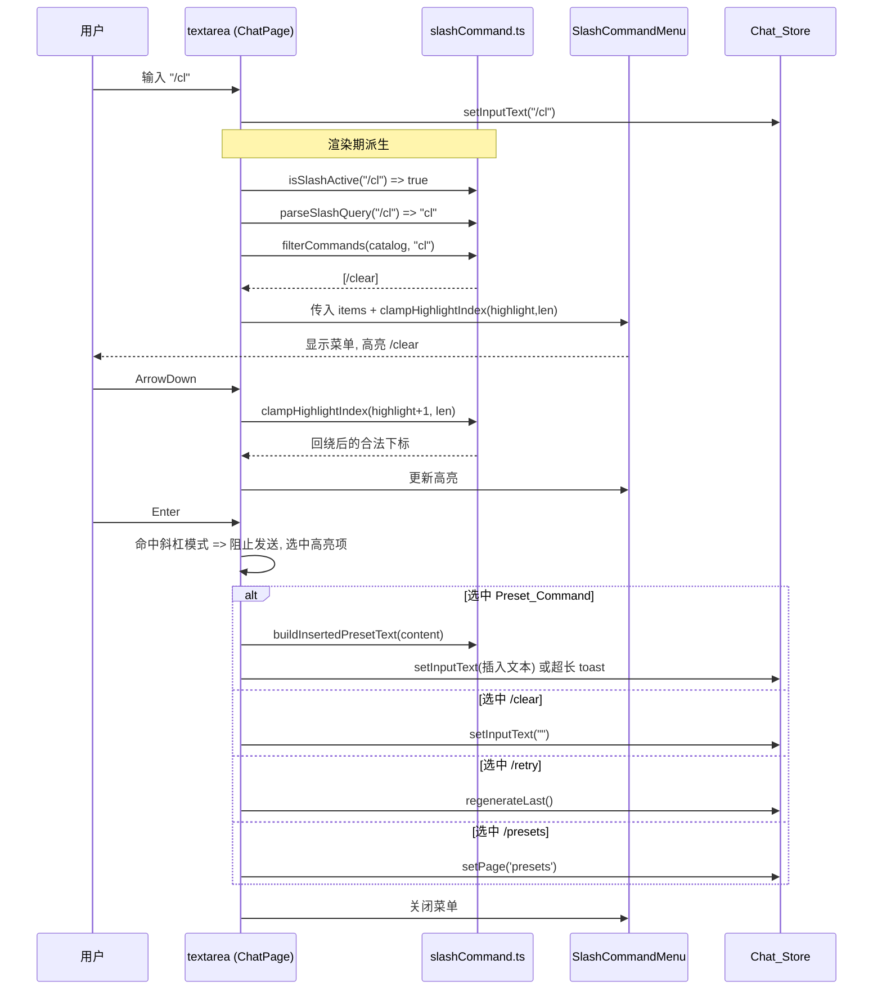

# Design Document

## Overview

「对话输入框斜杠命令」(chat-input-slash-commands) 在女娲 Nuwa 对话页 `ChatPage` 底部输入框（Input_Field）之上叠加一个命令面板（Slash_Command_Menu）。当用户以 `/` 开头键入时，面板列出两类命令——内置快捷命令（`/clear`、`/retry`、`/presets`）与由 `Chat_Store.presets` 派生的提示词预设命令，并随斜杠后查询串实时过滤；用户可用 ArrowUp/ArrowDown 导航、Enter 或鼠标点击选中、Escape 关闭。

设计遵循既有 Nuwa_Web 的「纯函数核心 + 薄 UI 集成」分层惯例（与 `lib/promptPreset.ts` + `ChatPage` 集成、`lib/messageActions.ts` 可用性矩阵一致）：

- **纯逻辑层**：新增 `app/web/src/lib/slashCommand.ts`，无 DOM / Chat_Store / IndexedDB 依赖，集中斜杠检测、查询解析、目录构建、过滤匹配、高亮下标规整与插入文本构造。该模块是属性测试（fast-check，≥100 runs）的唯一目标。
- **展示层**：新增 `app/web/src/components/SlashCommandMenu.tsx`，无状态受控组件，仅负责渲染过滤后的命令列表与高亮、并把点击 / 悬停事件回调给父组件。
- **集成层**：`ChatPage.tsx` 用少量本地 state（`slashHighlight`）驱动菜单，并在既有 textarea 的 `onChange` / `onKeyDown` 上分支处理斜杠模式，复用既有 `setInputText` / `regenerateLast` / `setPage('presets')` 与 `useToastStore`。

本特性为纯增量增强：不改动任何后端（`voxcpm-server`）接口，不改动 `Chat_Store` 既有对外契约，不影响既有发送 / 流式 / 停止 / 持久化 / 语音 / 预设管理路径。当未激活斜杠模式时，输入与发送行为与现状逐字节一致。

### 设计依据（已核对的真实 API）

| 依赖 | 位置 | 用途 |
| --- | --- | --- |
| `inputText` / `setInputText(text)` | `store/uiStore.ts` | 读取/写回 Input_Field 文本 |
| `presets: PromptPreset[]` | `store/uiStore.ts` | Preset_Command 来源；`PromptPreset = { id, title, content }` |
| `regenerateLast(): Promise<...|null>` | `store/uiStore.ts` | `/retry` 复用既有重新生成动作，返回 `null` 表示无 Last_Assistant_Message |
| `setPage(page: AppPage)` | `store/uiStore.ts` | `/presets` 切换页面；`AppPage` 联合类型含 `'presets'` |
| `messages` | `store/uiStore.ts` | 判断是否存在 Last_Assistant_Message（`regenerateLast` 内部已处理） |
| `INPUT_MAX_LENGTH = 2000` | `lib/promptPreset.ts` | 插入预设文本码点上限，超限以 toast 提示并保持原文 |
| `addToast({ message, type })` | `store/toastStore.ts` | 长度超限提示 |
| textarea `ref={inputRef}` + `onKeyDown` | `components/ChatPage.tsx` | 现有 `Enter`(无 Shift) 发送、`Shift+Enter` 换行入口 |

## Architecture

### 分层与依赖方向

```mermaid
flowchart TD
  subgraph UI["展示/集成层 (React)"]
    CP["ChatPage.tsx<br/>textarea + 本地 slashHighlight 态"]
    SM["SlashCommandMenu.tsx<br/>受控展示组件"]
  end
  subgraph PURE["纯逻辑层 (无副作用)"]
    SC["lib/slashCommand.ts<br/>isSlashActive / parseSlashQuery /<br/>buildCommandCatalog / filterCommands /<br/>clampHighlightIndex / buildInsertedPresetText"]
  end
  subgraph STORE["状态层 (既有, 契约不变)"]
    ST["uiStore.ts<br/>inputText / setInputText / presets /<br/>regenerateLast / setPage"]
    TS["toastStore.ts<br/>addToast"]
  end

  CP -->|调用纯函数| SC
  SM -->|调用纯函数(渲染)| SC
  CP -->|渲染| SM
  CP -->|读写| ST
  CP -->|超长提示| TS

  SC -.->|无依赖| STORE
```

关键约束：`slashCommand.ts` 只依赖 `PromptPreset` 类型（`import type`），运行期不 import 任何 store / DOM / IndexedDB，保证可被属性测试直接驱动（Req 6.1）。

### 状态归属

- **派生、不落 store**：`isSlashActive(inputText)`、`parseSlashQuery(inputText)`、`buildCommandCatalog(presets)`、`filterCommands(...)` 全部在 `ChatPage` 渲染期从 `inputText` 与 `presets` 即时派生，无需新增 store 字段（满足 Req 5.8/6.1 无跨次可变状态）。
- **唯一新增本地 UI 态**：`ChatPage` 中 `const [slashHighlight, setSlashHighlight] = useState(0)`，仅表示当前高亮项在 Filtered_Commands 中的候选下标；渲染时经 `clampHighlightIndex` 规整为合法值后使用（Req 4.3）。

### 交互时序



## Components and Interfaces

### 1. 纯逻辑模块 `lib/slashCommand.ts`

```ts
import type { PromptPreset } from '@/store/uiStore';

/** 统一的命令条目（Command_Item）。 */
export interface CommandItem {
  kind: 'builtin' | 'preset';
  /** 用于匹配的命令关键字（小写、无前导斜杠），如 'clear' / 'retry' / 预设派生键。 */
  commandKey: string;
  /** 展示标题。 */
  title: string;
  /** 展示说明。 */
  description: string;
  /** 仅 Preset_Command 含：指向来源预设 id。 */
  presetId?: string;
}

/** 内置命令的稳定 key（供选中分发使用）。 */
export type BuiltinKey = 'clear' | 'retry' | 'presets';

/**
 * 斜杠激活判定（Slash_Trigger_Condition）：文本首字符为 '/' 且不含换行符。
 * 空串、首字符非 '/'、含 '\n' 或 '\r' 均为 false。
 */
export function isSlashActive(text: string): boolean;

/**
 * 解析 Slash_Query：
 * - 处于 Slash_Active_State 时返回首个 '/' 之后到末尾的子串（单个 '/' => ''）；
 * - 否则返回 null。
 */
export function parseSlashQuery(text: string): string | null;

/**
 * Slash_Query 往返重建：由 query 重建 Input_Field 文本。
 * 空串 => "/"；非空 q => "/" + q。与 parseSlashQuery 互逆（Req 1.7）。
 */
export function buildSlashText(query: string): string;

/** 固定内置命令集合（顺序：clear, retry, presets）。 */
export function buildBuiltinCommands(): CommandItem[];

/** 由 presets 派生 Preset_Command 列表，保持输入顺序（Req 2.2/2.4）。 */
export function buildPresetCommands(presets: PromptPreset[]): CommandItem[];

/** Command_Catalog：Builtin 在前，Preset 按原序在后（Req 2.3/2.5）。 */
export function buildCommandCatalog(presets: PromptPreset[]): CommandItem[];

/**
 * 以 query 过滤 catalog：忽略大小写、子序列匹配 commandKey 或 title。
 * 空 query => 返回 catalog 全量副本；保序子集；幂等（Req 3.x）。
 */
export function filterCommands(catalog: CommandItem[], query: string): CommandItem[];

/**
 * 规整高亮下标到合法范围：
 * - length === 0 => -1（约定空值）；
 * - 否则环绕到 [0, length-1]：((index % length) + length) % length。
 * 同一函数同时服务于「过滤后规整」与「ArrowUp/Down 回绕」（Req 4.3/4.4/4.5/6.6）。
 */
export function clampHighlightIndex(index: number, length: number): number;

/**
 * 构造 Inserted_Preset_Text：以预设 content 替换从首个 '/' 到 Slash_Query 末尾的整段。
 * 因激活态文本整体即斜杠命令（首字符 '/'、无换行），结果即为 presetContent（Req 5.1）。
 */
export function buildInsertedPresetText(presetContent: string): string;
```

匹配规则（`filterCommands`）：定义 `matchesQuery(item, query)` 为「`query` 小写后的字符序列是 `item.commandKey` 或 `item.title` 小写后的子序列」。空 `query` 的字符序列为空，是任何字符串的子序列，故空查询匹配全部（Req 3.1）。匹配为逐项纯判定，结果项再次以同一 query 过滤仍命中，保证幂等（Req 3.4）；过滤用 `Array.prototype.filter` 保持原序，结果天然为保序子集（Req 3.3/3.5）。

`commandKey` 派生（`buildPresetCommands`）：`const key = preset.title.trim().toLowerCase(); commandKey = key.length > 0 ? key : preset.id.toLowerCase();`，保证标题去空白为空的预设仍有可匹配键并出现在目录中（Req 2.6）。

### 2. 展示组件 `components/SlashCommandMenu.tsx`

无状态受控组件，渲染在 Input_Field 容器之上（绝对定位浮层）。Props：

```ts
interface SlashCommandMenuProps {
  items: CommandItem[];          // Filtered_Commands（父组件已过滤）
  highlightIndex: number;        // 已经 clamp 的合法下标
  onSelect: (item: CommandItem) => void; // 鼠标点击选中
  onHover: (index: number) => void;      // 悬停同步高亮（可选体验增强）
}
```

行为约定：
- `items.length === 0` 时父组件不渲染本组件（Req 4.2）。组件本身对空 `items` 也返回 `null` 作为防御。
- 高亮项加视觉强调（复用既有 `--primary` / `--surface-hover` 设计变量，与 preset 弹层风格一致）。
- 仅负责展示与事件上报，不直接读写 store，便于快照测试。

### 3. 集成点 `components/ChatPage.tsx`

新增/修改（最小侵入）：

- 引入纯函数与组件；新增本地态 `slashHighlight`。
- 渲染期派生：
  ```ts
  const slashActive = isSlashActive(inputText);
  const slashQuery = parseSlashQuery(inputText);
  const catalog = useMemo(() => buildCommandCatalog(presets), [presets]);
  const filtered = slashActive ? filterCommands(catalog, slashQuery ?? '') : [];
  const menuVisible = slashActive && filtered.length > 0;
  const highlight = clampHighlightIndex(slashHighlight, filtered.length);
  ```
- 改造 textarea `onKeyDown`：当 `menuVisible` 为真时，拦截 `ArrowDown` / `ArrowUp` / `Enter` / `Escape`；否则走既有逻辑（`Enter` 无 Shift 发送）。详见伪码：
  ```ts
  onKeyDown={(e) => {
    if (menuVisible) {
      if (e.key === 'ArrowDown') { e.preventDefault(); setSlashHighlight(clampHighlightIndex(highlight + 1, filtered.length)); return; }
      if (e.key === 'ArrowUp')   { e.preventDefault(); setSlashHighlight(clampHighlightIndex(highlight - 1, filtered.length)); return; }
      if (e.key === 'Enter')     { e.preventDefault(); selectCommand(filtered[highlight]); return; } // 不发送
      if (e.key === 'Escape')    { e.preventDefault(); closeSlashMenu(); return; } // 保留文本
    }
    if (e.key === 'Enter' && !e.shiftKey) { e.preventDefault(); handleSend(); } // 既有逻辑
  }}
  ```
- `selectCommand(item)` 选中分发：
  ```ts
  const selectCommand = (item: CommandItem) => {
    if (item.kind === 'preset') {
      const preset = presets.find((p) => p.id === item.presetId);
      if (preset) {
        const text = buildInsertedPresetText(preset.content);
        if (Array.from(text).length > INPUT_MAX_LENGTH) {
          addToast({ message: '内容超出长度上限', type: 'warning' }); // 保持原文不变 Req 5.3
        } else {
          setInputText(text); // Req 5.1
        }
      }
    } else {
      switch (item.commandKey as BuiltinKey) {
        case 'clear':   setInputText(''); break;                  // Req 5.4
        case 'retry':   void regenerateLast()?.then((h) => { if (h) void runAssistantStream(h); }); break; // Req 5.5/5.6
        case 'presets': setPage('presets'); break;               // Req 5.7
      }
    }
    closeSlashMenu(); // 任一选中后关闭 Req 5.2
    setSlashHighlight(0);
  };
  ```
  说明：`retry` 复用 `ChatPage` 既有 `handleRegenerate` 模式——`regenerateLast()` 返回 `null` 时（无 Last_Assistant_Message）不触发生成，仅关闭菜单（Req 5.6）。
- `closeSlashMenu()`：以本地 `slashMenuDismissed` 标志或将高亮归零并隐藏渲染实现「Escape 关闭但保留文本」。文本不变即可让发送/换行逻辑回归（Req 4.8/7.x）。

## Data Models

本特性核心数据模型为 `CommandItem`（见上）。补充约定：

```ts
// 内置命令固定集合（buildBuiltinCommands 返回，顺序稳定）
[
  { kind: 'builtin', commandKey: 'clear',   title: '/clear',   description: '清空当前输入' },
  { kind: 'builtin', commandKey: 'retry',   title: '/retry',   description: '重新生成上一条回复' },
  { kind: 'builtin', commandKey: 'presets', title: '/presets', description: '打开提示词预设页' },
]

// Preset_Command（buildPresetCommands 由 PromptPreset 派生）
{
  kind: 'preset',
  commandKey: <title.trim().toLowerCase() || id.toLowerCase()>,
  title: <preset.title>,
  description: <preset.content 摘要或固定文案>,
  presetId: <preset.id>,
}
```

- `PromptPreset`（既有，不改）：`{ id: string; title: string; content: string }`。
- `Command_Catalog` 长度恒等于 `builtin.length + presets.length`（Req 2.5）。
- 不新增任何持久化结构；`presets` 仍由既有 `promptPresetDb` 管理，本特性只读。

## Correctness Properties

*属性（property）是指在系统所有合法执行中都应成立的特征或行为——即对系统应当做什么的形式化陈述。属性是人类可读规格与机器可验证正确性保证之间的桥梁。*

下列属性均针对 `lib/slashCommand.ts` 的纯函数，可由 fast-check（≥100 runs）直接驱动。属性集合经过冗余消解：目录构建的长度/顺序（Req 2.x）、空查询全量/忽略大小写/无匹配为空（Req 3.1/3.6/3.7）、ArrowUp/Down 回绕（Req 4.4/4.5）已分别并入下述保序子集属性与下标有界属性的生成器场景，不再单列。

### Property 1: 斜杠检测精确性

*For all* 字符串 `text`，`isSlashActive(text)` 返回 `true` 当且仅当 `text` 的首个字符为 `/` 且 `text` 不包含任何换行符（`\n` 或 `\r`）。

**Validates: Requirements 1.1, 1.2, 1.3, 1.4, 6.2**

### Property 2: 查询解析往返一致性

*For all* 不含换行符的字符串 `q`，有 `parseSlashQuery(buildSlashText(q)) === q`；且 *for all* 处于 Slash_Active_State 的文本 `text`，有 `buildSlashText(parseSlashQuery(text)) === text`（空查询对应 `"/"`，非空查询 `q` 对应 `"/" + q`）。

**Validates: Requirements 1.5, 1.6, 1.7, 6.3**

### Property 3: 过滤为保序子集

*For all* 命令目录 `catalog` 与任意查询串 `query`，`filterCommands(catalog, query)` 的每个结果项都来自 `catalog`，其相对顺序与在 `catalog` 中一致，且结果长度不超过 `catalog` 长度（空查询时等于 `catalog` 全量）。

**Validates: Requirements 3.1, 3.2, 3.3, 3.5, 3.7, 6.4**

### Property 4: 过滤幂等性

*For all* 命令目录 `catalog` 与任意查询串 `query`，对过滤结果再次以同一 `query` 过滤得到相等结果：`filterCommands(filterCommands(catalog, query), query)` 与 `filterCommands(catalog, query)` 相等。

**Validates: Requirements 3.4, 6.5**

### Property 5: 高亮下标有界

*For all* 任意整数 `index` 与任意非负长度 `length`，`clampHighlightIndex(index, length)` 在 `length > 0` 时落在 `[0, length - 1]` 区间内（含越界与负数 `index` 经环绕后仍合法，从而覆盖 ArrowUp/Down 回绕），在 `length === 0` 时返回约定空值 `-1`。

**Validates: Requirements 4.3, 4.4, 4.5, 6.6**

## Error Handling

| 场景 | 处理 | 依据 |
| --- | --- | --- |
| 选中 Preset_Command 后插入文本码点数 > `INPUT_MAX_LENGTH`(2000) | 保持 `inputText` 不变，`addToast({ type: 'warning' })` 提示超限，仍关闭菜单 | Req 5.3 |
| 选中 `/retry` 但无 Last_Assistant_Message | `regenerateLast()` 返回 `null`，不发起生成，仅关闭菜单 | Req 5.6 |
| `presetId` 在 `presets` 中找不到（预设并发删除） | `find` 返回 `undefined`，跳过插入，安全关闭菜单，不抛错 | 防御性 |
| Filtered_Commands 为空 | `menuVisible` 为 `false`，不渲染菜单；Enter 回落既有发送逻辑 | Req 4.2, 7.3 |
| `parseSlashQuery` 对非激活文本调用 | 返回 `null`，集成层以 `?? ''` 兜底，不进入过滤 | 纯函数契约 |
| 输入含换行（多行草稿） | `isSlashActive` 直接为 `false`，菜单不干扰多行输入与发送 | Req 1.4, 7.1 |

纯逻辑层不抛异常、不做 I/O，所有边界以返回值（`null` / `-1` / 空数组 / 原值）表达；副作用与提示集中在集成层。

## Testing Strategy

### 双轨测试

- **属性测试（fast-check，≥100 runs）**：覆盖 `lib/slashCommand.ts` 的 5 条 Correctness Properties。沿用既有 `lib/promptPreset.test.ts` 的约定——`import fc from 'fast-check'` + `vitest`，每个 `fc.assert(fc.property(...), { numRuns: 100 })`，并以注释标注属性来源。
- **单元/示例测试（Vitest）**：覆盖 PBT 不适用的具体场景与边界——内置命令固定三条（Req 2.1）、空标题预设派生 key（Req 2.6）、`buildInsertedPresetText` 返回 content（Req 5.1）、无匹配返回空（Req 3.6 具体例）。
- **集成测试（Vitest + React Testing Library）**：覆盖 UI 交互——菜单可见性（Req 4.1/4.2）、ArrowUp/Down 键盘高亮移动与回绕（Req 4.4/4.5）、Enter 选中不发送（Req 4.6，断言未调用 `handleSend`）、点击选中（Req 4.7）、Escape 关闭且 `inputText` 不变（Req 4.8）、各内置命令分发（mock `setInputText`/`regenerateLast`/`setPage`/`addToast`，Req 5.2-5.7）、超长拒绝插入（Req 5.3）。
- **回归保障**：未激活斜杠模式时 Enter 发送 / Shift+Enter 换行的既有测试需保持通过（Req 7.1/7.3）；不修改后端与 `Chat_Store` 公共签名，由 TypeScript 编译期保证契约不变（Req 7.4/7.7）。

### 属性测试库与标签

- 语言/框架：TypeScript + Vitest + fast-check（与现有 `app/web` 测试一致，不自研 PBT）。
- 每条属性测试运行 ≥100 次迭代。
- 每个属性测试以注释标注：`// Feature: chat-input-slash-commands, Property {number}: {property_text}`，并注明 `Validates: Requirements X.Y`。
- 生成器约定：复用 `promptPreset.test.ts` 的 `richChar`（含 ASCII 空白、全角空格、CJK、emoji）构造字符串与查询，确保覆盖空串、纯空白、含换行、多字节字符；`catalog` 由随机 `presets` 经 `buildCommandCatalog` 生成，使过滤属性同时间接校验目录长度=builtin+N 与 preset 保序。

### 测试与属性映射

| Property | 目标函数 | 测试文件 |
| --- | --- | --- |
| P1 斜杠检测精确性 | `isSlashActive` | `lib/slashCommand.test.ts` |
| P2 查询解析往返 | `parseSlashQuery` / `buildSlashText` | `lib/slashCommand.test.ts` |
| P3 过滤保序子集 | `filterCommands` / `buildCommandCatalog` | `lib/slashCommand.test.ts` |
| P4 过滤幂等 | `filterCommands` | `lib/slashCommand.test.ts` |
| P5 高亮下标有界 | `clampHighlightIndex` | `lib/slashCommand.test.ts` |
