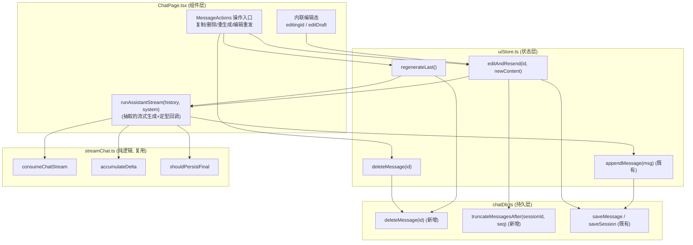
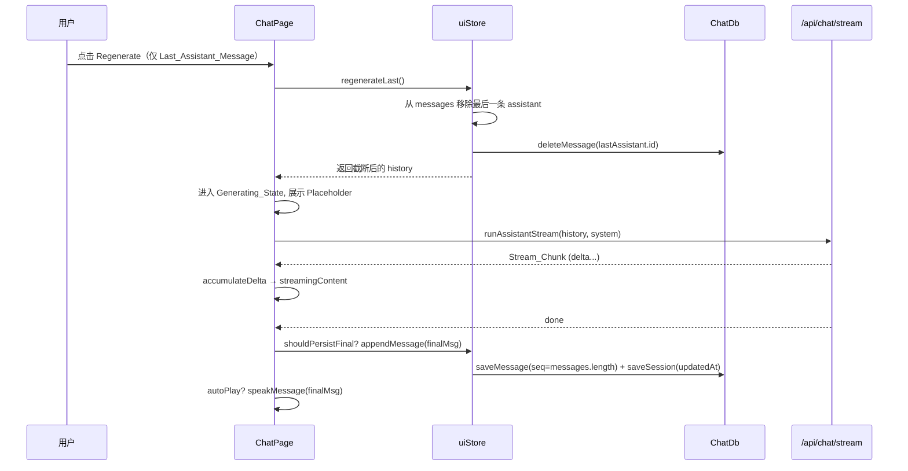
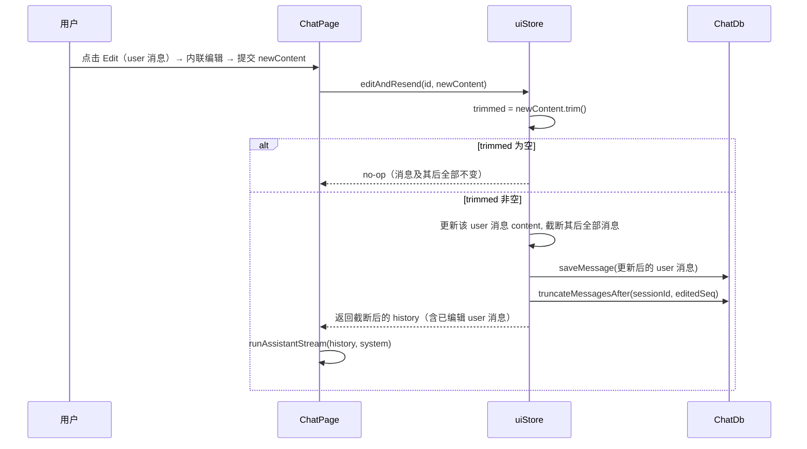

# Design Document

## Overview

「对话消息操作」(chat-message-actions) 是一个**纯前端增量增强**特性，在 Nuwa_Web 的对话页（`ChatPage.tsx`）为单条消息提供四种操作：复制（Copy_Action）、删除（Delete_Action）、重新生成最后一条 assistant 回复（Regenerate_Action）、编辑并重发用户消息（Edit_Resend_Action）。

本设计的核心约束是**复用而非重写**：

- 流式消费链路完全复用 streaming-chat-output 的纯逻辑层 `lib/streamChat.ts`（`consumeChatStream` / `accumulateDelta` / `parseStreamLines` / `shouldPersistFinal`）与既有 `POST /api/chat/stream`、`POST /api/chat` 接口，不新增、不修改任何后端契约。
- 持久化与会话状态复用 chat-session-persistence 的 `uiStore`（`appendMessage`、`ChatSession`、Message_Seq 语义）与 `lib/chatDb.ts` 的 `ChatDb`。
- TTS 自动朗读复用 voice-interaction-loop 在 `ChatPage` 内的 `speakMessage` 与 `settings.autoPlay` 规则。

设计需要解决三个关键问题：

1. **数据层缺口**：`ChatDb` 目前只能按会话删除（`deleteSession`），缺少「按消息 id 删除单条」与「按 Message_Seq 截断」能力。需新增 `deleteMessage` 与 `truncateMessagesAfter` 两个接口，保持现有接口签名不变。
2. **状态层动作**：`uiStore` 需新增 `deleteMessage`、`regenerateLast`、`editAndResend` 三个 action，复用 `appendMessage` 既有的 `seq = messages.length`、自动标题、`updatedAt` 与 Memory_Fallback_Mode 语义。
3. **流式逻辑去重**：`ChatPage` 现有的「以给定 messages 历史发起流式生成并定型」逻辑内嵌在 `handleSend` 中。Regenerate 与 Edit_Resend 需要相同流程（建连 → 流式消费 → Fallback → 定型持久化 → autoPlay 朗读），必须抽取为一个可复用的组件内回调 `runAssistantStream`，避免三处重复。

### 关键设计决策

| 决策 | 选择 | 理由 |
| --- | --- | --- |
| 删除/截断在哪一层落地 | `ChatDb` 提供原子接口，`uiStore` 编排内存+持久化 | 保持「先改内存，后持久化」的既有模式（见 `appendMessage`/`deleteSession`），并复用 by-session 索引游标实现单事务截断 |
| seq 如何重排 | **不重排**已有消息的 seq，截断只删尾部，重新生成的 Final_Message 按 `messages.length` 取新 seq | 截断只移除尾部消息，剩余消息 seq 仍单调递增且与数组下标一致，恢复时排序结果不变 |
| 流式逻辑复用方式 | 抽取组件内 `useCallback` `runAssistantStream(history, system)` | 流式过程依赖组件本地态（`isStreaming`/`streamingContent`/`abortController`），不宜下沉到 store；抽成回调即可被 `handleSend`、`regenerateLast` 包装、`editAndResend` 包装共用 |
| 编辑重发的 trim 语义 | 复用 `chatTitle.ts` 已有的 `.trim()` 约定，空内容则整体 no-op | 与 `renameSession` 的空白拒绝语义一致 |

## Architecture

### 分层结构



### Regenerate_Action 时序



### Edit_Resend_Action 时序



## Components and Interfaces

### 1. 数据层：`lib/chatDb.ts` 接口扩展

在 `ChatDb` 接口新增两个方法，**保持现有 6 个方法签名不变**。两者都在单个 readwrite 事务中完成，复用 `by-session` 索引游标（与现有 `deleteSession` 同一模式）。

```typescript
/** Chat_DB public interface. 新增 deleteMessage / truncateMessagesAfter。 */
export interface ChatDb {
  init(): Promise<void>;
  getAllSessions(): Promise<ChatSession[]>;
  getMessages(sessionId: string): Promise<ChatMessage[]>;
  saveSession(session: ChatSession): Promise<void>;
  saveMessage(message: PersistedMessage): Promise<void>;
  deleteSession(sessionId: string): Promise<void>;

  /** 按消息 id 删除单条 Chat_Message（Req 6.1）。id 不存在时为 no-op。 */
  deleteMessage(messageId: string): Promise<void>;

  /**
   * 删除某会话中 seq 严格大于 `afterSeq` 的全部消息（Req 6.2），支持 Message_Truncation。
   * 单事务、经 by-session 索引游标遍历，仅删除 seq > afterSeq 的记录。
   */
  truncateMessagesAfter(sessionId: string, afterSeq: number): Promise<void>;
}
```

实现（追加到 `createChatDb` 内部并加入返回对象）：

```typescript
async function deleteMessage(messageId: string): Promise<void> {
  const database = requireDb();
  const tx = database.transaction(STORE_MESSAGES, 'readwrite');
  tx.objectStore(STORE_MESSAGES).delete(messageId);
  await txDone(tx);
}

async function truncateMessagesAfter(sessionId: string, afterSeq: number): Promise<void> {
  const database = requireDb();
  // 单 readwrite 事务 + by-session 索引游标：仅删除 seq > afterSeq 的记录，
  // 与 deleteSession 的游标删除模式一致，保证原子性。
  const tx = database.transaction(STORE_MESSAGES, 'readwrite');
  const index = tx.objectStore(STORE_MESSAGES).index(INDEX_BY_SESSION);
  const cursorReq = index.openCursor(IDBKeyRange.only(sessionId));
  cursorReq.onsuccess = () => {
    const cursor = cursorReq.result;
    if (cursor) {
      const row = cursor.value as PersistedMessage;
      if (row.seq > afterSeq) {
        cursor.delete();
      }
      cursor.continue();
    }
  };
  await txDone(tx);
}
```

### 2. 状态层：`store/uiStore.ts` 新增 actions

在 `UIState` 接口的 Chat 区块声明三个新 action，并在 store 实现中加入。三者都遵循既有「先改内存 → 持久化（受 `isPersistent` 守卫）→ 失败 toast」模式。

```typescript
interface UIState {
  // ...既有 Chat 字段...
  /** 删除单条消息（Req 5.1, 6.3）。从 messages 移除并经 Chat_DB 删除其记录。 */
  deleteMessage: (messageId: string) => Promise<void>;
  /**
   * 重新生成最后一条 assistant 回复（Req 2.1, 6.3）。
   * 移除 Last_Assistant_Message 并删除其持久化记录，返回移除后的对话历史
   * （供 ChatPage 发起流式生成）。无 Last_Assistant_Message 时返回 null。
   */
  regenerateLast: () => Promise<{ role: string; content: string }[] | null>;
  /**
   * 编辑并重发某条 user 消息（Req 3.2-3.5, 6.3）。
   * trim 后为空则整体 no-op 并返回 null；否则更新该消息 content、截断其后全部消息，
   * 返回截断后（含已编辑消息）的对话历史。messageId 不指向 user 消息时返回 null。
   */
  editAndResend: (
    messageId: string,
    newContent: string,
  ) => Promise<{ role: string; content: string }[] | null>;
}
```

实现要点（真实 TypeScript）：

```typescript
deleteMessage: async (messageId) => {
  const { messages, isPersistent } = get();
  const exists = messages.some((m) => m.id === messageId);
  if (!exists) return; // 不存在则 no-op，保持 messages 与持久化一致
  // 先改内存：保留其余消息相对顺序（filter 稳定）。
  set((s) => ({ messages: s.messages.filter((m) => m.id !== messageId) }));
  if (isPersistent) {
    try {
      await chatDb.deleteMessage(messageId);
    } catch {
      toastSaveFailed();
    }
  }
  // 注意：Delete_Action 不改 title、不改 updatedAt（Req 6.7）。
},

regenerateLast: async () => {
  const { messages, isPersistent } = get();
  // Last_Assistant_Message：最后一条且 role==='assistant'。
  const last = messages[messages.length - 1];
  if (!last || last.role !== 'assistant') return null;
  const remaining = messages.slice(0, -1);
  set({ messages: remaining });
  if (isPersistent) {
    try {
      await chatDb.deleteMessage(last.id);
    } catch {
      toastSaveFailed();
    }
  }
  return remaining.map((m) => ({ role: m.role, content: m.content }));
},

editAndResend: async (messageId, newContent) => {
  const { messages, currentSessionId, isPersistent } = get();
  const idx = messages.findIndex((m) => m.id === messageId);
  if (idx < 0 || messages[idx].role !== 'user') return null;
  const trimmed = newContent.trim();
  if (trimmed.length === 0) return null; // Req 3.3：空内容整体 no-op

  // seq 语义 = 数组下标（与 appendMessage 的 seq=messages.length 一致）。
  const editedSeq = idx;
  const editedMsg: ChatMessage = { ...messages[idx], content: trimmed };
  // 截断：保留 [0, idx]，移除 idx 之后的全部消息（Req 3.5）。
  const truncated = [...messages.slice(0, idx), editedMsg];
  set({ messages: truncated });

  if (isPersistent && currentSessionId) {
    try {
      const persisted: PersistedMessage = {
        ...editedMsg,
        sessionId: currentSessionId,
        seq: editedSeq,
      };
      await chatDb.saveMessage(persisted); // 更新该 user 消息记录（Req 3.4）
      await chatDb.truncateMessagesAfter(currentSessionId, editedSeq); // Req 3.5
    } catch {
      toastSaveFailed();
    }
  }
  return truncated.map((m) => ({ role: m.role, content: m.content }));
},
```

### 3. 组件层：`components/ChatPage.tsx` 改造

#### 3.1 抽取可复用流式回调 `runAssistantStream`

把 `handleSend` 中「建连 → 流式消费 → Fallback → 定型持久化 → autoPlay」整段逻辑抽成组件内 `useCallback`。`handleSend`、Regenerate、Edit_Resend 三处共用，消除重复。

```typescript
/**
 * 以给定对话历史发起一次流式 assistant 生成并定型。
 * 复用 streamChat 纯逻辑与既有 /api/chat/stream、/api/chat 降级。
 * 调用方负责在调用前已将 history 对应的状态写入 messages（用户消息/截断/移除）。
 */
const runAssistantStream = useCallback(
  async (payloadMessages: { role: string; content: string }[]) => {
    setIsTyping(true);
    setIsStreaming(true);
    setStreamingContent('');
    accRef.current = '';
    const ctrl = new AbortController();
    setAbortController(ctrl);
    const system = currentCharacter?.systemPrompt;
    let streamErrorMsg: string | null = null;

    const onChunk = (chunk: StreamChunk) => {
      if (typeof chunk.delta === 'string') {
        accRef.current = accumulateDelta(accRef.current, chunk);
        setStreamingContent(accRef.current);
      } else if (typeof chunk.error === 'string') {
        streamErrorMsg = chunk.error;
      }
    };

    try {
      let connectFailed = false;
      let body: ReadableStream<Uint8Array> | null = null;
      try {
        const res = await fetch('/api/chat/stream', {
          method: 'POST',
          headers: { 'Content-Type': 'application/json' },
          body: JSON.stringify({ messages: payloadMessages, system }),
          signal: ctrl.signal,
        });
        if (!res.ok || !res.body) connectFailed = true;
        else body = res.body;
      } catch (err: any) {
        connectFailed = !(ctrl.signal.aborted || err?.name === 'AbortError');
      }

      if (body) {
        await consumeChatStream(body, onChunk);
        if (streamErrorMsg) {
          addToast({ message: streamErrorMsg, type: 'error', duration: 5000 });
        }
      } else if (connectFailed && accRef.current === '') {
        // Fallback_Strategy（Req 7.5）：无增量且建连失败 → /api/chat。
        try {
          const { data } = await apiClient.post<{ content: string }>(
            '/api/chat',
            { messages: payloadMessages, system },
            { signal: ctrl.signal, timeout: 120000 },
          );
          accRef.current = data.content ?? '';
        } catch (err: any) {
          if (err?.name === 'AbortError' || err?.code === 'ERR_CANCELED') {
            // 降级被停止：静默退出。
          } else if (err?.response?.data?.error) {
            addToast({ message: err.response.data.error, type: 'error', duration: 5000 });
          } else {
            addToast({ message: '对话请求失败，请检查网络', type: 'error' });
          }
        }
      }
    } finally {
      // 定型：shouldPersistFinal 决定是否落库（Property：定型持久化次数不变式）。
      if (shouldPersistFinal(accRef.current)) {
        const finalMsg: ChatMessage = {
          id: (Date.now() + 1).toString(),
          role: 'assistant',
          content: accRef.current,
          voiceName: currentVoice,
          duration: '0:05',
        };
        await appendMessage(finalMsg);
        if (autoPlay) void speakMessage(finalMsg);
      }
      setIsTyping(false);
      setIsStreaming(false);
      setStreamingContent('');
      accRef.current = '';
      setAbortController(null);
    }
  },
  [currentCharacter, currentVoice, addToast, autoPlay, speakMessage, appendMessage],
);
```

`handleSend` 改为：落用户消息 → 计算 `payloadMessages` → `await runAssistantStream(payloadMessages)`。

Regenerate 处理器：

```typescript
const handleRegenerate = useCallback(async () => {
  if (isTyping) return; // Generating_State 禁用（Req 1.4）
  const history = await regenerateLast();
  if (history === null) return; // 无 Last_Assistant_Message
  await runAssistantStream(history); // Placeholder 由 isStreaming 渲染（Req 2.2）
}, [isTyping, regenerateLast, runAssistantStream]);
```

Edit_Resend 提交处理器：

```typescript
const submitEdit = useCallback(async (messageId: string) => {
  if (isTyping) return;
  const draft = editDraft;
  setEditingId(null);
  setEditDraft('');
  const history = await editAndResend(messageId, draft);
  if (history === null) return; // 取消/空内容/非 user 消息：不发起生成
  await runAssistantStream(history);
}, [isTyping, editDraft, editAndResend, runAssistantStream]);
```

#### 3.2 消息操作入口渲染（Message_Actions）

为 `messages.map` 渲染的**每条已定型消息**渲染操作入口；**不为** `isStreaming` 时的 Streaming_Message / Placeholder_Message 渲染（该气泡是独立分支，本就不在 `messages` 数组内，天然满足 Req 1.5）。可用性矩阵：

| 操作 | user 消息 | assistant 消息 | 仅 Last_Assistant | Generating_State 时 |
| --- | --- | --- | --- | --- |
| Copy | 有 | 有 | — | **仍可用**（Req 1.4 不含 Copy） |
| Delete | 有 | 有 | — | 禁用 |
| Regenerate | 无 | 仅最后一条 | 是 | 禁用 |
| Edit_Resend | 有 | 无 | — | 禁用 |

判定辅助（组件内纯函数，便于属性测试）：

```typescript
// 抽到 lib/messageActions.ts 作为纯函数，供 UI 与属性测试共用。
export interface ActionAvailability {
  canCopy: boolean;
  canDelete: boolean;
  canRegenerate: boolean;
  canEdit: boolean;
}

export function actionAvailabilityFor(
  messages: { id: string; role: 'user' | 'assistant' }[],
  index: number,
  isGenerating: boolean,
): ActionAvailability {
  const msg = messages[index];
  const isLast = index === messages.length - 1;
  const isLastAssistant = isLast && msg.role === 'assistant';
  return {
    canCopy: true, // Copy 不受 Generating_State 限制（Req 1.4）
    canDelete: !isGenerating,
    canRegenerate: !isGenerating && isLastAssistant,
    canEdit: !isGenerating && msg.role === 'user',
  };
}
```

#### 3.3 Copy_Action

```typescript
const handleCopy = useCallback(async (content: string) => {
  try {
    await navigator.clipboard.writeText(content); // Req 4.1
    addToast({ message: '已复制', type: 'success' }); // Req 4.2
  } catch {
    addToast({ message: '复制失败', type: 'error' }); // Req 4.3
  }
}, [addToast]);
```

#### 3.4 新增本地交互态

```typescript
const [editingId, setEditingId] = useState<string | null>(null); // 当前内联编辑的 user 消息 id
const [editDraft, setEditDraft] = useState('');                   // 编辑草稿，预填原 content（Req 3.1）
const deleteMessage = useUIStore((s) => s.deleteMessage);
const regenerateLast = useUIStore((s) => s.regenerateLast);
const editAndResend = useUIStore((s) => s.editAndResend);
```

Stop_Action（`handleStop`）保持不变，已对 `runAssistantStream` 创建的 `abortController` 生效，因此 Regenerate/Edit_Resend 生成中同样可停止（Req 2.6、3.8）。

### 4. 后端契约（Voxcpm_Server）

本特性**不改动**后端。`POST /api/chat`（`{ messages, system }` → `{ content }`）与 `POST /api/chat/stream`（NDJSON `{delta|done|error}`）请求/响应契约保持不变（Req 8.1）。Rust 侧（crate `voxcpm-server`）无需任何代码改动；属性测试不涉及后端，故本特性不引入 proptest 测试。

## Data Models

复用既有模型，**不新增字段**：

```typescript
// store/uiStore.ts（既有）
export interface ChatMessage {
  id: string;
  role: 'user' | 'assistant';
  content: string;
  audioUrl?: string;
  voiceName?: string;
  duration?: string;
}

export interface ChatSession {
  id: string;
  title: string;
  characterId: string;
  voiceId: string;
  updatedAt: string; // ISO 8601
}

// lib/chatDb.ts（既有）
export interface PersistedMessage extends ChatMessage {
  sessionId: string; // 归属会话
  seq: number;       // 单调递增排序键 = 追加时的 messages.length
}
```

**Message_Seq 不变式**：本特性中 `seq` 始终等于消息在 `messages` 数组中的下标。

- `appendMessage` 取 `seq = messages.length`（既有）。
- `deleteMessage` / `regenerateLast` 删除尾部或单条消息后不重排剩余消息的 seq；恢复时 `getMessages` 按 seq 升序排序，结果与内存顺序等价。
- `editAndResend` 截断后剩余消息为 `[0, idx]`，seq 仍为 `0..idx` 连续，更新的 user 消息 seq 保持为 `idx`。

> 设计约束：Delete_Action 删除**中间**消息会在持久层留下 seq 空洞（如删 seq=1，剩 0,2）。这不破坏恢复正确性——`getMessages` 按 seq 升序排序后顺序仍正确；后续 `appendMessage` 以 `messages.length` 取 seq 可能产生与已存在 seq 的碰撞风险，但仅当删除中间消息后再追加时发生。重新生成与编辑重发只操作尾部，无此问题；删除中间消息后通常紧接重新生成（覆盖尾部）或编辑重发（截断尾部），实际碰撞窗口可忽略。属性测试 Property 1 覆盖删除后恢复一致性以验证此约束。

## Correctness Properties

*属性（property）是在系统所有合法执行下都应成立的特征或行为——本质上是关于「系统应当做什么」的形式化陈述。属性在人类可读的规格与机器可验证的正确性保证之间架起桥梁。*

本特性的可测属性集中在数据层（`chatDb`）、状态层（`uiStore` 动作）与定型纯逻辑（`shouldPersistFinal`），均为「我方代码逻辑、行为随输入显著变化、100+ 次迭代能发现边界 bug、可用 fake-indexeddb 低成本运行」的场景，适合属性测试。前端用 **fast-check**（已在 devDependencies），每条属性 ≥100 次迭代，并以 `fake-indexeddb` 注入隔离的 `ChatDb`。后端不涉及，故无 proptest 属性。

经属性反思后保留以下 7 条互不冗余的属性：

### Property 1: 删除单条消息后保序且内存与 Chat_DB round-trip 一致

*For any* 会话与其消息序列、以及任一被删除消息的 id，执行 Delete_Action（`uiStore.deleteMessage`，等价地 `regenerateLast` 删除尾部 assistant）后：内存 `messages` 应移除且仅移除该消息、其余消息相对顺序不变；经 `chatDb.getMessages(sessionId)` 按 seq 升序恢复出的序列应与内存 `messages` 等价；逐条删至空后 `messages` 为空且该 Chat_Session 仍存在于 `getAllSessions`。

**Validates: Requirements 2.1, 5.1, 5.3, 5.4, 6.1, 6.4, 6.5**

### Property 2: 截断移除且仅移除 seq 更大的消息

*For any* 会话、其按 seq 升序的消息序列与任一 `afterSeq` 值，执行 `chatDb.truncateMessagesAfter(sessionId, afterSeq)` 后，该会话剩余的消息恰为原序列中 `seq <= afterSeq` 的全部消息（即移除且仅移除 `seq > afterSeq` 的消息），且不影响其他会话的消息。

**Validates: Requirements 3.5, 6.2**

### Property 3: 编辑重发的 trim 与截断语义及 round-trip 一致

*For any* 会话、其消息序列、任一指向 `role==='user'` 消息的下标与任一新内容字符串，执行 `uiStore.editAndResend(id, newContent)` 后：若 `newContent.trim()` 为空，则 `messages` 与持久化记录完全不变且返回 `null`；否则该 user 消息的 `content` 应等于 `newContent.trim()`、其后全部消息被移除、`messages` 与经 `chatDb.getMessages` 恢复的序列等价。

**Validates: Requirements 3.3, 3.4, 3.5, 6.4, 6.5**

### Property 4: 删除与截断保持会话 title 不变

*For any* 会话及其消息序列，执行 Delete_Action 或 Message_Truncation（含 `editAndResend` 的截断与 `regenerateLast` 的删除）后，该 Chat_Session 的 `title` 与操作前相等。

**Validates: Requirements 6.7**

### Property 5: 定型持久化次数不变式

*For any* 流式生成结束（正常完成或被 Stop_Action 中断）后的累积内容字符串 `content`，当且仅当 `shouldPersistFinal(content)` 为真（即 `content` 非空）时，恰好追加并持久化一次 assistant Final_Message；当 `content` 为空时，追加/持久化次数为 0 且不产生空内容消息。

**Validates: Requirements 2.4, 2.5, 2.7, 3.7**

### Property 6: 降级模式下仅内存变更、不触发持久化写入

*For any* 会话与消息序列，当 Chat_Store 处于 Memory_Fallback_Mode（`isPersistent === false`）时，执行 `deleteMessage`、`regenerateLast` 或 `editAndResend` 应仅更新内存 `messages`，且不调用 `chatDb` 的任何写入方法（`deleteMessage` / `truncateMessagesAfter` / `saveMessage`）。

**Validates: Requirements 8.2**

### Property 7: 消息操作可用性矩阵

*For any* 消息序列、任一下标与任一 `isGenerating` 取值，`actionAvailabilityFor(messages, index, isGenerating)` 满足：`canCopy` 恒为真；`canDelete` 等于 `!isGenerating`；`canRegenerate` 等于 `(index === messages.length - 1 && role === 'assistant' && !isGenerating)`；`canEdit` 等于 `(role === 'user' && !isGenerating)`。

**Validates: Requirements 1.1, 1.2, 1.3, 1.4**

## Error Handling

| 场景 | 处理 | 对应需求 |
| --- | --- | --- |
| Chat_DB 写入（delete/truncate/save）reject | 内存变更已完成，捕获后调 `toastSaveFailed()`（"保存失败"），不回滚内存（与既有 `appendMessage`/`deleteSession` 一致） | 6.x |
| Memory_Fallback_Mode（`isPersistent=false`） | 三动作跳过所有 `chatDb` 写入，仅改内存 | 8.2 |
| `regenerateLast` 无 Last_Assistant_Message | 返回 `null`，`handleRegenerate` 直接返回，不进入生成态 | 2.1 |
| `editAndResend` 目标非 user 消息或 trim 后为空 | 返回 `null`，不截断、不发起生成 | 3.2, 3.3 |
| 流式建连失败且无增量 | Fallback_Strategy 改调 `POST /api/chat` | 7.5 |
| Stream_Chunk 携带 error | `addToast` 展示后端错误文案并退出 Generating_State | 7.6 |
| `navigator.clipboard.writeText` reject | 捕获后展示"复制失败"提示 | 4.3 |
| Stop_Action 中断 | `consumeChatStream` 吞 AbortError；已接收增量在 finalize 中按 `shouldPersistFinal` 定型 | 2.7 |

## Testing Strategy

### 双重测试策略

**属性测试（fast-check，≥100 次迭代）** — 覆盖 Property 1–7，验证数据层与状态层的普遍正确性：

- `lib/chatDb.test.ts`：扩展 `truncateMessagesAfter`（Property 2）与 `deleteMessage`（Property 1 的 DB 层）的属性测试，复用既有 `freshDb()` + `IDBFactory` 注入模式。
- `store/uiStore.messageActions.test.ts`（新建）：Property 1、3、4、6 —— 以 `setChatDbForTesting` 注入 fake-indexeddb 包装的 `ChatDb`，生成随机会话+消息，执行动作后断言内存与 round-trip 一致；Property 6 注入会记录调用的 stub 并设 `isPersistent=false` 断言无写入。
- `lib/streamChat.test.ts`：已含 `shouldPersistFinal` 测试，补充 Property 5 的次数不变式（非空恰一次、空为零次）。
- `lib/messageActions.test.ts`（新建）：Property 7 —— 随机 `messages`/`index`/`isGenerating`，断言可用性矩阵。

每个属性测试以注释标注来源，格式：
`// Feature: chat-message-actions, Property N: <property text>`

**单元/示例测试（vitest + Testing Library）** — 覆盖 prework 中分类为 EXAMPLE / EDGE_CASE 的标准：

- `components/ChatPage.test.tsx`：扩展断言
  - Req 1.5：`isStreaming` 时流式气泡内无操作入口。
  - Req 2.2/2.3/2.6、3.1/3.2/3.6/3.8：Regenerate/Edit 交互、payload 内容、Placeholder、Stop 存在性（mock fetch）。
  - Req 4.1–4.3：Copy 成功/失败 toast（mock `navigator.clipboard`）。
  - Req 5.2：删除后消息不再渲染。
  - Req 6.3：三个 store action 为 function。
  - Req 6.6：定型后 `updatedAt` 变更并持久化。
  - Req 7.2/7.3/7.4/7.5/7.6：autoPlay 开关、流式期间不朗读、降级、error chunk（mock `speakMessage`/fetch）。

**无回归（SMOKE）** — Req 7.1、8.1、8.3–8.6：运行既有完整测试套件（`npm run test`，即 `vitest --run`）确认发送、流式渲染、停止、会话生命周期、语音、角色/模型功能不回归；后端契约保持不变（无后端改动）。

### 测试库与配置

- 前端属性测试：**fast-check ^3.23.2**（已安装），不自行实现属性测试框架。
- IndexedDB 仿真：**fake-indexeddb ^6.0.0**（已安装），每用例注入新 `IDBFactory` 保证隔离。
- 运行器：**vitest ^3.2.6**，统一以 `vitest --run` 单次执行（不使用 watch 模式）。
