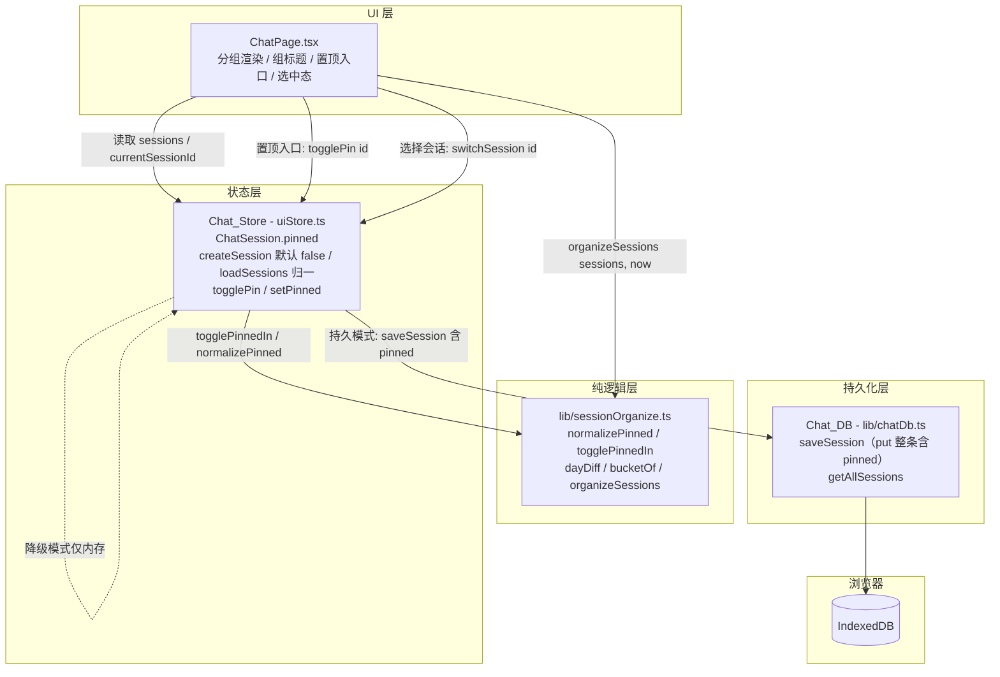
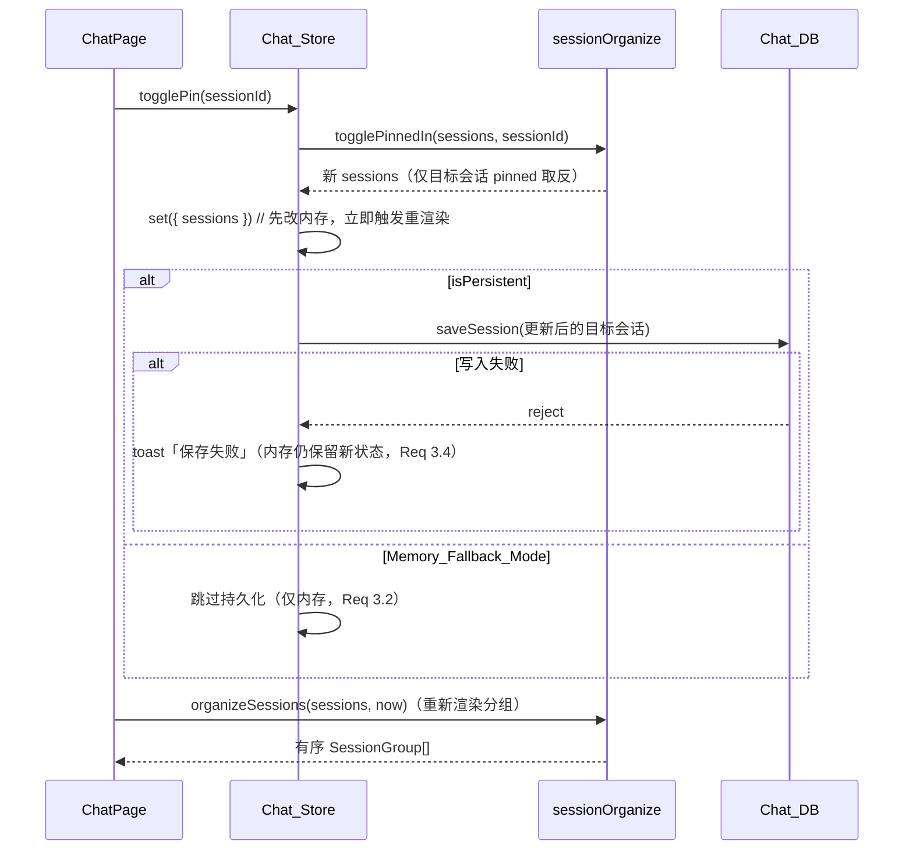
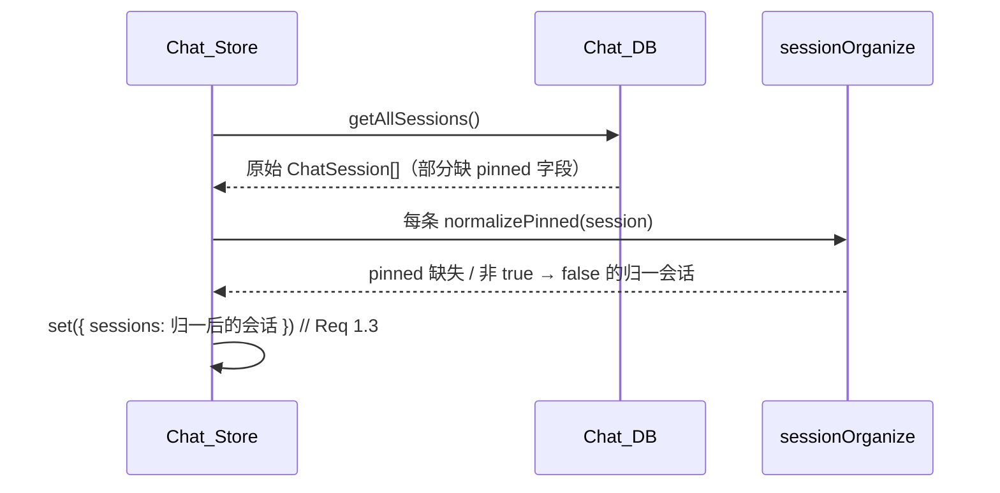
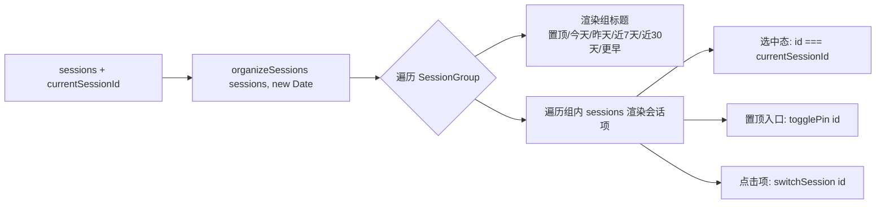

# Design Document

## Overview

「会话组织：置顶与按时间分组」(chat-session-organization) 在已交付的「会话历史持久化」(chat-session-persistence) 与「聊天记录全局搜索」(chat-history-search) 之上，为女娲对话页（Chat_Page）的会话侧边栏新增一个**纯前端**的组织能力。当前侧边栏把会话平铺成一个按 `updatedAt` 排序的列表；本特性让用户能把任意会话置顶（Pin），并把会话先按是否置顶分为「置顶」组与普通组，普通组再按相对时间分桶（今天 / 昨天 / 近 7 天 / 近 30 天 / 更早），从而更快定位与管理历史会话。

本特性复用既有基础设施，不引入新的后端调用，也不修改 `POST /api/chat` 等契约：

- **纯逻辑层** `lib/sessionOrganize.ts`（新增）：置顶判定与缺省归一（`normalizePinned`）、置顶切换（`togglePinnedIn`）、相对天数差计算（`dayDiff`）、时间分桶（`bucketOf`）以及分组 + 排序主函数（`organizeSessions`），全部为无副作用纯函数，不依赖 DOM / Chat_Store / IndexedDB，便于以 fast-check 做属性测试。
- **状态层** Chat_Store（`store/uiStore.ts` 扩展）：在 `ChatSession` 上新增 `pinned: boolean` 字段，`createSession` 初始化为 `false`，`loadSessions` 对读出的旧数据做缺省归一；新增 `togglePin` / `setPinned` action，复用既有"先改内存、后持久化、失败 toast、降级仅存内存"的写入范式。
- **UI 层** Chat_Page（`components/ChatPage.tsx` 扩展）：把侧边栏会话列表从平铺 `sessions.map(...)` 改为按 `organizeSessions(sessions, now)` 输出的分组结构渲染，为每个非空分组渲染组标题，为每个会话项提供置顶 / 取消置顶入口，切换后立即基于新输出重渲染。

置顶状态作为 `ChatSession` 上的 `pinned` 字段持久化到 Chat_DB（IndexedDB）。Chat_DB 的对象存储以 `keyPath: 'id'` 的 `put` 写入整条会话，**无需 schema 迁移或 `DB_VERSION` 升级**：新增字段随 `saveSession` 自然落库，旧记录缺失该字段时由状态层在读取后归一为 `false`（Req 1.3）。在 Memory_Fallback_Mode（`isPersistent=false`）下置顶仅保存在内存中（Req 3.2）。本特性保证既有会话生命周期（新建 / 切换 / 删除 / 重命名）、全局搜索、语音输入（ASR）与 TTS 朗读、流式输出等能力不回归（Req 8）。

### 设计目标与非目标

- **目标**：`pinned` 字段与默认值、旧数据缺省归一；置顶 / 取消置顶操作与持久化、降级、失败提示；与界面和存储解耦的分组 + 排序纯函数；相对时间分桶与边界；组内 `updatedAt` 降序、置顶组居前、固定组序、省略空组、相等时间稳定次序；侧边栏分组渲染与置顶交互；无回归。
- **非目标**：自定义分组 / 拖拽排序、置顶数量上限、跨设备同步、会话归档、按角色 / 标签分组、后端排序。这些不在本特性范围内。

### 关键设计决策

| 决策 | 选择 | 理由 |
| --- | --- | --- |
| 分组排序核心位置 | 抽出纯函数模块 `lib/sessionOrganize.ts`，与 store / DOM / IndexedDB 解耦 | 可独立用 fast-check 做属性测试，覆盖划分唯一性、分桶边界、排序、只读、确定性 |
| 置顶持久化方式 | 在 `ChatSession` 增 `pinned` 字段，随既有 `saveSession`（`put` 整条）落库 | Chat_DB 以 `id` 为 keyPath、整条 `put`，新增字段无需 `DB_VERSION` 升级或迁移脚本 |
| 旧数据缺省 | 读取后经 `normalizePinned` 把缺失 / 非 true 的 `pinned` 归一为 `false` | 兼容历史会话（Req 1.3、1.4），把"缺省即未置顶"约束集中在一处纯函数 |
| 置顶切换的纯化 | 切换列表中某会话 `pinned` 的逻辑抽为纯函数 `togglePinnedIn(sessions, id)` | 让"仅改目标会话、仅改 `pinned`、其余字段与会话不变"成为可属性化的不变式（Req 2.3、2.4），store 仅做编排与持久化 |
| Day_Diff 定义 | 以**本地时区日历日零点之差**计算整日数，复用既有 `formatRelativeTime` 同款 `startOfDay` 思路 | 与既有相对时间显示口径一致；分桶只关心"差几个日历日"，不受具体时刻影响 |
| 未来时间归类 | `updatedAt` 晚于 Current_Time（Day_Diff < 0）归入 Today_Bucket | 时钟漂移 / 跨设备导入可能产生未来时间戳，归入「今天」最符合直觉（Req 5.6） |
| 排序与分桶分离 | 先按输入顺序分区到各组，再对每组按 `updatedAt` 降序**稳定**排序 | 分区保留输入相对次序，稳定排序使相等 `updatedAt` 维持输入次序（Req 6.5），结果可复现（Req 4.6） |
| 省略空组 | `organizeSessions` 输出中不包含任何会话为空的分组 | UI 直接遍历输出即可，无需在渲染层判空（Req 6.4、7.2） |
| Current_Time 注入 | 由调用方（Chat_Page）传入 `new Date()`，纯函数不读取系统时钟 | 保证 `organizeSessions` 纯净、可确定性测试（Req 4.6） |

## Architecture

### 分层结构



### 置顶切换的数据流



### 加载与缺省归一时序



### 侧边栏分组渲染流



## Components and Interfaces

### 1. Session_Organize 纯逻辑模块（`app/web/src/lib/sessionOrganize.ts`，新增）

封装全部分组 + 排序核心逻辑，无副作用、不依赖 DOM / store / IndexedDB。

```typescript
import type { ChatSession } from '@/store/uiStore';

/** Session_Group 的类别：Pinned_Group 与五个 Time_Bucket。 */
export type GroupKind =
  | 'pinned'
  | 'today'
  | 'yesterday'
  | 'last7'
  | 'last30'
  | 'earlier';

/** Group_Order：Session_Group 在输出中的固定排列顺序（置顶组居首）。 */
export const GROUP_ORDER: GroupKind[] = [
  'pinned',
  'today',
  'yesterday',
  'last7',
  'last30',
  'earlier',
];

/** 各分组在侧边栏展示的组标题（Req 7.2）。 */
export const GROUP_TITLES: Record<GroupKind, string> = {
  pinned: '置顶',
  today: '今天',
  yesterday: '昨天',
  last7: '近 7 天',
  last30: '近 30 天',
  earlier: '更早',
};

/** Session_Organize 输出的一个分组：类别、组标题与该组内已排序的会话。 */
export interface SessionGroup {
  kind: GroupKind;
  title: string;
  sessions: ChatSession[];
}

/**
 * 置顶判定（Req 1.4）：仅当 `pinned` 严格等于 true 视为置顶；
 * 缺失字段或任何非 true 取值（含 undefined / false）一律视为未置顶。
 */
export function isPinned(session: ChatSession): boolean;

/**
 * 缺省归一（Req 1.3）：返回一个 `pinned` 字段被规整为布尔值的新会话——
 * 原 `pinned===true` 时为 true，否则为 false；其余字段原样保留。
 * 纯函数，不修改入参。对已含布尔 `pinned` 的会话为幂等。
 */
export function normalizePinned(session: ChatSession): ChatSession;

/**
 * 置顶切换（Req 2.1–2.4）：返回一个新数组，其中 id 匹配的会话其 `pinned`
 * 取反（以 isPinned 判定后取反），其余会话原样保留（同引用）。
 * 不修改入参数组及任一会话；未命中 id 时返回内容等价的新数组（无变化）。
 */
export function togglePinnedIn(sessions: ChatSession[], id: string): ChatSession[];

/**
 * 显式设置某会话置顶状态（供 setPinned action 使用）：返回新数组，id 匹配的
 * 会话 `pinned` 置为给定布尔值，其余会话原样保留。不修改入参。
 */
export function setPinnedIn(
  sessions: ChatSession[],
  id: string,
  pinned: boolean,
): ChatSession[];

/**
 * Day_Diff（Req: Glossary）：Current_Time 所在本地日历日零点与 `updatedAt`
 * 所在本地日历日零点之间相差的整日数。
 * 返回正数表示会话日早于今天，0 表示同一日历日，负数表示会话日晚于今天（未来）。
 * `updatedAt` 不可解析时按 Earlier 处理（返回 Number.POSITIVE_INFINITY 的语义，
 * 见实现说明），不抛出。
 */
export function dayDiff(updatedAt: string, currentTime: Date): number;

/**
 * 时间分桶（Req 5.1–5.6）：把 Day_Diff 映射到一个 Time_Bucket 的 GroupKind。
 * - d <= 0        → 'today'（含未来时间，Req 5.6）
 * - d === 1       → 'yesterday'
 * - 2 <= d <= 6   → 'last7'
 * - 7 <= d <= 29  → 'last30'
 * - d >= 30       → 'earlier'
 */
export function bucketOf(d: number): Exclude<GroupKind, 'pinned'>;

/**
 * 分组 + 排序主函数（Req 4.1–4.6, 5.*, 6.*）。
 * 输入会话数组与 Current_Time，输出按 Group_Order 排列、省略空组的 SessionGroup[]：
 * - 置顶会话（isPinned）归入 Pinned_Group；
 * - 未置顶会话按 dayDiff/bucketOf 归入恰好一个 Time_Bucket；
 * - 每组内按 `updatedAt` 降序稳定排序（相等 `updatedAt` 保持输入相对次序，Req 6.5）；
 * - 不修改输入数组及任一会话（Req 4.5）；
 * - 相同输入 + 相同 Current_Time 多次调用结果一致（Req 4.6）。
 */
export function organizeSessions(
  sessions: ChatSession[],
  currentTime: Date,
): SessionGroup[];
```

**Day_Diff 实现说明**（与既有 `formatRelativeTime` 同款 `startOfDay`）：

```
startOfDay(d) = new Date(d.getFullYear(), d.getMonth(), d.getDate()).getTime()  // 本地零点
dayDiff(updatedAt, now):
  t = new Date(updatedAt).getTime()
  若 Number.isNaN(t): 返回 +Infinity        // 不可解析 → 归入 Earlier，不抛出
  返回 round( (startOfDay(now) - startOfDay(new Date(t))) / 86_400_000 )
```

使用 `Math.round` 抵消夏令时切换日 23h/25h 造成的非整日毫秒差，使日历日之差稳定为整数。

**organizeSessions 算法**（先分区后稳定排序，保证只读与确定性）：

```
1. buckets: Map<GroupKind, ChatSession[]>，六个键各初始化为 []
2. 按输入顺序遍历 sessions：
     若 isPinned(s)        → push 到 'pinned'
     否则                  → push 到 bucketOf(dayDiff(s.updatedAt, currentTime))
   （遍历保留输入相对次序，为稳定排序提供基准）
3. 对每个非空桶，做稳定排序：compare(a,b) = (a.updatedAt < b.updatedAt ? 1 : a.updatedAt > b.updatedAt ? -1 : 0)
   —— ISO 字符串比较即时间序，相等返回 0；JS Array.prototype.sort 稳定，故相等 updatedAt 维持分区（输入）次序
4. 按 GROUP_ORDER 依次取出非空桶，构造 { kind, title: GROUP_TITLES[kind], sessions } 推入输出
5. 返回输出（省略空组）
```

> 第 2 步对每条会话调用一次 `bucketOf`，每条非置顶会话恰好进入一个桶；置顶会话只进 `'pinned'` 桶——共同保证"每个会话在输出中恰好出现一次"（Req 4.4）。分区在新数组上进行、排序作用于这些新数组，绝不触碰输入会话对象，满足只读（Req 4.5）。

### 2. Chat_Store 扩展（`app/web/src/store/uiStore.ts`）

**`ChatSession` 类型新增字段**：

```typescript
export interface ChatSession {
  id: string;
  title: string;
  characterId: string;
  voiceId: string;
  /** ISO 8601 timestamp (sortable). */
  updatedAt: string;
  /** Pinned_Flag：是否置顶。新建默认 false；旧数据缺失时读取后归一为 false。 */
  pinned: boolean;
}
```

**`UIState` 的 Chat 区新增 action**：

```typescript
interface UIState {
  // ... 既有字段与 action
  /** 切换某会话置顶状态（Req 2.1, 2.2）：内存取反 + 持久化更新后的该会话。 */
  togglePin: (sessionId: string) => Promise<void>;
  /** 显式设置某会话置顶状态：内存置位 + 持久化。 */
  setPinned: (sessionId: string, pinned: boolean) => Promise<void>;
}
```

**实现要点**（复用既有 `toastSaveFailed` 与"先改内存、后持久化"范式）：

```typescript
createSession: async (characterId) => {
  const voiceId = get().characters.find((c) => c.id === characterId)?.voiceId || 'jyy';
  const newSession: ChatSession = {
    id: Date.now().toString() + Math.random().toString(36).slice(2, 6),
    title: DEFAULT_TITLE,
    characterId,
    voiceId,
    updatedAt: new Date().toISOString(),
    pinned: false,            // Req 1.2：新建默认未置顶
  };
  // ...（既有逻辑不变）
},

loadSessions: async () => {
  // ...既有：init / getAllSessions
  // 读取后对每条做缺省归一（Req 1.3）：
  const normalized = stored.map(normalizePinned);
  // 后续 pickLatestSession / set 使用 normalized
},

togglePin: async (sessionId) => {
  const { sessions, isPersistent } = get();
  const next = togglePinnedIn(sessions, sessionId);   // 纯函数，仅改目标会话 pinned（Req 2.3, 2.4）
  set({ sessions: next });                            // 先改内存，立即重渲染
  const updated = next.find((s) => s.id === sessionId);
  if (updated && isPersistent) {                      // 降级模式仅内存（Req 3.2）
    try {
      await chatDb.saveSession(updated);              // 持久化含 pinned（Req 3.1）
    } catch {
      toastSaveFailed();                              // 失败保留内存并提示（Req 3.4）
    }
  }
},

setPinned: async (sessionId, pinned) => {
  const { sessions, isPersistent } = get();
  const next = setPinnedIn(sessions, sessionId, pinned);
  set({ sessions: next });
  const updated = next.find((s) => s.id === sessionId);
  if (updated && isPersistent) {
    try { await chatDb.saveSession(updated); } catch { toastSaveFailed(); }
  }
},
```

> `togglePin` / `setPinned` 不改 `updatedAt` / `title` / `characterId` / `voiceId`（由 `togglePinnedIn` / `setPinnedIn` 保证，Req 2.3），也不改其他会话（Req 2.4）。持久模式下重启后 `loadSessions` 经 `getAllSessions` 读回含 `pinned` 的记录并归一，恢复置顶状态（Req 3.3）。其他写入会话的 action（`renameSession` / `appendMessage` / `deleteSession`）保持原逻辑，仅在它们构造 / 透传的会话对象上自然携带 `pinned` 字段（类型新增字段后由内存中既有值带入），不丢失置顶状态。

### 3. Chat_Page 扩展（`app/web/src/components/ChatPage.tsx`）

把侧边栏「Session List」分支（`showSearch` 为假、非加载态时的 `sessions.map(...)`）改为按分组结构渲染。搜索视图（`showSearch`）与加载态分支保持不变（无回归，Req 8.2）。

**新增订阅**：

```typescript
const togglePin = useUIStore((s) => s.togglePin);
```

**派生分组**（每次渲染以当前时间计算；`now` 在渲染期取一次以稳定本次输出）：

```typescript
// organizeSessions 为纯函数；以渲染时刻的 now 计算分组（Req 7.1）。
const now = new Date();
const sessionGroups = organizeSessions(sessions, now);
```

**分组渲染**（取代原 `sessions.map`）：

```tsx
sessionGroups.map((group) => (
  <div key={group.kind} data-testid={`session-group-${group.kind}`}>
    {/* 组标题（Req 7.2）：仅非空组进入输出，无需在此判空。 */}
    <div className="px-3 pt-3 pb-1 text-[11px] font-medium" style={{ color: 'var(--text-muted)' }}>
      {group.title}
    </div>
    {group.sessions.map((s) => {
      const selected = s.id === currentSessionId;   // Req 7.5：选中态
      // ...（沿用既有会话项结构：图标、标题、相对时间、双击重命名、删除二次确认）
      // 新增置顶 / 取消置顶入口（Req 7.3）：
      // <button aria-label={isPinned(s) ? '取消置顶' : '置顶'}
      //   onClick={(e) => { e.stopPropagation(); void togglePin(s.id); }}>
      //   <Pin size={14} /> 或 <PinOff size={14} />
      // </button>
      // 点击会话项: onClick={() => switchSession(s.id)}（Req 7.6，复用既有）
    })}
  </div>
))
```

- **置顶入口**（Req 7.3）：在每个会话项的操作区（与既有删除按钮并列）新增一个置顶 / 取消置顶按钮，图标用 lucide 的 `Pin` / `PinOff`，`aria-label` 随 `isPinned(s)` 在「置顶」/「取消置顶」间切换；`onClick` 调 `togglePin(s.id)` 并 `stopPropagation` 避免触发会话切换。
- **切换后重渲染**（Req 7.4）：`togglePin` 更新 store 的 `sessions`，组件重渲染时重新调用 `organizeSessions`，会话自动在置顶组与时间桶之间迁移。
- **选中态**（Req 7.5）：会话项以 `s.id === currentSessionId` 决定高亮样式，与既有逻辑一致；会话出现在哪个分组都正确标记。
- **切换会话**（Req 7.6）：点击会话项仍调既有 `switchSession(s.id)`，本特性不新增导航逻辑。
- 既有的内联重命名（`renamingId` / `renameDraft`）、删除二次确认（`confirmDeleteId`）等本地态与交互完全保留，仅渲染容器从平铺改为按组嵌套（Req 8.1）。

### 4. 依赖与图标

- 无新增生产依赖。置顶图标复用已安装的 `lucide-react`（`Pin` / `PinOff`）。
- 测试沿用既有 **fast-check**（纯逻辑属性测试）与 **fake-indexeddb**（置顶持久化 / 归一 / 降级集成测试），均已在 devDependencies 中。

## Data Models

### ChatSession（扩展既有类型）

```typescript
interface ChatSession {
  id: string;
  title: string;
  characterId: string;
  voiceId: string;
  updatedAt: string;   // ISO 8601，可排序
  pinned: boolean;     // 本特性新增：Pinned_Flag
}
```

- **运行时不变式**：经 `createSession` 创建或经 `loadSessions` 归一后，内存中的每个 `ChatSession.pinned` 均为布尔值。
- **持久化形态**：Chat_DB `sessions` 对象存储以 `keyPath: 'id'` 存整条会话；`saveSession` 为幂等 `put`，新增 `pinned` 字段随写入落库，旧记录可能缺该字段。
- **读取归一**：`getAllSessions` 读回的记录经 `normalizePinned` 把缺失 / 非 true 的 `pinned` 规整为 `false`（Req 1.3），故状态层之后的所有消费方都只见布尔 `pinned`。

### Session_Organize 输出模型

```typescript
type GroupKind = 'pinned' | 'today' | 'yesterday' | 'last7' | 'last30' | 'earlier';

interface SessionGroup {
  kind: GroupKind;       // 分组类别
  title: string;         // 组标题：置顶 / 今天 / 昨天 / 近 7 天 / 近 30 天 / 更早
  sessions: ChatSession[]; // 组内会话，按 updatedAt 降序、相等时稳定
}

// organizeSessions 输出：SessionGroup[]，按 GROUP_ORDER 排列，省略空组
```

### Day_Diff 与分桶映射

| Day_Diff `d` | Time_Bucket（GroupKind） | 侧边栏组标题 | 关联需求 |
| --- | --- | --- | --- |
| `d <= 0`（含未来） | `today` | 今天 | 5.1, 5.6 |
| `d === 1` | `yesterday` | 昨天 | 5.2 |
| `2 <= d <= 6` | `last7` | 近 7 天 | 5.3 |
| `7 <= d <= 29` | `last30` | 近 30 天 | 5.4 |
| `d >= 30` | `earlier` | 更早 | 5.5 |

> `Day_Diff` 基于**本地时区日历日零点之差**，与既有 `formatRelativeTime` 判定「昨天」的口径一致。置顶会话不参与时间分桶——无论其 `updatedAt` 落在哪个区间，只要 `isPinned` 为真即归入 Pinned_Group（Req 4.2）。

### 分组与排序的全序定义

1. **组间顺序**：严格按 `GROUP_ORDER`（置顶、今天、昨天、近 7 天、近 30 天、更早）；输出省略空组（Req 6.2, 6.3, 6.4）。
2. **组内主序**：`updatedAt` 降序（ISO 字符串比较即时间序，最新在前，Req 6.1）。
3. **组内次序（相等 `updatedAt`）**：依赖 JS `Array.prototype.sort` 的稳定性，保留它们在输入数组中的相对次序，保证结果可复现（Req 6.5, 4.6）。

> 复用既有类型与展示助手：`ChatSession` 从 `@/store/uiStore` 引入；会话项的相对时间仍沿用既有 `formatRelativeTime`（`@/lib/chatSession`），本特性不重复定义时间展示逻辑。

## Correctness Properties

*属性（property）是在系统所有有效执行中都应成立的特征或行为——是对"软件应当做什么"的形式化陈述。属性是人类可读规格与机器可验证正确性保证之间的桥梁。*

本特性的组织核心是一组纯函数（`normalizePinned` / `togglePinnedIn` / `setPinnedIn` / `dayDiff` / `bucketOf` / `organizeSessions`），输入空间大（任意会话数组、任意时间戳、任意 `pinned` 取值）且存在清晰的普适不变式（缺省归一、切换局部性、划分唯一性、分桶边界、排序与稳定、组序、只读、确定性），非常适合属性测试（PBT）。下列属性覆盖这些可属性化部分；置顶持久化 / 降级 / 恢复（Req 3.*）属外部 IO 接线，以 fake-indexeddb 集成测试覆盖；侧边栏分组渲染与置顶交互（Req 7.*）以组件测试覆盖；无回归约束（Req 8.*）由既有套件与构建验证覆盖。所有属性已经过 prework 反思去重（划分相关合并、置顶切换合并、分桶边界合并、组内排序合并、组间顺序与无空组合并）。

### Property 1: 缺省归一

*For any* 会话对象（其 `pinned` 字段可为 `true`、`false` 或缺失 / `undefined`）：`normalizePinned(session)` 返回的会话其 `pinned` 必为布尔值——当原 `pinned===true` 时为 `true`，否则为 `false`；除 `pinned` 外的全部字段保持不变；且对已含布尔 `pinned` 的会话 `normalizePinned` 为幂等（再次应用结果相同）。

**Validates: Requirements 1.3**

### Property 2: 置顶切换局部性

*For any* 会话数组 `sessions` 与任一 `id`：`togglePinnedIn(sessions, id)` 返回的新数组中，`id` 匹配的会话其 `pinned` 相对原值取反、而 `updatedAt` / `title` / `characterId` / `voiceId` 与原会话相等；全部非匹配会话与原数组对应元素深相等；且 `togglePinnedIn` 不修改输入数组及其中任何会话。`setPinnedIn(sessions, id, p)` 同理，仅把匹配会话的 `pinned` 置为 `p`、其余不变。

**Validates: Requirements 2.1, 2.2, 2.3, 2.4**

### Property 3: 划分唯一性与归属

*For any* 会话数组 `sessions` 与任一 `Current_Time`：`organizeSessions(sessions, currentTime)` 的全部输出组内会话（按 `id`）构成的多重集合恰好等于输入会话的多重集合（覆盖且每个会话恰好出现一次）；其中 Pinned_Group 恰好包含全部 `isPinned` 为真（`pinned===true`）的会话，且每个未置顶会话恰好出现在某一个 Time_Bucket 中、不出现在 Pinned_Group 中。

**Validates: Requirements 1.4, 4.2, 4.3, 4.4**

### Property 4: 分桶边界

*For any* 整数 `d`：`bucketOf(d)` 满足——`d <= 0` 时为 `'today'`、`d === 1` 时为 `'yesterday'`、`2 <= d <= 6` 时为 `'last7'`、`7 <= d <= 29` 时为 `'last30'`、`d >= 30` 时为 `'earlier'`。并且 *for any* 未置顶会话与 `Current_Time`，该会话在 `organizeSessions` 输出中所属的 Time_Bucket 等于 `bucketOf(dayDiff(session.updatedAt, currentTime))`（含 `updatedAt` 晚于 `Current_Time` 即 `d < 0` 时归入 `'today'`）。

**Validates: Requirements 5.1, 5.2, 5.3, 5.4, 5.5, 5.6**

### Property 5: 组内降序与稳定

*For any* 会话数组与 `Current_Time`：`organizeSessions` 输出中每个 Session_Group 内的会话按 `updatedAt` 非递增（由新到旧）排列；且对组内 `updatedAt` 相等的任意若干会话，它们之间的相对次序与其在输入数组中的相对次序一致（稳定）。

**Validates: Requirements 6.1, 6.5**

### Property 6: 组间顺序与无空组

*For any* 会话数组与 `Current_Time`：`organizeSessions` 输出中各 Session_Group 的 `kind` 序列是 `GROUP_ORDER`（`pinned`、`today`、`yesterday`、`last7`、`last30`、`earlier`）的子序列（即保持该固定顺序，Pinned_Group 居于全部 Time_Bucket 之前）；并且输出中每个 Session_Group 的 `sessions` 均非空（省略所有空组）。

**Validates: Requirements 6.2, 6.3, 6.4**

### Property 7: 只读

*For any* 会话数组 `sessions` 与任意 `Current_Time`：调用 `organizeSessions(sessions, currentTime)` 前后，`sessions` 数组及其中每个会话在结构与字段上保持不变（深相等），组织计算不修改任何输入数据。

**Validates: Requirements 4.5**

### Property 8: 确定性

*For any* 会话数组 `sessions` 与任意 `Current_Time`：以相同的 `sessions` 与相同的 `currentTime` 两次调用 `organizeSessions`，两次输出在结构与顺序上深相等（分组数量、各组 `kind`、各组内会话顺序均一致）。

**Validates: Requirements 4.6**

## Error Handling

| 场景 | 触发条件 | 处理 | 关联需求 |
| --- | --- | --- | --- |
| 旧数据缺失 `pinned` | `getAllSessions` 读回的记录无 `pinned` 字段 | `loadSessions` 经 `normalizePinned` 归一为 `false`，不抛出 | 1.3 |
| `updatedAt` 不可解析 | 会话 `updatedAt` 非合法 ISO（`Date` 解析为 NaN） | `dayDiff` 返回 `+Infinity`，`bucketOf` 归入 `'earlier'`，不抛出、不破坏划分 | 5.5 |
| 未来时间戳 | `updatedAt` 晚于 `Current_Time`（时钟漂移 / 导入数据） | `dayDiff < 0`，`bucketOf` 归入 `'today'` | 5.6 |
| 持久模式写入失败 | `togglePin` / `setPinned` 调 `saveSession` reject | 保留内存中已更新的 `pinned`，调 `toastSaveFailed()` 提示「保存失败」 | 3.4 |
| Memory_Fallback_Mode | `isPersistent === false` | `togglePin` / `setPinned` 仅更新内存、跳过 `saveSession` | 3.2 |
| 切换不存在的 id | `togglePin` / `setPinned` 传入未命中的 `sessionId` | `togglePinnedIn` / `setPinnedIn` 返回内容等价的新数组（无可持久化目标），`updated` 为 undefined 时跳过持久化，不抛出 | 2.4 |
| 空会话数组 | `sessions` 为 `[]` | `organizeSessions` 返回 `[]`（无任何分组），侧边栏渲染既有空 / 加载态 | 4.1, 6.4 |

> 组织计算全程只读：纯函数不写入任何输入；store 的置顶写入沿用既有"先改内存、后持久化、失败 toast"范式，写入失败不回滚内存（Req 3.4）、不向 UI 抛出异常。

## Testing Strategy

### 框架与工具

- 测试运行器：**Vitest 3**（`npm test` 即 `vitest --run`），环境 jsdom。
- 属性测试库：**fast-check 3**（已装，**不自行实现** PBT）。
- 组件测试：**@testing-library/react** + 既有 `src/test/setup.ts`。
- IndexedDB 测试：既有 **fake-indexeddb**，经 `setChatDbForTesting` 注入，验证置顶持久化、加载归一与降级 / 失败分支。

### 双重测试策略

- **属性测试（PBT）**：覆盖 `sessionOrganize.ts` 纯逻辑与不变式（Property 1–8）。
  - 每个属性以**单个** property-based 测试实现，**最少 100 次迭代**（`fc.assert(fc.property(...), { numRuns: 100 })`）。
  - 每个属性测试以注释标注其设计属性，格式：`// Feature: chat-session-organization, Property {number}: {property_text}`。
  - 生成器要点：
    - 会话生成器：随机 `id`（保证数组内唯一）、`title`、`characterId`、`voiceId`，`updatedAt` 由"基准时间 ± 随机天数 / 毫秒"生成以覆盖各时间桶与相等时间戳，`pinned` 取 `true` / `false` / 省略（`undefined`）三种以覆盖归一与划分。
    - 分桶边界（Property 4）：直接对 `bucketOf` 用整数 `d` 生成器覆盖 `…, -3, 0, 1, 2, 6, 7, 29, 30, 31, …` 等边界；并构造"已知 Day_Diff"的会话（由 `Current_Time` 反推 `updatedAt` 落在某日历日）验证 `organizeSessions` 归桶与 `bucketOf` 一致。
    - 稳定性（Property 5）：生成多条 `updatedAt` 相等的会话，断言其组内相对次序等于输入次序。
    - 划分唯一性（Property 3）：以会话 `id` 的多重集合在"输入"与"输出展开"间比较；同时校验置顶 / 未置顶归组。
    - 只读（Property 7）：调用前 `structuredClone` 输入，调用后深相等比较；并断言 `organizeSessions` 未改变入参数组引用内容。
    - 切换局部性（Property 2）：随机数组 + 随机命中 / 未命中 `id`，比较目标与非目标会话字段。
- **单元 / 示例测试**：`normalizePinned`（缺失 / false / true / 幂等）、`dayDiff`（同日 / 昨日 / 跨夏令时日 / 非法 ISO）、`bucketOf` 具体边界值、`organizeSessions` 的空数组 / 全置顶 / 全未置顶等具体场景。
- **Store 集成测试（fake-indexeddb）**：
  - `createSession` 新会话 `pinned===false`（Req 1.2）。
  - `togglePin` / `setPinned` 持久模式下经 `saveSession` 落库，重新 `getAllSessions` 读回 `pinned` 已更新（Req 3.1）。
  - `loadSessions` 对预置的缺 `pinned` 记录归一为 `false`、含 `pinned` 记录恢复置顶（Req 1.3, 3.3）。
  - 注入 `isPersistent=false` 验证 `togglePin` 仅改内存、不调 `saveSession`（Req 3.2）。
  - 注入会 reject 的 `saveSession` stub 验证失败时内存保留新 `pinned` 且触发一次 toast（Req 3.4）。
- **组件测试（ChatPage）**：按分组渲染会话与组标题（Req 7.1, 7.2）、空组不渲染标题、每个会话项存在置顶 / 取消置顶入口（Req 7.3）、点击置顶入口后会话迁移到置顶组（Req 7.4）、Active_Session 选中态（Req 7.5）、点击会话项调既有 `switchSession`（Req 7.6）。
- **无回归 / 构建验证**：既有 `ChatPage.test.tsx`、`uiStore` 会话 / 消息 / 搜索测试、语音相关测试全部保持通过（Req 8.1–8.4）；`npm run build`（`tsc && vite build`）类型与构建通过；不新增后端调用、`/api/chat` 等契约不变（Req 8.5）。

### 测试到属性映射（PBT 部分）

| 属性 | 被测对象 | 测试文件（建议） |
| --- | --- | --- |
| Property 1 | `normalizePinned` | `lib/sessionOrganize.test.ts` |
| Property 2 | `togglePinnedIn` / `setPinnedIn` | `lib/sessionOrganize.test.ts` |
| Property 3 | `organizeSessions`（划分） | `lib/sessionOrganize.test.ts` |
| Property 4 | `bucketOf` / `organizeSessions`（分桶） | `lib/sessionOrganize.test.ts` |
| Property 5 | `organizeSessions`（组内排序） | `lib/sessionOrganize.test.ts` |
| Property 6 | `organizeSessions`（组序 / 无空组） | `lib/sessionOrganize.test.ts` |
| Property 7 | `organizeSessions`（只读） | `lib/sessionOrganize.test.ts` |
| Property 8 | `organizeSessions`（确定性） | `lib/sessionOrganize.test.ts` |

### 受影响文件清单

**新增**
- `app/web/src/lib/sessionOrganize.ts` — Session_Organize 纯逻辑模块（类型、常量、`normalizePinned` / `togglePinnedIn` / `setPinnedIn` / `isPinned` / `dayDiff` / `bucketOf` / `organizeSessions`）
- `app/web/src/lib/sessionOrganize.test.ts` — Property 1–8 属性测试 + 边界单元测试

**修改**
- `app/web/src/store/uiStore.ts` — `ChatSession` 增 `pinned` 字段；`createSession` 默认 `false`；`loadSessions` 归一；新增 `togglePin` / `setPinned` action
- `app/web/src/store/uiStore.pin.test.ts`（建议新增）— 置顶持久化 / 归一 / 恢复 / 降级 / 失败集成测试
- `app/web/src/components/ChatPage.tsx` — 侧边栏由平铺改为按 `organizeSessions` 分组渲染，新增置顶 / 取消置顶入口
- `app/web/src/components/ChatPage.test.tsx` — 新增分组渲染与置顶交互用例

**不改动**
- 后端全部代码、`POST /api/chat` / `GET /api/models` / `/api/downloads/*` 契约；既有 Chat_DB 读写接口（`saveSession` 整条 `put` 直接承载新字段，无需 `DB_VERSION` 升级）、`chatSession.ts`（`formatRelativeTime` / `pickLatestSession` 复用）、Chat_Search 与 Voice_Loop 相关实现
