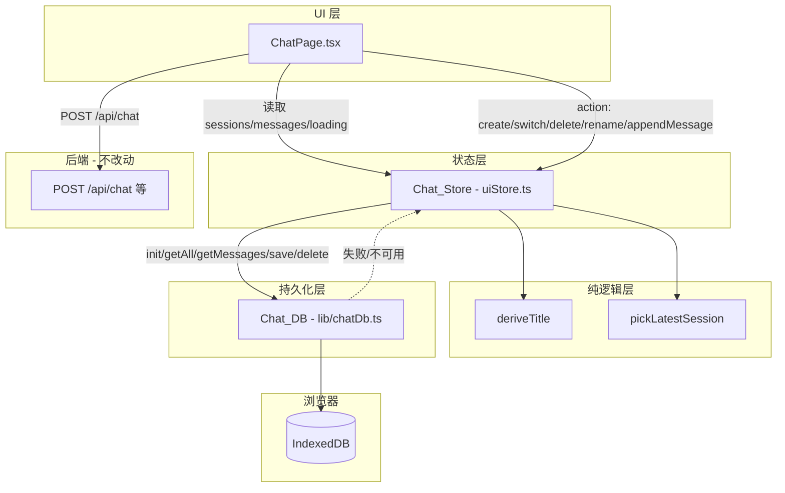
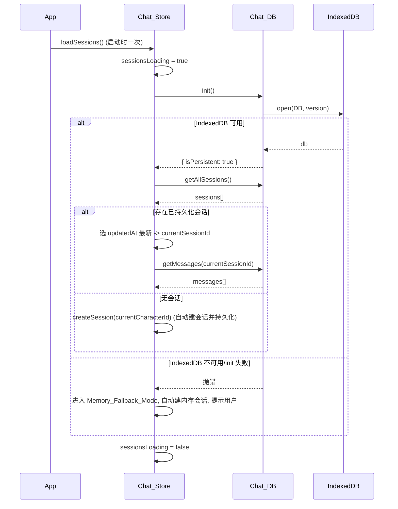

# Design Document

## Overview

「会话历史持久化」(chat-session-persistence) 在已交付的「语音交互闭环」之上，为女娲对话页（Chat_Page）引入一个纯前端的持久化数据层 **Chat_DB**（基于浏览器 IndexedDB），并把会话与消息的状态管理统一收敛到 **Chat_Store**（Zustand）。目标是消除当前对话页的两处割裂：

1. Chat_Page 用组件本地 `useState` 维护 `messages`（含硬编码 `m1`/`m2`），与 Chat_Store 的 `messages` 各自为政。
2. Chat_Store 的 `sessions` 是硬编码 mock（`s1`/`s2`），`createSession` 只写内存、刷新即丢。

交付后，会话列表与每个会话的消息会写入 IndexedDB，刷新或重启可恢复；并提供完整的会话生命周期（新建 / 切换 / 删除 / 重命名）、首条用户消息自动生成标题、启动恢复与空状态处理。当 IndexedDB 不可用或读写失败时，系统降级为内存模式（Memory_Fallback_Mode）并提示用户。本特性不改后端，不改 `POST /api/chat` 契约，且保证语音输入（ASR）、TTS 朗读、模型管理、模型下载等既有能力不回归。

### 设计目标与非目标

- **目标**：本地持久化、会话生命周期、自动标题、启动恢复 / 空状态、Chat_Page 改造去 mock、错误降级、无回归。
- **非目标**：跨设备 / 云端同步、消息内容全文搜索、会话导入导出、后端持久化。这些不在本特性范围内。

### 关键设计决策

| 决策 | 选择 | 理由 |
| --- | --- | --- |
| 持久化介质 | IndexedDB（非 localStorage） | 消息体量可能较大且为结构化数据，IndexedDB 支持索引查询与异步、容量更大 |
| 数据层封装 | 独立模块 `lib/chatDb.ts`，对外暴露异步接口 | 与 Zustand 解耦，便于用 `fake-indexeddb` 或注入 `IDBFactory` 做单元测试 |
| `updatedAt` 类型 | 由展示字符串改为**可排序的 ISO 时间戳字符串**，展示时再格式化 | 需求多处要求按"最新"排序与恢复（Req 4.4 / 7.1），展示字符串无法排序 |
| 消息排序 | 持久化的 Chat_Message 增加 `sessionId` 外键与单调递增的 `seq` 排序字段 | Req 1.5 要求"按追加顺序恢复"，需稳定排序键 |
| 自动标题 | 抽出纯函数 `deriveTitle(content, maxLen)` | 截断逻辑可独立做属性测试，不依赖 DOM / store |
| 会话选取 | 抽出纯函数 `pickLatestSession(sessions)` | 删除后与启动恢复都要"取 updatedAt 最新"，复用且可单测 |
| 降级策略 | Chat_DB 提供 `isPersistent` 标志；失败时 store 进入内存模式仍可用 | Req 9 要求存储不可用时不阻断对话 |

## Architecture

### 分层结构



### 启动初始化时序



### 发送消息与自动标题数据流

```mermaid
sequenceDiagram
    participant CP as ChatPage
    participant Store as Chat_Store
    participant DB as Chat_DB
    participant API as POST /api/chat

    CP->>Store: appendMessage(userMsg)
    Store->>Store: messages.push(userMsg); 若标题仍为默认且首条用户消息 -> deriveTitle
    Store->>Store: 更新 Active_Session.updatedAt
    Store->>DB: saveMessage(userMsg) + saveSession(session)
    CP->>API: POST /api/chat (history + system)
    API-->>CP: assistant 回复
    CP->>Store: appendMessage(assistantMsg)
    Store->>Store: messages.push; 更新 updatedAt
    Store->>DB: saveMessage(assistantMsg) + saveSession(session)
    Note over CP: autoPlay 时调用既有 speakMessage(TTS) — 不回归
```

## Components and Interfaces

### 1. Chat_DB（`app/web/src/lib/chatDb.ts`，新增）

封装 IndexedDB 的异步数据访问层。为可测试性，工厂函数允许注入 `IDBFactory`（测试时传入 `fake-indexeddb` 提供的实例）。

```typescript
import type { ChatSession, ChatMessage } from '@/store/uiStore';

/** 持久化的消息记录：在 ChatMessage 之上增加归属与排序字段。 */
export interface PersistedMessage extends ChatMessage {
  sessionId: string;  // 外键：所属会话 id
  seq: number;        // 单调递增排序键，保证按追加顺序恢复
}

/** Chat_DB 对外接口。所有方法异步，失败时 reject。 */
export interface ChatDb {
  /** 打开/升级数据库并建立 object stores 与索引。 */
  init(): Promise<void>;
  /** 读取全部会话（未排序，调用方负责按 updatedAt 排序）。 */
  getAllSessions(): Promise<ChatSession[]>;
  /** 按会话 id 读取其全部消息，按 seq 升序返回。 */
  getMessages(sessionId: string): Promise<ChatMessage[]>;
  /** 新增或更新一条会话（put，按 id 幂等）。 */
  saveSession(session: ChatSession): Promise<void>;
  /** 新增或更新一条消息（put，按 id 幂等，需带 sessionId 与 seq）。 */
  saveMessage(message: PersistedMessage): Promise<void>;
  /** 删除一条会话及其全部消息（事务内完成）。 */
  deleteSession(sessionId: string): Promise<void>;
}

/**
 * 创建 Chat_DB 实例。
 * @param factory 可选注入的 IDBFactory（测试用 fake-indexeddb），默认 globalThis.indexedDB
 */
export function createChatDb(factory?: IDBFactory): ChatDb;
```

**IndexedDB 结构**：

- 数据库名 `nuwa-chat`，版本 `1`。
- object store `sessions`，`keyPath: 'id'`。
- object store `messages`，`keyPath: 'id'`；建立索引 `by-session`（`keyPath: 'sessionId'`，非唯一）用于按会话查询；按 `seq` 在内存中或借助复合排序返回有序结果。

**可用性探测**：`createChatDb` 不立即抛错；`init()` 内 `open` 失败（或 `globalThis.indexedDB` 为 `undefined`）时 reject，由 Chat_Store 捕获后进入降级模式。

### 2. 纯函数（`app/web/src/lib/chatTitle.ts`，新增）

```typescript
/** 新建且未发消息会话的默认标题。 */
export const DEFAULT_TITLE = '新对话';
/** 自动标题最大字符数。 */
export const TITLE_MAX_LENGTH = 20;

/**
 * 由首条用户消息内容派生会话标题：
 * - 去除首尾空白；
 * - 按 Unicode 码点截断到 maxLen（避免破坏多字节字符）；
 * - 若去空白后为空，返回 DEFAULT_TITLE。
 */
export function deriveTitle(content: string, maxLen: number = TITLE_MAX_LENGTH): string;
```

会话选取纯函数（放入 `chatDb.ts` 同级或 `chatTitle.ts`，本设计置于 `lib/chatSession.ts`）：

```typescript
import type { ChatSession } from '@/store/uiStore';

/**
 * 从会话集合中选出 updatedAt 最新的一条；空集合返回 null。
 * updatedAt 为 ISO 时间戳字符串，按字典序即时间序。
 */
export function pickLatestSession(sessions: ChatSession[]): ChatSession | null;
```

### 3. Chat_Store 改造（`app/web/src/store/uiStore.ts`）

**移除**：`defaultSessions`（`s1`/`s2`）、`messages` 初始硬编码（`m1`/`m2`）、旧 `addMessage`/`createSession` 的纯内存实现。

**新增状态**：

```typescript
interface UIState {
  // ... 既有字段
  sessions: ChatSession[];            // 初始 []
  currentSessionId: string | null;    // 初始 null
  messages: ChatMessage[];            // 初始 []
  sessionsLoading: boolean;           // 启动加载态，初始 true
  isPersistent: boolean;              // false 表示处于 Memory_Fallback_Mode
}
```

**新增 action**（均与 Chat_DB 协作；写失败时保留内存状态并提示）：

```typescript
// 启动时调用：init -> 恢复最新会话或自动建会话；失败进入降级模式
loadSessions: () => Promise<void>;
// 新建空会话（绑定当前角色与音色），设为当前并清空 messages，持久化
createSession: (characterId: string) => Promise<void>;
// 切换会话：设置 currentSessionId 并从 Chat_DB 加载其 messages；选中已是当前则不变
switchSession: (sessionId: string) => Promise<void>;
// 删除会话及其消息（确认在 UI 层完成）；若删的是当前会话则按 Req 4.4/4.5 重选或进入空状态
deleteSession: (sessionId: string) => Promise<void>;
// 重命名：trim 后非空才更新并持久化
renameSession: (sessionId: string, title: string) => Promise<void>;
// 追加消息到当前会话：push messages、必要时自动标题、更新 updatedAt、持久化消息与会话
appendMessage: (msg: ChatMessage) => Promise<void>;
```

> `appendMessage` 取代既有 `addMessage`。自动标题在 `appendMessage` 内判定：当 `msg.role === 'user'`、Active_Session.title 仍为 `DEFAULT_TITLE` 且该会话此前无用户消息时，调用 `deriveTitle`。

**降级行为**：任一 Chat_DB 写操作 reject 时，对应 action 仍完成内存状态更新（保证 UI 不断），随后通过 `useToastStore` 提示"本地历史保存失败"。`init` reject 时设 `isPersistent=false` 并提示"本地历史无法保存"。

### 4. Chat_Page 改造（`app/web/src/components/ChatPage.tsx`）

- **删除本地 `messages` useState 与硬编码 m1/m2**；改为 `const messages = useUIStore(s => s.messages)`。
- **删除本地 `ChatMessage` 接口**，复用 `@/store/uiStore` 的类型（含 `audioUrl?`）。流式占位 `isStreaming` 字段如仍需要可保留在 store 类型中或以本地临时态处理；本设计保留发送 → 等待 → 落库的非流式流程，不引入回归。
- `handleSend`：用户消息改为 `await appendMessage(userMsg)`；assistant 回复改为 `await appendMessage(assistantMsg)`；`autoPlay` 时仍调用既有 `speakMessage`（**TTS 不回归**）。后端错误 / 网络错误的本地兜底回复同样走 `appendMessage` 落库。
- **新建**：`onClick={() => createSession(currentCharacterId)}`（已存在按钮，改为 await 版本）。
- **切换**：会话列表项 `onClick={() => switchSession(s.id)}`，并保持选中高亮（`s.id === currentSessionId`）。
- **删除**：每个会话项增加删除按钮，点击弹出二次确认（复用 `window.confirm` 或轻量内联确认 UI），确认后 `deleteSession(s.id)`。
- **重命名**：会话项支持双击 / 菜单进入编辑（内联 input 或 `window.prompt`），提交 `renameSession(s.id, text)`。
- **启动加载态**：`sessionsLoading` 为真时，侧边栏会话列表显示加载占位（骨架 / "加载中…"），不渲染任何硬编码占位会话或消息。
- **降级提示**：`isPersistent === false` 时在对话区顶部显示一条非阻断提示条「本地历史无法保存」。
- `updatedAt` 展示：通过 `formatRelativeTime(iso)` 把 ISO 时间戳格式化为"刚刚 / N 分钟前 / 昨天"等再渲染。
- `App` 挂载时（或 ChatPage 首次挂载时）触发一次 `loadSessions()`。

### 5. 依赖变更（`app/web/package.json`）

新增 devDependency：`fake-indexeddb`（用于 chatDb 单元测试在 jsdom 下提供 IndexedDB 实现）。生产依赖不变。

## Data Models

### Chat_Session（持久化结构）

```typescript
interface ChatSession {
  id: string;          // 由 Date.now()/crypto.randomUUID 生成
  title: string;       // 默认 '新对话'，首条用户消息后自动生成或用户重命名
  characterId: string; // 绑定的角色
  voiceId: string;     // 角色对应音色
  updatedAt: string;   // ISO 8601 时间戳（可排序）；展示时格式化为相对时间
}
```

> 与既有类型相比，语义变化仅 `updatedAt`：由展示字符串改为 ISO 时间戳。展示层用 `formatRelativeTime` 转换，保持 UI 观感不变。

### Chat_Message（运行时与持久化结构）

```typescript
// 运行时（Chat_Store.messages 与 UI 使用）
interface ChatMessage {
  id: string;
  role: 'user' | 'assistant';
  content: string;
  audioUrl?: string;
  voiceName?: string;
  duration?: string;
}

// 持久化（Chat_DB messages store）
interface PersistedMessage extends ChatMessage {
  sessionId: string; // 外键
  seq: number;       // 单调递增排序键
}
```

`seq` 生成策略：会话内追加时取「当前该会话已持久化消息数」或维护一个递增计数；保证同一会话内 `seq` 严格递增且与追加顺序一致。读取 `getMessages` 时按 `seq` 升序返回，UI 渲染 `messages` 即为追加顺序。

### IndexedDB Schema

| Store | keyPath | 索引 | 说明 |
| --- | --- | --- | --- |
| `sessions` | `id` | 无 | 全量读取后由 `pickLatestSession` 按 `updatedAt` 选最新 |
| `messages` | `id` | `by-session`(`sessionId`, 非唯一) | 按会话查询后在内存按 `seq` 升序排序 |

删除会话使用读写事务同时覆盖 `sessions` 与 `messages` 两个 store：删除会话记录，并通过 `by-session` 索引游标删除其全部消息，保证原子性（Req 4.2）。

## Correctness Properties

*属性（property）是在系统所有有效执行中都应成立的特征或行为——是对"软件应当做什么"的形式化陈述。属性是人类可读规格与机器可验证正确性保证之间的桥梁。*

本特性同时包含可属性化的纯逻辑层（`deriveTitle`、`pickLatestSession`、Chat_DB 的往返与按序恢复、Chat_Store 的状态不变式）与不适合 PBT 的部分（IndexedDB schema、UI 渲染与交互、无回归约束）。下列属性仅覆盖前者；后者在「测试策略」中以 schema/示例/组件测试覆盖。所有属性均经 prework 反思去重。

### Property 1: 标题截断

*For any* 字符串 `content` 与正整数 `maxLen`：`deriveTitle(content, maxLen)` 去除首尾空白后，若码点数 > `maxLen` 则结果恰为前 `maxLen` 个码点且是去空白内容的前缀；若码点数 ∈ [1, maxLen] 则结果等于去空白后的内容；若去空白后为空则结果为 `DEFAULT_TITLE`。结果码点数恒 ≤ `maxLen`。

**Validates: Requirements 6.2**

### Property 2: 自动标题首条触发且单次

*For any* 标题仍为 `DEFAULT_TITLE` 且尚无用户消息的会话与任意非空用户消息内容：`appendMessage` 该用户消息后，会话标题变为 `deriveTitle(content)`；而对任意已有非默认标题的会话，再追加任意用户消息后其标题保持不变。

**Validates: Requirements 6.1, 6.4**

### Property 3: 重命名 trim 语义

*For any* 会话与任意标题文本 `t`：`renameSession` 后，若 `t.trim()` 非空则标题等于 `t.trim()`，否则标题保持原值不变。

**Validates: Requirements 5.1, 5.3**

### Property 4: 会话持久化往返

*For any* 会话集合：将每条会话依次 `saveSession` 后，`getAllSessions` 返回的集合按 `id` 比较与输入等价（字段一致、不丢不增）；对同一 `id` 再次 `saveSession`（重命名 / 更新 updatedAt）后读取得到的是最新值。

**Validates: Requirements 1.2, 1.4, 2.3, 5.2, 6.3**

### Property 5: 消息往返与按序恢复

*For any* 会话 `id` 与任意消息序列：按序 `saveMessage`（带递增 `seq`）后，`getMessages(id)` 返回的消息序列在内容与顺序上等于追加序列，且每条消息的 `sessionId` 等于该会话 `id`。

**Validates: Requirements 1.3, 1.5, 3.2**

### Property 6: 最新会话选取

*For any* 非空会话集合：`pickLatestSession` 返回的会话存在于该集合中，且其 `updatedAt` 不早于集合中任意其他会话；对空集合返回 `null`。

**Validates: Requirements 4.4, 7.1**

### Property 7: 新建会话字段派生与状态后置条件

*For any* 角色集合与其中任一 `currentCharacterId`：`createSession(currentCharacterId)` 后，新会话的 `characterId` 等于该当前角色、`voiceId` 等于该角色绑定音色、`title` 等于 `DEFAULT_TITLE`；且 `currentSessionId` 指向该新会话、`messages` 为空。

**Validates: Requirements 2.1, 2.2**

### Property 8: 切换会话状态转移与幂等

*For any* 含多个会话（各自持有任意消息序列）的状态与任一目标会话 `id`：`switchSession(id)` 后 `currentSessionId` 等于 `id` 且 `messages` 等于该会话的持久化消息序列；当 `id` 已是当前会话时，`messages` 内容保持不变。

**Validates: Requirements 3.1, 3.4**

### Property 9: 删除会话移除其消息且不影响其他会话

*For any* 会话集合（各持有任意消息）与任一被删会话 `id`：`deleteSession(id)` 后 `getAllSessions` 不含该会话且 `getMessages(id)` 为空，而其余每个会话及其消息序列保持不变；当被删会话非当前会话时，`currentSessionId` 与 `messages` 不变。

**Validates: Requirements 4.2, 4.6**

### Property 10: 追加消息更新 updatedAt 并持久化

*For any* 当前会话与任意消息：`appendMessage` 后 Active_Session 的 `updatedAt` 不早于追加前的值，且该会话与该消息均被写入 Chat_DB（持久模式下）。

**Validates: Requirements 8.6**

### Property 11: currentSessionId 有效性不变式（基于模型）

*For any* 由 `createSession` / `switchSession` / `deleteSession` / `renameSession` / `appendMessage` 组成的任意操作序列：执行完毕后 `currentSessionId` 要么为 `null`，要么指向 `sessions` 中确实存在的某个会话的 `id`。

**Validates: Requirements 7.3**

## Error Handling

| 场景 | 触发条件 | 处理 | 关联需求 |
| --- | --- | --- | --- |
| IndexedDB 不可用 / `init` 失败 | `globalThis.indexedDB` 缺失或 `open` reject | 进入 Memory_Fallback_Mode：`isPersistent=false`，自动建内存会话，toast 提示「本地历史无法保存」 | 9.1, 9.2 |
| 读取失败 | `getAllSessions` / `getMessages` reject | 以空会话集合继续，触发空状态处理（自动建会话），记录告警 | 9.3, 7.2 |
| 写入失败 | `saveSession` / `saveMessage` / `deleteSession` reject | 保留内存中的会话与消息状态（UI 不回退），toast 提示「保存失败」 | 9.4 |
| 后端对话失败 | `POST /api/chat` 报错 / 网络错误 | 维持既有兜底：toast 提示并以本地兜底 assistant 回复 `appendMessage` 落库 | 9.7 |
| 空标题重命名 | `renameSession` 收到纯空白 | 保持原标题不变（Property 3） | 5.3 |
| 删除唯一会话 | 删除后无任何会话 | 进入空状态处理：自动新建会话并设为 active | 4.5, 7.2 |

所有 Chat_DB 异步操作以 `try/catch` 包裹于 store action 内；写操作遵循「先更新内存、后持久化」，持久化失败不回滚内存，保证对话连续性与 UI 不闪退。

## Testing Strategy

### 框架与工具

- 测试运行器：**Vitest 3**（已装，`npm test` 即 `vitest --run`），环境 jsdom。
- 属性测试库：**fast-check 3**（已装，**不自行实现** PBT）。
- 组件测试：**@testing-library/react** + 既有 `src/test/setup.ts`（已提供 MediaRecorder / getUserMedia / Audio / scrollIntoView 等 mock）。
- IndexedDB 测试：新增 devDependency **`fake-indexeddb`**；在 chatDb 测试中通过 `createChatDb(fakeIndexedDB)` 注入，或导入 `fake-indexeddb/auto` 提供全局 `indexedDB`。每个用例使用独立数据库名或在 `afterEach` 清理，保证隔离。

### 双重测试策略

- **属性测试（PBT）**：覆盖纯逻辑与数据层不变式（Property 1–11）。
  - 每个属性用**单个** property-based 测试实现，**最少 100 次迭代**（`fc.assert(fc.property(...), { numRuns: 100 })`）。
  - 每个属性测试以注释标注其设计属性，格式：`// Feature: chat-session-persistence, Property {number}: {property_text}`。
  - 生成器要点：标题截断属性需生成含多字节 / 纯空白 / 超长字符串；消息按序属性需生成可变长消息序列；不变式属性（Property 11）用 `fc.commands` 或随机操作序列做基于模型的测试，并以纯内存参考模型对照。
- **单元 / 示例测试**：覆盖接口存在性（Req 1.6）、IndexedDB schema（Req 1.1，验证 init 后两个 store 与索引存在）、各错误降级分支（Req 9.1–9.4）。
- **组件测试（ChatPage）**：新建 / 切换 / 删除（含二次确认与取消）/ 重命名的 UI 行为（Req 2.4, 3.3, 4.1, 4.3, 5.4, 6.5）、启动加载态与去 mock（Req 7.4, 8.1–8.3）、发送与 assistant 落库（Req 8.4, 8.5）、降级提示（Req 9.2），以及 **Voice_Loop 无回归**：录音按钮 / `transcribe` 接线（Req 9.5）与 `speakMessage` / TTS 播放按钮（Req 9.6）保留可用，通过 mock 网络与既有 setup mock 验证。
- **无回归 / 构建验证**：保留并通过既有 `ChatPage.test.tsx`、`useApi`/`useRecorder`/`useAudioPlayer`/`voice` 等测试；以 `npm run build`（`tsc && vite build`）确保类型与构建通过；`/api/chat`、`/api/models`、`/api/downloads` 契约不变（Req 9.7, 9.8）。

### 测试到属性映射（PBT 部分）

| 属性 | 被测对象 | 测试文件（建议） |
| --- | --- | --- |
| Property 1 | `deriveTitle` | `lib/chatTitle.test.ts` |
| Property 2 | `appendMessage` 自动标题 | `store/uiStore.session.test.ts` |
| Property 3 | `renameSession` | `store/uiStore.session.test.ts` |
| Property 4 | `saveSession`/`getAllSessions` | `lib/chatDb.test.ts` |
| Property 5 | `saveMessage`/`getMessages` | `lib/chatDb.test.ts` |
| Property 6 | `pickLatestSession` | `lib/chatSession.test.ts` |
| Property 7 | `createSession` | `store/uiStore.session.test.ts` |
| Property 8 | `switchSession` | `store/uiStore.session.test.ts` |
| Property 9 | `deleteSession` | `lib/chatDb.test.ts` + `store/uiStore.session.test.ts` |
| Property 10 | `appendMessage` updatedAt | `store/uiStore.session.test.ts` |
| Property 11 | 操作序列不变式 | `store/uiStore.invariant.test.ts` |

### 受影响文件清单

**新增**
- `app/web/src/lib/chatDb.ts` — Chat_DB IndexedDB 数据层
- `app/web/src/lib/chatTitle.ts` — `deriveTitle` / `DEFAULT_TITLE` / `TITLE_MAX_LENGTH`
- `app/web/src/lib/chatSession.ts` — `pickLatestSession` + 时间格式化 `formatRelativeTime`
- `app/web/src/lib/chatDb.test.ts`、`lib/chatTitle.test.ts`、`lib/chatSession.test.ts`
- `app/web/src/store/uiStore.session.test.ts`、`store/uiStore.invariant.test.ts`

**修改**
- `app/web/src/store/uiStore.ts` — 移除 mock（s1/s2/m1/m2），新增持久化 actions 与 `sessionsLoading`/`isPersistent`，`updatedAt` 改 ISO
- `app/web/src/components/ChatPage.tsx` — 去本地 messages、接入 store actions、新建/切换/删除/重命名 UI、加载态与降级提示
- `app/web/src/components/ChatPage.test.tsx` — 适配新数据来源与新增交互
- `app/web/package.json` — 新增 devDependency `fake-indexeddb`
- 触发启动初始化的挂载点（`App.tsx` 或 ChatPage 首次挂载调用 `loadSessions()`）

**不改动**
- 后端全部代码、`POST /api/chat` / `GET /api/models` / `/api/downloads/*` 契约（Req 9.8）
