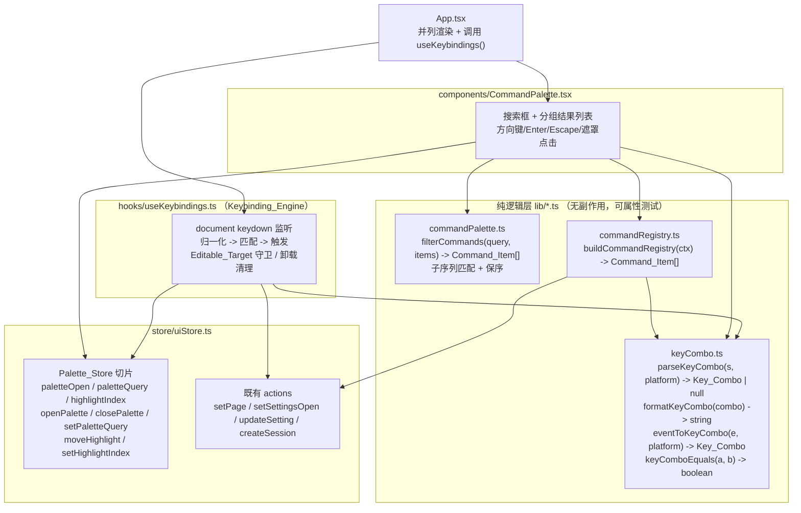

# Design Document

## Overview

命令面板（Command Palette）为女娲 Nuwa Web 应用引入一套**全局命令面板 + 键盘快捷键系统**。用户按 `Ctrl/Cmd+K` 唤起覆盖层，输入文字模糊搜索并执行命令（页面导航、打开设置、切换主题/语言、新建会话），全程可纯键盘操作。

本设计严格沿用既有分层约定（镜像 `ui-internationalization` / `appearance-theme-mode`）：

- **纯逻辑层**（`lib/*.ts`）：无副作用纯函数，输入空间大、可被 fast-check 属性测试。
  - `lib/commandPalette.ts`：`Command_Filter`（模糊匹配 + 保序排序）与 `Command_Item` 类型。
  - `lib/keyCombo.ts`：`Key_Combo` 数据结构、`parseKeyCombo`（解析）、`formatKeyCombo`（格式化）、`eventToKeyCombo`（事件归一化）、平台判定经显式参数注入。
  - `lib/commandRegistry.ts`：带类型的 `Command_Registry` builder，接收 store actions/context，返回有序 `Command_Item[]`。
- **UI 状态切片**（`store/uiStore.ts`）：新增 `Palette_Store` 切片（`paletteOpen` / `paletteQuery` / `highlightIndex` + actions），复用既有 `setPage` / `setSettingsOpen` / `updateSetting` / `createSession`。
- **运行期副作用 Hook**（`hooks/useKeybindings.ts`）：`Keybinding_Engine`，注册文档级 `keydown` 监听器，归一化为 `Key_Combo`，匹配并触发动作，尊重 `Editable_Target` 守卫，卸载时清理。
- **组件层**（`components/CommandPalette.tsx`）：覆盖层 UI，在 `App.tsx` 与 `SettingsModal` 并列渲染，配套 React Testing Library 测试。

核心约束来自需求：`Command_Filter` 与 `Key_Combo` 解析/格式化必须是**无副作用纯函数**（平台判定经显式参数注入），对相同输入恒返回相同输出，便于属性测试。本特性同时干净地替换零散导航 hack（`window.__nuwa_switchPage`）。

### 关键设计决策

| 决策 | 选择 | 理由 |
| --- | --- | --- |
| 命令过滤算法 | 大小写无关的**子序列**匹配 + 输入顺序稳定回退 | 需求 3.2 明确「子序列匹配」；保序回退（3.3）让结果可预测、易测 |
| 平台判定注入方式 | 作为显式 `platform: 'mac' \| 'other'` 参数传入纯函数 | 需求 7.7 要求纯函数不读取外部状态；`mod` 解析依赖平台 |
| 快捷键声明形式 | 字符串（`"mod+k"`）经 `parseKeyCombo` 解析为规范结构 | 需求 7 要求可往返、跨平台一致、可测 |
| Palette 状态位置 | 新增切片并入既有 `uiStore` | 与 `isSettingsOpen` 等 UI 态同源，复用 store actions |
| 命令注册表构建 | 构建期 builder 接收上下文，返回 `Command_Item[]` | 需求 2 要求带类型集中声明、`run` 为无参闭包 |
| Highlight 规整 | 单一纯函数 `clampHighlight` 在 query/列表变化时复用 | 需求 4.3 的边界规整集中、可测 |
| 导航 hack 替换 | 命令 `run` 直接调用 `setPage`；移除对 `window.__nuwa_switchPage` 的依赖 | 需求引言要求清理零散 hack |

## Architecture



数据流：

1. `App.tsx` 顶层调用 `useKeybindings()`，在文档级注册 `keydown` 监听（Req 6.1）。
2. 用户按 `Ctrl/Cmd+K` → `eventToKeyCombo` 归一化 → 匹配到「打开面板」Keybinding → `openPalette()` 置 `paletteOpen=true` 并 `preventDefault()`（Req 1.1, 1.6）。
3. `CommandPalette` 在 `paletteOpen` 为 true 时渲染：`buildCommandRegistry(ctx)` 得到全量命令 → `filterCommands(paletteQuery, items)` 得到 `Filtered_Commands` → 按 `Command_Group` 分组渲染（Req 8）。
4. 方向键经 `moveHighlight(+1/-1)` 回绕移动高亮；`query` 变化经 `clampHighlight` 规整 `highlightIndex`（Req 4.1–4.3）。
5. Enter 执行高亮命令 `run()`（调用既有 store actions 产生副作用）→ `closePalette()`（Req 4.4, 5）。
6. Escape / 遮罩点击 → `closePalette()`；组件卸载 → `useKeybindings` 移除监听器（Req 1.2, 1.5, 6.5）。

层间依赖单向：UI/Hook → 纯逻辑层 → 静态数据；纯逻辑层不导入 React，不读写 store/DOM。

## Components and Interfaces

### `lib/keyCombo.ts`（纯逻辑层：按键组合解析/格式化/归一化）

```typescript
/** 跨平台判定：'mac' 将 mod 解析为 meta，'other' 解析为 ctrl。显式注入以保持纯函数。 */
export type Platform = 'mac' | 'other';

/** 规范化按键组合。修饰键为布尔标志，key 为规范化后的小写主键名。 */
export interface KeyCombo {
  ctrl: boolean;
  meta: boolean;
  shift: boolean;
  alt: boolean;
  /** 单个主键，小写（如 'k'、'enter'、'arrowdown'、'/'）。 */
  key: string;
}

/** 修饰键 token 集合（含跨平台别名 mod）。 */
// 'ctrl' | 'control' | 'meta' | 'cmd' | 'command' | 'mod' | 'shift' | 'alt' | 'option'

/**
 * 解析 Key_Combo 字符串为 KeyCombo（Req 7.1, 7.6）。无副作用纯函数。
 *
 * 语法：token 以 '+' 连接，忽略大小写与多余空白；末尾恰为单个主键，
 * 其余为修饰键。'mod' 依 platform 归一为 meta（mac）或 ctrl（other）。
 *
 * 返回 null（Req 7.2）当：空串/全空白、缺少主键（仅修饰键）、
 * 含未知 token、出现一个以上主键（重复主键）。
 */
export function parseKeyCombo(input: string, platform: Platform): KeyCombo | null;

/**
 * 将 KeyCombo 格式化为规范字符串（Req 7.3）。无副作用纯函数。
 * 固定修饰键顺序：ctrl -> meta -> shift -> alt，最后接主键，以 '+' 连接。
 * 例：{ctrl:true, shift:true, key:'p'} -> "ctrl+shift+p"。
 */
export function formatKeyCombo(combo: KeyCombo): string;

/** 结构相等比较（四个修饰标志 + key 全等）。 */
export function keyComboEquals(a: KeyCombo, b: KeyCombo): boolean;

/**
 * 将 DOM KeyboardEvent 归一化为 KeyCombo（Keybinding_Engine 使用）。
 * 读取 e.ctrlKey/metaKey/shiftKey/altKey 与 e.key（转小写）。platform 显式注入。
 * 注意：本函数仅做纯数据转换，不读取除入参 event 外的任何外部状态。
 */
export function eventToKeyCombo(
  e: Pick<KeyboardEvent, 'ctrlKey' | 'metaKey' | 'shiftKey' | 'altKey' | 'key'>,
  platform: Platform,
): KeyCombo;

/** 运行期一次性平台探测（仅供 Hook/组件调用，纯函数不依赖它）。 */
export function detectPlatform(): Platform;
```

实现要点：

- `parseKeyCombo` 先 `trim` + `toLowerCase` + 按 `+` 切分并去空段；将每个 token 归类为修饰键或主键；`mod` 依 `platform` 替换；恰好一个主键时返回结构，否则返回 `null`。重复主键（两个非修饰 token）按 Req 7.2 返回 `null`。
- `formatKeyCombo` 严格按 `ctrl/meta/shift/alt` 顺序拼接，保证规范形式唯一（往返与幂等的基础）。
- 这是经典的**解析/打印往返**场景，必须有 round-trip 属性测试（见 Correctness Properties Property 2）。

### `lib/commandPalette.ts`（纯逻辑层：命令类型 + 过滤）

```typescript
/** 命令分组标签。 */
export type CommandGroup = 'navigation' | 'settings' | 'appearance' | 'session';

/** 一条可执行命令（带类型记录）。 */
export interface CommandItem {
  /** 注册表内稳定且唯一的 id。 */
  id: string;
  /** 显示标题。 */
  title: string;
  /** 可选副标题/说明。 */
  subtitle?: string;
  /** 用于匹配的关键字集合（与 title 一并参与子序列匹配）。 */
  keywords: string[];
  /** 分组标签。 */
  group: CommandGroup;
  /** 可选关联的规范化 Key_Combo 字符串（用于展示）。 */
  combo?: string;
  /** 无参执行函数（闭包捕获 store actions/context）。 */
  run: () => void;
}

/**
 * 大小写无关的子序列匹配：query 的字符按序（不必相邻）出现在 text 中即命中。
 * 空 query 视为命中一切。纯函数。
 */
export function isSubsequenceMatch(query: string, text: string): boolean;

/**
 * Command_Filter：依据 query 过滤并保序返回 items 的子集（Req 3）。无副作用纯函数。
 *
 * - query 为空（trim 后）：返回 items 的保序全量副本（Req 3.1）。
 * - query 非空：保留 title 或任一 keywords 元素能子序列匹配 query 的项（忽略大小写，Req 3.2）。
 * - 保持输入相对顺序作为稳定回退排序（Req 3.3）。
 * - 输出恒为输入子集，不新增/复制元素（Req 3.6）。
 * - 不读写 store/DOM/外部状态，对相同输入恒返回相同输出（Req 3.4）；
 *   过滤幂等：filter(q, filter(q, items)) == filter(q, items)（Req 3.5）。
 */
export function filterCommands(query: string, items: CommandItem[]): CommandItem[];

/**
 * 将 Highlight_Index 规整到合法范围（Req 4.3）。纯函数。
 * 列表为空返回 -1；否则将 index 夹到 [0, length-1]。
 */
export function clampHighlight(index: number, length: number): number;

/**
 * 方向键移动并回绕（Req 4.1, 4.2）。纯函数。
 * length<=0 返回 -1；否则 (current + delta) 对 length 取模回绕。
 */
export function moveHighlightIndex(current: number, delta: number, length: number): number;
```

实现要点：`filterCommands` 用单次 `Array.prototype.filter` 保证保序与子集性；匹配判定对 `title` 与每个 `keyword` 调用 `isSubsequenceMatch`（任一命中即保留）。幂等性由「过滤是对输入数组的纯子集选择，且谓词仅依赖 query 与元素自身」自然得到。

### `lib/commandRegistry.ts`（纯逻辑层：带类型注册表 builder）

```typescript
import type { AppPage } from '@/store/uiStore';
import type { LocaleCode } from '@/lib/i18n';

/** 注册表构建所需的上下文：store actions + 当前上下文 + 平台。 */
export interface CommandRegistryContext {
  setPage: (page: AppPage) => void;
  setSettingsOpen: (open: boolean) => void;
  updateSetting: (key: 'theme' | 'language', value: string) => void;
  createSession: (characterId: string) => void | Promise<void>;
  currentCharacterId: string;
  platform: Platform;
  /** 翻译函数（用于命令标题本地化），可选；缺省用内置中文标题。 */
  t?: (key: string) => string;
}

/**
 * 构建有序 Command_Item 列表（Req 2）。
 *
 * 包含：
 * - 7 个导航命令（home/chat/voice/transcribe/models/characters/presets，Req 2.2），run 调用 setPage。
 * - 1 个打开设置命令（Req 2.3），run 调用 setSettingsOpen(true)。
 * - 3 个切换主题命令（dark/light/system，Req 2.4），run 调用 updateSetting('theme', …)。
 * - N 个切换语言命令（每个受支持 Locale_Setting，Req 2.5），run 调用 updateSetting('language', …)。
 * - 1 个新建会话命令（Req 2.6），run 调用 createSession(currentCharacterId) 后 setPage('chat')。
 *
 * 保证全部 id 唯一（Req 2.7）；关联 Key_Combo 的命令在 combo 上记录规范化字符串（Req 2.8）。
 */
export function buildCommandRegistry(ctx: CommandRegistryContext): CommandItem[];
```

实现要点：`run` 为捕获 `ctx` 的无参闭包。语言命令遍历 `SUPPORTED_LOCALES`，标题用 `LOCALE_LABELS`，`updateSetting('language', LOCALE_LABELS[code])`（沿用 store 存 `Display_Label` 的现状）。新建会话命令的 `combo` 记录 `formatKeyCombo(parseKeyCombo('mod+k', platform))` 之类规范字符串（若分配快捷键）。id 采用稳定前缀：`nav.home`、`settings.open`、`theme.dark`、`locale.zh-CN`、`session.new` 等，天然唯一。

### `store/uiStore.ts`（新增 Palette_Store 切片）

```typescript
interface UIState {
  // … 既有字段 …

  // Command Palette（新增切片）
  /** Palette_Open_State：面板是否可见，初始 false。 */
  paletteOpen: boolean;
  /** Palette_Query：搜索框原始查询，初始 ''。 */
  paletteQuery: string;
  /** Highlight_Index：当前高亮下标，空列表约定 -1，初始 -1。 */
  highlightIndex: number;

  /** 打开面板：paletteOpen=true，重置 query='' 与 highlightIndex（非空列表为 0，否则 -1）（Req 1.3）。 */
  openPalette: () => void;
  /** 关闭面板：paletteOpen=false（Req 1.2, 5.6）。 */
  closePalette: () => void;
  /** 设置查询文本（Req 4.3 的规整由组件经 setHighlightIndex 协同完成）。 */
  setPaletteQuery: (query: string) => void;
  /** 方向键移动高亮（带回绕）；listLength 由调用方传入当前 Filtered_Commands 长度（Req 4.1, 4.2）。 */
  moveHighlight: (delta: number, listLength: number) => void;
  /** 直接设置高亮下标（用于 query 变化后的 clampHighlight 规整与鼠标悬停）。 */
  setHighlightIndex: (index: number) => void;
}
```

实现要点（追加到 `create<UIState>` 工厂返回对象）：

```typescript
paletteOpen: false,
paletteQuery: '',
highlightIndex: -1,
openPalette: () => set({ paletteOpen: true, paletteQuery: '', highlightIndex: -1 }),
closePalette: () => set({ paletteOpen: false }),
setPaletteQuery: (query) => set({ paletteQuery: query }),
moveHighlight: (delta, listLength) =>
  set((s) => ({ highlightIndex: moveHighlightIndex(s.highlightIndex, delta, listLength) })),
setHighlightIndex: (index) => set({ highlightIndex: index }),
```

> `openPalette` 将 `highlightIndex` 置 -1；组件挂载/列表首次计算后经 `setHighlightIndex(clampHighlight(0, len))` 把高亮落到首项（Req 1.3）。这样 store action 不依赖过滤结果，保持简单。

### `hooks/useKeybindings.ts`（Keybinding_Engine）

```typescript
/**
 * 全局键盘快捷键引擎（Req 6）。在 App 顶层调用一次。
 *
 * 行为：
 * - 挂载时在 document 注册单个 keydown 监听器（Req 6.1），卸载时移除（Req 6.5）。
 * - 将事件经 eventToKeyCombo(platform) 归一化为 Key_Combo（Req 6.1）。
 * - 与已注册 Keybinding 匹配：相等则触发动作并 preventDefault（Req 6.2, 1.6）。
 *   · mod+k：paletteOpen 为 false 时 openPalette，为 true 时 closePalette（Req 1.1, 1.4）。
 *   · Escape：关闭最上层模态（Command_Palette 优先于 SettingsModal）（Req 1.2, 6.4）。
 * - Editable_Target 守卫：焦点位于 input/textarea/select/contenteditable 且
 *   Key_Combo 不含 ctrl/meta 时，不触发任何动作（Req 6.3）。
 */
export function useKeybindings(): void;
```

实现要点：`useEffect` 内 `const platform = detectPlatform()`；`handler` 读取 `useUIStore.getState()` 获取当前状态与 actions（避免闭包过期），`eventToKeyCombo` 归一化后匹配。`Editable_Target` 判定用 `document.activeElement` 的 `tagName`/`isContentEditable`。依赖数组为空 `[]`（监听器只注册一次，状态经 `getState()` 实时读取），`return () => document.removeEventListener(...)` 清理（Req 6.5）。

### `components/CommandPalette.tsx`（覆盖层组件）

```typescript
/**
 * 命令面板覆盖层（Req 1, 4, 5, 8）。
 *
 * - paletteOpen 为 false 时返回 null（不渲染）。
 * - 渲染遮罩 + 居中面板：搜索输入框 + 按 Command_Group 分组的 Filtered_Commands 列表（Req 8.1, 8.6）。
 * - 经 buildCommandRegistry 取全量命令，filterCommands(paletteQuery) 得到结果。
 * - 每项显示 title（及存在的 subtitle）；关联 Key_Combo 时经 formatKeyCombo 显示（Req 8.2, 8.3）。
 * - Highlight_Index 指向项施加高亮样式（Req 8.4）；空结果显示空状态提示（Req 8.5）。
 * - 键盘：ArrowDown/ArrowUp 移动高亮（回绕），Enter 执行并关闭，Escape 关闭（Req 4.1, 4.2, 4.4, 1.2）。
 * - 打开时聚焦搜索框并持续保持焦点（Req 4.6）；query 变化经 clampHighlight 规整高亮（Req 4.3）。
 * - 点击遮罩（列表/搜索框之外）关闭（Req 1.5）。
 */
export default function CommandPalette(): JSX.Element | null;
```

实现要点：用 `useUIStore` 订阅 `paletteOpen`/`paletteQuery`/`highlightIndex` 及 actions；用 `useMemo` 基于上下文构建注册表，基于 `paletteQuery` 计算 `filtered`；`useEffect` 在 `filtered.length`/`paletteQuery` 变化时 `setHighlightIndex(clampHighlight(highlightIndex, filtered.length))`，打开时若为 -1 落到 0；`useRef` + `useEffect` 聚焦输入框。Enter 时 `filtered[highlightIndex]?.run()` 后 `closePalette()`，空结果不执行且保持打开（Req 4.5）。分组渲染：按 `group` 归并，组内保持 `filtered` 相对顺序。

### `App.tsx` 改造

- 在既有 `useThemeEffect()` / `useLangEffect()` 旁新增 `useKeybindings()` 调用一次。
- 在 `<SettingsModal />` 旁渲染 `<CommandPalette />`。
- 移除 App 内仅处理 `Escape` 关闭设置的临时 `keydown` 监听（其职责并入 `useKeybindings` 的 Escape 分支，Req 6.4），并清理 `window.__nuwa_switchPage` 导航 hack（命令 `run` 直接用 `setPage`）。

## Data Models

### KeyCombo 数据结构

| 字段 | 类型 | 说明 |
| --- | --- | --- |
| `ctrl` | `boolean` | Control 修饰键 |
| `meta` | `boolean` | Meta/Cmd 修饰键 |
| `shift` | `boolean` | Shift 修饰键 |
| `alt` | `boolean` | Alt/Option 修饰键 |
| `key` | `string` | 单个主键，规范化小写（`'k'` / `'enter'` / `'arrowdown'` / `'/'`） |

**修饰键 token 别名归一**：

| 输入 token（忽略大小写） | 归一为 |
| --- | --- |
| `ctrl` / `control` | `ctrl` |
| `meta` / `cmd` / `command` | `meta` |
| `shift` | `shift` |
| `alt` / `option` | `alt` |
| `mod` | `meta`（platform=mac）/ `ctrl`（platform=other） |

**规范格式化顺序**：`ctrl` → `meta` → `shift` → `alt` → `<key>`，以 `+` 连接。该唯一顺序是往返与规范幂等的基础。

### CommandItem 与注册表清单

| group | id（示例） | title（示例） | run 副作用 | 依据 |
| --- | --- | --- | --- | --- |
| navigation | `nav.home` | 前往 首页 | `setPage('home')` | Req 2.2, 5.1 |
| navigation | `nav.chat` | 前往 对话 | `setPage('chat')` | Req 2.2, 5.1 |
| navigation | `nav.voice` | 前往 声音工坊 | `setPage('voice')` | Req 2.2, 5.1 |
| navigation | `nav.transcribe` | 前往 录音转写 | `setPage('transcribe')` | Req 2.2, 5.1 |
| navigation | `nav.models` | 前往 模型管理 | `setPage('models')` | Req 2.2, 5.1 |
| navigation | `nav.characters` | 前往 角色管理 | `setPage('characters')` | Req 2.2, 5.1 |
| navigation | `nav.presets` | 前往 提示词 | `setPage('presets')` | Req 2.2, 5.1 |
| settings | `settings.open` | 打开设置 | `setSettingsOpen(true)` | Req 2.3, 5.2 |
| appearance | `theme.dark` | 主题：深色 | `updateSetting('theme','dark')` | Req 2.4, 5.3 |
| appearance | `theme.light` | 主题：浅色 | `updateSetting('theme','light')` | Req 2.4, 5.3 |
| appearance | `theme.system` | 主题：跟随系统 | `updateSetting('theme','system')` | Req 2.4, 5.3 |
| appearance | `locale.zh-CN` | 语言：简体中文 | `updateSetting('language','简体中文')` | Req 2.5, 5.4 |
| appearance | `locale.en` | 语言：English | `updateSetting('language','English')` | Req 2.5, 5.4 |
| appearance | `locale.ja` | 语言：日本語 | `updateSetting('language','日本語')` | Req 2.5, 5.4 |
| session | `session.new` | 新建对话 | `createSession(currentCharacterId)` + `setPage('chat')` | Req 2.6, 5.5 |

> id 采用稳定命名前缀，集合内天然唯一（Req 2.7）。`session.new` 等关联快捷键的命令在 `combo` 上记录规范化字符串（Req 2.8）。

### Palette_Store 状态

| 字段 | 类型 | 初始值 | 说明 |
| --- | --- | --- | --- |
| `paletteOpen` | `boolean` | `false` | Palette_Open_State |
| `paletteQuery` | `string` | `''` | Palette_Query |
| `highlightIndex` | `number` | `-1` | Highlight_Index（空列表约定 -1） |

## Correctness Properties

*A property is a characteristic or behavior that should hold true across all valid executions of a system — essentially, a formal statement about what the system should do. Properties serve as the bridge between human-readable specifications and machine-verifiable correctness guarantees.*

本节由前述 prework 分析推导。命令面板中真正适合属性测试（PBT）的是两个纯函数层：`filterCommands`（输入空间为任意命令列表 × 任意查询字符串）与 `keyCombo` 的解析/格式化（输入空间为任意合法按键组合/字符串）。二者均为无副作用纯函数、对相同输入恒返回相同输出，且具备清晰的「for all」契约（保序子集选择、解析/打印往返）。

其余验收标准（唤起/关闭、注册表结构、面板内键盘交互、命令副作用接线、全局快捷键引擎、面板展示）依赖 React 渲染、DOM 事件与 store 接线，输入空间有限、行为不随输入有意义变化，归为示例/集成/边界测试（见 Testing Strategy），不在此列为属性。经属性反思（Property Reflection），Req 3 的六条合并为单一 Command_Filter 契约属性，Req 7 的往返/规范化条目合并为单一 Key_Combo 往返/幂等属性，最终保留两个高价值属性。

### Property 1: Command_Filter 契约（保序子集选择 + 匹配语义 + 幂等 + 纯性）

*For any* 命令列表 `items: CommandItem[]` 与任意查询字符串 `query`，`filterCommands(query, items)` 满足全部下列条件：

- **子集且保序**：输出是 `items` 的一个子序列——每个输出元素都来自 `items`（按引用包含，不新增、不复制），且输出中元素的相对顺序与其在 `items` 中的相对顺序一致（Req 3.3, 3.6）。
- **空查询全量**：当 `query` 经 `trim` 后为空时，输出与 `items` 顺序与元素完全一致（保序全量副本）（Req 3.1）。
- **匹配语义**：当 `query` 非空时，输出恰为 `items` 中「`title` 或任一 `keywords` 元素能（忽略大小写地）按子序列匹配 `query`」的全部元素，不多不少（Req 3.2）。
- **幂等**：`filterCommands(query, filterCommands(query, items))` 与 `filterCommands(query, items)` 相等（Req 3.5）。
- **纯性/确定性**：相同输入两次调用返回相等结果，且调用不修改入参 `items`、不读写 store/DOM/任何外部状态（Req 3.4）。

**Validates: Requirements 3.1, 3.2, 3.3, 3.4, 3.5, 3.6**

### Property 2: Key_Combo 解析/格式化往返与规范幂等

*For any* 合法 `KeyCombo` 值 `x`（任意修饰键标志组合 + 任意规范化小写主键）与固定平台 `platform`，以及任意语法合法的 Key_Combo 字符串 `s`：

- **往返（parse∘format）**：`parseKeyCombo(formatKeyCombo(x), platform)` 返回与 `x` 结构相等的 `KeyCombo`（四个修饰标志与 `key` 全等）（Req 7.4；亦覆盖 7.1、7.3 的解析/格式化正确性）。
- **规范幂等**：`parseKeyCombo(formatKeyCombo(parseKeyCombo(s, platform)!), platform)` 与 `parseKeyCombo(s, platform)` 相等（Req 7.5）。
- **纯性/确定性**：`parseKeyCombo` 与 `formatKeyCombo` 对相同输入两次调用返回相等结果，且不读写 DOM/store/任何外部状态（平台经显式参数注入）（Req 7.7）。

**Validates: Requirements 7.1, 7.3, 7.4, 7.5, 7.7**

## Error Handling

本特性以纯函数为核心，错误处理聚焦「非法/边界输入永不崩溃、行为可预测」：

| 场景 | 处理 | 依据 |
| --- | --- | --- |
| 非法 Key_Combo 字符串（空串、全空白、仅修饰键、未知 token、重复主键） | `parseKeyCombo` 返回 `null`，调用方（注册表/引擎）跳过该绑定，不抛错 | Req 7.2 |
| `mod` token 跨平台 | 依显式 `platform` 参数归一为 `meta`/`ctrl`，不读取全局 `navigator` | Req 7.6, 7.7 |
| 空查询 / 无匹配结果 | `filterCommands` 返回全量 / 空数组；组件渲染空状态提示，Enter 不执行且保持打开 | Req 3.1, 8.5, 4.5 |
| `highlightIndex` 越界（query 变更后列表缩短、负值、空列表） | `clampHighlight` 规整到 `[0,len-1]`，空列表返回 `-1`；渲染与 Enter 均按 `-1` 视为无高亮 | Req 4.3, 4.5 |
| `createSession` 为异步且 reject | `run` 内不阻塞关闭面板；持久化失败由既有 store 的 `toastSaveFailed` 提示（复用既有逻辑） | Req 5.5, 5.6 |
| 焦点位于可编辑控件 | `Editable_Target` 守卫：无 `ctrl`/`meta` 修饰的按键不触发任何 Keybinding，避免打断输入 | Req 6.3 |
| 组件卸载 / 重复挂载 | `useKeybindings` 在 cleanup 中 `removeEventListener`，避免重复监听与内存泄漏 | Req 6.5 |

纯函数均为全函数：`filterCommands`、`clampHighlight`、`moveHighlightIndex`、`formatKeyCombo` 对任意入参都有定义返回值；`parseKeyCombo` 对非法输入返回 `null` 而非抛异常。

## Testing Strategy

采用「属性测试 + 示例/集成测试」双轨：纯逻辑层用 fast-check 覆盖全输入空间；React Hook、组件与 store 接线用 @testing-library/react 覆盖交互与副作用。

### 工具与配置

- 测试运行器：**vitest**（`npm test` 已配置 `vitest --run`，jsdom 环境）。
- 属性测试库：**fast-check**（已在 devDependencies，v3.23.x）。不从零实现属性测试框架。
- React 测试：**@testing-library/react** + **@testing-library/user-event** + **@testing-library/jest-dom**（已具备）。
- 每个属性测试最少运行 **100** 次迭代（`fc.assert(..., { numRuns: 100 })`），镜像既有 `i18n.test.ts` / `theme.test.ts`。
- 每个属性测试以注释标注其设计属性，格式：
  `// Feature: command-palette, Property {number}: {property_text}`

### 属性测试

**`lib/commandPalette.test.ts` — Property 1（Command_Filter 契约）**

- 生成器：`fc.array(fc.record({ id, title, subtitle?, keywords: fc.array(fc.string()), group, run: () => {} }))` 生成随机 `CommandItem[]`；`query` 用 `fc.string()`（含空串、含从某项标题/关键字采样的子序列以提升命中率）。
- 断言（单一属性内综合校验）：
  1. 输出下标在 `items` 中严格递增（子序列/保序，Req 3.3）。
  2. 每个输出元素按引用 ∈ `items` 且无重复引用（子集，Req 3.6）。
  3. `query` 为空 → 输出深度等于 `items`（保序全量，Req 3.1）。
  4. 对每个 `items` 元素，其「是否在输出中」== 「`title` 或某 `keyword` 子序列匹配 `query`（忽略大小写）」（匹配语义双向，Req 3.2）。
  5. `filterCommands(query, filterCommands(query, items))` 深等 `filterCommands(query, items)`（幂等，Req 3.5）。
  6. 调用前后 `items` 引用与内容不变；两次调用结果深等（纯性/确定性，Req 3.4）。
- 配套边界单元：`clampHighlight`（index 越界/负/`length=0`，Req 4.3）、`moveHighlightIndex`（末尾回绕到 0、0 回绕到末尾、空列表 -1，Req 4.1, 4.2）、`isSubsequenceMatch`（空 query 命中、顺序敏感、非相邻命中）。

**`lib/keyCombo.test.ts` — Property 2（往返与规范幂等）**

- 往返生成器：`fc.record({ ctrl: fc.boolean(), meta: fc.boolean(), shift: fc.boolean(), alt: fc.boolean(), key: fc.constantFrom('k','p','enter','arrowdown','arrowup','escape','/','a','1', ...) })` 直接构造**规范** `KeyCombo`（已是具体 `ctrl/meta` 标志，规避 `mod` 别名歧义）；断言 `parseKeyCombo(formatKeyCombo(x), platform)` 结构等于 `x`（Req 7.4）。
- 规范幂等生成器：从修饰键 token 子集（`ctrl/meta/shift/alt`，可随机大小写、随机顺序、插入多余空白）+ 一个主键拼接出合法字符串 `s`；断言 `parseKeyCombo(formatKeyCombo(parseKeyCombo(s, platform)!), platform)` 等于 `parseKeyCombo(s, platform)`（Req 7.5）。
- 纯性/确定性：往返断言内附带「两次调用结果相等」「调用不改外部状态」（Req 7.7）。
- 两个 `platform`（`'mac'` / `'other'`）各跑一遍，保证平台一致性。
- 配套边界单元（非属性）：
  - 非法输入返回 `null`：`''`、`'   '`、`'ctrl+'`（缺主键）、`'foo+k'`（未知 token）、`'a+b'`（重复主键）（Req 7.2）。
  - `mod` 平台归一：`parseKeyCombo('mod+k','mac').meta===true && .ctrl===false`；`'other'` 反之（Req 7.6）。
  - `formatKeyCombo` 固定顺序：`{ctrl,meta,shift,alt,key:'p'}` → `'ctrl+meta+shift+alt+p'`（Req 7.3）。

### 集成 / 示例测试

**`hooks/useKeybindings.test.tsx`（Req 6, 1.1, 1.4, 1.6, 6.3, 6.4, 6.5）**：在宿主组件中调用 Hook；spy `document.addEventListener`/`removeEventListener` 断言注册与卸载清理；派发 `mod+k`（按平台用 metaKey/ctrlKey）断言 `openPalette`/`closePalette` 切换且 `defaultPrevented`；聚焦 `<input>` 后派发 `'k'`（不触发）与 `'mod+k'`（仍触发）验证 `Editable_Target` 守卫；模态打开时 `Escape` 关闭最上层（面板优先于设置）。

**`components/CommandPalette.test.tsx`（Req 1.2, 1.3, 1.5, 4, 5, 8）**：

- 渲染：`paletteOpen=false` 不渲染；`true` 渲染搜索框 + 分组列表（Req 8.1）。
- 展示：断言 `title`/`subtitle` 出现；带 `combo` 的命令显示 `formatKeyCombo` 文本（Req 8.2, 8.3）；高亮项有高亮样式（Req 8.4）；无匹配显示空状态（Req 8.5）；分组标题出现且组内顺序符合注册表（Req 8.6）。
- 键盘：`user-event` 输入过滤；`ArrowDown`/`ArrowUp` 移动高亮并回绕（Req 4.1, 4.2）；query 变化后高亮规整（Req 4.3）；`Enter` 调用高亮项 `run`（mock）并关闭（Req 4.4, 5.6）；空结果 `Enter` 不执行且保持打开（Req 4.5）；打开后 `document.activeElement` 为搜索框且持续保持（Req 4.6）；`Escape` 与遮罩外点击关闭（Req 1.2, 1.5）；打开时 query 重置为空、高亮落到首项（Req 1.3）。
- 副作用接线：用注入了 mock `setPage`/`setSettingsOpen`/`updateSetting`/`createSession` 的注册表上下文，断言各类命令 `run` 调用对应 action（Req 5.1–5.5）。

**`lib/commandRegistry.test.ts`（Req 2）**：构建注册表后断言——每项含 `id/title/keywords/group/run`（Req 2.1）；7 个 App_Page 各有导航命令（Req 2.2）；存在打开设置（2.3）、3 个主题（2.4）、每个 `SUPPORTED_LOCALES` 一个语言命令（2.5）、新建会话（2.6）；`new Set(ids).size === items.length`（唯一，2.7）；带 `combo` 的命令其 `combo === formatKeyCombo(parseKeyCombo(src, platform)!)`（2.8）。

**`store/uiStore` Palette 切片（Req 1.2, 1.3, 4.1–4.3）**：直接调用 `openPalette`/`closePalette`/`setPaletteQuery`/`moveHighlight`/`setHighlightIndex` 断言状态迁移；`openPalette` 后 `paletteOpen=true && paletteQuery='' && highlightIndex=-1`。

### 测试平衡

属性测试聚焦 `filterCommands` 与 `keyCombo` 的全输入空间正确性（两条高价值属性，各 ≥100 次迭代）；示例/集成测试聚焦具体交互、注册表结构、副作用接线与 DOM 行为。避免对纯函数已覆盖的契约重复堆砌单元用例，仅以少量确定性边界示例补充可读性。
