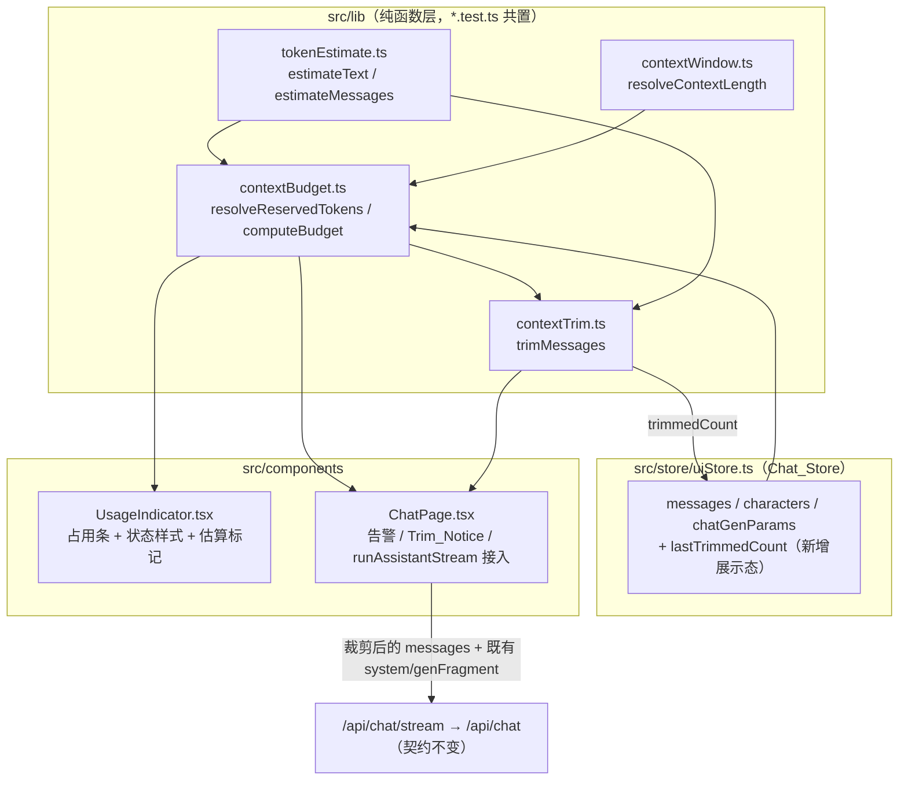

# Design Document

## Overview

「上下文窗口与 Token 预算管理」(context-window-management) 为女娲 Nuwa Web 前端引入对模型上下文窗口的**可见**与**可控**管理。它在纯前端范围内提供一套确定性能力：

1. **Token 估算**（`tokenEstimate.ts`）：对字符串与 `ChatMessage` 列表给出确定性、单调的 Token_Estimate。
2. **上下文长度解析**（`contextWindow.ts`）：从 Active_Model 解析 Context_Length，未知时回退 Default_Context_Length（`4096`）并标记 Is_Estimated。
3. **预算计算**（`contextBudget.ts`）：依据 Context_Length、System_Prompt、对话消息与 Reserved_Response_Tokens 计算 Used_Tokens / Remaining_Tokens / Usage_Ratio / Usage_State。
4. **自动裁剪**（`contextTrim.ts`）：在将超预算时确定性地丢弃最旧的非系统消息，始终保留 System_Prompt、永不丢弃 Latest_User_Message，返回应发送消息与裁剪条数。
5. **可视化与告警**（`UsageIndicator` + 告警 / Trim_Notice UI）：在 Chat_Page 呈现占用、临近/超限告警与裁剪提示。

### 设计原则

- **纯增量**：本特性不改变 Chat_Endpoint / Stream_Endpoint 的请求/响应契约。裁剪只改变随请求下发的 `messages` 内容（更少的历史消息），**不新增任何后端字段**（Req 8.5）。
- **纯逻辑下沉**：Token 估算、长度解析、预算计算、裁剪四者均为 `src/lib` 中的**纯函数**，确定性、无 I/O，与同名 `*.test.ts` 共置，可被 fast-check 属性测试覆盖。
- **状态集中**：派生的展示态（本次外发的裁剪条数等）放入 Chat_Store（`uiStore.ts`），预算本身由纯函数按 store 现有数据派生。
- **复用既有链路**：裁剪在 `ChatPage.runAssistantStream` 构造 `payloadMessages` 处接入，复用既有 `/api/chat/stream` → `/api/chat` 流式与降级链路，以及 `buildRequestFragment` 生成参数合并逻辑。
- **无回归**：不触碰 chat-session-persistence、streaming-chat-output、chat-generation-parameters、voice-interaction-loop 的既有行为（Req 8.1–8.4）。

### 关键约束与现状

- 当前 `InstalledModel`（`modelTypes.ts`）**不携带上下文长度字段**。因此 Context_Resolver 接受一个「候选上下文长度」（来自模型元数据的可选数值），无法获知时回退默认值并置 Is_Estimated。这样未来即便模型元数据补充了该字段，解析逻辑也无需改动。
- System_Prompt 当前以请求体的独立 `system` 字段下发（见 `runAssistantStream`：`body: { messages, system, ...genFragment }`），**不在 `messages` 数组内**。因此「保留 System_Prompt」在裁剪算法中天然成立——系统提示从不进入可裁剪集合，只在预算中按其 Token_Estimate 计入。
- Reserved_Response_Tokens 来自 chat-generation-parameters 的 Num_Predict（`chatGenParams.numPredict`）：Active 且为正整数取其值，否则（Inactive 或取 `-1` 的 Unlimited_Length）取 Default_Reserved_Tokens（`512`）。

## Architecture

### 模块分层与数据流



### 依赖方向

- `tokenEstimate.ts`：无依赖（仅依赖 `ChatMessage` 类型）。
- `contextWindow.ts`：无依赖（仅常量与数值校验）。
- `contextBudget.ts`：依赖 `tokenEstimate`、`contextWindow`，并复用 `generationParams` 的 `PARAM_SPECS`/`ChatGenParams` 类型以解析 Num_Predict。
- `contextTrim.ts`：依赖 `tokenEstimate`（用于复算预算是否满足）。
- `UsageIndicator.tsx` / `ChatPage.tsx`：消费上述纯函数与 store 状态，仅做渲染与编排。

这样所有可被属性测试覆盖的逻辑都集中在纯函数层，组件层只负责把派生结果映射成视图与请求体。

## Components and Interfaces

### 1. `src/lib/tokenEstimate.ts` — Token_Estimator

启发式**按字符**估算，确定性、单调（Req 1）。

```typescript
import type { ChatMessage } from '@/store/uiStore';

/** 每条消息的固定结构开销（role 包装 + 分隔符），计入消息列表估算。 */
export const MESSAGE_OVERHEAD_TOKENS = 4;

/** 单字符权重：CJK/全角等「重」字符权重高，ASCII/拉丁等「轻」字符权重低，其余取中。 */
export function charWeight(codePoint: number): number;

/** 估算单个字符串的 token 数：对各字符权重求和后向上取整。空串返回 0。 */
export function estimateText(text: string): number;

/** 估算消息列表的 token 数：Σ(estimateText(content) + MESSAGE_OVERHEAD_TOKENS)。空列表返回 0。 */
export function estimateMessages(messages: ChatMessage[]): number;
```

**估算启发式（heuristic）**

按 Unicode 码点对字符分桶并赋非负权重，再求和后 `Math.ceil`：

- CJK 统一表意文字、假名、谚文、全角符号等（码点落在 CJK 区段）：权重 `1.0`（约 1 字符 ≈ 1 token）。
- ASCII 及一般拉丁/数字/空白/标点：权重 `0.25`（约 4 字符 ≈ 1 token，贴近 BPE 经验值）。
- 其余字符（其它脚本、emoji 等）：权重 `0.5`（折中）。

`estimateText(s) = Math.ceil(Σ charWeight(cp))`，遍历 `for...of`（按码点而非 UTF-16 码元，避免把代理对拆成两半导致权重抖动）。

**为何满足单调性（Req 1.4）**：所有权重非负，故 `Σweight(A+B) = Σweight(A) + Σweight(B) ≥ Σweight(A)`；`Math.ceil` 单调不减，于是 `estimate(A+B) ≥ estimate(A)`。空串各项为空和 `0`，`ceil(0)=0`（Req 1.2）。同一输入逐字符权重固定 → 确定性（Req 1.3）。输出为非负整数（Req 1.1）。

`estimateMessages` 对每条消息加 `MESSAGE_OVERHEAD_TOKENS`（Req 1.5），空列表为空和 `0`（Req 1.6）。

### 2. `src/lib/contextWindow.ts` — Context_Resolver

```typescript
/** 当 Active_Model 的 Context_Length 无法获知时采用的缺省值。 */
export const DEFAULT_CONTEXT_LENGTH = 4096;

export interface ContextLengthResolution {
  contextLength: number; // 恒为正整数
  isEstimated: boolean;  // true 表示来自默认值（估算）
}

/**
 * 解析 Active_Model 的 Context_Length。
 * @param candidate 模型元数据中可能携带的上下文长度（当前数据源多为 undefined）。
 * - candidate 为正整数 → { contextLength: candidate, isEstimated: false }
 * - 否则（undefined/null/非正/非整/非有限）→ { contextLength: 4096, isEstimated: true }
 */
export function resolveContextLength(candidate: number | null | undefined): ContextLengthResolution;
```

判定「正整数」：`Number.isInteger(candidate) && candidate > 0`。任何不满足者一律回退默认值并置 `isEstimated=true`（Req 2.2/2.3）。返回的 `contextLength` 恒 `> 0`（Req 2.4）。

> 说明：调用方（store/组件）负责从 `parseActiveModelMap`/`InstalledModel` 取出候选值传入。由于当前模型元数据尚无该字段，实际多走默认值分支并标记估算——这正是 Is_Estimated 的设计目的。

### 3. `src/lib/contextBudget.ts` — Context_Budget

```typescript
import type { ChatMessage } from '@/store/uiStore';
import type { ChatGenParams } from '@/lib/generationParams';

export const DEFAULT_RESERVED_TOKENS = 512;
export const WARNING_THRESHOLD = 0.8;

export type UsageState = 'normal' | 'warning' | 'over';

export interface ContextBudget {
  usedTokens: number;       // System_Prompt + 全部消息
  reservedTokens: number;   // Reserved_Response_Tokens
  remainingTokens: number;  // contextLength - used - reserved（可为负）
  usageRatio: number;       // clamp((used + reserved)/contextLength, 0, 1)
  usageState: UsageState;
  contextLength: number;
  isEstimated: boolean;
}

/** 由 Num_Predict 解析 Reserved_Response_Tokens：Active 且为正整数取其值，否则取 512。 */
export function resolveReservedTokens(params: ChatGenParams): number;

/** 计算预算。systemPrompt 缺省按空串处理。 */
export function computeBudget(input: {
  contextLength: number;
  isEstimated: boolean;
  systemPrompt: string;
  messages: ChatMessage[];
  reservedTokens: number;
}): ContextBudget;
```

**计算规则**（Req 3、Req 4）

- `usedTokens = estimateText(systemPrompt) + estimateMessages(messages)`（Req 3.1）。
- `reservedTokens` 由 `resolveReservedTokens` 给出：`numPredict.active && Number.isInteger(v) && v > 0 ? v : 512`（Req 3.2）。注意 `-1`（Unlimited_Length）非正整数，走默认值。
- `remainingTokens = contextLength - usedTokens - reservedTokens`（可为负，Req 3.3）。
- `usageRatio = clamp((usedTokens + reservedTokens) / contextLength, 0, 1)`（Req 3.4）。
- `usageState`（顺序判定，Req 4）：
  1. `usedTokens + reservedTokens > contextLength` → `'over'`；
  2. 否则 `usageRatio >= 0.8` → `'warning'`；
  3. 否则 → `'normal'`。

所有输入相同 → 输出相同（纯函数，确定性，Req 3.5）。

### 4. `src/lib/contextTrim.ts` — Context_Trimmer

```typescript
import type { ChatMessage } from '@/store/uiStore';

export interface TrimResult {
  messages: ChatMessage[];  // 应发送的消息（输入的保序子序列）
  trimmedCount: number;     // 被裁剪条数 = 输入条数 - 输出条数
}

/**
 * 在将超预算时丢弃最旧的非系统消息。
 * 始终保留 Latest_User_Message；System_Prompt 不在 messages 内，天然保留。
 */
export function trimMessages(input: {
  messages: ChatMessage[];
  systemPromptTokens: number; // estimateText(systemPrompt)
  contextLength: number;
  reservedTokens: number;
}): TrimResult;
```

**裁剪算法（确定性、保序）**

记 `fixed = systemPromptTokens + reservedTokens`，`fits(list) = fixed + estimateMessages(list) <= contextLength`。

1. **已在预算内**：若 `fits(messages)` 为真，直接返回 `{ messages, trimmedCount: 0 }`（Req 6.1）。
2. 否则定位 Latest_User_Message：从后向前找最后一条 `role === 'user'` 的索引 `keepIdx`（可能不存在）。
3. 构造可裁剪队列：除 `keepIdx` 外的所有消息索引，**按出现顺序**（从最旧到最新）。
4. 依次从最旧开始标记删除一条，每删一条后用剩余消息复算 `fits`；一旦满足预算即停止（Req 6.2）。
5. 若可裁剪队列耗尽仍不满足，则停止（无法再删，Latest_User_Message 必须保留，Req 6.4）。
6. 用「未被删除」的原索引按升序重组 `messages`，得到输入的**保序子序列**（Req 6.5）；`trimmedCount = 输入.length - 输出.length`（Req 6.6）。

**保留性质**

- System_Prompt 永不进入 `messages` 数组（以 `system` 字段下发），故裁剪不可能丢弃它（Req 6.3）。
- `keepIdx` 对应的 Latest_User_Message 从不进入可裁剪队列，故必定保留（Req 6.4）。当不存在任何 user 消息时（理论边界），无需保留特定 user 消息，算法照常按最旧优先裁剪。
- 相同输入 → 相同输出（纯函数 + 确定的遍历/删除顺序，Req 6.7）。

**幂等性**：对一个已 `fits` 的列表调用返回原列表（步骤 1）；对一次裁剪的输出再次调用，由于输出已满足 `fits`（或已无可删项），将原样返回——即 `trim(trim(x)) == trim(x)`。

### 5. `src/store/uiStore.ts` — Chat_Store 扩展

仅新增**展示态**，不改动既有结构（无回归，Req 8）：

```typescript
interface UIState {
  // ...既有字段...

  /** 本次外发请求实际裁剪掉的历史消息条数（驱动 Trim_Notice）。0 表示未裁剪。 */
  lastTrimmedCount: number;
  /** 设置本次外发的裁剪条数（由 ChatPage 在构造 payload 后调用）。 */
  setLastTrimmedCount: (n: number) => void;
}
```

- `lastTrimmedCount` 初值 `0`。
- 每次发起对话请求（`handleSend` / `handleRegenerate` / `submitEdit` 经 `runAssistantStream` 前）调用 `setLastTrimmedCount(result.trimmedCount)`；这样 Trim_Notice 只反映「本次外发」的裁剪结果（Req 7.3）。
- Context_Budget 不入 store：它是 `messages` / `currentCharacter.systemPrompt` / `chatGenParams` / Active_Model 的纯派生量，组件内用 `useMemo` 计算即可，避免与持久化状态产生冗余同步。

### 6. `src/components/UsageIndicator.tsx` — Usage_Indicator

无状态展示组件，props 为一个 `ContextBudget`：

```typescript
interface UsageIndicatorProps {
  budget: ContextBudget;
}
```

渲染要点：

- 占用条：宽度按 `usageRatio` 呈现 `Used`/`Context_Length` 占比，并以文本展示 `usedTokens / contextLength`（Req 5.1）。
- 状态样式：依 `usageState` 映射不同颜色（normal=中性、warning=琥珀、over=红）（Req 5.2）。
- 估算标记：`isEstimated` 为真时显示「估算」徽标 / `~` 前缀 + tooltip 说明上下文长度为默认估算值（Req 5.3）。
- 同时展示 `remainingTokens`（剩余预算）；因 budget 由 `useMemo` 随 `messages`/参数变化重算，组件随之刷新（Req 5.4）。

### 7. `src/components/ChatPage.tsx` — 集成

**(a) 预算派生与告警 / Trim_Notice 渲染**

```typescript
const budget = useMemo(() => {
  const { contextLength, isEstimated } = resolveContextLength(activeModelContextLength);
  const reservedTokens = resolveReservedTokens(useUIStore.getState().chatGenParams);
  return computeBudget({
    contextLength, isEstimated,
    systemPrompt: currentCharacter?.systemPrompt ?? '',
    messages,
    reservedTokens,
  });
}, [messages, currentCharacter, chatGenParams, activeModelContextLength]);
```

- 在对话页头部渲染 `<UsageIndicator budget={budget} />`。
- `usageState === 'warning'` → 临近告警条（Req 7.1）；`'over'` → 超限告警条（Req 7.2）。
- `lastTrimmedCount > 0` → Trim_Notice：「已裁剪 N 条历史消息」（Req 7.3）。
- `usageState === 'normal' && lastTrimmedCount === 0` → 不渲染任何告警 / Trim_Notice（Req 7.4）。

**(b) 外发请求接入裁剪**

在 `runAssistantStream` 构造 `payloadMessages` 之前接入裁剪。关键：裁剪作用于「会话消息数组」，System_Prompt 仍走独立 `system` 字段，`genFragment` 仍由 `buildRequestFragment` 生成——**请求体形状不变**（Req 6.8、Req 8.5）：

```typescript
// payloadMessages: { role, content }[]，已含本次 user 消息（与既有逻辑一致）
const systemPrompt = currentCharacter?.systemPrompt ?? '';
const { contextLength } = resolveContextLength(activeModelContextLength);
const reservedTokens = resolveReservedTokens(useUIStore.getState().chatGenParams);

const { messages: sendMessages, trimmedCount } = trimMessages({
  messages: payloadMessagesAsChatMessages,   // 适配为 ChatMessage 形态
  systemPromptTokens: estimateText(systemPrompt),
  contextLength,
  reservedTokens,
});
useUIStore.getState().setLastTrimmedCount(trimmedCount);

// 既有契约：body 仍为 { messages, system, ...genFragment }
body: JSON.stringify({
  messages: sendMessages.map((m) => ({ role: m.role, content: m.content })),
  system: systemPrompt,
  ...genFragment,
}),
```

降级到 `/api/chat` 时使用同一 `sendMessages`，保持两条链路一致。

> 适配说明：`runAssistantStream` 当前接收的是 `{ role, content }[]`；接入时把它视作裁剪输入（必要时补一个稳定 `id`，仅用于裁剪内部的保序，不影响下发字段）。下发时只取 `role`/`content`，确保不新增后端字段。

## Data Models

### 类型汇总

| 类型 | 位置 | 字段 |
| --- | --- | --- |
| `ContextLengthResolution` | `contextWindow.ts` | `contextLength: number`（正整数）、`isEstimated: boolean` |
| `UsageState` | `contextBudget.ts` | `'normal' \| 'warning' \| 'over'` |
| `ContextBudget` | `contextBudget.ts` | `usedTokens`、`reservedTokens`、`remainingTokens`、`usageRatio`、`usageState`、`contextLength`、`isEstimated` |
| `TrimResult` | `contextTrim.ts` | `messages: ChatMessage[]`、`trimmedCount: number`（非负整数） |

### 常量

| 常量 | 值 | 含义 |
| --- | --- | --- |
| `MESSAGE_OVERHEAD_TOKENS` | `4` | 每条消息固定结构开销 |
| `DEFAULT_CONTEXT_LENGTH` | `4096` | Context_Length 缺省值 |
| `DEFAULT_RESERVED_TOKENS` | `512` | Reserved_Response_Tokens 缺省值 |
| `WARNING_THRESHOLD` | `0.8` | warning 判定阈值 |

### 复用既有类型

- `ChatMessage`（`uiStore.ts`）：`{ id, role: 'user'|'assistant', content, ... }`。Token 估算与裁剪均以此为单位。
- `ChatGenParams`（`generationParams.ts`）：用于解析 Reserved_Response_Tokens（读取 `numPredict`）。
- `InstalledModel` / `ActiveModelMap`（`modelTypes.ts`）：上下文长度候选值的来源（当前无该字段，故多走估算回退）。

## Correctness Properties

*属性（property）是一种应在系统所有有效执行中都成立的特征或行为——即关于「系统应当做什么」的形式化陈述。属性是人类可读规范与机器可验证正确性保证之间的桥梁。*

下列属性由验收标准经 prework 分析、消冗后得到。每条都是全称量化陈述，将以 fast-check 实现为单个属性测试（≥100 次迭代）。UI 渲染类（5.x、7.x）与集成/回归类（6.8、8.x）不在此列，改由示例级/集成测试覆盖（见 Testing Strategy）。

### Property 1: Token 估算非负、确定且单调

*For any* 字符串 A 与 B，`estimateText(A)` 为非负整数，重复调用结果相同，且 `estimateText(A + B) >= estimateText(A)` 与 `estimateText(A + B) >= estimateText(B)` 均成立。

**Validates: Requirements 1.1, 1.3, 1.4**

### Property 2: 消息列表估算等于各消息估算之和

*For any* `ChatMessage` 列表，`estimateMessages(list)` 等于 `Σ(estimateText(m.content) + MESSAGE_OVERHEAD_TOKENS)`；因此向列表追加任意一条消息都不会减少估算值（单调）。

**Validates: Requirements 1.5, 1.6**

### Property 3: 上下文长度解析与回退

*For any* 候选值 candidate：当 candidate 为正整数时，`resolveContextLength` 返回 `{ contextLength: candidate, isEstimated: false }`；当 candidate 为 `undefined`/`null`/非正/非整/非有限数时，返回 `{ contextLength: 4096, isEstimated: true }`；并且在所有情形下返回的 `contextLength` 恒大于 `0`。

**Validates: Requirements 2.1, 2.2, 2.3, 2.4**

### Property 4: Used_Tokens 等于系统提示与全部消息估算之和

*For any* 系统提示字符串与 `ChatMessage` 列表，`computeBudget` 产生的 `usedTokens` 等于 `estimateText(systemPrompt) + estimateMessages(messages)`。

**Validates: Requirements 3.1**

### Property 5: Reserved_Response_Tokens 由 Num_Predict 决定

*For any* `ChatGenParams`，当 `numPredict` 为 Active 且其值为正整数时 `resolveReservedTokens` 返回该值，否则（Inactive、`-1`、非正或非整）返回 `512`。

**Validates: Requirements 3.2**

### Property 6: Remaining_Tokens 等式与 Usage_Ratio 钳制

*For any* `contextLength`（正整数）、`usedTokens` 与 `reservedTokens`，`remainingTokens` 等于 `contextLength - usedTokens - reservedTokens`（允许为负），且 `usageRatio` 等于 `(usedTokens + reservedTokens) / contextLength` 钳制到 `[0, 1]` 后的值（恒落在 `[0, 1]`）。

**Validates: Requirements 3.3, 3.4**

### Property 7: 预算计算确定性

*For any* 相同的 `contextLength`、`systemPrompt`、消息列表与 `reservedTokens`，两次 `computeBudget` 调用产生深度相等的 `ContextBudget`。

**Validates: Requirements 3.5**

### Property 8: Usage_State 三态分类正确

*For any* `computeBudget` 的输入：当 `usedTokens + reservedTokens > contextLength` 时 `usageState` 为 `'over'`；否则当 `usageRatio >= 0.8` 时为 `'warning'`；否则为 `'normal'`。

**Validates: Requirements 4.1, 4.2, 4.3**

### Property 9: 未超预算时裁剪为恒等且幂等

*For any* 满足 `systemPromptTokens + reservedTokens + estimateMessages(messages) <= contextLength` 的输入，`trimMessages` 返回的 `messages` 与输入相等且 `trimmedCount` 为 `0`；并且对任意输入，`trimMessages` 的输出再次作为输入裁剪得到等价结果（`trim(trim(x)) == trim(x)`，幂等）。

**Validates: Requirements 6.1**

### Property 10: 裁剪始终保留 System_Prompt 与 Latest_User_Message

*For any* 消息列表与预算参数，`trimMessages` 的输出从不依赖或包含 System_Prompt 文本（系统提示仅计入预算、不进入 `messages`），且当输入存在 `role === 'user'` 的消息时，Latest_User_Message（出现顺序最后一条 user 消息）必定出现在输出中。

**Validates: Requirements 6.3, 6.4**

### Property 11: 裁剪输出为输入的保序子序列且优先丢弃最旧消息

*For any* 消息列表与预算参数，`trimMessages` 输出的消息 id 序列是输入消息 id 序列的保序子序列；且当输入超预算并存在可裁剪消息时，被丢弃的消息按出现顺序从最旧的非保留消息开始（即保留的非 Latest_User_Message 消息均比被丢弃的更新）。

**Validates: Requirements 6.2, 6.5**

### Property 12: trimmedCount 等于输入与输出条数之差

*For any* 消息列表与预算参数，`trimMessages` 返回的 `trimmedCount` 等于输入消息条数减去输出消息条数，且为非负整数。

**Validates: Requirements 6.6**

### Property 13: 裁剪确定性

*For any* 相同的输入消息、`systemPromptTokens`、`contextLength` 与 `reservedTokens`，两次 `trimMessages` 调用产生相同的 `TrimResult`。

**Validates: Requirements 6.7**

## Error Handling

本特性纯逻辑均为**全函数（total functions）**，对任意输入给出确定结果而非抛错，从而避免在对话主链路上引入新的失败点：

- **Token_Estimator**：对空串、超长串、含代理对/emoji/混合脚本的串均返回非负整数；按码点遍历避免代理对截断。不抛错。
- **Context_Resolver**：对 `undefined`/`null`/`NaN`/`Infinity`/`0`/负数/小数等一切非正整数候选统一回退 `4096` 并置 `isEstimated=true`；保证下游永远拿到正的 `contextLength`，杜绝除零。
- **Context_Budget**：`contextLength` 由 Resolver 保证为正整数，`usageRatio` 计算无除零风险；`remainingTokens` 允许为负（语义为「已超出可用预算」）；钳制保证 `usageRatio ∈ [0,1]`。
- **Context_Trimmer**：
  - 空消息列表 → `{ messages: [], trimmedCount: 0 }`。
  - 即便仅保留 Latest_User_Message 仍超预算 → 停止裁剪并返回（不丢弃受保护消息），由 Usage_State=`over` 与告警向用户表达，不抛错也不发出必失败的请求改写。
  - 无任何 user 消息的边界 → 按最旧优先正常裁剪，无受保护项。
- **组件层**：
  - `currentCharacter` 为空 → `systemPrompt` 取 `''`。
  - Active_Model 上下文长度缺失 → 经 Resolver 走估算分支，UI 标明「估算」。
  - `setLastTrimmedCount` 仅更新内存展示态；与持久化无关，失败不影响发送。
- **请求链路**：裁剪只减少 `messages` 条数，沿用既有 `/api/chat/stream` → `/api/chat` 降级与 `AbortError` 处理，不改变错误处理路径（Req 8.2/8.5）。

## Testing Strategy

### 双重测试取向

- **属性测试（fast-check）**：覆盖上节 13 条 Correctness Properties，验证纯逻辑在大输入空间上的普遍正确性。
- **单元/示例测试**：覆盖具体边界与 UI 渲染、以及确定性的代表性例子。
- **集成测试**：覆盖 ChatPage 接入与后端契约不变。

### 属性测试配置

- 库：`fast-check`（项目既有依赖，见 `generationParams.test.ts` 等）。**不自行实现属性测试框架**。
- 运行器：`vitest`（与现有 `*.test.ts` 一致）。运行单次用 `--run`（不进 watch）。
- 每条属性 ≥ **100** 次迭代（沿用现有约定，建议 `numRuns: 200`）。
- 每个属性测试以注释标注其设计属性，标签格式：
  `// Feature: context-window-management, Property {number}: {property_text}`
  并附 `// Validates: Requirements X.Y`。
- 文件与纯逻辑共置：
  - `src/lib/tokenEstimate.test.ts` → Property 1, 2
  - `src/lib/contextWindow.test.ts` → Property 3
  - `src/lib/contextBudget.test.ts` → Property 4, 5, 6, 7, 8
  - `src/lib/contextTrim.test.ts` → Property 9, 10, 11, 12, 13

### 生成器（Arbitraries）要点

- **字符串**：`fc.string()` 叠加 `fc.fullUnicodeString()`，确保覆盖 ASCII、CJK、emoji、代理对、空串与超长串，专门压测单调性与码点遍历。
- **ChatMessage 列表**：`fc.array(fc.record({ id: 唯一, role: fc.constantFrom('user','assistant'), content: 字符串 }))`；id 用计数器/`uuid`-like 保证唯一以便保序子序列断言。需覆盖「无 user 消息」「user 在中间/末尾」「全 assistant」等形态。
- **ChatGenParams**：复用 `generationParams.test.ts` 的 `chatGenParamsArb` 思路，重点覆盖 `numPredict` 的 Active 正整数 / Inactive / `-1` 三类。
- **预算参数**：`contextLength` 用 `fc.integer({min:1})`；为可靠触发裁剪分支，混合「极小 contextLength」与「极大 contextLength」两档输入。

### 单元 / 示例测试

- Token 估算：`estimateText('') === 0`、`estimateMessages([]) === 0`（Req 1.2/1.6 的显式示例）。
- UsageIndicator（React Testing Library）：
  - 占比文本/进度宽度存在（Req 5.1）。
  - `normal`/`warning`/`over` 三态对应样式/类名（Req 5.2）。
  - `isEstimated=true` 显示估算标记（Req 5.3）。
  - 改变 budget props 重渲染呈现更新值（Req 5.4）。
- ChatPage 告警 / Trim_Notice：
  - `warning` → 临近告警（Req 7.1）；`over` → 超限告警（Req 7.2）。
  - `lastTrimmedCount > 0` → 「已裁剪 N 条」（Req 7.3）。
  - `normal` 且 `lastTrimmedCount === 0` → 无告警/Notice（Req 7.4）。

### 集成测试

- **裁剪接入与契约不变**（Req 6.8、8.5）：mock `fetch('/api/chat/stream')`，发送使会话超预算的消息，断言：
  - 请求体 `messages` 等于 `trimMessages` 的输出（条数减少、保序）。
  - 请求体键集合恰为 `{ messages, system, ...genFragment }`，**不含任何新增后端字段**。
  - 降级到 `/api/chat` 时使用同一裁剪结果。
- **无回归**（Req 8.1–8.4）：保持既有会话持久化、流式输出、生成参数、语音交互测试套件全绿；本特性不修改既有模块的导出签名，仅新增 `lib` 纯函数、`uiStore` 展示态与组件。

### 需求覆盖映射

| 需求 | 覆盖方式 |
| --- | --- |
| 1.1, 1.3, 1.4 | Property 1 |
| 1.2, 1.6 | 示例单元测试 |
| 1.5 | Property 2 |
| 2.1, 2.2, 2.3, 2.4 | Property 3 |
| 3.1 | Property 4 |
| 3.2 | Property 5 |
| 3.3, 3.4 | Property 6 |
| 3.5 | Property 7 |
| 4.1, 4.2, 4.3 | Property 8 |
| 5.1, 5.2, 5.3, 5.4 | UsageIndicator 示例测试 |
| 6.1 | Property 9 |
| 6.2, 6.5 | Property 11 |
| 6.3, 6.4 | Property 10 |
| 6.6 | Property 12 |
| 6.7 | Property 13 |
| 6.8 | 集成测试 |
| 7.1, 7.2, 7.3, 7.4 | ChatPage 示例测试 |
| 8.1, 8.2, 8.3, 8.4 | 回归测试套件 |
| 8.5 | 集成测试（请求体键集合断言） |
