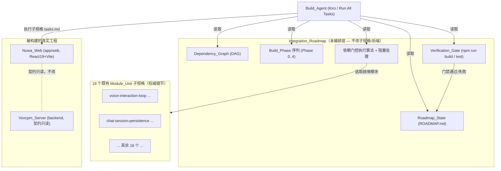
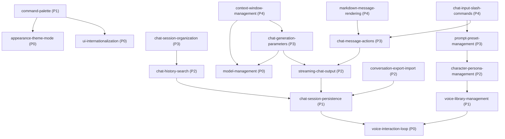

# Design Document

## Overview

「集成路线图」(integration-roadmap) 是一份**编排层设计**：它不重写、不修改任何既有子规格的 `requirements.md` / `design.md` / `tasks.md`，也不改动 Voxcpm_Server 的 API 契约。它的职责是把 18 个既有 Module_Unit 编排成一条**依赖有序、可门控、可恢复、可无人值守长时运行**的构建流水线，供 Build_Agent（Kiro 经「Run All Tasks」）端到端驱动。

本设计要落地以下七件事：

1. **依赖图与构建相位**：把需求 R2.6 的全部 Dependency_Edge 固化为一张 DAG，并拓扑分层为 5 个有序 Build_Phase（Phase 0 = 4 个 Foundation_Module），为每个相位定义 Milestone。
2. **Roadmap_State 设计**：一个可持久化、人类可读、可被 Build_Agent 读写的进度文件（`.kiro/specs/integration-roadmap/ROADMAP.md`），记录每个模块的 Module_Status 与各 Verification_Gate 结果，使中断后可恢复（R10）。
3. **每模块 Definition_Of_Done 与 Verification_Gate**：以真实可自动执行的命令（`npm run build`、`npm run test`）表述的门禁序列（R5）。
4. **依赖门控执行算法**：Build_Agent 的选取规则与阻塞/韧性处理（R7、R9）。
5. **集成点与集成测试**：把每个 Integration_Point 映射到「拥有者 / 消费者」模块，并定义所需的集成 / 往返属性测试（R4、R6）。
6. **无人值守长时编排**：如何组织成单次「Run All Tasks」可端到端驱动、且不被监视进程挂起（R8）。
7. **正确性属性**：把路线图机制（门控不变量、无环、相位单调、状态一致性）表述为可做属性测试的执行规约（R7、R10、R3）。

### 真实技术栈与命令（基于代码勘察）

`app/web/package.json` 给出 Nuwa_Web 的真实脚本（React 19 + TypeScript + Vite + Vitest + fast-check）：

| 用途 | 命令 | 说明 |
| --- | --- | --- |
| 构建 / 编译 | `npm run build` | 实为 `tsc && vite build`，先做全量类型检查再产物构建（满足 R11.1 的「构建可通过」与 R5.2 的「编译通过」） |
| 单元 + 属性测试（单次） | `npm run test` | 实为 `vitest --run`，**单次执行模式**而非监视模式，天然满足 R8.3（不被长时进程挂起） |
| 代码规范（可选门） | `npm run lint` | `eslint`，作为非阻断辅助检查 |
| 开发服务器（禁用于门禁） | `npm run dev` | `vite`，**长时进程，绝不**进入 Verification_Gate |

测试库 `fast-check@^3` 与 `vitest@^3` 已在 devDependencies 中就绪；`fake-indexeddb`、`@testing-library/react` 亦可用于 Chat_DB 与组件级集成测试。所有门禁命令均在 `app/web` 目录下执行。

> 说明：`vitest --run` 为单次运行，是 R8.3「以单次执行模式运行验证」的关键。任何 `--watch` / `dev` / `preview` 均被排除在 Verification_Gate 之外。

### 子规格引用（Sub_Spec_Reference）

本路线图通过引用而非内联描述各模块细节。每个 Module_Unit 的权威需求/设计/任务见其子规格目录，例如：

- #[[file:.kiro/specs/voice-interaction-loop/requirements.md]] / #[[file:.kiro/specs/voice-interaction-loop/design.md]] / #[[file:.kiro/specs/voice-interaction-loop/tasks.md]]
- #[[file:.kiro/specs/chat-session-persistence/design.md]]
- #[[file:.kiro/specs/streaming-chat-output/design.md]]
- #[[file:.kiro/specs/conversation-export-import/design.md]]

（其余 14 个模块的引用以同构路径 `.kiro/specs/<module>/{requirements,design,tasks}.md` 给出，见下文「模块清单与范围」表。）

## Architecture

### 编排层定位



Build_Agent 永远以「相位升序 + 依赖就绪 + 门禁通过」三条规则驱动；Roadmap_State 是它与磁盘之间唯一的持久真相源（single source of truth），保证中断可恢复。

### 模块清单与范围（Module_Scope，R1）

18 个 Module_Unit 与子规格目录一一对应（R1.1）。每项能力仅归属一个模块（R1.5）；细节经 Sub_Spec_Reference 引用，不在此复制验收标准（R1.4）。

| 模块（目录名） | 缩写 | Module_Scope（负责能力 / 明确排除） | 子规格引用 |
| --- | --- | --- | --- |
| voice-interaction-loop | VIL | 端到端语音闭环（ASR/TTS 对接 `/api/inference/*`）、当前模型选择、VoxCPM 死代码清理。**排除**：会话持久化、流式 | `.kiro/specs/voice-interaction-loop/*` |
| model-management | MM | 模型列表/选择、`/api/config`、`/api/config/set-model`。**排除**：生成参数 | `.kiro/specs/model-management/*` |
| ui-internationalization | I18N | 多语言文案与切换框架。**排除**：主题、命令面板 | `.kiro/specs/ui-internationalization/*` |
| appearance-theme-mode | ATM | 明暗主题与外观模式。**排除**：i18n、命令面板 | `.kiro/specs/appearance-theme-mode/*` |
| chat-session-persistence | CSP | Chat_DB(IndexedDB) 数据层、会话生命周期、自动标题、恢复/降级。**排除**：搜索、导入导出、流式 | `.kiro/specs/chat-session-persistence/*` |
| voice-library-management | VLM | 音色库管理（基于 `/api/voices` 与 `/api/inference/*` 预览）。**排除**：角色绑定 | `.kiro/specs/voice-library-management/*` |
| command-palette | CP | 全局命令面板（基于主题与 i18n 框架）。**排除**：斜杠命令 | `.kiro/specs/command-palette/*` |
| streaming-chat-output | SCO | 打字机式流式渲染、`POST /api/chat/stream`。**排除**：消息操作 | `.kiro/specs/streaming-chat-output/*` |
| chat-history-search | CHS | 会话/消息检索（基于 Chat_DB 语料）。**排除**：会话分组 | `.kiro/specs/chat-history-search/*` |
| conversation-export-import | CEI | 会话 JSON 无损往返、Markdown 导出、JSON 导入。**排除**：搜索 | `.kiro/specs/conversation-export-import/*` |
| character-persona-management | CPM | 角色人设管理与音色绑定（基于音色库）。**排除**：预设 | `.kiro/specs/character-persona-management/*` |
| chat-session-organization | CSO | 会话分组/归档/置顶（基于搜索）。**排除**：检索算法本身 | `.kiro/specs/chat-session-organization/*` |
| chat-message-actions | CMA | 消息级操作（复制/重生成/删除等，基于流式）。**排除**：Markdown 渲染 | `.kiro/specs/chat-message-actions/*` |
| chat-generation-parameters | CGP | 生成参数（temperature 等，作用于流式 + 模型）。**排除**：上下文窗口 | `.kiro/specs/chat-generation-parameters/*` |
| prompt-preset-management | PPM | 提示词预设（基于角色人设）。**排除**：斜杠命令触发 | `.kiro/specs/prompt-preset-management/*` |
| markdown-message-rendering | MMR | Markdown 消息渲染（基于消息操作）。**排除**：流式协议 | `.kiro/specs/markdown-message-rendering/*` |
| context-window-management | CWM | 上下文窗口裁剪（基于模型 + 生成参数）。**排除**：参数 UI | `.kiro/specs/context-window-management/*` |
| chat-input-slash-commands | CISC | 斜杠命令解析与执行（基于预设 + 消息操作）。**排除**：命令面板 | `.kiro/specs/chat-input-slash-commands/*` |

### 依赖图（Dependency_Graph，R2）

下图节点为全部 18 个 Module_Unit，有向边 `A --> B` 表示「A 依赖 B」（B 为 A 的 Upstream_Dependency，须先完成 B）。边集完整对应 R2.6。



**每个模块的直接 Upstream_Dependency（R2.4）**：

| 模块 | 直接上游 |
| --- | --- |
| voice-interaction-loop | （无 — Foundation_Module，R2.5） |
| model-management | （无 — Foundation_Module） |
| ui-internationalization | （无 — Foundation_Module） |
| appearance-theme-mode | （无 — Foundation_Module） |
| chat-session-persistence | voice-interaction-loop |
| voice-library-management | voice-interaction-loop |
| command-palette | appearance-theme-mode, ui-internationalization |
| streaming-chat-output | chat-session-persistence |
| chat-history-search | chat-session-persistence |
| conversation-export-import | chat-session-persistence |
| character-persona-management | voice-library-management |
| chat-session-organization | chat-history-search |
| chat-message-actions | streaming-chat-output |
| chat-generation-parameters | model-management, streaming-chat-output |
| prompt-preset-management | character-persona-management |
| markdown-message-rendering | chat-message-actions |
| context-window-management | model-management, chat-generation-parameters |
| chat-input-slash-commands | prompt-preset-management, chat-message-actions |

该图无环（R2.3）：下文 Build_Phase 给出一个合法拓扑分层，分层的存在即构成无环的构造性证明。

### 构建相位与里程碑（Build_Phase，R3）

按「最长上游路径」拓扑分层，每个模块的 Phase_Order = max(其各上游的 Phase_Order) + 1，Foundation_Module 为 0。该规则保证任一边都从高相位指向低相位，即每模块相位严格大于其每个上游（R3.3），且同相位内无边（R3.4）。

| Phase_Order | 模块（同相位可任意次序，R3.4/R7.3） | Milestone |
| --- | --- | --- |
| **0** | voice-interaction-loop, model-management, ui-internationalization, appearance-theme-mode（4 个 Foundation_Module，R3.5） | **M0 基座就绪**：语音闭环、模型管理、i18n、主题四项可独立运行且构建/测试通过 |
| **1** | chat-session-persistence, voice-library-management, command-palette | **M1 持久化与库基座**：会话可持久化恢复，音色库可用，命令面板可用 |
| **2** | streaming-chat-output, chat-history-search, conversation-export-import, character-persona-management | **M2 对话核心增强**：流式输出、历史检索、导入导出、角色人设可用 |
| **3** | chat-session-organization, chat-message-actions, chat-generation-parameters, prompt-preset-management | **M3 交互与参数**：会话组织、消息操作、生成参数、提示词预设可用 |
| **4** | markdown-message-rendering, context-window-management, chat-input-slash-commands | **M4 全功能完成**：Markdown 渲染、上下文窗口管理、斜杠命令可用，18 模块全部 Done |

合计 4+3+4+4+3 = 18 个模块，恰好覆盖全集且每模块归属唯一相位（R3.2）。Build_Agent 按 Phase_Order 升序推进，低相位全部 Done 后才进入更高相位（R7.4）。

## Components and Interfaces

### 集成点台账（Integration_Point，R4）

每个 Integration_Point 标注「拥有者（首次建立契约的模块，R4.4）」与「消费者」，并标注其被哪些 Dependency_Edge 依赖（R4.1）。所有扩展须向后兼容（R4.3）。

| Integration_Point | 拥有者 | 消费者（经依赖边） | 兼容性约束 |
| --- | --- | --- | --- |
| `uiStore`（Zustand 全局状态切片：settings / characters / currentPage 等） | voice-interaction-loop | CSP（扩展 Chat_Store 切片）、CEI、CSO、CMA、CGP、CWM、CP、ATM、I18N、CPM、PPM | 新增切片/字段须为可选或带默认值，既有切片读写语义不变（R4.3） |
| `Chat_DB`（IndexedDB 数据层 `lib/chatDb.ts`） | chat-session-persistence | streaming-chat-output（经 appendMessage 持久化）、chat-history-search、chat-session-organization、conversation-export-import、chat-message-actions | 新增对象库/索引以版本升级方式增量进行，既有读写接口签名不变 |
| `POST /api/chat`（对话契约） | （基线，VIL 时代既有） | streaming-chat-output（降级路径）、chat-message-actions、chat-generation-parameters、context-window-management | 请求/响应契约只读不改（R11.3） |
| `POST /api/chat/stream`（流式 NDJSON 契约） | streaming-chat-output | chat-message-actions（重生成）、chat-generation-parameters（带参流式）、context-window-management（裁剪后请求） | 新增字段（如生成参数）以可选项透传，缺省行为不变 |
| `GET /api/voices`（音色列表） | voice-interaction-loop | voice-library-management、character-persona-management | 只读消费，不改后端响应结构 |
| `/api/inference/*`（ASR/TTS 推理） | voice-interaction-loop | voice-library-management（预览合成）、character-persona-management（绑定音色试听） | 外部服务行为，按 R6.4 用少量代表用例/mock 验证 |
| `/api/config` 与 `/api/config/set-model`（模型选择） | model-management | voice-interaction-loop（读取 current_models）、chat-generation-parameters、context-window-management | 只读/写既有字段，新增配置项向后兼容 |
| TTS 自动朗读（autoPlay 规则） | voice-interaction-loop | streaming-chat-output（定型后单次 TTS）、chat-message-actions（手动重放） | autoPlay 触发时机与既有规则一致，不重复朗读 |

### Roadmap_State 设计（R10）

Roadmap_State 持久化为单一 Markdown 文件 **`.kiro/specs/integration-roadmap/ROADMAP.md`**，由 Build_Agent 在每次 Module_Status 变更时读写（R10.1）。选用 Markdown 复选框清单的理由：人类可读、可在 IDE 直接审阅、对中断鲁棒（纯文本、任意时点都是完整快照）、且 Build_Agent 易于按行解析与原子重写。

**精确格式**（每个模块一节，按 Phase_Order 升序排列）：

```markdown
# Integration Roadmap State

<!-- Build_Agent 维护；每次状态变更后整文件原子重写。状态枚举：Pending|In_Progress|Done|Blocked -->

## Phase 0 — M0 基座就绪
- [ ] voice-interaction-loop — status: Done
      upstreams: (none)
      gate.build: pass        # npm run build
      gate.test: pass         # npm run test (vitest --run)
      gate.regression: pass   # 既有已 Done 模块测试复跑
      gate.integration: n/a   # 无上游则可为 n/a (R6.1)
      blocker: (none)
      attempts: 1
      updatedAt: 2025-01-01T00:00:00Z
- [ ] model-management — status: Pending
      upstreams: (none)
      gate.build: -
      gate.test: -
      gate.regression: -
      gate.integration: -
      blocker: (none)
      attempts: 0
      updatedAt: -
...

## Phase 1 — M1 持久化与库基座
- [ ] chat-session-persistence — status: Pending
      upstreams: voice-interaction-loop
      ...
```

字段语义：

- `status`：Module_Status 之一（Pending / In_Progress / Done / Blocked）。复选框 `[x]` 当且仅当 `status: Done`。
- `upstreams`：该模块直接上游列表，便于门控自检（R10.4 一致性校验依据）。
- `gate.build / gate.test / gate.regression / gate.integration`：四道 Verification_Gate 的结果（`pass` / `fail` / `-`(未跑) / `n/a`）。
- `blocker`：当 `status: Blocked` 时记录具体 Blocker 文本（R9.1）。
- `attempts`：同一模块的连续构建尝试次数，用于 R9.4「连续两次同因失败→停止重试」。
- `updatedAt`：ISO 时间戳，最近一次状态变更时间。

**恢复语义（R10.3）**：Autonomous_Run 重启时，Build_Agent 解析 ROADMAP.md，跳过所有 `status: Done` 的模块，从下一个「全部上游为 Done 且自身非 Blocked」的就绪模块继续。**一致性不变量（R10.4）**：任一 `Done` 模块的全部 `upstreams` 也必须为 `Done`，否则视为状态文件损坏，Build_Agent 暂停并报告。

### Definition_Of_Done 与 Verification_Gate（R5）

每个 Module_Unit 共享同一套**可自动执行**的 Definition_Of_Done（R5.1/R5.6），仅「自身子规格 tasks 全完成」与「集成测试对象」因模块而异。一个模块进入 Done_Status 当且仅当下列全部门禁通过（R5.3/R5.4），且仅依赖自身与上游、不依赖任何下游（R5.5）：

**Verification_Gate 序列（在 `app/web` 下顺序执行，任一失败即中止并置 Blocked）**：

1. **Tasks 完成门**：该模块 `tasks.md` 中全部任务标记为完成（`[x]`）。
2. **构建门**：`npm run build`（= `tsc && vite build`）退出码为 0（R5.2、R11.1）。
3. **单元 + 属性测试门**：`npm run test`（= `vitest --run`，单次模式）全绿，含该模块的单元测试、属性测试（≥100 次迭代）与集成测试（R5.2、R6.2、R8.3）。
4. **回归门**：复跑既有已 Done 模块的测试集合（Regression_Suite）。因 `vitest --run` 默认运行整个 `app/web` 测试目录，单次 `npm run test` 即同时覆盖「本模块测试」与「全部既有模块测试」，故回归门与测试门可由同一次 `npm run test` 共同满足（R11.2/R11.5）。
5. **集成测试门**（仅当模块有上游，R6.1/R6.2）：该模块至少一个覆盖与上游 Integration_Point 交互的 Integration_Test 通过；涉及解析/序列化的模块须含往返属性测试（R6.3）；涉及外部服务的须用 1–3 个代表用例或 mock（R6.4）。

```mermaid
flowchart TD
    Start["选中就绪模块 M"] --> T1{"tasks.md 全部完成?"}
    T1 -- 否 --> Exec["执行 M 的 tasks.md"] --> T1
    T1 -- 是 --> B["npm run build"]
    B -->|exit≠0| Fail["门禁失败"]
    B -->|exit=0| Test["npm run test (vitest --run)"]
    Test -->|有失败| Fail
    Test -->|全绿(含本模块+回归+集成)| Done["标记 M = Done, 写 ROADMAP.md"]
    Fail --> Blocked["按 R9 处理: 记录 Blocker / attempts++"]
```

### 依赖门控执行算法（R7、R9）

Build_Agent 的核心选取与韧性逻辑（伪代码）：

```text
function runAll(state):                      # state = 解析后的 Roadmap_State
  loop:
    ready = [m for m in modules
             if state[m].status in {Pending}
             and all(state[u].status == Done for u in upstreams(m))   # R7.1/R7.2
             and not anyUpstreamBlocked(m)]                            # R9.3
    # 按 Phase_Order 升序优先；同相位任意次序 (R7.3/R7.4)
    ready = sortByPhaseOrder(ready)
    if ready is empty:
      if all modules Done: report "ALL DONE"; persistMilestones(); return
      else: report "STALLED: 剩余模块被 Blocked 或其上游 Blocked"; return   # 优雅退出

    m = ready[0]
    setStatus(m, In_Progress); persist(state)            # R10.1
    executeTasks(m)                                       # 跑子规格 tasks.md
    result = runVerificationGate(m)                       # build → test → 回归 → 集成
    if result == pass:
      setStatus(m, Done); persist(state)                  # R5.3
      markMilestoneIfPhaseComplete(phaseOf(m))            # R7.5
      continue                                            # 自动继续下一个就绪模块 (R8.1)
    else:
      state[m].attempts += 1
      if state[m].attempts >= 2 and sameBlockerAsLast(m, result.blocker):  # R9.4
        setStatus(m, Blocked); state[m].blocker = result.blocker
        persist(state); continue        # 停止重试该模块，转去其它就绪模块 (R9.2)
      else:
        setStatus(m, Blocked); state[m].blocker = result.blocker  # 暂置 Blocked
        persist(state); continue        # 下一轮若上游仍 Done 可再尝试一次
```

要点：

- **门控（R7.1/R7.2）**：只选「全部上游 Done」的模块；存在未完成上游则绝不开始。
- **相位推进（R7.4）**：`sortByPhaseOrder` 保证低相位优先，等价于低相位全 Done 才进高相位。
- **阻塞绕行（R9.2）**：某模块 Blocked 时，算法继续选取**不经过该被阻塞模块**的其它就绪模块。
- **下游冻结（R9.3）**：`anyUpstreamBlocked` 使被阻塞模块的全部下游保持 Pending、不进入 In_Progress。
- **两次同因熔断（R9.4）**：连续两次同一 Blocker 失败即固定 Blocked 并留待人工，避免空耗无人值守时间。
- **恢复（R9.5/R10.3）**：人工解除 Blocker 后重跑，`runVerificationGate` 通过则该模块及其下游恢复推进。
- **破坏性操作暂停（R8.5）**：若某模块子规格涉及删除数据 / 改后端契约 / 生产变更，算法在该步暂停并请求人工确认，不自动执行。

### 集成测试矩阵（R6）

| 模块 | 上游 Integration_Point | 所需 Integration_Test | 往返/特殊要求 |
| --- | --- | --- | --- |
| chat-session-persistence | uiStore | Chat_DB ↔ Chat_Store 写入后重载恢复（fake-indexeddb） | 会话/消息 save→load 往返属性 |
| voice-library-management | /api/voices, /api/inference/* | 音色列表加载 + 预览合成 mock（1–3 用例，R6.4） | 外部服务用 mock |
| command-palette | uiStore(主题/i18n) | 面板命令触发主题切换/语言切换 | — |
| streaming-chat-output | Chat_DB, /api/chat | NDJSON 流解析 + 定型后单次 appendMessage 持久化 | NDJSON 行解析往返属性（R6.3） |
| chat-history-search | Chat_DB | 跨会话语料检索命中 | — |
| conversation-export-import | Chat_DB | 导出→导入新建会话不覆盖既有 | **JSON 无损往返属性**（R6.3，`parseImportBundle(JSON.stringify(buildExportBundle(x)))`） |
| character-persona-management | /api/voices(音色绑定) | 角色绑定音色后对话页生效 | — |
| chat-session-organization | Chat_DB(搜索语料) | 分组/置顶与检索联动 | — |
| chat-message-actions | /api/chat/stream | 重生成走流式链路 | — |
| chat-generation-parameters | /api/config, /api/chat/stream | 带参数的流式请求透传 | 参数序列化往返（如适用） |
| prompt-preset-management | uiStore(角色) | 预设应用到角色系统提示 | 预设 JSON 往返（如适用） |
| markdown-message-rendering | 消息体 | 渲染含代码块/链接的消息 | — |
| context-window-management | /api/config, 生成参数 | 裁剪后历史长度受限 | 裁剪幂等/不变量属性 |
| chat-input-slash-commands | 预设, 消息操作 | 斜杠命令解析并执行 | **斜杠命令解析往返属性**（R6.3） |

### 无人值守长时编排（R8）

- **单次驱动（R8.2）**：把 18 个模块组织为「Run All Tasks」可连续消费的任务序列；序列内顺序即拓扑序（相位升序、同相位任意），每个模块的任务集来自其子规格 `tasks.md`。
- **单次执行验证（R8.3）**：所有门禁命令为单次退出型（`npm run build`、`vitest --run`）；严禁 `vite`(dev)、`vitest`(watch)、`vite preview` 等长时进程进入门禁，避免挂起 Autonomous_Run。
- **无人判定（R8.4）**：门禁结论完全由命令退出码 / 测试结果决定，无需人工判断。
- **自动续跑（R8.1）**：模块 Done 后若仍有就绪模块，算法立即继续，不要求人工确认。
- **安全暂停（R8.5）**：仅对破坏性/不可逆操作暂停请求确认。

## Data Models

路线图机制的核心数据模型（用于执行算法与属性测试，TypeScript 表述）：

```ts
type ModuleStatus = 'Pending' | 'In_Progress' | 'Done' | 'Blocked';
type GateResult = 'pass' | 'fail' | 'n/a' | '-';

interface ModuleNode {
  id: string;                 // 子规格目录名，唯一
  upstreams: string[];        // 直接 Upstream_Dependency 的 id 列表
  phaseOrder: number;         // 0..4
}

interface ModuleState {
  id: string;
  status: ModuleStatus;
  gates: { build: GateResult; test: GateResult; regression: GateResult; integration: GateResult };
  blocker: string | null;
  attempts: number;           // 连续尝试次数，用于 R9.4
  lastBlocker: string | null; // 上次失败的 Blocker，用于「同因」判定
  updatedAt: string | null;   // ISO 时间戳
}

interface DependencyGraph {
  nodes: ModuleNode[];        // 18 个
  // edge A->B 表示 A 依赖 B，存于 node.upstreams
}

interface RoadmapState {
  modules: Record<string, ModuleState>;  // 以 id 为键
}

// 纯函数（可属性测试的路线图机制）
function isAcyclic(g: DependencyGraph): boolean;
function topoPhases(g: DependencyGraph): Map<string, number>;       // 计算 phaseOrder
function readyModules(g: DependencyGraph, s: RoadmapState): string[]; // 门控选取
function canMarkDone(g: DependencyGraph, s: RoadmapState, id: string): boolean;
function isStateConsistent(g: DependencyGraph, s: RoadmapState): boolean; // R10.4
```

数据模型刻意保持为**纯结构 + 纯函数**：`DependencyGraph` 与 `RoadmapState` 不含 I/O，门控/分层/一致性判定均为可重复、可随机生成输入的纯函数，从而适合属性测试（见下文 Correctness Properties）。Roadmap_State 的磁盘形态为前述 `ROADMAP.md`，与该内存模型之间通过解析/序列化互转。

## Correctness Properties

*属性（property）是在系统所有合法执行下都应成立的特征或行为——即对系统应当做什么的形式化陈述。属性是人类可读规约与机器可验证正确性保证之间的桥梁。*

本路线图的「机制」（依赖图分层、依赖门控、状态机转移、恢复、状态序列化）是一组**纯函数与纯结构**（见 Data Models 的 `isAcyclic` / `topoPhases` / `readyModules` / `canMarkDone` / `isStateConsistent`），因此适合属性测试。下列属性既适用于随机生成的合法模块图/状态，也适用于本路线图固定的 18 节点图。被编排的各业务模块自身的功能属性由其子规格承载，不在此重复。

### Property 1: 依赖图无环

*For any* 由本路线图定义的依赖图（以及任意随机生成的合法 DAG），`isAcyclic` 应返回真；而对任意人为注入回边的图应返回假。等价地，固定 18 节点图能被 `topoPhases` 成功分层。

**Validates: Requirements 2.3**

### Property 2: 相位严格单调（含同相位无边）

*For any* 依赖图与其 `topoPhases` 结果，对每一条依赖边 `A -> B`（A 依赖 B）都有 `phase(A) > phase(B)`；由此推论，同一相位内任意两模块之间不存在依赖边。

**Validates: Requirements 3.3, 3.4**

### Property 3: 门控就绪只选上游全完成者

*For any* 依赖图与任意 Roadmap_State，`readyModules` 返回的每个模块，其全部 Upstream_Dependency 在该状态下均为 Done_Status；反之，任何存在未 Done 上游的模块都不会出现在 `readyModules` 中。

**Validates: Requirements 7.1, 7.2**

### Property 4: 相位升序优先

*For any* 依赖图与任意 Roadmap_State，Build_Agent 从 `readyModules` 选取的首选模块，其 `phaseOrder` 不大于该状态下任何其它就绪模块的 `phaseOrder`（即低相位优先，等价于低相位全部完成前不会优先推进更高相位）。

**Validates: Requirements 7.4**

### Property 5: 完成判定仅依赖自身与上游

*For any* 依赖图、任意 Roadmap_State 与任意模块 `m`，在仅改变 `m` 的任意下游（直接或间接依赖 `m` 的）模块状态时，`canMarkDone(m)` 的结果保持不变；即完成判定不读取任何下游状态。

**Validates: Requirements 5.5**

### Property 6: 被阻塞模块的下游冻结且不被重试选取

*For any* 依赖图与任意 Roadmap_State，若模块 `b` 处于 Blocked_Status，则 `b` 的全部传递闭包下游都不出现在 `readyModules` 中（保持 Pending、不进入 In_Progress）；并且当某模块因同一 Blocker 连续两次失败（`attempts >= 2` 且同因）后，它本身也不再被 `readyModules` 选作重试。

**Validates: Requirements 9.3, 9.4**

### Property 7: 状态一致性不变量保持

*For any* 从一致初始状态出发、仅在 `canMarkDone` 为真时才将模块置为 Done 的合法状态转移序列，每一步之后 `isStateConsistent` 仍为真——即任一 Done_Status 模块的全部 Upstream_Dependency 也处于 Done_Status。

**Validates: Requirements 10.4**

### Property 8: 中断恢复等价（model-based）

*For any* 由合法执行产生的一致中间 Roadmap_State，从该状态恢复运行 `runAll` 直至稳定，不会重复构建已 Done 的模块，且最终到达的 Done 模块集合与从空白状态完整运行所得一致。

**Validates: Requirements 10.3**

### Property 9: Roadmap_State 序列化往返

*For any* 合法的 Roadmap_State，将其序列化为 `ROADMAP.md` 文本再解析回内存模型，应得到与原始等价的 Roadmap_State（每个模块的 status / gates / blocker / attempts / upstreams 一致）。

**Validates: Requirements 10.1, 10.2**

### Property 10: 集成点解析/序列化往返

*For any* 涉及解析或序列化的 Integration_Point（会话导出/导入 JSON、斜杠命令、按键组合），其对应 Module_Unit 的「构造 → 序列化 → 解析」应还原等价结构（如 `parseImportBundle(JSON.stringify(buildExportBundle(x)))` 还原 x 的 role/content 等核心字段）。此属性在对应子规格内实现，路线图要求其存在。

**Validates: Requirements 6.3**

## Error Handling

| 错误/异常场景 | 触发条件 | 处理策略 | 关联需求 |
| --- | --- | --- | --- |
| 构建失败 | `npm run build` 退出码非 0（类型错误/打包错误） | 该模块不得进入 Done；置 Blocked，记录 Blocker（构建日志摘要），`attempts++` | R5.4, R9.1, R11.1 |
| 测试失败 | `npm run test` 有用例失败（本模块或回归） | 同上置 Blocked；若为回归失败，Blocker 标注被破坏的既有模块 | R5.4, R9.1, R11.2 |
| 连续两次同因失败 | 同一 Blocker 连续两次出现 | 固定 Blocked，停止重试，留待人工（不空耗无人值守时间） | R9.4 |
| 上游未完成 | 选取时上游非全 Done | `readyModules` 直接排除，不开始构建 | R7.2 |
| 上游被阻塞 | 上游处于 Blocked | 下游保持 Pending，不进入 In_Progress；算法绕行其它就绪模块 | R9.2, R9.3 |
| Roadmap_State 不一致 | 解析到「Done 模块存在非 Done 上游」 | 视为状态文件损坏，暂停并报告人工，不继续自动推进 | R10.4 |
| 破坏性/不可逆操作 | 子规格步骤涉及删数据/改后端契约/生产变更 | Autonomous_Run 暂停并请求人工确认，不自动执行 | R8.5, R11.3 |
| 外部服务不可用 | Ollama / ASR / TTS 子进程异常 | 集成测试用 mock/代表用例隔离；真实不可用按子规格的降级语义处理，不阻断路线图机制 | R6.4 |
| 中断恢复 | Autonomous_Run 被打断后重启 | 读 ROADMAP.md，跳过 Done，从下一就绪模块继续 | R10.3 |

## Testing Strategy

### 双轨测试

- **单元 / 示例测试**：覆盖固定结构与具体场景——18 节点与目录一一对应（R1.1）、R2.6 指定边逐条存在、4 个 Foundation 无上游（R2.5）、各相位成员与 Milestone 定义（R3.5/R3.6）、集成点台账拥有者归属（R4.4）。
- **属性测试**：覆盖上述 Correctness Properties 中的路线图机制（Property 1–9），用随机生成的合法模块图与 Roadmap_State 验证普遍不变量。
- **集成测试**：按「集成测试矩阵」为每个有上游的模块至少一条覆盖上游 Integration_Point 的测试（R6.1/R6.2）；外部服务用 1–3 代表用例或 mock（R6.4）。

### 属性测试配置（PBT 适用部分）

- 库：`fast-check@^3`（已在 `app/web/devDependencies`），运行器 `vitest@^3`，单次模式 `vitest --run`。
- 每个属性测试**最少 100 次迭代**（`fc.assert(fc.property(...), { numRuns: 100 })`）。
- 每个属性测试以注释标注其设计属性，标签格式：
  `// Feature: integration-roadmap, Property {number}: {property_text}`
- 每条 Correctness Property 用**单个**属性测试实现；不自行从零实现属性测试框架。
- 生成器：自定义 `arbitraryDag`（保证无环，用于 Property 1–4、6）、`arbitraryConsistentState`（从一致初态做合法转移，用于 Property 7–8）、`arbitraryRoadmapState`（用于序列化往返 Property 9）。

### 冒烟 / 命令门禁（不做属性测试）

- 在 `app/web` 下单次执行 `npm run build` 与 `npm run test`，确认门禁命令本身可通过（R5.6/R8.3/R8.4/R11.1）。
- 绝不在测试或门禁中启动 `vite`(dev) / `vitest`(watch) / `vite preview` 等长时进程。

### 路线图机制测试的落点

路线图机制的纯函数与属性测试建议置于本编排层可独立运行的位置（例如 `app/web/src/lib/roadmap/` 下的 `graph.ts` / `state.ts` 及其 `*.test.ts`），使其与 18 个业务模块解耦、可被 `vitest --run` 一并执行，从而既验证编排正确性又纳入统一的回归门。被编排的业务模块自身的单元/属性/集成测试，按各子规格 `tasks.md` 实现，不在本路线图重复定义。
