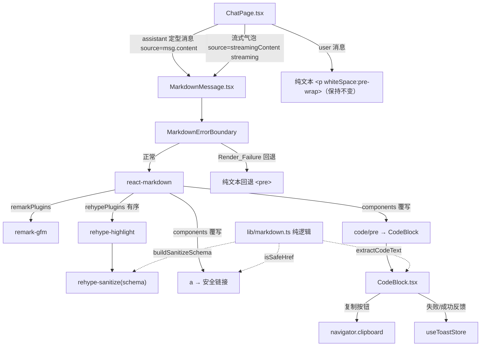
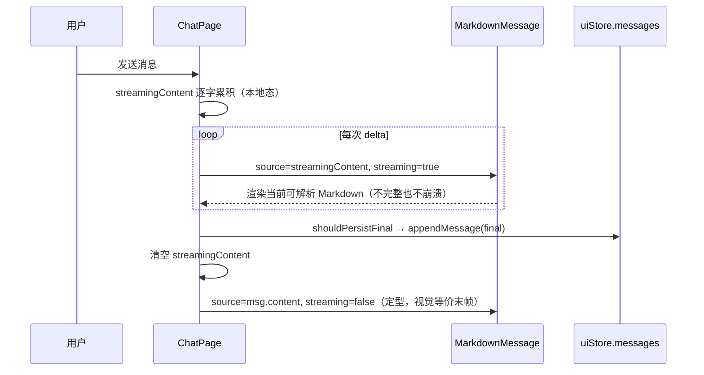

# Design Document

## Overview

本设计为"女娲 Nuwa"前端聊天页面（`app/web/src/components/ChatPage.tsx`）引入安全的 Markdown 渲染能力。当前 assistant 消息与流式占位气泡均以纯文本渲染（`<p style={{ whiteSpace: 'pre-wrap' }}>{msg.content}</p>`）。本特性将 assistant 的已定型消息与流式进行中内容渲染为结构化、经净化的 Markdown，同时保持 user 消息为纯文本，并确保既有流式输出、TTS 自动朗读、消息操作、会话持久化、语音循环与搜索等行为零回归。

设计遵循需求文档中的六条核心约束：安全第一（不可信模型输出必须净化）、流式健壮性（不完整 Markdown 不崩溃）、优雅降级（渲染失败回退原文）、零回归、主题一致、前端独立（不动后端契约）。

### 关键设计决策

1. **库选型（Req 12）**：采用 `react-markdown` 作为渲染核心。它默认安全（不使用 `dangerouslySetInnerHTML`，CommonMark 合规），并通过 remark/rehype 插件生态扩展能力：
   - `remark-gfm` —— GFM 构造（表格、删除线、任务列表、自动链接）。
   - `rehype-highlight` —— 基于 highlight.js 的语言感知语法高亮（rehype 插件，作用于 HAST 抽象语法树，符合"通过 remark/rehype 插件生态实现语法高亮"的要求）。
   - `rehype-sanitize` —— 作为流水线最后一道关卡对 HAST 进行净化（白名单），构成纵深防御。

   选择 `rehype-highlight`（而非 `react-syntax-highlighter`）的理由：它是 rehype 插件，直接在语法树上着色，与净化插件可在同一管线内有序组合；同时让"复制代码"得以从原始 Markdown AST 节点提取纯文本，而非从高亮后的 DOM 反推。

2. **净化策略**：react-markdown 9 默认**不**解析 Markdown 源中的原始 HTML（未启用 `rehype-raw`），原始 HTML 标签会被作为文本转义处理，这已经从源头杜绝了大量注入面（Req 4.4、4.5）。在此之上再叠加 `rehype-sanitize`（自定义白名单 schema），用于：(a) 兜底移除任何可执行/可嵌入元素与内联事件属性；(b) 显式放行 `rehype-highlight` 注入的 `hljs-*` className，使高亮不被误删。`rehype-sanitize` 默认 schema 已限制 `href`/`src` 协议白名单（http/https/mailto 等），可中和 `javascript:` 协议（Req 4.3、7.3）。

3. **每条消息独立的错误边界（Req 8）**：Markdown 渲染包裹在 `MarkdownErrorBoundary`（React class 错误边界）内。当某条消息渲染抛出 `Render_Failure` 时，仅该条消息回退为保留换行的纯文本，聊天页面其余部分照常交互——区别于全局 `ErrorBoundary`（它会导航回首页并刷新）。

4. **流式复用同一渲染路径**：流式进行中气泡与定型消息使用同一个 `MarkdownMessage` 组件渲染，从而保证"流式末帧"与"定型结果"视觉等价（Req 3.3）。react-markdown 对不完整 Markdown 会尽力解析已可解析部分而不抛错（Req 3.2）。

5. **纯逻辑下沉**：可测试的纯函数（链接协议判定、代码文本提取、净化 schema 构造）下沉到 `lib/markdown.ts`，便于属性测试，与项目既有的 `lib/streamChat.ts`、`lib/messageActions.ts` 等"纯逻辑层 + 组件薄壳"的约定一致。

### 范围边界

- 仅前端改动；不修改后端，不改动 `/api/chat`、`/api/chat/stream` 契约。
- user 消息渲染逻辑不变（保持纯文本，Req 2）。
- 既有消息级"复制"复制 `Markdown_Source`（原始文本），既有逻辑已满足，本特性仅须保证不回归（Req 9）。
- TTS 合成输入继续使用 `msg.content`（`Markdown_Source`），不传渲染后文本（Req 11.3）。

## Architecture

### 组件与模块关系



### 渲染管线（rehype 顺序）

react-markdown 的处理顺序为：`markdown 源 → remark 解析(mdast) → remarkPlugins → remark-rehype(hast) → rehypePlugins → React 元素`。

rehype 插件顺序至关重要：

```
rehypePlugins: [ rehypeHighlight, [rehypeSanitize, schema] ]
```

1. `rehype-highlight` 先对代码块着色，注入 `<span class="hljs-*">` 等节点。
2. `rehype-sanitize` 最后执行，作为最终安全闸门：移除一切不在白名单内的元素/属性，但 schema 显式放行 `hljs-*` className，避免高亮被剥离。

将 `rehype-sanitize` 放在最后，确保任何后续插件产物都经过净化，杜绝"先净化后又被注入"的风险。

### 数据流：流式 → 定型



`streamingContent` 仍为 ChatPage 的本地 state（不入 store），`runAssistantStream` 的累积/定型/朗读逻辑完全不变（Req 11.1、11.2）。

## Components and Interfaces

### 1. `lib/markdown.ts`（新增，纯逻辑层）

无副作用纯函数，供组件与属性测试共用。

```typescript
// Feature: markdown-message-rendering
import type { Schema } from 'hast-util-sanitize';

/**
 * 判定链接/图片地址协议是否安全可点击。
 * 仅 http、https、mailto 视为安全；javascript:、data:、vbscript: 等一律拒绝。
 * 相对地址（无协议）视为安全。解析失败按不安全处理。
 */
export function isSafeHref(href: string): boolean;

/**
 * 从 react-markdown 传入的 hast code 节点递归提取纯文本，
 * 用于"复制代码"——返回的是源代码文本，不含 Language_Label 或高亮标记。
 */
export function extractCodeText(node: unknown): string;

/**
 * 从 code 元素的 className（如 "language-ts hljs"）解析语言标识符。
 * 无 language-* 前缀类名时返回 undefined。
 */
export function parseLanguage(className: string | undefined): string | undefined;

/**
 * 构造 rehype-sanitize 的白名单 schema：
 * 基于 defaultSchema，扩展放行 code/span 上的 className（用于 hljs-* 高亮类），
 * 并确保不放行任何脚本/嵌入元素与内联事件属性。
 */
export function buildSanitizeSchema(): Schema;
```

`isSafeHref` 实现要点：解析协议部分（`scheme:` 之前），小写化后比对 `['http', 'https', 'mailto']`；无协议（相对路径、锚点 `#`）放行；`javascript:`、`data:`、`vbscript:` 等拒绝。

### 2. `components/MarkdownMessage.tsx`（新增）

```typescript
interface MarkdownMessageProps {
  /** Markdown_Source：消息原始文本（msg.content 或 streamingContent）。 */
  source: string;
  /** 是否为流式进行中内容（用于细微样式/可选光标位点；不改变解析逻辑）。 */
  streaming?: boolean;
}
```

职责：
- 用 `MarkdownErrorBoundary` 包裹 `react-markdown`，传入 `key={source.length}` 以外不重建（避免流式频繁卸载）。
- 配置插件管线（remark-gfm / rehype-highlight / rehype-sanitize）。
- 通过 `components` 覆写 `a`（安全链接）与 `code`（路由到 `CodeBlock` 或行内代码）。
- 渲染容器附加 `className="md-content"`，由 `styles/markdown.css` 统一应用主题排版（Req 10）。
- 行内代码（`inline` 为真或无 language 类）渲染为带主题样式的 `<code>`；围栏代码块路由到 `CodeBlock`。

`a` 覆写：

```tsx
a: ({ href, children }) => {
  if (!href || !isSafeHref(href)) return <span>{children}</span>; // 不安全协议降级为纯文本（Req 7.3）
  return <a href={href} target="_blank" rel="noopener noreferrer">{children}</a>; // Req 7.1, 7.2
}
```

### 3. `components/CodeBlock.tsx`（新增）

```typescript
interface CodeBlockProps {
  /** 语言标识符（来自围栏），无则不显示 Language_Label。 */
  language?: string;
  /** 已高亮的子节点（rehype-highlight 产物），用于展示。 */
  children: React.ReactNode;
  /** 源代码原始文本（经 extractCodeText 提取），用于复制。 */
  rawCode: string;
}
```

职责：
- 渲染 `<pre><code class="hljs language-x">…</code></pre>`，等宽字体、容器内 `overflow-x: auto` 水平滚动（Req 5.1、5.2）。
- 顶部工具条：左侧 `Language_Label`（有语言时显示，Req 5.3、5.5），右侧 `Copy_Code_Button`。
- 复制按钮点击：`navigator.clipboard.writeText(rawCode)`，成功切换图标为 `Check` 并可发 success Toast，失败发 error Toast（Req 6.2–6.5）。复用 lucide `Copy`/`Check` 图标与现有 `useToastStore`。
- 复制内容为 `rawCode`（源代码），不含语言标签与高亮标记（Req 6.5）。

### 4. `components/MarkdownErrorBoundary.tsx`（新增，class 错误边界）

```typescript
interface Props { source: string; children: React.ReactNode; }
interface State { hasError: boolean; }
```

`getDerivedStateFromError` 置 `hasError`；render 在错误时返回：

```tsx
<p className="text-sm leading-relaxed" style={{ color: 'var(--text-primary)', whiteSpace: 'pre-wrap' }}>{this.props.source}</p>
```

即回退为保留换行/空白的原始 `Markdown_Source`（Req 8.1、8.3），且不影响页面其余部分（Req 8.2）。当 `source` 变化时（`componentDidUpdate` 比较 prevProps）重置 `hasError`，使新内容有机会重新尝试渲染（流式场景必要）。

### 5. `ChatPage.tsx`（改造）

- assistant 已定型消息：将
  `<p ... whiteSpace pre-wrap>{msg.content}</p>`
  替换为 `<MarkdownMessage source={msg.content} />`。气泡内边距、播放按钮、`renderMessageActions` 保持不变。
- 流式气泡：将 `streamingContent.length > 0` 分支的纯文本 `<p>` 替换为
  `<MarkdownMessage source={streamingContent} streaming />`，光标 `▍` 作为兄弟元素保留在容器内。"正在思考..."占位（`streamingContent` 为空）分支不变。流式气泡仍不渲染任何消息操作入口（Req 3.4，结构天然满足）。
- user 消息分支不变（Req 2）。
- 复制（`handleCopy(msg.content)`）、TTS（`speakMessage` 用 `msg.content`）、搜索高亮（`renderHighlightedSnippet`）均不改动（Req 9、11.2–11.5）。

### 6. 样式 `styles/markdown.css`（新增，由 `MarkdownMessage` 或 `main.tsx` 引入）

`.md-content` 作用域内：
- 标题、段落、列表、引用块、表格、链接、行内代码、代码块的颜色全部引用 `Theme_Variables`（`--text-primary`、`--text-secondary`、`--primary`、`--border`、`--surface-hover` 等，Req 10.1–10.3）。
- `hljs-*` 高亮类映射到主题色（自定义暗色配色，不引入第三方 highlight.js 主题，保持玻璃拟态一致，Req 10.2）。
- 排版间距（标题/段落/列表 margin）与现有气泡 `px-5 py-3.5` 内边距协调（Req 10.3）。

## Data Models

本特性不引入持久化数据模型，不改动 store 状态结构。复用既有类型：

```typescript
// 既有，来自 store/uiStore.ts —— 不修改
export interface ChatMessage {
  id: string;
  role: 'user' | 'assistant';
  content: string;        // === Markdown_Source
  audioUrl?: string;
  voiceName?: string;
  duration?: string;
}
```

- `Markdown_Source` = `ChatMessage.content`（assistant）或 ChatPage 本地态 `streamingContent`（流式）。
- 不新增 store 字段；`streamingContent` 仍为 ChatPage `useState`（不入 store），与既有 streaming-chat-output 设计一致。

新增的内部类型仅限组件 props（见上文 `MarkdownMessageProps`、`CodeBlockProps`）与 `lib/markdown.ts` 的纯函数签名。

### 新增依赖（`package.json`，精确锁定版本，Req 12.3、12.4）

```jsonc
{
  "dependencies": {
    "react-markdown": "9.0.1",   // 默认安全，React 19 兼容
    "remark-gfm": "4.0.0",       // GFM：表格/删除线/任务列表/自动链接
    "rehype-highlight": "7.0.0", // 基于 highlight.js 的语法高亮（rehype 插件）
    "rehype-sanitize": "6.0.0"   // HAST 净化白名单
  }
}
```

均以确切版本号声明（非 `^`/`~` 范围）。`react-markdown@9` 支持 React 18/19，无 React 版本上限冲突。`highlight.js` 作为 `rehype-highlight` 传递依赖引入（语法着色样式由本特性自定义 CSS 提供，不引入其内置主题）。安装后须运行 `npm run build` 与测试套件确认与 React 19 运行时兼容。

## Correctness Properties

*属性（property）是一种在系统所有有效执行下都应成立的特征或行为——是关于系统应当做什么的形式化陈述。属性充当了人类可读规范与机器可验证正确性保证之间的桥梁。*

本特性以 UI 渲染为主，但其中的安全净化、链接协议判定、代码文本提取、纯文本语义保留与流式健壮性具备清晰的"对所有输入皆成立"的普遍性，适合属性测试。纯逻辑属性（链接协议、语言解析、代码提取）直接对 `lib/markdown.ts` 函数测试；渲染层属性使用 `@testing-library/react` + jsdom 渲染后断言。纯 CSS 主题、布局、交互反馈等不可计算项归入单元/示例测试（见 Testing Strategy）。

经过属性反思（Property Reflection）后，去除冗余、合并同源后得到以下属性：

### Property 1: 纯文本语义保留

*For any* 不含 Markdown 元字符的随机文本，将其作为 Assistant_Message 经 Markdown_Renderer 渲染后，渲染容器的可见文本内容应包含该原始文本（呈现为普通段落，语义不丢失）。

**Validates: Requirements 1.5**

### Property 2: User_Message 不被 Markdown 解析

*For any* 文本（即便含 `#`、`**`、`` ` ``、`-` 等 Markdown 标记），将其作为 User_Message 渲染时，输出中不应出现由这些标记转换而成的 Markdown 元素（如 `h1`/`strong`/`code`/`li`），且原始文本（含换行空白）应原样可见。

**Validates: Requirements 2.1, 2.2**

### Property 3: 流式与定型渲染等价

*For any* Markdown 源文本，以 `streaming=true` 渲染（流式末帧）与以 `streaming=false` 渲染（定型）应产出等价的可见文本与结构（光标等流式专属装饰除外）。

**Validates: Requirements 3.3**

### Property 4: 危险元素与内联事件属性净化

*For any* 包含 `<script>`/`<iframe>`/`<object>`/`<embed>` 等可执行或可嵌入元素、或内联事件属性（`onclick`/`onerror`/`onload` 等）、或任意原始 HTML 的 Markdown 源，经 Markdown_Renderer 渲染后的 DOM 中不应存在这些元素，也不应存在任何 `on*` 内联事件属性；仅保留白名单内的安全标签与属性。

**Validates: Requirements 4.1, 4.2, 4.5**

### Property 5: 安全链接渲染

*For any* 协议为 `http`/`https`/`mailto` 的链接地址，Markdown_Renderer 渲染出的 `<a>` 元素应同时具有 `target="_blank"` 与 `rel="noopener noreferrer"`。

**Validates: Requirements 7.1, 7.2**

### Property 6: 链接协议安全判定

*For any* 链接或图片地址，当且仅当其协议为 `http`、`https`、`mailto`（或为无协议的相对/锚点地址）时 `isSafeHref` 返回 `true`；对 `javascript:`、`data:`、`vbscript:` 等协议返回 `false`，且渲染层不得为其产出可点击的 `<a href>`（降级为纯文本）。

**Validates: Requirements 4.3, 7.3**

### Property 7: 语言标签解析

*For any* 代码块 `className`，当其包含 `language-X` 前缀类名时 `parseLanguage` 返回语言标识符 `X`（据此展示 Language_Label）；当不含 `language-*` 类名时返回 `undefined`（不展示 Language_Label）。

**Validates: Requirements 5.3, 5.5**

### Property 8: 代码复制源文本提取（round-trip）

*For any* 代码内容字符串，将其包裹为围栏代码块并经渲染管线处理后，`extractCodeText` 提取得到的文本应等于原始代码内容，不包含 Language_Label 文本或语法高亮标记。

**Validates: Requirements 6.5**

### Property 9: 渲染失败回退保留原文与空白

*For any* 含换行与空白的源文本，当发生 Render_Failure 触发回退时，回退渲染出的文本内容应等于原始 Markdown_Source，且换行与空白被保留（`white-space: pre-wrap`）。

**Validates: Requirements 8.3**

### Property 10: 消息级复制复制原始 Markdown 源

*For any* Assistant_Message 的 `content`，触发既有"复制"操作后写入剪贴板的字符串应严格等于该 `content`（即 Markdown_Source 原始文本），而非渲染后的 HTML 或纯文本。

**Validates: Requirements 9.1**

### Property 11: 不完整 Markdown 渲染健壮性

*For any* Markdown 源文本的任意前缀截断（可能包含未闭合的代码围栏、未闭合的强调标记等不完整构造），Markdown_Renderer 渲染当前可解析内容时不应抛出未捕获异常而使聊天界面崩溃。

**Validates: Requirements 3.2**

## Error Handling

### 渲染失败的优雅降级（Req 8）

- **隔离层级**：每条消息的 Markdown 渲染各自包裹在 `MarkdownErrorBoundary` 中。某条消息渲染抛错只影响该条，回退为纯文本，其余消息与页面交互不受影响（Req 8.1、8.2）。
- **回退内容**：错误态渲染 `<p style={{ whiteSpace: 'pre-wrap' }}>{source}</p>`，保留原始换行与空白（Req 8.3）。
- **流式重试**：`MarkdownErrorBoundary` 在 `source` 变化时（流式逐字更新）重置 `hasError`，让后续帧有机会成功渲染，避免一次瞬时不完整状态导致整条消息永久回退。
- **与全局 ErrorBoundary 的区别**：全局 `ErrorBoundary` 捕获页面级崩溃并导航回首页；Markdown 的局部边界仅做就地纯文本回退，不触发页面级恢复。

### 不完整流式 Markdown（Req 3.2）

react-markdown 对不完整构造（未闭合围栏/强调）会尽力解析已可解析部分而不抛错。极端情况下若仍抛出，由 `MarkdownErrorBoundary` 兜底回退，不冒泡至全局边界。

### 复制失败（Req 6.4）

`navigator.clipboard.writeText` 失败（权限/不安全上下文）时 `catch` 分支通过 `useToastStore.addToast({ type: 'error' })` 反馈，不抛出，不影响渲染。

### 不安全链接（Req 4.3、7.3）

`isSafeHref` 判定不安全的协议（`javascript:` 等）由 `a` 组件覆写降级为纯文本 `<span>`，且 `rehype-sanitize` 默认协议白名单作为第二道防线，双重保证不产出可执行链接。

## Testing Strategy

### 双重测试策略

- **属性测试**：覆盖上述 11 条 Correctness Properties 中跨输入成立的普遍性质。
- **单元/示例测试**：覆盖具体构造渲染、交互反馈、边界与回归。

### 属性测试（Property-Based Testing）

- **库**：复用项目既有 `fast-check@3.23.2`（已在 devDependencies），不自行实现。
- **运行环境**：渲染层属性使用 `@testing-library/react` + `jsdom`（既有 vitest 配置）渲染后断言 DOM；纯逻辑属性直接对 `lib/markdown.ts` 函数断言。
- **迭代次数**：每条属性测试至少运行 100 次随机迭代（`fc.assert(fc.property(...), { numRuns: 100 })` 或更高）。
- **标签格式**：每个属性测试以注释标注其设计属性，格式：
  `// Feature: markdown-message-rendering, Property {number}: {property_text}`
- **单一对应**：每条 Correctness Property 由单个属性测试实现。

属性 ↔ 测试落点：

| Property | 测试落点 | 生成器要点 |
|---|---|---|
| 1 纯文本语义保留 | `MarkdownMessage` 渲染 | 不含 Markdown 元字符的随机文本 |
| 2 user 不解析 | `ChatPage`/纯文本路径 | 含 `# ** \` -` 等标记的随机文本 |
| 3 流式/定型等价 | `MarkdownMessage` 双渲染对比 | 随机有效 Markdown |
| 4 净化 | `MarkdownMessage` 渲染后查 DOM | 注入 script/iframe/on*/原始 HTML |
| 5 安全链接 | `MarkdownMessage` 渲染 `<a>` | 随机 http/https/mailto URL |
| 6 协议判定 | `isSafeHref` 纯函数 | 随机协议前缀 + 相对地址 |
| 7 语言解析 | `parseLanguage` 纯函数 | 随机 `language-X` / 无语言类名 |
| 8 代码提取 round-trip | `extractCodeText` + 管线 | 随机代码内容字符串 |
| 9 回退保留空白 | `MarkdownErrorBoundary` | 含换行/空白的随机源 |
| 10 复制源文本 | `handleCopy` + mock clipboard | 随机 content |
| 11 不完整健壮性 | `MarkdownMessage` 渲染前缀 | 随机 Markdown 的随机截断前缀 |

### 单元 / 示例 / 边界测试

- **构造渲染（Req 1.1–1.4, 3.1, 5.4）**：标题、粗体/斜体、有序/无序列表、链接、引用块、行内代码、围栏代码块、GFM 表格/删除线/任务列表各一例，断言生成对应标签；带语言围栏断言出现 `hljs` 高亮节点。
- **代码块外观（Req 5.1, 5.2）**：断言代码块容器具 monospace 字体与 `overflow-x: auto`。
- **Language_Label（Req 5.3, 5.5）**：带语言显示标签、无语言不显示（渲染层示例，配合 Property 7）。
- **复制按钮（Req 6.1–6.4）**：多代码块时按钮数匹配；mock `navigator.clipboard.writeText` 验证点击调用、成功图标切换/Toast、失败（reject）Toast。
- **流式无操作入口（Req 3.4）**：流式态断言无 `message-actions` testid。
- **优雅降级（Req 8.1, 8.2）**：注入抛错子组件，断言回退显示原文且其他消息/输入框仍可交互。
- **既有操作可用性（Req 9.2）**：复用 `actionAvailabilityFor`，回归断言 assistant 四操作可用性不变。
- **TTS 输入（Req 11.3）**：断言 `speakMessage` 调用 `synthesize` 时 `text === msg.content`。
- **主题一致（Req 10.1–10.3）**：断言 `.md-content` 与代码块/链接/行内代码样式引用 `var(--text-*)`、`var(--primary)` 等主题变量（必要时快照）。

### 回归与冒烟（Smoke）

- **零回归（Req 11.1, 11.4, 11.5）**：既有 `streamChat`、`uiStore.*`、`chatSearch` 等测试套件保持全绿；流式逐字更新、会话持久化、语音循环、搜索高亮行为不变。
- **依赖与配置（Req 4.4, 12.1–12.4）**：确认未引入 `rehype-raw`、未使用 `dangerouslySetInnerHTML`；`react-markdown`/`remark-gfm`/`rehype-highlight`/`rehype-sanitize` 已接入管线；`package.json` 新增依赖均为精确版本（无 `^`/`~`）；执行 `npm run build` 与 `npm run test` 验证与 React 19 兼容、全套测试通过。

### 验证命令

```bash
# 单次运行全部测试（含属性测试，最少 100 次迭代/属性）
npm --prefix app/web run test

# 类型检查 + 构建（验证 React 19 兼容）
npm --prefix app/web run build
```
