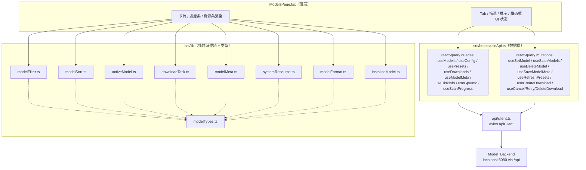
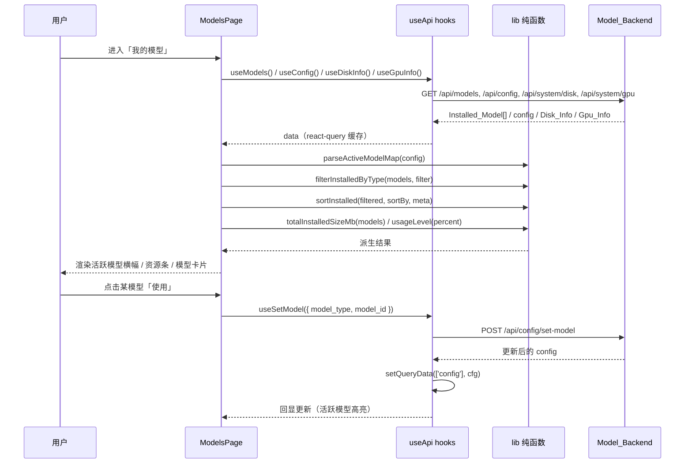
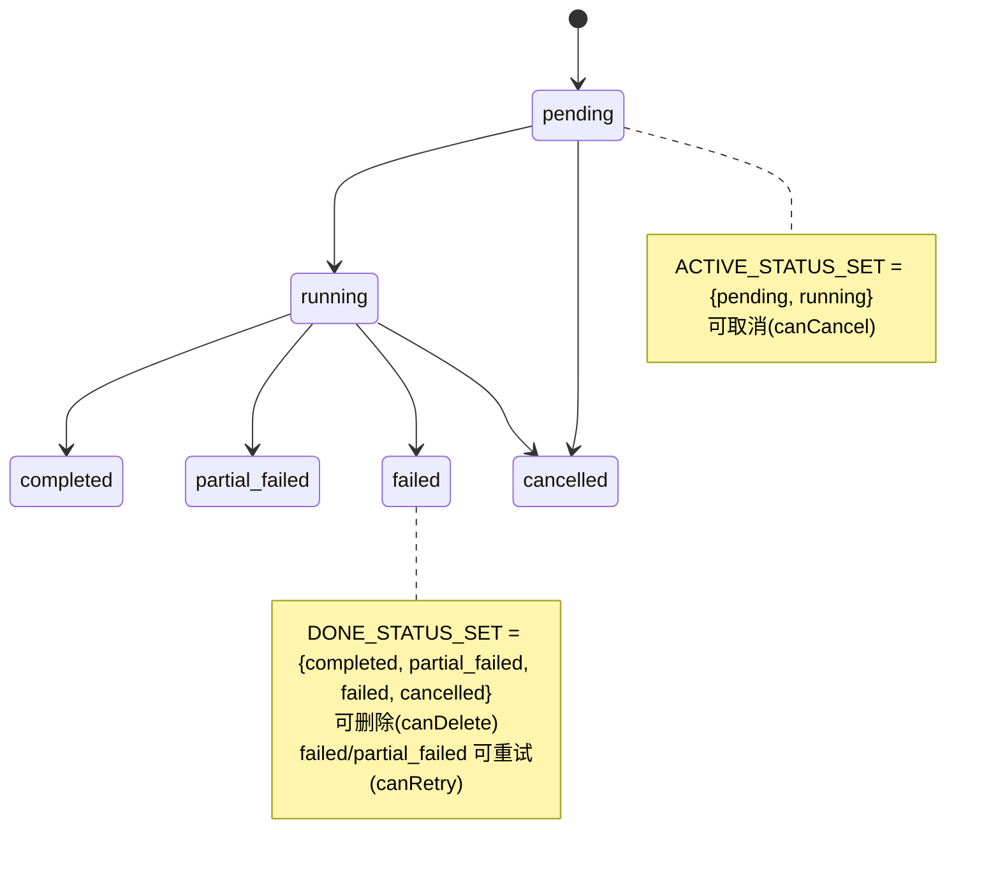

# Design Document

## Overview

「模型管理」(model-management) 特性为已存在的 `ModelsPage`（`app/web/src/components/ModelsPage.tsx`）补齐规格与测试覆盖。该页面功能已完整，但其领域逻辑（筛选、排序、活跃模型解析、下载任务状态判定、资源聚合、相对时间与容量格式化）全部内联在 React 组件内部，既无规格也无测试，且不符合项目「纯领域逻辑抽取为 `lib/*.ts` + 组件保持薄层」的既有约定（参照 `lib/generationParams.ts`、`lib/promptPreset.ts`、`lib/chatSession.ts`、`lib/voice.ts`）。

本特性是**纯前端、纯重构 + 补测**特性，核心策略为：

1. **逻辑抽取（behavior-preserving extraction）**：把 `ModelsPage` 内联的纯函数逻辑逐字搬运为 `app/web/src/lib` 下的若干纯模块，每个模块配套 `*.test.ts`（vitest 单元测试 + fast-check 属性测试，单属性 ≥ 100 次迭代）。抽取**不得改变任何可观察行为**（Req 9.3）：格式化阈值、取整位数、排序比较器、边界判定（`>1024`、`>=100`、`>90`/`>75`、`<60`/`<3600`/`<86400` 等）必须与现有代码逐位一致。
2. **薄层化组件**：`ModelsPage` 改为消费这些 lib 纯函数与 react-query/axios 数据层 hooks，仅保留 UI 状态（当前 Tab、筛选/排序选项、模态框开关）与渲染。
3. **数据层归位**：把组件内手写的 `apiClient.get/post/delete` 调用收敛为 `src/hooks/useApi.ts` 中的 react-query queries/mutations（沿用既有 `useConfig`/`useModels`/`useSetModel`/`useScanModels` 模式），统一 `queryKey`、缓存失效与错误传播。
4. **类型集中**：为 Installed_Model、Preset_Model、Download_Task、Disk_Info、Gpu_Info、Model_Meta、Active_Model_Map 与 Model_Type / Download_Status 枚举建立集中的 TypeScript 类型模块。

后端 REST API（监听 `http://localhost:8080`，经 Vite 代理 `/api`）假定已存在，本特性不改变其任何契约（Req 9.6）。

### 关键设计决策

1. **领域逻辑模块按「关注点」拆分为 8 个纯模块 + 1 个类型模块**，而非单个大文件。理由：各模块对应需求中相互独立的能力簇（筛选/排序/活跃模型/下载任务/元数据/系统资源/格式化/删除资格），便于按需求条目定位测试、便于复用（如 `modelFormat` 被磁盘条、GPU 条、卡片共用）。拆分与项目既有「一个能力一个 lib 文件」粒度一致。

2. **跨页共享状态最小化，不向 `uiStore` 引入模型领域状态**。经核查，`ModelsPage` 唯一真正跨页的状态是「每类型当前活跃模型」，而它**已经**通过 react-query 的 `['config']` 缓存共享：`useConfig`（`GET /api/config`）读取回显、`useSetModel`（`POST /api/config/set-model`）在 `onSuccess` 中 `setQueryData(['config'], cfg)` 同步更新。其他依赖当前模型选择的页面同样消费该缓存，因此把活跃模型保留在 `['config']` 缓存中正是保持契约不回归（Req 9.6）的最稳妥方式。`uiStore` 仅保留既有的 `setPage('models')` 导航职责，不新增字段。组件本地 UI 态（Tab、筛选、排序、模态框）属于页面私有，保留在组件内。

3. **活跃模型解析提取为纯函数 `parseActiveModelMap`**，统一「优先 `current_models`、兼容旧字段 `current_*_model`、排除空值」的合并规则（Req 2.1–2.4），消除组件内分散的 `??` 合并表达式，使其可被属性测试覆盖且与其他页面解析口径一致。

4. **下载任务状态判定以集合论方式建模**：定义 `ACTIVE_STATUS_SET = {pending, running}` 与 `DONE_STATUS_SET = {completed, partial_failed, failed, cancelled}` 为单一事实来源，`isActive`/`isDone`/`canCancel`/`canRetry`/`canDelete`/`countActiveTasks` 全部由集合成员关系派生，保证判定一致、无遗漏、无重叠（Req 4.4–4.8）。

5. **格式化函数保持「精确字符串契约」**：`formatSize`/`formatBytes` 的阈值与小数位是被快照式属性锁定的可观察行为（Req 8、Req 9.3）。抽取后的函数将以现有实现为黄金标准，属性测试断言其在各区间的单位与小数位与原实现完全一致。

6. **数据层错误沿用 react-query 的 `isError`/`error`，由组件转译为 Toast**。纯函数层不做 I/O、不吞错；网络错误处理（Req 9.1/9.2）留在组件 + hooks 层，纯函数仅处理结构化输入。

## Architecture



### 数据流（「我的模型」Tab 为例）



## Components and Interfaces

### 模块划分总览

| 模块 | 职责 | 覆盖需求 |
| --- | --- | --- |
| `lib/modelTypes.ts` | 集中类型与枚举、状态集合常量 | 词汇表全部类型 |
| `lib/modelFilter.ts` | 已安装模型按类型筛选；预设按搜索关键词 + 类型筛选 | 1.3, 1.4, 3.2, 3.3, 3.4 |
| `lib/modelSort.ts` | 已安装模型排序（recent/name/size）；预设排序（installed/size/name） | 1.5, 1.6, 1.7, 1.8, 3.5, 3.6, 3.7 |
| `lib/activeModel.ts` | 从 config 解析 Active_Model_Map | 2.1, 2.2, 2.3, 2.4 |
| `lib/downloadTask.ts` | 进度钳制、状态分类、操作资格、活跃计数、文件数钳制 | 4.3, 4.4, 4.5, 4.6, 4.7, 4.8, 4.11 |
| `lib/modelMeta.ts` | `last_used` → 相对时间文案 | 6.4, 6.5, 6.6, 6.7, 6.8 |
| `lib/systemResource.ts` | 已安装模型总占用、占用等级分级 | 7.2, 7.3, 7.4 |
| `lib/modelFormat.ts` | MB 大小格式化、字节格式化 | 8.1, 8.2, 8.3, 8.4, 8.5 |
| `lib/installedModel.ts` | 删除资格（非 ollama 可删） | 5.1 |
| `hooks/useApi.ts`（扩展） | 全部 REST 端点的 query/mutation | 1.1, 1.9, 2.5, 2.6, 3.1, 3.8, 4.1, 4.9, 4.10, 5.4, 5.6, 6.1, 6.2, 7.1 |

### `lib/modelFilter.ts`

```ts
import type { InstalledModel, PresetModel, ModelTypeFilter } from '@/lib/modelTypes';

/** 已安装模型按类型筛选。filter 为 'all' 时返回与输入等长、元素相同的列表。 */
export function filterInstalledByType(
  models: InstalledModel[],
  filter: ModelTypeFilter,
): InstalledModel[];

/** 预设：关键词（不区分大小写，匹配 name/description/note）+ 类型筛选。
 *  空 query 不按关键词过滤；filter 为 'all' 不按类型过滤。 */
export function filterPresets(
  presets: PresetModel[],
  query: string,
  typeFilter: ModelTypeFilter,
): PresetModel[];
```

### `lib/modelSort.ts`

```ts
import type { InstalledModel, PresetModel, ModelMetaMap } from '@/lib/modelTypes';

export type InstalledSortBy = 'recent' | 'name' | 'size_desc' | 'size_asc';
export type PresetSortBy = 'installed' | 'size_desc' | 'size_asc' | 'name';

/** 纯函数：返回新数组（不修改入参）。
 *  - 'name'：按 name 升序（localeCompare）。
 *  - 'size_desc'/'size_asc'：按 size_mb 降/升序。
 *  - 'recent'：按 meta.last_used 降序；相等或缺失按 name 升序兜底。 */
export function sortInstalled(
  models: InstalledModel[],
  sortBy: InstalledSortBy,
  meta: ModelMetaMap,
): InstalledModel[];

/** 纯函数：返回新数组。
 *  - 'installed'：is_downloaded 为真者在前，同组内 name 升序。
 *  - 'size_desc'/'size_asc'/'name'：对应排序。 */
export function sortPresets(presets: PresetModel[], sortBy: PresetSortBy): PresetModel[];
```

`ModelsPage` 现有「先 filter 再 sort」的组合逻辑（`filteredModels` / `filteredPresets`）将改为 `sortInstalled(filterInstalledByType(...))` 与 `sortPresets(filterPresets(...))` 的函数组合，组合结果满足子集不变式（Req 1.8 / 3.7）。

### `lib/activeModel.ts`

```ts
import type { ModelConfigView, ActiveModelMap } from '@/lib/modelTypes';

/** 从 config 解析 Active_Model_Map：
 *  - 优先 current_models[type]；其次旧字段 current_asr/tts/llm_model；
 *  - 排除 null / undefined / 空字符串；
 *  - 结果为 Record<ModelType, modelId>，每类型至多一个 id（Record 语义天然保证）。 */
export function parseActiveModelMap(config: ModelConfigView | undefined): ActiveModelMap;

/** 给定已加载模型列表，判断某 type 的活跃模型是否应被渲染为活跃卡片
 *  （Req 2.7：当且仅当其 id 存在于 models 中）。 */
export function resolveActiveModelId(
  activeMap: ActiveModelMap,
  modelType: string,
  models: InstalledModel[],
): string | null;
```

### `lib/downloadTask.ts`

```ts
import type { DownloadTask, DownloadStatus } from '@/lib/modelTypes';
import { ACTIVE_STATUS_SET, DONE_STATUS_SET } from '@/lib/modelTypes';

/** 展示进度钳制到 [0, 100] 闭区间。 */
export function clampProgress(progress: number): number;

export function isActive(status: DownloadStatus): boolean;   // ∈ ACTIVE_STATUS_SET
export function isDone(status: DownloadStatus): boolean;      // ∈ DONE_STATUS_SET
export function canCancel(task: DownloadTask): boolean;       // isActive
export function canRetry(task: DownloadTask): boolean;        // status ∈ {failed, partial_failed}
export function canDelete(task: DownloadTask): boolean;       // isDone
export function countActiveTasks(tasks: DownloadTask[]): number;

/** total_files > 0 时把 completed_files 钳制为不超过 total_files（且不小于 0）。 */
export function clampCompletedFiles(completed: number, total: number): number;
```

### `lib/modelMeta.ts`

```ts
/** 依据 (now - lastUsed) 秒差产生相对时间文案：
 *  - <60：'刚刚使用'
 *  - [60,3600)：'N 分钟前'（Math.floor(diff/60)）
 *  - [3600,86400)：'N 小时前'（Math.floor(diff/3600)）
 *  - >=86400：'N 天前'（Math.floor(diff/86400)）
 *  nowSeconds 默认 Math.floor(Date.now()/1000)，测试可注入。 */
export function formatLastUsed(lastUsedSeconds: number, nowSeconds?: number): string;
```

### `lib/systemResource.ts`

```ts
import type { InstalledModel, UsageLevel } from '@/lib/modelTypes';

/** 已安装模型 size_mb 之和；空列表为 0。 */
export function totalInstalledSizeMb(models: InstalledModel[]): number;

/** 占用百分比分级：>90 → 'high'；>75 且 <=90 → 'medium'；<=75 → 'normal'。 */
export function usageLevel(percent: number): UsageLevel;
```

### `lib/modelFormat.ts`

```ts
/** MB 大小格式化（保持与现有实现逐位一致）：
 *  - mb > 1024：`${(mb/1024).toFixed(1)} GB`
 *  - mb >= 100（且 <=1024）：`${mb.toFixed(0)} MB`
 *  - 否则（mb < 100）：`${mb.toFixed(1)} MB` */
export function formatSize(mb: number): string;

/** 字节格式化：
 *  - >=1073741824：GB（1 位小数）
 *  - >=1048576：MB（1 位小数）
 *  - >=1024：KB（1 位小数）
 *  - 否则：`${bytes} B` */
export function formatBytes(bytes: number): string;
```

### `lib/installedModel.ts`

```ts
import type { InstalledModel } from '@/lib/modelTypes';

export function isOllamaModel(model: InstalledModel): boolean; // model.source === 'ollama'

/** 删除资格：当且仅当不是 Ollama_Model 时可删除。 */
export function canDeleteModel(model: InstalledModel): boolean;
```

### `hooks/useApi.ts`（扩展）

沿用既有 `useQuery`/`useMutation` 模式，新增以下成员（仅列签名意图）。所有 mutation 在 `onSuccess` 中按受影响数据失效/更新相应 `queryKey`，使回显自动刷新；既有 `useConfig`/`useModels`/`useSetModel`/`useScanModels` 保持不变。

- Queries：`usePresets()`（`['presets']`）、`useDownloads()`（`['downloads']`，2s 轮询经组件 `refetchInterval`）、`useModelMeta(id)`（`['modelMeta', id]`）、`useDiskInfo()`（`['system','disk']`）、`useGpuInfo()`（`['system','gpu']`）、`useScanProgress()`（按需）。
- Mutations：`useDeleteModel()`（DELETE `/api/models/{id}`，成功后失效 `['models']`/`['config']` 并触发磁盘刷新）、`useSaveModelMeta()`（POST `/api/models/{id}/meta`，成功后更新 `['modelMeta', id]`）、`useRefreshPresets()`（POST `/api/downloads/presets/refresh` 后失效 `['presets']`）、`useCreateDownload()`/`useBatchDownload()`、`useCancelDownload()`/`useRetryDownload()`/`useDeleteDownload()`（成功后失效 `['downloads']`）。

`useSetModel` 当前的 `model_type` 形参类型为 `'asr' | 'tts' | 'llm'`，将放宽为 `ModelType`（覆盖词汇表全部 13 类），以契约兼容方式扩展（请求体形状不变，Req 9.6）。

## Data Models

集中定义于 `lib/modelTypes.ts`。

```ts
/** Model_Type 枚举：词汇表规定的取值集合。 */
export type ModelType =
  | 'asr' | 'tts' | 'llm' | 'svs' | 'music' | 'sound' | 'enhance'
  | 'vad' | 'diarization' | 'speaker' | 'emotion' | 'audio_lm'
  | 'translation' | 'other';

export const MODEL_TYPES: readonly ModelType[] = [
  'asr','tts','llm','svs','music','sound','enhance',
  'vad','diarization','speaker','emotion','audio_lm','translation','other',
] as const;

/** 筛选用类型：具体 Model_Type 或 'all'（全部）。 */
export type ModelTypeFilter = ModelType | 'all';

/** Download_Status 枚举。 */
export type DownloadStatus =
  | 'pending' | 'running' | 'completed'
  | 'partial_failed' | 'failed' | 'cancelled';

/** Active_Status_Set / Done_Status_Set（单一事实来源）。 */
export const ACTIVE_STATUS_SET: ReadonlySet<DownloadStatus> = new Set(['pending', 'running']);
export const DONE_STATUS_SET: ReadonlySet<DownloadStatus> =
  new Set(['completed', 'partial_failed', 'failed', 'cancelled']);

/** Usage_Level：资源占用等级。 */
export type UsageLevel = 'high' | 'medium' | 'normal';

/** Installed_Model：本地已安装模型条目。 */
export interface InstalledModel {
  id: string;
  name: string;
  model_type: string;       // 后端可能返回枚举外字符串，渲染时回退 'other'
  path: string;
  size_mb: number;
  files: number;
  main_files: string[];
  description: string;
  version: string;
  quant: string;
  source: string;           // 'ollama' 表示 Ollama_Model
}

/** Preset_Model：模型仓库预设条目。 */
export interface PresetModel {
  id: string;
  name: string;
  model_type: string;
  description: string;
  size_mb: number;
  source: string;
  repo_id: string;
  dest_dir: string;
  note?: string;
  is_downloaded?: boolean;
  installed_model_id?: string | null;
}

/** Download_Task：下载任务。 */
export interface DownloadTask {
  id: string;
  mode: string;             // 'batch' | 其它
  status: DownloadStatus;
  progress: number;
  speed_mbps: number;
  total_files: number;
  completed_files: number;
  current_file?: string;
  repo_id?: string;
  source?: string;
  dest_dir?: string;
  url: string;
  dest: string;
  error: string | null;
}

/** Model_Meta：单模型元数据。 */
export interface ModelMeta {
  notes: string;
  tags: string[];
  last_used?: number;       // Unix 秒级时间戳
}
export type ModelMetaMap = Record<string, ModelMeta>;

/** Disk_Info：磁盘信息。 */
export interface DiskInfo {
  total_bytes: number;
  free_bytes: number;
  used_bytes: number;
  total_text: string;
  free_text: string;
  used_text: string;
  used_percent: number;
}

/** Gpu_Info：GPU 信息。 */
export interface GpuInfo {
  name: string;
  total_vram_mb: number;
  used_vram_mb: number;
  free_vram_mb: number;
  usage_percent: number;
}

/** GET /api/config 中与当前模型选择相关的视图字段。 */
export interface ModelConfigView {
  current_asr_model?: string | null;
  current_tts_model?: string | null;
  current_llm_model?: string | null;
  current_models?: Record<string, string>;
  model_meta?: ModelMetaMap;
}

/** Active_Model_Map：每个 Model_Type 至多映射到一个模型 id。 */
export type ActiveModelMap = Partial<Record<ModelType, string>>;
```

### 状态转移：Download_Task



## Correctness Properties

*属性（property）是在系统所有合法执行中都应成立的特征或行为——一种关于「系统应当做什么」的形式化陈述。属性是人类可读规格与机器可验证正确性保证之间的桥梁。*

本特性的领域逻辑全部为纯函数（筛选、排序、解析、状态判定、聚合、格式化），具有清晰的输入/输出与「对所有输入成立」的通用性质，因此适用属性测试（PBT）。下列属性以现有 `ModelsPage` 内联实现为**黄金标准**，锁定其精确可观察行为，从而同时验证正确性与「抽取不回归」(Req 9.3)。每个属性以单个 fast-check 属性测试实现（≥ 100 次迭代）。

### Property 1: 已安装模型按类型筛选为类型匹配子集，且「全部」恒等

*For any* Installed_Model 列表与类型筛选值，`filterInstalledByType` 的输出都是输入的多重子集（不新增、不重复输入中不存在的元素）；当筛选为某具体 Model_Type 时，输出中每个元素的 `model_type` 都等于该类型；当筛选为「全部」时，输出与输入逐元素相等。

**Validates: Requirements 1.3, 1.4, 1.8**

### Property 2: 已安装模型排序为输入排列且按所选键有序

*For any* Installed_Model 列表、排序方式与 Model_Meta 映射，`sortInstalled` 的输出都是输入的一个排列（多重集相等），且：`name` 模式下相邻元素 `name` 非降序；`size_desc`/`size_asc` 下 `size_mb` 单调非增/非减；`recent` 下按 `last_used`（缺失记为最小）降序、相等或缺失时按 `name` 升序。

**Validates: Requirements 1.5, 1.6, 1.7, 1.8**

### Property 3: 预设搜索为命中子集且空关键词不过滤

*For any* Preset_Model 列表、搜索关键词与类型筛选，`filterPresets` 的输出都是输入的子集；输出中每个元素在不区分大小写下其 `name`、`description` 或 `note` 包含该关键词（关键词为空字符串时不施加该约束）；当类型筛选为某具体类型时输出均匹配该类型，为「全部」时不按类型过滤。

**Validates: Requirements 3.2, 3.3, 3.4**

### Property 4: 预设排序为输入排列且各模式有序

*For any* Preset_Model 列表与排序方式，`sortPresets` 的输出都是输入的一个排列，且：`installed` 模式下所有 `is_downloaded` 为真的元素位置都先于为假的元素，同一安装状态内 `name` 升序；`size_desc`/`size_asc` 下 `size_mb` 单调非增/非减；`name` 下 `name` 非降序。

**Validates: Requirements 3.5, 3.6**

### Property 5: 预设「搜索 + 筛选 + 排序」组合管线的子集不变式

*For any* Preset_Model 列表与任意（搜索关键词、类型筛选、排序方式）组合，`sortPresets(filterPresets(...))` 的输出条目数不超过输入条目数，且输出多重集是输入多重集的子集。

**Validates: Requirements 3.7**

### Property 6: 活跃模型映射解析的有效性、优先级与唯一性

*For any* config 视图（含 `current_models` 与旧字段 `current_asr_model`/`current_tts_model`/`current_llm_model` 的任意组合，含 `null`/`undefined`/空字符串），`parseActiveModelMap` 的结果满足：每个键对应的值都是非空字符串 id；当某类型同时存在 `current_models` 值与旧字段值时以 `current_models` 的值为准；值为 `null`/`undefined`/空字符串的类型不出现在结果中；每个 Model_Type 至多对应一个 id。

**Validates: Requirements 2.1, 2.2, 2.3, 2.4**

### Property 7: 下载进度钳制到 [0,100]

*For any* 数值进度输入，`clampProgress` 的输出落在闭区间 `[0, 100]` 内；当输入本身位于 `[0, 100]` 内时输出等于输入。

**Validates: Requirements 4.3**

### Property 8: 下载任务状态分类与操作资格一致

*For any* Download_Status，`isActive` 与 `isDone` 恰好划分全部状态（互斥且并集为全集）；`canCancel` 当且仅当状态属于 Active_Status_Set；`canRetry` 当且仅当状态为 `failed` 或 `partial_failed`；`canDelete` 当且仅当状态属于 Done_Status_Set。

**Validates: Requirements 4.4, 4.5, 4.6, 4.7**

### Property 9: 活跃任务计数等于活跃任务个数

*For any* Download_Task 列表，`countActiveTasks` 的返回值等于列表中状态属于 Active_Status_Set 的任务个数。

**Validates: Requirements 4.8**

### Property 10: 批量任务完成文件数不超过总文件数

*For any* `completed_files` 与 `total_files`（`total_files > 0`），`clampCompletedFiles` 的结果不超过 `total_files` 且不小于 `0`。

**Validates: Requirements 4.11**

### Property 11: 删除资格当且仅当非 Ollama 模型

*For any* Installed_Model，`canDeleteModel` 返回真当且仅当其 `source` 不等于 `'ollama'`。

**Validates: Requirements 5.1**

### Property 12: 相对使用时间分段文案

*For any* 注入的当前时间 `now` 与 `last_used`（令 `diff = now - last_used`），`formatLastUsed` 的输出满足：`diff < 60` 为「刚刚使用」；`60 <= diff < 3600` 为「N 分钟前」且 `N = floor(diff/60)`；`3600 <= diff < 86400` 为「N 小时前」且 `N = floor(diff/3600)`；`diff >= 86400` 为「N 天前」且 `N = floor(diff/86400)`。

**Validates: Requirements 6.4, 6.5, 6.6, 6.7, 6.8**

### Property 13: 已安装模型总占用等于各 size_mb 之和

*For any* Installed_Model 列表，`totalInstalledSizeMb` 的返回值等于所有元素 `size_mb` 之和；空列表返回 `0`。

**Validates: Requirements 7.2, 7.3**

### Property 14: 资源占用等级分级

*For any* 占用百分比 `p`，`usageLevel(p)` 在 `p > 90` 时返回 `'high'`、在 `75 < p <= 90` 时返回 `'medium'`、在 `p <= 75` 时返回 `'normal'`。

**Validates: Requirements 7.4**

### Property 15: MB 大小格式化的分段精确契约

*For any* 非负数值 `mb`，`formatSize(mb)` 满足：`mb > 1024` 时为 `"<mb/1024 保留1位> GB"`；`100 <= mb <= 1024` 时为 `"<mb 保留0位> MB"`；`mb < 100` 时为 `"<mb 保留1位> MB"`；且输出始终为包含数值与单位标识的非空文本。

**Validates: Requirements 8.1, 8.2, 8.3, 8.5**

### Property 16: 字节格式化的分段精确契约

*For any* 非负整数 `bytes`，`formatBytes(bytes)` 满足：`bytes >= 1073741824` 时为保留 1 位小数的 GB；`>= 1048576` 时为保留 1 位小数的 MB；`>= 1024` 时为保留 1 位小数的 KB；否则为 `"<bytes> B"`；且输出始终为包含数值与单位标识的非空文本。

**Validates: Requirements 8.4, 8.5**

## Error Handling

错误处理沿用项目既有「数据层抛出 → 组件转译为 Toast」模式，纯函数层不做 I/O、不吞错。

- **查询失败（Req 9.1）**：`useModels`/`usePresets`/`useModelMeta` 等 query 失败时，react-query 暴露 `isError`，`ModelsPage` 据此退出对应区域的加载态并经 `useToastStore.addToast({ type: 'error' })` 展示错误；列表区域回退到空态/错误态而非崩溃。
- **变更失败（Req 9.2）**：`useSetModel`/`useDeleteModel`/`useSaveModelMeta`/下载相关 mutation 失败时，`onError` 路径展示错误 Toast，且**不**执行成功态更新（不失效缓存为成功结果、不从列表移除、不更新备注回显）。乐观更新一律避免，统一「成功响应后再更新」。
- **系统资源缺失（Req 7.5）**：`useDiskInfo`/`useGpuInfo` 失败或 GPU 返回空时静默处理，对应资源条不渲染（`DiskBar`/`GpuBar` 在数据为 `null` 时返回 `null`），不阻断「我的模型」其余内容。
- **纯函数健壮性**：`clampProgress` 对 `NaN`/`Infinity` 等非有限输入给出确定性回退（钳到边界，参照 `generationParams.clampParam` 的兜底约定）；`formatSize`/`formatBytes` 仅承诺非负输入契约，对负值不做保证（由调用点保证非负）；`parseActiveModelMap` 对 `undefined` config 返回空映射。
- **删除二次确认（Req 5.3/5.5）**：确认对话框为组件本地状态，确认前不触发 mutation；取消则不调用端点、保留模型。

## Testing Strategy

### 双轨测试

- **属性测试（fast-check）**：覆盖上述 16 条 Correctness Properties，验证纯函数对所有输入的通用性质。每个属性以**单个** `fc.assert(fc.property(...))` 实现，配置 `numRuns >= 100`（沿用既有模块 200 的取值）。
- **单元测试（vitest）**：覆盖分段边界与具体样例（EDGE_CASE），例如：`formatSize` 在 `mb = 100`、`mb = 1024`、`mb = 1024.0001` 的取值；`usageLevel` 在 `p = 75`、`p = 90`、`p = 90.0001`；`formatLastUsed` 在 `diff = 0/59/60/3599/3600/86399/86400`；`clampCompletedFiles` 在 `completed > total`、`completed < 0`；`parseActiveModelMap` 的空值与冲突样例。
- **组件/集成测试（@testing-library/react）**：覆盖 INTEGRATION/EXAMPLE 类条目——数据获取与渲染（1.1/3.1/7.1）、加载态（1.2）、扫描轮询（1.9）、set-model 回显（2.5/2.6/2.7）、下载轮询与生命周期（4.1/4.2/4.10）、操作端点调用（4.9/5.4）、删除二次确认流程（5.2/5.3/5.5/5.6）、备注读写（6.1/6.2/6.3）、错误处理（9.1/9.2）。这些测试 mock `apiClient`/hooks，使用 fake timers 验证轮询。

### 属性测试库与配置

- 库：`fast-check`（项目已安装，见 `node_modules/fast-check`）。**不**自行实现属性测试框架。
- 每个属性测试 `numRuns >= 100`。
- 每个属性测试以注释标注其对应设计属性，标签格式：
  `// Feature: model-management, Property {number}: {property_text}`
  并附 `// Validates: Requirements X.Y` 引用。
- 生成器（Arbitrary）约定：`installedModelArb`/`presetModelArb`/`downloadTaskArb` 覆盖枚举内全部 Model_Type 与 Download_Status，并刻意混入枚举外字符串、空字符串、缺失可选字段、负数/越界 size、`last_used` 缺失等边界，以由生成器承载 EDGE_CASE 输入空间（参照 `generationParams.test.ts` 的生成器风格）。

### 无回归策略（Req 9.3–9.6）

- **行为锁定**：Property 1–16 以现有内联实现的精确阈值/排序口径为黄金标准，抽取后函数必须使全部属性通过，等价于「可观察行为不变」。
- **契约不变**：`useSetModel` 请求体保持 `{ model_type, model_id }`；`GET /api/config`/`POST /api/config/set-model` 不改字段；活跃模型仍走 `['config']` 缓存。新增 hooks 仅消费既有端点，不改其形状。
- **既有套件回归**：运行整套 `vitest --run`，确保 `ChatPage*`、`VoiceStudioPage`、`uiStore*` 等既有测试全部通过，保障对话（`/api/chat`）、声音工坊与参考音色（`/api/voices*`、`/api/inference/*`）功能不回归。
- 运行测试使用单次执行模式（`vitest --run`），不使用 watch 模式。
