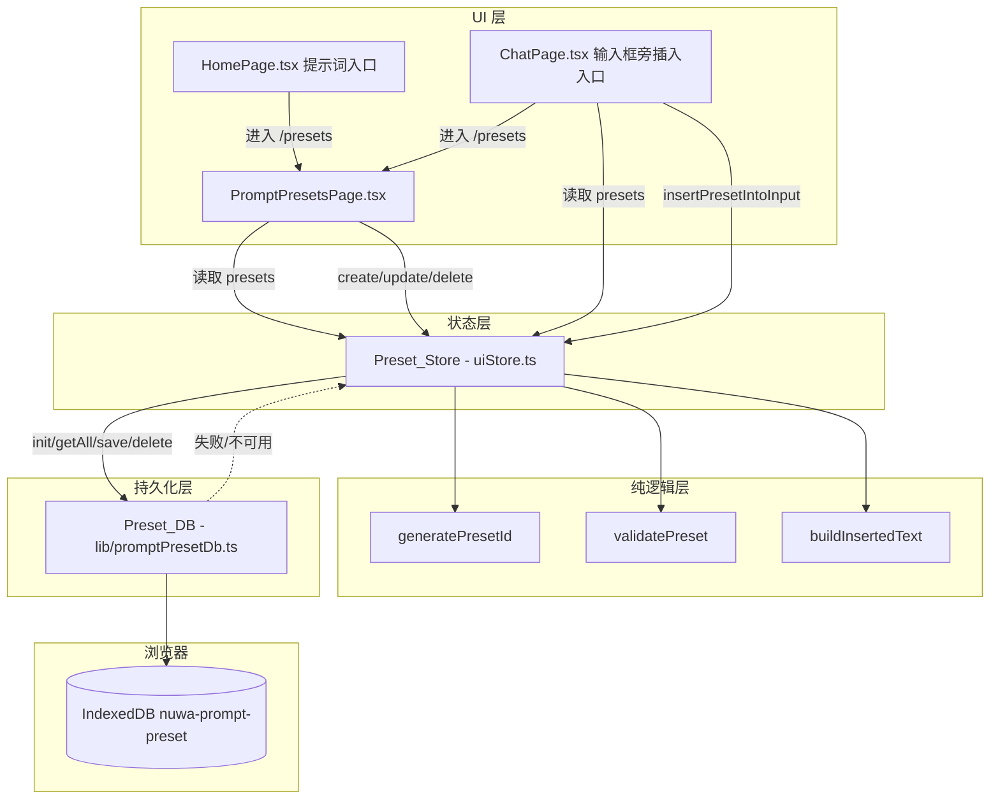
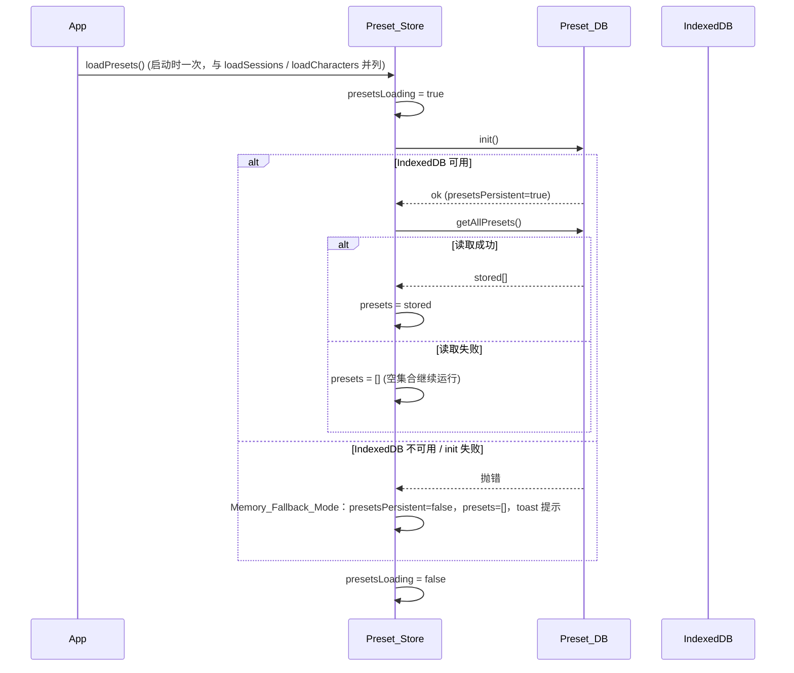
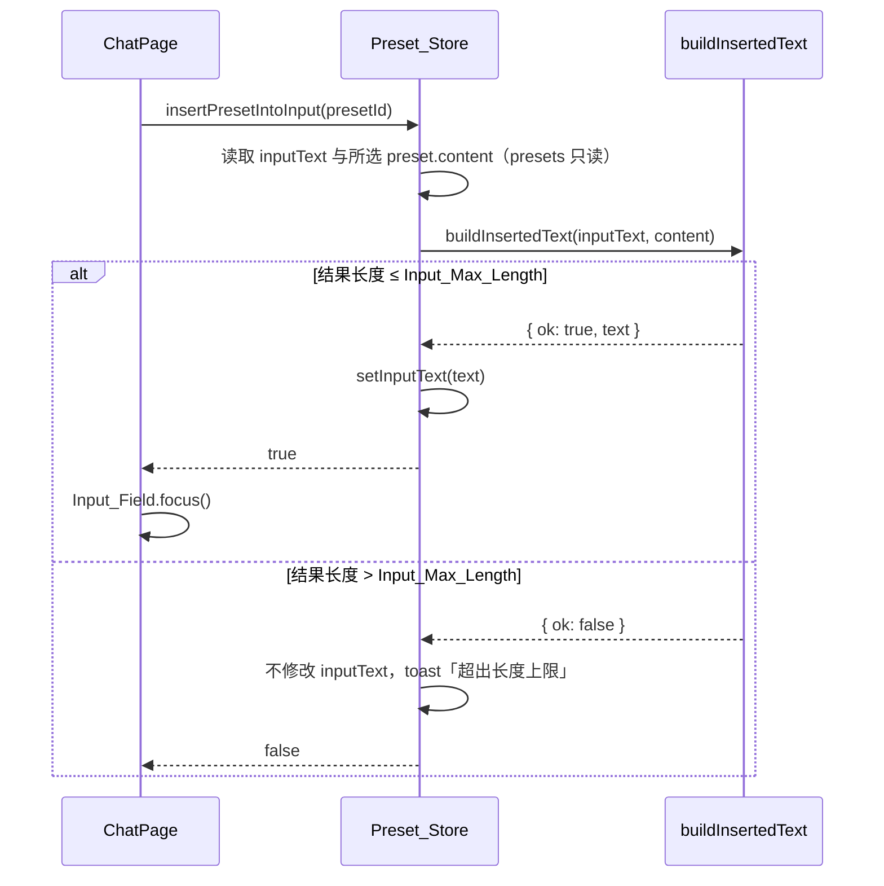

# Design Document

## Overview

「提示词预设管理」(prompt-preset-management) 在已交付的「会话历史持久化」「流式对话输出」「角色/人设管理」之上，为女娲 Nuwa 前端补齐**提示词预设（Prompt_Preset）**的端到端管理与快速复用能力。当前对话页（Chat_Page）每次都要手动键入重复的指令或人设引导语；本特性允许用户保存一组带「标题 + 内容」的预设，集中管理（列表 / 新建 / 编辑 / 删除），并在对话输入框旁一键将某条预设的 `content` 插入输入框，便于快速发送。

本特性是**纯前端增量增强**，完全复用 character-persona-management 已建立的四层模式：

1. **纯逻辑层**：新建 `app/web/src/lib/promptPreset.ts`，抽取不依赖 DOM/store/IndexedDB 的纯函数（字段 trim 校验 `validatePreset`、集内唯一 id 生成 `generatePresetId`、插入文本构造 `buildInsertedText`），以便属性测试直接覆盖。
2. **持久化层**：新建 `app/web/src/lib/promptPresetDb.ts`，完全参照 `lib/characterDb.ts` 的 `createPresetDb(factory?)` 工厂 + IndexedDB + 失败 reject 降级模式；库名 `nuwa-prompt-preset`，object store `presets`（`keyPath: 'id'`），可注入 `IDBFactory`（如 `fake-indexeddb`）以供测试。
3. **状态层**：改造 `store/uiStore.ts`，新增 `presets` 状态与 `loadPresets` / `createPreset` / `updatePreset` / `deletePreset` / `insertPresetIntoInput` actions，遵循既有「先改内存 → 受持久化守卫落库 → 失败 toast」流程与 Memory_Fallback_Mode 降级策略。
4. **UI 层**：新建 `app/web/src/components/PromptPresetsPage.tsx`（路由 `/presets`）作为 Preset_Manager；Home_Page 新增「提示词」入口；Chat_Page 输入框旁新增 Preset_Insert_Entry 与进入管理页的入口。

交付后预设列表写入 IndexedDB（库 `nuwa-prompt-preset`），刷新或重启可恢复；Preset_DB 不可用或读写失败时降级为 Memory_Fallback_Mode 并提示用户。本特性不改后端，不修改任何既有 API 契约，且保证会话持久化、流式输出、TTS 朗读、角色管理不回归。

### 设计目标与非目标

- **目标**：预设本地持久化与启动恢复、预设管理 CRUD 界面、删除二次确认、对话页一键插入（含长度上限保护与聚焦）、首页与对话页入口、错误降级、无回归。
- **非目标**：预设跨设备 / 云端同步、预设导入导出、预设分类 / 标签 / 搜索、变量占位符模板渲染、后端持久化。

### 关键设计决策

| 决策 | 选择 | 理由 |
| --- | --- | --- |
| 持久化介质 | IndexedDB（独立库 `nuwa-prompt-preset`） | 与 Character_DB / Chat_DB 同构、异步、容量大；与会话库、角色库隔离，互不影响（Req 8.5） |
| 数据层封装 | 独立模块 `lib/promptPresetDb.ts`，工厂注入 `IDBFactory` | 完全对齐 `characterDb.ts`，便于用 `fake-indexeddb` 或注入做单元/属性测试（Req 1.5） |
| 唯一 id 生成 | 抽出纯函数 `generatePresetId(existing)`，与既有集合去重 | Req 3.2 要求集内唯一；纯函数可属性测试唯一性 |
| 字段校验 | 抽出纯函数 `validatePreset(rawTitle, rawContent)`：双字段 trim 后均非空才有效 | Req 3.2/3.3/3.6/3.7/4.1/4.3/4.4 的 trim 语义可独立属性测试，UI 与 store 共用 |
| 插入文本构造 | 抽出纯函数 `buildInsertedText(prev, content)`：空输入 = content；非空 = `prev + '\n' + content`；超 Input_Max_Length 返回拒绝 | Req 6.3/6.4/6.5 是纯字符串变换，集中为纯函数最易测且无副作用 |
| 「空输入」判定 | 以 `prev.trim().length === 0` 判定 | 同时覆盖 Req 6.3「文本为空」与 Req 6.4「trim 后非空」，并消除纯空白文本的语义空隙 |
| 长度上限强制 | `title` / `content` 由输入控件 `maxLength` 在 UI 层强制；插入结果上限由 `buildInsertedText` 在状态层判定 | Req 3.8/3.9 是输入控件行为；Req 6.5 是计算结果约束，需在写回前拦截 |
| 删除二次确认 | 在 Preset_Manager UI 层内联确认（确认 / 取消），确认才调 `deletePreset` | Req 5.1/5.3：取消时 store 不调用 Preset_DB 删除 |
| 插入只读预设 | `insertPresetIntoInput` 仅读取所选预设并写 `inputText`，不触碰 `presets` | Req 6.7：插入不得改变预设集合 |
| 降级策略 | Preset_DB 提供 `presetsPersistent` 标志；失败时内存模式仍可用 | Req 8.1–8.4：存储不可用时不阻断预设功能 |

## Architecture

### 分层结构



### 启动初始化时序



### 一键插入数据流



## Components and Interfaces

### 1. Preset_Logic（`app/web/src/lib/promptPreset.ts`，新增）

集中可独立测试的预设纯逻辑，不依赖 DOM / store / IndexedDB。

```typescript
import type { PromptPreset } from '@/store/uiStore';

/** Prompt_Preset 的 `title` 允许的最大字符数（UI 层以 input maxLength 强制）。 */
export const TITLE_MAX_LENGTH = 30;
/** Prompt_Preset 的 `content` 允许的最大字符数（UI 层以 textarea maxLength 强制）。 */
export const CONTENT_MAX_LENGTH = 2000;
/** Input_Field 允许容纳的最大字符数（与 Chat_Page textarea maxLength 一致）。 */
export const INPUT_MAX_LENGTH = 2000;

/** 预设字段校验结果。 */
export interface PresetValidation {
  /** title 与 content trim 后均非空为 true。 */
  ok: boolean;
  /** trim 后的 title（ok 时用作落库值）。 */
  title: string;
  /** trim 后的 content（ok 时用作落库值）。 */
  content: string;
}

/**
 * 校验并规范化预设字段：
 * - title 与 content 各自去除首尾空白；
 * - 二者 trim 后均非空 -> { ok: true, title, content }（trim 后值）；
 * - 否则 -> { ok: false, ... }。
 *
 * 注：长度上限由输入控件 maxLength 在 UI 层强制（Req 3.8/3.9），此处只判空。
 */
export function validatePreset(rawTitle: string, rawContent: string): PresetValidation;

/**
 * 生成在 `existing` 预设集合内唯一的新 id（Req 3.2）。
 * 基于时间戳 + 随机后缀，若意外与现有 id 冲突则重试，保证返回值不在 `existing` 中。
 */
export function generatePresetId(existing: PromptPreset[]): string;

/** 插入文本构造结果。 */
export interface InsertResult {
  /** 结果长度 ≤ maxLen 为 true；超限为 false（应拒绝插入）。 */
  ok: boolean;
  /** ok 时为写回 Input_Field 的新文本；超限时等于 prev（原文本，不变）。 */
  text: string;
}

/**
 * 由 Input_Field 当前文本 `prev` 与所选预设 `content` 构造 Inserted_Text：
 * - 若 `prev.trim()` 为空 -> 结果文本为 `content`（Req 6.3）；
 * - 否则 -> 结果文本为 `prev + '\n' + content`（Req 6.4）；
 * - 若结果文本码点/字符数 > `maxLen` -> { ok: false, text: prev }（Req 6.5，拒绝且不变）；
 * - 否则 -> { ok: true, text: 结果文本 }。
 */
export function buildInsertedText(
  prev: string,
  content: string,
  maxLen?: number,
): InsertResult;
```

### 2. Preset_DB（`app/web/src/lib/promptPresetDb.ts`，新增）

封装 IndexedDB 的预设异步数据层，结构与 `lib/characterDb.ts` 一致：工厂函数允许注入 `IDBFactory`（测试时传 `fake-indexeddb`），构造时不抛错，失败延迟到 `init()` reject。

```typescript
import type { PromptPreset } from '@/store/uiStore';

/** Preset_DB public interface. All methods are async and reject on failure. */
export interface PresetDb {
  /** Open/upgrade the database and create the object store. */
  init(): Promise<void>;
  /** Read all presets (unordered; caller preserves/derives ordering). */
  getAllPresets(): Promise<PromptPreset[]>;
  /** Insert or update a preset (put, idempotent by id). */
  savePreset(preset: PromptPreset): Promise<void>;
  /** Delete a single preset by id. */
  deletePreset(presetId: string): Promise<void>;
}

/**
 * Create a Preset_DB instance.
 * @param factory optional injected IDBFactory (e.g. fake-indexeddb in tests);
 *                defaults to globalThis.indexedDB. Does not throw at construction.
 */
export function createPresetDb(factory?: IDBFactory): PresetDb;
```

**IndexedDB 结构**：

- 数据库名 `nuwa-prompt-preset`，版本 `1`。
- object store `presets`，`keyPath: 'id'`（无额外索引；预设量级小，全量读取后由状态层处理顺序）。

**实现要点**：与 `characterDb.ts` 同款 `requestToPromise` / `txDone` 辅助；`getFactory()` 返回 `factory ?? globalThis.indexedDB`，缺失则 `init()` reject；`savePreset` / `deletePreset` 使用 `readwrite` 事务并以 `txDone(tx)` 等待完成；`getAllPresets` 使用 `readonly` 事务 `getAll()`。

### 3. Preset_Store 改造（`app/web/src/store/uiStore.ts`）

**新增状态**：

```typescript
interface UIState {
  // ... 既有字段
  presets: PromptPreset[];        // 初始 []
  presetsLoading: boolean;        // 启动加载态，初始 true
  presetsPersistent: boolean;     // false 表示处于 Memory_Fallback_Mode（预设侧）
}
```

**新增 action**（均与 Preset_DB 协作；写失败保留内存状态并提示）：

```typescript
// 启动时调用：init -> 读取恢复 presets；失败进入降级模式（presets=[]）
loadPresets: () => Promise<void>;
// 新建预设：validatePreset 通过才创建，分配集内唯一 id，记录 trim 后字段并持久化
createPreset: (rawTitle: string, rawContent: string) => Promise<void>;
// 编辑预设：validatePreset 通过才更新 title/content（id 不变）并持久化
updatePreset: (id: string, rawTitle: string, rawContent: string) => Promise<void>;
// 删除预设：从 presets 移除并经 Preset_DB 删除其记录（确认在 UI 层完成）
deletePreset: (id: string) => Promise<void>;
// 一键插入：读取 inputText 与所选预设 content，经 buildInsertedText 计算并写回 inputText；
// 超 Input_Max_Length 时不修改且 toast；返回是否成功插入（供 ChatPage 决定是否聚焦）；presets 始终不变
insertPresetIntoInput: (id: string) => boolean;
```

**行为要点**：

- `createPreset`：`validatePreset` 不通过则整体 no-op（Req 3.2/3.6/3.7）；通过则用 `generatePresetId(presets)` 分配唯一 id（Req 3.2），记录 trim 后的 `title`/`content`（Req 3.3），先更新内存后持久化（Req 3.4）。新预设追加到 `presets` 末尾，保持列表稳定顺序（Req 2.3）。
- `updatePreset`：`validatePreset` 不通过则整体 no-op（Req 4.3/4.4）；通过则只改目标预设的 `title`/`content` 为 trim 后值并保持 `id` 不变、其余预设不变（Req 4.1），先内存后持久化（Req 4.2）。
- `deletePreset`：先从 `presets` 移除该项，受持久化守卫调用 `Preset_DB.deletePreset(id)`（Req 5.2）。
- `insertPresetIntoInput`：从 `presets` 查 `id`（未命中则 no-op 返回 false）；调用 `buildInsertedText(inputText, preset.content, INPUT_MAX_LENGTH)`；`ok` 为真时 `setInputText(result.text)` 并返回 `true`（Req 6.2/6.3/6.4）；`ok` 为假时不修改 `inputText`、`toast「内容超出长度上限，无法插入」` 并返回 `false`（Req 6.5）。任一分支均不修改 `presets`（Req 6.7）。
- 所有写操作遵循「先更新内存、后持久化」；持久化守卫为 `presetsPersistent`，与 character/session 一致复用 `toastSaveFailed()`。

**降级行为**：`init()` reject 时 `presetsPersistent=false`、`presets=[]`，并 toast「预设无法保存」（Req 8.1/8.2）；`getAllPresets` reject 时以空 `presets` 继续运行、保持 `presetsPersistent=true`（Req 8.3）；`savePreset` / `deletePreset` reject 时保留内存中的 `presets` 状态并 toast「保存失败」（Req 8.4）。

### 4. PromptPresetsPage（`app/web/src/components/PromptPresetsPage.tsx`，新增）

Preset_Manager 界面，路由 `/presets`。复用 CharactersPage 的列表 + 内联表单 + 删除二次确认模式。

- **列表**：按 `presets` 顺序渲染每条的 `title` 与 `content`（Req 2.1/2.3）；`presets` 为空时展示空状态提示「还没有预设，点击新建一条」（Req 2.2）。
- **新建 / 编辑表单**：`title` 用 `<input maxLength={TITLE_MAX_LENGTH}>`（Req 3.8），`content` 用 `<textarea maxLength={CONTENT_MAX_LENGTH}>`（Req 3.9）（Req 3.1）；编辑时预填目标预设字段。
- **提交校验**：提交前用 `validatePreset`，任一字段 trim 后为空时分别展示「请填写标题」/「请填写内容」并禁用提交（Req 3.6/3.7/4.3/4.4）；通过则调用 `createPreset` / `updatePreset`，列表即时反映（Req 3.5/4.5）。
- **删除二次确认**：删除按钮触发内联确认（确认 / 取消）；确认调 `deletePreset`（Req 5.1/5.2），从列表移除（Req 5.4）；取消则不删除、不调 Preset_DB（Req 5.3）。
- **降级提示**：`presetsPersistent === false` 时在页面顶部显示非阻断提示条「预设无法保存」（Req 8.2）。

### 5. App / HomePage / ChatPage 集成

- **`App.tsx`**：`AppPage` 联合类型新增 `'presets'`；`pathToPage` 增加 `'/presets': 'presets'`；URL 同步 `targetPath` 增加 `currentPage === 'presets' ? '/presets'`；`renderPage` switch 增加 `case 'presets': return <PromptPresetsPage />`；启动 `useEffect` 增加 `void loadPresets()`（与既有 `loadSessions()` / `loadCharacters()` 并列）。
- **`HomePage.tsx`**：`features` 数组新增一项 `{ id: 'presets', title: '提示词', desc: '管理与复用常用提示词', icon: ..., ... }`，点击 `setPage('presets')`（Req 7.1/7.2）。
- **`ChatPage.tsx`**：
  - 在 Input_Field 旁新增 Preset_Insert_Entry（如「提示词」按钮 + 下拉/弹层列出 `presets`），选择某条调用 `insertPresetIntoInput(preset.id)`；返回 `true` 时对 Input_Field（`textarea`）调用 `.focus()`（Req 6.1/6.2/6.6）。
  - 新增进入 Preset_Manager 的入口（`setPage('presets')`）（Req 7.3/7.4）。
  - Input_Field 既有 `maxLength={2000}` 与 `inputText`/`setInputText` 接线保持不变，插入仅通过 `insertPresetIntoInput` 写 `inputText`。

### 6. 依赖

无新增生产依赖；测试复用既有 `fake-indexeddb` 与 `fast-check`。

## Data Models

### PromptPreset（运行时与持久化结构）

```typescript
interface PromptPreset {
  id: string;       // 集合内唯一，由 generatePresetId 生成
  title: string;    // trim 后非空，≤ TITLE_MAX_LENGTH(30)
  content: string;  // trim 后非空，≤ CONTENT_MAX_LENGTH(2000)；待插入 Input_Field 的正文
}
```

> 新增类型，导出自 `@/store/uiStore`（与 `Character` / `ChatSession` / `ChatMessage` 并列），供纯逻辑层、数据层、UI 层共用。

### IndexedDB Schema

| Store | keyPath | 索引 | 说明 |
| --- | --- | --- | --- |
| `presets` | `id` | 无 | 全量读取；顺序由状态层维护（追加到末尾） |

数据库 `nuwa-prompt-preset` 与会话库 `nuwa-chat`、角色库 `nuwa-character` 相互独立，互不影响（Req 8.5–8.7 无回归）。

## Correctness Properties

*属性（property）是在系统所有有效执行中都应成立的特征或行为——是对“软件应当做什么”的形式化陈述。属性是人类可读规格与机器可验证正确性保证之间的桥梁。*

本特性的纯逻辑层（`validatePreset` / `generatePresetId` / `buildInsertedText`）、Preset_DB 的持久化往返、Preset_Store 的状态后置条件适合属性测试；而 IndexedDB schema、UI 渲染与交互、入口导航、错误降级分支、无回归约束不适合 PBT，在「测试策略」中以 schema / 示例 / 组件测试覆盖。下列属性均经 prework 反思去重。

### Property 1: 预设持久化往返

*For any* 预设集合：将每条预设依次 `savePreset` 后，`getAllPresets` 返回的集合按 `id` 比较与输入等价（`id`、`title`、`content` 三个字段逐一相等、不丢不增）；对同一 `id` 再次 `savePreset`（编辑后）后读取得到的是最新值；`deletePreset` 后该 `id` 不再被 `getAllPresets` 返回。

**Validates: Requirements 1.2, 1.3, 1.4, 3.4, 4.2**

### Property 2: 新建预设分配集内唯一 id

*For any* 预设集合 `existing`：`generatePresetId(existing)` 返回的 id 不等于 `existing` 中任何预设的 `id`；据此 `createPreset` 成功后新预设的 `id` 在 `presets` 内唯一。

**Validates: Requirements 3.2**

### Property 3: 字段 trim 校验语义

*For any* 原始 `title` 与 `content`：`validatePreset(title, content)` 当且仅当二者各自 `trim()` 后均非空时返回 `{ ok: true }` 且 `title`/`content` 为各自 trim 后值，否则返回 `{ ok: false }`；据此，对任意使校验失败的输入（任一字段为纯空白），`createPreset` 不增加预设、`updatePreset` 不改变目标预设。

**Validates: Requirements 3.6, 3.7, 4.3, 4.4**

### Property 4: 新建/编辑字段保真且隔离

*For any* 预设集合、任一目标预设 `id` 与任意使校验通过的原始 `title`/`content`：`createPreset` 成功后新预设的 `title`/`content` 等于输入的 trim 后值；`updatePreset(id, title, content)` 成功后该预设的 `title`/`content` 等于输入的 trim 后值且其 `id` 保持不变，而集合中其余预设保持不变。

**Validates: Requirements 3.3, 4.1**

### Property 5: 删除语义

*For any* 预设集合与任一预设 `id`：`deletePreset(id)` 后 `presets` 不再包含该预设、其余预设保持不变，且其持久化记录被删除（持久模式下 `getAllPresets` 不再返回该 `id`）。

**Validates: Requirements 5.2**

### Property 6: 插入文本构造与长度上限

*For any* Input_Field 文本 `prev`、预设 `content` 与上限 `maxLen`：`buildInsertedText(prev, content, maxLen)` 计算的目标文本在 `prev.trim()` 为空时等于 `content`、否则等于 `prev + '\n' + content`；当该目标文本长度 ≤ `maxLen` 时返回 `{ ok: true, text: 目标文本 }`，否则返回 `{ ok: false, text: prev }`；据此 `insertPresetIntoInput` 在 `ok` 为真时把 `inputText` 写为该目标文本、在 `ok` 为假时保持 `inputText` 不变。

**Validates: Requirements 6.2, 6.3, 6.4, 6.5**

### Property 7: 插入不修改预设集合

*For any* 预设集合与任一预设 `id`（无论结果长度是否超过 Input_Max_Length）：`insertPresetIntoInput(id)` 执行前后 `presets` 保持不变（不增、不删、不改）。

**Validates: Requirements 6.7**

## Error Handling

| 场景 | 触发条件 | 处理 | 关联需求 |
| --- | --- | --- | --- |
| IndexedDB 不可用 / `init` 失败 | `globalThis.indexedDB` 缺失或 `open` reject | 进入 Memory_Fallback_Mode：`presetsPersistent=false`，`presets=[]` 在内存维护，toast 提示「预设无法保存」 | 8.1, 8.2 |
| 读取失败 | `getAllPresets` reject | 以空 `presets` 在内存继续运行（保持 `presetsPersistent=true`），记录告警 | 8.3 |
| 写入失败 | `savePreset` / `deletePreset` reject | 保留内存中的 `presets` 状态（UI 不回退），toast 提示「保存失败」 | 8.4 |
| 空字段创建 | `validatePreset` 返回 `ok:false` | UI 提示「请填写标题 / 内容」并禁用提交，`createPreset` no-op（Property 3） | 3.6, 3.7 |
| 空字段编辑 | `validatePreset` 返回 `ok:false` | UI 提示并禁用提交，`updatePreset` no-op（Property 3） | 4.3, 4.4 |
| 取消删除 | 用户在二次确认中取消 | 不调用 `deletePreset`，`presets` 不变 | 5.3 |
| 插入超长 | `buildInsertedText` 返回 `ok:false` | 不修改 `inputText`，toast 提示「内容超出长度上限，无法插入」（Property 6） | 6.5 |
| 插入未命中 | `insertPresetIntoInput` 传入不存在的 id | no-op 返回 `false`，`presets` 与 `inputText` 均不变 | 6.7 |

所有 Preset_DB 异步操作以 `try/catch` 包裹于 store action 内；写操作遵循「先更新内存、后持久化」，持久化失败不回滚内存，保证预设功能连续可用与 UI 不闪退。

## Testing Strategy

### 框架与工具

- 测试运行器：**Vitest 3**（已装，`npm test` 即 `vitest --run`），环境 jsdom。
- 属性测试库：**fast-check 3**（已装，**不自行实现** PBT），复用既有属性测试风格（`fc.assert(fc.property(...), { numRuns: 100 })`）。
- 组件测试：**@testing-library/react** + 既有 `src/test/setup.ts`。
- IndexedDB 测试：复用既有 **`fake-indexeddb`**，通过 `createPresetDb(fakeIndexedDB)` 注入，每个用例独立数据库名或在 `afterEach` 清理。
- 测试注入点：参照 `setCharacterDbForTesting`，新增 `setPresetDbForTesting(db)` 以注入 fake / 会 reject 的 stub Preset_DB。

### 双重测试策略

- **属性测试（PBT）**：覆盖纯逻辑与数据层不变式（Property 1–7）。
  - 每个属性用**单个** property-based 测试实现，**最少 100 次迭代**（`{ numRuns: 100 }`）。
  - 每个属性测试以注释标注其设计属性，格式：`// Feature: prompt-preset-management, Property {number}: {property_text}`。
  - 生成器要点：预设生成器产出随机 `title`/`content`（含首尾空白、纯空白、多字节、达上限长度以覆盖边界）；`buildInsertedText` 属性生成随机 `prev`（含空 / 纯空白 / 非空）、随机 `content` 与随机 `maxLen`（含恰好等于、略超上限的边界）；唯一 id 属性对随机现有集合验证去重。
- **单元 / 示例测试**：覆盖接口存在性（Req 1.5）、IndexedDB schema（Req 1.1，验证 init 后 `presets` store 存在）、各错误降级分支（Req 8.1–8.4）。
- **组件测试（PromptPresetsPage / HomePage / ChatPage）**：
  - 列表渲染 title/content 与顺序（Req 2.1, 2.3）、空状态（Req 2.2）。
  - 表单控件存在与 `title`/`content` 的 maxLength（Req 3.1, 3.8, 3.9）、创建后列表展示（Req 3.5）、空字段禁用提交与提示（Req 3.6, 3.7, 4.3, 4.4）、编辑后展示更新（Req 4.5）。
  - 删除二次确认（确认 / 取消）与列表移除（Req 5.1, 5.3, 5.4）。
  - 对话页 Preset_Insert_Entry 存在与选择插入（Req 6.1）、成功插入后 Input_Field 聚焦（Req 6.6）、超长提示（Req 6.5）。
  - 首页入口与导航（Req 7.1, 7.2）、对话页进入管理页入口与导航（Req 7.3, 7.4）。
  - 降级提示（Req 8.2）。
- **无回归 / 构建验证**：保留并通过既有 `ChatPage.test.tsx`、`CharactersPage.test.tsx`、会话 / 语音 / 角色相关测试；以 `npm run build`（`tsc && vite build`）确保类型与构建通过；`/api/chat`、`/api/voices`、`/api/models`、`/api/downloads` 契约不变（Req 8.5–8.8）。

### 测试到属性映射（PBT 部分）

| 属性 | 被测对象 | 测试文件（建议） |
| --- | --- | --- |
| Property 1 | `savePreset` / `getAllPresets` / `deletePreset` 往返 | `lib/promptPresetDb.test.ts` |
| Property 2 | `generatePresetId` + `createPreset` 唯一性 | `lib/promptPreset.test.ts` + `store/uiStore.preset.test.ts` |
| Property 3 | `validatePreset` + create/update 空字段 no-op | `lib/promptPreset.test.ts` + `store/uiStore.preset.test.ts` |
| Property 4 | `createPreset` / `updatePreset` 字段保真与隔离 | `store/uiStore.preset.test.ts` |
| Property 5 | `deletePreset` | `store/uiStore.preset.test.ts` + `lib/promptPresetDb.test.ts` |
| Property 6 | `buildInsertedText` + `insertPresetIntoInput` 写回 | `lib/promptPreset.test.ts` + `store/uiStore.preset.test.ts` |
| Property 7 | `insertPresetIntoInput` 只读 presets | `store/uiStore.preset.test.ts` |

### 受影响文件清单

**新增**
- `app/web/src/lib/promptPreset.ts` — `validatePreset` / `generatePresetId` / `buildInsertedText` / `TITLE_MAX_LENGTH` / `CONTENT_MAX_LENGTH` / `INPUT_MAX_LENGTH`
- `app/web/src/lib/promptPresetDb.ts` — Preset_DB IndexedDB 数据层（对齐 `characterDb.ts`）
- `app/web/src/components/PromptPresetsPage.tsx` — 预设管理界面
- `app/web/src/lib/promptPreset.test.ts`、`lib/promptPresetDb.test.ts`
- `app/web/src/store/uiStore.preset.test.ts`
- `app/web/src/components/PromptPresetsPage.test.tsx`

**修改**
- `app/web/src/store/uiStore.ts` — 新增 `PromptPreset` 类型、`presets` / `presetsLoading` / `presetsPersistent` 状态与 `loadPresets` / `createPreset` / `updatePreset` / `deletePreset` / `insertPresetIntoInput` actions、`setPresetDbForTesting`
- `app/web/src/App.tsx` — `AppPage` 增加 `'presets'`、路由 switch / URL 同步、启动调用 `loadPresets()`
- `app/web/src/components/HomePage.tsx` — 新增「提示词」入口卡片
- `app/web/src/components/ChatPage.tsx` — 输入框旁新增 Preset_Insert_Entry 与进入管理页入口，经 `insertPresetIntoInput` 写回并聚焦
- 相关既有测试按数据来源变化做最小适配

**不改动**
- 后端全部代码、`POST /api/chat`、`GET /api/voices` 及其他既有 API 契约（Req 8.8）
