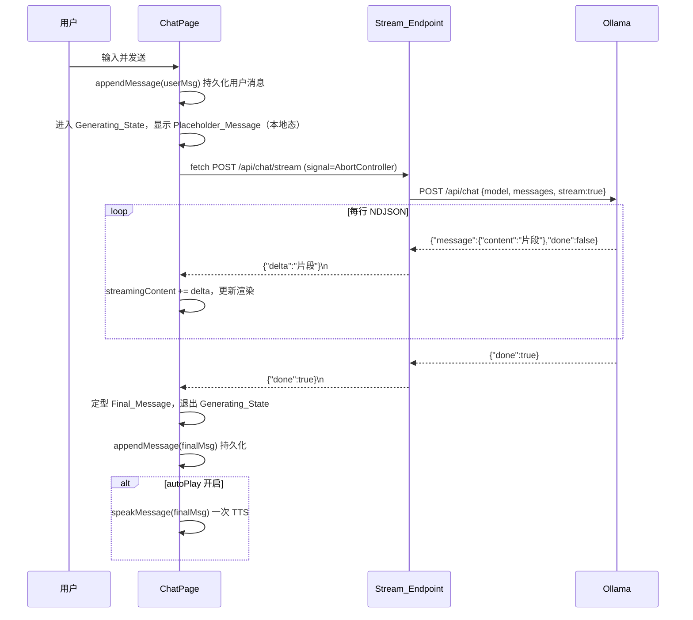

# Design Document

## Overview

「流式对话输出」(streaming-chat-output) 为女娲 Nuwa 对话页引入打字机式增量渲染。整体由两部分组成：

- **后端 Voxcpm_Server** 新增 `POST /api/chat/stream`（Stream_Endpoint），它向 Ollama 发起 `stream:true` 请求，读取 Ollama 返回的 NDJSON 流（`bytes_stream`），逐行解析出增量文本（`message.content`）与结束标志（`done`），再以**统一的 NDJSON 块协议**逐块下发给前端；既有 `POST /api/chat`（Chat_Endpoint）保持契约不变，作为降级路径。
- **前端 Nuwa_Web** 在 `ChatPage` 用基于 `fetch` + `ReadableStream` 的流式消费替换原有的一次性 `apiClient.post('/api/chat')`：发送后立即出现 assistant「生成中」占位（Placeholder_Message），随增量到达更新内容（Streaming_Message），完成或停止后定型为 Final_Message 并持久化、可选触发一次 TTS。

本特性为**纯增量增强**：不改变 Chat_Endpoint 的请求/响应契约、不改变 Model_Selection 回退顺序、不改变 Session_Persistence / Voice_Loop / 模型管理等既有能力。

### 关键设计决策

1. **下行协议选用 NDJSON over chunked HTTP（`application/x-ndjson`），不使用 SSE。**
   - 前端按 Requirement 2.6 必须用 `fetch` + `ReadableStream` 消费（而非 `EventSource`），因此 SSE 的 `data:` 前缀与双换行分帧只是额外负担。
   - Ollama 本身即 NDJSON；后端把「解析 Ollama NDJSON → 重新编码为本服务的 NDJSON 块」保持同构，转换最薄、最易测。
   - 错误与结束都表达为流中的一行 JSON（`{"error": ...}` / `{"done": true}`），无需额外的 SSE 事件类型机制。
   - 既有 `handlers/sse.rs` 的 `Sse<Stream>` 仅用于心跳进度，与本场景诉求不同，不复用其编码方式。

2. **后端以 `axum::body::Body::from_stream` 直接返回字节流**，stream item 为 `Result<Bytes, std::io::Error>`，绕开 `Json` 提取器，从而能在「已开始响应」后仍把错误作为流内 chunk 下发（Requirement 1.6/1.7）。

3. **前端流式态采用「组件本地态 + 完成时单次 appendMessage」**，不在 Chat_Store 中新增 `streamingMessageId`/`updateStreamingMessage`。理由见 Components 一节，核心是：`appendMessage` 仍是**唯一**持久化入口且仅在定型时调用一次，从而天然满足「中间态不逐 token 持久化」(Req 4.4) 且零侵入 Session_Persistence（Req 7.5/7.5 回归最小化）。

4. **模型选择逻辑抽取为纯函数 `resolve_model` 并被 `chat` 与 `chat_stream` 共用**，保证两接口 Model_Selection 行为完全一致（Req 1.2 / 7.2）。

## Architecture

```mermaid
flowchart LR
    subgraph Nuwa_Web["Nuwa_Web (React 19)"]
        CP[ChatPage.tsx]
        SC[lib/streamChat.ts<br/>纯解析/累积逻辑]
        ST[uiStore<br/>appendMessage 不变]
        CP -->|fetch + ReadableStream| SC
        CP -->|定型时单次| ST
    end

    subgraph Voxcpm_Server["Voxcpm_Server (Axum 0.8)"]
        H1["POST /api/chat (不变)"]
        H2["POST /api/chat/stream (新增)"]
        RM[resolve_model 纯函数]
        NP[ndjson 解析纯函数<br/>split_lines / parse_ollama_line]
        H1 --> RM
        H2 --> RM
        H2 --> NP
    end

    Ollama["Ollama /api/chat<br/>stream:true (NDJSON)"]

    CP -->|"POST /api/chat/stream"| H2
    CP -. "降级 Fallback_Strategy" .->|"POST /api/chat"| H1
    H2 -->|"stream:true"| Ollama
    Ollama -->|"NDJSON bytes_stream"| H2
    H2 -->|"application/x-ndjson 块流"| CP
```

### 请求/数据流（正常流式）



### 模块划分

- 后端新增文件：`backend/server/src/handlers/chat_stream.rs`（流式 handler + NDJSON 纯函数 + 单元/属性测试）。
- 后端改动：`handlers/chat.rs` 抽出 `resolve_model`（供两者复用）；`handlers/mod.rs` 导出 `chat_stream`；`routes/mod.rs` 注册新路由。
- 前端新增文件：`app/web/src/lib/streamChat.ts`（纯解析/累积 + `consumeChatStream` 流消费器）。
- 前端改动：`app/web/src/components/ChatPage.tsx`（`handleSend` 改为流式消费、流式态渲染、`handleStop` 经 AbortController 中断、错误与降级）。

## Components and Interfaces

### 后端：Stream_Endpoint

```rust
// handlers/chat_stream.rs

/// 单个下行数据块（Stream_Chunk）的内部表示。序列化为一行 NDJSON。
/// delta / done / error 三者互斥地承载本块语义。
#[derive(Debug, Serialize)]
struct StreamChunk {
    #[serde(skip_serializing_if = "Option::is_none")]
    delta: Option<String>,
    #[serde(skip_serializing_if = "std::ops::Not::not")]
    done: bool,
    #[serde(skip_serializing_if = "Option::is_none")]
    error: Option<String>,
}

/// 复用 chat.rs 的 ChatRequest / ChatMessage（结构相同：messages, model?, system?）。
/// 流式对话 handler：返回字节流响应（application/x-ndjson）。
pub async fn chat_stream(
    State(state): State<Arc<RwLock<AppState>>>,
    Json(req): Json<ChatRequest>,
) -> Response;
```

签名说明：

- 返回 `axum::response::Response`，body 由 `Body::from_stream(s)` 构造，`s: impl Stream<Item = Result<Bytes, io::Error>>`，`Content-Type: application/x-ndjson`。
- handler 内部先用 `resolve_model` 选定模型、构造 Ollama 请求体（`stream:true`，System_Prompt 作为首条 `role:"system"`），再 `reqwest::Client::post(...).send()`：
  - 若 `send()` 失败（无法连接 Ollama）→ 返回一个**只含一个 error chunk**的流（Req 1.6）。
  - 若状态码非成功 → 读取错误文本，返回一个只含一个 error chunk 的流（Req 1.7）。
  - 成功 → 取 `resp.bytes_stream()`，用 `async_stream`/手写状态机维护 leftover 缓冲，逐字节累积、按 `\n` 分帧、`parse_ollama_line` 提取 delta/done，逐块 yield `StreamChunk`，遇 `done:true` 追加 done chunk 并结束。

NDJSON 解析纯函数（核心可测逻辑）：

```rust
/// 把已累积缓冲按 '\n' 分帧为「完整行」与「剩余未完成片段」。
/// 不分配新字符串，按 &str 切分；空行被跳过由调用方决定。
pub fn split_lines(buffer: &str) -> (Vec<&str>, &str);

/// 解析 Ollama 单行 NDJSON，提取增量与结束标志。
/// 容错：非 JSON / 缺字段时 delta 为 ""、done 为 false（由上层决定是否忽略空行）。
pub fn parse_ollama_line(line: &str) -> OllamaLine; // { delta: String, done: bool }
```

流解析伪代码：

```text
leftover = ""
for await bytes in resp.bytes_stream():
    leftover += utf8(bytes)                  # UTF-8 边界由累积保证：不完整字节留在 leftover
    (lines, rest) = split_lines(leftover)
    leftover = rest
    for line in lines (跳过空白行):
        parsed = parse_ollama_line(line)
        if parsed.delta 非空:
            yield StreamChunk{ delta: Some(parsed.delta) }
        if parsed.done:
            yield StreamChunk{ done: true }
            return
# 流自然结束（Ollama 未显式 done）：补发一个 done chunk
yield StreamChunk{ done: true }
```

`resolve_model`（从 `chat.rs` 抽取，行为与现状逐字一致）：

```rust
/// Model_Selection：current_llm_model → current_model_id → 请求体 model（默认 gemma4:e4b）。
pub fn resolve_model(
    current_llm_model: Option<String>,
    current_model_id: Option<String>,
    request_model: &str,
) -> String {
    current_llm_model
        .or(current_model_id)
        .unwrap_or_else(|| request_model.to_string())
}
```

### 后端：路由注册

```rust
// routes/mod.rs，在既有 /api/chat 之后新增一行：
.route("/api/chat/stream", post(handlers::chat_stream::chat_stream))
```

`POST /api/chat` 一行保持原样不动（Req 1.8 / 7.1）。

### 前端：流消费纯逻辑 `lib/streamChat.ts`

```typescript
/** 下行块（Stream_Chunk）解码后的形态。三字段互斥。 */
export interface StreamChunk {
  delta?: string;
  done?: boolean;
  error?: string;
}

/** NDJSON 分帧：返回完整行数组与剩余未完成片段（纯函数）。 */
export function parseStreamLines(buffer: string): { lines: string[]; rest: string };

/** 解析单行为 StreamChunk；非法 JSON 返回 {}（由调用方忽略）。 */
export function parseChunk(line: string): StreamChunk;

/** 增量累积（纯函数）：把一个块的 delta 追加到已累积文本。 */
export function accumulateDelta(prev: string, chunk: StreamChunk): string;

/**
 * 消费 Stream_Endpoint 响应体：基于 fetch + ReadableStream + TextDecoder。
 * 通过回调把每个 StreamChunk 交给调用方（ChatPage 累积/渲染）。
 * 支持 AbortSignal 中断；连接失败（未产生任何块）抛出可被降级捕获的错误。
 */
export async function consumeChatStream(
  body: ReadableStream<Uint8Array>,
  onChunk: (chunk: StreamChunk) => void,
): Promise<void>;
```

### 前端：`ChatPage` 流式态（本地态方案）

新增组件本地状态（不动 uiStore）：

```typescript
const [isTyping, setIsTyping] = useState(false);          // Generating_State（沿用）
const [streamingContent, setStreamingContent] = useState(''); // Streaming_Message 当前内容
const [isStreaming, setIsStreaming] = useState(false);    // 是否展示流式占位气泡
const accRef = useRef('');                                 // 累积文本（避免闭包陈旧）
const [abortController, setAbortController] = useState<AbortController | null>(null);
```

`handleSend` 改造流程：

1. `appendMessage(userMsg)` 持久化用户消息（不变，Req 4.1）。
2. 进入 `isTyping=true`、`isStreaming=true`、`streamingContent=''`、`accRef.current=''`；新建 `AbortController`。
3. `fetch('/api/chat/stream', { method:'POST', body: JSON, signal })`：
   - `res.ok === false` 或 `fetch` reject 且 `accRef.current === ''` → 走 **Fallback_Strategy**（调用既有 `/api/chat` 逻辑，得到回复后作为 Final_Message 走第 5 步）。
   - 否则 `consumeChatStream(res.body, onChunk)`。
4. `onChunk`：
   - `chunk.delta`：`accRef.current = accumulateDelta(accRef.current, chunk)`；`setStreamingContent(accRef.current)`（Req 2.2/2.5）。
   - `chunk.error`：记录错误，停止消费（Req 6.1）。
   - `chunk.done`：标记完成。
5. **定型**（finalize）：
   - 若 `accRef.current` 非空 → `appendMessage(finalMsg{content: accRef.current, voiceName})`（Req 2.4/4.2）。若 autoPlay 开启则 `speakMessage(finalMsg)` 一次（Req 5.1）。
   - 若为空（停止/错误且无增量）→ 不调用 `appendMessage`（移除占位即可，Req 3.5/6.6）。
   - `setIsTyping(false); setIsStreaming(false); setStreamingContent('')`。
6. `handleStop`：`abortController.abort()`；`consumeChatStream` 因 `AbortError` 退出，进入第 5 步定型（保留 `accRef.current`，Req 3.2/3.3/3.4）。停止时若已有内容且 autoPlay 开启 → TTS 一次（Req 5.4）。

渲染：消息列表照旧渲染 store `messages`；当 `isStreaming` 时，在列表末尾追加一个 assistant 气泡，内容绑定 `streamingContent`，并提供 Stop 按钮（替代原 typing 三点指示，Req 2.1/3.1）。

**为何选本地态而非扩展 uiStore：**

- `appendMessage` 仍是唯一持久化入口，仅在定型时调用一次 → 直接满足「中间态不持久化」(Req 4.4)，且复用既有自动标题/`updatedAt` 行为（Req 4.5），零改动 Session_Persistence（Req 7.5）。
- 流式占位是纯瞬态视图，放进全局 store 会引入需要小心清理的临时状态、增加 Session_Persistence 回归面。
- 备选方案（store 增 `streamingMessageId`/`updateStreamingMessage`/`finalizeStreaming`）可行，但收益主要是跨组件共享流式态——本特性无此需求，故不采用。

## Data Models

### 下行块协议（Stream_Chunk，`application/x-ndjson`）

每个 chunk 是一行 JSON + `\n`，字段互斥：

| 字段    | 类型      | 含义                                   | 触发的需求 |
| ------- | --------- | -------------------------------------- | ---------- |
| `delta` | `string`  | 本块新增文本（增量 token 片段）        | 1.4 / 2.2  |
| `done`  | `boolean` | `true` 表示生成结束，流随后关闭        | 1.5 / 2.4  |
| `error` | `string`  | 错误信息（友好提示），随后关闭流        | 1.6 / 1.7 / 6.1 |

示例：

```
{"delta":"你好"}
{"delta":"，我是女娲"}
{"done":true}
```

错误示例：

```
{"error":"无法连接 Ollama：connection refused。请确认 Ollama 已启动且模型已加载。"}
```

### Ollama 上行（既有约定，不变）

请求体 `{ model, messages, stream: true }`；`messages` 在有 System_Prompt 时首条为 `{role:"system", content:<systemPrompt>}`。响应为 NDJSON，每行 `{ "message": { "content": "..." }, "done": bool }`。

### 前端流式消息状态

Streaming_Message 不进入 `ChatMessage[]`（store），而是组件本地 `streamingContent: string` + `isStreaming: boolean`。定型时构造标准 `ChatMessage`（`{ id, role:'assistant', content, voiceName, duration }`）经 `appendMessage` 落库。`ChatMessage` 类型本身不变（Req 7 无回归）。

### Chat_Endpoint（不变，降级用）

请求 `{ messages, model?, system? }`，响应 `{ role, content, model, done }`，错误 `{ error }`。本特性不修改其任何字段。

## Correctness Properties

*属性（property）是在系统所有合法执行中都应成立的特征或行为——一种关于「系统应当做什么」的形式化陈述。属性是人类可读规格与机器可验证正确性保证之间的桥梁。*

本特性的核心可属性化逻辑集中在**纯函数层**：NDJSON 字节分帧、下行块协议的序列化/解析、增量文本累积、模型选择回退、Ollama 请求消息构造，以及定型持久化决策。以下属性均以「对任意输入」陈述，将以属性测试实现（前端 fast-check、后端 proptest），UI 交互与外部服务路径则以示例/集成测试覆盖（见 Testing Strategy）。

### Property 1: NDJSON 分帧 round-trip 与切分无关性（confluence）

*对任意* 文本与该文本的*任意*字节/字符切分方式，将各片段按顺序喂入分帧逻辑（`parseStreamLines` / `split_lines`，每次保留未完成片段为 leftover）所得到的「完整行序列（按到达顺序）」与「最终 leftover」，应与对完整文本一次性分帧的结果相同；且 `lines` 以 `\n` 连接再接上 `rest` 可重构原始文本。

**Validates: Requirements 1.4, 1.5, 2.2**

### Property 2: Stream_Chunk 协议序列化/解析 round-trip

*对任意* Stream_Chunk（恰含 `delta`、`done`、`error` 三者之一的合法块），将其序列化为一行 JSON 再用 `parseChunk` 解析，应得到语义等价的块；非法 JSON 行解析为空块并被消费逻辑忽略。

**Validates: Requirements 1.4, 6.1**

### Property 3: 增量累积顺序保持（含停止时点保留）

*对任意* 增量文本块序列与其*任意*到达切分，处理前 k 个增量块后累积内容 (`accumulateDelta` 折叠) 等于这 k 个 `delta` 按到达顺序的拼接；特别地，正常完成时 Final_Message.content 等于全部增量的顺序拼接，被 Stop_Action 截断时等于停止前已接收增量的顺序拼接。

**Validates: Requirements 2.2, 2.5, 3.3**

### Property 4: Model_Selection 回退顺序

*对任意* `(current_llm_model, current_model_id, request_model)` 取值（前两者各自可为 Some/None），`resolve_model` 返回值等于 `current_llm_model` 若为 Some，否则 `current_model_id` 若为 Some，否则 `request_model`；该结果在 Chat_Endpoint 与 Stream_Endpoint 间一致。

**Validates: Requirements 1.2, 7.2**

### Property 5: System_Prompt 前置构造不变式

*对任意* 可选 System_Prompt 与*任意* messages 列表，构造出的 Ollama 请求 `messages` 等于「存在 System_Prompt 时以一条 `role:"system"` 为首」后接原 messages（顺序不变），且请求体 `stream` 为 `true`、`model` 为已解析模型。

**Validates: Requirements 1.3**

### Property 6: 定型持久化次数不变式

*对任意* 以结束（done 或被停止）收尾的增量块序列，流式管线对 assistant Final_Message 的持久化（`appendMessage` 等价路径）调用次数等于「累积内容非空时为 1、为空时为 0」，与增量块的数量无关；内容为空时不产生 Final_Message（移除占位）。

**Validates: Requirements 3.5, 4.4, 6.6**

## Error Handling

错误按「是否已产生增量内容」分层处理，决定降级还是保留：

| 场景 | 后端行为 | 前端行为 | 需求 |
| ---- | -------- | -------- | ---- |
| Stream_Endpoint 不可达（fetch reject / `res.ok=false`），且尚无增量 | — | 走 **Fallback_Strategy**：改调 `POST /api/chat`，成功则作为 Final_Message 渲染并持久化 | 6.2 / 6.3 |
| 降级 `POST /api/chat` 仍失败 | 返回 `{error}` | 展示错误提示并退出 Generating_State，移除占位 | 6.4 / 6.6 |
| 后端无法连接 Ollama | 流内下发单个 `{"error": "...Ollama 未启动或模型未加载..."}` 并结束 | 收到 error chunk：展示友好提示并退出生成态；若此时无增量则移除占位 | 1.6 / 6.1 / 6.5 / 6.6 |
| Ollama 返回非成功状态码 | 读取错误文本，下发 `{"error": "Ollama error: ..."}` 并结束流 | 同上 | 1.7 / 6.1 |
| 流中途出错但**已有**增量 | 下发 error chunk 并结束 | 保留已接收内容作为 Final_Message 并持久化（不丢已生成部分），同时提示错误 | 6.1 + 3.3 |
| 用户 Stop_Action | reqwest 请求随连接关闭中断 | AbortController.abort() 停止消费；保留已接收内容定型（非空才落库/TTS） | 3.2–3.5 |

要点：

- **降级判定以「是否已收到首个增量」为界**：一旦开始产生内容就不再降级（避免重复/错位回复），转为「保留 + 提示」。
- 后端 handler 一旦进入流式响应（已 200 + 开始写 body），错误只能以 error chunk 表达，不能再改 HTTP 状态码——这是选择字节流 + 流内错误协议的原因。
- UTF-8 安全：后端按字节累积、仅在 `\n` 处分帧，未完成的多字节序列留在 leftover，避免半个字符被切坏。
- 前端 `consumeChatStream` 捕获 `AbortError` 视为正常停止（不报错）；其余异常在「无增量」时交由降级、「有增量」时保留并提示。

## Testing Strategy

采用**单元/示例测试 + 属性测试**双轨：示例测试覆盖具体 UI 交互、错误路径与外部服务集成；属性测试覆盖纯逻辑的普适正确性（每条属性最少 100 次随机迭代）。

### 属性测试（PBT）

- **前端（Vitest + fast-check，`app/web`）**：实现 `lib/streamChat.ts` 中纯函数的属性。每个测试以注释标注对应设计属性，最少 100 次迭代。
  - Property 1：`parseStreamLines` 分帧 round-trip/confluence。
  - Property 2：`parseChunk(serialize(chunk))` 协议 round-trip。
  - Property 3：`accumulateDelta` 折叠顺序保持（含「前 k 个」截断）。
  - Property 6：以 fast-check 驱动任意 delta 序列经 `consumeChatStream` + 定型，spy 统计持久化次数 == 非空?1:0。
- **后端（cargo + proptest，`backend/server`）**：在 `handlers/chat_stream.rs` 的 `#[cfg(test)] mod tests` 内实现，沿用既有 `#![proptest_config(ProptestConfig::with_cases(>=100))]` 写法。
  - Property 1：`split_lines` 分帧 round-trip/confluence。
  - Property 2：`StreamChunk` 序列化 ↔ `parse_ollama_line`/解析（done 默认值、转义、字段缺失）。
  - Property 4：`resolve_model` 回退顺序。
  - Property 5：Ollama 请求 `messages` 的 system 前置构造不变式。

属性测试标签格式（注释）：`// Feature: streaming-chat-output, Property {number}: {property_text}`。

### 示例 / 集成 / 组件测试

- **后端 cargo**：
  - 集成示例：`/api/chat/stream` 对合法请求返回 200 + `application/x-ndjson`（1.1）；Ollama 不可达 → 单个 error chunk 含友好文案（1.6）；非成功状态码 → error chunk 并结束（1.7）。
  - 契约回归：既有 `/api/chat` 测试保持通过（1.8 / 7.1）。
- **前端 Vitest + Testing Library（受控 mock `ReadableStream`）**：用一个可手动 enqueue/close/error 的假流驱动 `ChatPage`。
  - 渲染/状态：发送出现占位且禁用输入（2.1/2.3）；增量到达文本增长（2.2）；done 定型并退出生成态（2.4）。
  - 停止：生成中有 Stop 入口（3.1）；点击 abort 停止消费、保留内容、退出（3.2–3.4）；无内容时移除占位不落库（3.5）。
  - 持久化：用户消息落库（4.1）；完成/停止非空落库一次（4.2/4.3）；复用自动标题/`updatedAt`（4.5）。
  - TTS：autoPlay 开 + 完成触发一次、内容为完整文本（5.1）；进行中不触发（5.2）；autoPlay 关不触发（5.3）；停止非空 + autoPlay 开触发一次（5.4）。
  - 错误/降级：error chunk 展示并退出（6.1）；无增量时连接失败降级 `/api/chat` 成功渲染+持久化（6.2/6.3）；降级再失败提示并退出（6.4）；Ollama 文案透传（6.5）；错误且无增量移除占位（6.6）。
- **无回归**：复用既有 uiStore/会话测试（7.5）、ASR/录音（7.3）、TTS（7.4）、模型管理与下载（7.6）测试套件，确保全绿。

### 构建与验证命令

- 前端：`npm run test`（vitest --run）、`npm run build`（tsc + vite build）、`npm run lint`。
- 后端：`cargo test`、`cargo build`。
- 长时进程（`vite`/`vitest --watch`）请勿在自动化中启动；测试统一用 `--run`/`cargo test` 单次执行。

### 受影响文件清单

新增：

- `backend/server/src/handlers/chat_stream.rs` — 流式 handler + `split_lines`/`parse_ollama_line`/`StreamChunk` + 消息构造纯函数 + 测试。
- `app/web/src/lib/streamChat.ts` — `parseStreamLines`/`parseChunk`/`accumulateDelta`/`consumeChatStream`。
- `app/web/src/lib/streamChat.test.ts` — 前端属性测试（Property 1/2/3/6）。
- `app/web/src/components/ChatPage.test.tsx` — 流式渲染/停止/持久化/TTS/降级组件测试（如不复用既有文件）。

修改：

- `backend/server/src/handlers/chat.rs` — 抽出 `resolve_model` 纯函数并改为调用（行为不变）。
- `backend/server/src/handlers/mod.rs` — `pub mod chat_stream;`。
- `backend/server/src/routes/mod.rs` — 注册 `.route("/api/chat/stream", post(handlers::chat_stream::chat_stream))`。
- `app/web/src/components/ChatPage.tsx` — `handleSend` 流式化、流式态渲染、`handleStop`、错误与降级。

不改动（契约/行为保持）：`POST /api/chat` 路由与 `chat` 响应结构、`uiStore` 的 `appendMessage`/会话逻辑、`useApi`、`client.ts`。
