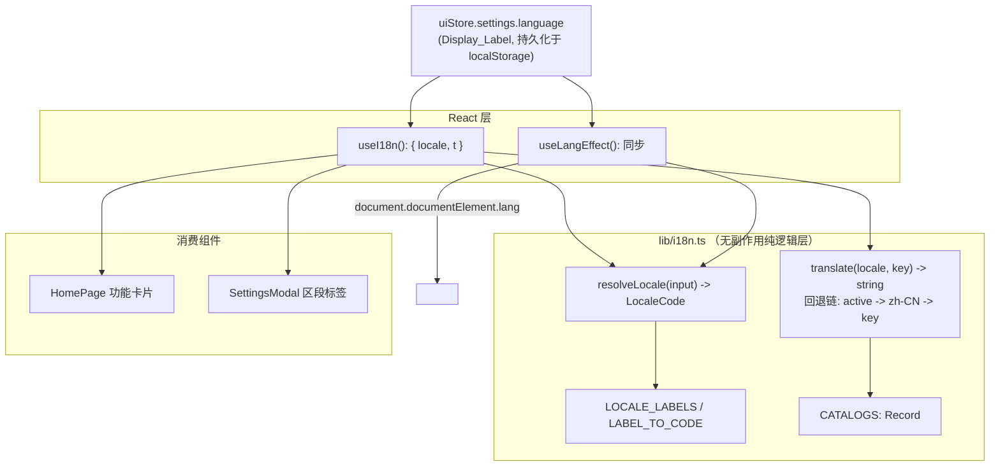

# Design Document

## Overview

界面多语言（UI Internationalization, i18n）为女娲 Nuwa Web 应用提供一个轻量、零第三方依赖的前端界面字符串国际化层。本设计严格镜像既有外观主题系统（appearance-theme-mode）的分层模式：

- **纯逻辑层**（`lib/i18n.ts`）：无副作用纯函数（`resolveLocale` 语言解析归一、`translate` 带回退键查找）与静态数据（`LOCALE_LABELS`、翻译目录）。对应 `lib/theme.ts` 的 `resolveTheme`。
- **React 读取 Hook**（`hooks/useI18n.ts`）：从既有 Zustand `uiStore` 读取 `settings.language`，解析为当前 `LocaleCode`，返回绑定当前语言的 `t(key)` 翻译函数。
- **薄副作用 Hook**（`hooks/useLangEffect.ts`）：将 `document.documentElement.lang` 同步为当前 `LocaleCode`，是唯一接触该 DOM 属性的代码。对应 `hooks/useThemeEffect.ts`。
- **消费层**：`HomePage` 功能卡片标题/描述、`SettingsModal` 区段标签由硬编码中文字面量替换为 `t(key)` 调用。

设计的核心约束来自需求：所有核心逻辑（语言解析、带回退查找）必须是无副作用纯函数，对相同输入恒返回相同输出，便于用 vitest + fast-check 做属性测试。

### 关键设计决策

| 决策 | 选择 | 理由 |
| --- | --- | --- |
| 不引入 i18n 框架 | 自建纯函数层 | 需求明确限定轻量、零第三方依赖；翻译键集合小且静态 |
| 语言状态来源 | 复用既有 `settings.language` | 该字段已持久化于 `localStorage`，并已绑定 SettingsModal 选择器；不新增持久状态 |
| `settings.language` 存储形态 | 维持现状（存 `Display_Label`，如 `简体中文`） | 避免数据迁移；由 `resolveLocale` 在读取侧统一归一为 `LocaleCode` |
| 回退策略 | active → `zh-CN` → key 本身 | 保证界面永不出现空白（Req 3、Req 5.5） |
| DOM 副作用隔离 | 单独 `useLangEffect` | 镜像 `useThemeEffect`，保持纯逻辑可测、副作用集中 |

## Architecture



数据流：

1. 用户在 `SettingsModal` 选择语言 → `updateSetting('language', Display_Label)` 写入 `uiStore` 并持久化。
2. `useI18n` 订阅 `settings.language`，经 `resolveLocale` 得到当前 `LocaleCode`，返回绑定该 locale 的 `t`。
3. 消费组件调用 `t(key)` → 内部走 `translate(locale, key)` 三级回退查找返回字符串。
4. `useLangEffect` 同样订阅 `settings.language`，在变更时把 `<html lang>` 同步为当前 `LocaleCode`。

层间依赖单向：UI → Hooks → 纯逻辑层 → 静态数据。纯逻辑层不导入 React，也不读写 store 或 DOM。

## Components and Interfaces

### `lib/i18n.ts`（纯逻辑层）

```typescript
/** 受支持语言的规范代码集合（Locale_Code）。zh-CN 为 Default_Locale。 */
export type LocaleCode = 'zh-CN' | 'en' | 'ja';

/** 默认语言代码（Default_Locale）。 */
export const DEFAULT_LOCALE: LocaleCode = 'zh-CN';

/** 全部受支持 Locale_Code，按稳定顺序。 */
export const SUPPORTED_LOCALES: readonly LocaleCode[] = ['zh-CN', 'en', 'ja'];

/** Locale_Code -> Display_Label 映射（设置选择器中展示的名称）。 */
export const LOCALE_LABELS: Record<LocaleCode, string> = {
  'zh-CN': '简体中文',
  en: 'English',
  ja: '日本語',
};

/** 翻译键（Translation_Key）：标识一条界面文案的稳定字符串键。 */
export type TranslationKey = string;

/** 单一 Locale_Code 对应的翻译目录（Translation_Catalog）。 */
export type TranslationCatalog = Record<TranslationKey, string>;

/**
 * 将任意输入归一为合法 LocaleCode（Locale_Resolver）。无副作用纯函数。
 *
 * - 输入等于某合法 LocaleCode（'zh-CN'/'en'/'ja'）→ 原样返回（Req 2.2）
 * - 输入等于某 Display_Label（'简体中文'/'English'/'日本語'）→ 返回对应 LocaleCode（Req 2.1）
 * - 其他任意输入（空串、null、undefined、未知字符串）→ 返回 DEFAULT_LOCALE（Req 2.3）
 *
 * 不读写 store/DOM/任何外部状态；对相同输入恒返回相同输出（Req 2.4）。
 */
export function resolveLocale(input: string | null | undefined): LocaleCode;

/**
 * 带回退的翻译查找（Translation_Lookup）。无副作用纯函数。
 *
 * 回退链（Req 3）：
 * 1. 若 key 在 locale 目录中已定义 → 返回该值（Req 3.1）
 * 2. 否则若 key 在 DEFAULT_LOCALE 目录中已定义 → 返回默认语言值（Req 3.2）
 * 3. 否则 → 返回 key 本身作为占位（Req 3.3）
 *
 * 对相同 (locale, key) 恒返回相同字符串，不修改任何外部状态（Req 3.4）。
 */
export function translate(locale: LocaleCode, key: TranslationKey): string;
```

### `hooks/useI18n.ts`（当前语言驱动的翻译 Hook）

```typescript
export interface I18n {
  /** 由 settings.language 经 resolveLocale 得到的当前 LocaleCode。 */
  locale: LocaleCode;
  /** 绑定当前 locale 的翻译函数：t(key) === translate(locale, key)。 */
  t: (key: TranslationKey) => string;
}

/**
 * 读取 uiStore.settings.language（Req 4.1），解析当前 LocaleCode，
 * 返回绑定该 locale 的 t（Req 4.2）。settings.language 变更时 store
 * 触发重渲染，locale 与 t 随之更新（Req 4.3）。
 */
export function useI18n(): I18n;
```

实现要点：通过 `useUIStore((s) => s.settings.language)` 订阅 → `resolveLocale` 归一 → 以 `useMemo` 基于 `locale` 缓存 `t`。`settings.language` 变更触发 Zustand 选择器重渲染，从而 `locale`/`t` 更新，消费组件重渲染为新语言（Req 4.3）。

### `hooks/useLangEffect.ts`（HTML lang 同步副作用）

```typescript
/**
 * 运行期副作用：将 document.documentElement.lang 同步为当前 LocaleCode。
 * 镜像 useThemeEffect 的结构。在 App 顶层调用一次。
 *
 * - 初始渲染后将 <html lang> 设为当前 LocaleCode（Req 6.1）
 * - settings.language 变更导致 LocaleCode 改变时，更新 <html lang>（Req 6.2）
 */
export function useLangEffect(): void;
```

实现要点：`const language = useUIStore((s) => s.settings.language)`；`useEffect(() => { document.documentElement.lang = resolveLocale(language); }, [language])`。

### 消费组件改造

- **`HomePage.tsx`**：`features` 数组的 `title`/`desc` 字面量替换为翻译键引用；组件内 `const { t } = useI18n()`，渲染处用 `t(f.titleKey)` / `t(f.descKey)`。页副标题「多模型 AI 交互终端」同样改为 `t('home.subtitle')`。
- **`SettingsModal.tsx`**：区段标签（设置标题、外观、后端地址、模型目录、界面语言、合成后自动播放及其副描述、主题三选项）改为 `t(key)`。语言 `<select>` 的选项继续使用 `LOCALE_LABELS` 的值作为展示文本与存储值（维持 `settings.language` 存 `Display_Label` 的现状）。
- **`App.tsx`**：在既有 `useThemeEffect()` 旁新增 `useLangEffect()` 调用一次。

## Data Models

### 翻译键命名约定

采用点分层级 `domain.section.item`（或 `domain.feature.id.field`），保证稳定、可读、无碰撞：

- 首页：`home.subtitle`、`home.feature.{chat|characters|presets|voice|transcribe|models}.{title|desc}`
- 设置：`settings.title`、`settings.appearance`、`settings.backendUrl`、`settings.modelsDir`、`settings.language`、`settings.autoPlay.title`、`settings.autoPlay.desc`、`settings.theme.dark`、`settings.theme.light`、`settings.theme.system`

### 翻译目录（Translation_Catalog）

`CATALOGS: Record<LocaleCode, TranslationCatalog>`，三种语言共享同一组 `Translation_Key`（Req 1.2）。`zh-CN` 目录对每个键提供非空字符串（Req 1.3）。示例（节选）：

| Translation_Key | zh-CN | en | ja |
| --- | --- | --- | --- |
| `home.subtitle` | 多模型 AI 交互终端 | Multi-model AI terminal | マルチモデル AI ターミナル |
| `home.feature.chat.title` | 智能对话 | Smart Chat | スマートチャット |
| `home.feature.chat.desc` | 与 AI 对话，用声音回复 | Chat with AI, reply with voice | AI と会話し、音声で応答 |
| `home.feature.characters.title` | 角色管理 | Characters | キャラクター管理 |
| `home.feature.presets.title` | 提示词 | Prompts | プロンプト |
| `home.feature.voice.title` | 声音工坊 | Voice Studio | ボイススタジオ |
| `home.feature.transcribe.title` | 录音转写 | Transcription | 文字起こし |
| `home.feature.models.title` | 模型管理 | Models | モデル管理 |
| `settings.title` | 设置 | Settings | 設定 |
| `settings.appearance` | 外观 | Appearance | 外観 |
| `settings.backendUrl` | 后端地址 | Backend URL | バックエンド URL |
| `settings.modelsDir` | 模型目录 | Models Directory | モデルディレクトリ |
| `settings.language` | 界面语言 | Language | 言語 |
| `settings.autoPlay.title` | 合成后自动播放 | Auto-play after synthesis | 合成後に自動再生 |

> 实现时补全全部功能卡片的 `desc` 与设置项的完整三语字符串。`zh-CN` 全键非空（Req 1.3）；`en`/`ja` 缺某键时由 `translate` 回退到 `zh-CN`（Req 3.2、Req 5.5）。

### Display_Label 与 Locale_Code 映射

| Locale_Code | Display_Label |
| --- | --- |
| `zh-CN` | 简体中文 |
| `en` | English |
| `ja` | 日本語 |

`resolveLocale` 内部用 `LABEL_TO_CODE`（`LOCALE_LABELS` 的反向映射）与 `SUPPORTED_LOCALES` 集合完成归一。

## Correctness Properties

*A property is a characteristic or behavior that should hold true across all valid executions of a system — essentially, a formal statement about what the system should do. Properties serve as the bridge between human-readable specifications and machine-verifiable correctness guarantees.*

本节由前述 prework 分析推导而来。`resolveLocale` 与 `translate` 是无副作用纯函数，输入空间大（任意字符串、任意键），是属性测试的理想对象；翻译目录的结构不变量同样以全称命题表述。Hook 与 DOM 副作用（Req 4.1–4.3、5.1–5.5、6.1–6.2）依赖 React 渲染与 store 接线，输入空间有限，归类为集成/示例测试（见 Testing Strategy），不在此列为属性。

### Property 1: resolveLocale 对合法输入正确归一

*For any* 合法的 Display_Label 或合法的 LocaleCode 输入，`resolveLocale` 都返回其对应的 LocaleCode（Display_Label 映射到其代码；合法 LocaleCode 原样返回）。

**Validates: Requirements 2.1, 2.2**

### Property 2: resolveLocale 对非法输入回退 Default_Locale

*For any* 既非合法 Display_Label 也非合法 LocaleCode 的输入（包含空字符串、`null`、`undefined` 及任意未知字符串），`resolveLocale` 都返回 `DEFAULT_LOCALE`（`zh-CN`）。

**Validates: Requirements 2.3**

### Property 3: resolveLocale 全函数性与确定性

*For any* 输入（任意字符串、`null`、`undefined`），`resolveLocale` 都返回一个属于 `SUPPORTED_LOCALES` 的合法 LocaleCode，且对相同输入两次调用返回相同结果，并且调用不修改 `<html lang>` 或任何外部状态。

**Validates: Requirements 2.4**

### Property 4: translate 命中当前语言目录时返回该值

*For any* LocaleCode 与在该 LocaleCode 目录中已定义的 Translation_Key，`translate(locale, key)` 返回该目录中对应的字符串。

**Validates: Requirements 3.1**

### Property 5: translate 在当前语言缺失时回退默认语言

*For any* 在给定 LocaleCode 目录中未定义、但在 `DEFAULT_LOCALE` 目录中已定义的 Translation_Key，`translate(locale, key)` 返回 `DEFAULT_LOCALE` 目录中对应的字符串。

**Validates: Requirements 3.2**

### Property 6: translate 在两目录均缺失时返回键本身

*For any* 在给定 LocaleCode 目录与 `DEFAULT_LOCALE` 目录中均未定义的 Translation_Key，`translate(locale, key)` 返回该 Translation_Key 字符串本身。

**Validates: Requirements 3.3**

### Property 7: translate 确定性与无副作用

*For any* LocaleCode 与 Translation_Key，`translate(locale, key)` 对相同输入两次调用返回相同字符串，且调用不修改任何外部状态。

**Validates: Requirements 3.4**

### Property 8: 三种语言目录共享同一键集合

*For any* 两个受支持 LocaleCode，其 Translation_Catalog 的键集合相等（即 `zh-CN`、`en`、`ja` 三个目录拥有完全相同的 Translation_Key 集合）。

**Validates: Requirements 1.2**

### Property 9: zh-CN 目录的每个键值为非空字符串

*For any* 在 `zh-CN` 目录中定义的 Translation_Key，其对应值是一个 `trim` 后长度大于 0 的字符串。

**Validates: Requirements 1.3**

## Error Handling

本特性无网络/IO/异步路径，错误处理聚焦于「非法/缺失输入永不导致崩溃或空白」：

| 场景 | 处理 | 依据 |
| --- | --- | --- |
| `settings.language` 为未知值、空串、历史脏数据 | `resolveLocale` 回退 `DEFAULT_LOCALE`，界面以中文呈现 | Req 2.3 / Property 2 |
| `settings.language` 为 `null`/`undefined`（理论边界） | `resolveLocale` 接受 `string \| null \| undefined`，回退 `DEFAULT_LOCALE` | Req 2.3 / Property 2、3 |
| 某键在当前语言缺失 | `translate` 回退到 `zh-CN` 的值 | Req 3.2 / Property 5 |
| 某键在所有语言均缺失（如笔误键名） | `translate` 返回键本身作为可见占位，不空白 | Req 3.3 / Property 6 |
| `document.documentElement.lang` 同步 | `useLangEffect` 仅做一次属性赋值，幂等且不抛错；SSR/无 DOM 环境不在 Web 应用运行范围 | Req 6.1、6.2 |

设计上不抛出异常：`resolveLocale` 与 `translate` 均为全函数，对任意输入都有定义的返回值（Property 3、6）。

## Testing Strategy

采用「属性测试 + 示例/集成测试」双轨：纯逻辑层用 fast-check 做属性测试覆盖全输入空间；React Hook 与 DOM 副作用用 @testing-library/react 做集成测试覆盖接线与响应式行为。

### 工具与配置

- 测试运行器：**vitest**（`npm test` 已配置 `vitest --run`，jsdom 环境）。
- 属性测试库：**fast-check**（已在 devDependencies）。不从零实现属性测试框架。
- React 测试：**@testing-library/react** + **@testing-library/jest-dom**（已具备）。
- 每个属性测试最少运行 **100** 次迭代（`{ numRuns: 100 }`），镜像既有 `theme.test.ts`。
- 每个属性测试以注释标注其设计属性，格式：
  `// Feature: ui-internationalization, Property {number}: {property_text}`

### 属性测试（`lib/i18n.test.ts`）

覆盖 Property 1–9，针对 `resolveLocale`、`translate` 与目录结构不变量：

- **Property 1**：从 `LOCALE_LABELS` 生成 `(label, code)` 对与 `SUPPORTED_LOCALES`，断言 `resolveLocale(label) === code`、`resolveLocale(code) === code`。
- **Property 2**：`fc.oneof(fc.string(), fc.constant(null), fc.constant(undefined))` 过滤掉合法 label/code 后断言结果 `=== DEFAULT_LOCALE`；显式补 `''`、`null`、`undefined` 边界示例。
- **Property 3**：任意输入断言返回值 ∈ `SUPPORTED_LOCALES`、两次调用相等；断言调用前后 `document.documentElement.lang` 不变。
- **Property 4**：对每个 locale 从其目录键集合 `fc.constantFrom(...keys)` 采样，断言 `translate(locale, key) === CATALOGS[locale][key]`。
- **Property 5**：用合成目录注入「仅 zh-CN 定义」的键（或对真实目录中 en/ja 缺失键），断言回退到 `zh-CN` 值。
- **Property 6**：生成不在任何目录中的随机键（过滤已知键），断言 `translate(locale, key) === key`。
- **Property 7**：任意 `(locale, key)` 两次调用相等；调用不改外部状态。
- **Property 8**：对所有 LocaleCode 对断言 `Object.keys` 集合相等。
- **Property 9**：遍历 `zh-CN` 目录全部键，断言值为 `string` 且 `trim().length > 0`。

> Property 5 的回退构造若采用合成目录，须通过可注入的查找入口（或直接对真实目录中确实缺失的键测试），以保证测试稳定不受目录补全影响。

### 集成 / 示例测试（`hooks` 与组件）

非属性类验收标准用具体场景覆盖：

- **`useI18n`**（renderHook，Req 4.1–4.3）：设 `settings.language` 为各 Display_Label，断言 `locale === resolveLocale(label)` 且 `t(key) === translate(locale, key)`；`act` 中 `updateSetting('language', 新 label)` 后断言 `locale`/`t` 更新（响应式重渲染）。
- **`useLangEffect`**（Req 6.1–6.2）：在调用该 Hook 的宿主组件中渲染，断言 `document.documentElement.lang === resolveLocale(初始 language)`；`act` 更新 language 后断言 `lang` 更新为新 LocaleCode。
- **`HomePage`**（Req 5.1、5.3、5.4）：默认（zh-CN）渲染断言出现各功能卡片中文标题/描述；设 `language='English'`/`'日本語'` 渲染断言出现对应英文/日文文本。复用既有 `HomePage.test.tsx` 模式。
- **`SettingsModal`**（Req 5.2–5.4）：打开态渲染断言区段标签来自目录；切换语言断言文本随之变化。
- **回退不空白**（Req 5.5）：构造一个当前语言缺失的键，渲染断言显示回退文本（zh-CN 值或键占位），无空白。底层回退正确性已由 Property 5/6 保证。

### 单元/边界示例（`lib/i18n.test.ts` 内补充）

镜像 `theme.test.ts` 的确定性示例块：对 `resolveLocale` 写出三语 label/code、空串、`null`、`undefined`、未知串的确定性断言；对 `translate` 写出命中、回退默认、回退键本身的三个确定性示例，作为属性测试的可读补充。
