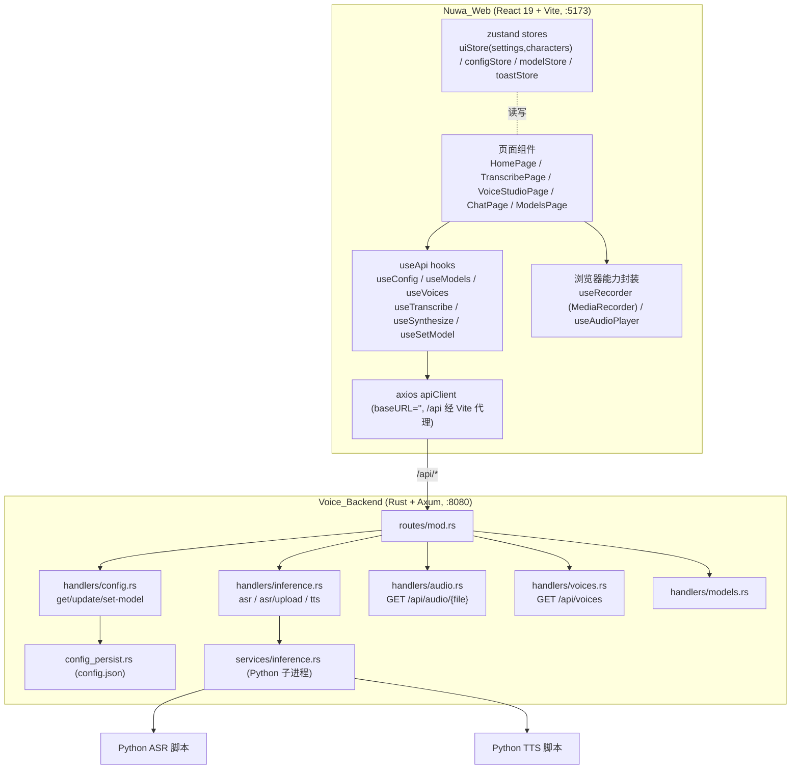
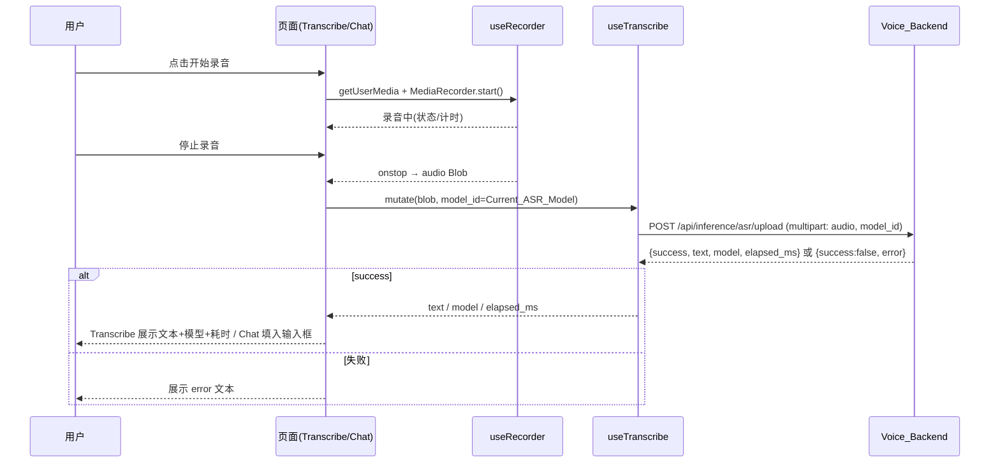
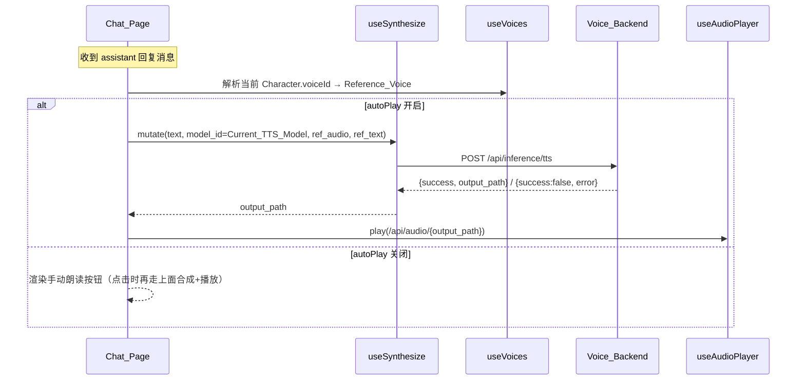

# Design Document

## Overview

「语音交互闭环」(voice-interaction-loop) 把女娲 Nuwa 平台已有但割裂的语音能力整合为端到端可用的整体，并清理历史 VoxCPM 遗留代码。后端 ASR/TTS 推理引擎（Rust 经 Python 子进程调用）已就绪且**不在本特性重写范围内**；本设计聚焦：

1. 前端 React（Nuwa_Web）三个页面与后端 `/api/inference/*` 的真实对接：录音转写页、声音工坊语音合成、对话页语音闭环。
2. ASR/TTS 当前模型选择的统一与持久化，前端默认后端地址修正为 `8080`。
3. VoxCPM 死代码清理：后端 `services/voxcpm.rs`、`POST /api/tts/generate`、`/api/tts/tasks/*` 路由及 handler；前端 `voxcpm_*` 配置字段、`GenerationMode`/`current_mode`/`default_cfg`/`default_timesteps`、`useGenerateTTS`/`useTaskStatus`/`useGenerationStore`。
4. 统一错误处理与现有功能（对话、模型管理、下载）无回归。

设计与现有技术栈保持一致：前端 `axios`（经 Vite 代理 `/api → localhost:8080`）+ `@tanstack/react-query` + `zustand`；后端 `axum` + `tokio`。所有推理仅经后端 `/api/inference/*` 完成，前端不直接连接 Python 进程。

### 现状与目标差距（基于真实代码勘察）

| 关注点 | 现状 | 目标 |
| --- | --- | --- |
| 录音转写页 | `App.tsx` 中为 `PlaceholderPage` 占位；首页入口 `disabled` | 新增 `TranscribePage` 组件，路由 `/transcribe` 渲染真实页面；首页入口可用 |
| 声音工坊合成 | 调用 `/api/inference/tts` 但**未传 `model_id`**，`ref_audio/ref_text` 恒为空，音色列表为硬编码假数据 | 传 Current_TTS_Model，接 `/api/voices` 选参考音色，提交 `ref_audio=path`、`ref_text=transcript` |
| 对话页 TTS | 已有录音+TTS，但 TTS **未传 `model_id`**、未带角色绑定音色 | 朗读时传 Current_TTS_Model 与角色绑定音色 ref；ASR 上传带 Current_ASR_Model |
| ASR 上传响应 | 后端 `AsrUploadResponse` 仅 `{success,text,error}` | 扩展 `model`、`elapsed_ms` 字段以满足「展示所用模型与耗时」 |
| 默认后端地址 | `uiStore.defaultSettings.backendUrl = 'http://localhost:9880'` | 改为 `http://localhost:8080`，并迁移 localStorage 旧值 |
| VoxCPM 后端 | `handlers/tts.rs`、`services/voxcpm.rs`、3 条 `/api/tts/*` 路由、`AppState.generation_tasks`/`GenerationTask` 仍在 | 全部移除；`TaskStatus`（被 `DownloadTask` 复用）保留 |
| VoxCPM 前端 | `store/index.ts` 的 `AppConfig`（含 `voxcpm_*`/`default_cfg`/`default_timesteps`/`current_mode`/`current_model_id`）、`GenerationTask`、`useGenerationStore`；`useApi.ts` 的 `useGenerateTTS`/`useTaskStatus`；`uiStore.ts` 的 `GenerationMode` | 清理，类型与后端 `AppConfig` 对齐 |

## Architecture

### 系统分层



### 语音交互核心流程

录音转写（Transcribe_Page）与对话页语音输入共享同一 ASR 上传链路：



对话页 TTS 朗读（Chat_Page）：



### 关键架构决策

- **复用现有 axios + react-query + zustand**，不引入新依赖（如 react-router 虽在 package.json 但当前用 `uiStore.currentPage` + 手动 history 管理，本特性沿用，仅新增页面分支，避免回归风险）。
- **录音与播放封装为自定义 hook**（`useRecorder`、`useAudioPlayer`），消除 `VoiceStudioPage`/`ChatPage` 中重复的 `MediaRecorder`/`new Audio()` 内联逻辑，统一权限失败与 MIME 回退处理。
- **当前模型来源单一**：所有页面在不显式指定模型时，由前端从 `GET /api/config` 读取 `current_models.asr`/`current_models.tts`（兼容 `current_asr_model`/`current_tts_model`）作为 `model_id` 显式传给推理接口；后端在缺省时仍有自身 fallback（保证 req 4.6/4.7 与 6.1/6.2 的错误语义）。
- **后端响应最小扩展**：仅为满足「展示所用模型与耗时」给 ASR 响应增加 `model`、`elapsed_ms` 字段，不改动 `services/inference.rs` 的子进程协议（耗时用 handler 侧 `Instant` 墙钟测量）。

## Components and Interfaces

### 前端组件

#### TranscribePage（新增，`src/components/TranscribePage.tsx`）
替换 `App.tsx` 中 `case 'transcribe'` 的 `PlaceholderPage`。

职责：
- 录音/上传两种输入方式 → `useTranscribe` 提交 `/api/inference/asr/upload`。
- 展示 Transcription_Text、所用模型、耗时（ms）；提供复制到剪贴板。
- 麦克风不可用时展示提示并保留文件上传作为替代。
- 请求等待期显示「识别处理中」并禁用重复提交。

```typescript
// 关键内部状态
interface TranscribeState {
  transcript: string | null;
  usedModel: string | null;
  elapsedMs: number | null;
  micError: string | null;      // 麦克风权限/不可用提示
  selectedFile: File | null;    // 文件上传方式
}
```

#### VoiceStudioPage（改造，语音合成 Tab）
- 移除硬编码音色假数据，改用 `useVoices()` 获取 Reference_Voice 列表并展示供选择。
- 合成时通过 `useSynthesize` 调用 `/api/inference/tts`，提交 `text`、`model_id`(=Current_TTS_Model)、`ref_audio`(=所选 voice.path)、`ref_text`(=所选 voice.transcript ?? '')。
- 成功后用 `useAudioPlayer` 加载 `GET /api/audio/{output_path}`；`autoPlay` 开启时自动播放。
- 失败展示 `error`，等待期禁用重复提交。
- 移除/不再渲染任何 VoxCPM 专有参数控件（`cfg`/`timesteps`/`seed`/生成模式 VoiceDesign/ControllableClone/UltimateClone）。当前未接入 API 的「语速/音调/情感」装饰性控件一并从合成流程中剥离（不再绑定到任何请求字段）。

#### ChatPage（改造）
- **语音输入**：录音封装替换为 `useRecorder`；ASR 上传通过 `useTranscribe` 并显式带 `model_id=Current_ASR_Model`；成功后 `setInputText(text)`。
- **TTS 朗读**：`handlePlayTTS` 改为 `useSynthesize`，提交 `model_id=Current_TTS_Model` 与「当前 Character 绑定音色」对应的 `ref_audio`/`ref_text`（经 `resolveVoiceRef` 解析）。
- **autoPlay**：开启时收到 assistant 回复自动合成+播放；关闭时仅渲染手动朗读控件，点击再合成+播放。
- **播放互斥**：同一消息播放中再次点击则停止（由 `useAudioPlayer` 管理单实例 `Audio`）。
- 麦克风不可用展示提示并保留文本输入；ASR 等待期禁用语音触发。

#### resolveVoiceRef（纯函数，`src/lib/voice.ts`）
将 Character 的 `voiceId` 映射到后端 Reference_Voice：

```typescript
export function resolveVoiceRef(
  voiceId: string | undefined,
  voices: Voice[]
): { ref_audio: string; ref_text: string } {
  const v = voices.find((x) => x.id === voiceId);
  if (!v) return { ref_audio: '', ref_text: '' }; // 退化：后端使用默认参考音
  return { ref_audio: v.path, ref_text: v.transcript ?? '' };
}
```
当 `/api/voices` 为空或未匹配时返回空串，后端 `synthesize` 会回退到 `DEFAULT_REF_AUDIO`/`DEFAULT_REF_TEXT`，保证不回归。

### 前端 Hooks（`src/hooks/useApi.ts`）

新增/调整：

```typescript
// 新增：ASR 上传（录音 Blob 或文件）
export function useTranscribe() {
  return useMutation({
    mutationFn: async (args: { audio: Blob; filename?: string; modelId?: string }) => {
      const fd = new FormData();
      fd.append('audio', args.audio, args.filename ?? 'recording.webm');
      if (args.modelId) fd.append('model_id', args.modelId);
      const { data } = await apiClient.post<AsrUploadResponse>(
        '/api/inference/asr/upload', fd,
        { headers: { 'Content-Type': 'multipart/form-data' }, timeout: 60000 }
      );
      return data;
    },
  });
}

// 新增：TTS 合成
export function useSynthesize() {
  return useMutation({
    mutationFn: async (args: { text: string; modelId?: string; refAudio?: string; refText?: string }) => {
      const { data } = await apiClient.post<TtsResponse>(
        '/api/inference/tts',
        { text: args.text, model_id: args.modelId, ref_audio: args.refAudio ?? '', ref_text: args.refText ?? '' },
        { timeout: 120000 }
      );
      return data;
    },
  });
}

// 新增：设置当前模型（ASR/TTS/LLM 通用），成功后刷新 config 缓存
export function useSetModel() {
  const qc = useQueryClient();
  return useMutation({
    mutationFn: async (args: { model_type: 'asr' | 'tts' | 'llm'; model_id: string }) => {
      const { data } = await apiClient.post<AppConfig>('/api/config/set-model', args);
      return data;
    },
    onSuccess: (cfg) => qc.setQueryData(['config'], cfg),
  });
}

// 移除：useTaskStatus（轮询 /api/tts/tasks/{id}）、useGenerateTTS（POST /api/tts/generate）
// 保留：useConfig / useModels / useVoices / useScanModels / useDownloadModel
```

### 浏览器录音/播放封装

#### useRecorder（`src/hooks/useRecorder.ts`）
封装 `MediaRecorder` 生命周期、计时、权限/不可用处理与 MIME 回退。

```typescript
interface UseRecorder {
  isRecording: boolean;
  recordingTime: number;       // 秒
  error: string | null;        // 麦克风不可用/拒绝时的提示
  start: () => Promise<void>;
  stop: () => Promise<Blob | null>; // resolve 录音 Blob
}
```
- MIME 协商：`audio/webm` → `audio/mp4` → `audio/ogg`（`MediaRecorder.isTypeSupported` 探测）。
- `getUserMedia` 抛错（拒绝/无设备）时设置 `error` 并不抛出到调用方，页面据此展示提示并保留文件上传/文本输入。
- `stop()` 在 `onstop` 后停止所有轨道，过短录音（<1KB）返回 `null`。

#### useAudioPlayer（`src/hooks/useAudioPlayer.ts`）
管理单实例 `HTMLAudioElement`，提供按「来源标识」播放/停止与播放态查询，满足「再次点击停止」与跨消息互斥。

```typescript
interface UseAudioPlayer {
  playingKey: string | null;
  play: (key: string, url: string) => Promise<void>; // 播放新 key 前自动停止旧的
  stop: () => void;
  isPlaying: (key: string) => boolean;
}
```

### 后端接口（Voice_Backend）

#### 路由变更（`routes/mod.rs`）
移除以下三条路由（及对应 handler 函数）：
- `POST /api/tts/generate`
- `GET /api/tts/tasks/{id}`
- `POST /api/tts/tasks/{id}/cancel`

保留并继续使用：`/api/inference/asr`、`/api/inference/asr/upload`、`/api/inference/tts`、`/api/config`、`/api/config/set-model`、`/api/voices`、`/api/audio/{id}`、`/api/models*`、`/api/chat`、`/api/downloads/*`。

#### ASR 响应扩展（`handlers/inference.rs`）
为满足需求 1.5（展示所用模型与耗时），扩展响应结构并在 handler 侧用 `std::time::Instant` 测量墙钟耗时（不改 `services/inference.rs`）：

```rust
#[derive(serde::Serialize)]
pub struct AsrUploadResponse {
    pub success: bool,
    pub text: String,
    pub error: Option<String>,
    pub model: String,        // 本次实际使用的 model_id（含 fallback 结果）
    pub elapsed_ms: u64,      // handler 侧测量
}
// AsrResponse 同步增加 model / elapsed_ms 字段以保持一致
```

#### set-model 持久化（`handlers/config.rs` + `config_persist.rs`，确认现状）
现状已满足需求 4.2–4.4：`set_model` 将选择写入 `current_models[model_type]`，同步到兼容字段 `current_asr_model`/`current_tts_model`/`current_llm_model`，并 `save_config` 持久化到 `config.json`（exe 同级）；`load_config` 启动时把兼容字段回填到 `current_models`。本特性**不改动该逻辑**，仅在设计与测试中确认其正确性与重启保留。

#### 模块清理（`services/`、`state.rs`）
- 删除 `services/voxcpm.rs`，并从 `services/mod.rs` 移除 `pub mod voxcpm;` 及其文档注释。
- 删除 `handlers/tts.rs`，并从 `handlers/mod.rs` 移除 `pub mod tts;`。
- `state.rs`：移除 `AppState.generation_tasks` 字段与 `GenerationTask` 结构（仅被已删除的 `tts.rs` 使用）；**保留 `TaskStatus` 枚举**（`DownloadTask.status` 仍依赖）。同步移除 `AppState::default()` 中 `generation_tasks` 初始化。

> 后端 `AppConfig` 中的 `voxcpm_tts_path`/`voxcpm_server_path`/`default_cfg`/`default_timesteps`/`current_mode`/`current_model_id` 字段在序列化层对前端无害（serde 容忍多余/缺失字段）。需求 5 仅要求移除后端死路由与 `voxcpm.rs` 模块；前端 `AppConfig` 类型不再声明这些字段即可与后端实际使用字段对齐。本设计不强制改动后端 `AppConfig` 结构，以最小化对 `config.json` 既有文件的兼容风险。

## Data Models

### API 契约（`/api/inference/*` 与相关）

| 接口 | 请求 | 响应 |
| --- | --- | --- |
| `POST /api/inference/asr/upload` | multipart：`audio`（必填，音频字节）、`model_id`（可选） | `{ success: bool, text: string, error: string\|null, model: string, elapsed_ms: number }` |
| `POST /api/inference/asr` | `{ audio_path: string, model_id?: string }` | 同上结构（基于服务器本地路径，前端主用 upload） |
| `POST /api/inference/tts` | `{ text: string, model_id?: string, ref_audio: string, ref_text: string }` | `{ success: bool, output_path: string\|null, error: string\|null }`（`output_path` 为 `output/` 下文件名） |
| `GET /api/audio/{filename}` | path：`filename`（须 `.wav`） | `audio/wav` 二进制流 |
| `GET /api/voices` | — | `Voice[]` |
| `GET /api/config` | — | `AppConfig` |
| `POST /api/config/set-model` | `{ model_type: 'asr'\|'tts'\|'llm', model_id: string }` | 更新后的 `AppConfig` |
| `GET /api/models` | — | `Model[]`（含 `model_type`） |

字段约定：
- ASR：缺省 `model_id` 时后端按 `current_asr_model` → `current_model_id` → 首个可用 ASR 模型 fallback；前端正常情况下显式传 Current_ASR_Model。
- TTS：缺省 `model_id` 时后端按 `current_tts_model` → … fallback；`ref_audio` 为空字符串时后端使用 `DEFAULT_REF_AUDIO`，`ref_text` 为空时使用 `DEFAULT_REF_TEXT`。

### 前端类型清理（`src/store/index.ts`）

清理后的 `AppConfig`（与后端实际使用字段对齐，移除 VoxCPM 遗留）：

```typescript
export interface AppConfig {
  models_dir: string;
  output_dir: string;
  voices_dir: string;
  backend: string;                       // 推理后端类型 (cpu/...)，非 URL
  threads: number;
  current_llm_model: string | null;
  current_asr_model: string | null;
  current_tts_model: string | null;
  current_models: Record<string, string>; // key=model_type, value=model_id
  current_voice_id: string | null;
  theme: string;
  model_meta?: Record<string, { notes: string; tags: string[]; last_used: number | null }>;
}

const defaultConfig: AppConfig = {
  models_dir: 'models',
  output_dir: 'output',
  voices_dir: 'assets/datasets/voices',
  backend: 'cpu',
  threads: 8,
  current_llm_model: null,
  current_asr_model: null,
  current_tts_model: null,
  current_models: {},
  current_voice_id: null,
  theme: 'ocean',
};
```

移除项（前端）：
- `store/index.ts`：`AppConfig` 中 `voxcpm_tts_path`/`voxcpm_server_path`/`default_cfg`/`default_timesteps`/`current_model_id`/`current_mode`；`GenerationTask` 接口；`useGenerationStore`。
- `hooks/useApi.ts`：`useGenerateTTS`、`useTaskStatus`，以及对 `GenerationTask` 的 import。
- `uiStore.ts`：`GenerationMode` 类型及其引用；`GenerationParams` 中仅服务于 VoxCPM 的 `temperature`/`topK`/`cfg`/`timesteps` 等不再随请求发送（若控件保留则纯本地装饰，不进入 API）。

### 前端 Voice / Model 类型（沿用，确认对齐后端）

```typescript
export interface Voice {
  id: string; name: string; path: string;
  transcript: string | null; sample_rate: number;
}
export interface Model {
  id: string; name: string; version: string; quant: string;
  path: string; sample_rate: number; model_type: string;
}
```

### 设置默认值修正（`uiStore.ts`）

```typescript
const defaultSettings: AppSettings = {
  backendUrl: 'http://localhost:8080', // 修正：原 9880
  modelsDir: './models',
  theme: 'dark',
  autoPlay: true,
  language: '简体中文',
};
```
`loadSettings()` 增加一次性迁移：若 localStorage 中 `backendUrl` 为旧默认值 `http://localhost:9880`，则覆盖为 `http://localhost:8080`，避免老用户残留无效地址。（实际 API 请求经 Vite 代理 `/api → :8080`，`backendUrl` 仅为展示/配置项，但需求 4.8 要求默认值为 8080。）

## Error Handling

统一原则：所有推理请求失败都要退出加载态并向用户展示可读错误，错误优先取后端 `error` 文本。

| 场景 | 处理 |
| --- | --- |
| 后端返回 `success:false`（含未选模型、模型不支持、Python 推理错误） | 展示 `data.error`；不展示转写文本/不提供音频播放（req 1.6/2.7/3.8/6.1/6.2） |
| 网络错误 / 非 2xx（axios reject） | toast 展示 `err.response?.data?.error ?? err.message ?? '请求失败'`，并 `finally` 退出 loading（req 6.3） |
| 麦克风权限拒绝 / 设备不可用 | `useRecorder.error` 置位，页面展示「无法访问麦克风」提示，保留文件上传（Transcribe）/文本输入（Chat）（req 1.7/3.9） |
| 录音过短（<1KB） | 友好提示重录，不发请求 |
| 音频播放失败（`audio.onerror`） | toast 提示，重置播放态 |
| 未选 ASR/TTS 且后端无 fallback | 后端返回「未选择模型」错误文本，前端直接展示（req 6.1/6.2） |

无回归约束：本特性不改动 `/api/chat`、`/api/models*`、`/api/config/set-model`、`/api/downloads/*` 的契约与调用；对话页在后端不可用时保留既有本地兜底回复逻辑（不破坏现有体验）。所有语音推理仅经 `/api/inference/*`，前端无任何直连 Python 进程的代码路径（req 6.4–6.7）。

## Testing Strategy

### 为何不采用属性测试（PBT）

本特性的工作主体是：React 组件 UI 交互、浏览器媒体能力（MediaRecorder/Audio）封装、与后端 `/api/inference/*` 的集成接线、配置字段与默认值修正、以及死代码删除。这些属于 UI 渲染、集成对接与配置类工作，**不存在自有的解析器/序列化器/算法层**可写出有意义的「对所有输入 X，性质 P(X) 成立」式全称属性；少量纯逻辑（如 `resolveVoiceRef` 的查表、config 兼容字段同步）行为不随输入显著变化，用示例测试即可充分覆盖。后端推理脚本明确不在本特性重写范围。因此本设计**不包含 Correctness Properties 章节**，采用单元测试 + 集成测试 + 手动验收。

### 单元测试（前端，Vitest + React Testing Library）

- `resolveVoiceRef`：命中音色返回 `{path, transcript}`；未命中/空列表返回空串（驱动后端默认参考音）；`transcript` 为 `null` 时映射为 `''`。
- `loadSettings` 迁移：旧默认 `9880` → `8080`；自定义地址不被覆盖；默认 `backendUrl === 'http://localhost:8080'`。
- `useRecorder`：mock `navigator.mediaDevices.getUserMedia` 拒绝时设置 `error` 且不抛出；MIME 回退选择顺序正确。
- `useAudioPlayer`：播放新 key 前停止旧实例；`isPlaying(key)` 状态正确；同 key 再次播放→停止。
- TranscribePage：成功响应渲染 `text`/`model`/`elapsed_ms` 与复制按钮；`success:false` 渲染 `error` 且不渲染文本；加载态禁用提交。
- VoiceStudioPage 合成：提交体包含 `model_id`、`ref_audio`、`ref_text`（来自所选 voice）；不含 `cfg/timesteps/seed/mode` 字段。
- ChatPage：ASR 成功 `setInputText`；assistant 回复在 `autoPlay` 开/关下分别自动播放/仅渲染手动按钮；TTS 请求体含 `model_id` 与角色绑定 ref。

### 集成 / 编译验证

- 前端 `npm run build`（`tsc && vite build`）必须通过，确认无对已移除符号（`GenerationMode`/`useGenerateTTS`/`useTaskStatus`/`useGenerationStore`/`GenerationTask`/`voxcpm_*` 等）的引用（req 5.7）。
- 后端 `cargo build`（`backend/server`）必须通过，确认移除 `voxcpm.rs`/`tts.rs`/三条 `/api/tts/*` 路由与 `generation_tasks`/`GenerationTask` 后无悬空引用（req 5.3）。
- 后端集成（1–3 个代表样例，非属性）：
  - `set-model(asr)` 后 `GET /api/config` 回显 `current_models.asr` 与 `current_asr_model`；重启进程后仍保留（持久化，req 4.4）。
  - `POST /api/inference/asr/upload` 正常样例返回含 `model`、`elapsed_ms`。
  - 移除的 `/api/tts/generate` 等路由返回 404。

### 手动验收（端到端，覆盖需要真实推理引擎的路径）

- 首页「录音转写」入口可用 → 进入 TranscribePage 录音/上传 → 展示文字+模型+耗时 → 复制。
- 声音工坊选音色合成 → 播放；`autoPlay` 开启自动播放。
- 对话页语音输入填入文本；assistant 回复按 `autoPlay` 自动/手动朗读；播放中再次点击停止。
- 麦克风拒绝授权时两页均提示且保留替代输入。
- 回归：对话、模型管理（列表/扫描/设为当前）、下载功能正常。

测试命令建议以单次执行模式运行（如 `vitest --run`、`cargo test`），避免 watch 模式阻塞。
