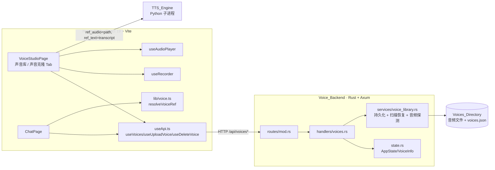
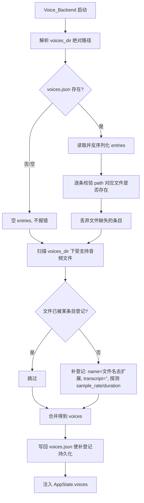

# 设计文档：音色库管理（voice-library-management）

## Overview

本特性在已交付的 voice-interaction-loop 之上，补齐参考音色（Reference_Voice）的端到端管理能力：上传/录音创建、列表展示、试听、删除，以及元数据持久化与启动恢复。设计目标是在**不回归**对话、模型管理、下载等既有功能与既有 `GET /api/voices` 消费方（`ChatPage` 经 `resolveVoiceRef` 解析 TTS 参考）的前提下，引入三类新增能力：

1. **multipart 音频上传**：新增 `POST /api/voices/upload`，接收音频文件 + `name` + `transcript`，校验格式/大小、提取采样率/时长、分配唯一 `id`、写入 Voices_Directory 并登记。
2. **元数据持久化与启动恢复**：引入 Voice_Library_Store（`voices_dir/voices.json`），在创建/删除时落盘，在启动时从 Store + 目录扫描恢复（缺失文件跳过、未登记文件按文件名补登记）。
3. **按 id 服务音频与连带删除**：新增 `GET /api/voices/{id}/audio` 提供试听，改造 `DELETE /api/voices/{id}` 连带删除磁盘文件。

设计的核心约束来自需求 5.5：`VoiceInfo` 在新增 `duration_seconds` 字段后，必须保持 `id`、`name`、`path`、`transcript`、`sample_rate` 的语义不变，确保前端 `Voice` 类型、`resolveVoiceRef`、TTS 选用链路零回归。

### 关键设计决策与依据

- **`path` 语义保持为"项目可读文件路径"**：`resolveVoiceRef` 将 `voice.path` 直接作为 TTS 的 `ref_audio` 传给 Python 引擎。因此上传保存后写入 `VoiceInfo.path` 的值，必须是引擎可读的路径（与既有数据一致，采用相对项目根的路径，如 `assets/datasets/voices/<file>`）。试听则不复用 `path`，而是新增按 `id` 解析的端点，避免把任意路径暴露给前端。
- **持久化载体选用 `voices_dir/voices.json`**：与音频文件就近存放，独立于 `config.json`，避免污染既有配置结构与既有 config 消费逻辑。沿用 `config_persist.rs` 的 serde_json + `std::fs` 读写风格。
- **采样率/时长提取不引入新依赖**：当前 `Cargo.toml` 无音频解析库（无 hound/symphonia）。`.wav` 通过手动解析 RIFF/`fmt ` 块得到 `sample_rate` 与 `duration_seconds`；非 WAV 格式（如浏览器录音的 webm/ogg/mp4）做尽力而为处理：`sample_rate` 记为 `0`、`duration_seconds` 记为 `null`，不阻断上传。这满足"记录采样率与时长"的需求（WAV 精确、其他格式以占位表达"未知"），且零依赖、可被属性测试覆盖。
- **复用既有前端基建**：声音克隆 Tab 复用 `useRecorder`（录音）与 `useAudioPlayer`（试听 toggle 互斥），删除二次确认复用现有 toast/确认交互模式，新增 `useUploadVoice` / `useDeleteVoice` 与既有 react-query 约定一致（mutation + 失效 `['voices']`）。

## Architecture

### 系统上下文



### 请求路由（新增/改造）

| 方法 | 路径 | 说明 | 变更类型 |
| --- | --- | --- | --- |
| GET | `/api/voices` | 列出全部 Reference_Voice | 既有，响应新增 `duration_seconds` 字段 |
| POST | `/api/voices/upload` | multipart 上传音频 + name + transcript | 新增 |
| GET | `/api/voices/{id}/audio` | 按 id 服务音频用于试听（正确 MIME） | 新增 |
| DELETE | `/api/voices/{id}` | 删除条目 **并** 删除磁盘文件、落盘 | 改造 |
| POST | `/api/voices` | 旧 JSON 登记接口 | 保留以兼容（落盘行为可并入） |

> 路由顺序注意：`/api/voices/{id}/audio` 必须与 `/api/voices/{id}`（DELETE）、`/api/voices/upload`（POST）正确区分。Axum 0.8 的 `{id}` 占位与静态段 `upload` 不冲突（不同 HTTP 方法 + 不同静态前缀），`/{id}/audio` 为 GET 独立注册。

### 启动恢复流程



## Components and Interfaces

### 后端

#### 1. `state.rs` — `VoiceInfo` 扩展

新增 `duration_seconds` 字段（可选），其余字段语义不变（需求 5.5）。

```rust
#[derive(Debug, Clone, Serialize, Deserialize)]
pub struct VoiceInfo {
    pub id: String,
    pub name: String,
    /// 项目可读的音频文件路径（作为 TTS ref_audio），语义不变
    pub path: String,
    pub transcript: Option<String>,
    pub sample_rate: i32,
    /// 新增：音频时长（秒）。WAV 精确解析；非 WAV 未知时为 None
    #[serde(default)]
    pub duration_seconds: Option<f64>,
}
```

> `#[serde(default)]` 保证旧 `voices.json` / 旧 `GET /api/voices` 消费方反序列化时缺字段不报错，前端 `Voice` 类型将该字段声明为可选（见数据模型）。

#### 2. `services/voice_library.rs` —（新增模块）持久化、扫描恢复与音频探测

集中放置纯逻辑（便于属性测试），handler 仅做 HTTP 编排。

```rust
use crate::state::VoiceInfo;
use std::path::{Path, PathBuf};

/// 受支持的音频扩展名（小写，含点）
pub const SUPPORTED_EXTENSIONS: &[&str] =
    &[".wav", ".mp3", ".m4a", ".flac", ".ogg", ".webm"];
/// 单文件上传大小上限：20 MB
pub const MAX_UPLOAD_SIZE: usize = 20 * 1024 * 1024;
/// 持久化文件名
pub const STORE_FILENAME: &str = "voices.json";

/// 扩展名是否受支持（大小写不敏感）。入参可为文件名或扩展名。
pub fn is_supported_extension(filename: &str) -> bool;

/// 由扩展名推断试听响应的 MIME 类型；未知回退 "application/octet-stream"。
pub fn mime_for_extension(filename: &str) -> &'static str;

/// 探测音频元数据：WAV 精确解析 (sample_rate, duration)；
/// 非 WAV 或解析失败返回 (0, None)，不报错。
pub fn probe_audio(bytes: &[u8], filename: &str) -> (i32, Option<f64>);

/// voices.json 路径（位于 voices_dir 下）。
pub fn store_path(voices_dir: &Path) -> PathBuf;

/// 持久化：将 voices 写入 voices.json（serde_json pretty）。
pub fn save_library(voices_dir: &Path, voices: &[VoiceInfo]) -> Result<(), String>;

/// 加载：读取 voices.json；不存在/为空/解析失败 → 空 Vec（不报错）。
pub fn load_store(voices_dir: &Path) -> Vec<VoiceInfo>;

/// 启动恢复纯逻辑：
/// - 输入 store 条目 + 目录内"受支持音频文件名"列表
/// - 输出最终 voices：保留 path 文件仍存在的条目，丢弃缺失条目，
///   并为未登记的受支持文件补登记 (name=stem, transcript="")
/// existing_files 表示当前目录中实际存在的文件名集合（用于缺失校验）。
pub fn reconcile_library(
    store_entries: Vec<VoiceInfo>,
    existing_files: &[String],
) -> Vec<VoiceInfo>;

/// 在 voices_dir 内为上传内容生成唯一文件名与 id，避免与现有冲突。
pub fn allocate_id(existing: &[VoiceInfo]) -> String;
```

`reconcile_library` 的语义（对应需求 2.2/2.4/2.5）：
- 对每个 store 条目：取其 `path` 的文件名，若在 `existing_files` 中则保留，否则丢弃。
- 对每个 `existing_files` 中受支持扩展名、且未被任一保留条目的 `path` 文件名覆盖的文件：补登记一条，`name=去扩展文件名`、`transcript=""`、`path=voices_dir/<file>`（相对项目根形式）、`id` 唯一。

#### 3. `handlers/voices.rs` — 改造后签名

```rust
use axum::{
    extract::{Path, State, Multipart},
    http::StatusCode,
    response::IntoResponse,
    Json,
};
use std::sync::Arc;
use tokio::sync::RwLock;
use crate::state::{AppState, VoiceInfo};

/// GET /api/voices — 不变（返回含 duration_seconds 的列表）
pub async fn list_voices(
    State(state): State<Arc<RwLock<AppState>>>,
) -> Json<Vec<VoiceInfo>>;

/// POST /api/voices/upload — multipart: audio(file), name(text), transcript(text)
/// 成功 200 返回创建的 VoiceInfo；校验失败返回 4xx + { "error": String }
pub async fn upload_voice(
    State(state): State<Arc<RwLock<AppState>>>,
    multipart: Multipart,
) -> Result<Json<VoiceInfo>, (StatusCode, Json<serde_json::Value>)>;

/// GET /api/voices/{id}/audio — 按 id 返回音频字节 + 正确 Content-Type
/// 未找到返回 404
pub async fn serve_voice_audio(
    State(state): State<Arc<RwLock<AppState>>>,
    Path(id): Path<String>,
) -> impl IntoResponse;

/// DELETE /api/voices/{id} — 移除条目 + 删除磁盘文件 + 落盘
/// id 不存在仍返回 { "success": true }（幂等）
pub async fn delete_voice(
    State(state): State<Arc<RwLock<AppState>>>,
    Path(id): Path<String>,
) -> Json<serde_json::Value>;
```

`upload_voice` 编排步骤：
1. 遍历 multipart 字段，收集 `audio`（字节 + 原始文件名）、`name`、`transcript`。
2. 校验：缺 `audio` → 400「需要音频文件」；扩展名不在 `SUPPORTED_EXTENSIONS` → 400「不支持的音频格式」；字节数 > `MAX_UPLOAD_SIZE` → 413/400「文件过大」。（缺 `name` 由前端拦截；后端可宽松接受空 name，但建议同样校验返回 400 以纵深防御。）
3. `probe_audio` 提取 `sample_rate`/`duration_seconds`。
4. `allocate_id` 分配唯一 id；生成目标文件名（`<id>` + 原扩展名），写入 `voices_dir`。
5. 构造 `VoiceInfo`（`path` 为相对项目根路径），`push` 进 `AppState.voices`，`save_library` 落盘。
6. 返回完整 `VoiceInfo`。

`serve_voice_audio`：按 `id` 在 `AppState.voices` 查条目 → 缺失 404；解析 `path` 为绝对路径（相对则拼项目根，与 `models.rs`/`audio.rs` 的 `project_root()` 一致）→ 读字节 → 设 `Content-Type = mime_for_extension(path)` 返回。

`delete_voice`：查条目（不存在 → `{success:true}` 幂等返回）；解析绝对路径并 `remove_file`（忽略文件已不存在的错误）；从 `voices` 移除；`save_library` 落盘。

#### 4. `routes/mod.rs` — 路由注册（新增 2 条）

```rust
// 参考音频
.route("/api/voices", get(handlers::voices::list_voices))
.route("/api/voices", post(handlers::voices::add_voice))         // 既有保留
.route("/api/voices/upload", post(handlers::voices::upload_voice)) // 新增
.route("/api/voices/{id}/audio", get(handlers::voices::serve_voice_audio)) // 新增
.route("/api/voices/{id}", axum::routing::delete(handlers::voices::delete_voice)) // 改造
```

#### 5. `main.rs` — 启动恢复接线

在模型扫描之后、构建 `state` 之前插入：解析 `voices_dir` 绝对路径 → `load_store` → 列出目录内受支持文件名 → `reconcile_library` → 若发生补登记则 `save_library` 回写 → 赋值 `app_state.voices`。复用 main 中已有的 `project_root` 变量解析 `voices_dir`（相对则拼接）。

### 前端

#### 1. `hooks/useApi.ts` — 新增 mutation 与试听 URL

```typescript
/** 试听音频 URL（经 Vite proxy 到后端）。 */
export function voiceAudioUrl(id: string): string {
  return `/api/voices/${id}/audio`;
}

/** 上传创建参考音色：multipart audio + name + transcript。 */
export function useUploadVoice() {
  const qc = useQueryClient();
  return useMutation({
    mutationFn: async (args: { audio: Blob; filename: string; name: string; transcript: string }) => {
      const fd = new FormData();
      fd.append('audio', args.audio, args.filename);
      fd.append('name', args.name);
      fd.append('transcript', args.transcript);
      const { data } = await apiClient.post<Voice>('/api/voices/upload', fd, {
        headers: { 'Content-Type': 'multipart/form-data' },
        timeout: 60000,
      });
      return data;
    },
    onSuccess: () => { void qc.invalidateQueries({ queryKey: ['voices'] }); },
  });
}

/** 删除参考音色。 */
export function useDeleteVoice() {
  const qc = useQueryClient();
  return useMutation({
    mutationFn: async (id: string) => {
      const { data } = await apiClient.delete<{ success: boolean }>(`/api/voices/${id}`);
      return data;
    },
    onSuccess: () => { void qc.invalidateQueries({ queryKey: ['voices'] }); },
  });
}
```

#### 2. `components/VoiceStudioPage.tsx`

- **声音克隆 Tab（重写占位 UI）**：本地文件选择（隐藏 `<input type="file" accept="audio/*">`）或录音（复用 `useRecorder`：开始/停止、计时、错误提示）二选一形成 `audio: Blob`；名称输入、参考文本输入；提交按钮调用 `useUploadVoice`。
  - 提交前校验：无音频 → toast「请先选择或录制音频」且不提交（需求 6.1，独立于名称/文本）；无名称 → toast「请填写音色名称」且不提交（需求 6.2）。
  - 成功 → toast 成功 + react-query 失效 `['voices']`（列表自动刷新，需求 1.8）。
  - 失败 → 展示后端 `error` 文本，不加入列表（需求 6.5）。
- **声音库 Tab（增强）**：每条展示 `name`、`transcript`、`sample_rate`，以及存在时的 `duration_seconds`（格式化为 `mm:ss` 或 `x.x s`）；新增「试听」按钮（`useAudioPlayer.play(voiceKey, voiceAudioUrl(v.id))`，toggle 停止）；新增「删除」按钮 → 二次确认（确认对话/内联确认态）→ 确认后 `useDeleteVoice`，取消则不调用（需求 4.1–4.3、4.7）；加载中/空列表沿用既有状态展示（需求 3.3/3.4）。
- 既有「语音合成」Tab 的 `selectedVoice.path / transcript` 选用链路不变（需求 5.1/5.2/5.4）。

#### 3. `components/ChatPage.tsx` — 无需改动

`useVoices` + `resolveVoiceRef` 链路不变；新增 `duration_seconds` 字段对 `resolveVoiceRef` 透明（仅读取 `path`/`transcript`）。验证无回归即可（需求 5.3、6.7）。

## Data Models

### 后端 `VoiceInfo`（持久化 + API 形态一致）

| 字段 | 类型 | 说明 | 兼容性 |
| --- | --- | --- | --- |
| `id` | `String` | 库内唯一标识 | 语义不变 |
| `name` | `String` | 显示名 | 语义不变 |
| `path` | `String` | 项目可读音频路径（TTS `ref_audio`） | 语义不变 |
| `transcript` | `Option<String>` | 参考文本（TTS `ref_text`） | 语义不变 |
| `sample_rate` | `i32` | 采样率（Hz）；非 WAV 未知时为 `0` | 语义不变 |
| `duration_seconds` | `Option<f64>` | 新增；时长（秒），未知为 `null` | 新增，`serde(default)` |

### Voice_Library_Store（`voices_dir/voices.json`）

`VoiceInfo` 数组的 serde_json pretty 序列化，例如：

```json
[
  {
    "id": "a1b2c3d4",
    "name": "jyy",
    "path": "assets/datasets/voices/a1b2c3d4.wav",
    "transcript": "你好世界",
    "sample_rate": 32000,
    "duration_seconds": 4.2
  }
]
```

### 前端 `Voice` 类型补充（`store/index.ts` 与 `lib/voice.ts`）

```typescript
// store/index.ts
export interface Voice {
  id: string;
  name: string;
  path: string;
  transcript: string | null;
  sample_rate: number;
  duration_seconds?: number | null; // 新增，可选
}
```

`lib/voice.ts` 的 `Voice` 接口同样补充可选 `duration_seconds`，`resolveVoiceRef` 行为不变（仅依赖 `path`/`transcript`）。

## Correctness Properties

*属性（property）是在系统所有合法执行中都应成立的特征或行为——即对"系统应当做什么"的形式化陈述。属性是人类可读规格与机器可验证正确性保证之间的桥梁。*

下列属性由验收标准经 prework 分析与去冗余后得到，聚焦后端纯逻辑层（校验、MIME、持久化、启动恢复、删除、音频探测）。UI 交互类标准以示例测试覆盖（见测试策略）。

### Property 1: 合法上传创建可检索且字段保真

*对任意* 扩展名属于 Supported_Audio_Format、字节大小不超过 Max_Upload_Size 的音频内容与任意 `name`/`transcript` 输入，上传创建后系统都应：分配一个在当前 Voice_Library 内唯一的 `id`，将文件写入 Voices_Directory 且登记条目的 `path` 指向该文件，保留提交的 `name` 与 `transcript`，并使该条目随后可被 List_Endpoint 检索到且字段一致。

**Validates: Requirements 1.4, 1.5, 1.7**

### Property 2: 采样率与时长探测往返

*对任意* 合法 WAV 字节（随机采样率与时长），`probe_audio` 提取的 `sample_rate` 应等于原采样率、`duration_seconds` 应在数值容差内等于原时长；*对任意* 非 WAV 音频字节，`probe_audio` 应返回 `(0, None)` 而不报错。

**Validates: Requirements 1.6**

### Property 3: 音色库持久化往返

*对任意* Voice_Library 状态，将其写入 Voice_Library_Store 后再加载，应得到与写入时相同的条目集合（按 `id` 与字段比对）；该性质在创建、修改与删除后均成立。

**Validates: Requirements 2.1, 2.2, 4.5**

### Property 4: 启动恢复对账

*对任意* Voice_Library_Store 条目集合与任意 Voices_Directory 中实际存在的受支持文件集合，`reconcile_library` 的输出应满足：仅保留 `path` 对应文件仍存在的 Store 条目（缺失文件的条目被丢弃），并为每个受支持且未被任何保留条目覆盖的目录文件补登记一条，其 `name` 为去扩展名的文件名、`transcript` 为空字符串。

**Validates: Requirements 2.2, 2.4, 2.5**

### Property 5: 试听 MIME 类型映射

*对任意* 扩展名属于 Supported_Audio_Format 的文件名，`mime_for_extension` 应返回与该扩展名对应的音频 MIME 类型。

**Validates: Requirements 3.6**

### Property 6: 删除清理条目与文件

*对任意* Voice_Library 与其中任一已存在条目的 `id`，删除该条目后系统都应：从 Voice_Library 中移除该 `id`，并删除其在 Voices_Directory 中对应的音频文件。

**Validates: Requirements 4.4, 4.5**

### Property 7: 核心字段语义保真

*对任意* Reference_Voice，其经 List_Endpoint 返回的形态都应包含 `id`、`name`、`path`、`transcript`、`sample_rate` 五个字段且语义不变，`duration_seconds` 仅作为附加字段存在，使既有 `GET /api/voices` 消费方与 `resolveVoiceRef` 不回归。

**Validates: Requirements 5.5, 5.2**

### Property 8: 非法上传被拒且库不变

*对任意* 扩展名不属于 Supported_Audio_Format 的输入，或字节大小超过 Max_Upload_Size 的输入，Upload_Endpoint 都应返回相应错误且不创建任何 Reference_Voice，Voice_Library 保持不变。

**Validates: Requirements 6.3, 6.4**

## Error Handling

### 后端

| 场景 | 处理 | 状态码 |
| --- | --- | --- |
| multipart 缺 `audio` 字段 | 返回 `{ "error": "需要音频文件" }` | 400 |
| 读取 `audio` 字节失败 | 返回 `{ "error": "读取音频文件失败: ..." }` | 400 |
| 扩展名不受支持 | 返回 `{ "error": "不支持的音频格式: <ext>" }`，不写文件、不登记 | 400 |
| 文件超过 20MB | 返回 `{ "error": "文件过大，最大 20MB" }`，不写文件、不登记 | 413 |
| 缺 `name`（纵深防御） | 返回 `{ "error": "需要音色名称" }` | 400 |
| 写入 Voices_Directory 失败 | 返回 `{ "error": "保存音频失败: ..." }` | 500 |
| `voices.json` 写入失败 | 记录 `tracing::warn`；上传仍返回成功（内存已更新），与 `config_persist` 容忍式风格一致 | 200 |
| 试听 id 不存在 | 返回 404「Voice not found」，无响应体音频 | 404 |
| 试听文件读取失败 | 返回 500 | 500 |
| 删除 id 不存在 | 返回 `{ "success": true }`（幂等） | 200 |
| 删除磁盘文件 not found | 忽略该错误，继续移除内存条目并落盘 | 200 |
| 启动时 `voices.json` 缺失/为空/解析失败 | `load_store` 返回空 Vec，不 panic、不阻断启动 | — |

### 前端

| 场景 | 处理 |
| --- | --- |
| 提交无音频 | toast「请先选择或录制音频」，不调用 `useUploadVoice`（独立于名称/文本校验） |
| 提交无名称 | toast「请填写音色名称」，不调用 `useUploadVoice` |
| 上传返回错误响应 | 读取 `err.response?.data?.error` 展示，不向列表插入新条目 |
| 上传网络异常 | 读取 `err.message` 展示 toast |
| `useVoices` 出错（`isError`） | 展示错误提示并退出加载态（不停留在 loading） |
| 录音失败（`useRecorder.error`） | 展示麦克风错误提示，提交校验视为无音频 |
| 试听播放失败 | `useAudioPlayer` 内部已重置状态，可 toast 友好提示 |

## Testing Strategy

### 双轨测试方法

- **属性测试（property tests）**：覆盖后端纯逻辑层的 8 条 Correctness Properties，使用随机输入验证普遍正确性。
- **单元/示例测试（unit/example tests）**：覆盖 UI 交互、加载/空状态、错误处理、边界与回归场景。

### 后端（Rust）属性测试

- 选用 `proptest`（Rust 生态主流 PBT 库，加入 `[dev-dependencies]`），不自行实现属性测试框架。
- 纯逻辑集中在 `services/voice_library.rs`，便于在无 HTTP/磁盘的情况下测试；涉及磁盘的属性（写文件/删文件）使用 `tempfile` 提供的临时目录。
- 每个属性测试最少运行 100 次迭代（proptest 默认 256，保持 ≥100）。
- 每个属性测试以注释标注来源，格式：
  `// Feature: voice-library-management, Property {N}: {property text}`
- 属性↔测试映射：
  - Property 1 → 上传创建往返（tempdir 写文件 + 内存登记 + 列表检索）
  - Property 2 → `probe_audio` WAV 往返 + 非 WAV 返回 `(0, None)`
  - Property 3 → `save_library` → `load_store` 往返相等
  - Property 4 → `reconcile_library` 对账（随机 store + 随机存在文件集合）
  - Property 5 → `mime_for_extension` 全扩展名映射
  - Property 6 → 删除后库不含 id 且文件被移除（tempdir）
  - Property 7 → `VoiceInfo` 序列化含五个核心字段
  - Property 8 → 非法上传（坏扩展名 ∪ 超限）被拒、库不变

### 后端单元/集成测试（示例与边界）

- `load_store`：不存在/空/损坏 JSON → 空 Vec（需求 2.3）。
- 大小边界：恰好 20MB 接受、20MB+1 拒绝（需求 6.4）。
- 试听不存在 id → 404（需求 3.7）。
- 删除不存在 id → `{success:true}` 且库不变（需求 4.6）。
- 编译与测试命令：`cargo build` 与 `cargo test`（在 `backend/server` 目录）。

### 前端单元测试（Vitest）

沿用既有 `*.test.tsx` 与 `vi.mock` 隔离数据源（`useVoices`/`useUploadVoice`/`useDeleteVoice`/`useAudioPlayer`/`useRecorder`）的写法：

- 声音克隆 Tab：控件存在（1.1）；选文件提交构造正确字段（1.2）；录音提交携带 Blob（1.3）；无音频拦截（6.1）；无名称拦截（6.2）；上传成功失效 `['voices']`（1.8）；上传错误展示文本（6.5）。
- 声音库 Tab：展示 name/transcript/sample_rate（3.1）；有/无 duration 展示（3.2）；加载态（3.3）；空态（3.4）；试听以 `voiceAudioUrl(id)` 调用 player 且 toggle 停止（3.5/3.8）；删除二次确认—确认调用/取消不调用（4.1/4.2/4.3）；删除成功失效 `['voices']`（4.7）；`useVoices` 出错展示并退出加载（6.6）。
- `lib/voice.ts`：既有 `resolveVoiceRef` 测试保持通过，补充含 `duration_seconds` 的条目不影响解析（5.2/5.5）。
- 回归：既有 `ChatPage.test.tsx`、`VoiceStudioPage.test.tsx` 保持通过（5.3/6.7）。
- 命令：`npm run test`（或 `vitest --run` 单次执行）于 `app/web` 目录。

### 关键交互手测要点

1. 声音克隆：选本地 `.wav`/`.mp3` + 名称 + 文本 → 提交 → 声音库出现新条目（含采样率/时长）。
2. 声音克隆：浏览器录音 → 提交 → 新条目可试听、可用于合成。
3. 声音库：试听播放/再次点击停止；删除 → 二次确认 → 确认后消失、取消保留。
4. 重启后端 → 已创建音色仍在；手动删除磁盘音频文件后重启 → 该条目不再出现；手动放入一个 `.wav` → 重启后按文件名补登记。
5. 上传不支持格式（如 `.txt` 改名）与超 20MB 文件 → 展示对应错误、列表不变。
6. 无回归：对话 `POST /api/chat`、模型 `GET /api/models`/`scan`/`set-model`、下载 `/api/downloads/*` 正常。

### 受影响文件清单

**后端（`backend/server/src`）**
- `state.rs`：`VoiceInfo` 新增 `duration_seconds`。
- `services/voice_library.rs`：**新增** 模块（校验/MIME/探测/持久化/对账/分配 id）。
- `services/mod.rs`：注册新模块。
- `handlers/voices.rs`：新增 `upload_voice`、`serve_voice_audio`，改造 `delete_voice`，`list_voices` 不变。
- `routes/mod.rs`：新增 `/api/voices/upload`、`/api/voices/{id}/audio` 路由。
- `main.rs`：启动恢复接线（load_store + reconcile + 回写）。
- `Cargo.toml`：`[dev-dependencies]` 增加 `proptest`、`tempfile`。
- 测试：`services/voice_library.rs` 内 `#[cfg(test)]` 或 `tests/` 下属性+单元测试。

**前端（`app/web/src`）**
- `hooks/useApi.ts`：新增 `useUploadVoice`、`useDeleteVoice`、`voiceAudioUrl`。
- `components/VoiceStudioPage.tsx`：声音克隆 Tab 实现、声音库展示/试听/删除增强。
- `store/index.ts`：`Voice` 接口补充 `duration_seconds?`。
- `lib/voice.ts`：`Voice` 接口补充 `duration_seconds?`（行为不变）。
- 测试：`components/VoiceStudioPage.test.tsx` 扩充；`lib/voice.test.ts` 视情况补充；`components/ChatPage.test.tsx` 保持通过。
