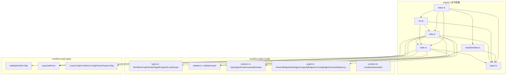
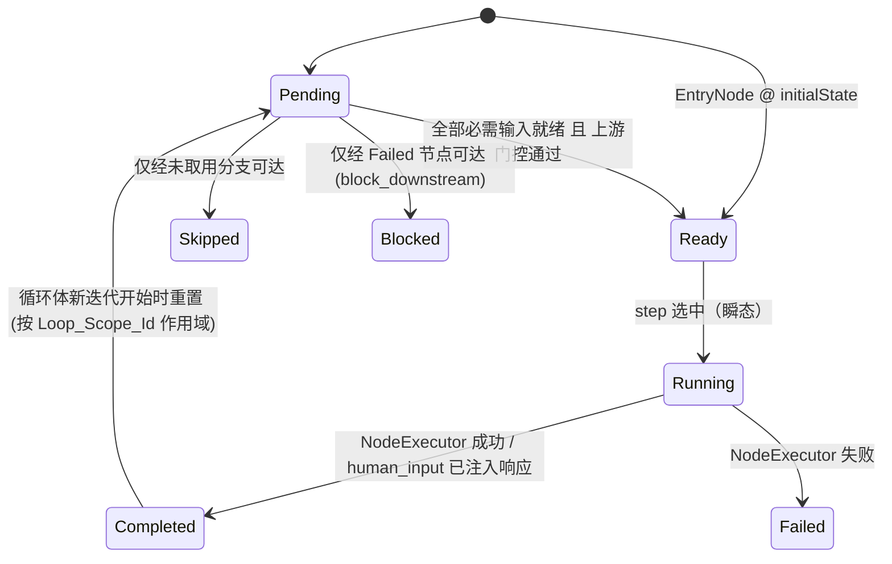
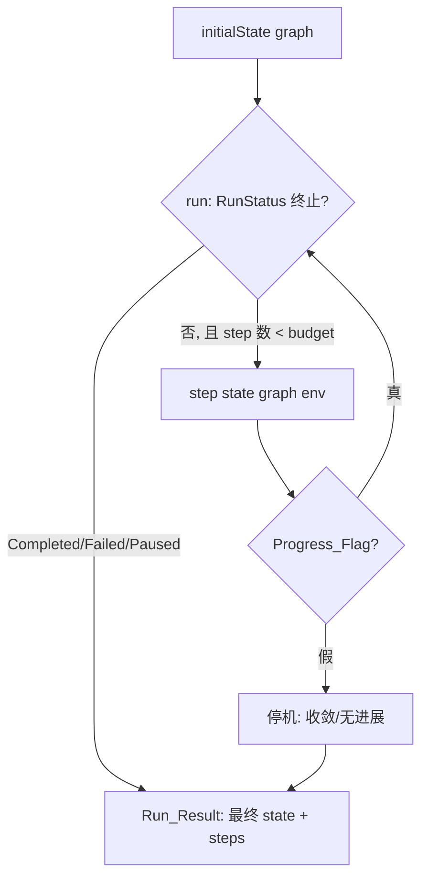

# Design Document

## Overview

「工作流执行引擎」(workflow-execution-engine) 是女娲 Nuwa「多智能体工作流编排引擎」的**第三个子规格**，实现位于 `app/web/src/lib/workflow/engine/`。它定义一台**纯的、确定性的 reducer 风格执行状态机**，用于运行一张已通过校验的 `WorkflowGraph`。

本设计的核心约束（不可妥协的设计原则）：

1. **纯函数引擎，零真实 I/O**：引擎本身不发起任何真实的 LLM 调用、工具调用、网络访问、文件读写，也不依赖时间或随机数。每个节点的执行效果由**注入的纯函数 `NodeExecutor`** 建模，一切非确定性都被外移到 `Execution_Environment` (env) 之外，并通过 env 以确定方式提供。
2. **确定性**：对相同的 `(state, graph, env)`，`step`/`run` 恒返回逐字段相等的结果。就绪节点选择由 `Ready_Selection_Rule`（拓扑序 + Node_Id 字典序）唯一确定，与内部容器枚举顺序无关。
3. **复用前序子规格**：直接复用 workflow-graph-model 的 `WorkflowGraph`、`WorkflowNode`、`Port`、`PortType`、`NodeType`、`Endpoint`、`WorkflowEdge`、`LoopScope` 类型，以及 `validateGraph`、`topologicalOrder`、`forwardEdges`、`forwardAdjacency`、`backEdges`、`outgoingEdges`、`incomingEdges`、`reachableNodes`、`serialize`/`deserialize` 等纯函数；复用 workflow-node-types 的 `validateNodeConfig`、`expectedPorts`、`LoopConfig`（`maxIterations`/`breakCondition`）、`ConditionConfig`、`HumanInputConfig` 等。本文档不重新定义这些类型。
4. **有界终止**：引擎对任何有界循环的合法图都终止；`run` 施加的 Step 总数有明确上界（节点数 × 各循环 `Max_Iterations` 之积 + 余量）。

### 两条自审说明的处理（关键设计点）

本设计在制定 `initialState` 与循环语义时，显式修正/澄清两处早期含糊之处：

- **(a) Idle 态不变量措辞澄清（对应 R2.5 与 R17.1）**：`initialState(graph)` 构造的初始状态中，**EntryNode 被标记为 `Ready`（而非 `Completed`）**，其余节点为 `Pending`。R17.1「Idle 态 ValueStore 为空且无任何节点 Completed」据此精确化为：**Idle 态 ValueStore 为空、Satisfied_Edge_Set 为空、所有 LoopCounter 为 0、且不存在任何 `Completed` 节点**（EntryNode 此时是 `Ready`，不违反该不变量）。本设计在 §数据模型与 §状态模块中统一采用这一措辞。
- **(b) 循环体跨迭代状态重置（对应 R8.x、R9.1、R9.3）**：每当 `loop` 节点开启**新一轮迭代**时，引擎**显式地将该 LoopScope 的全部 Loop_Body 节点的 ExecutionStatus 从 `Completed` 重置回 `Pending`/`Ready`**（依其必需输入在**新迭代作用域**下是否就绪而定），并以新的 `Loop_Iteration_Index` 构造该迭代的 Value_Key。重置以 `Loop_Scope_Id` 作用域化，不影响循环体之外的节点，也不删除既有迭代的产出值（ValueStore 仅单调新增）。这是循环体节点被允许多次执行（≤ `Max_Iterations`）而不违反「不向 Completed 节点重复调用」的机制。

### 设计决策与理由

| 决策 | 理由 |
| --- | --- |
| `ValueStore` 以 `Value_Key = (Endpoint, iterationIndex)` 为键 | 让同一端口在不同循环迭代的产出互不覆盖，满足 ValueStore 单调性（R6.2）与写一次（R6.4），同时支持循环体重复执行（R9.1）。 |
| 就绪选择走 `topologicalOrder` + Node_Id 字典序 | 复用前序子规格已验证的确定性拓扑序，避免遍历顺序敏感（R3.3、R16.4）。 |
| 非确定性全部经 `NodeExecutor`/`Condition_Evaluator`/`Human_Input_Provider` 注入 | 引擎保持纯函数，可用属性测试穷举验证（R1.1、R1.2、R16.x）。 |
| `run` 设硬性 `Step_Budget` 上界 | 即便注入器或图存在病态行为，也保证终止（R11.1、R11.2），不依赖时钟（R11.5）。 |
| `ExecutionState` 序列化采用规范化 JSON（键排序、集合排序、ValueStore 按键排序） | 让语义相等状态产出逐字符相同字符串（R15.5），支撑可恢复性与往返恒等（R15.3、R15.4）。 |
| 循环体状态在新迭代开始时重置 | 显式实现自审说明 (b)，使「执行次数 ≤ Max_Iterations」可被精确计量与验证（R9.1、R9.3）。 |

---

## Architecture

### 模块分解（`app/web/src/lib/workflow/engine/`）

```
engine/
├── types.ts           # 所有执行层数据模型类型与枚举（无逻辑）
├── state.ts           # initialState、就绪计算、状态查询/推进辅助、不变量谓词
├── step.ts            # step reducer：就绪选择→执行→产出→传播→条件路由→循环迭代/重置→human_input 暂停→失败处理
├── run.ts             # run 跑到完成驱动器（有界 Step 上限）
├── serializeState.ts  # serializeState/deserializeState（规范化 JSON 往返）
├── index.ts           # 公共 API barrel（仅 re-export，无逻辑）
└── arbitraries.ts     # 测试专用 fast-check arbitraries（复用 ../arbitraries）
```

### 依赖关系



### 微步状态流转（ExecutionStatus 生命周期）



### 顶层数据流（run 驱动 step）



---

## Data Models

全部类型声明位于 `engine/types.ts`，遵循前序子规格风格：字段一律 `readonly`，集合用 `ReadonlyMap`/`ReadonlySet`，无类。引擎复用基础层的 `Endpoint`、`WorkflowGraph` 等，不重新定义。

### 状态枚举

```typescript
import type { Endpoint, JsonValue, NodeType, WorkflowGraph } from '../types';

/** 单个节点的执行状态（R2.2）。 */
export type ExecutionStatus =
  | 'Pending'    // 尚不具备执行条件（存在未产出的必需输入或上游门控未满足）
  | 'Ready'      // 全部必需输入已产出且上游门控满足，可被选中
  | 'Running'    // 已被选中，NodeExecutor 正在本微步内被调用（瞬态标记）
  | 'Completed'  // NodeExecutor 成功返回且输出已写入 ValueStore
  | 'Skipped'    // 位于未取用分支且无其他已满足路径可达
  | 'Failed'     // NodeExecutor 返回失败
  | 'Blocked';   // 因上游 Failed（按 Error_Policy）而无法执行

/** 整次运行的状态（R2.3）。 */
export type RunStatus =
  | 'Idle'       // 尚未开始的初始状态
  | 'Running'    // 正在推进
  | 'Paused'     // 在 human_input 节点暂停，等待注入响应
  | 'Completed'  // 全部可达且非 Skipped 节点完成
  | 'Failed';    // 存在 Failed 节点且无可继续的非阻塞进度

/** 终止 RunStatus。 */
export type TerminalStatus = Extract<RunStatus, 'Completed' | 'Failed'>;
```

### Value_Key 与 ValueStore

```typescript
/**
 * ValueStore 的键：由一个 Endpoint (nodeId, portId) 与一个 Loop_Iteration_Index
 * 共同确定（R2.4、R6.3）。非循环作用域内 iterationIndex 恒为基准索引 0。
 * 对嵌套循环，iterationIndex 由各外层 LoopScope 的当前计数复合而成（见关键算法 4）。
 */
export interface ValueKey {
  readonly endpoint: Endpoint;       // (nodeId, portId)
  readonly iterationIndex: number;   // 迭代轮次；非循环域为 0
}

/** ValueStore：以规范化字符串键（见 valueKeyToString）索引的不可变端口产出值映射。 */
export type ValueStore = ReadonlyMap<string, StoredValue>;

/** 已产出的端口值：携带其结构化键与产出值，便于序列化与按键比较。 */
export interface StoredValue {
  readonly key: ValueKey;
  readonly value: JsonValue;
}

/** Value_Key 的规范化字符串编码：`${nodeId}\u0000${portId}\u0000${iterationIndex}`。 */
export type ValueKeyString = string;
```

### ExecutionState

```typescript
/** 一次运行在某一时刻的完整可序列化状态（R2.1）。不可变结构。 */
export interface ExecutionState {
  /** Node_Status_Map：每个 WorkflowNode 各一条目（R2.7）。 */
  readonly nodeStatus: ReadonlyMap<string, ExecutionStatus>;
  /** ValueStore：Value_Key → 端口产出值（R2.4）。 */
  readonly valueStore: ValueStore;
  /** 已满足的边集合：以 Edge_Id 表征（R2.1、R17.6）。 */
  readonly satisfiedEdges: ReadonlySet<string>;
  /** Loop_Counter_Map：Loop_Scope_Id → 已完成迭代次数（自 0 起）。 */
  readonly loopCounters: ReadonlyMap<string, number>;
  /** 整次运行的状态。 */
  readonly runStatus: RunStatus;
  /** 当前因等待人工响应而暂停所处 human_input 节点的 Node_Id，未暂停时为 null。 */
  readonly pendingHumanInput: string | null;
}
```

### NodeExecutor 与执行结果

```typescript
/** NodeExecutorResult 失败时携带的稳定枚举标识（R14.1）。 */
export enum ExecutorErrorCode {
  EXECUTOR_FAILED = 'EXECUTOR_FAILED',         // 执行器主动返回失败
  INVALID_OUTPUT = 'INVALID_OUTPUT',           // 输出端口集合与 expectedPorts 不符
  MISSING_INPUT = 'MISSING_INPUT',             // 调用前必需输入缺失（防御性）
  CONDITION_EVAL_FAILED = 'CONDITION_EVAL_FAILED', // 条件求值器异常
  INVALID_GRAPH = 'INVALID_GRAPH',             // 传入未通过校验的图（R1.5）
  INTERNAL = 'INTERNAL',                       // 不应发生的内部不一致
}

/**
 * NodeExecutor 的返回：成功携带 Output_Port 的 Port_Id → 产出值映射；
 * 失败携带 Executor_Error_Code 与可读描述。
 */
export type NodeExecutorResult =
  | { readonly ok: true; readonly outputs: ReadonlyMap<string, JsonValue> }
  | { readonly ok: false; readonly code: ExecutorErrorCode; readonly message: string };

/**
 * 注入的纯「节点执行器」：将一个 WorkflowNode 与其当前迭代作用域下的输入端口值
 * 映射到输出端口值或失败。必须是纯函数（同输入恒同输出）。
 */
export type NodeExecutor = (
  node: WorkflowNode,
  inputs: ReadonlyMap<string, JsonValue>, // Input_Port 的 Port_Id → 值
  env: ExecutionEnvironment,
) => NodeExecutorResult;

import type { WorkflowNode } from '../types';
```

### Execution_Environment（注入环境）

```typescript
/** 错误传播策略（R14.2、R14.3）。 */
export type ErrorPolicy = 'block_downstream' | 'fail_fast';

/**
 * NodeExecutor_Registry：从 NodeType 或具体 Node_Id 到 NodeExecutor 的注入映射。
 * 解析优先级：先按 Node_Id 精确匹配，再回退到 NodeType。
 */
export interface NodeExecutorRegistry {
  readonly byNodeId?: ReadonlyMap<string, NodeExecutor>;
  readonly byType: ReadonlyMap<NodeType, NodeExecutor>;
}

/**
 * Condition_Evaluator：将一个 condition 节点或 loop 节点的 Break_Condition
 * 在其输入值上映射到确定布尔（R7.1、R8.2、R8.3）。纯函数。
 */
export type ConditionEvaluator = (
  node: WorkflowNode,
  inputs: ReadonlyMap<string, JsonValue>,
) => { readonly ok: true; readonly value: boolean } | { readonly ok: false; readonly message: string };

/**
 * Human_Input_Provider：将一个 human_input 节点映射到确定响应值或「尚无响应」
 * （R12.1、R12.2）。返回 undefined 表示尚未提供响应（应暂停）。纯函数。
 */
export type HumanInputProvider = (node: WorkflowNode) => JsonValue | undefined;

/** 注入引擎的不可变环境（env）。引擎一切外部行为均经由 env 以确定方式获得。 */
export interface ExecutionEnvironment {
  readonly executorRegistry: NodeExecutorRegistry;
  readonly conditionEvaluator: ConditionEvaluator;
  readonly humanInputProvider: HumanInputProvider;
  readonly errorPolicy: ErrorPolicy;
}
```

### step / run 的结果类型

```typescript
/** step 的返回（R3.1、R4.6）。 */
export interface MicroStepResult {
  readonly state: ExecutionState;
  /** Progress_Flag：本步是否推进了至少一个节点状态或一个 LoopCounter。 */
  readonly progress: boolean;
}

/** run 的返回（R10.1）。 */
export interface RunResult {
  readonly state: ExecutionState;
  /** 已施加的 step 次数。 */
  readonly steps: number;
}
```

### 序列化结果类型

```typescript
/** serializeState 失败结果（理论上仅用于内部不一致；正常状态恒可序列化）。 */
export interface StateSerializeError {
  readonly message: string;
}

/** deserializeState 的返回（R15.2、R15.6）。 */
export type StateDeserializeResult =
  | { readonly ok: true; readonly state: ExecutionState }
  | { readonly ok: false; readonly error: StateDeserializeError };

export interface StateDeserializeError {
  readonly message: string;
  readonly position?: number; // JSON 解析失败位置（可得时）
}
```

### 错误结果包裹（用于 step/run/serialize 拒绝非法图）

```typescript
/** 当传入未通过校验的图时，公共函数返回该错误包裹（R1.5）。 */
export interface EngineError {
  readonly code: ExecutorErrorCode; // 典型为 INVALID_GRAPH
  readonly message: string;
}

export type StepOutcome =
  | { readonly ok: true; readonly result: MicroStepResult }
  | { readonly ok: false; readonly error: EngineError };

export type RunOutcome =
  | { readonly ok: true; readonly result: RunResult }
  | { readonly ok: false; readonly error: EngineError };
```

---

## Components and Interfaces

### `engine/state.ts` — 初始状态、就绪计算、状态辅助

```typescript
import type { WorkflowGraph, WorkflowNode } from '../types';
import type { ExecutionState, ExecutionStatus, ValueKey, ValueStore } from './types';

/**
 * 为一个 Valid_Graph 构造初始 ExecutionState（R2.5、自审说明 a）：
 *  - runStatus = 'Idle'
 *  - valueStore = 空；satisfiedEdges = 空
 *  - 每个 LoopScope 的 loopCounter = 0
 *  - pendingHumanInput = null
 *  - nodeStatus：EntryNode = 'Ready'，其余每个节点 = 'Pending'
 *    （Node_Status_Map 恰好每节点一条目，R2.7）
 *
 * 若 graph 未通过 validateGraph，返回 INVALID_GRAPH 错误（R1.5）。
 */
export function initialState(graph: WorkflowGraph):
  | { readonly ok: true; readonly state: ExecutionState }
  | { readonly ok: false; readonly error: EngineError };

/** Value_Key 的规范化字符串编码（用于 ValueStore 键与序列化）。 */
export function valueKeyToString(key: ValueKey): string;
export function valueKeyFromString(s: string): ValueKey;

/**
 * 计算某节点在给定 state 下、在指定迭代作用域 iterationIndex 下，
 * 其全部必需 Input_Port 是否均已在 ValueStore 持有产出值（前置就绪不变量，R5.1/R5.3）。
 * 必需输入由 incomingEdges + 节点 Port.required 决定；无入边的必需输入视为永不就绪。
 */
export function requiredInputsSatisfied(
  graph: WorkflowGraph, state: ExecutionState, nodeId: string, iterationIndex: number,
): boolean;

/**
 * 上游门控：当且仅当该节点全部「必需输入对应的上游节点」均已 Completed 或被确定 Skipped
 * 时返回 true（R5.4）。条件分支的未取用一侧通过 Skipped 满足门控。
 */
export function upstreamGateSatisfied(
  graph: WorkflowGraph, state: ExecutionState, nodeId: string,
): boolean;

/**
 * 在 state 上重新计算所有 Pending 节点的就绪性：将「必需输入已就绪且上游门控满足」
 * 的 Pending 节点提升为 Ready，返回新 nodeStatus（不就地修改）。
 */
export function recomputeReady(graph: WorkflowGraph, state: ExecutionState): ExecutionState;

/** 收集当前所有 Ready 节点的 Node_Id（无序集合，供 step 的就绪选择使用）。 */
export function readyNodeIds(state: ExecutionState): readonly string[];

/** 不可变更新辅助：返回写入/置位后的新 state（均为纯函数，绝不就地修改）。 */
export function withNodeStatus(state: ExecutionState, nodeId: string, status: ExecutionStatus): ExecutionState;
export function withValue(state: ExecutionState, key: ValueKey, value: JsonValue): ExecutionState;
export function withSatisfiedEdge(state: ExecutionState, edgeId: string): ExecutionState;
export function withRunStatus(state: ExecutionState, runStatus: RunStatus): ExecutionState;
export function incrementLoopCounter(state: ExecutionState, loopScopeId: string): ExecutionState;

/** ExecutionState 的语义等价（用于属性测试与恢复等价性断言，R13.x、R16.1）。 */
export function stateEquals(a: ExecutionState, b: ExecutionState): boolean;

/** 良构性不变量谓词（供 §17 一致性属性复用）。 */
export function checkRunStatusInvariants(graph: WorkflowGraph, state: ExecutionState): boolean;
```

### `engine/step.ts` — 微步 reducer

```typescript
import type { WorkflowGraph } from '../types';
import type { ExecutionEnvironment, ExecutionState, MicroStepResult, StepOutcome } from './types';

/**
 * 以一次确定的微步推进 ExecutionState（R3.1）。决策优先级（自上而下）：
 *  0. 若 graph 未通过校验 → 返回 INVALID_GRAPH 错误（R1.5）。
 *  1. 若 runStatus 已是 Completed/Failed → progress=false，state 不变。
 *  2. 若 runStatus = Paused：
 *       - 若 Human_Input_Provider 已为 pendingHumanInput 节点提供响应
 *         → 写入 response 输出、置 Completed、清空 pendingHumanInput、RunStatus 回 Running、传播（R12.2）。
 *       - 否则 progress=false，state 不变（R12.3 仍暂停）。
 *  3. 否则按 Ready_Selection_Rule 选取唯一 ReadyNode（R3.2、R3.3、R3.4）：
 *       a. human_input 且无注入响应 → 置 Paused、记 pendingHumanInput、不 Completed（R12.1）。
 *       b. condition 节点 → 求值布尔、路由 true/false 分支、skip 标记独占下游（R7.x）。
 *       c. loop 节点 → 求 Break_Condition、决定进入 body_in 或经 exit 退出；
 *          进入新迭代时递增 LoopCounter 并重置循环体节点状态（R8.x、自审说明 b）。
 *       d. 普通节点（llm/tool/transform）→ 调 NodeExecutor；
 *          成功：写输出、置 Completed、沿出边传播、提升下游为 Ready（R4.1–R4.4）；
 *          失败：置 Failed、按 Error_Policy 阻塞下游或 fail_fast（R14.x）。
 *  4. 若无 ReadyNode 且未终止/未暂停 → 收敛判定：决定 RunStatus 终值（Completed/Failed），
 *     progress=false，state（除 RunStatus 收敛外）不变（R3.6、R10.3、R10.4、R14.4）。
 *
 * 每次成功推进至少一个节点状态或一个 LoopCounter 时 progress=true（R4.6、R11.3）。
 */
export function step(state: ExecutionState, graph: WorkflowGraph, env: ExecutionEnvironment): StepOutcome;
```

`step.ts` 内部纯辅助（不导出或仅测试用导出）：

```typescript
/** Ready_Selection_Rule：先按 topologicalOrder 位次，平位次再按 Node_Id 字典序取最先（R3.3）。 */
function selectReadyNode(graph: WorkflowGraph, readyIds: readonly string[]): string | null;

/** 依据当前迭代作用域，组装传给 NodeExecutor 的输入端口值映射（R3.5、R5.1）。 */
function gatherInputs(graph: WorkflowGraph, state: ExecutionState, nodeId: string, iterationIndex: number): ReadonlyMap<string, JsonValue>;

/** 校验 NodeExecutor 成功输出的端口集合与 expectedPorts 一致；否则视为 INVALID_OUTPUT 失败。 */
function validateExecutorOutputs(node: WorkflowNode, outputs: ReadonlyMap<string, JsonValue>): boolean;

/** 完成节点后：写出值、加入 satisfiedEdges、传播至下游输入、提升就绪下游（R4.1–R4.4）。 */
function completeAndPropagate(graph: WorkflowGraph, state: ExecutionState, nodeId: string, outputs: ReadonlyMap<string, JsonValue>, iterationIndex: number): ExecutionState;

/** 条件路由：取 true/false 分支出边加入 satisfiedEdges，并对独占未取用分支的下游做 Skip 标记（R7.2–R7.5）。 */
function routeCondition(graph: WorkflowGraph, state: ExecutionState, nodeId: string, branch: boolean): ExecutionState;

/** 循环步进：判定继续/退出，进入新迭代时递增计数并重置循环体状态（R8.x、R9.x）。 */
function stepLoop(graph: WorkflowGraph, state: ExecutionState, env: ExecutionEnvironment, headerNodeId: string): ExecutionState;

/** 故障传播：置 Failed，按 Error_Policy 标记 Blocked 或 fail_fast（R14.1–R14.4）。 */
function propagateFailure(graph: WorkflowGraph, state: ExecutionState, env: ExecutionEnvironment, nodeId: string, code: ExecutorErrorCode): ExecutionState;

/** 当前该节点所处迭代作用域索引：由其所属 LoopScope 的当前 LoopCounter 复合得到（关键算法 4）。 */
function currentIterationIndex(graph: WorkflowGraph, state: ExecutionState, nodeId: string): number;
```

### `engine/run.ts` — 跑到完成驱动器

```typescript
import type { WorkflowGraph } from '../types';
import type { ExecutionEnvironment, ExecutionState, RunOutcome } from './types';

/**
 * 反复施加 step 直至 RunStatus 到达 Terminal_Status 或变为 Paused，或某次 step
 * 返回 progress=false（无进展收敛），或达到 Step_Budget 上界（R10.1、R10.2、R11.1、R11.2）。
 * 返回 Run_Result（最终 state + 已施加 step 计数）。
 * 若 graph 未通过校验返回 INVALID_GRAPH（R1.5）。
 */
export function run(state: ExecutionState, graph: WorkflowGraph, env: ExecutionEnvironment): RunOutcome;

/**
 * 计算 Step_Budget 上界（R11.2）：
 *   budget = (nodeCount * (1 + product(maxIterations over all LoopScopes))) + margin
 * margin 取节点数 + 边数（覆盖条件路由、跳过、暂停-恢复等额外微步），确保对合法有界图
 * 必然在 budget 内自然终止；budget 仅作为防御性硬上界，不应被正常运行触及。
 */
export function stepBudget(graph: WorkflowGraph): number;
```

### `engine/serializeState.ts` — 规范化序列化

```typescript
import type { ExecutionState, StateDeserializeResult } from './types';

/**
 * 将 ExecutionState 渲染为 Canonical_State_Json 字符串（R15.1、R15.5）。
 * 规范化规则（见关键算法 7）：
 *  - nodeStatus 条目按 Node_Id 字典序；
 *  - valueStore 条目按 Value_Key 规范化字符串字典序，每个值的 JSON 递归键排序；
 *  - satisfiedEdges 按 Edge_Id 字典序输出为数组；
 *  - loopCounters 按 Loop_Scope_Id 字典序；
 *  - 顶层字段固定顺序：nodeStatus, valueStore, satisfiedEdges, loopCounters, runStatus, pendingHumanInput。
 * 语义等价的两个状态产出逐字符相同的字符串（R15.5）。
 */
export function serializeState(state: ExecutionState): string;

/**
 * 将合法 Canonical_State_Json 还原为 ExecutionState（R15.2、R15.7）。
 * 任何结构不符（非法 JSON、缺字段、类型错误、未知状态枚举）→ 返回错误结果而非抛出（R15.6）。
 * 成功时保留全部六个组成部分（含每个 Value_Key 的 iterationIndex）。
 */
export function deserializeState(json: string): StateDeserializeResult;
```

### `engine/index.ts` — 公共 API barrel

```typescript
export type {
  ExecutionStatus, RunStatus, TerminalStatus, ValueKey, ValueStore, StoredValue,
  ExecutionState, NodeExecutor, NodeExecutorResult, NodeExecutorRegistry,
  ConditionEvaluator, HumanInputProvider, ExecutionEnvironment, ErrorPolicy,
  MicroStepResult, RunResult, StepOutcome, RunOutcome, EngineError,
  StateSerializeError, StateDeserializeResult, StateDeserializeError,
} from './types';
export { ExecutorErrorCode } from './types';
export { initialState, valueKeyToString, valueKeyFromString, stateEquals } from './state';
export { step } from './step';
export { run, stepBudget } from './run';
export { serializeState, deserializeState } from './serializeState';
```

---

## 关键算法

### 算法 1：就绪节点选择（确定性，R3.2–R3.4）

输入：`graph`、当前 `state`。

1. `readyIds ← readyNodeIds(state)`（所有 `ExecutionStatus === 'Ready'` 的 Node_Id）。
2. 若 `readyIds` 为空 → 返回 `null`（交由收敛判定）。
3. `order ← topologicalOrder(graph)`（前序子规格，已对 Forward_Subgraph 确定）。
4. 为每个 ready id 计算其在 `order` 中的位次 `pos(id)`（不在 order 中的循环回边相关节点位次取 `+∞`）。
5. 选取 `(pos(id), id)` 字典序最小者：先比较 `pos`，平位次再比较 Node_Id 字符串。
6. 该选择与 `readyIds` 的偶然枚举顺序无关（R16.4）。

### 算法 2：值产出与传播（R4.1–R4.4、R6.1–R6.4）

完成节点 `n`（迭代作用域 `it`）后：

1. 对每个 Output_Port `p`：构造 `key = { endpoint: {nodeId: n, portId: p}, iterationIndex: it }`，若 `valueStore` 尚无该键则写入（**写一次**，R6.4；既有键绝不覆盖，R6.1）。
2. 对每条以 `n` 的某 Output_Port 为 Source_Endpoint 的出边 `e`（`outgoingEdges`）：加入 `satisfiedEdges`（R4.2、R17.6）。
3. 对每条已满足边 `e`：将 Source_Endpoint 在 `it` 下的产出值，复制到 Target_Endpoint 对应 Input_Port 的 Value_Key（同 `it` 作用域），使下游输入获得值（R4.3）。
4. 重算下游：每个全部必需输入已就绪且上游门控满足、当前为 `Pending` 的下游节点 → 提升为 `Ready`（R4.4）。
5. ValueStore 单调性：本算法只新增键，从不删除或就地改写（R6.2）。

### 算法 3：条件分支路由与跳过标记（R7.2–R7.5）

执行 condition 节点 `c`（求值得布尔 `b`）：

1. 取值端口名：`b === true` → `true` 端口；否则 `false` 端口（与 `expectedPorts` 对 condition 的契约一致：输出端口 `true`/`false`）。
2. 将被取用分支端口对应出边加入 `satisfiedEdges` 并传播（算法 2）。
3. 计算未取用分支端口的出边目标可达集合 `U`（沿 Forward_Subgraph 前向闭包）。
4. 对 `U` 中每个节点 `m`：若 `m` **不**可经任何已满足路径到达（即其全部入边都仅源自未取用分支闭包或同样被 Skip 的节点）→ 置 `Skipped`（R7.4）；否则保留（R7.5）。
5. Skip 判定用「已满足边集合 + 剩余可能满足路径」做可达分析：仅当节点的每条入边来源都已 Skipped/不可达时才 Skip，保证「同时另有已满足路径可达者不被 Skip」（R7.5）。
6. 绝不对 Skipped 节点调用 NodeExecutor（R7.7）。

### 算法 4：循环迭代生命周期（R8.x、R9.x，自审说明 b）

设 LoopScope `S`（header `h`、body `B`、`Loop_Config` 含 `maxIterations`、`breakCondition`）。当 `step` 选中或推进 header `h`：

1. **迭代作用域索引**：节点 `x` 的 `iterationIndex` = 其所属各外层 LoopScope 当前 `LoopCounter` 的复合编码。单层循环时即 `loopCounters.get(S.id)`；嵌套时取 `Σ counter_i * radix_i`（radix 为各层 `maxIterations`），保证不同迭代组合得不同索引（R8.5、R6.3）。
2. **是否继续**：取 `cnt = loopCounters.get(S.id)`。求 `breakCondition` 经 `Condition_Evaluator` 在 header 输入上的布尔值 `brk`。
   - 若 `brk === true`（R8.3）**或** `cnt >= maxIterations`（R8.4）→ 经 header 的 `exit` 输出端口传播退出，不再开启新迭代。
   - 否则（`cnt < maxIterations` 且 `brk === false`，R8.2）→ 经 header 的 `body_in` 输出端口进入新一轮：
     a. **递增计数**：`loopCounters.set(S.id, cnt + 1)`（R8.1、R8.6 单调不减且 ≤ maxIterations）。
     b. **重置循环体状态**：将 `B` 中每个节点的 `ExecutionStatus` 从 `Completed`（或上一轮的 Skipped/Ready）重置回 `Pending`，随后按新 `iterationIndex` 下输入就绪性重算为 `Ready`（自审说明 b）。重置仅作用于 `B`，不触及 `B` 之外节点。
     c. **保留既有产出**：旧迭代的 Value_Key（携旧 `iterationIndex`）保留在 ValueStore 中，不删除（R6.2、R8.5）。
3. **执行次数界**：因每次进入新迭代才允许循环体节点再次变 Ready，且 `cnt` 严格上界为 `maxIterations`，故循环体节点 NodeExecutor 调用次数 ≤ `maxIterations`（R9.1）；非循环体节点不会被重置，至多调用一次（R9.2）；嵌套时调用次数 ≤ 各层 `maxIterations` 之积（R9.3）。
4. 绝不向「已 Completed 且未进入新迭代作用域」的节点重复调用执行器（R9.4）。

### 算法 5：human_input 暂停与恢复（R12.x、R13.x）

1. **暂停**：`step` 选中 `human_input` 节点 `n` 时，调 `Human_Input_Provider(n)`：
   - 返回 `undefined` → 置 `RunStatus = Paused`、`pendingHumanInput = n`，**不**置 Completed（R12.1）；后续 `step` 在 Paused 下不选取其他节点（R12.3）。
   - 返回响应值 `v` → 直接走恢复路径（下一步）。
2. **恢复**：当 `pendingHumanInput = n` 且 provider 已为 `n` 提供 `v`：将 `v` 作为 `n` 的 `response` 输出端口产出值写入 ValueStore，置 `n = Completed`，清空 `pendingHumanInput`，`RunStatus` 由 Paused 置回 Running，并传播（R12.2）。
3. **恢复不重跑已完成节点**：从序列化的 Paused 状态恢复时，已 Completed 节点不再调执行器（R13.3）。
4. **恢复等价性/幂等性**：因引擎纯且响应注入确定，「暂停→序列化→反序列化→恢复至终止」与「不中断跑到终止」得语义相等最终状态（R13.1、R13.4）；同状态同响应多次恢复得相同最终状态（R13.2、R12.4）。

### 算法 6：失败/阻塞传播（R14.x）

NodeExecutor 对节点 `n` 返回失败（`code`）：

1. 置 `n = Failed`，记录 `code`（R14.1）。
2. `errorPolicy === 'fail_fast'` → 立即置 `RunStatus = Failed`，停止选取新 ReadyNode（R14.3）。
3. `errorPolicy === 'block_downstream'` → 计算仅经 `n` 可达且无其他已满足路径可达的下游集合，逐一置 `Blocked`（R14.2）；运行可继续推进其他独立分支，直至无非阻塞进度时置 `RunStatus = Failed`（R14.4）。
4. 绝不向 `Blocked` 节点调用执行器（R14.5）。
5. 失败处理纯确定：相同失败结果集合 ⇒ 相同最终状态（R14.6）。

### 算法 7：规范化状态 JSON 与往返（R15.x）

1. **序列化**：将 `ExecutionState` 映射为固定字段顺序的 plain 对象：
   - `nodeStatus`：`[Node_Id, status]` 对数组，按 Node_Id 字典序；
   - `valueStore`：`{ key: {nodeId, portId, iterationIndex}, value }` 数组，按 `valueKeyToString` 字典序，`value` 经递归对象键排序规范化（复用基础层 `canonicalizeJson` 思路）；
   - `satisfiedEdges`：Edge_Id 数组，字典序；
   - `loopCounters`：`[Loop_Scope_Id, count]` 对数组，按 Scope_Id 字典序；
   - `runStatus`：字符串；`pendingHumanInput`：字符串或 null。
   随后 `JSON.stringify` 得 Canonical_State_Json（R15.1、R15.5）。
2. **反序列化**：`JSON.parse` 后逐字段结构校验（状态枚举须属合法集合、计数须为非负整数、Value_Key 三段齐备）。任何不符返回 `{ ok: false, error }`，绝不抛出、绝不部分构造（R15.6）。成功保留全部组成部分（R15.7）。
3. **往返**：`deserializeState(serializeState(s))` 语义等价 `s`（R15.3）；`serializeState(deserializeState(j))` 逐字符等于 `j`（R15.4）。

---

## Correctness Properties

*属性 (property) 是一条应在系统所有合法执行下都成立的特征或行为——本质上是关于系统应当做什么的形式化陈述。属性是「人类可读规格」与「机器可验证正确性保证」之间的桥梁。*

下列属性均为**全称量化**、可直接落地为基于属性的测试 (PBT) 的陈述。本子规格是纯确定性 reducer 引擎，输入空间庞大（任意 Valid_Graph × 任意注入执行器结果 × 任意 env），因此 PBT 高度适用。每条属性标注其所校验的需求条款。

属性反思（去冗余）说明：已将「就绪选择规则定义」并入选择确定性属性；将「值传播 / 单调新增 / 不覆盖 / 写一次」合并为单一 ValueStore 完整性属性；将「分支真 / 假路由」合并为单一布尔路由属性；将「暂停 / 恢复置 Completed」合并；将「恢复等价 / 幂等」合并；将「失败 / 阻塞 / fail_fast / 不调 Blocked」合并；将「状态往返 / 字符串往返 / 保真」合并；将「运行状态机各项一致性不变量」合并为单一良构性属性；将「完成完备 / 活性」合并。每条保留属性提供独立的验证价值。

### Property 1: 就绪选择的确定性

*For any* ExecutionState `s`、Valid_Graph `g` 与 Execution_Environment `env`，当存在至少一个 ReadyNode 时，`step` 选中的节点恒为所有 ReadyNode 中 `(topologicalOrder 位次, Node_Id 字典序)` 最小者；对 ReadyNode 内部容器的任意置换，所选节点不变。

**Validates: Requirements 3.2, 3.3, 3.4**

### Property 2: 运行级确定性

*For any* 初始 ExecutionState `s0`、Valid_Graph `g` 与 Execution_Environment `env`，两次 `run(s0, g, env)` 产生逐字段相等的最终 ExecutionState 与相同 Step 计数；且结果不依赖任何内部容器的偶然枚举顺序。

**Validates: Requirements 1.6, 10.6, 16.1, 16.4**

### Property 3: initialState 形状与 Idle 不变量

*For any* Valid_Graph `g`，`initialState(g)` 满足：RunStatus 为 `Idle`；ValueStore 与 Satisfied_Edge_Set 为空；每个 LoopScope 的 LoopCounter 为 0；Pending_Human_Input 为 null；Node_Status_Map 恰含每个节点一条目，其中 EntryNode 为 `Ready`、其余节点为 `Pending`（故不存在任何 `Completed` 节点）；并且对相同 `g` 多次调用结果逐字段相等。

**Validates: Requirements 2.5, 2.6, 2.7, 17.1**

### Property 4: 非法图被拒绝执行

*For any* 未通过前序子规格 Graph_Validation 的 WorkflowGraph `g`（由单点变异器从合法图破坏得到），`step`、`run`、`initialState`、`deserializeState`（携带 `g` 语义时）均返回 Executor_Error_Code 为 `INVALID_GRAPH` 的错误结果，且不尝试执行任何节点。

**Validates: Requirements 1.4, 1.5**

### Property 5: 节点不在必需输入就绪前运行（前置就绪与门控不变量）

*For any* 在某次 `step` 中被调用 NodeExecutor 的节点，其每个必需 Input_Port 在调用前均已在 ValueStore 的当前迭代作用域中持有产出值，且其全部「必需输入对应的上游节点」均已 `Completed` 或被确定地 `Skipped`；传给执行器的输入键集合恰为该节点输入端口在当前迭代作用域下的已产出值。

**Validates: Requirements 3.5, 5.1, 5.3, 5.4**

### Property 6: Completed 节点输入完备

*For any* 由 `step`/`run` 产出的 ExecutionState 与其中任一 `Completed` 节点，该节点的每个必需 Input_Port 在 ValueStore 中均存在对应产出值。

**Validates: Requirements 5.2**

### Property 7: ValueStore 完整性（传播、单调、不覆盖、写一次）

*For any* 一次运行内连续两次微步产生的 ExecutionState `s` 与 `s'`，`s` 的 ValueStore 的每个 (Value_Key, 值) 条目都存在于 `s'` 的 ValueStore 中（仅单调新增，不删除/不就地修改）；同一 Endpoint 在不同循环迭代以不同 Loop_Iteration_Index 构造互不相同的 Value_Key；任一 Value_Key 在一次运行内至多被写入一次；且每条已满足边使其目标 Input_Port 在对应迭代作用域下获得源端口的产出值。

**Validates: Requirements 4.3, 6.1, 6.2, 6.3, 6.4, 8.5**

### Property 8: 条件分支按布尔路由

*For any* 含 `condition` 节点的 Valid_Graph 与一个对该节点恒返回布尔 `b` 的 Condition_Evaluator，执行该节点后：当 `b` 为真，其 `true` 端口对应出边被加入 Satisfied_Edge_Set 且 `false` 端口出边不被加入；当 `b` 为假，反之。

**Validates: Requirements 7.1, 7.2, 7.3**

### Property 9: 跳过排他性且不执行被跳过节点

*For any* 含 `condition` 分支的 Valid_Graph，执行 condition 后，仅经未取用分支可达且不被任何其他已满足路径可达的下游节点被置为 `Skipped`；任何同时可经至少一条已满足路径到达的下游节点不被置为 `Skipped`；且整次运行中 NodeExecutor 从不被任何 `Skipped` 节点调用。

**Validates: Requirements 7.4, 7.5, 7.7**

### Property 10: 循环计数有界单调

*For any* 含 LoopScope 的 Valid_Graph 与任意 env，在一次运行的逐步序列中，每个 LoopScope 的 LoopCounter 取值单调不减、自 0 起、每完成一轮循环体迭代递增 1、且全程不超过其 `Loop_Config.maxIterations`；当 Break_Condition 求值为真或计数达上界时，循环经 `exit` 端口退出且不再开启新迭代。

**Validates: Requirements 8.1, 8.3, 8.4, 8.6**

### Property 11: 节点执行次数受循环上界约束

*For any* Valid_Graph 与任意 env，一次运行中：属于某 LoopScope 的 Loop_Body 的节点其 NodeExecutor 被调用次数不超过该 LoopScope 的 `maxIterations`；不属于任何 Loop_Body 的节点至多被调用一次；属于多个嵌套 LoopScope 的节点被调用次数不超过其所属各 `maxIterations` 之积；且绝不向已 `Completed`（且未进入新一轮迭代作用域）的节点重复调用。

**Validates: Requirements 9.1, 9.2, 9.3, 9.4**

### Property 12: 终止性、步数有界与进展性

*For any* Valid_Graph `g`、初始 ExecutionState 与任意 env，`run` 在有限次 `step` 内到达 Terminal_Status 或 Paused，且所施加的 Step 总数不超过 `stepBudget(g)`（由节点数与各 LoopScope `maxIterations` 之积确定的有限量，不依赖任何外部时钟）；并且每个返回 `progress=true` 的 `step` 都至少推进一个节点的 ExecutionStatus 或递增一个 LoopCounter。

**Validates: Requirements 4.6, 11.1, 11.2, 11.3, 11.5**

### Property 13: human_input 暂停与响应恢复

*For any* 含 `human_input` 节点的 Valid_Graph：当 Human_Input_Provider 未为该节点提供响应时，`run` 终于 `Paused`、Pending_Human_Input 指向该节点、该节点不为 `Completed`，且 Paused 期间不向其他节点调用 NodeExecutor；当 Provider 已为该节点提供响应 `v` 时，该响应作为节点 `response` 输出端口产出值写入 ValueStore、节点被置为 `Completed`、Pending_Human_Input 被清空、RunStatus 由 `Paused` 置回 `Running`。

**Validates: Requirements 10.5, 12.1, 12.2, 12.3**

### Property 14: 恢复等价性与幂等性

*For any* Valid_Graph `g`、env 与注入响应：一次「在 `human_input` 节点暂停 → `serializeState`/`deserializeState` 往返 → 注入相同响应恢复至终止」的运行，其最终 ExecutionState 与「自相同初始状态在相同注入响应下不中断跑到终止」的运行在 Node_Status_Map、ValueStore（语义等价）、RunStatus 上一致；且对同一暂停状态注入相同响应恢复任意多次，所得最终 ExecutionState 相同。

**Validates: Requirements 12.4, 13.1, 13.2, 13.4**

### Property 15: 恢复不重跑已完成节点

*For any* 被序列化保存的 Paused ExecutionState，从其恢复至终止的过程中，NodeExecutor 不被任何已处于 `Completed` 的节点重新调用。

**Validates: Requirements 13.3**

### Property 16: 失败处理与故障传播

*For any* Valid_Graph 与对某节点恒返回失败的 NodeExecutor：该节点被置为 `Failed` 并记录其 Executor_Error_Code；在 `block_downstream` 策略下，仅经该 Failed 节点可达且无其他已满足路径可达的下游节点被置为 `Blocked`，且无可继续的非阻塞进度时 RunStatus 置为 `Failed`；在 `fail_fast` 策略下，失败后立即将 RunStatus 置为 `Failed` 且不再选取新的 ReadyNode 执行；且整次运行中 NodeExecutor 从不被任何 `Blocked` 节点调用。

**Validates: Requirements 14.1, 14.2, 14.3, 14.4, 14.5**

### Property 17: 错误处理确定性

*For any* 两次运行，若其注入的 NodeExecutor 失败结果集合相同（且图、env 其余部分相同），则产生逐字段相等的最终 ExecutionState（无部分性非确定）。

**Validates: Requirements 14.6**

### Property 18: ExecutionState 序列化往返恒等

*For any* ExecutionState `s`，`deserializeState(serializeState(s))` 得到与 `s` 语义等价的 ExecutionState，且保留 Node_Status_Map、ValueStore（含每个 Value_Key 的 iterationIndex）、Satisfied_Edge_Set、Loop_Counter_Map、RunStatus 与 Pending_Human_Input 全部组成部分；*For any* 由 `serializeState` 产出的字符串 `j`，`serializeState(deserializeState(j).state)` 逐字符等于 `j`。

**Validates: Requirements 15.3, 15.4, 15.7**

### Property 19: 规范化序列化输出唯一

*For any* 两个语义等价的 ExecutionState（如对 Node_Status_Map / ValueStore / Satisfied_Edge_Set 等内部容器顺序做任意置换得到），`serializeState` 对二者产出逐字符相同的 Canonical_State_Json。

**Validates: Requirements 15.5**

### Property 20: 反序列化非法输入返回错误

*For any* 不符合 Canonical_State_Json 结构的字符串（非法 JSON、缺字段、类型错误、未知状态枚举、负计数、截断字符串），`deserializeState` 返回指明失败原因/位置的错误结果，而非产出一个 ExecutionState，且绝不抛出异常。

**Validates: Requirements 15.6**

### Property 21: step 与 run 一致性

*For any* Valid_Graph `g`、初始 ExecutionState `s0` 与 env，「从 `s0` 反复手动施加 `step` 直至终止/暂停」与「调用 `run(s0, g, env)`」得到语义相等的最终 ExecutionState。

**Validates: Requirements 16.3**

### Property 22: 环境外延确定性

*For any* 两个 Execution_Environment，若其 NodeExecutor、Condition_Evaluator 与 Human_Input_Provider 对相同输入均返回相同结果（外延等价），则二者在相同 `(s0, g)` 上产生逐字段相等的最终 ExecutionState。

**Validates: Requirements 16.2**

### Property 23: 运行状态机一致性不变量

*For any* 由 `step`/`run` 产出的 ExecutionState：每个节点的 ExecutionStatus 恰取 `{Pending, Ready, Running, Completed, Skipped, Failed, Blocked}` 之一；Satisfied_Edge_Set 仅含源节点为 `Completed` 的边；当 RunStatus 为 `Completed` 时不存在 `Ready` 或 `Running` 节点；当 RunStatus 为 `Failed` 时至少存在一个 `Failed` 节点；当 RunStatus 为 `Paused` 时 Pending_Human_Input 非空且其所指节点的 NodeType 为 `human_input`。

**Validates: Requirements 4.2, 17.2, 17.3, 17.4, 17.5, 17.6**

### Property 24: 完成完备性与活性

*For any* 一次运行到达 `Completed` 的 Valid_Graph（即无失败/阻塞且不暂停），每个可达且非 `Skipped`、非 `Failed`、非 `Blocked` 的节点其 ExecutionStatus 均为 `Completed`；更一般地，对任意运行，经有限次步进后每个可达且非 `Skipped` 的节点最终到达 `Completed`、`Failed` 或 `Blocked` 之一（终态不残留 `Pending`/`Ready`/`Running`，暂停态除外）。

**Validates: Requirements 10.3, 11.4, 16.5**

---

## Error Handling

引擎对错误采取「**全确定、零抛出、结果即数据**」策略：所有可预期的失败都以带标签的结果类型返回，绝不以异常穿越纯函数边界。

### 错误分类与处理

| 错误情形 | 处理方式 | 标识 / 状态 | 需求 |
| --- | --- | --- | --- |
| 传入未通过校验的 WorkflowGraph | 入口处调用前序 `validateGraph`（及 `validateNodeConfig`）；失败即返回错误包裹，不执行任何节点 | `EngineError { code: INVALID_GRAPH }` | R1.4, R1.5 |
| NodeExecutor 返回失败 | 节点置 `Failed` 记 `Executor_Error_Code`；按 `Error_Policy` 阻塞下游 (`block_downstream`) 或立即终止 (`fail_fast`) | 节点 `Failed` / 下游 `Blocked` / RunStatus `Failed` | R14.1–R14.5 |
| NodeExecutor 成功但输出端口集合与 `expectedPorts` 不符 | 视为失败，置 `Failed`，code `INVALID_OUTPUT` | 节点 `Failed` | R4.1（防御） |
| Condition_Evaluator 求值失败 | 该 condition / loop 节点置 `Failed`，code `CONDITION_EVAL_FAILED` | 节点 `Failed` | R7.1, R14.x |
| human_input 节点无注入响应 | 非错误：置 `Paused`，记 `pendingHumanInput`，等待恢复 | RunStatus `Paused` | R12.1 |
| `deserializeState` 收到非法/截断/结构不符字符串 | 返回 `{ ok: false, error }`（带 position，若可得），绝不抛出、绝不部分构造 | `StateDeserializeResult` 失败分支 | R15.6 |
| 无 ReadyNode 且未终止/暂停（收敛） | 非错误：`progress=false`，依存活节点收敛 RunStatus 至 `Completed`/`Failed` | Terminal_Status | R3.6, R10.2, R14.4 |
| 触及 `stepBudget` 硬上界（理论上不应发生于合法图） | `run` 停机返回当前 state，防止失控；视为防御性兜底 | Run_Result（steps = budget） | R11.1, R11.2 |

### 不变量保护

- **纯函数边界无异常**：内部结构校验若需提前中止，使用受控的内部 sentinel（参照前序 `serialize.ts` 的 `StructError` 模式），始终在函数内部捕获，绝不逃逸。
- **不可变更新**：所有状态推进通过 `state.ts` 的 `withXxx` 辅助返回新对象，绝不就地修改入参 `state`，保证 `step`/`run` 的引用透明与可重放。
- **失败不破坏单调性**：节点失败/阻塞仅改变 Node_Status_Map 与 RunStatus，已写入的 ValueStore 条目保持不变（R6.2 在失败路径同样成立）。

---

## Testing Strategy

### 总体方针

采用**双轨测试**：

- **属性测试 (PBT)**：用 `fast-check` 覆盖上述 24 条 Correctness Properties，验证普遍性正确。每条属性对应**恰一个** PBT。
- **单元 / 示例测试**：覆盖具体场景、边界与错误条件（如空图、单节点图、恰好命中 `maxIterations`、`fail_fast` 与 `block_downstream` 对比、反序列化各类畸形输入）。示例测试聚焦少量代表用例，不与属性测试重复穷举。

### PBT 配置

- 库：`fast-check`（已在前序子规格使用，复用其约定）。
- 每个属性测试 `fc.assert(fc.property(...), { numRuns: 100 })`，**最少 100 次迭代**。
- 运行器：`vitest`，**单次运行**模式（`vitest --run`），不使用 watch。
- 每个属性独立文件 `prop-NN.test.ts`（NN 与本设计 Property 编号对应），文件顶部以注释标注：
  ```typescript
  // Feature: workflow-execution-engine, Property 7: ValueStore 完整性（传播、单调、不覆盖、写一次）
  ```
- 每个属性测试在断言失败时应给出可读的 counterexample（fast-check 自动收缩）。

### 自定义 Arbitraries（`engine/arbitraries.ts`）

复用基础层 `../arbitraries` 的 `arbitraryValidGraph`（保证产出通过 `validateGraph` 的图，含可选单循环），并在其上构建执行层生成器：

```typescript
import fc from 'fast-check';
import type { WorkflowGraph, WorkflowNode } from '../types';
import { arbitraryValidGraph } from '../arbitraries';
import { expectedPorts } from '../nodeTypes';
import type {
  ExecutionEnvironment, ExecutionState, NodeExecutor, NodeExecutorRegistry,
  ConditionEvaluator, HumanInputProvider, ErrorPolicy,
} from './types';

/**
 * 确定性 mock 执行器注册表：为每种 NodeType 生成「依 expectedPorts 产出类型正确输出」
 * 的纯执行器。输出值由 (node.id, portId, 输入值) 经确定散列派生，保证：
 *  - 同输入恒同输出（纯）；
 *  - 输出端口集合恰为 expectedPorts(node).outputs 的 Port_Id 集合（通过 validateExecutorOutputs）；
 *  - 类型与端口 PortType 兼容（string→字符串、number→数值、boolean→布尔、json/message→对象等）。
 * 可选地，按概率为某些节点注入「恒失败」执行器，驱动失败/阻塞属性（P16、P17）。
 */
export function arbitraryNodeExecutorRegistry(graph: WorkflowGraph, opts?: {
  readonly failingNodeIds?: ReadonlySet<string>;
}): fc.Arbitrary<NodeExecutorRegistry>;

/** 确定性 Condition_Evaluator：依节点输入值确定派生布尔；可被参数固定为恒真/恒假以驱动 P8、P10。 */
export function arbitraryConditionEvaluator(): fc.Arbitrary<ConditionEvaluator>;

/** Human_Input_Provider：可生成「全无响应」（驱动 P13 暂停）或「为指定节点提供确定响应」（驱动 P13 恢复、P14）。 */
export function arbitraryHumanInputProvider(graph: WorkflowGraph, opts?: {
  readonly answeredNodeIds?: ReadonlySet<string>;
}): fc.Arbitrary<HumanInputProvider>;

/** 组合上述生成器为完整 env，并随机选取 Error_Policy（或由参数固定）。 */
export function arbitraryExecutionEnvironment(graph: WorkflowGraph, opts?: {
  readonly errorPolicy?: ErrorPolicy;
  readonly failingNodeIds?: ReadonlySet<string>;
  readonly answeredNodeIds?: ReadonlySet<string>;
}): fc.Arbitrary<ExecutionEnvironment>;

/**
 * 任意（可能为中间态的）ExecutionState 生成器：从 initialState 出发，随机施加 0..N 次 step，
 * 产出一个「可达的」合法中间状态，用于序列化往返（P18）、规范唯一（P19）、不变量（P23）等属性。
 * 另提供 arbitraryReorderedState：对同一状态的内部 Map/Set 顺序做置换，得语义等价状态（驱动 P19）。
 */
export function arbitraryExecutionState(graph: WorkflowGraph, env: ExecutionEnvironment): fc.Arbitrary<ExecutionState>;
export function arbitraryReorderedState(state: ExecutionState): fc.Arbitrary<ExecutionState>;

/**
 * 记录型执行器包裹：在 mock 执行器外层记录每次调用的 (nodeId, iterationIndex, inputs)，
 * 用于断言「前置就绪」（P5）、「执行次数受界」（P11）、「不调 Skipped/Blocked」（P9、P16）、
 * 「恢复不重跑」（P15）等需要观测调用历史的属性。
 */
export function recordingRegistry(base: NodeExecutorRegistry): {
  readonly registry: NodeExecutorRegistry;
  readonly calls: () => ReadonlyArray<{ nodeId: string; iterationIndex: number; inputs: ReadonlyMap<string, unknown> }>;
};
```

### 属性 → 测试映射与所需 Arbitrary / 验证手段

| Property | 关键 Arbitrary | 验证手段 |
| --- | --- | --- |
| P1 选择确定性 | validGraph + 多 Ready 态 + 置换内部顺序 | 比较所选节点与 (topoPos, id) 最小者 |
| P2 运行确定性 | validGraph + env | `run` 跑两次比较 `stateEquals` 且 steps 相等 |
| P3 initialState 形状 | validGraph | 断言各字段形状与 Idle 不变量 |
| P4 非法图拒绝 | validGraph + 单点变异器 | 断言返回 `INVALID_GRAPH` |
| P5 前置就绪/门控 | validGraph + recordingRegistry | 每次调用时断言必需输入齐备、上游 Completed/Skipped |
| P6 Completed 输入完备 | validGraph 运行至终态 | 遍历 Completed 节点断言输入存在 |
| P7 ValueStore 完整性 | validGraph 逐步运行 | 每步断言 ⊇、写一次（recordingRegistry 计数）、迭代键不同 |
| P8 条件路由 | 含 condition 图 + 恒真/恒假 evaluator | 断言对应分支边满足 |
| P9 跳过排他 | 含 condition 分支图 + recordingRegistry | 断言 Skipped 集合与未调用 |
| P10 循环计数有界单调 | 含 loop 图 | 逐步采集 LoopCounter 序列断言单调 ≤ max |
| P11 执行次数受界 | 含 loop / 嵌套 loop 图 + recordingRegistry | 按 nodeId 聚合调用计数断言上界 |
| P12 终止/有界/进展 | validGraph + 任意 env | `run` 返回且 steps ≤ stepBudget；每步 progress 真则 state 变 |
| P13 暂停/恢复 | 含 human_input 图 + 空/有响应 provider | 断言 Paused 形状与恢复后 Completed |
| P14 恢复等价/幂等 | 含 human_input 图 + serialize/deserialize | 比较两路径最终 `stateEquals`；多次恢复相等 |
| P15 恢复不重跑 | 序列化 Paused 态 + recordingRegistry | 断言 Completed 节点零调用 |
| P16 失败/阻塞/fail_fast | validGraph + failingNodeIds + 两种策略 | 断言 Failed/Blocked/RunStatus 与未调 Blocked |
| P17 错误确定性 | 相同 failingNodeIds 两次运行 | 比较 `stateEquals` |
| P18 状态往返 | arbitraryExecutionState | `deserialize(serialize(s))` 语义等价；字符串往返相等 |
| P19 规范唯一 | arbitraryReorderedState | 两等价态 serialize 逐字符相等 |
| P20 反序列化非法 | 任意字符串 / 破坏过的 canonical json | 断言返回错误且不抛出 |
| P21 step/run 一致 | validGraph + env | 手动 step 循环 vs run 比较 `stateEquals` |
| P22 环境外延确定 | 两等价 env 实现 | 比较最终 `stateEquals` |
| P23 一致性不变量 | arbitraryExecutionState | 断言 `checkRunStatusInvariants` 等谓词 |
| P24 完成完备/活性 | validGraph 无失败注入跑完 | 断言可达非 skip 节点皆 Completed；终态无 Pending/Ready/Running |

### 测试组织

- 属性测试：`engine/prop-01.test.ts` … `engine/prop-24.test.ts`。
- 示例测试：`engine/example-*.test.ts`（空图、单节点、恰命中 maxIterations、两种 Error_Policy 对照、反序列化畸形输入、human_input 暂停-恢复端到端）。
- 共享生成器与记录工具：`engine/arbitraries.ts`（仅测试期导入）。
- 运行命令（用户在终端手动执行）：`npx vitest --run`（位于 `app/web/`）。

> 说明：本设计不在引擎层引入快照测试或集成测试——引擎是纯函数逻辑层，无外部依赖、无 UI、无 IaC，属性测试 + 示例测试已构成完整覆盖。真实 LLM/工具/人工 I/O 由更上层在注入 `Execution_Environment` 时提供，不在本子规格范围内。
