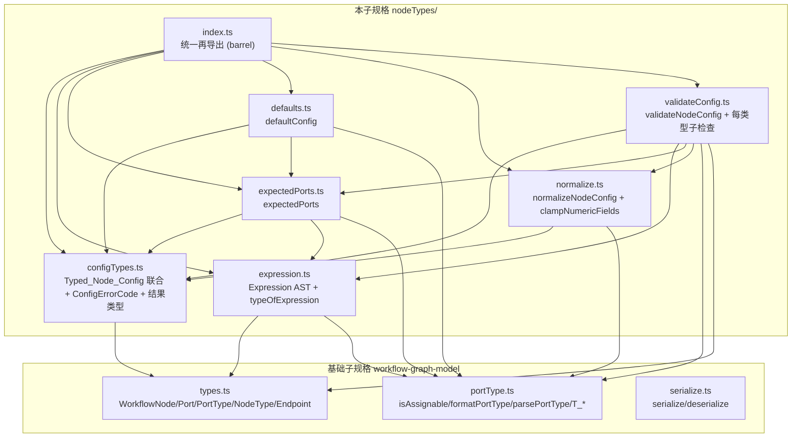
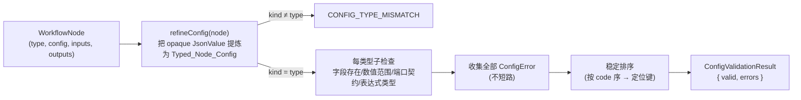
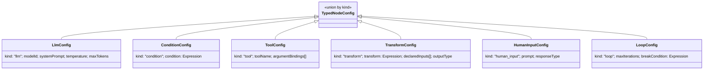

# 设计文档：工作流节点类型 (workflow-node-types)

## Overview

「工作流节点类型」(workflow-node-types) 是女娲 Nuwa「多智能体工作流编排引擎」的**第二个子规格**，构建于已实现的基础子规格「工作流图模型」(workflow-graph-model, 位于 `app/web/src/lib/workflow/`) 之上。基础子规格把每个节点的配置载荷 (`NodeConfig`) 视为不透明的 `JsonValue`；本子规格的职责是为六种 `NodeType`（`llm`、`condition`、`tool`、`transform`、`human_input`、`loop`）赋予**具体的、带类型的配置 schema 与每类型的语义契约**，并提供一组**纯的、可属性测试 (property-based testing) 验证**的校验、默认构造、端口推导、规范化与表达式静态类型函数。

实现位于 `app/web/src/lib/workflow/nodeTypes/`，是一个**纯库**：无任何 I/O、无可变全局状态、不依赖时间或随机数（R1.4）。所有对外暴露的 API 均为纯函数，对相同输入恒返回相同输出。

### 设计目标

1. **类型严格**：`Typed_Node_Config` 是一个以 `kind`（取值等于 `NodeType`）为判别标签的可辨识联合 (discriminated union)，使每种节点配置在编译期可穷尽匹配、运行期可程序化判别（R1.1、R1.3）。
2. **复用而不重定义**：直接 `import` 基础子规格的 `WorkflowNode`、`Port`、`PortType`、`NodeType`、`Endpoint`（来自 `../types`）与 `isAssignable`、`formatPortType`、`parsePortType`、类型构造子（来自 `../portType`），不重新定义这些类型，也不修改其结构（R1.2、R15.1）。
3. **全面校验、确定性输出**：`validateNodeConfig(node)` 一次性收集**全部**被违反规则的错误（不在首错处停止），以稳定顺序排序，每条错误携带稳定错误码 `ConfigErrorCode` 与精确定位信息（R8、R16）。
4. **错误码互不冲突**：`ConfigErrorCode` 的取值集合与基础子规格 `ErrorCode` 的取值集合**不相交**，便于上层聚合两层错误而不混淆（R15.6）。
5. **往返合法性与幂等规范化**：`defaultConfig(t)` 的产出必然通过校验（R10.2）；`clampNumericFields` 与 `normalizeNodeConfig` 幂等（R9.3、R12.2）、与图序列化器往返一致（R12.4）。
6. **全函数表达式类型检查器**：`typeOfExpression` 是一个小型、**总 (total)**、确定、纯的静态类型器，只依据输入端口类型推导 condition/transform 表达式的输出 `PortType`，复用 `isAssignable`，**不做运行时求值**（R13、R14）。

### 与基础子规格的关系

| 层 | 模块 | 职责 | 错误码 |
|---|---|---|---|
| 基础层 (workflow-graph-model) | `types/portType/graph/validate/serialize/analyze/mutate` | 图结构、端口类型系统、拓扑/连通性校验、规范 JSON 序列化 | `ErrorCode`（拓扑/引用类） |
| 本层 (workflow-node-types) | `nodeTypes/*` | 每类型配置 schema、配置校验、默认工厂、端口推导、规范化、表达式类型 | `ConfigErrorCode`（配置/类型类） |

两层错误码不相交（R15.6）。本层 `expectedPorts` 推导出的端口集合可直接装配进 `WorkflowNode.inputs/outputs`，交给基础层 `validateGraph` 做拓扑与端口类型兼容性校验（R15.2、R15.4、R15.5）。

## Architecture

### 模块依赖关系



依赖是**无环**的：`configTypes` 与 `expression` 为底层叶子，`expectedPorts`/`defaults`/`normalize` 居中，`validateConfig` 为顶层聚合器，`index` 仅做再导出。

### 校验数据流



### 设计决策与理由

- **决策 1：`config` 提炼 (refine) 而非假定已是 typed。** 基础层 `WorkflowNode.config` 是 `JsonValue`（不透明）。本层提供内部 `refineConfig(node)`，先按 `node.type` 把 `config` 解释为对应的 `Typed_Node_Config` 分支；当 `config` 的 `kind` 字段与 `node.type` 不等（或缺失/结构不符）时产出 `CONFIG_TYPE_MISMATCH`（R1.5）。这样 `validateNodeConfig` 能在不抛异常的前提下处理任意 `JsonValue`。
- **决策 2：表达式类型器返回结果类型而非抛异常。** 为保证总性（R13.2），`typeOfExpression` 返回 `ExpressionTypeResult = { ok: true; type } | { ok: false; error }`，所有失败（未知输入、类型不匹配）均以 `ok: false` 表达，绝不抛出或不终止。AST 不含递归构造子的无界深度问题——生成器与类型器都按结构归纳，深度有限。
- **决策 3：复用 `isAssignable` 作为唯一兼容性来源。** 表达式算子的类型规则、端口契约核对、transform 输出端口兼容性判定都调用基础层 `isAssignable`，不引入独立的类型兼容规则（R14.4）。
- **决策 4：错误码用字符串字面量联合，前缀隔离。** `ConfigErrorCode` 用 TypeScript `enum`，其字符串值不与 `ErrorCode` 任一值重合（R15.6）。设计上为本层错误码选用配置/类型语义的命名，且通过一个单元/属性测试静态断言两集合不相交。
- **决策 5：规范化分两步。** `clampNumericFields`（数值收敛）与 `normalizeNodeConfig`（键序/集合序规范化、字段补全、去重）职责分离；`normalizeNodeConfig` 内部先 clamp 再规范化，使规范形式同时满足"数值在区间内"与"表示唯一"。

## Components and Interfaces

下列签名为各模块对外导出的**精确 TypeScript 契约**。所有类型从 `../types`、`../portType` 导入既有定义，不重复定义。

### `nodeTypes/configTypes.ts`

```typescript
import type { NodeType, PortType } from '../types';
import type { Expression } from './expression';

// —— 每类型配置分支（判别标签 kind 等于 NodeType）——

/** llm 节点配置（R2.1）。 */
export interface LlmConfig {
  readonly kind: 'llm';
  readonly modelId: string;        // Model_Id：非空字符串
  readonly systemPrompt: string;   // System_Prompt
  readonly temperature: number;    // Temperature ∈ [0, 2]
  readonly maxTokens: number;      // Max_Tokens：整数 ≥ 1
}

/** condition 节点配置（R3.1）。 */
export interface ConditionConfig {
  readonly kind: 'condition';
  readonly condition: Expression;  // Condition_Expression：定型应为 boolean
}

/** tool 节点配置（R4.1）。argumentBindings: Port_Id -> 工具参数名。 */
export interface ToolConfig {
  readonly kind: 'tool';
  readonly toolName: string;                                  // Tool_Name：非空字符串
  readonly argumentBindings: ReadonlyArray<ArgumentBinding>;  // 有序、稳定表示
}

/** 单条参数绑定：输入端口 Port_Id ↦ 工具参数名。 */
export interface ArgumentBinding {
  readonly portId: string;       // 必须属于该节点已声明输入端口集合
  readonly argName: string;      // 工具参数名（同一配置内不得重复）
  readonly portType: PortType;   // 该输入端口的类型（用于推导 expectedPorts 输入端口）
}

/** transform 节点配置（R5.1）。 */
export interface TransformConfig {
  readonly kind: 'transform';
  readonly transform: Expression;          // Transform_Expression
  readonly declaredInputs: ReadonlyArray<InputPortDecl>; // 输入端口声明（构成 Input_Type_Environment）
  readonly outputType: PortType;           // 声明的 output 端口类型（与推导结果须 isAssignable 兼容）
}

/** transform 的输入端口声明（id + 类型 + 是否必需）。 */
export interface InputPortDecl {
  readonly portId: string;
  readonly portType: PortType;
  readonly required: boolean;
}

/** human_input 节点配置（R6.1）。 */
export interface HumanInputConfig {
  readonly kind: 'human_input';
  readonly prompt: string;          // Human_Prompt：非空字符串
  readonly responseType: PortType;  // Response_Type
}

/** loop 节点配置（R7.1）。 */
export interface LoopConfig {
  readonly kind: 'loop';
  readonly maxIterations: number;   // Max_Iterations：整数 ≥ 1
  readonly breakCondition: Expression; // Break_Condition：定型应可赋值给 boolean
}

/** 带类型节点配置可辨识联合（R1.1）：分支恰好覆盖六种 NodeType。 */
export type TypedNodeConfig =
  | LlmConfig
  | ConditionConfig
  | ToolConfig
  | TransformConfig
  | HumanInputConfig
  | LoopConfig;

/** 把 NodeType 映射到其配置分支类型（便于泛型签名）。 */
export interface ConfigByType {
  readonly llm: LlmConfig;
  readonly condition: ConditionConfig;
  readonly tool: ToolConfig;
  readonly transform: TransformConfig;
  readonly human_input: HumanInputConfig;
  readonly loop: LoopConfig;
}

// —— 错误码（R8.7，R15.6：与基础层 ErrorCode 不相交）——

export enum ConfigErrorCode {
  CONFIG_TYPE_MISMATCH = 'CONFIG_TYPE_MISMATCH',           // R1.5
  MISSING_REQUIRED_FIELD = 'MISSING_REQUIRED_FIELD',       // R2.4/R4.4/R6.4
  NUMERIC_OUT_OF_RANGE = 'NUMERIC_OUT_OF_RANGE',           // R2.5/R2.6/R7.3
  PORT_ARITY_MISMATCH = 'PORT_ARITY_MISMATCH',             // R3.3
  PORT_CONTRACT_MISMATCH = 'PORT_CONTRACT_MISMATCH',       // R3.4/R4.5/R6.5
  DUPLICATE_ARGUMENT_BINDING = 'DUPLICATE_ARGUMENT_BINDING', // R4.6
  EXPRESSION_TYPE_ERROR = 'EXPRESSION_TYPE_ERROR',         // R3.6/R5.4/R7.5/R13.6
  EXPRESSION_UNKNOWN_INPUT = 'EXPRESSION_UNKNOWN_INPUT',   // R5.5/R13.5
}

/** 配置错误定位信息（R16）。各字段按需填充。 */
export interface ConfigErrorLocation {
  readonly nodeId: string;              // 所属节点（R16.1，必填）
  readonly portId?: string;             // 涉及端口（R16.2）
  readonly field?: string;              // 涉及配置字段名（R16.3）
  readonly exprPortId?: string;         // 表达式定型失败涉及的 Port_Id（R16.4）
}

/** 单条配置错误（R8.7，R16.5）。 */
export interface ConfigError {
  readonly code: ConfigErrorCode;
  readonly message: string;             // 人类可读描述（R16.5）
  readonly location: ConfigErrorLocation;
}

/** 配置校验结果（R8.1）。valid 为真时 errors 为空（R8.2）。 */
export interface ConfigValidationResult {
  readonly valid: boolean;
  readonly errors: readonly ConfigError[];
}
```

### `nodeTypes/expression.ts`

```typescript
import type { PortType } from '../types';
import type { ConfigError } from './configTypes';

/**
 * 小型、全函数、纯的表达式抽象语法（Expression AST）。
 * 不含运行时副作用；类型器只静态推导输出 PortType，不求值。
 */
export type Expression =
  // 字面量
  | { readonly node: 'litString'; readonly value: string }
  | { readonly node: 'litNumber'; readonly value: number }
  | { readonly node: 'litBool'; readonly value: boolean }
  // 输入引用：引用某输入端口（其类型来自 Input_Type_Environment）
  | { readonly node: 'inputRef'; readonly portId: string }
  // 字段访问：从 json/message 取字段（结果类型为 json）
  | { readonly node: 'field'; readonly target: Expression; readonly name: string }
  // 比较算子：== != < <= > >=（结果 boolean）
  | { readonly node: 'compare'; readonly op: CompareOp; readonly left: Expression; readonly right: Expression }
  // 逻辑算子：and or（左右须 boolean，结果 boolean）
  | { readonly node: 'logic'; readonly op: LogicOp; readonly left: Expression; readonly right: Expression }
  // 逻辑取反：not（操作数须 boolean，结果 boolean）
  | { readonly node: 'not'; readonly operand: Expression }
  // 算术算子：+ - * /（左右须 number，结果 number）
  | { readonly node: 'arith'; readonly op: ArithOp; readonly left: Expression; readonly right: Expression };

export type CompareOp = 'eq' | 'ne' | 'lt' | 'le' | 'gt' | 'ge';
export type LogicOp = 'and' | 'or';
export type ArithOp = 'add' | 'sub' | 'mul' | 'div';

/** Input_Type_Environment：Port_Id -> PortType（R13 推导环境）。 */
export type InputTypeEnv = ReadonlyMap<string, PortType>;

/** 表达式静态类型结果（R13.1）：成功携带输出类型，失败携带配置错误。 */
export type ExpressionTypeResult =
  | { readonly ok: true; readonly type: PortType }
  | { readonly ok: false; readonly error: ExpressionTypeError };

/** 表达式定型错误：错误码取 EXPRESSION_UNKNOWN_INPUT 或 EXPRESSION_TYPE_ERROR（R13.5/R13.6）。 */
export interface ExpressionTypeError {
  readonly code: ConfigError['code']; // 限定为 EXPRESSION_* 两码之一
  readonly message: string;
  readonly portId?: string;           // 未知输入时携带被引用 Port_Id（R16.4）
}

/**
 * 表达式静态类型器（Expression_Typer，R13.1）。
 * 总性（R13.2）：对任意 expr/env 终止并返回结果，绝不抛异常或不终止。
 * 确定性（R13.3）：相同输入恒返回相同结果。
 * 复用基础层 isAssignable 作为唯一兼容规则（R14.4）。
 */
export function typeOfExpression(expr: Expression, inputTypes: InputTypeEnv): ExpressionTypeResult;

/** 返回表达式直接/间接引用的全部 inputRef Port_Id 集合（供单调性属性使用）。 */
export function referencedInputs(expr: Expression): ReadonlySet<string>;
```

### `nodeTypes/expectedPorts.ts`

```typescript
import type { NodeType, Port } from '../types';
import type { TypedNodeConfig } from './configTypes';

/** 端口契约推导结果（R11.1）：规范的输入/输出端口集合。 */
export interface ExpectedPorts {
  readonly inputs: readonly Port[];
  readonly outputs: readonly Port[];
}

/**
 * 端口契约推导（R11.1）。给定 NodeType 与其 Typed_Node_Config，
 * 推导满足 Port_Contract 的规范端口集合。
 * 确定性（R11.6）：相同 (nodeType, config) 恒返回相同 ExpectedPorts。
 * 端口在结果中以稳定顺序（按 Port_Id 字典序）排列。
 */
export function expectedPorts(nodeType: NodeType, config: TypedNodeConfig): ExpectedPorts;
```

### `nodeTypes/defaults.ts`

```typescript
import type { NodeType, Port } from '../types';
import type { TypedNodeConfig } from './configTypes';

/** 默认配置工厂产物（R10.1）：一个 Typed_Node_Config 加默认输入/输出端口集合。 */
export interface DefaultConfig {
  readonly config: TypedNodeConfig;
  readonly inputs: readonly Port[];
  readonly outputs: readonly Port[];
}

/**
 * 默认配置工厂（R10.1）。为给定 NodeType 产出合法默认配置与默认端口。
 * 往返合法性（R10.2）：据此构造的 WorkflowNode 必通过 validateNodeConfig。
 * 默认端口集合恰等于 expectedPorts(t, 默认配置)（R10.4）。
 * 确定性（R10.5）：相同 NodeType 恒返回相同 DefaultConfig。
 */
export function defaultConfig(nodeType: NodeType): DefaultConfig;
```

### `nodeTypes/normalize.ts`

```typescript
import type { NodeType } from '../types';
import type { TypedNodeConfig } from './configTypes';

/**
 * 数值字段区间收敛（R9.2）。把越界数值收敛到合法区间最近端点，
 * 区间内数值保持不变（R9.4）。幂等（R9.3）。
 * 合法区间：Temperature ∈ [0, 2]；Max_Tokens、Max_Iterations 为整数 ≥ 1（R9.1）。
 */
export function clampNumericFields(nodeType: NodeType, config: TypedNodeConfig): TypedNodeConfig;

/**
 * 配置规范化（R12.1）。把配置转换为 Canonical_Config：
 *   1. 先 clampNumericFields 收敛数值；
 *   2. 规范字段顺序、对集合（如 argumentBindings）排序去重；
 *   3. 规范化内部 Expression 与 PortType 的表示。
 * 幂等（R12.2）；语义等价配置产出相等规范形式（R12.3）；
 * 规范形式为不动点（R12.5）；确定性（R12.6）。
 */
export function normalizeNodeConfig(nodeType: NodeType, config: TypedNodeConfig): TypedNodeConfig;

/** 配置语义相等（忽略 argumentBindings 顺序、字段书写顺序等）；供规范化唯一性属性使用。 */
export function configSemanticEquals(a: TypedNodeConfig, b: TypedNodeConfig): boolean;
```

### `nodeTypes/validateConfig.ts`

```typescript
import type { WorkflowNode } from '../types';
import type { ConfigValidationResult, ConfigError, TypedNodeConfig } from './configTypes';

/**
 * 配置校验器入口（R8.1）。输入一个 WorkflowNode，输出 ConfigValidationResult。
 * 纯函数、确定（R8.4）；一次报告全部违规（R8.6）；错误稳定排序（R8.5）。
 */
export function validateNodeConfig(node: WorkflowNode): ConfigValidationResult;

/**
 * 把不透明 config 提炼为 Typed_Node_Config。
 * 当 kind 缺失/不符或结构不符时返回 { ok: false }，由入口产出 CONFIG_TYPE_MISMATCH（R1.5）。
 */
export function refineConfig(
  node: WorkflowNode,
): { ok: true; config: TypedNodeConfig } | { ok: false; error: ConfigError };

// —— 每类型子检查（均为纯函数，返回该类型相关的全部 ConfigError）——
export function checkLlmConfig(node: WorkflowNode, config: import('./configTypes').LlmConfig): ConfigError[];
export function checkConditionConfig(node: WorkflowNode, config: import('./configTypes').ConditionConfig): ConfigError[];
export function checkToolConfig(node: WorkflowNode, config: import('./configTypes').ToolConfig): ConfigError[];
export function checkTransformConfig(node: WorkflowNode, config: import('./configTypes').TransformConfig): ConfigError[];
export function checkHumanInputConfig(node: WorkflowNode, config: import('./configTypes').HumanInputConfig): ConfigError[];
export function checkLoopConfig(node: WorkflowNode, config: import('./configTypes').LoopConfig): ConfigError[];

/** 端口契约核对：比较 node 已声明端口与 expectedPorts(node.type, config)（R11.7）。 */
export function checkPortContract(node: WorkflowNode, config: TypedNodeConfig): ConfigError[];
```

### `nodeTypes/index.ts`

barrel 模块，统一再导出上述全部公共 API（`TypedNodeConfig`、`ConfigErrorCode`、`validateNodeConfig`、`defaultConfig`、`expectedPorts`、`normalizeNodeConfig`、`clampNumericFields`、`typeOfExpression` 等），供编排引擎上层与测试导入。

## Data Models

### `Typed_Node_Config` 可辨识联合

`TypedNodeConfig` 是以 `kind` 为判别标签的联合（见上 `configTypes.ts`）。`kind` 的取值空间恰为六种 `NodeType`，且每个 `NodeType` 对应唯一一个分支（R1.1）。每个分支的 `kind` 字段值与其所属 `WorkflowNode.type` 必须相等，否则触发 `CONFIG_TYPE_MISMATCH`（R1.3、R1.5）。



### 每类型端口契约 (Port_Contract)

| NodeType | 输入端口 | 输出端口 |
|---|---|---|
| `llm` | `prompt`: `string`（必需）；`context`: `optional<message>`（非必需）（R2.2） | `completion`: `string`；`message`: `message`（R2.3） |
| `condition` | （由实现：一个 `in`: `json` 非必需，承载判定输入；不在验收标准约束内，作默认） | 恰好两个：`true`: `boolean`、`false`: `boolean`（R3.2） |
| `tool` | 由 `argumentBindings` 的 `portId` 键集合确定，每个绑定一个输入端口，类型取其 `portType`（R4.3） | `result`: `json`（R4.2） |
| `transform` | 至少一个输入端口（由 `declaredInputs` 确定）（R5.2） | 恰好一个 `output`，类型 = `typeOfExpression(transform, env)` 的推导结果（R5.2、R11.5） |
| `human_input` | 无必需输入端口（R6.3） | `response`: 类型 = `responseType`（R6.2） |
| `loop` | `body_back`: 循环体回边汇入（R7.2） | `body_in`: 循环体进入；`exit`: 循环退出（R7.2） |

### 数值字段合法区间（R9.1）

| 字段 | 区间 | 端点收敛 |
|---|---|---|
| `temperature` (llm) | 闭区间 `[0, 2]` | `< 0 → 0`；`> 2 → 2` |
| `maxTokens` (llm) | 整数 `≥ 1` | `< 1 → 1`；非整数 → 向下取整后再下限收敛（实现细节，clamp 后必为合法整数） |
| `maxIterations` (loop) | 整数 `≥ 1` | 同上 |

### Expression AST 与类型结果

`Expression` 为有限深度的递归可辨识联合（见 `expression.ts`）。`ExpressionType` 即基础层 `PortType`（不另立类型宇宙，R14.2）。`ExpressionTypeResult` 是成功（携带 `PortType`）/失败（携带 `ExpressionTypeError`）的可辨识联合。

### 结果与错误类型

- `ConfigValidationResult = { valid: boolean; errors: readonly ConfigError[] }`，`valid ⇔ errors.length === 0`（R8.2、R8.3）。
- `ConfigError = { code: ConfigErrorCode; message: string; location: ConfigErrorLocation }`。
- `ConfigErrorLocation` 必含 `nodeId`（R16.1），按需含 `portId`/`field`/`exprPortId`（R16.2–R16.4）。

## 关键算法

### 算法 1：`typeOfExpression` —— 总递归类型推导（R13、R14）

按 `Expression` 的结构归纳。每个递归调用作用于严格更小的子表达式，故必然终止（总性，R13.2）。无任何随机/时间/全局状态依赖，故确定（R13.3）。

```
typeOfExpression(e, env):
  switch e.node:
    litString            -> ok(string)
    litNumber            -> ok(number)
    litBool              -> ok(boolean)
    inputRef(portId):
        if env.has(portId)  -> ok(env.get(portId))
        else                -> err(EXPRESSION_UNKNOWN_INPUT, portId)   // R13.5
    field(target, name):
        tr = typeOfExpression(target, env)
        if tr 失败            -> 传播该失败
        // 字段访问要求 target 可赋值给 json（message/json/list/optional<json> 等皆可经 isAssignable 判定）
        if isAssignable(tr.type, json)  -> ok(json)
        else                 -> err(EXPRESSION_TYPE_ERROR)             // R13.6
    compare(op, l, r):
        lt = recurse(l); rt = recurse(r)
        若任一失败            -> 传播第一个失败（左优先，确定顺序）
        // 比较要求两侧类型在 isAssignable 意义下可比较：
        //   - eq/ne：任一侧可赋值给另一侧（含 json 顶类型）
        //   - lt/le/gt/ge：两侧均可赋值给 number（数值序）或均可赋值给 string（字典序）
        若满足              -> ok(boolean)                              // R14.1
        else                 -> err(EXPRESSION_TYPE_ERROR)
    logic(op, l, r):
        lt = recurse(l); rt = recurse(r)
        若任一失败            -> 传播
        若 isAssignable(lt.type, boolean) 且 isAssignable(rt.type, boolean)
                             -> ok(boolean)
        else                 -> err(EXPRESSION_TYPE_ERROR)
    not(operand):
        ot = recurse(operand)
        若失败                -> 传播
        若 isAssignable(ot.type, boolean) -> ok(boolean)
        else                 -> err(EXPRESSION_TYPE_ERROR)
    arith(op, l, r):
        lt = recurse(l); rt = recurse(r)
        若任一失败            -> 传播
        若 isAssignable(lt.type, number) 且 isAssignable(rt.type, number)
                             -> ok(number)
        else                 -> err(EXPRESSION_TYPE_ERROR)
```

**失败传播顺序固定**（先左后右），保证确定性与"报告单一首要错误"。

**单调可靠性（R14.3）：** 算子输出类型只取决于子表达式是否"可赋值给算子要求的目标类型"。若 `env2` 对每个被引用 `Port_Id` 给出与 `env1` 兼容（`isAssignable`）的类型，则：(a) 比较/逻辑/算术/取反算子输出类型恒为固定基类型（`boolean`/`number`），二者自反 `isAssignable`；(b) `inputRef` 输出类型从 `env1.get` 变为 `env2.get`，二者满足 `isAssignable`；(c) `field` 输出恒为 `json`。由结构归纳，整体输出类型在 `env1`/`env2` 下保持 `isAssignable` 兼容关系。

### 算法 2：`expectedPorts` —— 每类型端口推导（R11）

```
expectedPorts(nodeType, config):
  switch nodeType:
    llm:        inputs = [ port("prompt", string, required=true),
                            port("context", optional<message>, required=false) ]
                outputs = [ port("completion", string), port("message", message) ]
    condition:  inputs = [ port("in", json, required=false) ]
                outputs = [ port("true", boolean), port("false", boolean) ]   // 恰两个（R11.2）
    tool:       inputs = config.argumentBindings 按 portId 去重排序 -> 每个 port(portId, binding.portType, required=true)
                outputs = [ port("result", json) ]                            // 恰一个 result（R11.3）
    transform:  inputs = config.declaredInputs 排序 -> 每个 port(portId, portType, required)
                outputs = [ port("output", inferTransformOutputType(config)) ] // 恰一个 output（R11.5）
    human_input:inputs = []                                                   // 无必需输入（R6.3）
                outputs = [ port("response", config.responseType) ]           // 恰一个 response（R11.4）
    loop:       inputs = [ port("body_back", json, required=false) ]
                outputs = [ port("body_in", json), port("exit", json) ]
  返回 { inputs: 按 id 排序, outputs: 按 id 排序 }   // 稳定顺序，确定性（R11.6）

inferTransformOutputType(config):
  env = Map(declaredInputs -> portType)
  r = typeOfExpression(config.transform, env)
  return r.ok ? r.type : config.outputType   // 定型失败时回退到声明类型，使 expectedPorts 仍为全函数
```

`expectedPorts` 对相同输入恒产出相同端口集合（构造确定、排序确定，R11.6）。

### 算法 3：`validateNodeConfig` —— 聚合校验（R8）

```
validateNodeConfig(node):
  refined = refineConfig(node)
  if refined 失败:
      return { valid: false, errors: [ CONFIG_TYPE_MISMATCH 错误 ] }     // R1.5
  config = refined.config
  errors = []
  errors += 每类型子检查(node, config)        // checkLlm/Condition/Tool/Transform/HumanInput/Loop
  errors += checkPortContract(node, config)    // R3.3/R3.4/R4.5/R6.5/R11.7
  errors = 稳定排序(errors)                     // R8.5：先按 ConfigErrorCode 声明序，再按 location 键
  return { valid: errors.length === 0, errors }  // R8.2/R8.3/R8.6（收集全部，不短路）
```

**每类型子检查规则映射：**

| 子检查 | 规则 → 错误码 |
|---|---|
| `checkLlmConfig` | 缺 `modelId`/空 → `MISSING_REQUIRED_FIELD`(field=modelId, R2.4)；`temperature ∉ [0,2]` → `NUMERIC_OUT_OF_RANGE`(field=temperature, R2.5)；`maxTokens` 非 `≥1` 整数 → `NUMERIC_OUT_OF_RANGE`(field=maxTokens, R2.6) |
| `checkConditionConfig` | `typeOfExpression(condition, env)` 失败或结果不可赋值给 `boolean` → `EXPRESSION_TYPE_ERROR`(R3.5/R3.6)；未知输入 → `EXPRESSION_UNKNOWN_INPUT` |
| `checkToolConfig` | 缺 `toolName`/空 → `MISSING_REQUIRED_FIELD`(field=toolName, R4.4)；绑定 `portId` 不在已声明输入端口 → `PORT_CONTRACT_MISMATCH`(portId, R4.5)；`argName` 重复 → `DUPLICATE_ARGUMENT_BINDING`(R4.6) |
| `checkTransformConfig` | 表达式引用未知 `Port_Id` → `EXPRESSION_UNKNOWN_INPUT`(exprPortId, R5.5)；推导类型与声明 `outputType` 经 `isAssignable` 不兼容 → `EXPRESSION_TYPE_ERROR`(R5.4) |
| `checkHumanInputConfig` | 缺 `prompt`/空 → `MISSING_REQUIRED_FIELD`(field=prompt, R6.4)；`response` 端口类型 ≠ `responseType` → `PORT_CONTRACT_MISMATCH`(R6.5) |
| `checkLoopConfig` | `maxIterations` 非 `≥1` 整数 → `NUMERIC_OUT_OF_RANGE`(field=maxIterations, R7.3)；`breakCondition` 定型失败/不可赋值给 `boolean` → `EXPRESSION_TYPE_ERROR`(R7.5) |
| `checkPortContract` | `condition` 输出端口数 ≠ 2 → `PORT_ARITY_MISMATCH`(nodeId, R3.3)；输出端口 Port_Id 集合 ≠ `{true,false}` → `PORT_CONTRACT_MISMATCH`(R3.4)；其它类型已声明端口集合 ≠ `expectedPorts` → 相应 `PORT_*_MISMATCH`（R11.7 反向：相等则不产出） |

**确定性（R8.4）**：所有子检查为纯函数，排序确定，故整体确定。

### 算法 4：`clampNumericFields` —— 幂等区间收敛（R9）

```
clampNumericFields(nodeType, config):
  switch config.kind:
    llm:  temperature' = min(2, max(0, temperature))
          maxTokens'   = max(1, floor(maxTokens))   // 收敛为合法整数
          return { ...config, temperature: temperature', maxTokens: maxTokens' }
    loop: maxIterations' = max(1, floor(maxIterations))
          return { ...config, maxIterations: maxIterations' }
    其它: return config   // 无数值字段
```

- **幂等（R9.3）**：`clamp(clamp(c)) = clamp(c)`，因收敛后的值已落在区间内，再次收敛是恒等。
- **区间内保持（R9.4）**：若数值本就在区间内，`min/max/floor`（对已是整数者）为恒等。
- **收敛后无范围错误（R9.5）**：收敛结果必落在合法区间，故 `checkLlmConfig`/`checkLoopConfig` 不再产出 `NUMERIC_OUT_OF_RANGE`。

### 算法 5：`normalizeNodeConfig` —— 规范化（R12）

```
normalizeNodeConfig(nodeType, config):
  c = clampNumericFields(nodeType, config)         // 先收敛数值
  switch c.kind:
    tool:   argumentBindings' = 按 (argName, portId) 字典序排序，并去重（语义等价的重复绑定合并）
            return { kind, toolName, argumentBindings: argumentBindings' }（字段固定顺序）
    transform: declaredInputs' = 按 portId 排序去重；transform' = normalizeExpr(transform)
            return { kind, transform', declaredInputs', outputType: normalizePortType(outputType) }
    condition/loop: 内部 Expression -> normalizeExpr（规范化常量折叠？否——仅规范结构表示，不改语义）
    llm/human_input: 规范字段顺序 / 规范 PortType 表示
  返回 Canonical_Config（键序、集合序确定）
```

`normalizeExpr` 仅做**表示规范化**（如确定子节点字段顺序），不做改变语义的化简，从而：
- **幂等（R12.2）/不动点（R12.5）**：规范形式再规范化不变。
- **唯一性（R12.3）**：语义等价（`configSemanticEquals`）的两配置规范化后逐字段相等。
- **与序列化往返一致（R12.4）**：规范化后的 config 作为 `WorkflowNode.config`（`JsonValue` 视图），经基础层 `serialize`/`deserialize` 往返后与 `normalizeNodeConfig` 结果相等——因为本层规范形式的键序与基础层 `canonicalizeJson` 的键序一致（均字典序），数组顺序均已规范。

### 算法 6：`refineConfig` —— 不透明配置提炼（R1.5）

```
refineConfig(node):
  v = node.config
  if v 不是对象 或 v.kind 不存在:
      return err(CONFIG_TYPE_MISMATCH, nodeId)
  if v.kind !== node.type:
      return err(CONFIG_TYPE_MISMATCH, nodeId, message 含两端 kind/type)   // R1.5
  // 按 node.type 校验必要字段在结构上可解释；缺字段交由对应 checkXxx 产出 MISSING_REQUIRED_FIELD
  return ok(v as 对应分支)
```

`refineConfig` 不抛异常；任何结构问题均以 `CONFIG_TYPE_MISMATCH` 或后续字段级错误表达。

## Correctness Properties

*性质 (property) 是应在系统所有合法执行中恒成立的特征或行为——一个关于系统应当做什么的形式化陈述。性质是人类可读规格与机器可验证正确性保证之间的桥梁。*

下列性质均为**全称量化**（"对任意…"）的可属性测试陈述。每条标注其验证的需求条款。除特别说明外，所有性质均针对本层纯函数，配置以自定义 arbitraries 生成（见测试策略）。已据 prework 做去冗余处理：端口契约声明类（R2.2/2.3、R3.2、R4.2、R6.2、R7.2 等）由端口推导与默认往返性质统一覆盖；R8.2/8.3 合并；R1.3 并入默认配置性质；R9.2/9.4 合并；R12.5/12.6、R13.4、R14.2 由更强性质蕴含。

### Property 1: 配置类型不匹配检测

*对任意* `NodeType` `t` 与任意 `kind` 不等于 `t` 的 `Typed_Node_Config`（装配进一个 `type = t` 的 `WorkflowNode`），`validateNodeConfig` 的结果 `valid` 为假且其错误集合包含一条 `code = CONFIG_TYPE_MISMATCH` 的 `ConfigError`。

**Validates: Requirements 1.5**

### Property 2: 默认配置往返合法性

*对任意* `NodeType` `t`，由 `defaultConfig(t)` 的 `config`、`inputs`、`outputs` 构造的 `WorkflowNode` 通过 `validateNodeConfig`（`valid` 为真且错误集合为空）。

**Validates: Requirements 10.2, 15.3**

### Property 3: 默认配置判别标签匹配类型

*对任意* `NodeType` `t`，`defaultConfig(t).config.kind` 等于 `t`。

**Validates: Requirements 10.3, 1.3**

### Property 4: 默认端口集合等于推导端口

*对任意* `NodeType` `t`，`defaultConfig(t)` 产出的默认输入/输出端口集合（按方向与 Port_Id 比较）恰等于 `expectedPorts(t, defaultConfig(t).config)` 推导出的 `ExpectedPorts`。

**Validates: Requirements 10.4**

### Property 5: 默认配置工厂确定性

*对任意* `NodeType` `t`，两次调用 `defaultConfig(t)` 产出相等的 `DefaultConfig`（配置逐字段相等、端口集合相等）。

**Validates: Requirements 10.5**

### Property 6: 校验结果 valid 当且仅当无错误

*对任意* `WorkflowNode` `n`，`validateNodeConfig(n).valid` 为真**当且仅当** `validateNodeConfig(n).errors` 为空。

**Validates: Requirements 8.2, 8.3**

### Property 7: 校验确定性

*对任意* `WorkflowNode` `n`，两次调用 `validateNodeConfig(n)` 返回相等的 `ConfigValidationResult`（错误集合按顺序逐条相等）。

**Validates: Requirements 8.4**

### Property 8: 校验错误排序稳定

*对任意* `WorkflowNode` `n` 及其在端口数组顺序、配置字段书写顺序、`argumentBindings` 顺序上的任意置换 `n'`（语义等价），`validateNodeConfig(n)` 与 `validateNodeConfig(n')` 的错误序列在 `(code, location)` 排序键下一致（排序不依赖输入书写顺序）。

**Validates: Requirements 8.5**

### Property 9: 校验完整报告（不在首错停止）

*对任意* 在一个合法默认节点上注入了 *k≥2* 处相互独立单点违规的 `WorkflowNode`，`validateNodeConfig` 返回的错误集合包含每一处注入违规所对应的 `ConfigErrorCode`。

**Validates: Requirements 8.6**

### Property 10: 错误结构良构（定位与描述）

*对任意* `WorkflowNode` `n`，`validateNodeConfig(n).errors` 中的每一条 `ConfigError` 都满足：`location.nodeId` 等于 `n.id` 且非空，`message` 为非空字符串。

**Validates: Requirements 16.1, 16.5**

### Property 11: llm 必需字段与数值范围检测

*对任意* 合法的 `llm` 默认节点，单点注入下列任一违规后，`validateNodeConfig` 必产出对应错误：置空/删除 `modelId` ⇒ `MISSING_REQUIRED_FIELD`(field=`modelId`)；`temperature` 取 `[0,2]` 之外的值 ⇒ `NUMERIC_OUT_OF_RANGE`(field=`temperature`)；`maxTokens` 取非 `≥1` 整数 ⇒ `NUMERIC_OUT_OF_RANGE`(field=`maxTokens`)。

**Validates: Requirements 2.4, 2.5, 2.6**

### Property 12: tool 配置错误检测

*对任意* 合法的 `tool` 节点，单点注入下列任一违规后，`validateNodeConfig` 必产出对应错误：置空/删除 `toolName` ⇒ `MISSING_REQUIRED_FIELD`(field=`toolName`)；增加一条 `portId` 不在已声明输入端口集合的绑定 ⇒ `PORT_CONTRACT_MISMATCH`(portId)；令两条绑定共享同一 `argName` ⇒ `DUPLICATE_ARGUMENT_BINDING`。

**Validates: Requirements 4.4, 4.5, 4.6**

### Property 13: human_input 配置错误检测

*对任意* 合法的 `human_input` 节点，置空/删除 `prompt` ⇒ `validateNodeConfig` 产出 `MISSING_REQUIRED_FIELD`(field=`prompt`)；令已声明 `response` 输出端口类型不等于 `responseType` ⇒ 产出 `PORT_CONTRACT_MISMATCH`。

**Validates: Requirements 6.4, 6.5**

### Property 14: loop 数值范围与中止条件类型检测

*对任意* 合法的 `loop` 节点，`maxIterations` 取非 `≥1` 整数 ⇒ `validateNodeConfig` 产出 `NUMERIC_OUT_OF_RANGE`(field=`maxIterations`)；将 `breakCondition` 替换为推导类型不可赋值给 `boolean` 的表达式 ⇒ 产出 `EXPRESSION_TYPE_ERROR`。

**Validates: Requirements 7.3, 7.5**

### Property 15: condition 端口契约与表达式类型检测

*对任意* 合法的 `condition` 节点：令其输出端口数量不等于 2 ⇒ `validateNodeConfig` 产出 `PORT_ARITY_MISMATCH`(nodeId)；令输出端口 Port_Id 集合不为 `{true, false}`（但数量为 2）⇒ 产出 `PORT_CONTRACT_MISMATCH`；将 `condition` 表达式替换为推导类型不可赋值给 `boolean` 的表达式 ⇒ 产出 `EXPRESSION_TYPE_ERROR`。

**Validates: Requirements 3.3, 3.4, 3.6**

### Property 16: transform 表达式类型与未知输入检测

*对任意* `transform` 节点：若其 `transform` 表达式引用了不在 `declaredInputs` 中的 Port_Id ⇒ `validateNodeConfig` 产出 `EXPRESSION_UNKNOWN_INPUT`(exprPortId)；若声明的 `output` 端口类型与 `typeOfExpression` 推导出的类型经 `isAssignable` 不兼容 ⇒ 产出 `EXPRESSION_TYPE_ERROR`；当声明 `output` 类型与推导类型 `isAssignable` 兼容且无未知引用时，不产出上述两类错误（校验与定型一致）。

**Validates: Requirements 5.4, 5.5, 14.5**

### Property 17: 数值收敛幂等且区间内保持

*对任意* `NodeType` `t` 与 `Typed_Node_Config` `c`：`clampNumericFields(t, clampNumericFields(t, c))` 等于 `clampNumericFields(t, c)`（幂等）；且当 `c` 的全部数值字段已在合法区间内时，`clampNumericFields(t, c)` 在数值字段上与 `c` 等价（区间内不被改动）。

**Validates: Requirements 9.2, 9.3, 9.4**

### Property 18: 收敛后无数值范围错误

*对任意* `NodeType` `t`（`llm` 或 `loop`）与含任意（含越界）数值字段的 `Typed_Node_Config` `c`，对 `clampNumericFields(t, c)` 的结果运行相应数值检查不产出任何 `NUMERIC_OUT_OF_RANGE` 错误（收敛结果恒落在合法区间）。

**Validates: Requirements 9.5**

### Property 19: 端口推导——每类型基数与键集合

*对任意* 配置：`expectedPorts('condition', c)` 的输出端口恰为两个（`true`、`false`）；`expectedPorts('tool', c)` 的输出端口恰为一个 `result`，且其输入端口 Port_Id 集合等于 `c.argumentBindings` 的 `portId` 键集合；`expectedPorts('human_input', c)` 的输出端口恰为一个 `response` 且其类型等于 `c.responseType`；对任意能被 `typeOfExpression` 成功定型的 `transform` 配置 `c`，`expectedPorts('transform', c)` 的输出端口恰为一个 `output` 且其类型等于推导出的输出 `PortType`。

**Validates: Requirements 11.2, 11.3, 11.4, 11.5**

### Property 20: 端口推导确定性

*对任意* `NodeType` `t` 与配置 `c`，两次调用 `expectedPorts(t, c)` 返回相等的 `ExpectedPorts`（输入/输出端口集合逐端口相等）。

**Validates: Requirements 11.6**

### Property 21: 端口契约一致则无端口错误

*对任意* `NodeType` `t` 与配置 `c`，若用 `expectedPorts(t, c)` 的端口集合装配 `WorkflowNode`，则 `validateNodeConfig` 不就端口契约产出 `PORT_CONTRACT_MISMATCH` 或 `PORT_ARITY_MISMATCH`。

**Validates: Requirements 11.7, 15.2**

### Property 22: 规范化幂等且为不动点

*对任意* `NodeType` `t` 与 `Typed_Node_Config` `c`，`normalizeNodeConfig(t, normalizeNodeConfig(t, c))` 等于 `normalizeNodeConfig(t, c)`（幂等，蕴含不动点 R12.5 与确定性 R12.6）。

**Validates: Requirements 12.2, 12.5, 12.6**

### Property 23: 规范形式唯一（语义等价归一）

*对任意* 两个 `configSemanticEquals` 为真的 `Typed_Node_Config`（如仅 `argumentBindings` 顺序、字段书写顺序、`declaredInputs` 顺序不同），`normalizeNodeConfig` 对二者产出逐字段相等的 `Canonical_Config`。

**Validates: Requirements 12.3**

### Property 24: 规范化与图序列化器往返一致

*对任意* 通过 `validateNodeConfig` 的 `WorkflowNode` `n`，把 `normalizeNodeConfig(n.type, n.config)` 作为节点 config 装入图，经基础层 `serialize` 再 `deserialize` 往返后所得节点的 config，与 `normalizeNodeConfig(n.type, n.config)` 相等。

**Validates: Requirements 12.4**

### Property 25: 表达式类型器总性

*对任意* `Expression` `e` 与 `InputTypeEnv` `env`，`typeOfExpression(e, env)` 终止并返回一个 `ExpressionTypeResult`（`{ ok: true, type }` 或 `{ ok: false, error }`），既不抛出异常也不进入非终止状态。

**Validates: Requirements 13.2, 13.4**

### Property 26: 表达式类型器确定性

*对任意* `Expression` `e` 与 `InputTypeEnv` `env`，两次调用 `typeOfExpression(e, env)` 返回相等的 `ExpressionTypeResult`。

**Validates: Requirements 13.3**

### Property 27: 未知输入引用产生 EXPRESSION_UNKNOWN_INPUT

*对任意* 含 `inputRef(portId)` 且 `portId` 不在 `env` 中的 `Expression`，`typeOfExpression` 返回 `ok: false` 且 `error.code = EXPRESSION_UNKNOWN_INPUT`，并在 `error.portId` 中携带该 Port_Id。

**Validates: Requirements 13.5**

### Property 28: 算子类型不匹配产生 EXPRESSION_TYPE_ERROR

*对任意* 子表达式类型违反其算子类型要求的 `Expression`（如对非数值施加算术算子、对非布尔施加逻辑算子，且不存在未知输入），`typeOfExpression` 返回 `ok: false` 且 `error.code = EXPRESSION_TYPE_ERROR`。

**Validates: Requirements 13.6**

### Property 29: 条件表达式定型为布尔

*对任意* 被 `typeOfExpression` 成功定型的 `Condition_Expression`（顶层算子为比较/逻辑/取反），其输出 `PortType` 可赋值给 `boolean`。

**Validates: Requirements 14.1**

### Property 30: 输入加宽下类型推导单调可靠

*对任意* 被成功定型的 `Expression` `e` 与两个对 `e` 所引用的每个 Port_Id 都给出 `isAssignable` 兼容类型的环境 `env1`、`env2`：若 `typeOfExpression(e, env1)` 与 `typeOfExpression(e, env2)` 均成功，则二者输出 `PortType` 之间保持 `isAssignable` 兼容关系。

**Validates: Requirements 14.3**

### Property 31: 跨层集成——默认入口节点通过图校验

*对任意* `NodeType` `t`：以 `defaultConfig(t)` 构造单节点图并标记为入口节点，则 (a) 当默认输入端口集合不含必需输入端口时，该图完整通过基础层 `validateGraph`（含 `MISSING_REQUIRED_INPUT`）；(b) 当含必需输入端口时，该图通过 `validateGraph` 中除 `MISSING_REQUIRED_INPUT` 以外的全部规则。

**Validates: Requirements 15.4, 15.5**

### Property 32: 错误码集合不相交

`ConfigErrorCode` 的全部取值与基础层 `ErrorCode` 的全部取值**不相交**（两枚举值集合的交集为空）。

**Validates: Requirements 15.6**

## Error Handling

本层为纯库，错误以**值**表达，绝不以异常表达：

1. **配置校验错误**：`validateNodeConfig` 返回 `ConfigValidationResult`，其 `errors` 数组承载全部 `ConfigError`。每条错误含 `code`（`ConfigErrorCode`）、`message`（人类可读，R16.5）、`location`（`nodeId` 必填 R16.1，按需含 `portId` R16.2、`field` R16.3、`exprPortId` R16.4）。
2. **表达式定型失败**：`typeOfExpression` 返回 `ExpressionTypeResult` 的 `ok: false` 分支，携带 `EXPRESSION_UNKNOWN_INPUT` 或 `EXPRESSION_TYPE_ERROR`。`validateConfig` 把该失败转换为对应 `ConfigError` 时，保留原错误码与相关 Port_Id（R16.4）。
3. **不透明配置不可解释**：`refineConfig` 对结构不符/`kind` 缺失的 `JsonValue` 返回 `CONFIG_TYPE_MISMATCH`，绝不抛异常（R1.5）。
4. **总性保证**：`typeOfExpression` 按结构归纳，递归深度有界于 AST 深度，必然终止（R13.2）；`expectedPorts`/`clampNumericFields`/`normalizeNodeConfig`/`defaultConfig` 均为有限分支的全函数。
5. **错误聚合不短路**：`validateNodeConfig` 运行全部子检查再聚合，绝不在首错处返回（R8.6），并以固定排序键（先 `ConfigErrorCode` 声明序，后 `location` 字典序）输出（R8.5）。
6. **与基础层错误隔离**：本层只产 `ConfigError`/`ConfigErrorCode`，基础层只产 `ValidationError`/`ErrorCode`，两码集合不相交（R15.6），上层可安全合并两类错误列表而不混淆来源。

## Testing Strategy

### 双重测试方法

- **单元测试 (example-based)**：覆盖具体示例、边界与错误条件、跨层集成的代表性场景，以及类型/枚举存在性（如 `ConfigErrorCode` 至少含 8 个码 R8.7、六分支联合 R1.1）。
- **属性测试 (property-based)**：覆盖上述 32 条全称性质，验证对全部输入的普遍正确性。

本特性核心是**纯函数与可辨识联合上的不变式、往返、幂等、确定性、单调性**，**高度适合属性测试**（PBT 适用）。

### 属性测试库与配置

- 使用既有依赖 **fast-check `^3.23.2`**（见 `app/web/package.json`），不自行实现 PBT 框架。
- 每条 Property 用**单个** fast-check 属性测试实现，`fc.assert(..., { numRuns: 100 })`（最少 100 次迭代）。
- 测试通过 vitest 单次运行：`npm run test`（即 `vitest --run`），不使用 watch 模式。
- 每个测试文件顶部加标签注释：

```typescript
// Feature: workflow-node-types, Property N: <性质标题>
```

- 文件命名沿用基础层约定，置于 `app/web/src/lib/workflow/nodeTypes/`：`prop-01.test.ts` … `prop-32.test.ts`；示例/集成测试用 `example-*.test.ts`。

### 自定义 Arbitraries（置于 `nodeTypes/arbitraries.ts`，仅测试期导入）

| Arbitrary | 签名 | 用途 |
|---|---|---|
| `arbitraryPortType` | 复用基础层 `../arbitraries` 的 `arbitraryPortType(maxDepth)` | 端口类型/响应类型生成 |
| `arbitraryExpression` | `(maxDepth?: number) => fc.Arbitrary<Expression>` | 深度受限递归 AST 生成（叶子为字面量/`inputRef`，内节点为 compare/logic/not/arith/field），保证终止 |
| `arbitraryWellTypedExpression` | `(env: InputTypeEnv, target: PortType, maxDepth?) => fc.Arbitrary<Expression>` | 生成在给定环境下能定型且输出可赋值 `target` 的表达式（用于 condition 布尔、transform 兼容性正例） |
| `arbitraryInputTypeEnv` | `(maxKeys?: number) => fc.Arbitrary<InputTypeEnv>` | Port_Id→PortType 环境生成 |
| `arbitraryTypedConfig` | `(kind: NodeType) => fc.Arbitrary<TypedNodeConfig>` | 按 kind 生成合法/边界配置（每分支一个生成器：`arbitraryLlmConfig` 等） |
| `arbitraryNodeOfType` | `(t: NodeType) => fc.Arbitrary<WorkflowNode>` | 以 `defaultConfig(t)` 为基底装配带 `expectedPorts` 端口的合法节点（再用单点变异注入违规） |
| `arbitraryConfigMutation` | `(node) => fc.Arbitrary<{ node; expectedCode }>` | "变异-检测"模式：在合法节点上注入单点配置违规并标注预期 `ConfigErrorCode` |
| `arbitraryReorderedConfig` | `(c: TypedNodeConfig) => fc.Arbitrary<TypedNodeConfig>` | 语义等价置换（打乱 `argumentBindings`/字段序）用于排序稳定与规范化唯一性 |

**复用说明**：基础层 `../arbitraries.ts` 已导出 `arbitraryPortType` 与 `arbitraryValidGraph`；本层直接复用 `arbitraryPortType`（用于 `responseType`、`outputType`、环境类型），并在 Property 31 的跨层集成测试中复用基础层 `validateGraph`（来自 `../validate`）与序列化（来自 `../serialize`）。

### 性质到测试文件映射

| 文件 | Property | 关键 Arbitrary | 断言要点 |
|---|---|---|---|
| `prop-01` | 1 | `arbitraryNodeOfType` + kind 失配 | 含 `CONFIG_TYPE_MISMATCH` |
| `prop-02` | 2 | `defaultConfig` over `NODE_TYPES` | `valid === true` |
| `prop-03` | 3 | `defaultConfig` | `config.kind === t` |
| `prop-04` | 4 | `defaultConfig` + `expectedPorts` | 端口集合相等 |
| `prop-05` | 5 | `defaultConfig` 两次 | 结果相等 |
| `prop-06` | 6 | `arbitraryNodeOfType` + 变异 | `valid ⇔ errors 空` |
| `prop-07` | 7 | 任意 `WorkflowNode` | 两次结果相等 |
| `prop-08` | 8 | `arbitraryReorderedConfig` | 排序键一致 |
| `prop-09` | 9 | 多点 `arbitraryConfigMutation` | 全部预期码出现 |
| `prop-10` | 10 | 任意节点 | 每错误 `nodeId`/`message` 非空 |
| `prop-11` | 11 | llm 单点变异 | 三类错误码+字段定位 |
| `prop-12` | 12 | tool 单点变异 | 三类错误码 |
| `prop-13` | 13 | human_input 单点变异 | 两类错误码 |
| `prop-14` | 14 | loop 单点变异 | 两类错误码 |
| `prop-15` | 15 | condition 单点变异 | 三类错误码 |
| `prop-16` | 16 | transform 表达式变异 | 类型/未知输入/兼容正例 |
| `prop-17` | 17 | `arbitraryTypedConfig` | clamp 幂等+区间内保持 |
| `prop-18` | 18 | 含越界数值配置 | clamp 后无范围错误 |
| `prop-19` | 19 | 每类型配置 | arity/键集合/类型 |
| `prop-20` | 20 | 任意 `(t, c)` | `expectedPorts` 两次相等 |
| `prop-21` | 21 | `expectedPorts` 装配节点 | 无端口错误 |
| `prop-22` | 22 | `arbitraryTypedConfig` | normalize 幂等 |
| `prop-23` | 23 | `arbitraryReorderedConfig` | 规范形式相等 |
| `prop-24` | 24 | 合法节点 + 序列化 | 往返后 config 相等 |
| `prop-25` | 25 | `arbitraryExpression` + 任意 env | 不抛、返回结果 |
| `prop-26` | 26 | `arbitraryExpression` | 两次结果相等 |
| `prop-27` | 27 | 含未知 `inputRef` 的表达式 | `EXPRESSION_UNKNOWN_INPUT` |
| `prop-28` | 28 | 类型违例表达式 | `EXPRESSION_TYPE_ERROR` |
| `prop-29` | 29 | `arbitraryWellTypedExpression`(boolean) | 输出可赋值 boolean |
| `prop-30` | 30 | 成功表达式 + 加宽 env 对 | 输出 `isAssignable` 兼容 |
| `prop-31` | 31 | `defaultConfig` + `validateGraph` | 跨层校验通过/差额 |
| `prop-32` | 32 | 枚举值集合 | 交集为空 |

### 示例与集成测试（example-based / smoke）

- `example-config-error-codes.test.ts`：断言 `ConfigErrorCode` 枚举至少含 8 个规定码（R8.7）。
- `example-union-exhaustive.test.ts`：对每个 `NodeType` 构造一个分支，验证联合穷尽（R1.1）。
- `example-error-location.test.ts`：端口/字段/表达式相关错误分别携带 `portId`/`field`/`exprPortId`（R16.2–R16.4）。
- `example-integration-defaults.test.ts`：每类型默认节点连接必需输入后同时通过 `validateNodeConfig` 与 `validateGraph`（R15.5，每类型 1 例）。

### 单元测试节制原则

- 不为已被属性测试普遍覆盖的行为重复堆砌示例单测；示例单测聚焦穷尽性、枚举存在性、定位字段、跨层集成代表性场景与具体边界（空字符串、`temperature` 端点 0/2、`maxTokens=1` 等）。

### 验证流程

实现完成后运行 `npm run build`（`tsc` 类型检查 + 构建）确认无类型错误，再运行 `npm run test` 一次性执行全部属性与示例测试。任一属性失败时，记录 fast-check 反例并修正实现而非削弱性质。
