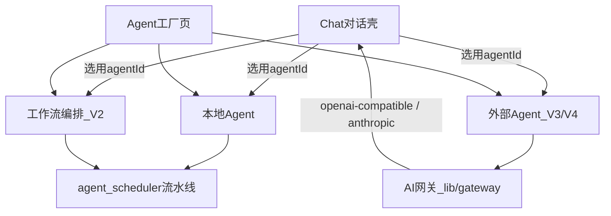

# Agent 产品规划（V1 / V2 / V3 / V4）

> Chat = 对话壳（类 ChatGPT）· Agent 页 = 智能体制造与管控  
> 流水线保留为**本地 Agent 的执行后端**，不再作为独立产品入口。  
> 工作流页已删除；编排在 Agent 页内完成。

---

## 总览



| 阶段 | 用户价值 | 状态 |
|------|----------|------|
| **V1** | 可定义多个本地 Agent；Chat 选用后按配置对话 | **完成** |
| **V2** | Agent 可挂多步本地编排（ASR/LLM/TTS） | **完成** |
| **V3** | 管控外部 OpenAI 兼容 Agent | **完成** |
| **V4** | AI 网关：多协议外部接入（OpenAI 兼容 + Anthropic 原生），预留 ACP | **完成** |

---

## 角色已并入

原「角色管理」不再作为独立入口。人设字段（systemPrompt / voiceId / temperature / topP / mood）就是 Agent 的一部分：

- 默认种子含原角色 id：`assistant`（季莹莹）、`socrates`、`counselor`
- 老用户 `nuwa-character` 一次性迁移为 `kind: 'local'` Agent（`nuwa_agent_character_migrated`）
- Chat 会话绑定 `agentId`；`characterId` 仅作导出兼容别名
- `/characters` → `/agents`

详见 `docs/features/agent-character-merge.md`。

---

## V1 — 本地 Agent 工厂 + Chat 调用

- IndexedDB `nuwa-agent`、AgentsPage CRUD、Chat 选用、删 Workflow  
- 验收：已全部勾选

---

## V2 — 本地编排（工作流能力并入 Agent）

- `kind: 'workflow'` + `steps[]`（asr / llm / tts，可排序）  
- 预设链：纯对话 / 对话+朗读 / 听→想→说 / 仅转写 / 仅合成  
- `resolvePipelineFromSteps` 映射到后端固定流水线；Chat 仍用 `text_chat_stream` 拿 token，含 TTS 步骤则自动朗读  
- 「从角色导入」已删除（角色迁移后语义消失）  

验收：

- [x] 可创建 workflow Agent 并编辑步骤  
- [x] Chat 选用后按步骤决定是否自动 TTS  
- [x] 角色并入后无需「从角色导入」  

---

## V3 — 外部 Agent

- `kind: 'external'`：`endpoint`、`externalModel`、`protocol`  
- API Key **仅 localStorage**（`nuwa_agent_secret:{id}`），不进 IndexedDB / 不发 Nuwa 后端  
- AgentsPage：连通性测试（`/models` 或迷你 completion）  
- Chat：SSE 流式  

验收：

- [x] 可配置并测试外部端点  
- [x] Chat 选用外部 Agent 后走远程流式  
- [x] 密钥不落 Agent JSON 导出（仅本机）  

---

## V4 — AI 网关（多协议外部接入）

外部 Agent 从「单一 OpenAI 兼容」升级为可扩展的协议网关 `lib/gateway/`：

```
Chat / AgentsPage
      │  streamChat(protocol, args) / probeExternalAgent(protocol, args)
      ▼
lib/gateway/index.ts（ADAPTERS 注册表）
      ├─ openai.ts     OpenAI 兼容（OpenAI / OpenRouter / DeepSeek / Ollama / LM Studio…）
      └─ anthropic.ts  Anthropic Messages API（Claude 系列，浏览器直连）
```

设计要点：

- **统一接口**：每个协议实现 `ProtocolAdapter { streamChat, probe }`（`gateway/types.ts`），
  Chat 与 AgentsPage 只面向注册表分派，不感知具体协议。
- **协议字段**：`Agent.protocol: 'openai-compatible' | 'anthropic'`（默认 openai-compatible；
  导入/持久化经 `parseProtocol` 校验，未知值回退）。
- **Anthropic 直连**：`/v1/messages` SSE（`content_block_delta`），请求头
  `anthropic-version: 2023-06-01` + `anthropic-dangerous-direct-browser-access: true`；
  `max_tokens` 必填（默认 8192）；temperature 收口到 [0,1]；相邻同角色消息合并、
  首条必须为 user（`toAnthropicMessages` 纯函数）。
- **密钥模型不变**：仍仅 localStorage（`gateway/secrets.ts`），任何协议都不经 Nuwa 后端。
- **提供商预设**（`gateway/presets.ts`）：OpenAI / Anthropic / OpenRouter / DeepSeek /
  Ollama（本机）/ LM Studio（本机）一键填充协议 + Base URL + 默认模型。

验收：

- [x] AgentsPage 可选协议并按协议探测连通性
- [x] Chat 选用 anthropic 协议 Agent 走 Messages API 流式
- [x] openai 兼容行为与 V3 完全一致（回归测试迁移至 `lib/gateway/*.test.ts`）
- [x] 预设一键填充；导入未知协议回退默认

### 后续：ACP 等 Agent 协议（未实施）

[ACP（Agent Client Protocol）](https://agentclientprotocol.com) 类接入与 HTTP LLM 网关本质不同：
需要**本机子进程**（如 `claude-code-acp`、`gemini --experimental-acp`）+ JSON-RPC(stdio) +
会话/权限模型，必须经 Rust 后端做进程管理与桥接（SSE/WebSocket 透传）。落地时：

1. 后端新增 `acp_bridge` 服务（spawn/handshake/session 生命周期）
2. `ExternalProtocol` 增加 `'acp'`，网关注册表挂新适配器（浏览器 ↔ 后端桥）
3. Agent 表单增加「本地命令」配置（命令、参数、工作目录）

在此之前，Claude / Gemini 等一律走各自 HTTP API（anthropic / openai-compatible 协议）。

---

## 关键代码

| 模块 | 路径 |
|------|------|
| 类型 | `store/types.ts` |
| Store | `store/agentStore.ts` |
| 工作流映射 | `lib/agentWorkflow.ts` |
| AI 网关 | `lib/gateway/`（index / openai / anthropic / secrets / presets / url） |
| UI | `components/AgentsPage.tsx` + `components/agents/ExternalAgentFields.tsx` |
| Chat 调用 | `components/chat/useAssistantStream.ts` |
