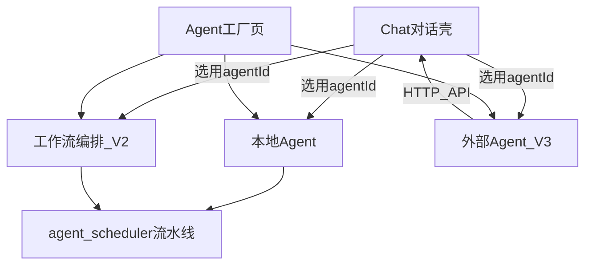

# Agent 产品规划（V1 / V2 / V3）

> Chat = 对话壳（类 ChatGPT）· Agent 页 = 智能体制造与管控  
> 流水线保留为**本地 Agent 的执行后端**，不再作为独立产品入口。  
> 工作流页已删除；编排在 Agent 页内完成。

---

## 总览

| 阶段 | 用户价值 | 状态 |
|------|----------|------|
| **V1** | 可定义多个本地 Agent；Chat 选用后按配置对话 | **完成** |
| **V2** | Agent 可挂多步本地编排（ASR/LLM/TTS） | **完成** |
| **V3** | 管控外部 OpenAI 兼容 Agent | **完成** |

---

## 角色已并入

原「角色管理」不再作为独立入口。人设字段（systemPrompt / voiceId / temperature / topP / mood）就是 Agent 的一部分：

- 默认种子含原角色 id：`assistant`（季莹莹）、`socrates`、`counselor`
- 老用户 `nuwa-character` 一次性迁移为 `kind: 'local'` Agent（`nuwa_agent_character_migrated`）
- Chat 会话绑定 `agentId`；`characterId` 仅作导出兼容别名
- `/characters` → `/agents`

详见 `docs/features/agent-character-merge.md`。

---

## V1 — 本地 Agent 工厂 + Chat 调用

- IndexedDB `nuwa-agent`、AgentsPage CRUD、Chat 选用、删 Workflow  
- 验收：已全部勾选

---

## V2 — 本地编排（工作流能力并入 Agent）

- `kind: 'workflow'` + `steps[]`（asr / llm / tts，可排序）  
- 预设链：纯对话 / 对话+朗读 / 听→想→说 / 仅转写 / 仅合成  
- `resolvePipelineFromSteps` 映射到后端固定流水线；Chat 仍用 `text_chat_stream` 拿 token，含 TTS 步骤则自动朗读  
- 「从角色导入」已删除（角色迁移后语义消失）  

验收：

- [x] 可创建 workflow Agent 并编辑步骤  
- [x] Chat 选用后按步骤决定是否自动 TTS  
- [x] 角色并入后无需「从角色导入」  

---

## V3 — 外部 Agent

- `kind: 'external'`：`endpoint`、`externalModel`、`protocol: openai-compatible`  
- API Key **仅 localStorage**（`nuwa_agent_secret:{id}`），不进 IndexedDB / 不发 Nuwa 后端  
- AgentsPage：连通性测试（`/models` 或迷你 completion）  
- Chat：`streamOpenAICompatible` SSE 流式  

验收：

- [x] 可配置并测试外部端点  
- [x] Chat 选用外部 Agent 后走远程流式  
- [x] 密钥不落 Agent JSON 导出（仅本机）  

---

## 关键代码

| 模块 | 路径 |
|------|------|
| 类型 | `store/types.ts` |
| Store | `store/agentStore.ts` |
| 工作流映射 | `lib/agentWorkflow.ts` |
| 外部客户端 | `lib/externalAgent.ts` |
| UI | `components/AgentsPage.tsx` |
| Chat 调用 | `components/chat/useAssistantStream.ts` |
